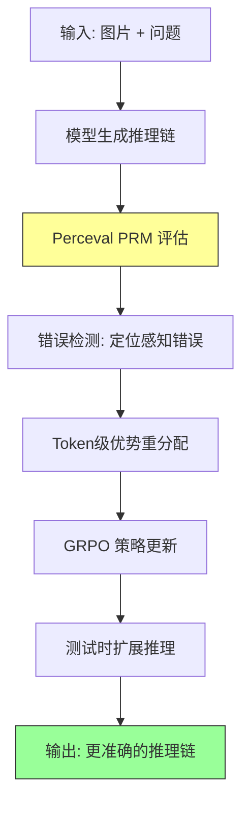

# Improving Vision-language Models with Perception-centric Process Reward Models (Perceval)

## Paper Metadata

| 项目 | 内容 |
|------|------|
| **Title** | Improving Vision-language Models with Perception-centric Process Reward Models |
| **Authors** | Yingqian Min\*, Kun Zhou\*, Yifan Li\*, Yuhuan Wu, Han Peng, Yifan Du, Wayne Xin Zhao†, Min Yang, Ji-Rong Wen |
| **Affiliations** | Renmin University of China, Bytedance, UC San Diego, HKUST |
| **Venue** | arXiv 2026 |
| **Paper Link** | https://github.com/RUCAIBox/Perceval |
| **Code** | https://github.com/RUCAIBox/Perceval |

## One-Sentence Summary

Perceval 提出以感知为中心的过程奖励模型 (Perception-centric PRM)，通过对模型回复中与图像相关的 claim 逐条与视觉证据比对，输出包含感知错误的 token span，再将这些精准的错误定位信号注入 GRPO 的 token-level advantage 重分配，从而解决 RLVR 中 outcome-level supervision 过于粗粒度导致的 credit-assignment 困难。PRM 同样可用于推理阶段的 Truncate-then-Regenerate test-time scaling。

## Core Contributions

1. **提出 Perception-centric PRM (Perceval)** (Section 3.1): 设计了 error-finding schema，以 think-then-answer 的格式输出结构化的幻觉检测结果——从模型回复中提取每个 image-related claim，与图像视觉证据逐一比对，最终以 Python list 返回包含感知错误的 exact substrings。

2. **Token-level Advantage 重分配框架** (Section 3.2): 将 Perceval 的检测结果转化为 token-level binary mask，对 GRPO 的序列级 advantage 做 token 粒度的重分配，使被标记为幻觉的 token span 获得衰减（或更强负向）的学习信号，在保留序列级偏好的同时显式惩罚未 grounded 的内容。

3. **Test-time Scaling 策略** (Section 3.3): 提出 Truncate-then-Regenerate 和 Truncate-Thinking-then-Regenerate 两种推理阶段迭代精炼策略，利用 Perceval 的错误检测在自回归过程中截断并重新生成，以少量额外计算换取更强的视觉 grounding。

4. **"能力迁移"现象** (Section 4.2): 发现仅对 Visual Search 类感知任务施加 PRM token-level 监督，模型在 Math & Chart 等未施加干预的复杂推理领域也能持续提升——"把基础感知做扎实了，复杂推理自然受益"。

## Section Navigation

| 章节 | 文件 | 核心内容 |
|------|------|---------|
| Abstract | [00-abstract.md](sections/00-abstract.md) | 论文概述、核心思路：PRM 检测幻觉 span → token-level advantage 重分配 |
| 1. Introduction | [01-introduction.md](sections/01-introduction.md) | 稀疏奖励问题、感知中心 PRM 的动机、三项贡献 |
| 2. Preliminary | [02-preliminary.md](sections/02-preliminary.md) | VLM 架构、RLVR/GRPO 公式、过程奖励模型的形式化问题定义 |
| 3. Methodology | [03-methodology.md](sections/03-methodology.md) | Perceval 设计(Error-finding Schema + SFT)、Token-level Advantage、Test-time Scaling |
| 4. Experiments | [04-experiments.md](sections/04-experiments.md) | 实验设置、主结果表、Test-time Scaling 对比、Reward Hacking 分析、消融、Case Study |
| 5. Related Work & Conclusion | [05-related-conclusion.md](sections/05-related-conclusion.md) | VLM、RL for VLM、Multimodal RM 三条脉络 + 总结 |

## Key Numbers

| 指标 | 数值 |
|------|------|
| Backbone | Qwen2.5-VL 3B / 7B |
| PRM 版本 | Perceval 3B / 7B |
| Benchmark 数量 | 8 (V\*, MME-RealWorld-Lite, BLINK, MMStar, RealWorldQA, MathVista, MATH-Vision, ChartQA) |
| Baselines | 12 (VLM-R1, LMM-R1, R1-VL, Perception-R1, Jigsaw-R1, DeepEyes, PixelReasoner, Vision-R1, VL-Rethinker, VLAA-Thinker, OpenVLThinker, MM-Eureka) |
| 3B 平均提升 vs GRPO | Visual Search ~+4%, Math&Chart ~+3%, Perception-intensive ~+1% |
| 最佳 α (penalty strength) | 0.1 |
| PRM 训练流水线 | 4 阶段：Query Selection → Rollout Generation → Auto Annotation → SFT |
| Test-time Scaling k | 4 / 8 / 16 |

## Data Flow: Input → Intermediate → Output

## Pros/Cons & Future Work

### Strengths

1. **定位精准**: PRM 不输出标量分数，而是输出 exact substrings，token-level 的粒度远细于 outcome-level 或 step-level。
2. **训练推理双用**: 同一个 PRM 既可作为 GRPO 中的 token-level 信用分配器，也可作为 test-time 的 error corrector，设计统一。
3. **能力迁移**: 仅在感知任务上施加 PRM 监督，复杂推理任务也能受益——这说明感知是复杂推理的公共基础组件。
4. **抗 Reward Hacking**: 不输出直接标量分数，而是通过 token-level advantage 中间层间接干预，策略模型更难过拟合。
5. **简洁实用**: 截断-重新生成的策略无需额外训练，与模型原有分布对齐，稳定性好。

### Weaknesses / Limitations

1. **精确字符串匹配的脆弱性**: 幻觉 span 通过 exact string match 定位 token 位置，如果模型输出包含重复短语或 Perceval 返回的字符串无法完全匹配，mask 构建会失败。
2. **条件性使用**: 训练阶段 Perceval 仅用于感知相关数据，对复杂推理数据不做干预——虽然这证明了能力迁移，但也意味着复杂推理本身的幻觉可能未被直接纠正。
3. **没有做 step-level 验证**: PRM 做的是 claim-by-claim 校验而非 step-by-step 验证，对于某些依赖多步推导才能判断对错的步骤（如数学证明），当前方案无法处理。
4. **依赖强标注模型**: SFT 训练数据中的幻觉标注由 Gemini-2.5-Pro 等强模型生成，标注质量和一致性受限于这些模型的能力边界。
5. **Test-time 迭代延迟**: 每次截断后需要重新生成，k 次迭代可能带来显著的推理延迟，且在困难的 Pos 子任务上提升趋于饱和。

### Future Work

1. 探索更鲁棒的 token span 定位方式（如 fuzzy matching 或 token-level probability analysis）
2. 将 perception-centric PRM 扩展到 step-level process supervision，兼顾复杂逻辑链的验证
3. 减少对强标注模型的依赖——探索弱监督或自监督的 PRM 训练策略
4. 扩展到视频、多图等多模态场景的 process reward
5. 探索自适应 α 策略——不同任务/样本需要不同的惩罚强度

## Reading Q&A Record

| # | 问题 | 答案位置 | 解答 |
|---|------|---------|------|
| 1 | Perceval 与传统的 scalar PRM 的核心区别是什么？ | Section 3.1 | 传统 PRM 输出一个标量分数（整条回复或单步步骤的评分），而 Perceval 输出的是具体的错误子串列表。前者提供粗粒度的好坏判断，后者提供精确的错误定位。 |
| 2 | 为什么不用 Perceval 直接输出 reward score，而是用它构建 mask 来调整 advantage？ | Section 3.2, Figure 2 | 直接输出标量分数容易被 policy 过拟合（reward hacking）。Perceval 在 advantage 计算阶段间接干预——只对被标记为幻觉的 token 施加位置衰减——这种细粒度、间接的引导更难以被策略模型利用。Figure 2 中的稳定曲线证实了这一点。 |
| 3 | α=0.1 为什么是最优的？ | Section 4.3, Table 3 | α 太小 (0.03) 惩罚力度不够，对幻觉的纠正效果有限。α 太大 (0.3) 则"一棍子打死"整个标记的 span（包括句法必要但非幻觉的功能词），引入训练噪声。0.1 在两者之间取得平衡。 |
| 4 | 为什么仅对感知数据做 PRM 干预，复杂推理也能受益？ | Section 4.2, Table 1 | Math & Chart 类任务（如 MathVision、ChartQA）本质上依赖于精确的细粒度感知能力（如定位图表上的数据点、读取数值）。增强模型的底层感知精度，这一提升自然泛化到依赖感知的复杂推理任务。 |
| 5 | Truncate 和 Truncate-Thinking 哪个更好？ | Section 4.2, Table 2 | Truncate 整体更稳定，尤其在 k 较大时。作者认为 Truncate-Thinking 中的反思提示与模型训练分布不完全对齐，导致指令跟随质量下降。Truncate 让模型基于自己的上下文重新生成，更接近原始分布。 |
| 6 | 与 DeepEyes/PixelReasoner 的关系是什么？ | Section 4.2 讨论部分 | DeepEyes 和 PixelReasoner 依赖外部工具操作（zoom/crop）来辅助 object grounding。Perceval 的目标是增强模型的内在感知能力，在不依赖外部工具的情况下达到接近甚至超越的效果。 |
| 7 | Perceval 的训练数据从哪里来？ | Section 3.1 | 四阶段流水线：(1) 从 visual search 数据集 + 少量通用领域数据选 queries；(2) 用开源 VLM rollout 产生含幻觉的回复；(3) 用 Gemini-2.5-Pro 等强模型做 hallucination-focused 标注；(4) 标准 SFT 微调。 |
| 8 | GRPO vs 本方法的最本质差异是什么？ | Section 3.2, Eq.3 | GRPO: 每个 token 共享同一个序列级 advantage Â_i。本方法: hallucinated token 获得衰减后的 advantage Â'_i,t = Â_i - α · |Â_i|，正确 token 保持原始 advantage。本质上是将"一人犯错全队受罚"改为"谁犯错谁受罚"。 |

## Citation Landscape

### TLDR
> "Perceval is proposed, a process reward model (PRM) that enables token-level error grounding, which can extract image-related claims from the response and compare them one by one with the visual evidence in the image."

### Reference Grouping by Topic

**RLVR / GRPO Foundations**:
- DeepSeek-R1 [13], DeepSeekMath [33], Kimi K2 [35]

**VLM 训练 / RL for VLM**:
- VLM-R1 [34], LMM-R1 [30], R1-VL [47], Perception-R1 [45], Jigsaw-R1 [41], DeepEyes [56], PixelReasoner [37], Vision-R1 [14], VL-Rethinker [36], VLAA-Thinker [5], OpenVLThinker [8], MM-Eureka [28]

**Process Reward Models (LLM 侧)**:
- Math-Shepherd [39], Let's Verify Step by Step [21], Lessons of Developing PRMs [54]

**Multimodal Reward Models**:
- InternLM-XComposer2.5-Reward [46], StructVRM [49], R1-Reward [51], BaseReward [52]

**VLM Hallucination / Visual Grounding**:
- POPE [19], Object Hallucination in LVLMs [20, 22], Mitigating Hallucinations [1], When Modalities Conflict [53], VL-GenRM [48]

**Benchmarks**:
- V\* [42], MME-RealWorld [50], BLINK [11], MMStar [6], RealWorldQA [43], MathVista [26], MATH-Vision [38], ChartQA [27]

---

*Batch reading created on 2026-06-24*
