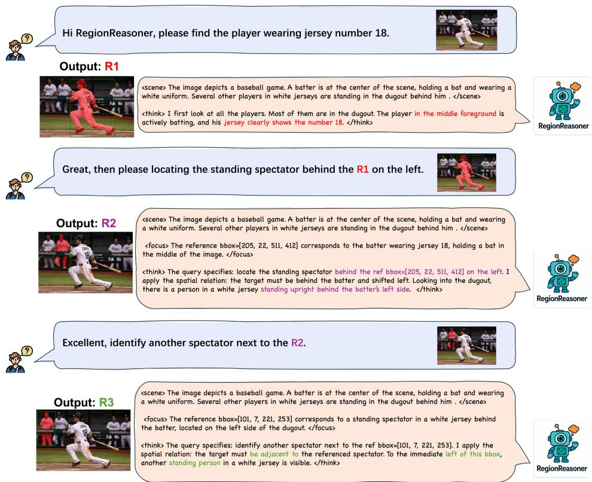
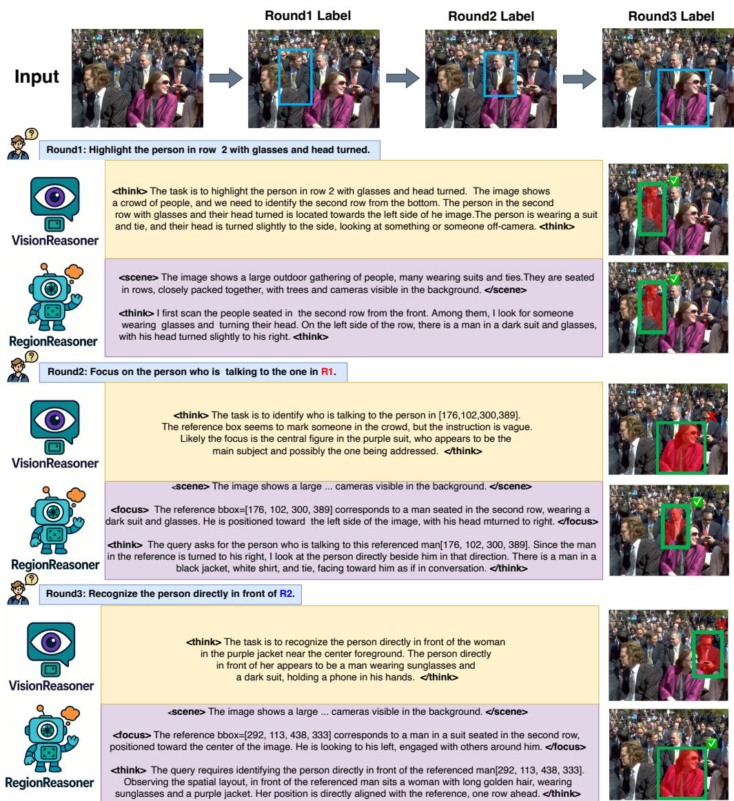
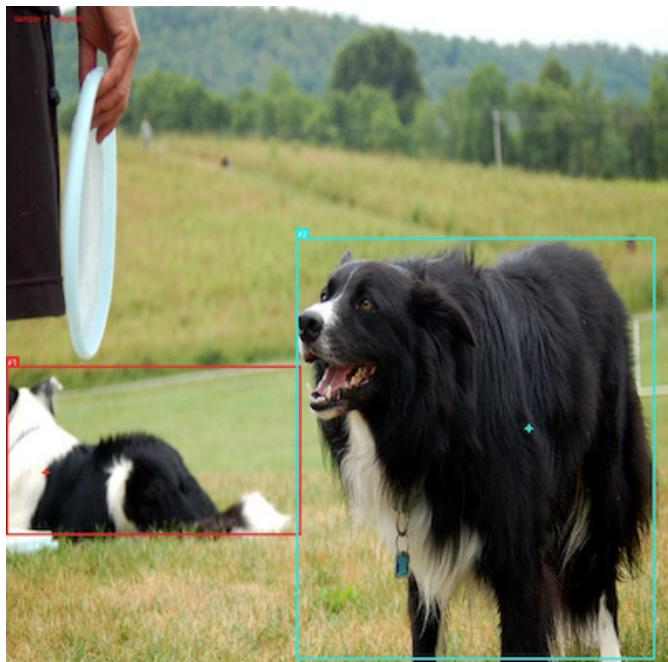
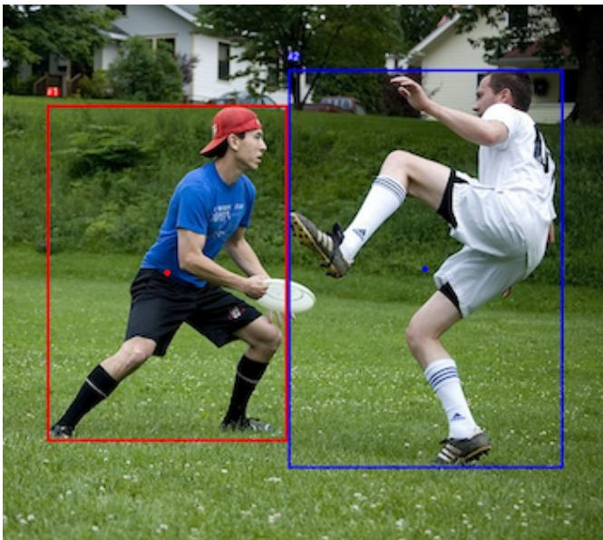
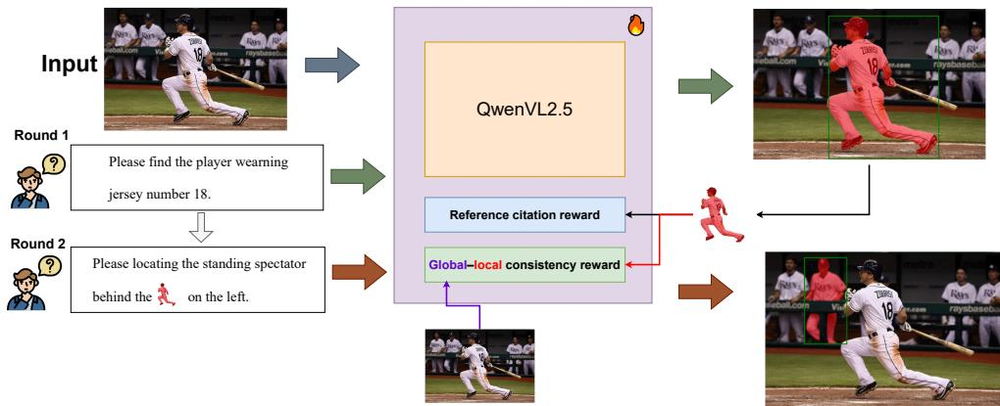
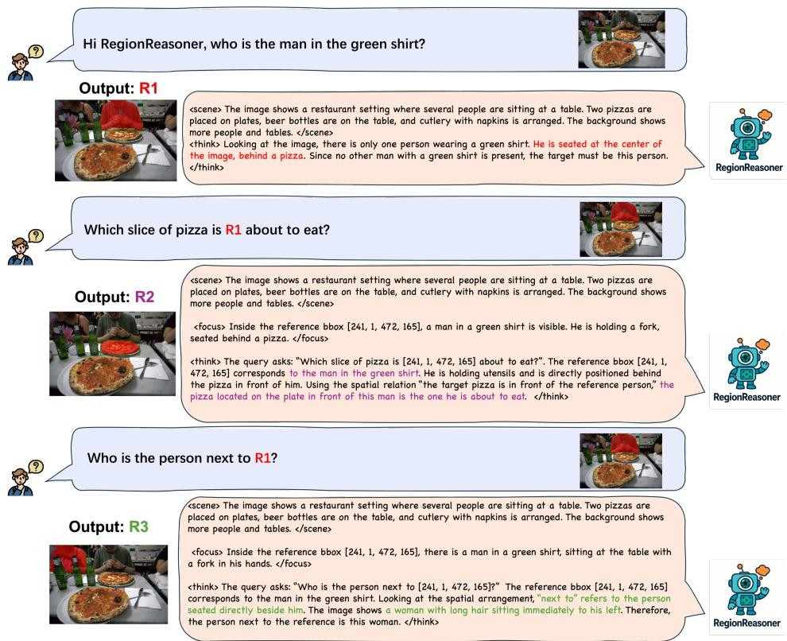
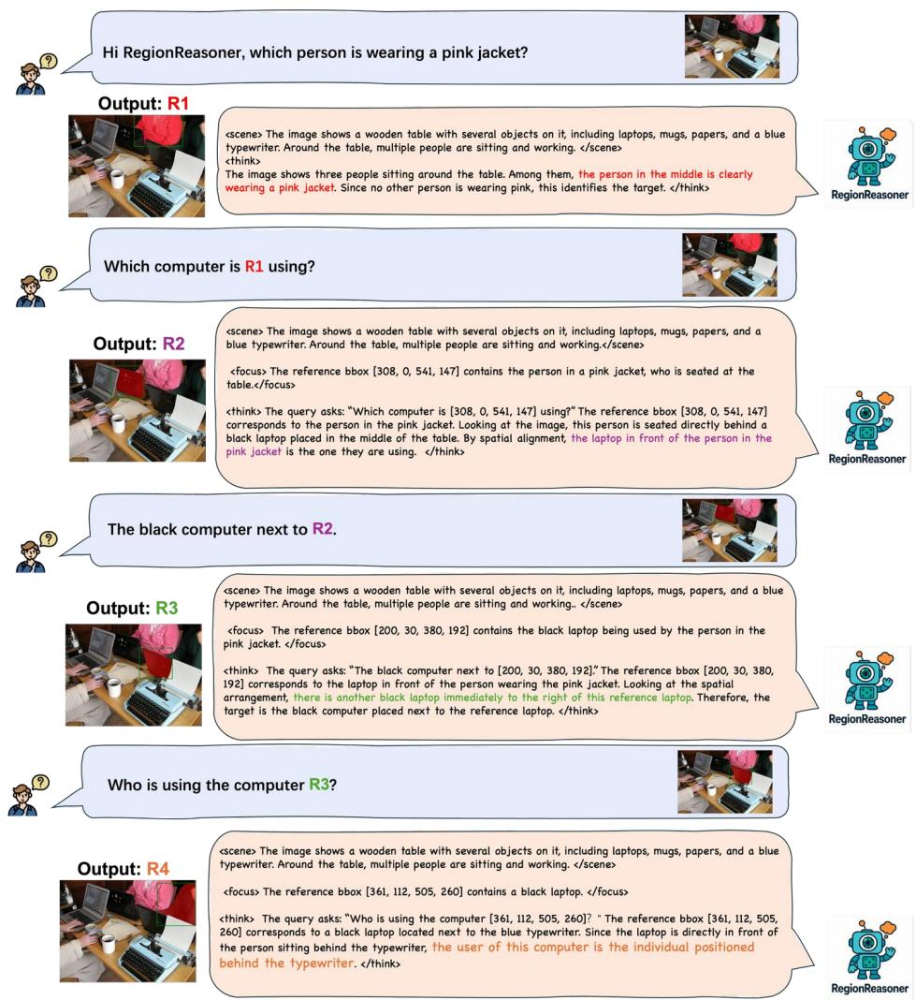

# REGIONREASONER: REGION-GROUNDED MULTI-ROUND VISUAL REASONING

Wenfang Sun∗,1 Hao Chen∗,2 Yingjun Du1 Yefeng Zheng†,3 Cees G. M. Snoek1

1University of Amsterdam 2Anhui University 3Westlake University

∗Equal contribution. †Corresponding author.

## ABSTRACT

Large vision-language models have achieved remarkable progress in visual reasoing, yet most existing systems rely on single-step or text-only reasoing, limiting their ability to iteratively refine understanding across multiple visual contexts. To address this limitation, we introduce a new multi-round visual reasoing benchmark with training and test sets spanning both detection and segmentation tasks, enabling systematic evaluation under iterative reasoing scenarios. We further propose RegionReasoer, a reinforcement learning framework that enforces grounded reasoing by requiring each reasoing trace to explicitly cite the corresponding reference bounding boxes, while maintaining semantic coherence via a global–local consistency reward. This reward extracts key objects and nouns from both global scene captions and region-level captions, aligning them with the reasoing trace to ensure consistency across reasoing steps. RegionReasoer is optimized with structured rewards combining grounding fidelity and global–local semantic alignment. Experiments on detection and segmentation tasks show that RegionReasoer-7B, together with our newly introduced benchmark RegionDial-Bench, considerably improves multi-round reasoing accuracy, spatial grounding precision, and global–local consistency, establishing a strong baseline for this emerging research direction. Our code is available at RegionReasoer.

## 1 INTRODUCTION

Recent advances in large Vision-Language Models have led to remarkable progress in multimodal reasoing tasks. Leading systems such as OpenAI GPT-4o/GPT-o1 (Hurst et al., 2024; Jaech et al., 2024), Gemini-2.5 (Gemini Team et al., 2023), DeepSeek (DeepSeek-AI et al., 2025; Wu et al., 2024) and VL-Rethinker (Wang et al., 2025a) have achieved state-of-the-art results on benchmarks including MathVista (Lu et al., 2024), MMMU (Yue et al., 2024), and MEGA-Bench (Chen et al., 2025). These methods follow a common paradigm: they first process multimodal inputs, extract textual cues, and then perform chain-of-thought reasoing (Wei et al., 2022) exclusively in the text space. Within the vision community, two particularly relevant lines have pushed the field forward. VisionReasoer (Liu et al., 2025b) showed that structured perception–reasoing with explicit output tags and reward shaping (e.g., format and geometric rewards) yields robust single-turn grounding and interpretable trajectories. SegLLM (Wang et al., 2025b) demonstrated that multi-round interaction is beneficial for challenging referring segmentation, organizing dialogue-style supervision and evaluation across turns.

VisionReasoer (Liu et al., 2025b) establishes a strong single-turn paradigm with structured tags and base rewards (format and geometry). However, when naively stacked into a multi-round protocol, two issues arise: (i) the framework does not require the reasoing to explicitly cite regions grounded in previous turns, so reference propagation across rounds is brittle—credit assignment becomes ambiguous and coordinate hallucinations are hard to detect; and (ii) its reward shaping primarily targets the final outputs (boxes/points) and tag validity, providing little signal to stabilize the reasoing trace itself as dialogue context accumulates, which leads to semantic drift between global descriptions and local evidence at deeper rounds. Conversely, SegLLM (Wang et al., 2025b) brings multi-round interaction into referring segmentation, but it does not model a thinking process: there is no explicit, verifiable reasoing trace to check whether references are truly used, no mechanism to enforce global–local semantic coherence, and no learning signal to shape intermediate steps; the supervision remains mask-centric and does not naturally extend to detection. These gaps motivate our design in Fig. 1: each round produces a structured trajectory (<scene>, <focus>, <think>, <answer>) with reference-grounded thinking and a global–local consistency signal; rewards act on the reasoing trace and the final prediction, enabling interpretable and verifiable multi-round grounding.

  
Figure 1: RegionReasoer in a three–round, region-grounded dialogue. At round t, the user query may refer to a region localized earlier (R1/R2). For each turn, RegionReasoer produces a structured trajectory: <scene> (global context), <focus> (caption restricted to the referenced region with serialized coordinates, e.g., bbox=[x1,y1,x2,y2]), <think> (reasoing that explicitly cites the reference and the required spatial relation), and <answer> (final localization). The example shows correct citation and stable multi-round grounding for “behind the R1 on the left” and “next to the R2”, illustrating how explicit reference use and coherent global–local descriptions support consistent localization as the dialogue deepens.

Building on these insights, we present RegionReasoer, a reinforcement learning-optimized framework that extends VisionReasoer’s structured outputs to the multi-round setting studied by SegLLM and directly addresses the limitations above. First, we introduce reference-grounded thinking: every reasoing step must explicitly cite the required reference bounding boxes in <think>. A dedicated citation reward and a penalty for missing or hallucinated citations make evidence use verifiable and stabilize reference propagation across rounds. Second, we propose a global–local consistency reward that aligns keywords from the global scene caption (<scene>) and region-level captions (<focus>) with the reasoing trace (<think>); a lightweight spatial/comparison/localization lexicon further encourages explicit relational language and reduces semantic drift as context accumulates. Third, we assemble RegionDial-Bench, a multi-round benchmark spanning detection and segmentation with per-turn metrics and train/evaluation splits constructed from public referring datasets, enabling quanti tative assessment of reasoing accuracy, grounding fidelity, and global–local alignment under iterative interaction. Taken together, these contributions complement VisionReasoer’s structured, rewardshaped formulation and SegLLM’s multi-round protocol by explicitly modeling and reinforcing the reasoing process across turns.

Our RegionReasoer is trained with reinforcement learning using structured rewards that target grounding fidelity, global–local semantic alignment, and task correctness. On RegionDial-Bench,

RegionReasoer consistently outperforms strong Vision-Language Models and task-specific baselines on both referring segmentation and detection. Two empirical patterns emerge: (i) gains are most pronounced at later turns, reflecting slower error accumulation and more stable reference propagation; and (ii) the signals act complementarily—reference citation chiefly reduces coordinate hallucinations and improves reuse/refinement of prior regions, while global–local consistency stabilizes the semantics of the reasoing trace in scenes with weak spatial cues. Ablations corroborate these trends, with the combined signals delivering the strongest multi-round performance and qualitative trajectories showing verifiable citations and coherent scene–region descriptions across turns.

## 2 RELATED WORK

Post-training for vision-language models. Post-training techniques, including instruction tuning and reinforcement learning (RL), have become essential for adapting large Vision-Language Models (VLMs) to complex multimodal reasoing tasks. Early efforts such as LLaVA (Liu et al., 2023), LLaVA-OV (Li et al., 2024), Infinity-MM (Gu et al., 2024), MAmmoTH-VL (Guo et al., 2025) , LISA (Lai et al., 2024), PixelLM (Ren et al., 2024), and GLAMM (Rasheed et al., 2024) demonstrate that scaling instruction-tuning datasets and diversifying task formats can significantly improve generalization across multimodal benchmarks. More recent work, such as VL-Rethinker (Wang et al., 2025a), further explores post-training for reasoing, introducing techniques like selective sample replay to address instability in RL optimization. Unlike these approaches, which mainly focus on single-pass or text-only reasoing, our work enforces explicit spatial grounding and global–local consistency within multi-round visual reasoing.

Reinforcement learning for multimodal reasoing. RL has emerged as a powerful tool for enhancing the reasoing and decision-making of VLMs. Vision-R1 (Huang et al., 2025) and Video-R1 (Feng et al., 2025) integrate RL to improve spatial grounding and temporal reasoing, respectively, while VLM-R1 (Shen et al., 2025) applies RL to fine-grained grounding tasks. Pixel Reasoer (Su et al., 2025) further incentivizes pixel-space reasoing with curiosity-driven exploration. Visionary-R1 (Xia et al., 2025) mitigates shortcut behaviors in visual reasoing with explicit RL signals, and the Self-Rewarding VLM (Li et al., 2025) adopts a reasoing-decomposition strategy where the model first generates image captions before deriving answers. Other efforts, such as OpenVLThinker (Deng et al., 2025) and LMM-R1 (Peng et al., 2025), adopt policy optimization methods like PPO (Schulman et al., 2017) to train VLMs as interactive decision-makers. Despite these advances, most RL-based approaches focus on single-pass reasoing or rely on textualized visual inputs, limiting their ability to enforce explicit spatial grounding or multi-step consistency. In contrast, RegionReasoer leverages RL to jointly optimize multi-round reasoing accuracy, region-level grounding fidelity, and global–loca semantic alignment, providing a more structured training signal than prior RL-based methods.

Multi-round visual understanding. SegLLM (Wang et al., 2025b) explores multi-round interaction for referring segmentation and shows the value of dialogue-style supervision and evaluation, but it does not model explicit reasoing trajectories or incorporate RL signals, making it difficult to verify evidence use or enforce global–local semantic coherence. VisionReasoer (Liu et al., 2025b) provides structured, reward-shaped perception–reasoing in a single-turn setting without reference propagation across rounds. In this context, SegLLM also releases a multi-round segmentation benchmark; our RegionDial-Bench complements it by adding explicit reasoing-oriented design and per-turn evaluation for both referring detection and referring segmentation, enabling analysis of reasoing accuracy, grounding fidelity, and global–local alignment under iterative interaction.

## 3 PROBLEM FORMULATION WITH REGIONDIAL-BENCH

Multi-round region-grounded reasoing. Given an image I and a dialogue of T turns with queries $\{ q _ { t } \} _ { t = 1 } ^ { T }$ , a model interacts with the visual scene over multiple turns. Each turn t may include a set of reference boxes $\boldsymbol { B } _ { t } ^ { \mathrm { r e f } } = \{ [ x _ { 1 } , y _ { 1 } , x _ { 2 } , y _ { 2 } ] \}$ } that are propagated from earlier turns or externally provided, specifying regions that subsequent queries should condition on. Let $\mathcal { M } _ { t - 1 }$ denote the dialogue memory up to turn t−1 (e.g., previously localized regions or textual context). A policy πθ produces a turn-level output

$$
o _ { t } \sim \pi _ { \theta } \big ( \cdot \mid I , q _ { t } , \mathcal { B } _ { t } ^ { \mathrm { r e f } } , \mathcal { M } _ { t - 1 } \big ) ,
$$

where $o _ { t }$ instantiates the task-specific prediction at turn t (e.g., a 2D bounding box for detection, a point/mask for segmentation, or a count). The memory is updated as $\mathscr { M } _ { t } = \mathscr { M } _ { t - 1 } \cup \{ \left( q _ { t } , o _ { t } \right) \}$ to enable reference propagation across turns. An episode ends at $T ;$ evaluation is conducted per turn and aggregated over the dialogue.

Tasks: detection and segmentation. We consider two instantiations of $o _ { t } \colon$ (i) referring detection, where $o _ { t }$ is a 2D box for the referred region; and (ii) referring segmentation, where $o _ { t }$ is a sparse point or mask for the referred region. Later turns may refer to regions predicted earlier via $\boldsymbol { B } _ { t } ^ { \mathrm { r e f } }$ . For detection, we report per-turn AP at $\mathrm { \Delta [ o U = 0 . 5 ( A P _ { 5 0 } ) }$ and the average across turns. For segmentation, we report per-turn generalized IoU (gIoU) averaged over images and then over turns.

RegionDial-Benchmark. To operationalize this setting, we construct a multi-round benchmark, dubbed RegionDial-Bench , from the public referring-expression datasets RefCOCO+ and Ref-COCOg. These corpora are built on the MSCOCO image backbone and provide (i) high-quality instance-level bounding boxes and segmentation masks, (ii) human-written referring expressions that are tightly aligned with individual objects, and (iii) multiple expressions per image. This combination makes them particularly well-suited for constructing dialogue-style multi-round grounding tasks without introducing new annotations or relying on synthetic text. In RegionDial-Bench , we consolidate image-wise related expressions into dialogues and rewrite later turns to include explicit references to previously localized boxes. Concretely, our resource contains RefCOCO+ Multi-turn (715 images, 2355 turns) and $R e f C O C O g$ Multi-turn (1,580 images, 4405 turns). Training dialogues are generated by decomposing multi-object instructions and propagating ground-truth references to later turns; test dialogues use model-predicted references, so errors made at early turns can propagate through the dialogue. Construction rules, spatial-relation templates, statistics, and examples are detailed in Appendix B, which also discusses how the same procedure can be extended to other referring-expression datasets with sufficiently dense annotations.

## 4 REGIONREASONER

In this section, we present RegionReasoer and its reinforcement learning framework for multiround visual reasoing. We first formalize the end-to-end pipeline (§4.1), then describe the model architecture and structured I/O design (§4.2). We next detail the reference-grounded and global–local consistency rewards (§4.3), and finally outline the training procedure (§4.4). An overview of the complete framework is provided in Appendix Figure D.

## 4.1 PIPELINE FORMULATION

Inputs and state. At turn $t ,$ the agent observes the image I, the current textual query $q _ { t } .$ , an optional set of reference boxes $\boldsymbol { B _ { t } ^ { \mathrm { r e f } } } = \{ [ x _ { 1 } ^ { ( \overline { { k } } ) } , y _ { 1 } ^ { ( k ) } , x _ { 2 } ^ { ( k ) } , y _ { 2 } ^ { ( k ) } ] \}$ (propagated or newly provided), and a memory $\mathcal { M } _ { t - 1 }$ that stores structured outputs from previous turns. We serialize $B _ { t } ^ { \mathrm { r e f } }$ and $\mathcal { M } _ { t - 1 }$ into the prompt to make them available to the model.

Policy and action space. RegionReasoer is an auto-regressive VLM policy $\pi _ { \theta }$ that generates a structured text action composed of four tagged blocks $y _ { t } = ( s _ { t } , f _ { t } , h _ { t } , a _ { t } )$ with tags <scene>, <focus>, <think>, <answer>. Let $y _ { t } = \left( w _ { t , 1 } , \ldots , w _ { t , N _ { t } } \right)$ denote the token sequence for the whole action; then

$$
\pi _ { \theta } ( y _ { t } \mid I , q _ { t } , \boldsymbol { \mathcal { B } } _ { t } ^ { \mathrm { r e f } } , \boldsymbol { \mathcal { M } } _ { t - 1 } ) = \prod _ { n = 1 } ^ { N _ { t } } \pi _ { \theta } \big ( w _ { t , n } \mid I , q _ { t } , \boldsymbol { \mathcal { B } } _ { t } ^ { \mathrm { r e f } } , \boldsymbol { \mathcal { M } } _ { t - 1 } , w _ { t , < n } \big ) .\tag{1}
$$

Constrained decoding enforces the tag schema and JSON validity for $< \mathrm { a n s w e r } >$ , while allowing free-form natural language in <scene>, <focus>, and ${ \tt < t h i n k > }$

Turn update and termination. After decoding finishes (upon emitting the end token or the closing $< / \alpha \mu \mathrm { e r } > \mathrm { t a g } )$ , we parse $a _ { t }$ to obtain task outputs (e.g., 2D boxes or points) and update the memory:

$$
\mathcal { M } _ { t } = \mathcal { M } _ { t - 1 } \cup \{ ( s _ { t } , f _ { t } , h _ { t } , a _ { t } ) \} .\tag{2}
$$

A multi-round episode consists of $T$ turns (fixed or query-driven). The per-turn reward $R ( t )$ is computed from $\left( { { s _ { t } } , { f _ { t } } , { h _ { t } } , { a _ { t } } } \right)$ and aggregated across turns (Sec. 4.3, 4.4).

Compact notation for the loop. For brevity, we denote the one-turn transition produced by the policy as

$$
\begin{array} { r } { ( s _ { t } , f _ { t } , h _ { t } , a _ { t } ) \sim \pi _ { \theta } \big ( \cdot \big | I , q _ { t } , \mathcal { B } _ { t } ^ { \mathrm { r e f } } , \mathcal { M } _ { t - 1 } \big ) , \qquad \mathcal { M } _ { t }  \mathcal { M } _ { t - 1 } \cup \{ ( s _ { t } , f _ { t } , h _ { t } , a _ { t } ) \} . } \end{array}\tag{3}
$$

## 4.2 REGIONREASONER MODEL

Unified perception–reasoing backbone. RegionReasoer extends the unified perception–reasoing framework of VisionReasoer (Liu et al., 2025b) to a multi-round setting, where each turn emits a structured and verifiable trajectory. The model is initialized from a large VLM backbone and performs chain-of-thought reasoing purely in text, while remaining explicitly grounded to image regions through serialized bounding-box references. Each turn-t output is organized into four tagged blocks: a global scene caption $s _ { t }$ (<scene>), a localized caption $f _ { t }$ tied to a provided reference box (<focus>, optional), a reasoing trace $h _ { t } \ ( < \mathrm { t h i n k } > )$ , and a JSON answer $a _ { t } \ ( < \mathsf { a n s w e r } > )$ Constrained decoding with schema and tag guards ensures format validity, supports automatic post-hoc parsing, and prevents untagged content from leaking into $< \mathsf { a n s w e r } >$

Reference-grounded thinking. To improve verifiability and reduce free-form hallucination, RegionReasoer requires that reasoing must cite evidence. When a query specifies references, the prompt encodes the set $\boldsymbol { B _ { t } ^ { \mathrm { r e f } } } = \{ [ x _ { 1 } ^ { ( \bar { k } ) } , y _ { 1 } ^ { ( k ) } , x _ { 2 } ^ { ( k ) } , y _ { 2 } ^ { ( k ) } ] \}$ in a canonical textual form and instructs the model to reaso with verbatim coordinate mentions inside <think>. The same coordinates are injected in $q _ { t }$ so attention aligns with the intended regions across turns. During decoding, $h _ { t }$ must explicitly reference the used boxes and, when relevant, name spatial relations $( \mathrm { e . g . , \ ^ { 6 6 } t o }$ the right of bbox $[ x _ { 1 } , y _ { 1 } , x _ { 2 } , y _ { 2 } ] ^ { \mathfrak { P } } )$ . This design yields a causal chain from evidence to conclusion that is parsable into cited coordinates $\boldsymbol { S } ( \boldsymbol { h } _ { t } )$ and directly comparable to $B _ { t } ^ { \mathrm { r e f } }$ , enabling automatic grounding checks and precise credit assignment in RL. In multi-round interaction, previously cited boxes can be re-used or refined; the explicit citation acts as a stable interface across turns, which improves temporal coherence of the reasoing trajectory and curbs region drift.

Global–local semantic consistency. Iterative reasoing often breaks down when global descriptions and local evidence diverge; to prevent this, RegionReasoer jointly produces $s _ { t }$ (global) and $f _ { t }$ (localized to the reference) before generating $h _ { t } .$ , and then enforces that the semantics of $s _ { t }$ and $f _ { t }$ are reflected within $h _ { t }$ . Concretely, a lightweight deterministic pipeline extracts keyword sets $\kappa ( s _ { t } )$ $\mathcal { K } ( f _ { t } )$ , and $\displaystyle \kappa ( h _ { t } )$ (lowercasing, stop-word removal, lemmatization, and a noun/object filter). We later compute asymmetric overlaps $\mathrm { O v } ( s _ { t } , h _ { t } )$ and $\operatorname { O v } ( f _ { t } , h _ { t } )$ as part of the reward (Sec. 4.3), pushing the model to propagate entities and relations from the global and local captions into the reasoing itself. Making <think> the alignment nexus—rather than correcting only at the final answer—yields finer-grained RL signals, better consistency across turns, and improved spatial reasoing, especially when $h _ { t }$ is encouraged to include localization lexicon (e.g., left/right/inside/overlap/next to) together with explicit box mentions.

Task output without extra heads. Detection and segmentation are expressed directly through the JSON <answer> without introducing task-specific heads. For segmentation, we use sparse point\_2d outputs to probe masks following our benchmark protocol; evaluation employs IoU/Dice or point-based matching as appropriate. This head-free design keeps the learning signal unified: structural validity and geometric precision are attributed to <answer>, while grounding fidelity and global–local agreement are attributed to <think> in conjunction with <scene> and <focus>. The result is a closed loop where interpretable trajectories, verifiable references, and final predictions are optimized jointly under multi-round supervision.

## 4.3 REWARD FUNCTIONS

We optimize RegionReasoer with reinforcement learning, shaping both intermediate reasoing and final predictions. Besides the base rewards inherited from prior work (Liu et al., 2025b), Thinking Format, Answer Format, Non-Repeat, Bboxes $I o U ,$ Bboxes $L l ,$ and Points $L l ,$ we introduce two multi-round objectives that explicitly encode (i) citation of required references inside the reasoing trace and (ii) semantic alignment between global and local evidence.

Notation. At turn $t ,$ the model outputs st (<scene>), $f _ { t }$ (<focus> if any), $h _ { t }$ (<think>), and $a _ { t }$ (<answer>). Required references are $B _ { t } ^ { \mathrm { r e f } } = \{ b _ { k } ^ { \mathrm { r e f } } \}$ (possibly empty). A lightweight extractor $\kappa ( \cdot )$

returns keyword sets (lowercasing, stop-word removal, lemmatization, noun/object filter). We parse bbox mentions from $h _ { t }$ as $\boldsymbol { S } ( \boldsymbol { h } _ { t } )$ and use k $\nu ( h _ { t } ) \in \{ 0 , 1 \}$ to flag bbox-related tokens.

Reference citation reward. To make the reasoing verifiable and grounded, the trace must explicitly cite the referenced boxes when they are required. We reward correct citation and penalize hallucinated coordinates:

$$
\begin{array}{c} R _ { \mathrm { r e f } } ( t ) = \left\{ \begin{array} { l l } { 1 , } & { \mathcal { B } _ { t } ^ { \mathrm { r e f } } = \mathcal { Q } , } \\ { \lambda \ker ( h _ { t } ) + \mu \frac { \left| S ( h _ { t } ) \cap \mathcal { B } _ { t } ^ { \mathrm { r e f } } \right| } { \operatorname* { m a x } \left( \left| \mathcal { S } ( h _ { t } ) \right| , 1 \right) } , } & { \mathrm { o t h e r w i s e } , } \end{array} \right. R _ { \mathrm { r e f } } ( t ) \gets \left\{ \eta R _ { \mathrm { r e f } } ( t ) , \quad \mathcal { S } ( h _ { t } ) \setminus \mathcal { B } _ { t } ^ { \mathrm { r e f } } \neq \mathcal { Q } ,  \\ { R _ { \mathrm { r e f } } ( t ) , } & { \mathrm { o t h e r w i s e } , } \end{array} \right.\tag{4}
$$

with $\lambda = \mu = 1 . 0 , \eta = 0 . 5$ , and clipping $R _ { \mathrm { r e f } } ( t ) \in [ 0 , 2 ]$

Global–local consistency reward. To keep the reasoing coherent with both global scene context and localized evidence, we align $h _ { t }$ with $s _ { t }$ and (when present) $f _ { t }$ . Let the asymmetric keyword overlap be

$$
\operatorname { O v } ( X , Y ) = { \frac { { \big | } { K ( X ) } \cap { K ( Y ) } { \big | } } { \operatorname* { m a x } { \big ( } { \big | } { K ( X ) } { \big | } , 1 { \big ) } } } .\tag{5}
$$

We also include a light logic prior $\ell ( h _ { t } ) \in [ 0 , 1 ]$ counting spatial/comparison/localization terms (capped at 1). The consistency reward is

$$
R _ { \mathrm { c o n s } } ( t ) = w _ { s } \mathrm { ~ O v } ( s _ { t } , h _ { t } ) + w _ { f } \} \times \left[ \mathcal { B } _ { t } ^ { \mathrm { r e f } } \neq \emptyset \right] \mathrm { O v } ( f _ { t } , h _ { t } ) + w _ { \ell } \ell ( h _ { t } ) ,\tag{6}
$$

with $w _ { s } = 1 . 0 , w _ { f } = 0 . 6 , w _ { \ell } = 0 . 4 , \mathrm { c l i p p e d t o } [ 0$ , 2].

Total per-turn objective and episode return. Let $R _ { \mathrm { b a s e } } ( t )$ denote the base rewards from (Liu et al., 2025b) (Thinking/Answer Format, Non-Repeat, Bboxes IoU/L1, Points L1). The per-turn reward aggregates as

$$
R ( t ) = R _ { \mathrm { b a s e } } ( t ) + \alpha R _ { \mathrm { r e f } } ( t ) + \beta R _ { \mathrm { c o n s } } ( t ) ,\tag{7}
$$

where $\alpha = \beta = 1$ by default. Each component is normalized to [0, 2] prior to aggregation to balance scales, and the episode return is $\textstyle \sum _ { t } R ( { \bar { t } } )$ over turns. Compared to baselines, these rewards are used only as internal training signals; all evaluation metrics remain purely geometry-based (AP and gIoU) and are computed identically for all models.

## 4.4 TRAINING

We optimize the policy $\pi _ { \theta }$ with GRPO (Shao et al., 2024) over multi-turn rollouts. For each batch, the model generates structured actions $y _ { t } ~ = ~ ( s _ { t } , f _ { t } , h _ { t } , a _ { t } )$ at turns $t = 1 \dots T$ conditioned on $( I , q _ { t } , \bar { B _ { t } ^ { \mathrm { r e f } } } , \mathcal { M } _ { t - 1 } )$ as defined in Sec. 4.1. Per-turn rewards follow the decomposition in Sec. $4 . 3 { \ - } - R _ { \mathrm { b a s e } } , R _ { \mathrm { r e f } } , R _ { \mathrm { c o n s } ^ { - } }$ —with componentwise normalization to [0, 2]; the episode return is $\textstyle \sum _ { t = 1 } ^ { T } R ( t )$

Objective. We optimize the clipped policy objective GRPO (Shao et al., 2024) on the autoregressive likelihood of the structured action (cf. equation 1):

$$
\begin{array} { r } { \mathcal { L } _ { \mathrm { c l i p } } ( \theta ) = \mathbb { E } \Big [ \operatorname* { m i n } \Big ( \rho _ { t } ( \theta ) \hat { A } _ { t } , \ \mathrm { c l i p } \big ( \rho _ { t } ( \theta ) , 1 - \epsilon , 1 + \epsilon \big ) \hat { A } _ { t } \Big ) \Big ] , \quad \rho _ { t } ( \theta ) = \frac { \pi _ { \theta } \big ( y _ { t } \big | I , q _ { t } , \mathcal { B } _ { t } ^ { \mathrm { r e f } } , \mathcal { M } _ { t - 1 } \big ) } { \pi _ { \theta _ { \mathrm { o l d } } } \big ( y _ { t } \big | I , q _ { t } , \mathcal { B } _ { t } ^ { \mathrm { r e f } } , \mathcal { M } _ { t - 1 } \big ) } . } \end{array}
$$

Advantage estimation and value targets. Let $s _ { t } = ( I , q _ { t } , B _ { t } ^ { \mathrm { r e f } } , \mathcal { M } _ { t - 1 } )$ denote the turn-t state and $r _ { t }$ the per-turn reward. We use a learned value head $V _ { \phi } ( s )$ and compute advantages with GAE:

$$
\delta _ { t } = r _ { t } + \gamma V _ { \phi } ( s _ { t + 1 } ) - V _ { \phi } ( s _ { t } ) , \hat { A } _ { t } = \sum _ { l = 0 } ^ { T - t } ( \gamma \lambda ) ^ { l } \delta _ { t + l } .
$$

Each dialogue is a finite episode; the last turn $T$ is terminal, so we set

$$
V _ { \phi } ( s _ { T + 1 } ) = 0 .
$$

The value target is $\hat { R } _ { t } = \hat { A } _ { t } + V _ { \phi } ( s _ { t } )$ and the critic is trained with $\begin{array} { r } { \mathcal { L } _ { \mathrm { v a l u e } } = \frac { 1 } { 2 } ( V _ { \phi } ( s _ { t } ) - \hat { R } _ { t } ) ^ { 2 } } \end{array}$ . We add a small entropy bonus to encourage exploration and, optionally a KL penalty to a frozen reference policy for stability:

$$
\begin{array} { r } { \mathcal { L } _ { \mathrm { t o t a l } } = \mathcal { L } _ { \mathrm { c l i p } } + c _ { v } \mathcal { L } _ { \mathrm { v a l u e } } - c _ { e } \mathbb { H } [ \pi _ { \theta } ( \cdot | s _ { t } ) ] + \beta \operatorname { K L } ( \pi _ { \theta } ( \cdot | s _ { t } ) \| \pi _ { \mathrm { r e f } } ( \cdot | s _ { t } ) ) . } \end{array}
$$

Table 1: Detection on RegionDial-Bench with 7-round dialogues. Columns report per-round AP (R1–R7) and the mean across turns for RefCOCO+ Multi-turn and RefCOCOg Multi-turn. RegionReasoer-7B achieves the top averages on both splits and maintains larger margins at later rounds, reflecting stronger robustness to error accumulation.
<table><tr><td rowspan="2">Method</td><td colspan="8">RefCOCO+ Multi-turn (AP ↑)</td><td colspan="8">RefCOCOg Multi-turn (AP ↑)</td></tr><tr><td>R1</td><td>R2</td><td>R3</td><td>R4</td><td>R5</td><td>R6</td><td>R7</td><td>Avg</td><td>R1</td><td>R2</td><td>R3</td><td>R4</td><td>R5</td><td>R6</td><td>R7</td><td>Avg</td></tr><tr><td>Qwen2-VL-7B</td><td>6.2</td><td>8.5</td><td>6.5</td><td>5.4</td><td>7.5</td><td>3.6</td><td>3.5</td><td>6.7</td><td>7.8</td><td>6.2</td><td>3.5</td><td>3.5</td><td>5.6</td><td>4.0</td><td>5.0</td><td>6.1</td></tr><tr><td>Qwen2.5-VL-7B</td><td>65.5</td><td>49.0</td><td>48.1</td><td>36.5</td><td>30.0</td><td>38.2</td><td>25.9</td><td>49.9</td><td>63.9</td><td>43.7</td><td>39.0</td><td>37.9</td><td>42.2</td><td>43.2</td><td>33.8</td><td>49.7</td></tr><tr><td>Seg-Zero-7B</td><td>90.5</td><td>71.2</td><td>73.6</td><td>59.6</td><td>48.8</td><td>58.2</td><td>48.2</td><td>73.1</td><td>85.3</td><td>61.8</td><td>61.6</td><td>64.8</td><td>70.0</td><td>69.6</td><td>68.8</td><td>71.1</td></tr><tr><td>VisionReasoer-7B</td><td>88.3</td><td>74.7</td><td>75.8</td><td>64.2</td><td>56.3</td><td>57.3</td><td>47.0</td><td>74.8</td><td>85.0</td><td>65.8</td><td>66.8</td><td>69.3</td><td>68.3</td><td>75.2</td><td>72.5</td><td>73.6</td></tr><tr><td>RegionReasoer -7B</td><td>89.3</td><td>83.2</td><td>81.6</td><td>69.6</td><td>61.9</td><td>69.1</td><td>64.7</td><td>80.7</td><td>87.1</td><td>73.7</td><td>71.8</td><td>68.6</td><td>75.0</td><td>78.4</td><td>75.0</td><td>78.2</td></tr></table>

A sliding memory $\mathcal { M } _ { t - 1 }$ preserves prior turns under context budget, and a light turn-depth curriculum gradually increases the maximum $T$ early in training. Constrained decoding enforces tag/schema and JSON validity so that rewards are well-defined both for intermediate reasoing (<scene>/<focus>/<think>) and final outputs (<answer>). Compared to SegLLM (Wang et al., 2025b), which performs multi-round segmentation without explicit reasoing traces or RL, our training aligns interpretable, reference-grounded thinking with global–local consistency under a unified multi-round objective.

## 5 EXPERIMENTS

## 5.1 EXPERIMENTAL SETTINGS

Benchmark and protocol. We evaluate under the multi-round setting in Sec. 3 on RegionDial-Bench (RefCOCO+ / RefCOCOg Multi-turn). Detailed descriptions of the dataset construction procedure, together with quantitative statistics, are provided in Appendix B. In addition, following the evaluation protocol of VisionReasoer (Liu et al., 2025b), we also report results under the single-round setting.

Base model. RegionReasoer-7B is initialized from Qwen2.5-VL-7B (Bai et al., 2025) (7B parameters). We keep the vision–language backbone intact and optimize it end-to-end with reinforcement learning; no additional task-specific heads are introduced.

Implementation details. RegionReasoer-7B is trained with GRPO (Shao et al., 2024) using the rewards in Sec. 4.3. Constrained decoding enforces tag/schema validity and JSON correctness. We use the backbone’s vision tokenizer and input resolution; the maximum turn depth T matches the dialogue length. Training uses a global batch size of 16 with K=8 rollout samples per prompt (per step). The initial learning rate is $1 \times 1 0 ^ { - 6 }$ with weight decay 0.01. All experiments run on 4× NVIDIA H100 GPUs; total training time is about 10 hours. Unless noted, we fix random seeds and use identical multi-turn contexts and references across methods; shared evaluation scripts ensure consistent aggregation.

Baselines. We compare RegionReasoer-7B with strong VLMs and task-specialized models: Qwen2.5-VL-7B (Bai et al., 2025) and Qwen2-VL-7B (Wang et al., 2024); Seg-Zero-7B (Liu et al., 2025a) (segmentation-centric); VisionReasoer-7B (Liu et al., 2025b) (structured perception–reasoing in a single-turn setting); and SegLLM (Wang et al., 2025b) (multi-round segmentation without explicit thinking or RL). All methods are evaluated under the same multi-turn protocol with reference propagation; for models without structured reasoing, we adapt prompts to accept referenced boxes.

## 5.2 MAIN RESULTS

Referring detection under multi-round interaction. Table 1 reports AP on RegionDial-Bench. RegionReasoer-7B attains the highest turn-average on both splits, improving over VisionReasoer-7B by 5.9 points on RefCOCO+ (80.7 vs. 74.8) and 4.6 points on RefCOCOg (78.2 vs. 73.6). Against Seg-Zero-7B, the gains are 7.6 (RefCOCO+) and 7.1 (RefCOCOg) points. Late-turn improvements are pronounced: on RefCOCO+ the margins at R5/R6/R7 are +5.6/+11.8/+17.7 over VisionReasoer-7B. These results indicate that explicit reference citation and global–local consistency preserve localization quality as dialogue context deepens.

Table 2: Segmentation on RegionDial-Bench with 7-round dialogues. Columns report per-round gIoU (R1–R7) and the mean across turns for RefCOCO+ Multi-turn and RefCOCOg Multi-turn. RegionReasoer-7B attains the highest averages on both splits and sustains larger gains at later rounds, indicating stronger robustness to error accumulation in multi-round settings.
<table><tr><td rowspan="2">Method</td><td colspan="8">RefCOCO+ Multi-turn (gIoU ↑)</td><td colspan="8">RefCOCOg Multi-turn (gIoU ↑)</td></tr><tr><td>R1</td><td>R2</td><td>R3</td><td>R4</td><td>R5</td><td>R6</td><td>R7</td><td>Avg</td><td>R1</td><td>R2</td><td>R3</td><td>R4</td><td>R5</td><td>R6</td><td>R7</td><td>Avg</td></tr><tr><td>Qwen2-VL-7B</td><td>12.2</td><td>9.0</td><td>6.5</td><td>5.3</td><td>6.3</td><td>6.3</td><td>9.5</td><td>9.4</td><td>8.5</td><td>11.6</td><td>8.8</td><td>10.0</td><td>7.0</td><td>6.4</td><td>4.4</td><td>9.3</td></tr><tr><td>Qwen2.5-VL-7B</td><td>56.5</td><td>43.3</td><td>41.4</td><td>34.5</td><td>23.4</td><td>33.6</td><td>24.9</td><td>43.6</td><td>53.8</td><td>36.3</td><td>35.5</td><td>31.6</td><td>37.3</td><td>36.8</td><td>28.6</td><td>42.1</td></tr><tr><td>Seg-Zero-7B</td><td>78.6</td><td>62.8</td><td>64.0</td><td>51.6</td><td>42.4</td><td>50.8</td><td>46.7</td><td>64.0</td><td>72.3</td><td>52.3</td><td>53.5</td><td>55.4</td><td>59.4</td><td>59.5</td><td>58.3</td><td>60.5</td></tr><tr><td>SegLLM-7B</td><td>71.1</td><td>71.7</td><td>70.4</td><td>58.7</td><td>41.9</td><td>39.2</td><td>30.3</td><td>60.7</td><td>68.9</td><td>55.3</td><td>50.5</td><td>47.7</td><td>47.3</td><td>37.8</td><td>25.4</td><td>56.7</td></tr><tr><td>VisionReasoer-7B</td><td>75.6</td><td>65.0</td><td>65.9</td><td>54.9</td><td>46.6</td><td>48.9</td><td>40.8</td><td>64.3 69.5</td><td></td><td>52.7</td><td>55.4</td><td>56.0</td><td>57.8</td><td>64.1</td><td>57.6</td><td>59.9</td></tr><tr><td>RegionReasoer –7B</td><td>76.4</td><td>73.1</td><td>72.0</td><td>58.8</td><td>51.3</td><td>59.4</td><td>54.6</td><td>69.6 73.9</td><td></td><td>62.9</td><td>60.7</td><td>58.9</td><td>64.4</td><td>66.8</td><td>63.3</td><td>66.5</td></tr></table>

Table 3: Ablation on RegionReasoer components for detection. Left: components toggled. Right: Single-Round vs. Multi-Round. Base rewards follow Liu et al. (2025b). “Ref-cite” enforces explicit bbox citation in <think>; “Consist.” is the keyword-overlap consistency reward; “Logic” is the lightweight spatial/comparison/localization prior. Ref-cite and Consist. both help, their combination yields additional gains, and the full model provides the strongest multi-round AP.
<table><tr><td rowspan="2">Components</td><td colspan="3">Toggles</td><td colspan="2">Single-Round</td><td colspan="2">Multi-Round</td></tr><tr><td>Ref-cite</td><td>Consist.</td><td>Logic</td><td>RefCOCO+</td><td>RefCOCOg</td><td>RefCOCO+</td><td>RefCOCOg</td></tr><tr><td>Base only (no new signals)</td><td>X</td><td>X</td><td>X</td><td>87.9</td><td>87.5</td><td>74.8</td><td>73.6</td></tr><tr><td>+ Ref-cite only</td><td>√</td><td>X</td><td>X</td><td>88.6</td><td>88.4</td><td>78.9</td><td>77.1</td></tr><tr><td>+ Ref-cite + Consist.</td><td>√</td><td>√</td><td>X</td><td>88.1</td><td>88.2</td><td>80.2</td><td>77.6</td></tr><tr><td>+ Ref-cite + Consist. + Logic</td><td>√</td><td>√</td><td>√</td><td>87.7</td><td>87.9</td><td>80.7</td><td>78.2</td></tr></table>

Table 4: Ablation on RegionReasoer components for segmentation. Same toggles as Table 3. Overall, either Ref-cite or Consist. improves over the base, their combination brings further gains, and the full model attains the best multi-round performance.
<table><tr><td rowspan="2">Components</td><td colspan="3">Toggles</td><td colspan="2">Single-Round</td><td colspan="2">Multi-Round</td></tr><tr><td>Ref-cite</td><td>Consist.</td><td>Logic</td><td>RefCOCO+</td><td>RefCOCOg</td><td>RefCOCO+</td><td>RefCOCOg</td></tr><tr><td>Base only (no new signals)</td><td>X</td><td>X</td><td>X</td><td>74.9</td><td>71.3</td><td>64.3</td><td>59.9</td></tr><tr><td>+ Ref-cite only</td><td>√</td><td>×</td><td>X</td><td>76.9</td><td>74.4</td><td>67.9</td><td>63.6</td></tr><tr><td>+ Ref-cite + Consist.</td><td>√</td><td>√</td><td>X</td><td>74.0</td><td>70.9</td><td>68.3</td><td>65.8</td></tr><tr><td>+ Ref-cite + Consist. + Logic</td><td>√</td><td>√</td><td>√</td><td>74.1</td><td>71.2</td><td>69.6</td><td>66.5</td></tr></table>

Referring segmentation under multi-round interaction. Table 2 summarizes gIoU on RegionDial Bench. RegionReasoer -7B attains the highest turn-average on both RefCOCO+ and RefCOCOg and exceeds all baselines across most rounds. Relative to VisionReasoer-7B, the average gains are 5.3 points on RefCOCO+ and 6.6 points on RefCOCOg; RegionReasoer also improves over SegLLM by about 8.9 and 9.8 points on RefCOCO+ and RefCOCOg, respectively. The gap widens at deeper turns (R7), indicating that explicit reference citation together with global–local consistency mitigates error accumulation and preserves spatial fidelity as dialogue context grows. Representative trajectories are shown in Fig. 2, where RegionReasoer explicitly cites referenced boxes in <think>, maintains agreement between scene- and region-level descriptions, and resists nearby distractors, while VisionReasoer tends to drift at later turns.

## 5.3 ABLATION ANALYSIS

We study the contribution of each signal using Tables 3 and 4, which report single- and multi-round results on RefCOCO+ and RefCOCOg.

Effect of reference citation (Ref-cite). Enforcing explicit citation of the referenced box in <think> consistently boosts multi-round performance for both tasks, with the largest gains at later turns where error carryover is strongest. Citation turns cross-turn dependence into verifiable evidence use: the policy learns to reuse or refine previously grounded coordinates, which curbs drift and avoids spurious boxes. In the single-round protocol, a nontrivial subset of queries still provides a reference region (from our spatial-relation templates), so $R _ { \mathrm { r e f } }$ is active and yields measurable improvements by tying the reasoing trace to the given coordinates and aligning <think> with <answer>; when no reference is provided, this term is neutral. By contrast, the consistency and logic signals chiefly stabilize semantics and relational language across turns, hence their effects are most visible in the multi-round setting.

  
Figure 2: Qualitative multi-round trajectories (R1–R3) on our RegionDial-Bench . Each panel shows RegionReasoer vs. VisionReasoer. Blue boxes mark the ground-truth reference regions for each round. Green boxes denote predicted detection boxes, while red masks denote predicted segmentation outputs. Checkmarks and crosses indicate prediction correctness. RegionReasoer consistently cites the reference coordinates inside <think> and aligns its reasoing with global (<scene>) and local (<focus>) descriptions, yielding stable localization in later rounds. VisionReasoer, lacking explicit citation, is prone to semantic drift or neighbor confusion when context accumulates.

Effect of global–local consistency (Consist.). Aligning keywords between global scene descriptions and localized region captions strengthens the reasoing trace, with particularly clear benefits on RefCOCO+ where spatial hints in the query are weak. The key effect is semantic anchoring: nouns and objects echoed in <think> keep the trajectory focused on the same entities across turns, which limits off-topic attention and stabilizes segmentation quality in cluttered scenes.

Effect of the logic prior. Adding the lightweight spatial/comparison/localization lexicon yields small yet persistent gains, most visible at deeper turns. Encouraging phrases such as inside, next to, left of increase reward density for partially correct reasoing and nudges the model to articulate relations explicitly. This makes the trace easier to verify and helps the policy recover when two candidates are visually similar.

Depth robustness and single- vs. multi-round difficulty. Across datasets and tasks, single-round results (Round 1) are consistently higher than their multi-round counterparts, which reflects an intrinsic difficulty gap rather than an artifact of a particular model. In the single-round setting, the policy only needs to resolve one query against the image. In contrast, later rounds must both interpret the current query and correctly reuse and propagate previously predicted boxes as references. Any localization error at an early turn is carried forward and compounds over subsequent turns, so the effective difficulty increases with turn depth. All compared methods exhibit this depth-dependent degradation in Tables 3 and 4, highlighting multi-turn error accumulation and robust reference propagation as central challenges for grounded dialogue. The full RegionReasoer configuration degrades more slowly with turn index than any variant without citation or without consistency: its trajectories remain parseable and self-consistent, which limits the accumulation of small localization errors over long dialogues. For all ablations, we keep schema and JSON checks enabled to isolate learning effects from parsing noise.

## 6 CONCLUSIONS

We introduced multi-round visual reasoing and presented RegionReasoer, a reinforcement-learning framework that couples interpretable, reference-grounded thinking with global–local semantic alignment. The model emits structured trajectories, and is optimized with two targeted rewards: a reference–citation signal that enforces explicit grounding to cited boxes and a consistency signal that aligns global and region-level captions with the reasoing trace. To enable systematic evaluation, we released RegionDial-Bench, multi-turn training and testing resources spanning detection and segmentation. Experiments on RefCOCO+ and RefCOCOg under multi-round protocols show consistent improvements, especially at deeper turns where cascading errors typically degrade performance.

Ethics statement. This work proposes RegionReasoer and RegionDial-Bench for multi-round visual reasoing. We do not collect new human data or elicit sensitive attributes. All images and annotations used to build RegionDial-Bench are derived from public referring datasets (RefCOCO+, RefCOCOg) under their licenses; our multi-turn dialogues are programmatic reformulations of existing annotations, with no additional human labeling. We do not attempt to infer demographics, identities, or other sensitive information. Potential misuse includes applying the method to private imagery without consent or deploying it in settings that require privacy guarantees; we discourage such uses and recommend adherence to data-governance policies and applicable licenses.

Reproducibility statement. All compared models (e.g., Qwen2.5-VL-7B, Seg-Zero-7B, VisionReasoer-7B, SegLLM) and datasets are publicly accessible. Methodology, reward design, and training procedure are detailed in Sections 4 and 4.4; benchmark construction, evaluation protocols, and baselines are in Section 5. To facilitate replication, we will release code, RegionDial-Bench conversion scripts, prompts, reward configurations, and evaluation scripts upon acceptance. Compute details: RegionReasoer-7B is trained with policy-gradient RL on 4× NVIDIA H100 GPUs for approximately 10 hours; batch size, optimizer settings, and other hyperparameters are reported in Section 5. We will provide random seeds and exact checkpoints to ensure reproducibility.

## ACKNOWLEDGMENTS

This work was supported by the European Union’s Horizon Europe research and innovation programme under grant agreement number 101214398 (ELLIOT).

## REFERENCES

Shuai Bai, Keqin Chen, Xuejing Liu, Jialin Wang, Wenbin Ge, Sibo Song, Kai Dang, Peng Wang, Shijie Wang, Jun Tang, et al. Qwen2. 5-vl technical report. arXiv preprint arXiv:2502.13923, 2025.

Jiacheng Chen, Tianhao Liang, Sherman Siu, Zhengqing Wang, Kai Wang, Yubo Wang, Yuansheng Ni, Wang Zhu, Ziyan Jiang, Bohan Lyu, et al. Mega-bench: Scaling multimodal evaluation to over 500 real-world tasks. In ICLR, 2025.

DeepSeek-AI, Daya Guo, Dejian Yang, Haowei Zhang, Junxiao Song, Ruoyu Zhang, Runxin Xu, Qihao Zhu, Shirong Ma, Peiyi Wang, Xiao Bi, Xiaokang Zhang, Xingkai Yu, Yu Wu, Z. F. Wu, Zhibin Gou, Zhihong Shao, Zhuoshu Li, Ziyi Gao, Aixin Liu, Bing Xue, Bingxuan Wang, Bochao Wu, Bei Feng, Chengda Lu, Chenggang Zhao, Chengqi Deng, Chenyu Zhang, Chong Ruan, Damai Dai, Deli Chen, Dongjie Ji, Erhang Li, Fangyun Lin, Fucong Dai, Fuli Luo, Guangbo Hao, Guanting Chen, Guowei Li, H. Zhang, Han Bao, Hanwei Xu, Haocheng Wang, Honghui Ding, Huajian Xin, Huazuo Gao, Hui Qu, Hui Li, Jianzhong Guo, Jiashi Li, Jiawei Wang, Jingchang Chen, Jingyang Yuan, Junjie Qiu, Junlong Li, J. L. Cai, Jiaqi Ni, Jian Liang, Jin Chen, Kai Dong, Kai Hu, Kaige Gao, Kang Guan, Kexin Huang, Kuai Yu, Lean Wang, Lecong Zhang, Liang Zhao, Litong Wang, Liyue Zhang, Lei Xu, Leyi Xia, Mingchuan Zhang, Minghua Zhang, Minghui Tang, Meng Li, Miaojun Wang, Mingming Li, Ning Tian, Panpan Huang, Peng Zhang, Qiancheng Wang, Qinyu Chen, Qiushi Du, Ruiqi Ge, Ruisong Zhang, Ruizhe Pan, Runji Wang, R. J. Chen, R. L. Jin, Ruyi Chen, Shanghao Lu, Shangyan Zhou, Shanhuang Chen, Shengfeng Ye, Shiyu Wang, Shuiping Yu, Shunfeng Zhou, Shuting Pan, S. S. Li, Shuang Zhou, Shaoqing Wu, Shengfeng Ye, Tao Yun, Tian Pei, Tianyu Sun, T. Wang, Wangding Zeng, Wanjia Zhao, Wen Liu, Wenfeng Liang, Wenjun Gao, Wenqin Yu, Wentao Zhang, W. L. Xiao, Wei An, Xiaodong Liu, Xiaohan Wang, Xiaokang Chen, Xiaotao Nie, Xin Cheng, Xin Liu, Xin Xie, Xingchao Liu, Xinyu Yang, Xinyuan Li, Xuecheng Su, Xuheng Lin, X. Q. Li, Xiangyue Jin, Xiaojin Shen, Xiaosha Chen, Xiaowen Sun, Xiaoxiang Wang, Xinnan Song, Xinyi Zhou, Xianzu Wang, Xinxia Shan, Y. K. Li, Y. Q. Wang, Y. X. Wei, Yang Zhang, Yanhong Xu, Yao Li, Yao Zhao, Yaofeng Sun, Yaohui Wang, Yi Yu, Yichao Zhang, Yifan Shi, Yiliang Xiong, Ying He, Yishi Piao, Yisong Wang, Yixuan Tan, Yiyang Ma, Yiyuan Liu, Yongqiang Guo, Yuan Ou, Yuduan Wang, Yue Gong, Yuheng Zou, Yujia He, Yunfan Xiong, Yuxiang Luo, Yuxiang You, Yuxuan Liu, Yuyang Zhou, Y. X. Zhu, Yanhong Xu, Yanping Huang, Yaohui Li, Yi Zheng, Yuchen Zhu, Yunxian Ma, Ying Tang, Yukun Zha, Yuting Yan, Z. Z. Ren, Zehui Ren, Zhangli Sha, Zhe Fu, Zhean Xu, Zhenda Xie, Zhengyan Zhang, Zhewen Hao, Zhicheng Ma, Zhigang Yan, Zhiyu Wu, Zihui Gu, Zijia Zhu, Zijun Liu, Zilin Li, Ziwei Xie, Ziyang Song, Zizheng Pan, Zhen Huang, Zhipeng Xu, Zhongyu Zhang, and Zhen Zhang. Deepseek-r1: Incentivizing reasoing capability in llms via reinforcement learning. Nature, 645:633–638, 2025. doi: 10.1038/s41586-025-09422-z. URL https://doi.org/10.1038/s41586-025-09422-z.

Yihe Deng, Hritik Bansal, Fan Yin, Nanyun Peng, Wei Wang, and Kai-Wei Chang. Openvlthinker: An early exploration to complex vision-language reasoing via iterative self-improvement. arXiv preprint arXiv:2503.17352, 2025.

Kaituo Feng, Kaixiong Gong, Bohao Li, Zonghao Guo, Yibing Wang, Tianshuo Peng, Benyou Wang, and Xiangyu Yue. Video-r1: Reinforcing video reasoing in mllms. arXiv preprint arXiv:2503.21776, 2025.

Gemini Team, Rohan Anil, Sebastian Borgeaud, Jean-Baptiste Alayrac, Jiahui Yu, Radu Soricut, Johan Schalkwyk, Andrew M Dai, Anja Hauth, Katie Millican, et al. Gemini: a family of highly capable multimodal models. arXiv preprint arXiv:2312.11805, 2023.

Shuhao Gu, Jialing Zhang, Siyuan Zhou, Kevin Yu, Zhaohu Xing, Liangdong Wang, Zhou Cao, Jintao Jia, Zhuoyi Zhang, Yixuan Wang, et al. Infinity-mm: Scaling multimodal performance with large-scale and high-quality instruction data. arXiv preprint arXiv:2410.18558, 2024.

Jarvis Guo, Tuney Zheng, Yuelin Bai, Bo Li, Yubo Wang, King Zhu, Yizhi Li, Graham Neubig, Wenhu Chen, and Xiang Yue. Mammoth-vl: Eliciting multimodal reasoing with instruction tuning at scale. In ACL, 2025.

Wenxuan Huang, Bohan Jia, Zijie Zhai, Shaosheng Cao, Zheyu Ye, Fei Zhao, Zhe Xu, Yao Hu, and Shaohui Lin. Vision-R1: Incentivizing reasoing capability in multimodal large language models, 2025.

Aaron Hurst, Adam Lerer, Adam P Goucher, Adam Perelman, Aditya Ramesh, Aidan Clark, AJ Ostrow, Akila Welihinda, Alan Hayes, Alec Radford, et al. Gpt-4o system card. arXiv preprint arXiv:2410.21276, 2024.

Aaron Jaech, Adam Kalai, Adam Lerer, Adam Richardson, Ahmed El-Kishky, Aiden Low, Alec Helyar, Aleksander Madry, Alex Beutel, Alex Carney, et al. Openai o1 system card. arXiv preprint arXiv:2412.16720, 2024.

Ranjay Krishna, Yuke Zhu, Oliver Groth, Justin Johnson, Kenji Hata, Joshua Kravitz, Stephanie Chen, Yannis Kalantidis, Li-Jia Li, David A Shamma, et al. Visual genome: Connecting language and vision using crowdsourced dense image annotations. International journal of computer vision, 123(1):32–73, 2017.

Xin Lai, Zhuotao Tian, Yukang Chen, Yanwei Li, Yuhui Yuan, Shu Liu, and Jiaya Jia. Lisa: Reasoing segmentation via large language model. In CVPR, pp. 9579–9589, 2024.

Bo Li, Yuanhan Zhang, Dong Guo, Renrui Zhang, Feng Li, Hao Zhang, Kaichen Zhang, Peiyuan Zhang, Yanwei Li, Ziwei Liu, et al. Llava-onevision: Easy visual task transfer. TMLR, 2024.

Zongxia Li, Wenhao Yu, Chengsong Huang, Rui Liu, Zhenwen Liang, Fuxiao Liu, Jingxi Che, Dian Yu, Jordan Boyd-Graber, Haitao Mi, et al. Self-rewarding vision-language model via reasoing decomposition. arXiv preprint arXiv:2508.19652, 2025.

Tsung-Yi Lin, Michael Maire, Serge Belongie, James Hays, Pietro Perona, Deva Ramanan, Piotr Dollár, and C Lawrence Zitnick. Microsoft coco: Common objects in context. In European conference on computer vision, pp. 740–755. Springer, 2014.

Haotian Liu, Chunyuan Li, Qingyang Wu, and Yong Jae Lee. Visual instruction tuning. NeurIPS, 36: 34892–34916, 2023.

Yuqi Liu, Bohao Peng, Zhisheng Zhong, Zihao Yue, Fanbin Lu, Bei Yu, and Jiaya Jia. Segzero: Reasoing-chain guided segmentation via cognitive reinforcement. arXiv preprint arXiv:2503.06520, 2025a.

Yuqi Liu, Tianyuan Qu, Zhisheng Zhong, Bohao Peng, Shu Liu, Bei Yu, and Jiaya Jia. Visionreasoer: Unified visual perception and reasoing via reinforcement learning. arXiv preprint arXiv:2505.12081, 2025b.

Pan Lu, Hritik Bansal, Tony Xia, Jiacheng Liu, Chunyuan Li, Hannaneh Hajishirzi, Hao Cheng, Kai-Wei Chang, Michel Galley, and Jianfeng Gao. Mathvista: Evaluating mathematical reasoing of foundation models in visual contexts. In ICLR, 2024.

Yingzhe Peng, Gongrui Zhang, Miaosen Zhang, Zhiyuan You, Jie Liu, Qipeng Zhu, Kai Yang, Xingzhong Xu, Xin Geng, and Xu Yang. Lmm-r1: Empowering 3b lmms with strong reasoing abilities through two-stage rule-based rl. arXiv preprint arXiv:2503.07536, 2025.

Hanoona Rasheed, Muhammad Maaz, Sahal Shaji, Abdelrahman Shaker, Salman Khan, Hisham Cholakkal, Rao M Anwer, Eric Xing, Ming-Hsuan Yang, and Fahad S Khan. Glamm: Pixel grounding large multimodal model. In CVPR, pp. 13009–13018, 2024.

Zhongwei Ren, Zhicheng Huang, Yunchao Wei, Yao Zhao, Dongmei Fu, Jiashi Feng, and Xiaojie Jin. Pixellm: Pixel reasoing with large multimodal model. In CVPR, pp. 26374–26383, 2024.

John Schulman, Filip Wolski, Prafulla Dhariwal, Alec Radford, and Oleg Klimov. Proximal policy optimization algorithms. arXiv preprint arXiv:1707.06347, 2017.

Zhihong Shao, Peiyi Wang, Qihao Zhu, Runxin Xu, Junxiao Song, Xiao Bi, Haowei Zhang, Mingchuan Zhang, YK Li, Yang Wu, et al. Deepseekmath: Pushing the limits of mathematical reasoing in open language models. arXiv preprint arXiv:2402.03300, 2024.

Haozhan Shen, Peng Liu, Jingcheng Li, Chunxin Fang, Yibo Ma, Jiajia Liao, Qiaoli Shen, Zilun Zhang, Kangjia Zhao, Qianqian Zhang, Ruochen Xu, and Tiancheng Zhao. VLM-R1: A stable and generalizable r1-style large vision-language model, 2025.

Alex Su, Haozhe Wang, Weiming Ren, Fangzhen Lin, and Wenhu Chen. Pixel reasoer: Incentivizing pixel-space reasoing with curiosity-driven reinforcement learning. In NeurIPS, 2025.

Haozhe Wang, Chao Qu, Zuming Huang, Wei Chu, Fangzhen Lin, and Wenhu Chen. VL-Rethinker: Incentivizing self-reflection of vision-language models with reinforcement learning. In NeurIPS, 2025a.

Peng Wang, Shuai Bai, Sinan Tan, Shijie Wang, Zhihao Fan, Jinze Bai, Keqin Chen, Xuejing Liu, Jialin Wang, Wenbin Ge, Yang Fan, Kai Dang, Mengfei Du, Xuancheng Ren, Rui Men, Dayiheng Liu, Chang Zhou, Jingren Zhou, and Junyang Lin. Qwen2-VL: Enhancing vision-language model’s perception of the world at any resolution, 2024.

XuDong Wang, Shaolun Zhang, Shufan Li, Kehan Li, Konstantinos Kallidromitis, Yusuke Kato, Kazuki Kozuka, and Trevor Darrell. SegLLM: Multi-round reasoing segmentation with large language models. In ICLR, 2025b.

Jason Wei, Xuezhi Wang, Dale Schuurmans, Maarten Bosma, Fei Xia, Ed Chi, Quoc V. Le, Denny Zhou, et al. Chain-of-thought prompting elicits reasoing in large language models. In NeurIPS, volume 35, pp. 24824–24837, 2022.

Penghao Wu and Saining Xie. V?: Guided visual search as a core mechanism in multimodal llms. In Proceedings of the IEEE/CVF Conference on Computer Vision and Pattern Recognition, pp. 13084–13094, 2024.

Zhiyu Wu, Xiaokang Chen, Zizheng Pan, Xingchao Liu, Wen Liu, Damai Dai, Huazuo Gao, Yiyang Ma, Chengyue Wu, Bingxuan Wang, et al. Deepseek-vl2: Mixture-of-experts vision-language models for advanced multimodal understanding. arXiv preprint arXiv:2412.10302, 2024.

Jiaer Xia, Yuhang Zang, Peng Gao, Yixuan Li, and Kaiyang Zhou. Visionary-r1: Mitigating shortcuts in visual reasoing with reinforcement learning. arXiv preprint arXiv:2505.14677, 2025.

Xiang Yue, Yuansheng Ni, Kai Zhang, Tianyu Zheng, Ruoqi Liu, Ge Zhang, Samuel Stevens, Dongfu Jiang, Weiming Ren, Yuxuan Sun, et al. Mmmu: A massive multi-discipline multimodal understanding and reasoing benchmark for expert agi. In CVPR, pp. 9556–9567, 2024.

## A LLM USAGE STATEMENT

We used a large language model (ChatGPT) solely for grammar checking and language polishing of the manuscript text. It did not contribute to research ideation, method design, experiments, data analysis, or result generation; all technical content was authored and verified by the authors.

## B MULTI-ROUND BENCHMARKS

Training set construction. We extend the ∼7k single-turn samples from VisionReasoer (Liu et al., 2025b) into ∼10k dialogue samples. The expansion comes from decomposing multi-object instructions into sequential sub-queries, such that a single original sample may yield multiple turns. Later rounds are explicitly grounded to the bounding boxes predicted in earlier rounds, while singleobject queries remain in single-turn form without references.

For example, the instruction “a black and white dog laying down, looking away from the camera” and “standing dog” is reformulated into: (1) “a black and white dog laying down, looking away from the camera”; (2) “find the standing dog, next to bbox=[0,457,374,672]”. Here, the coordinates [0,457,374,672] denote the ground-truth bounding box of the “a black and white dog laying down” from Round 1, injected into Round 2 as a reference bounding box. An illustration of this reformulation process is shown in Figure 3. This process increases the total number of training samples to about 10k, though not all samples involve reference propagation.

  
Figure 3: Example of training data construction. Round 1 localizes the “laying dog” (red box). Round 2 reformulates the query into “standing dog, next to bbox=[0,457,374,672]” (blue box).

To diversify spatial interactions, we introduce eight spatial relation templates covering adjacency, directional, containment, and overlap/contact relations (Table 5).

Test set construction. RegionDial-Bench is constructed entirely from the public referring expression benchmarks RefCOCO+ and RefCOCOg, using only their official test splits. We reuse the original images, human-written referring expressions, and ground-truth bounding boxes/masks without introducing any new images or annotations. In the original datasets, each test sample is a single-turn example consisting of one query and one target region, but many such samples share the same underlying image.

Table 5: Eight spatial relation templates used to construct multi-round dialogues. They cover four categories of spatial interactions: adjacency (next to), directional (above, below, left, right), containment (inside), and contact/overlap (overlapping with, touching).
<table><tr><td>Relation Type</td><td>Template</td></tr><tr><td>Adjacency</td><td>next  $\mathrm { \ t o \ b b o x { = } [ \times 1 , \ y 1 , \times 2 , \ y 2 ] }$ </td></tr><tr><td>Directional (above)</td><td>above  $\mathtt { b l o o x } { = } [ \mathbf { x } \mathbf { 1 } , \mathbf { y } \mathbf { 1 } , \mathbf { x } \mathbf { 2 } , \mathbf { y } \mathbf { 2 } ]$ </td></tr><tr><td>Directional (below)</td><td>below  $\mathtt { b l o o x } { = } [ \mathbf { x } \mathbf { 1 } , \mathbf { y } \mathbf { 1 } , \mathbf { x } \mathbf { 2 } , \mathbf { y } \mathbf { 2 } ]$ </td></tr><tr><td>Directional (left)</td><td>to the  $\begin{array} { r } { \mathrm { l e f t ~ \ o f ~ \ b b o x = [ x 1 , y 1 , x 2 , y 2 ] } } \end{array}$ </td></tr><tr><td>Directional (right)</td><td>to the right of bb  $\mathtt { O X } = [ \mathrm { x } \mathrm { 1 } , \mathrm { y } \mathrm { 1 } , \mathrm { x } \mathrm { 2 } , \mathrm { y } \mathrm { 2 } ]$ </td></tr><tr><td>Containment</td><td>inside  $\mathtt { b l o o x } \mathrm { = } [ \mathrm { x } 1 , \mathrm { y } 1 , \mathrm { x } 2 , \mathrm { y } 2 ]$ </td></tr><tr><td>Overlap</td><td>overlapping with bb  $\mathtt { O X } = [ \mathtt { X } 1 , \mathtt { Y } 1 , \mathtt { x } 2 , \mathtt { y } 2 ]$ </td></tr><tr><td>Touching</td><td>touching  $\mathtt { b l o o x } { = } [ \mathbf { x } \mathbf { 1 } , \mathbf { y } \mathbf { 1 } , \mathbf { x } \mathbf { 2 } , \mathbf { y } \mathbf { 2 } ]$ </td></tr></table>

We first group all RefCOCO+/g test samples by image and then merge the queries associated with the same image into coherent multi-round dialogues. As illustrated in Figure 4, Round 1 localizes the “man in blue shirt” (red box) with ground-truth box [47,107,303,466]. For each subsequent round, we deterministically inject the bounding box predicted at an earlier round (or the ground-truth box during training) into the query as an explicit reference token (e.g., “bbox=[47,107,303,466]”), while keeping the original target labels unchanged. This procedure yields two multi-turn evaluation sets: RefCOCO+ Multi-turn (715 images, 2355 dialogue turns) and RefCOCOg Multi-turn (1,580 images, 4405 dialogue turns), with dialogue lengths ranging from 1 to 7 rounds. Table 6 reports the per-round sample counts and resulting dialogue-length distribution. Object categories strictly follow those in the original RefCOCO+/g datasets (COCO-style categories for RefCOCO+, with testA dominated by the “person” class, and 78 categories for RefCOCOg).

Dataset choice. Our goal is to study multi-round referring grounding with both detection and segmentation, under a protocol that requires: (i) high-quality instance-level masks and bounding boxes, (ii) human-written referring expressions aligned with specific objects, and (iii) multiple expressions per image to support dialogue-style construction. RefCOCO+ and RefCOCOg jointly satisfy all these requirements. Both datasets are built on the MSCOCO dataset (Lin et al., 2014), and therefore inherit its large-scale instance segmentation and detection annotations with well-established train/val/test splits. Crucially, they are explicitly designed for referring-expression grounding, offering clean natural-language queries that correspond to individual object instances. Furthermore, many images contain several distinct referring expressions, which is essential for forming coherent multiround dialogues over the same scene.

Using raw MSCOCO alone would require generating or mining referring expressions as a preprocessing step, introducing an additional modeling component orthogonal to our focus on multi-round grounding. Visual Genome (Krishna et al., 2017) provides rich relational annotations and region descriptions, but its instance segmentation masks are sparse and less consistent, making the link between text and fine-grained segmentation less reliable. For our setting—where each turn requires an accurate region mask or bounding box as a reference—this mismatch becomes a serious limitation.

Within the RefCOCO family, we choose RefCOCO+ and RefCOCOg rather than including RefCOCO itself. Although they share the same underlying MSCOCO images, the linguistic design differs: Ref COCO+ forbids location words, yielding appearance-centric expressions, while RefCOCOg contains longer and more descriptive queries covering 78 categories. Using RefCOCO+ and RefCOCOg thus provides a diverse combination of concise and rich expressions without introducing near-duplicate supervision from RefCOCO, whose differences stem primarily from annotation rules rather than visual content.

We refer to these resources collectively as RegionDial-Bench, the first manually curated multi-round benchmark for reference-grounded reasoing. Unlike prior multi-round resources constructed via GPT-style automatic rewriting, RegionDial-Bench is built from human-authored referring expressions combined with deterministic reference propagation from ground-truth boxes, avoiding LLM-induced artifacts and yielding more reliable evaluation.

  
Figure 4: Example from RefCOCO+ Multi-turn illustrating the construction pipeline in RegionDial-Bench. Round 1 localizes the “man in blue shirt” (red box) with ground-truth box [47,107,303,466]. This box is then injected into Round 2 as an explicit reference, reformulating the query into “Who is next to bbox=[47,107,303,466]?” to localize the “man in white shirt” (blue box).

Table 6: Per-round dialog-turn statistics for RegionDial-Bench. Dialogue lengths range from 1 to 7 rounds; the bottom row reports the total number of dialogue turns in each multi-turn test set.
<table><tr><td>Round</td><td>RefCOCO+ Multi-turn (dialog turns)</td><td>RefCOCOg Multi-turn (dialog turns)</td></tr><tr><td>1</td><td>715</td><td>1,580</td></tr><tr><td>2</td><td>715</td><td>1,580</td></tr><tr><td>3</td><td>310</td><td>570</td></tr><tr><td>4</td><td>260</td><td>290</td></tr><tr><td>5</td><td>160</td><td>180</td></tr><tr><td>6</td><td>110</td><td>125</td></tr><tr><td>7</td><td>85</td><td>80</td></tr><tr><td>Total</td><td>2,355</td><td>4,405</td></tr></table>

## C INSTRUCTION SCHEMA

To guide the policy model toward producing structured reasoing trajectories, we design a unified instruction schema for training in Table 7. At inference time, we use a unified instruction schema in Table 8, which is shared by all baseline methods to ensure fair comparison. This schema specifies how user queries, reference bounding boxes, and reasoing steps are serialized into a consistent prompt format, inspired by prior approaches (Liu et al., 2025b; Wang et al., 2025b).

## D REGIONREASONER FRAMEWORK

Figure 5 illustrates the overall framework of RegionReasoer. The model is built upon the Qwen2.5- VL-7B backbone and is optimized with two reinforcement learning objectives: the reference citation reward, which enforces explicit grounding to previously localized objects, and the global–local consistency reward, which aligns holistic scene understanding with reference-based reasoing. This framework summarizes how user instructions, reference propagation, and reward shaping are integrated to enable coherent multi-round reasoing.

Table 7: Instruction schema used during training.  
Training Instruction Schema   
<image>   
Task: “Please find “{Question}” with bboxs and points.”   
Reference guidance: If a reference bbox is provided (e.g., above/ below/   
to the left of/ to the right of/ inside/ overlapping   
with/ touching bbox=[x1,y1,x2,y2]), use it as spatial guidance.   
Steps: 1) In <scene> </scene>, give a concise global scene description.   
2) In <focus> </focus>, describe what is visible inside the reference bbox (if   
provided). (do not output the final answer or target label here).   
3) In <think> </think>, reaso over the whole image by combining the   
global scene and the reference bbox relation. Explicitly state which spatial relation   
from the question you apply (e.g., “target is above the reference”), and use it   
to constrain the search over the scene to locate the target object(s). If multiple   
candidates exist, compare them and pick the closest match.   
4) In <answer> </answer>, output the bbox(es) and point(s) for the target   
object(s) in JSON.   
Format: <scene> global description of the image here </scene>   
<focus> description of reference bbox content here </focus>   
<think> thinking process here </think>   
<answer>{Answer}</answer>

  
Figure 5: Framework of RegionReasoer. The model processes multi-round queries with Qwen2.5- VL-7B, guided by two complementary reward signals: (1) the reference citation reward, ensuring explicit grounding to previously predicted objects, and (2) the global–local consistency reward, enforcing alignment between holistic and reference-based reasoing.

## E ADDITIONAL QUALITATIVE RESULTS

To complement the quantitative results in the main paper, we provide additional qualitative visualizations in Figure 6. These examples illustrate how our model performs multi-round reference-grounded reasoing on challenging cases from RegionDial-Bench. In particular, they highlight the model’s ability to propagate references across dialogue turns and maintain consistent localization. Beyond the three-turn examples shown above, we also include cases with longer dialogue chains. Figure 7 illustrates a four-turn dialogue from RegionDial-Bench, demonstrating how our model propagates references across multiple levels of reasoing.

Table 8: Instruction schema used during inference.  
Inference Instruction Schema   
<image>   
Task: “Please find “{Question}” with bboxs and points.”   
Reference guidance: If a reference bbox is provided (e.g., above/ below/   
to the left of/ to the right of/ inside/ overlapping   
with/ touching bbox=[x1,y1,x2,y2]), use it as spatial guidance only.   
Steps: 1) In <scene> </scene>, give a concise global scene description.   
2) If a reference bbox exists, in <focus> </focus> describe ONLY what is   
visible inside that bbox (do not output the final answer or target label here).   
3) In <think> </think>, reaso over the whole image by combining the   
global scene and the reference bbox relation. Explicitly state which spatial relation   
from the question you apply (e.g., “target is above the reference”), and use it   
to constrain the search over the scene to locate the target object(s). If multiple   
candidates exist, compare them and pick the closest match.   
4) In <answer> </answer>, output the bbox(es) and point(s) for the target   
object(s) in JSON.   
Format: <scene> global scene description </scene>   
<focus> description of reference bbox content (if provided bbox=[x1,y1,x2,y2])   
</focus>   
<think> reasoing that applies the spatial relation to the scene and narrows to the   
final target(s) </think>   
<answer>{Answer}</answer>

## F GENERALIZATION TO EXTERNAL BENCHMARK

To assess whether RegionReasoer generalizes beyond RegionDial-Bench, we further evaluate the model on the V∗ benchmark (Wu & Xie, 2024), which explicitly targets attribute-level and spatial visual search in multimodal LLMs. We follow the official V∗ evaluation protocol and compare RegionReasoer-7B with GPT-4V, SEAL (Wu & Xie, 2024) (the method proposed in V∗ ), Qwen2.5-VL-7B, and VisionReasoer-7B. The quantitative results are shown in Table 9. SEAL achieves the highest overall score because it incorporates an explicit visual-search mechanism specifically engineered for the V benchmark and tightly coupled to the LLaVA architecture, making it incompatible with the Qwen2.5-VL family without substantial re-engineering. Within the Qwen2.5- VL family, RegionReasoer attains the strongest overall performance among all models without a dedicated visual-search module. RegionReasoer demonstrates particularly large gains on the Spatial dimension (+7.9 over Qwen2.5-VL and +7.9 over VisionReasoer), indicating that referencegrounded reasoing and global–local consistency rewards improve spatial localization and visual search in a way that transfers beyond our proposed benchmark. Note that RegionReasoer is trained exclusively on RegionDial-Bench and never on V∗, further confirming the generalizability of our approach.

  
Figure 6: Multi-round qualitative example from RegionDial-Bench. The dialogue contains three rounds: (1) “Who is the man in the green shirt?” → localized as the bounding box [241,1,472,165]. (2) “Which slice of pizza is R1 about to eat?” → where R1 refers to the bounding box predicted in Round 1, and the model localizes the corresponding pizza slice. (3) “Who is the person next to R1?” → again using the bounding box from Round 1 as a reference, the model identifies the adjacent person.

Table 9: Evaluation on the V∗ benchmark. RegionReasoer achieves the best performance among models based on the Qwen2.5-VL backbone and shows strong generalization to attribute-level and spatial visual search without using a specialized visual-search module.
<table><tr><td>Model</td><td>Attribute ↑</td><td>Spatial ↑</td><td>Overall ↑</td><td>Visual Search Mechanism</td></tr><tr><td>GPT-4V</td><td>51.30</td><td>60.52</td><td>54.97</td><td>no</td></tr><tr><td>SEAL</td><td>74.78</td><td>76.31</td><td>75.39</td><td>yes</td></tr><tr><td>Qwen2.5-VL-7B</td><td>72.17</td><td>60.52</td><td>67.53</td><td>no</td></tr><tr><td>VisionReasoer-7B</td><td>75.62</td><td>60.52</td><td>69.63</td><td>no</td></tr><tr><td>RegionReasoer-7B</td><td>75.65</td><td>68.42</td><td>72.77</td><td>no</td></tr></table>

## G STANDARD SINGLE-ROUND REC AND RES RESULTS

We report standard single-round referring expression comprehension (REC; detection) and referring expression segmentation (RES) results on the RefCOCO+ and RefCOCOg benchmarks. In this conventional setting, each referring expression is evaluated independently, without any multi-round dependencies. As shown in Table 10, the model achieves strong performance on both REC and RES in the standard single-round setting across RefCOCO+ and RefCOCOg. These results demonstrate that the model maintains solid grounding capability under the conventional single-turn protocol.

  
Figure 7: Four-turn qualitative example from RegionDial-Bench. The dialogue proceeds as follows: (1) “Which person is wearing a pink jacke $? ^ { \mathfrak { p } } \to$ localized as bounding box R1. (2) “Which computer is R1 using?” → model grounds the computer associated with R1, denoted as bounding box R2. (3) “The black computer next to R2.” → model localizes the black computer adjacent to R2, denoted as bounding box R3. (4) “Who is using the computer R3?” → finally, the model grounds the user of the black computer R3.

Table 10: Standard single-round REC (detection AP) and RES (segmentation gIoU) on RefCOCO+ and RefCOCOg test sets.
<table><tr><td>Model</td><td>Seg. RefCOCO+</td><td>Seg. RefCOCOg</td><td>Det. RefCOCO+</td><td>Det. RefCOCOg</td></tr><tr><td>Qwen2-VL-7B</td><td>65.7</td><td>63.5</td><td>76.5</td><td>78.2</td></tr><tr><td>Qwen2.5-VL-7B</td><td>76.8</td><td>72.8</td><td>88.2</td><td>85.7</td></tr><tr><td>VisionReasoer-7B</td><td>74.9</td><td>71.3</td><td>87.9</td><td>87.5</td></tr><tr><td>RegionReasoer-7B</td><td>76.9</td><td>74.4</td><td>88.6</td><td>88.4</td></tr></table>

## H SENSITIVITY STUDY OF REWARD WEIGHTS α AND $\beta$

To examine the sensitivity of the per-turn reward

$$
R ( t ) = R _ { \mathrm { b a s e } } ( t ) + \alpha R _ { \mathrm { r e f } } ( t ) + \beta R _ { \mathrm { c o n s } } ( t ) ,
$$

Table 11: Sensitivity of RegionReasoer to variations in reward weights $\alpha$ and $\beta .$ Metrics are averaged over multi-turn detection (Det) and segmentation (Seg) on the RefCOCO+ and RefCOCOg benchmarks.
<table><tr><td>α / β Setting</td><td>RefCOCO+ Det</td><td>RefCOCOg Det</td><td>RefCOCO+ Seg</td><td>RefCOCOg Seg</td></tr><tr><td> $\alpha = 1 . 0 , \beta = 0 . 5$ </td><td>79.7</td><td>77.6</td><td>68.1</td><td>65.7</td></tr><tr><td> $\alpha = 0 . 5 , \ \beta = 1 . 0$ </td><td>79.9</td><td>77.7</td><td>68.4</td><td>65.9</td></tr><tr><td> $\alpha = 1 . 5 , \ \beta = 1 . 0$ </td><td>80.4</td><td>78.1</td><td>69.2</td><td>66.2</td></tr><tr><td> $\alpha = 1 . 0 , \beta = 1 . 5$ </td><td>80.2</td><td>78.0</td><td>68.9</td><td>66.0</td></tr><tr><td> $\alpha = 1 . 0 , \beta = 1 . 0$  (default)</td><td>80.7</td><td>78.2</td><td>69.6</td><td>66.5</td></tr></table>

we conduct a small-scale study varying the coefficients α and $\beta$ around the default setting used throughout the main paper $( \alpha = \beta = 1 . 0 )$ . All reward components are normalized to the range [0, 2], so setting both coefficients to 1.0 provides a balanced weighting between reference-citation fidelity and global–local semantic consistency.

Table 11 reports performance when either coefficient is halved or increased by 50% while holding the other fixed. Across all four metrics—detection and segmentation on RefCOCO+ and RefCOCOg— the overall trends remain stable. Increasing α slightly improves robustness at deeper turns by strengthening reference grounding, while increasing β slightly improves performance in scenes with weaker spatial cues. The balanced setting $\alpha = \beta = 1 . 0$ offers the best trade-off across datasets and metrics, without requiring dataset-specific tuning. The results indicate that RegionReasoer is robust to moderate changes in reward weighting, and the default balanced configuration is an effective choice across all benchmarks.

## I LIMITATIONS

Our consistency reward relies on lightweight keyword extraction and a hand-crafted logic prior, which may miss paraphrases or subtle relations. Grounding is enforced via boxes and points rather than full masks, and our constrained schema may introduce sensitivity to formatting. Extending RegionReasoer to richer relation graphs, mask-level grounding, longer dialogues and videos, and learnable entailment-based consistency is a promising direction. In the meantime, we hope RegionDial-Bench and RegionReasoer establish a strong baseline that spurs further research on interpretable, reference-grounded multi-round visual reasoing.