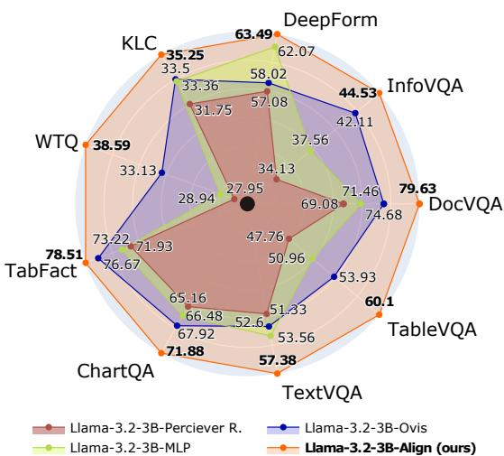

[← 返回 README](../README.md)

# Introduction

## 📌 预览
本文件合并 Introduction/Related Work，重点读动机链、研究 gap、贡献列表和本文在 VisMem/Med Image 课题中的定位。

---

# 1 Introduction

Vision-Language Models (VLMs) have gained significant traction in recent years as a powerful framework for multimodal document understanding tasks that involve interpreting both the visual and textual contents of scanned documents [Kim et al., 2022, Lee et al., 2023, Liu et al., 2023a, 2024, Hu et al., 2024, Wang et al., 2023a, Rodriguez et al., 2024b]. Such tasks are common in real-world commercial applications, including invoice parsing [Park et al., 2019], form reading [Jaume et al., 2019], and document question answering [Mathew et al., 2021b]. VLM architectures typically consist of three components: $( i )$ a vision encoder to process raw images, (ii) a Large Language Model (LLM) pre-trained on text, and (iii) a connector module that maps the visual features from the vision encoder into the LLM’s semantic space.

> 💡 **批注**: 这里在讨论视觉证据是否被保留和利用；要问模型是否真的看图，而不是被语言先验带偏。

A central challenge in this pipeline is to effectively map the continuous feature embeddings of the vision encoder into the latent space of the LLM while preserving the semantic properties of visual concepts. Existing approaches can be broadly categorized into deep fusion and shallow fusion methods. Deep fusion methods, such as NVLM [Dai et al., 2024], Flamingo [Alayrac et al., 2022],

> 💡 **批注**: 这里的核心是 latent-space 计算：作者希望在连续表示中完成推理/记忆，而不是完全依赖显式文本链。

CogVLM [Wang et al., 2023b], and LLama 3.2-Vision [Grattafiori et al., 2024], integrate visual and textual features by introducing additional cross-attention and feed-forward layers at each layer of the LLM. While effective at enhancing cross-modal interaction, these methods substantially increase the parameter count of the VLM compared to the base LLM, resulting in high computational overhead and reduced efficiency.

> 💡 **批注**: 这里在讨论视觉证据是否被保留和利用；要问模型是否真的看图，而不是被语言先验带偏。

In contrast, shallow fusion methods project visual features from the vision encoder into the LLM input embedding space using either multilayer perceptrons (MLPs) [Liu et al., 2023b, 2024], convolution mappings such as Honey-Bee [Cha et al., 2024] and H-Reducer [Hu et al., 2024], or attention-based mechanisms such as the Perceiver Resampler [Li et al., 2023b, Laurençon et al., 2024, Alayrac et al., 2022]. This approach is more parameter-efficient and computationally lighter than deep fusion method However, these connectors lack inductive bias to ensure that the projected features remain within the region spanned by the LLM’s pretrained text embeddings. Consequently, the projected visual features may fall outside the distribution the LLM was trained on, leading to noisy or misaligned representations. Moreover, these mappings are typically learned from scratch, making them data-inefficient and less effective under low-resource conditions.

> 💡 **批注**: 这里在讨论视觉证据是否被保留和利用；要问模型是否真的看图，而不是被语言先验带偏。

Recent methods like Ovis [Lu et al., 2024] attempt to alleviate these issues by introducing separate visual embeddings indexed from the vision encoder outputs and combined together

> 💡 **批注**: 这里在讨论视觉证据是否被保留和利用；要问模型是否真的看图，而不是被语言先验带偏。

*Figure 1: Figure 1: Performance of Different VLM Connectors. The proposed ALIGN connector outperforms other methods across benchmarks using the same training configuration. Radial distance is proportion of maximal score, truncated at 0.7 (black dot).*

> 💡 **Figure 1 批读**: 这张图通常展示框架、视觉案例或 latent/memory 流程。重点看视觉证据如何进入、保留或更新 latent memory。

to construct the visual inputs to the LLM. However, this approach significantly increases parameter count due to the massive embedding matrix and requires extensive training to learn a new embedding space without guaranteeing alignment with the LLM’s input latent space.

> 💡 **批注**: 这里的核心是 latent-space 计算：作者希望在连续表示中完成推理/记忆，而不是完全依赖显式文本链。

To address these limitations, this paper introduces ALIGNVLM, a novel framework that sidesteps direct projection of visual features into the LLM embedding space. Instead, our proposed connector, ALIGN, maps visual features into probability distributions over the LLM’s existing pretrained vocabulary embeddings, which are then combined into a weighted representation of the text embeddings. By constraining each visual feature as a convex combination of the LLM text embeddings, our approach leverages the linguistic priors already encoded in the LLM’s text space. This ensures that the resulting visual features lie within the convex hull of the LLM’s embedding space, reducing the risk of noisy or out-of-distribution inputs and improving alignment between modalities. The connector thus enables faster convergence and stronger performance, particularly in low-resource scenarios.

> 💡 **批注**: 这是跨模态 latent alignment：视觉特征必须进入 LLM 可用的语义空间。

Our experimental results show that ALIGN improves performance on various document understanding tasks, outperforming prior connector methods, with especially large gains in low-data regimes. We summarize our main contributions as follows:

> 💡 **批注**: 这是跨模态 latent alignment：视觉特征必须进入 LLM 可用的语义空间。

• We propose a novel connector, ALIGN, to bridge the representation gap between vision and text modalities.   
• We introduce a family of Vision-Language Models, ALIGNVLM, that achieves state-of-theart performance on multimodal document understanding tasks by leveraging ALIGN.   
• We conduct extensive experiments demonstrating the robustness and effectiveness of ALIGN across different LLM sizes and training data setups.

> 💡 **列表批读**: 这组条目通常对应贡献、设置、发现或模块；建议逐条映射到 visual memory / latent reasoning / medical diagnosis 的主线。

We release our code and research artifacts at alignvlm.github.io.

# 2 Related Work

# 2.1 Vision-Language Models

Over the past few years, Vision-Language Models (VLMs) have achieved remarkable progress, largely due to advances in Large Language Models (LLMs). Initially demonstrating breakthroughs in text understanding and generation [Brown et al., 2020, Raffel et al., 2023, Achiam et al., 2023, Grattafiori et al., 2024, Qwen et al., 2025, Team, 2024], LLMs are now increasingly used to effectively interpret visual inputs [Liu et al., 2023b, Li et al., 2024, Wang et al., 2024, Chen et al., 2024b, Dai et al., 2024, Drouin et al., 2024, Rodriguez et al., 2022]. This progress has enabled real-world applications across diverse domains, particularly in multimodal document understanding for tasks like form reading [Svetlichnaya, 2020], document question answering [Mathew et al., 2021b], and chart question answering [Masry et al., 2022]. VLMs commonly adopt a three-component architecture: a pretrained vision encoder [Zhai et al., 2023, Radford et al., 2021], a LLM, and a connector module. A key challenge for VLMs is effectively aligning visual features with the LLM’s semantic space to enable accurate and meaningful multimodal interpretation.

> 💡 **批注**: 这里在讨论视觉证据是否被保留和利用；要问模型是否真的看图，而不是被语言先验带偏。

# 2.2 Vision-Language Alignment for Multimodal Models

Existing vision-language alignment approaches can be classified into deep fusion and shallow fusion. Deep fusion methods integrate visual and textual features by modifying the LLM’s architecture, adding cross-attention and feed-forward layers. For example, Flamingo [Alayrac et al., 2022] employs the Perceiver Resampler, which uses fixed latent embeddings to attend to vision features and fuses them into the LLM via gated cross-attention layers. Similarly, NVLM [Dai et al., 2024] adopts cross-gated attention while replacing the Perceiver Resampler with a simpler MLP. CogVLM [Wang et al., 2023b] extends this approach by incorporating new feed-forward (FFN) and QKV layers for the vision modality within every layer of the LLM. While these methods improve cross-modal alignment, they significantly increase parameter counts and computational overhead, making them less efficient.

> 💡 **批注**: 这是医学影像相关段落：关注病灶证据、跨模态差异、临床先验和可解释风险。

On the other hand, shallow fusion methods are more computationally efficient, mapping visual features into the LLM’s embedding space without altering its architecture. These methods can be categorized into three main types: (1) MLP-based mapping, such as LLaVA [Liu et al., 2023b] and PaliGemma [Beyer et al., 2024], which use multilayer perceptrons (MLP) to project visual features but often produce misaligned or noisy features due to a lack of constraints and inductive bias [Rodriguez et al., 2024b]; (2) cross-attention mechanisms, BLIP-2 [Li et al., 2023b] uses Q-Former, which utilizes a fixed set of latent embeddings to cross-attend to visual features, but that may still produce noisy or OOD visual features; (3) convolution-based mechanisms, such as HoneyBee [Cha et al., 2024] and H-Reducer [Hu et al., 2024], which leverage convolutional or ResNet [He et al., 2015] layers to preserve spatial locality while reducing dimensionality; and (4) visual embeddings, such as those introduced by Ovis [Lu et al., 2024], which use embeddings indexed by the vision encoder’s outputs to produce the visual inputs. While this regularizes feature mapping, it adds substantial parameter overhead and creates a new vision embedding space, risking misalignment with the LLM’s text embedding space. Encoder-free VLMs, like Fuyu-8B 1 and EVE [Diao et al., 2024], eliminate dedicated vision encoders but show degraded performance [Beyer et al., 2024].

> 💡 **批注**: 这里在讨论视觉证据是否被保留和利用；要问模型是否真的看图，而不是被语言先验带偏。

In contrast, ALIGNVLM maps visual features from the vision encoder into probability distributions over the LLM’s text embeddings, using them to compute a convex combination. By leveraging the linguistic priors encoded in the LLM’s vocabulary, ALIGNVLM ensures that visual features remain within the convex hull of the text embedding. This design mitigates noisy or out-of-distribution projections and achieves stronger multimodal alignment, particularly in tasks that require joint modalities representation like multimodal document understanding and in low-resource settings.

> 💡 **批注**: 这里在讨论视觉证据是否被保留和利用；要问模型是否真的看图，而不是被语言先验带偏。

---

## 🔖 Section 总结

### 核心洞察
1. 把本文 gap 和 VisMem for Med Image 主线对应起来。
2. 注意作者如何区分 visual grounding、latent memory、medical prior。
