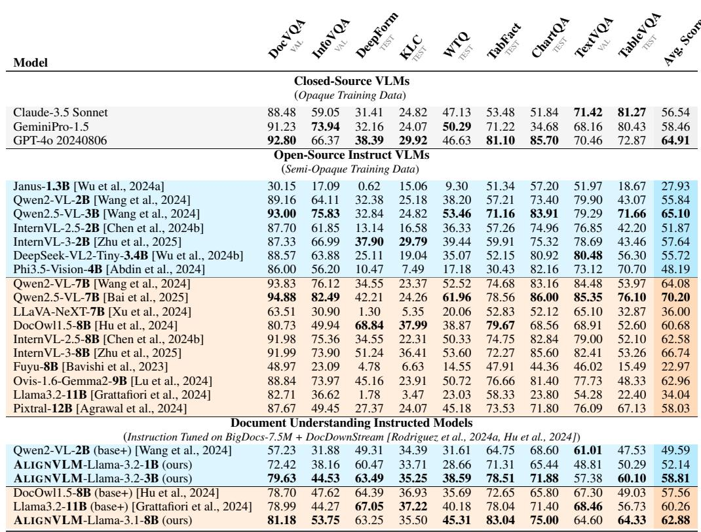
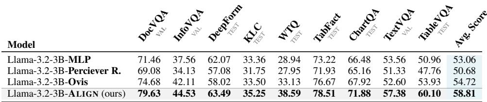

[← 返回 README](../README.md)

# Method

## 📌 预览
本文件合并 Method/Background 等核心技术段落，重点看 latent memory/reasoning/alignment 的构造、读写和训练目标。

---

# 3 Methodology

# 3.1 Model Architecture

The overall model architecture, shown in Figure 2, consists of three main components:

> 💡 **批注**: 这是实验证据：要同时看任务指标、鲁棒性、效率和消融。

*Figure 2: Figure 2: ALIGNVLM Model Architecture. The vision encoder extracts image features, which are processed to produce probabilities over the LLM embeddings. A weighted average combines these probabilities with embeddings to generate vision input vectors. Text inputs are tokenized, and the corresponding embeddings are selected from the embedding matrix, which is then used as input to the LLM. We display the vision layers in blue , and the text layers in purple .*

> 💡 **Figure 2 批读**: 这张图通常展示框架、视觉案例或 latent/memory 流程。重点看视觉证据如何进入、保留或更新 latent memory。

(1) Vision Encoder. To handle high-resolution images of different aspect ratios, we divide each input image into multiple tiles according to one of the predefined aspect ratios (e.g., 1:1, 1:2, . . . , 9:1) chosen via a coverage ratio [Lu et al., 2024, Chen et al., 2024a]. Due to limited computational resources, we set the maximum number of tiles to 9. Each tile is further partitioned into $1 4 \times 1 4$ patches, projected into vectors, and processed by a SigLip-400M vision encoder [Zhai et al., 2023] to extract contextual visual features.

> 💡 **批注**: 这里在讨论视觉证据是否被保留和利用；要问模型是否真的看图，而不是被语言先验带偏。

Each tile $t \in \{ 1 , \cdots , T \}$ is divided into $N _ { t }$ patches

*Equation 1: Equation extracted by MinerU.*

> 💡 **Equation 1 批读**: 公式通常定义 latent update、memory transition、loss 或 routing；建议把符号对应到视觉证据、query、memory 和输出。

where $\mathbf { p } _ { t , i }$ is the $i$ -th patch of tile $t$ . The vision encoder maps these patches to a set of visual feature vectors

> 💡 **批注**: 这里在讨论视觉证据是否被保留和利用；要问模型是否真的看图，而不是被语言先验带偏。

*Equation 2: Equation extracted by MinerU.*

> 💡 **Equation 2 批读**: 公式通常定义 latent update、memory transition、loss 或 routing；建议把符号对应到视觉证据、query、memory 和输出。

Finally, we concatenate the feature sets across all tiles into a single output

*Equation 3: Equation extracted by MinerU.*

> 💡 **Equation 3 批读**: 公式通常定义 latent update、memory transition、loss 或 routing；建议把符号对应到视觉证据、query、memory 和输出。

(2) ALIGN Module. This module aligns the visual features with the LLM. A linear layer $\mathbf { W } _ { 1 } \in$ $\mathbb { R } ^ { D \times d }$ first projects the visual features $\breve { \mathbf { F } } \in \mathbb { R } ^ { T \cdot N _ { t } \times d }$ to the LLM’s token embedding space: one $\mathbb { R } ^ { D }$ vector per token. A second linear layer $\mathbf { W } _ { 2 } \in \mathbb { R } ^ { V \times D }$ (initialized from the LLM’s language-model head) followed by a softmax, produces a probability simplex $\mathbf { P _ { \mathrm { v o c a b } } }$ over the LLM’s vocabulary $V$ tokens)

> 💡 **批注**: 这是跨模态 latent alignment：视觉特征必须进入 LLM 可用的语义空间。

*Equation 4: Equation extracted by MinerU.*

> 💡 **Equation 4 批读**: 公式通常定义 latent update、memory transition、loss 或 routing；建议把符号对应到视觉证据、query、memory 和输出。

We then use the LLM text embeddings $\mathbf { E } _ { \mathrm { t e x t } } \in \mathbb { R } ^ { V \times D }$ to compute a weighted sum

> 💡 **批注**: 这是跨模态 latent alignment：视觉特征必须进入 LLM 可用的语义空间。

*Equation 5: Equation extracted by MinerU.*

> 💡 **Equation 5 批读**: 公式通常定义 latent update、memory transition、loss 或 routing；建议把符号对应到视觉证据、query、memory 和输出。

Finally, we concatenate $\mathbf { F } _ { \mathrm { a l i g n } } ^ { \prime }$ with the tokenized text embeddings to form the LLM input

> 💡 **批注**: 这是跨模态 latent alignment：视觉特征必须进入 LLM 可用的语义空间。

*Equation 6: Equation extracted by MinerU.*

> 💡 **Equation 6 批读**: 公式通常定义 latent update、memory transition、loss 或 routing；建议把符号对应到视觉证据、query、memory 和输出。

where $\mathbf { E } _ { \mathrm { t e x t } } ( \mathbf { x } )$ is obtained by tokenizing the input text $\mathbf { x } = ( x _ { 1 } , \cdots , x _ { M } )$ and selecting the corresponding embeddings from $\mathbf { E } _ { \mathrm { t e x t } }$ such that

> 💡 **批注**: 这是跨模态 latent alignment：视觉特征必须进入 LLM 可用的语义空间。

*Equation 7: Equation extracted by MinerU.*

> 💡 **Equation 7 批读**: 公式通常定义 latent update、memory transition、loss 或 routing；建议把符号对应到视觉证据、query、memory 和输出。

(3) Large Language Model. We feed the concatenated vision and text vectors, $\mathbf { H } _ { \mathrm { i n p u t } }$ , into the LLM, which then generates output text auto-regressively. To demonstrate the effectiveness of our alignment technique, we experiment with the Llama 3.1 model family [Grattafiori et al., 2024]. These models offer state-of-the-art performance and permissive licenses, making them suitable for commercial applications. In particular, we utilize Llama 3.2-1B, Llama 3.2-3B, and Llama 3.1-8B.

> 💡 **批注**: 这里在讨论视觉证据是否被保留和利用；要问模型是否真的看图，而不是被语言先验带偏。

# 3.2 Motivation and relation with existing methods

By construction, each $\mathbb { R } ^ { D }$ representation in $\mathbf { F } _ { \mathrm { a l i g n } } ^ { \prime }$ is constrained to the convex hull of the points $\mathbb { E } _ { \mathrm { t e x t } }$ , thus concentrating the visual features in the part of latent space that the LLM can effectively interpret. Moreover, we argue that our initialization of $\mathbf { W } _ { 2 }$ to the language model head is an inductive bias toward recycling some of the semantics of these text tokens into visual tokens. This contrasts with past methods that have been proposed to adapt the vision encoder outputs $\mathbf { F } \in \mathbb { R } ^ { T \cdot N _ { t } \times d }$ to an $\mathbf { F } ^ { \prime } \in \dot { \mathbb { R } } ^ { T \cdot N _ { t } \times D }$ to be fed to the LLM. Here, we consider two examples in more detail, highlighting these contrasts.

> 💡 **批注**: 这里的核心是 latent-space 计算：作者希望在连续表示中完成推理/记忆，而不是完全依赖显式文本链。

$( I )$ MLP Connector Liu et al. [2023b] applies a linear projection with parameters $\mathbf { W } _ { \mathrm { M L P } } \in \mathbb { R } ^ { D \times d }$ and ${ \bf b } _ { { \bf M } { \bf L } { \bf P } } \in \mathbb { R } ^ { D }$ , followed by an activation function $\sigma$ (e.g., ReLU)

> 💡 **批注**: 这是跨模态 latent alignment：视觉特征必须进入 LLM 可用的语义空间。

*Equation 8: Equation extracted by MinerU.*

> 💡 **Equation 8 批读**: 公式通常定义 latent update、memory transition、loss 或 routing；建议把符号对应到视觉证据、query、memory 和输出。

These parameters are all learned from scratch, without any bias aligning them to text embeddings.

> 💡 **批注**: 这是跨模态 latent alignment：视觉特征必须进入 LLM 可用的语义空间。

(2) Visual Embedding Table Lu et al. [2024] introduces an entire new set of visual embeddings $\mathbf { E } _ { \mathrm { V E T } } \in \mathbb { R } ^ { K \times D }$ which, together with the weights $\mathbf { W } _ { \mathrm { V E T } } \in \mathbb { R } ^ { K \times d }$ , specifies

> 💡 **批注**: 这是跨模态 latent alignment：视觉特征必须进入 LLM 可用的语义空间。

*Equation 9: Equation extracted by MinerU.*

> 💡 **Equation 9 批读**: 公式通常定义 latent update、memory transition、loss 或 routing；建议把符号对应到视觉证据、query、memory 和输出。

When $D < d$ , our $\mathbf { W } _ { 2 } \mathbf { W } _ { 1 }$ amounts to a low-rank version of $\mathbf { W } _ { \mathrm { V E T } }$ . There is thus much more to learn to obtain $\mathbf { F } _ { \mathrm { V E T } } ^ { \prime }$ , and there is again no explicit pressure to align it with the text embeddings.

> 💡 **批注**: 这是跨模态 latent alignment：视觉特征必须进入 LLM 可用的语义空间。

# 3.3 Training Datasets & Stages

We train our model in three stages:

Stage 1. This stage focuses on training the ALIGN Module to map visual features to the LLM’s text embeddings effectively. We use the CC-12M dataset Changpinyo et al. [2021], a large-scale web dataset commonly used for VLM pretraining Liu et al. [2023b], which contains 12M image-text pairs. However, due to broken or unavailable links, we retrieved 8.1M pairs. This dataset facilitates the alignment of visual features with the text embedding space of the LLM. During this stage, we train the full model, as this approach improves performance and stabilizes the ALIGN Module training.

> 💡 **批注**: 这里在讨论视觉证据是否被保留和利用；要问模型是否真的看图，而不是被语言先验带偏。

Stage 2. The goal is to enhance the model’s document understanding capabilities, such as OCR, document structure comprehension, in-depth reasoning, and instruction-following. We leverage the BigDocs-7.5M dataset Rodriguez et al. [2024a], a curated collection of license-permissive datasets for multimodal document understanding. This dataset aligns with the Accountability, Responsibility, and Transparency (ART) principles Bommasani et al. [2023], Vogus and Llansóe [2021], ensuring compliance for commercial applications. As in Stage 1, we train the full model during this stage.

> 💡 **批注**: 这里涉及动态计算或训练信号：重点看是否自适应分配推理深度。

Stage 3. To enhance the model’s instruction-tuning capabilities, particularly for downstream tasks like question answering, we further train it on the DocDownstream Rodriguez et al. [2024a], Hu et al. [2024] instruction tuning dataset. In this stage, the vision encoder is frozen, focusing training exclusively on the LLM and ALIGN module.

> 💡 **批注**: 这里在讨论视觉证据是否被保留和利用；要问模型是否真的看图，而不是被语言先验带偏。

# 5.2 Impact of Connector Designs on VLM Performance

# 5.2.1 High-Resource Training Regime

To assess the effectiveness of our ALIGN module, we compare it against three different and widely used shallow fusion VLM connectors: MLP, Perceiver Resampler, and Ovis. These experiments were carefully conducted under precisely identical training conditions (datasets, hyperparameters, training stages) as outlined in Appendix A.1, ensuring a fair and rigorous comparison. The results in Table 2 show that ALIGN consistently outperforms all alternatives, demonstrating its superiority both in aligning visual and textual modalities in multimodal document understanding. MLP and Perceiver Resampler achieve the lowest performance, $5 3 . 0 6 \%$ and $5 0 . 6 8 \%$ , respectively, due to their direct feature projection, which lacks an explicit mechanism to align visual features with the LLM’s text space, leading to misalignment. Ovis introduces a separate visual embedding table, but this additional complexity does not significantly improve alignment, yielding only $5 4 . 7 2 \%$ accuracy. In contrast, ALIGN ensures that visual features remain within the convex hull of the LLM’s text latent space, leveraging the linguistic priors of the LLM to enhance alignment and mitigate noisy embeddings. This design leads to the highest performance $( 5 8 . 8 1 \% )$ , establishing ALIGN as the most effective connector for integrating vision and language in multimodal document understanding. We provide some example outputs of the Llama-3.2-3B models with different connector designs in Appendix A.4. Furthermore, we include an analysis of the runtime efficiency and memory usage of different connectors in Appendix A.2.

> 💡 **批注**: 这里的核心是 latent-space 计算：作者希望在连续表示中完成推理/记忆，而不是完全依赖显式文本链。

Table 3: Connector Performance under a Low-Resource Training Regime: We evaluate the effectiveness of more shallow-fusion connectors when trained on limited data. The ALIGN connector achieves the highest performance, with notably larger gains on document understanding tasks, demonstrating its data efficiency and strong inductive bias.

> 💡 **批注**: 这是跨模态 latent alignment：视觉特征必须进入 LLM 可用的语义空间。

*Table 1: Table 1: Main Results on General Document Benchmarks. We compare ALIGNVLM (ours) with state-of-the-art (SOTA) open and closed-source instructed models, and with base models that we trained using the process described in Section 3.3. ALIGNVLM models outperform all Base VLM models trained in the same data regime. Our models also perform competitively across document benchmarks even compared with SOTA models, in which the data regime is more targeted and optimized. Color coding for comparison: closed-source models ,*

> 💡 **Table 1 批读**: 表格要看不同任务/模态/模型规模下是否一致提升；医学场景尤其关注 per-modality 和失败案例。

# 5.2.2 Low-Resource Training Regime

The previous section focused on large-scale training setups involving millions of data samples (BigDocs-7.5M), which require significant compute resources and limit the number of baselines that we were able to compare against. Here, we examine whether ALIGN remains effective in a low-resource setting.

We conduct additional experiments using SigLIP-400M as the vision encoder and Llama-3.2-3B as the language model, fine-tuned on the LLaVA-NeXT dataset Liu et al. [2024], which contains 779K samples. We follow the official LLaVA-NeXT configuration for both training stages. (i) Pretraining: the model is trained on the LLaVA-558K image–caption dataset Liu et al. [2024], freezing both the LLM and vision encoder while fine-tuning the connector (learning rate $= 1 \mathrm { e } { - 3 }$ batch size $= 3 2$ , 1 epoch on ${ 8 \times \mathrm { H } 1 0 0 }$ GPUs). To handle high-resolution document images, we adopt the "anyres_max_9" strategy with grid weaving from $1 \times 1$ to $6 { \times } 6$ , supporting resolutions up to $2 3 0 4 \times 2 3 0 4$ with 729 tokens per grid; $( i i )$ Instruction tuning: the model is further fine-tuned on the LLaVA-NeXT-779K instruction dataset with learning rates of 1e-5 for the LLM and connector, 2e-6 for the vision encoder, batch $\mathrm { s i z e } = 8$ , for 1 epoch.

> 💡 **批注**: 这里在讨论视觉证据是否被保留和利用；要问模型是否真的看图，而不是被语言先验带偏。

This lightweight setup allows direct comparison across more connector architectures including MLP Liu et al. [2023a], Perceiver Resampler, Ovis Lu et al. [2024], H-Reducer $( 1 \times 4 )$ Hu et al. [2024], and HoneyBee (C-Abstractor) Cha et al. [2024], all trained under identical conditions for fairness. Since the LLaVA-Next dataset is general-purpose and not exclusively document-focused like BigDocs-7.5M [Rodriguez et al., 2024a], it allows us to evaluate whether the ALIGN connector generalizes beyond document understanding to broader visual reasoning. Accordingly, we assess all models on a comprehensive suite of benchmarks spanning both document understanding and general vision–language tasks. The document understanding benchmarks include DocVQA Mathew et al. [2021b], InfoVQA Mathew et al. [2021a], ChartQA Masry et al. [2022], and TextVQA Singh et al. [2019]. For general vision–language evaluation, we report results on MMMU-dev Yue et al. [2024], SeedBench Li et al. [2023a], and MMVet Yu et al. [2024], Pope [Li et al., 2023c], and GQA [Hudson and Manning, 2019].

> 💡 **批注**: 这是医学影像相关段落：关注病灶证据、跨模态差异、临床先验和可解释风险。

As summarized in Table 3, ALIGN consistently outperforms other connectors under this low-data regime, with stronger gains on document understanding tasks. The wider performance margin between ALIGN and others connectors under limited data (Table 3) compared to the high-resource setting (Table 2) underscores the benefit of its inductive bias. By grounding visual features within the LLM’s text embedding space, ALIGN learns more efficiently from fewer samples, unlike directprojection connectors that rely heavily on large datasets. This makes ALIGN especially valuable for resource-constrained environments such as academic labs or small-scale industrial research setups, where both data and compute are limited.

> 💡 **批注**: 这里在讨论视觉证据是否被保留和利用；要问模型是否真的看图，而不是被语言先验带偏。

Table 4: Performance comparison when evaluating ALIGN with the full text embedding vocabulary (128K) versus the reduced subset of 3.4K high-probability embeddings. The results show negligible performance degradation, indicating that ALIGN relies primarily on a small subset of embeddings.

> 💡 **批注**: 这是跨模态 latent alignment：视觉特征必须进入 LLM 可用的语义空间。

*Table 2: Table 2: Impact of Connector Designs on VLM Performance: We present the results of experiments evaluating different connector designs for conditioning LLMs on visual features. Our proposed ALIGN connector is compared against a basic Multi-Layer Perceptron (MLP), the Perceiver Resampler, and Ovis. The results demonstrate that ALIGN consistently outperforms these alternatives across all benchmarks.*

> 💡 **Table 2 批读**: 表格要看不同任务/模态/模型规模下是否一致提升；医学场景尤其关注 per-modality 和失败案例。

# A.2 Runtime Comparison Between Connectors

One caveat in the ALIGN connector is that it includes an additional LM head layer, which slightly increases the total number of parameters. However, this addition has a negligible impact on runtime efficiency due to its simple structure. It only introduces a few matrix multiplication operations (as shown in Equations 1 and 2) instead of stacking many complex layers that require sequential processing, as in deep fusion methods.

> 💡 **批注**: 这是跨模态 latent alignment：视觉特征必须进入 LLM 可用的语义空间。

To empirically validate this claim, we benchmarked the runtime and memory usage of models equipped with different connector types (MLP, Align, Ovis, and Perceiver), following the same experimental setup as in Table 2. As shown in Table 7, the results demonstrate that although the ALIGN connector delivers notably superior performance (see Table 2), the variations in inference speed and GPU memory usage among the connectors remain minimal.

> 💡 **批注**: 这是记忆机制段落：重点区分“调用/读出 memory”和“形成/写入 memory”，以及 memory 是否动态变化。

Table 7: Runtime and memory comparison between different connector designs. The results show that ALIGN introduces negligible computational overhead compared to other connectors.

> 💡 **批注**: 这是记忆机制段落：重点区分“调用/读出 memory”和“形成/写入 memory”，以及 memory 是否动态变化。

*Table 3: Table 3: Connector Performance under a Low-Resource Training Regime: We evaluate the effectiveness of more shallow-fusion connectors when trained on limited data. The ALIGN connector achieves the highest performance, with notably larger gains on document understanding tasks, demonstrating its data efficiency and strong inductive bias.*

> 💡 **Table 3 批读**: 表格要看不同任务/模态/模型规模下是否一致提升；医学场景尤其关注 per-modality 和失败案例。

Overall, the empirical evidence confirms that the ALIGN connector achieves an effective balance between computational efficiency and performance. It introduces only a negligible increase in runtime and memory usage while providing substantial gains in overall accuracy.

> 💡 **批注**: 这是记忆机制段落：重点区分“调用/读出 memory”和“形成/写入 memory”，以及 memory 是否动态变化。

---

## 🔖 Section 总结

### 核心洞察
1. 明确 latent/memory/alignment 的读写路径。
2. 区分训练时组件和推理时组件。
3. 关注是否能迁移到医学影像。
