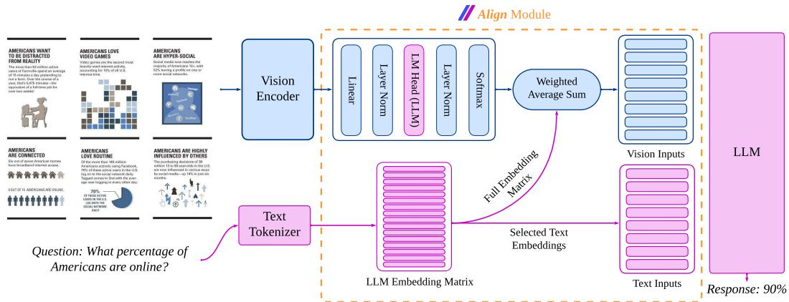
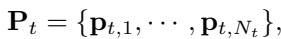
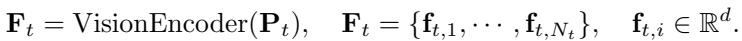
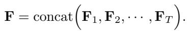
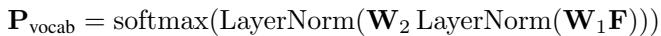
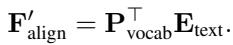
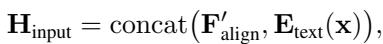
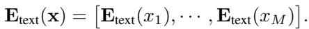
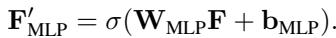
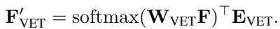

[← 返回 README](../README.md)

# 3 Methodology

## 📌 预览
本节是核心方法，重点看模块输入输出、训练目标、推理路径和与 baseline 的差异。

---

# 3.1 Model Architecture

The overall model architecture, shown in Figure 2, consists of three main components:

*Figure 2: Figure 2: ALIGNVLM Model Architecture. The vision encoder extracts image features, which are processed to produce probabilities over the LLM embeddings. A weighted average combines these probabilities with embeddings to generate vision input vectors. Text inputs are tokenized, and the corresponding embeddings are selected from the embedding matrix, which is then used as input to the LLM. We display the vision layers in blue , and the text layers in purple .*

> 💡 **Figure 2 批读**: 这张图要放回 AlignVLM 的问题设定里读：它通常用来说明 connector 对齐、文档理解样例、token 分布或噪声鲁棒性；重点看视觉证据是否被映射到 LLM 可用的语言空间。

(1) Vision Encoder. To handle high-resolution images of different aspect ratios, we divide each input image into multiple tiles according to one of the predefined aspect ratios (e.g., 1:1, 1:2, . . . , 9:1) chosen via a coverage ratio [Lu et al., 2024, Chen et al., 2024a]. Due to limited computational resources, we set the maximum number of tiles to 9. Each tile is further partitioned into $1 4 \times 1 4$ patches, projected into vectors, and processed by a SigLip-400M vision encoder [Zhai et al., 2023] to extract contextual visual features.

> 💡 **批注**: 这段是 vision-language latent alignment 主线：关注视觉特征如何经 connector 进入 LLM 可解释的文本嵌入区域，以及这种约束如何影响文档理解、低资源训练和噪声鲁棒性。

Each tile $t \in \{ 1 , \cdots , T \}$ is divided into $N _ { t }$ patches

*Equation 1: Equation extracted by MinerU.*

> 💡 **Equation 1 批读**: 这里的公式要按 AlignVLM 的对齐路径读：视觉 patch 特征先形成到文本嵌入词表的权重，再被组合成 LLM 可消费的输入 embedding；重点是输出是否被限制在语言 embedding 的可解释区域。

where $\mathbf { p } _ { t , i }$ is the $i$ -th patch of tile $t$ . The vision encoder maps these patches to a set of visual feature vectors

> 💡 **批注**: 这段是 vision-language latent alignment 主线：关注视觉特征如何经 connector 进入 LLM 可解释的文本嵌入区域，以及这种约束如何影响文档理解、低资源训练和噪声鲁棒性。

*Equation 2: Equation extracted by MinerU.*

> 💡 **Equation 2 批读**: 这里的公式要按 AlignVLM 的对齐路径读：视觉 patch 特征先形成到文本嵌入词表的权重，再被组合成 LLM 可消费的输入 embedding；重点是输出是否被限制在语言 embedding 的可解释区域。

Finally, we concatenate the feature sets across all tiles into a single output

*Equation 3: Equation extracted by MinerU.*

> 💡 **Equation 3 批读**: 这里的公式要按 AlignVLM 的对齐路径读：视觉 patch 特征先形成到文本嵌入词表的权重，再被组合成 LLM 可消费的输入 embedding；重点是输出是否被限制在语言 embedding 的可解释区域。

(2) ALIGN Module. This module aligns the visual features with the LLM. A linear layer $\mathbf { W } _ { 1 } \in$ $\mathbb { R } ^ { D \times d }$ first projects the visual features $\breve { \mathbf { F } } \in \mathbb { R } ^ { T \cdot N _ { t } \times d }$ to the LLM’s token embedding space: one $\mathbb { R } ^ { D }$ vector per token. A second linear layer $\mathbf { W } _ { 2 } \in \mathbb { R } ^ { V \times D }$ (initialized from the LLM’s language-model head) followed by a softmax, produces a probability simplex $\mathbf { P _ { \mathrm { v o c a b } } }$ over the LLM’s vocabulary $V$ tokens)

> 💡 **批注**: 这段是 vision-language latent alignment 主线：关注视觉特征如何经 connector 进入 LLM 可解释的文本嵌入区域，以及这种约束如何影响文档理解、低资源训练和噪声鲁棒性。

*Equation 4: Equation extracted by MinerU.*

> 💡 **Equation 4 批读**: 这里的公式要按 AlignVLM 的对齐路径读：视觉 patch 特征先形成到文本嵌入词表的权重，再被组合成 LLM 可消费的输入 embedding；重点是输出是否被限制在语言 embedding 的可解释区域。

We then use the LLM text embeddings $\mathbf { E } _ { \mathrm { t e x t } } \in \mathbb { R } ^ { V \times D }$ to compute a weighted sum

*Equation 5: Equation extracted by MinerU.*

> 💡 **Equation 5 批读**: 这里的公式要按 AlignVLM 的对齐路径读：视觉 patch 特征先形成到文本嵌入词表的权重，再被组合成 LLM 可消费的输入 embedding；重点是输出是否被限制在语言 embedding 的可解释区域。

Finally, we concatenate $\mathbf { F } _ { \mathrm { a l i g n } } ^ { \prime }$ with the tokenized text embeddings to form the LLM input

*Equation 6: Equation extracted by MinerU.*

> 💡 **Equation 6 批读**: 这里的公式要按 AlignVLM 的对齐路径读：视觉 patch 特征先形成到文本嵌入词表的权重，再被组合成 LLM 可消费的输入 embedding；重点是输出是否被限制在语言 embedding 的可解释区域。

where $\mathbf { E } _ { \mathrm { t e x t } } ( \mathbf { x } )$ is obtained by tokenizing the input text $\mathbf { x } = ( x _ { 1 } , \cdots , x _ { M } )$ and selecting the corresponding embeddings from $\mathbf { E } _ { \mathrm { t e x t } }$ such that

*Equation 7: Equation extracted by MinerU.*

> 💡 **Equation 7 批读**: 这里的公式要按 AlignVLM 的对齐路径读：视觉 patch 特征先形成到文本嵌入词表的权重，再被组合成 LLM 可消费的输入 embedding；重点是输出是否被限制在语言 embedding 的可解释区域。

(3) Large Language Model. We feed the concatenated vision and text vectors, $\mathbf { H } _ { \mathrm { i n p u t } }$ , into the LLM, which then generates output text auto-regressively. To demonstrate the effectiveness of our alignment technique, we experiment with the Llama 3.1 model family [Grattafiori et al., 2024]. These models offer state-of-the-art performance and permissive licenses, making them suitable for commercial applications. In particular, we utilize Llama 3.2-1B, Llama 3.2-3B, and Llama 3.1-8B.

> 💡 **批注**: 这段是 vision-language latent alignment 主线：关注视觉特征如何经 connector 进入 LLM 可解释的文本嵌入区域，以及这种约束如何影响文档理解、低资源训练和噪声鲁棒性。

# 3.2 Motivation and relation with existing methods

By construction, each $\mathbb { R } ^ { D }$ representation in $\mathbf { F } _ { \mathrm { a l i g n } } ^ { \prime }$ is constrained to the convex hull of the points $\mathbb { E } _ { \mathrm { t e x t } }$ , thus concentrating the visual features in the part of latent space that the LLM can effectively interpret. Moreover, we argue that our initialization of $\mathbf { W } _ { 2 }$ to the language model head is an inductive bias toward recycling some of the semantics of these text tokens into visual tokens. This contrasts with past methods that have been proposed to adapt the vision encoder outputs $\mathbf { F } \in \mathbb { R } ^ { T \cdot N _ { t } \times d }$ to an $\mathbf { F } ^ { \prime } \in \dot { \mathbb { R } } ^ { T \cdot N _ { t } \times D }$ to be fed to the LLM. Here, we consider two examples in more detail, highlighting these contrasts.

> 💡 **批注**: 这段按 AlignVLM 的 latent alignment 主线读：视觉 token 不是被普通 MLP 任意投影，而是被约束为 LLM 文本嵌入的加权组合；关键是这种语言先验是否提升文档元素、表格结构和 OCR 相关推理的可解释性。

$( I )$ MLP Connector Liu et al. [2023b] applies a linear projection with parameters $\mathbf { W } _ { \mathrm { M L P } } \in \mathbb { R } ^ { D \times d }$ and ${ \bf b } _ { { \bf M } { \bf L } { \bf P } } \in \mathbb { R } ^ { D }$ , followed by an activation function $\sigma$ (e.g., ReLU)

> 💡 **批注**: 这段按 AlignVLM 的 latent alignment 主线读：视觉 token 不是被普通 MLP 任意投影，而是被约束为 LLM 文本嵌入的加权组合；关键是这种语言先验是否提升文档元素、表格结构和 OCR 相关推理的可解释性。

*Equation 8: Equation extracted by MinerU.*

> 💡 **Equation 8 批读**: 这里的公式要按 AlignVLM 的对齐路径读：视觉 patch 特征先形成到文本嵌入词表的权重，再被组合成 LLM 可消费的输入 embedding；重点是输出是否被限制在语言 embedding 的可解释区域。

These parameters are all learned from scratch, without any bias aligning them to text embeddings.

(2) Visual Embedding Table Lu et al. [2024] introduces an entire new set of visual embeddings $\mathbf { E } _ { \mathrm { V E T } } \in \mathbb { R } ^ { K \times D }$ which, together with the weights $\mathbf { W } _ { \mathrm { V E T } } \in \mathbb { R } ^ { K \times d }$ , specifies

> 💡 **批注**: 这里虽然还在方法节，但承担的是核心对比论证：Visual Embedding Table 说明不是所有“把视觉投进 embedding space”的设计都一样，ALIGN 的关键差异在于它复用的是 LLM 现成的 text embedding 几何，而不是另学一套视觉词表。

*Equation 9: Equation extracted by MinerU.*

> 💡 **Equation 9 批读**: 这里的公式要按 AlignVLM 的对齐路径读：视觉 patch 特征先形成到文本嵌入词表的权重，再被组合成 LLM 可消费的输入 embedding；重点是输出是否被限制在语言 embedding 的可解释区域。

When $D < d$ , our $\mathbf { W } _ { 2 } \mathbf { W } _ { 1 }$ amounts to a low-rank version of $\mathbf { W } _ { \mathrm { V E T } }$ . There is thus much more to learn to obtain $\mathbf { F } _ { \mathrm { V E T } } ^ { \prime }$ , and there is again no explicit pressure to align it with the text embeddings.

# 3.3 Training Datasets & Stages

We train our model in three stages:

Stage 1. This stage focuses on training the ALIGN Module to map visual features to the LLM’s text embeddings effectively. We use the CC-12M dataset Changpinyo et al. [2021], a large-scale web dataset commonly used for VLM pretraining Liu et al. [2023b], which contains 12M image-text pairs. However, due to broken or unavailable links, we retrieved 8.1M pairs. This dataset facilitates the alignment of visual features with the text embedding space of the LLM. During this stage, we train the full model, as this approach improves performance and stabilizes the ALIGN Module training.

> 💡 **批注**: 这段是 vision-language latent alignment 主线：关注视觉特征如何经 connector 进入 LLM 可解释的文本嵌入区域，以及这种约束如何影响文档理解、低资源训练和噪声鲁棒性。

Stage 2. The goal is to enhance the model’s document understanding capabilities, such as OCR, document structure comprehension, in-depth reasoning, and instruction-following. We leverage the BigDocs-7.5M dataset Rodriguez et al. [2024a], a curated collection of license-permissive datasets for multimodal document understanding. This dataset aligns with the Accountability, Responsibility, and Transparency (ART) principles Bommasani et al. [2023], Vogus and Llansóe [2021], ensuring compliance for commercial applications. As in Stage 1, we train the full model during this stage.

> 💡 **批注**: 这段是 vision-language latent alignment 主线：关注视觉特征如何经 connector 进入 LLM 可解释的文本嵌入区域，以及这种约束如何影响文档理解、低资源训练和噪声鲁棒性。

Stage 3. To enhance the model’s instruction-tuning capabilities, particularly for downstream tasks like question answering, we further train it on the DocDownstream Rodriguez et al. [2024a], Hu et al. [2024] instruction tuning dataset. In this stage, the vision encoder is frozen, focusing training exclusively on the LLM and ALIGN module.

> 💡 **批注**: 这段是 vision-language latent alignment 主线：关注视觉特征如何经 connector 进入 LLM 可解释的文本嵌入区域，以及这种约束如何影响文档理解、低资源训练和噪声鲁棒性。

---

## 🔖 Section 总结

### 核心洞察
1. 本节精读重点：把 AlignVLM 的 connector 设计、实验结论和文档理解场景联系起来看，尤其关注“对齐到语言嵌入凸组合”带来的收益与边界。
2. 阅读重点是把本节的机制/证据映射到论文主 claim。
3. 后续如有疑问，可在本 section 继续补充更细批注。
