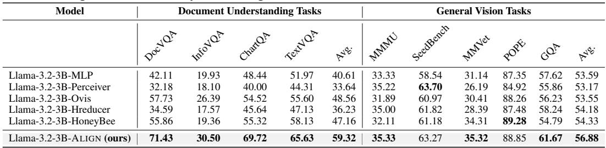
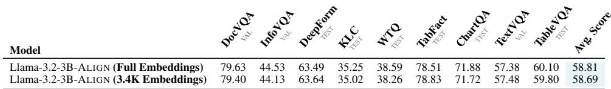
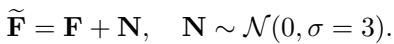
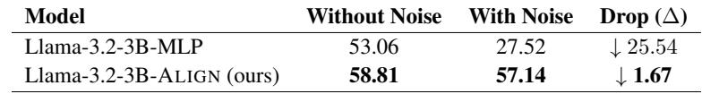
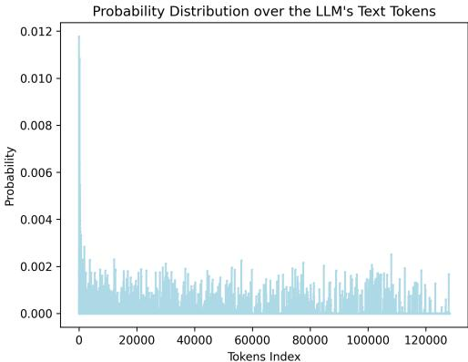
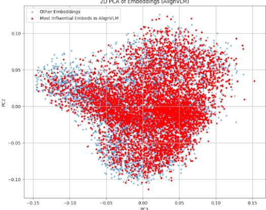

[← 返回 README](../README.md)

# 5 Results

## 📌 预览
本节验证方法是否成立，重点看主结果、消融、效率和视觉/病例案例。

---

# 5.1 Main Results

Table 1 presents the performance of ALIGNVLM compared to state-of-the-art (SOTA) open- and closed-source instructed models, as well as baseline Base VLMs fine-tuned in the same instructiontuning setup. The results demonstrate that ALIGNVLM consistently outperforms all Base VLMs within the same size category and achieves competitive performance against SOTA Instruct VLMs despite being trained on a more limited data regime. Below, we provide a detailed analysis.

> 💡 **批注**: 这段按 AlignVLM 的 latent alignment 主线读：视觉 token 不是被普通 MLP 任意投影，而是被约束为 LLM 文本嵌入的加权组合；关键是这种语言先验是否提升文档元素、表格结构和 OCR 相关推理的可解释性。

ALIGNVLM vs. Base VLMs. Our ALIGNVLM models, based on Llama 3.2-1B and Llama 3.2- 3B, significantly outperform the corresponding Base VLM, Qwen2-VL-2B, by up to $9 . 2 2 \%$ . Notably, ALIGNVLM-Llama-3.2-3B surpasses DocOwl1.5-8B, which has 4B more parameters, demonstrating the effectiveness of ALIGN in enhancing multimodal capabilities compared to traditional shallow fusion methods (e.g., MLPs). Furthermore, our 8B model achieves a $2 . 6 2 \%$ improvement over Llama3.2-11B despite sharing the same Base LLM, Llama3.1-8B. Since all models in this comparison were trained on the same instruction-tuning setup, this experiment provides a controlled evaluation, isolating the impact of architectural differences rather than dataset biases. Consequently, these results suggest that ALIGNVLM outperforms VLMs with shallow fusion techniques and surpasses parameter-heavy deep fusion VLMs, such as Llama3.2-11B, while maintaining a more efficient architecture.

> 💡 **批注**: 这段按 AlignVLM 的 latent alignment 主线读：视觉 token 不是被普通 MLP 任意投影，而是被约束为 LLM 文本嵌入的加权组合；关键是这种语言先验是否提升文档元素、表格结构和 OCR 相关推理的可解释性。

ALIGNVLM vs. Instruct VLMs. Even as open-source Instruct models are trained on significantly larger, often undisclosed instruction-tuning datasets, ALIGNVLM achieves competitive performance. For example, ALIGNVLM-Llama-3.2-3B $( 5 8 . 8 I \% )$ outperforms other strong instruction-tuned VLMs in its size class, such as Qwen2-VL-2B and InternVL-3-2B, by considerable margins $2 . 9 7 \%$ and $1 . 1 7 \%$ , respectively). While it falls slightly behind Qwen2.5-VL-3B, a direct comparison is not entirely fair, as the latter was trained on a proprietary instruction-tuning dataset.

> 💡 **批注**: 这段按 AlignVLM 的 latent alignment 主线读：视觉 token 不是被普通 MLP 任意投影，而是被约束为 LLM 文本嵌入的加权组合；关键是这种语言先验是否提升文档元素、表格结构和 OCR 相关推理的可解释性。

Additionally, our 8B model outperforms significantly larger models such as Llama 3.2-11B and PixTral-12B by substantial margins. It also surpasses InternVL-2.5-8B and performs competitively with Qwen2.5-VL-7B, though a direct comparison may not be entirely fair since Qwen2.5-VL-7B was trained on an undisclosed instruction-tuning dataset. Finally, ALIGNVLM also exhibits comparable performance to closed-source models like GeminiPro-1.5 and GPT4o.

> 💡 **批注**: 这段是 vision-language latent alignment 主线：关注视觉特征如何经 connector 进入 LLM 可解释的文本嵌入区域，以及这种约束如何影响文档理解、低资源训练和噪声鲁棒性。

Overall, these results validate the effectiveness of ALIGN and establish ALIGNVLM as a state-of-theart model for multimodal document understanding.

> 💡 **批注**: 这段是 vision-language latent alignment 主线：关注视觉特征如何经 connector 进入 LLM 可解释的文本嵌入区域，以及这种约束如何影响文档理解、低资源训练和噪声鲁棒性。

# 5.2 Impact of Connector Designs on VLM Performance

# 5.2.1 High-Resource Training Regime

To assess the effectiveness of our ALIGN module, we compare it against three different and widely used shallow fusion VLM connectors: MLP, Perceiver Resampler, and Ovis. These experiments were carefully conducted under precisely identical training conditions (datasets, hyperparameters, training stages) as outlined in Appendix A.1, ensuring a fair and rigorous comparison. The results in Table 2 show that ALIGN consistently outperforms all alternatives, demonstrating its superiority both in aligning visual and textual modalities in multimodal document understanding. MLP and Perceiver Resampler achieve the lowest performance, $5 3 . 0 6 \%$ and $5 0 . 6 8 \%$ , respectively, due to their direct feature projection, which lacks an explicit mechanism to align visual features with the LLM’s text space, leading to misalignment. Ovis introduces a separate visual embedding table, but this additional complexity does not significantly improve alignment, yielding only $5 4 . 7 2 \%$ accuracy. In contrast, ALIGN ensures that visual features remain within the convex hull of the LLM’s text latent space, leveraging the linguistic priors of the LLM to enhance alignment and mitigate noisy embeddings. This design leads to the highest performance $( 5 8 . 8 1 \% )$ , establishing ALIGN as the most effective connector for integrating vision and language in multimodal document understanding. We provide some example outputs of the Llama-3.2-3B models with different connector designs in Appendix A.4. Furthermore, we include an analysis of the runtime efficiency and memory usage of different connectors in Appendix A.2.

> 💡 **批注**: 这段按 AlignVLM 的 latent alignment 主线读：视觉 token 不是被普通 MLP 任意投影，而是被约束为 LLM 文本嵌入的加权组合；关键是这种语言先验是否提升文档元素、表格结构和 OCR 相关推理的可解释性。

Table 3: Connector Performance under a Low-Resource Training Regime: We evaluate the effectiveness of more shallow-fusion connectors when trained on limited data. The ALIGN connector achieves the highest performance, with notably larger gains on document understanding tasks, demonstrating its data efficiency and strong inductive bias.

> 💡 **批注**: 这段按 AlignVLM 的 latent alignment 主线读：视觉 token 不是被普通 MLP 任意投影，而是被约束为 LLM 文本嵌入的加权组合；关键是这种语言先验是否提升文档元素、表格结构和 OCR 相关推理的可解释性。

*Table 3: Table 3: Connector Performance under a Low-Resource Training Regime: We evaluate the effectiveness of more shallow-fusion connectors when trained on limited data. The ALIGN connector achieves the highest performance, with notably larger gains on document understanding tasks, demonstrating its data efficiency and strong inductive bias.*

> 💡 **Table 3 批读**: 表格要看主指标、次指标与效率/鲁棒性是否一致支持论文 claim。

# 5.2.2 Low-Resource Training Regime

The previous section focused on large-scale training setups involving millions of data samples (BigDocs-7.5M), which require significant compute resources and limit the number of baselines that we were able to compare against. Here, we examine whether ALIGN remains effective in a low-resource setting.

We conduct additional experiments using SigLIP-400M as the vision encoder and Llama-3.2-3B as the language model, fine-tuned on the LLaVA-NeXT dataset Liu et al. [2024], which contains 779K samples. We follow the official LLaVA-NeXT configuration for both training stages. (i) Pretraining: the model is trained on the LLaVA-558K image–caption dataset Liu et al. [2024], freezing both the LLM and vision encoder while fine-tuning the connector (learning rate $= 1 \mathrm { e } { - 3 }$ batch size $= 3 2$ , 1 epoch on ${ 8 \times \mathrm { H } 1 0 0 }$ GPUs). To handle high-resolution document images, we adopt the "anyres_max_9" strategy with grid weaving from $1 \times 1$ to $6 { \times } 6$ , supporting resolutions up to $2 3 0 4 \times 2 3 0 4$ with 729 tokens per grid; $( i i )$ Instruction tuning: the model is further fine-tuned on the LLaVA-NeXT-779K instruction dataset with learning rates of 1e-5 for the LLM and connector, 2e-6 for the vision encoder, batch $\mathrm { s i z e } = 8$ , for 1 epoch.

> 💡 **批注**: 这段按 AlignVLM 的 latent alignment 主线读：视觉 token 不是被普通 MLP 任意投影，而是被约束为 LLM 文本嵌入的加权组合；关键是这种语言先验是否提升文档元素、表格结构和 OCR 相关推理的可解释性。

This lightweight setup allows direct comparison across more connector architectures including MLP Liu et al. [2023a], Perceiver Resampler, Ovis Lu et al. [2024], H-Reducer $( 1 \times 4 )$ Hu et al. [2024], and HoneyBee (C-Abstractor) Cha et al. [2024], all trained under identical conditions for fairness. Since the LLaVA-Next dataset is general-purpose and not exclusively document-focused like BigDocs-7.5M [Rodriguez et al., 2024a], it allows us to evaluate whether the ALIGN connector generalizes beyond document understanding to broader visual reasoning. Accordingly, we assess all models on a comprehensive suite of benchmarks spanning both document understanding and general vision–language tasks. The document understanding benchmarks include DocVQA Mathew et al. [2021b], InfoVQA Mathew et al. [2021a], ChartQA Masry et al. [2022], and TextVQA Singh et al. [2019]. For general vision–language evaluation, we report results on MMMU-dev Yue et al. [2024], SeedBench Li et al. [2023a], and MMVet Yu et al. [2024], Pope [Li et al., 2023c], and GQA [Hudson and Manning, 2019].

> 💡 **批注**: 这段按 AlignVLM 的 latent alignment 主线读：视觉 token 不是被普通 MLP 任意投影，而是被约束为 LLM 文本嵌入的加权组合；关键是这种语言先验是否提升文档元素、表格结构和 OCR 相关推理的可解释性。

As summarized in Table 3, ALIGN consistently outperforms other connectors under this low-data regime, with stronger gains on document understanding tasks. The wider performance margin between ALIGN and others connectors under limited data (Table 3) compared to the high-resource setting (Table 2) underscores the benefit of its inductive bias. By grounding visual features within the LLM’s text embedding space, ALIGN learns more efficiently from fewer samples, unlike directprojection connectors that rely heavily on large datasets. This makes ALIGN especially valuable for resource-constrained environments such as academic labs or small-scale industrial research setups, where both data and compute are limited.

> 💡 **批注**: 这段按 AlignVLM 的 latent alignment 主线读：视觉 token 不是被普通 MLP 任意投影，而是被约束为 LLM 文本嵌入的加权组合；关键是这种语言先验是否提升文档元素、表格结构和 OCR 相关推理的可解释性。

Table 4: Performance comparison when evaluating ALIGN with the full text embedding vocabulary (128K) versus the reduced subset of 3.4K high-probability embeddings. The results show negligible performance degradation, indicating that ALIGN relies primarily on a small subset of embeddings.

> 💡 **批注**: Table 4 这类分析表的意义在于证明 ALIGN 并没有平均依赖 128K 全词表，而是稳定使用一小簇高概率 embeddings。它既支持“视觉对齐到语言 manifold”的叙事，也提示后续有 pruning 空间。

*Table 4: Table 4: Performance comparison when evaluating ALIGN with the full text embedding vocabulary (128K) versus the reduced subset of 3.4K high-probability embeddings. The results show negligible performance degradation, indicating that ALIGN relies primarily on a small subset of embeddings.*

> 💡 **Table 4 批读**: 表格要看主指标、次指标与效率/鲁棒性是否一致支持论文 claim。

# 5.3 Probability Distribution over Text Tokens Analysis

To better understand the behavior of ALIGN, we examine the probability distribution, $\mathbf { P _ { \mathrm { v o c a b } } }$ in Eq (1), over the LLM’s text vocabulary generated from visual features. Specifically, we process 100 document images through the vision encoder and ALIGN, then average the resulting probability distributions across all image patches. The final distribution is shown in Figure 3. As illustrated, the distribution is dense (rather than sparse), with the highest probability assigned to a single token being 0.0118. This can be explained by the vision feature space being continuous and of much higher cardinality than the discrete text space. Indeed, while the LLM has 128K distinct vocabulary tokens, an image patch (e.g., $1 4 \times 1 4$ pixels) contains continuous, high-dimensional information that cannot be effectively mapped to a single or a few discrete tokens.

> 💡 **批注**: 这段是 vision-language latent alignment 主线：关注视觉特征如何经 connector 进入 LLM 可解释的文本嵌入区域，以及这种约束如何影响文档理解、低资源训练和噪声鲁棒性。

We conducted a deeper analysis of the token probability distributions produced by the ALIGN connector. Our observations show that ALIGN consistently assigns high probabilities to approximately 3.4K tokens from the entire vocabulary, while the remaining tokens receive negligible probabilities (below $1 0 ^ { - 6 }$ ). To better understand this behavior, we applied Principal Component Analysis (PCA) to reduce the dimensionality of the embeddings and visualized them in a two-dimensional space, as shown in Figure 4. The visualization reveals that these 3.4K tokens densely and comprehensively span the latent space of the LLM’s text embeddings. To validate this finding, we conducted additional evaluation experiments in which we retained only these 3.4K high-probability embeddings in the ALIGN connector, entirely removing the rest during evaluation. As shown in Table 4, the performance difference compared to using the full embedding set (128K) was negligible. This confirms that ALIGN effectively leverages and combines a compact subset of embeddings to map visual features into semantically meaningful regions within the LLM’s latent text space. Moreover, this suggests that ALIGN can be further optimized through targeted embedding pruning to improve computational efficiency without sacrificing performance.

> 💡 **批注**: 这段按 AlignVLM 的 latent alignment 主线读：视觉 token 不是被普通 MLP 任意投影，而是被约束为 LLM 文本嵌入的加权组合；关键是这种语言先验是否提升文档元素、表格结构和 OCR 相关推理的可解释性。

# 5.4 Robustness to Noise Analysis

To evaluate the robustness of our ALIGN connector to noisy visual features, we conduct an experiment where random Gaussian noise is added to the visual features produced by the vision encoder before passing them into the connector. Specifically, given the visual features $\mathbf { F } \in \mathbb { R } ^ { N \times d }$ output by the vision encoder (where $N$ is the number of feature vectors and $d$ is their dimensionality), we perturbed them as

> 💡 **批注**: 这段按 AlignVLM 的 latent alignment 主线读：视觉 token 不是被普通 MLP 任意投影，而是被约束为 LLM 文本嵌入的加权组合；关键是这种语言先验是否提升文档元素、表格结构和 OCR 相关推理的可解释性。

*Equation 10: Equation extracted by MinerU.*

> 💡 **Equation 10 批读**: 这里的公式要按 AlignVLM 的对齐路径读：视觉 patch 特征先形成到文本嵌入词表的权重，再被组合成 LLM 可消费的输入 embedding；重点是输出是否被限制在语言 embedding 的可解释区域。

Table 5: Robustness to Noise. Comparison of Avg. Scores with and without Gaussian noise $( \sigma = 3$ ), including performance drop $( \Delta )$ .

> 💡 **批注**: 噪声实验是 ALIGN 最关键的鲁棒性证据之一。如果高斯噪声下性能下降远小于 MLP/Ovis，才能说明 convex-combination 约束不只是可解释，还真的起到了正则化作用。

*Table 5: Table 5: Robustness to Noise. Comparison of Avg. Scores with and without Gaussian noise $( \sigma = 3$ ), including performance drop $( \Delta )$ .*

> 💡 **Table 5 批读**: 表格要看主指标、次指标与效率/鲁棒性是否一致支持论文 claim。

*Figure 3: Figure 3: Probability distribution over LLM tokens, highlighting dense probabilities for whitespace tokens.*

> 💡 **Figure 3 批读**: 这张图要放回 AlignVLM 的问题设定里读：它通常用来说明 connector 对齐、文档理解样例、token 分布或噪声鲁棒性；重点看视觉证据是否被映射到 LLM 可用的语言空间。

*Figure 4: Figure 4: PCA of ALIGN Embeddings: The principal components of the most influential embeddings in the Align Connector span most of the feature space represented by all embeddings.*

> 💡 **Figure 4 批读**: 这张图要放回 AlignVLM 的问题设定里读：它通常用来说明 connector 对齐、文档理解样例、token 分布或噪声鲁棒性；重点看视觉证据是否被映射到 LLM 可用的语言空间。

As shown in Table 5, our ALIGN connector demonstrates high robustness to noise, with only a $1 . 6 7 \%$ average drop in performance. In contrast, the widely adopted MLP connector suffers a significant performance degradation of $2 5 . 5 4 \%$ , highlighting its vulnerability to noisy inputs. Furthermore, we measured the average cosine distance between the original and noise-perturbed visual embeddings using both the ALIGN and MLP connectors. ALIGN showed significantly lower distances (0.0036) than MLP (0.3938), further validating its robustness to noise. These empirical results support our hypothesis that leveraging the knowledge encoded in the LLM’s text embeddings and constraining the visual features within the convex hull of the text latent space act as a regularization mechanism, reducing the model’s sensitivity to noisy visual features.

> 💡 **批注**: 这段按 AlignVLM 的 latent alignment 主线读：视觉 token 不是被普通 MLP 任意投影，而是被约束为 LLM 文本嵌入的加权组合；关键是这种语言先验是否提升文档元素、表格结构和 OCR 相关推理的可解释性。

---

## 🔖 Section 总结

### 核心洞察
1. 本节精读重点：把 AlignVLM 的 connector 设计、实验结论和文档理解场景联系起来看，尤其关注“对齐到语言嵌入凸组合”带来的收益与边界。
2. 阅读重点是把本节的机制/证据映射到论文主 claim。
3. 后续如有疑问，可在本 section 继续补充更细批注。
