[← 返回 README](../README.md)

# Appendix

## 📌 预览
附录通常包含实现细节、额外实验和推导，是复现与查漏的重点。

---

# A Appendix

# A.1 Experimental Setup

We provide detailed hyperparameters of our experiments in Table 6.

Table 6: Detailed hyperparameters for each training stage across different LLM backbones.

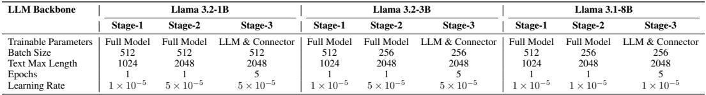
*Table 6: Table 6: Detailed hyperparameters for each training stage across different LLM backbones.*

> 💡 **Table 6 批读**: 表格要看主指标、次指标与效率/鲁棒性是否一致支持论文 claim。

# A.2 Runtime Comparison Between Connectors

One caveat in the ALIGN connector is that it includes an additional LM head layer, which slightly increases the total number of parameters. However, this addition has a negligible impact on runtime efficiency due to its simple structure. It only introduces a few matrix multiplication operations (as shown in Equations 1 and 2) instead of stacking many complex layers that require sequential processing, as in deep fusion methods.

> 💡 **批注**: 这段按 AlignVLM 的 latent alignment 主线读：视觉 token 不是被普通 MLP 任意投影，而是被约束为 LLM 文本嵌入的加权组合；关键是这种语言先验是否提升文档元素、表格结构和 OCR 相关推理的可解释性。

To empirically validate this claim, we benchmarked the runtime and memory usage of models equipped with different connector types (MLP, Align, Ovis, and Perceiver), following the same experimental setup as in Table 2. As shown in Table 7, the results demonstrate that although the ALIGN connector delivers notably superior performance (see Table 2), the variations in inference speed and GPU memory usage among the connectors remain minimal.

> 💡 **批注**: 这段按 AlignVLM 的 latent alignment 主线读：视觉 token 不是被普通 MLP 任意投影，而是被约束为 LLM 文本嵌入的加权组合；关键是这种语言先验是否提升文档元素、表格结构和 OCR 相关推理的可解释性。

Table 7: Runtime and memory comparison between different connector designs. The results show that ALIGN introduces negligible computational overhead compared to other connectors.

> 💡 **批注**: 这段按 AlignVLM 的 latent alignment 主线读：视觉 token 不是被普通 MLP 任意投影，而是被约束为 LLM 文本嵌入的加权组合；关键是这种语言先验是否提升文档元素、表格结构和 OCR 相关推理的可解释性。

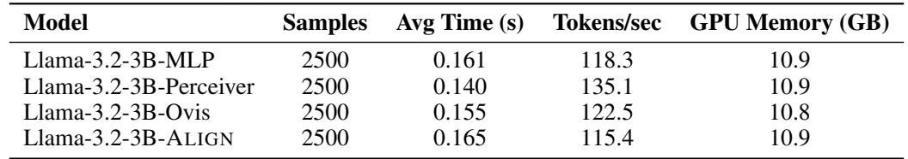
*Table 7: Table 7: Runtime and memory comparison between different connector designs. The results show that ALIGN introduces negligible computational overhead compared to other connectors.*

> 💡 **Table 7 批读**: 表格要看主指标、次指标与效率/鲁棒性是否一致支持论文 claim。

Overall, the empirical evidence confirms that the ALIGN connector achieves an effective balance between computational efficiency and performance. It introduces only a negligible increase in runtime and memory usage while providing substantial gains in overall accuracy.

> 💡 **批注**: 这段按 AlignVLM 的 latent alignment 主线读：视觉 token 不是被普通 MLP 任意投影，而是被约束为 LLM 文本嵌入的加权组合；关键是这种语言先验是否提升文档元素、表格结构和 OCR 相关推理的可解释性。

# A.3 Pixel-Level Tasks Analysis

To rigorously evaluate the ability of vision-language models to integrate fine-grained visual and textual pixellevel cues, we test our model on the VCR benchmark [Zhang et al., 2024], which requires the model to recover partially occluded texts with pixel-level hints from the revealed parts of the text. This task challenges VLM’s alignment of text and image in extreme situations. Current state-of-the-art models like GPT-4V OpenAI et al. [2023], Claude 3.5 Sonnet Anthropic [2024], and Llama-3.2 Dubey et al. [2024] significantly underperform humans on hard VCR task due to their inability to process subtle pixel-level cues in occluded text regions. These models frequently discard critical visual tokens during image tokenization on semantic priors, overlooking the interplay between partial character strokes and contextual visual scenes. To evaluate performance on VCR, we modify our Stage 3 SFT dataset composition by replacing the exclusive use of DocDownstream with a 5:1 blended ratio of DocDownstream and VCR training data. This adjustment enables direct evaluation of our architecture ALIGN’s ability to leverage pixel-level character cues.

> 💡 **批注**: 这段按 AlignVLM 的 latent alignment 主线读：视觉 token 不是被普通 MLP 任意投影，而是被约束为 LLM 文本嵌入的加权组合；关键是这种语言先验是否提升文档元素、表格结构和 OCR 相关推理的可解释性。

From the experimental outcomes, it is evident that ALIGNVLM consistently outperforms the MLP Connector Model across both easy and hard settings of the pixel-level VCR task (see Figure 5), with improvements ranging from $1 0 . 1 8 \%$ on the hard setting to $1 4 . 4 1 \%$ on the easy setting.

> 💡 **批注**: 这段按 AlignVLM 的 latent alignment 主线读：视觉 token 不是被普通 MLP 任意投影，而是被约束为 LLM 文本嵌入的加权组合；关键是这种语言先验是否提升文档元素、表格结构和 OCR 相关推理的可解释性。

We provide a case study on VCR in Figure 6, featuring four representative examples. In Figure 6a, it is evident that the MLP connector model fails to capture semantic consistency as effectively as ALIGNVLM. The phrase “The commune first census in written history in” (where the words in italics are generated by the model while the rest are in the image) is not as semantically coherent as the phrase generated by ALIGN “The commune first appears in written history in”.

> 💡 **批注**: 这段按 AlignVLM 的 latent alignment 主线读：视觉 token 不是被普通 MLP 任意投影，而是被约束为 LLM 文本嵌入的加权组合；关键是这种语言先验是否提升文档元素、表格结构和 OCR 相关推理的可解释性。

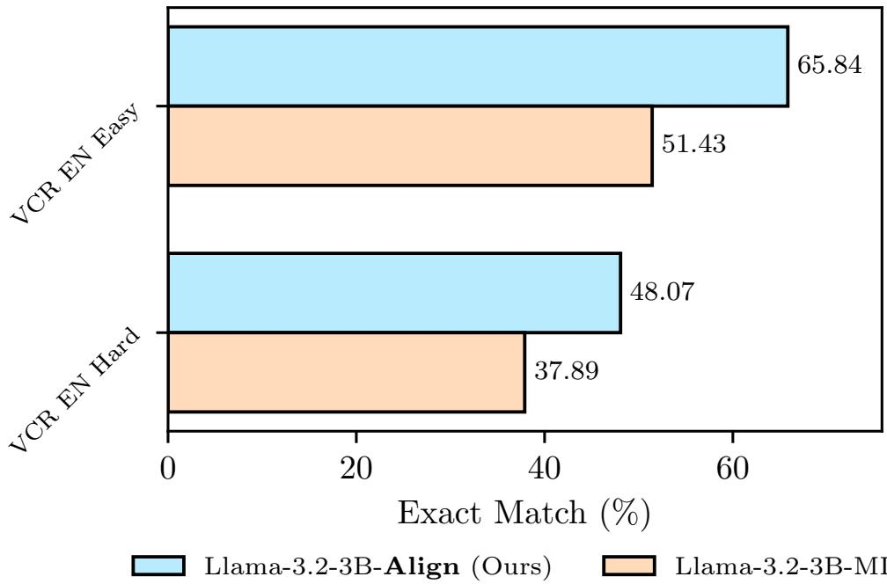
*Figure 5: Figure 5: Comparison of Llama-3.2-3b-ALIGN and Llama-3.2-3B-MLP on the Easy and Hard VCR tasks.*

> 💡 **Figure 5 批读**: 这张图要放回 AlignVLM 的问题设定里读：它通常用来说明 connector 对齐、文档理解样例、token 分布或噪声鲁棒性；重点看视觉证据是否被映射到 LLM 可用的语言空间。

Beyond the issue of semantic fluency, in Figure 6b we also observe that ALIGNVLM successfully identifies the uncovered portion of the letter “g” in “accounting” and uses it as a pixel-level hint to infer the correct word. In contrast, the MLP model fails to effectively attend to this crucial detail.

> 💡 **批注**: 这段是 vision-language latent alignment 主线：关注视觉特征如何经 connector 进入 LLM 可解释的文本嵌入区域，以及这种约束如何影响文档理解、低资源训练和噪声鲁棒性。

Figures 6c and 6d show examples where ALIGNVLM fails on the VCR task. These carefully picked instances show that our method mistakes names of landmarks with common words when the two are very similar. As seen in the examples, ALIGNVLM mistakes “Llanengan" for “Llanongan" and “Gorden" for “Garden”. In both instances, the pairs differ by one character, indicating perhaps that ALIGNVLM tends to align vision representations to more common tokens in the vocabulary. One approach that would potentially mitigate such errors would be to train ALIGNVLM with more contextually-relevant data.

> 💡 **批注**: 这段失败案例比成功案例更值钱。地标名被更常见词替换，说明 ALIGN 的语言先验确实会带来 common-token bias；这也是它迁移到医学专名、药名和缩写场景时必须小心的点。

# A.4 Case Studies

In this section, we provide case studies for the experiments in Section 5.1. Specifically, we provide examples of our Llama-3.2-3B-ALIGN, and its counterpart model with alternative connectors Llama-3.2-3B-MLP and Llama-3.2-3B-Ovis on three different datasets: KLC [Stanisławek et al., 2021], DocVQA [Mathew et al., 2021b], and TextVQA [Singh et al., 2019]. The examples are shown in Figure 7, 8, and 9.

> 💡 **批注**: 这段按 AlignVLM 的 latent alignment 主线读：视觉 token 不是被普通 MLP 任意投影，而是被约束为 LLM 文本嵌入的加权组合；关键是这种语言先验是否提升文档元素、表格结构和 OCR 相关推理的可解释性。

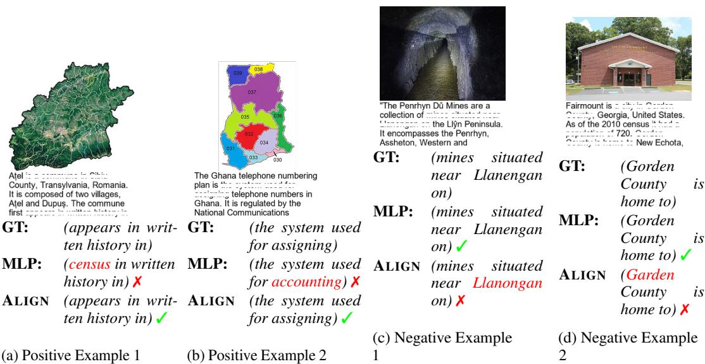
*Figure 6: Figure 6: Case Study for Pixel-Level Tasks. We provide examples of our proposed ALIGN connector compared with a the Multi-Layer Perceptron (MLP) connector. The ALIGN connector tends to better map visual elements to common words. GT is the ground truth.*

> 💡 **Figure 6 批读**: 这张图要放回 AlignVLM 的问题设定里读：它通常用来说明 connector 对齐、文档理解样例、token 分布或噪声鲁棒性；重点看视觉证据是否被映射到 LLM 可用的语言空间。

*Figure 7: MinerU 原始图片*

> 💡 **Figure 7 批读**: 这张图要放回 AlignVLM 的问题设定里读：它通常用来说明 connector 对齐、文档理解样例、token 分布或噪声鲁棒性；重点看视觉证据是否被映射到 LLM 可用的语言空间。

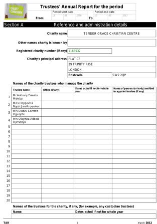
*Figure 8: MinerU 原始图片*

> 💡 **Figure 8 批读**: 这张图要放回 AlignVLM 的问题设定里读：它通常用来说明 connector 对齐、文档理解样例、token 分布或噪声鲁棒性；重点看视觉证据是否被映射到 LLM 可用的语言空间。

Question: What is the value for the charity name?   
GT: (Ardingly College Ltd.)   
MLP: (Ardington College Ltd.) ✗   
Ovis: (Ardington College Ltd.) $\cdot$   
ALIGN: (Ardingly College Ltd.) $\checkmark$ (a) Positive Example #1   
Question: What is the value for the address postcode?   
GT: (SW2 2QP)   
MLP: (SW22 0PQ) ✗   
Ovis: (SW2 2OP) ✗   
ALIGN: (SW2 2QP) ✓ (b) Positive Example #2   
Question: What is the value for the charity name?   
GT: (Human Appeal)   
MLP: (Humanitarian Agenda) ✗   
Ovis: (Human Appeal)   
ALIGN: (Human Rightsappeal) ✗ (c) Negative Example #1   
Question: What is the value for the post town address?   
GT: (Bishop’s Stortford)   
MLP: (Stortford) ✗   
Ovis: (Bishop’s Stortford)   
ALIGN: (Stortford) ✗ (d) Negative Example #2   
Question: What does the afternoon session begin on June 29?   
GT: (1:00)   
MLP: (2:45) ✗   
Ovis: (3:30) ✗   
ALIGN: (1:00) ✓ (a) Positive Example #1   
Question: What levels does the second table indicate?   
GT: (hematocrit data - Massachusetts)   
MLP: (SATISFACTORY) ✗   
Ovis: (Females) ✗   
ALIGN: (hematocrit data - Massachusetts) (b) Positive Example #2   
Question: What was the diet fed to the #1 group?   
GT: (basal diet)   
MLP: (basel diet) ✓   
Ovis: (Whole blood) ✗   
ALIGN: (control diet) ✗ (d) Negative Example #2   
Question: What greeting is written on the letter?   
GT: (good bye)   
MLP: (good) ✗   
Ovis: (good buy) ✗   
ALIGN: (good bye) ✓ (a) Positive Example #1   
Question: What indoor temperature is shown?   
GT: (68.4)   
MLP: $( \quad )$   
Ovis: $( 4 0 . 0 ) x$   
ALIGN: $( 6 8 . 4 ) \times$ (b) Positive Example #2   
Question: What type of club is advertised?   
GT: (health club)   
MLP: (topnote health club) ✗   
Ovis: (health club)   
ALIGN: (professional passionate personal) ✗ (c) Negative Example #1   
Question: What credit card is this?   
GT: (hadiah plus)   
MLP: (hadiah plus)   
Ovis: (american big loyalty program) ✗   
ALIGN: (hadia plus) ✗ (d) Negative Example #2

> 💡 **批注**: 这段是 vision-language latent alignment 主线：关注视觉特征如何经 connector 进入 LLM 可解释的文本嵌入区域，以及这种约束如何影响文档理解、低资源训练和噪声鲁棒性。

*Figure 9: MinerU 原始图片*

> 💡 **Figure 9 批读**: 这张图要放回 AlignVLM 的问题设定里读：它通常用来说明 connector 对齐、文档理解样例、token 分布或噪声鲁棒性；重点看视觉证据是否被映射到 LLM 可用的语言空间。

*Figure 7: Figure 7: Case Study for Connector Comparison on the KLC dataset [Stanisławek et al., 2021]. We show four qualitative examples (including two correct and two incorrect examples) comparing Llama-3.2-3B-ALIGN to the same architecture with different connectors, Llama-3.2-3B-MLP and Llama-3.2-3B-Ovis. “GT” denotes the ground truth.*

> 💡 **Figure 7 批读**: 这张图要放回 AlignVLM 的问题设定里读：它通常用来说明 connector 对齐、文档理解样例、token 分布或噪声鲁棒性；重点看视觉证据是否被映射到 LLM 可用的语言空间。

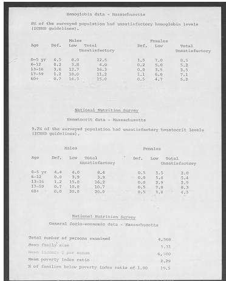
*Figure 11: MinerU 原始图片*

> 💡 **Figure 11 批读**: 这张图要放回 AlignVLM 的问题设定里读：它通常用来说明 connector 对齐、文档理解样例、token 分布或噪声鲁棒性；重点看视觉证据是否被映射到 LLM 可用的语言空间。

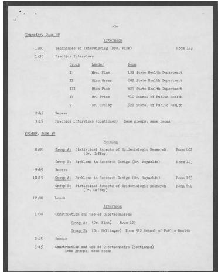
*Figure 12: MinerU 原始图片*

> 💡 **Figure 12 批读**: 这张图要放回 AlignVLM 的问题设定里读：它通常用来说明 connector 对齐、文档理解样例、token 分布或噪声鲁棒性；重点看视觉证据是否被映射到 LLM 可用的语言空间。

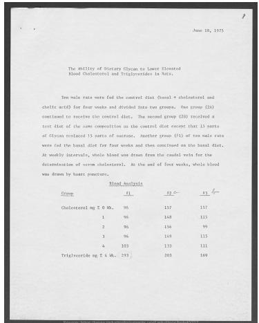
*Figure 13: MinerU 原始图片*

> 💡 **Figure 13 批读**: 这张图要放回 AlignVLM 的问题设定里读：它通常用来说明 connector 对齐、文档理解样例、token 分布或噪声鲁棒性；重点看视觉证据是否被映射到 LLM 可用的语言空间。

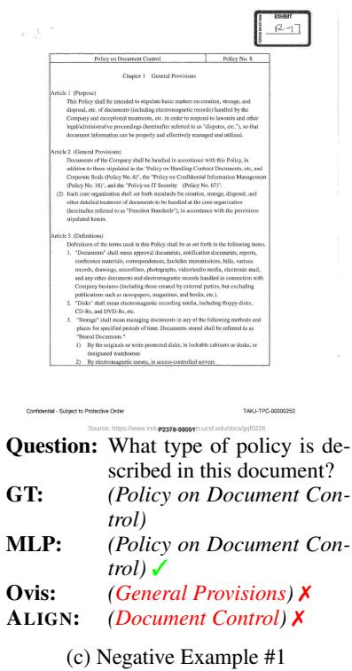
*Figure 8: Figure 8: Case Study for Connector Comparison on the DocVQA dataset [Mathew et al., 2021b]. We show four qualitative examples (including two correct and two incorrect examples) comparing Llama-3.2-3B-ALIGN to the same architecture with different connectors, Llama-3.2-3B-MLP and Llama-3.2-3B-Ovis. “GT” denotes the ground truth.*

> 💡 **Figure 8 批读**: 这张图要放回 AlignVLM 的问题设定里读：它通常用来说明 connector 对齐、文档理解样例、token 分布或噪声鲁棒性；重点看视觉证据是否被映射到 LLM 可用的语言空间。

*Figure 15: MinerU 原始图片*

> 💡 **Figure 15 批读**: 这张图要放回 AlignVLM 的问题设定里读：它通常用来说明 connector 对齐、文档理解样例、token 分布或噪声鲁棒性；重点看视觉证据是否被映射到 LLM 可用的语言空间。

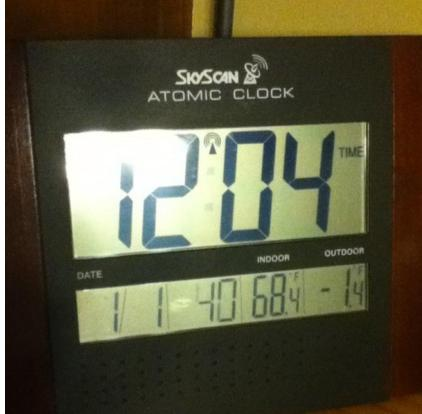
*Figure 16: MinerU 原始图片*

> 💡 **Figure 16 批读**: 这张图要放回 AlignVLM 的问题设定里读：它通常用来说明 connector 对齐、文档理解样例、token 分布或噪声鲁棒性；重点看视觉证据是否被映射到 LLM 可用的语言空间。

*Figure 17: MinerU 原始图片*

> 💡 **Figure 17 批读**: 这张图要放回 AlignVLM 的问题设定里读：它通常用来说明 connector 对齐、文档理解样例、token 分布或噪声鲁棒性；重点看视觉证据是否被映射到 LLM 可用的语言空间。

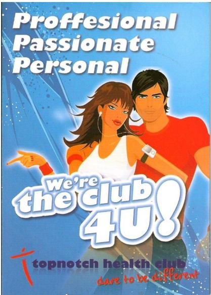
*Figure 9: Figure 9: Case Study for Connector Comparison on the TextVQA dataset [Singh et al., 2019]. We show four qualitative examples (including two correct and two incorrect examples) comparing Llama-3.2-3B-ALIGN to the same architecture with different connectors, Llama-3.2-3B-MLP and Llama-3.2-3B-Ovis. “GT” denotes the ground truth.*

> 💡 **Figure 9 批读**: 这张图要放回 AlignVLM 的问题设定里读：它通常用来说明 connector 对齐、文档理解样例、token 分布或噪声鲁棒性；重点看视觉证据是否被映射到 LLM 可用的语言空间。

---

## 🔖 Section 总结

### 核心洞察
1. 本节精读重点：把 AlignVLM 的 connector 设计、实验结论和文档理解场景联系起来看，尤其关注“对齐到语言嵌入凸组合”带来的收益与边界。
2. 阅读重点是把本节的机制/证据映射到论文主 claim。
3. 后续如有疑问，可在本 section 继续补充更细批注。
