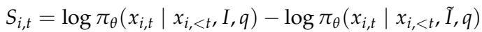
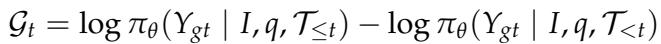
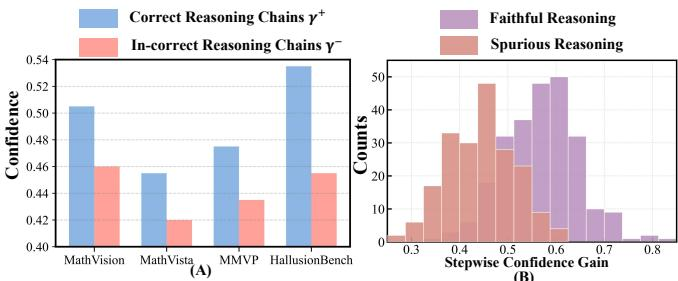

[← 返回 README](../README.md)

# 3. Preliminary and Motivation

## 一、Preview

本节围绕两个研究问题 (RQ) 展开：
- **RQ1**: 多模态模型在推理的每一步都需要视觉感知吗？
- **RQ2**: 如果不是，模型的内部表示能否指示何时需要视觉感知？

通过定义 Visual Dependency Score 和 Confidence Gain 两个量化指标，揭示两个关键发现：
1. 视觉依赖在推理过程中高度不均匀
2. 内部置信度是推理质量和视觉 grounding 需求的天然指标

---

## 二、原始文本

As shown in Figure 12, existing reasoning paradigms commonly suffer from insufficient visual grounding, unstable tool invocation, and high computational overhead. These limitations motivate a fundamental question: why can't MLLMs reason like humans do, dynamically deciding how to reason and which visual information to pay attention on during the thinking process? To this end, we organize the section around two research questions: (RQ1) Whether multimodal models require visual perception at every step of reasoning? (RQ2) If not, can their internal representations indicate when visual perception and reasoning is required?

> 💡 **问题动机**: 本节的驱动问题——现有推理范式都有各自的短板，根源在于它们没有像人类一样动态地决定"何时推理"和"关注什么"。RQ1 和 RQ2 的设计非常巧妙，直指问题的本质。

### 3.1 Dynamic Perception-Reasoning is Necessary

Definition 3.1 (Visual Dependency Score). Let the visual input be denoted as I, and its perturbed version as I~. Given a query q*, the model's dependence on visual information can be quantified by measuring the output discrepancy between the original and perturbed visual inputs. Specifically, for the i-th generated sequence Xi = {xi,1, xi,2, ..., xi,t}, the visual dependency score at position t is defined as:

where pi_theta(*) denotes the token-level conditional probability distribution of the model. A larger Si,t indicates a stronger dependency of the generated token on visual information. Building upon the above metric, we analyze visual dependency on the Math-Vision benchmark using the Qwen2.5-VL-7B [42] at two levels. First, for individual reasoning chains, we compute token-level visual dependency scores, capturing how much each generated token relies on visual information, as illustrated in Figure 2(a). Second, as shown in Figure 2(b), we aggregate these

> 💡 **公式批读 — Visual Dependency Score**: 定义 I 为原始图像，I~ 为扰动版本。S = log pi(x|I) - log pi(x|I~)。直观理解：如果模型对该 token 的预测严重依赖视觉信息，那么扰动图像后预测概率会大幅下降，导致 S 很大。这是一个巧妙的无参量化方法——通过"消融"视觉信息来测量其贡献。

*Figure 2: Analysis of visual dependency in reasoning. (A) Token-level distribution shows visual sensitivity is concentrated in a few tokens. (B) Chain-level distribution reveals large variation in visual reliance across reasoning trajectories.*

> 💡 **Figure 2 批读**: (A) Token-level：在单条推理链中，视觉依赖高度集中在少数 token 上，大部分 token 对视觉信息不敏感。(B) Chain-level：不同推理链之间视觉依赖的分布差异很大。这直接回答了 RQ1——**推理并不是每一步都需要视觉感知，而是只有少数关键步骤需要**。

scores across full reasoning trajectories to obtain chain-level visual dependency, which reveals how different reasoning paths vary in their reliance on visual perception. These results reveal that:

Takeaway 1. The dependency on visual input across the reasoning process is highly uneven: only a small subset of tokens show strong sensitivity to visual features, while the majority operate independently of the image.

Takeaway 2. Across reasoning chains sampled from the same model, visual dependency varies substantially.
Chains exhibiting stronger visual reliance consistently yield higher accuracy.

> 💡 **机制拆解 — Takeaway 解读**:
> - Takeaway 1 → 设计启示：不需要在所有位置注入视觉信息，只需要在少数**关键步骤**注入 → 这为动态视觉注入 (DVI) 提供了理论基础
> - Takeaway 2 → 设计启示：视觉依赖更强的链有更高准确率 → 增强视觉 grounding 应该能提升推理质量
> - 这两个 Takeaway 共同指向：**动态、自适应的视觉注入是关键**

### 3.2 Internal Confidence Affects Multimodal Reasoning

Definition 3.2 (Confidence Gain). Let I denote the visual input, q the query, and Tt denotes the reasoning at step t. The Confidence Gain at step t is defined as the change in the probability of the ground-truth answer Ygt after adding step xt. A positive Gt suggests that step xt strengthens the confidence, whereas a negative value indicates the opposite.

> 💡 **公式批读 — Confidence Gain**: Gt = log pi(Y_gt | I, q, T<=t) - log pi(Y_gt | I, q, T<t)。衡量加入第 t 步推理后，模型对正确答案置信度的变化。正 Gt 表示该推理步骤"有用"，增强了模型得出正确答案的信心。这是后续 Confidence-Guided Reward 设计的核心预热。

Observation 1: Higher Confidence Tends to Indicate Higher Reasoning Accuracy. We analyze reasoning chains generated by various reasoning models across four benchmarks, where all chains are partitioned into a correct set T+ and an incorrect set T- based on their answer correctness. We then compute the proportion of reasoning steps for each chain that obtain a positive confidence reward. As shown in Figure 3(a), reasoning chains in T+ exhibit a substantially higher proportion of positive confidence increments compared to those in T-, indicating that the reasoning leading to correct answers tends to exhibit more stable and higher confidence.

Observation 2: Confidence Reflects Reasoning Chains Quality. We investigate whether confidence dynamics reflect reasoning quality by evaluating reasoning chains within the correct set T+ using the evaluator GPT-4o [43]. Each chain is assessed for logical validity and factual consistency, and categorized into Faithful and Spurious groups. As shown in Figure 3(b), faithful reasoning chains exhibit a higher proportion of positive confidence increments, suggesting that confidence improvement not only correlates with answer accuracy but also reveals the intrinsic quality of the reasoning process.

*Figure 3: Analysis of the relationship between confidence and reasoning quality. (A) Correct reasoning chains exhibit substantially higher frequencies of positive confidence gains than incorrect ones. (B) Faithful reasoning shows consistently stronger confidence improvement than spurious reasoning.*

> 💡 **Figure 3 批读**: (A) 正确推理链中正面置信度增量的比例显著高于错误链 → 置信度可以作为推理正确性的有效代理信号。(B) 即使都是正确的推理链，"忠实推理 (Faithful)"比"虚假推理 (Spurious)"有更高的正面置信度比例 → 置信度不仅反映答案对错，还反映推理过程的内在质量。这为用置信度作为 reward 来优化推理过程提供了实证支持。

*Figure 4: Analysis of the relationship between confidence and visual grounding. (A) Hallucinated steps show lower confidence than non-hallucinated ones. (B) Hallucinated steps exhibit weaker image relevancy than their counterparts.*

> 💡 **Figure 4 批读**: (A) 幻觉步骤 (hallucinated steps) 的置信度显著低于非幻觉步骤。(B) 幻觉步骤的图像相关性 (image relevancy) 也更弱。这个结果将**置信度、幻觉、视觉 grounding** 三者联系起来：低置信度 → 视觉 grounding 不足 → 幻觉。因此，通过提升置信度可以间接加强 visual grounding，从而减少幻觉。

Observation 3: High Confidence Aligns with Stronger Visual Grounding. We further evaluate various reasoning models on the perception benchmark to analyze the relationship between confidence and visual grounding. Each step in the reasoning chain is categorized as hallucinated or non-hallucination based on whether it refers to an object actually present in the image. As shown in Figure 4, hallucinated steps exhibit lower confidence and weaker visual grounding, while non-hallucinatory steps maintain higher and more stable confidence with stronger visual alignment. The results indicate that confidence acts as an intrinsic signal of visual faithfulness, with higher confidence consistently associated with more reliable reasoning.

> 💡 **机制拆解 — 从 Motivation 到 Method 的逻辑链**:
>
> Takeaway 1 (视觉依赖不均匀) + Observation 3 (置信度与视觉 grounding 对齐) → **DMLR 的双组件设计**:
> - RQ1 的答案 (视觉依赖不均匀) → 需要 **Dynamic Visual Injection**（不是所有位置都注入，只在需要时注入）
> - RQ2 的答案 (置信度可指示视觉需求) → 需要 **Confidence-Guided Optimization**（用置信度作为 reward 来驱动优化和决定何时注入视觉信息）
>
> 这就是为什么 DMLR 的两个核心组件是"置信度引导优化"和"动态视觉注入"——它们分别对应两个 RQ 的答案。

---

## 三、Summary

- **RQ1 答案**: 推理不需要每一步都视觉感知，视觉依赖高度不均匀且集中
- **RQ2 答案**: 内部置信度是视觉 grounding 需求的天然指标
- **设计启示**: 用置信度驱动动态视觉注入 → DMLR 的核心理念
- **关键指标**: Visual Dependency Score (消融法) + Confidence Gain (置信度变化量)
