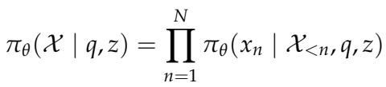
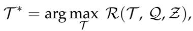
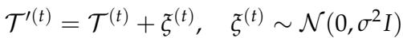
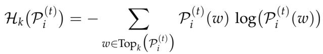
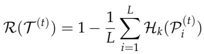
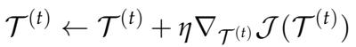
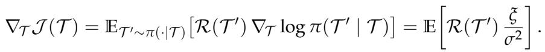
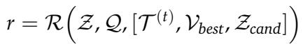
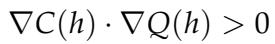
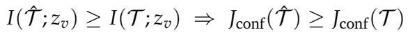

[← 返回 README](../README.md)

# 4. Methodology

## 一、Preview

DMLR 的核心方法论包含三部分：
1. **Problem Formulation** (4.1): 定义潜思维令牌和测试时优化目标
2. **Dynamic Multimodal Latent Reasoning** (4.2): 核心算法，包含初始化、Reward formulation、策略梯度优化、动态视觉注入
3. **Theoretical Analysis** (4.3): 两个定理提供理论支撑

---

## 二、原始文本

### 4.1 Problem Formulation

Given a text input sequence Q = (q1, ..., qk) and a set of visual embeddings Z = (z1, ..., zI) extracted by a visual encoder, the MLLM pi_theta encodes the text sequence into embeddings and incorporates visual features to generate the reasoning sequence X = (x1, x2, ..., xN).

where x<n denotes the sequence of tokens preceding position n. Different from approaches that use the last hidden state of the previous reasoning step as latent think tokens [44, 18], we introduce L learnable latent think tokens into the input sequence, whose embeddings after projection are denoted as T = [tau1, tau2, ..., tauL]. These tokens are concatenated with the original inputs and fed into the model. During test-time inference, our core idea is to keep model parameters fixed and improve reasoning solely by optimizing the embeddings of the latent think tokens. Motivated by the observations in Section 3, we define a reward function R to quantify the confidence of the current latent reasoning state. This leads to the following test-time optimization objective:

In practice, the model iteratively update the latent think tokens for T steps, allowing them to progressively evolve toward directions that maximize the reward.

> 💡 **公式批读 — Problem Formulation**: 
> - **输入**: 文本序列 Q + 视觉嵌入 Z
> - **新增变量**: L 个可学习的 latent think tokens T（维度与模型隐藏层一致）
> - **优化目标**: argmax_T R(T, Q, Z)，即找到使 reward 最大化的潜令牌
> - **与 baseline 的关键区别**: 不同于 COCONUT 使用上一步推理的 last hidden state 作为潜令牌，DMLR 引入独立的可优化潜令牌，迭代 T 步
> - **数据流**: Q + Z + T → 模型前向 → R(T) → 梯度更新 T → 重复 → 最终 T* 用于解码

### 4.2 Dynamic Multimodal Latent Reasoning

In light of the observations in Section 3, DMLR comprises two key processes: dynamic visual injection strategy for RQ1, and confidence-guided optimization of latent think tokens for RQ2, as shown in Figure 5 and Algorithm 1.

*Figure 5: Overview of the proposed DMLR framework. The model performs exploration through controlled noise (Eq. 5) and iteratively optimizes the latent think tokens via confidence-guided policy updates (Eq. 8-9). Dynamic Visual Injection (Eq. 10) selects and updates the best visual patches during optimization, and the optimized latent tokens are decoded (Eq. 3) to produce the output.*

> 💡 **Figure 5 批读**: 这是 DMLR 最核心的架构图。数据流如下：
> 1. **Input**: 文本 Q + 图像 Z + 潜令牌 T
> 2. **Exploration**: 通过 Gaussian noise 扰动 T → T' (Eq.5)
> 3. **Reward Computation**: 前向传播得到 token 概率分布 Pi，计算 truncated entropy → 得到 reward R (Eq.6-7)
> 4. **Policy Gradient Update**: REINFORCE 更新 T (Eq.8-9)
> 5. **Dynamic Visual Injection**: 根据 attention 选择候选 patch Z_cand，与当前的 best patch V_best 一起注入，计算 reward，如果提升则更新 V_best (Eq.10)
> 6. **迭代 T 步**
> 7. **Decode**: 将优化后的 T* 与 Q, Z 一起解码输出最终答案

**Latent Think Tokens Initialization.** We initialize the latent think tokens before each iteration to facilitate exploration in the latent space. To this end, we adopt a stochastic perturbation strategy that adds controlled randomness while preserving representation stability. Specifically, multiplicative noise sampled from a Gaussian distribution is applied as a local perturbation to the current latent state:

where sigma^2 is a variance hyperparameter that controls the magnitude of exploration and xi^(t) is the multiplicative Gaussian noise sampled at iteration t. More analyses and results are shown in Section 5.3.

> 💡 **公式批读 — 潜令牌初始化 (Eq.5)**:
> - **操作**: T' = T + xi, xi ~ N(0, sigma^2 I)
> - **目的**: 在潜空间中做 exploration，避免优化陷入局部最优
> - **关键设计**: 噪声是**乘性**的，添加到当前潜令牌上，而不是完全随机初始化
> - **超参数**: sigma (默认 0.1 = 10%)，控制探索幅度

**Reward Formulation.** We propose a confidence-guided reward that dynamically optimizes latent think tokens during reasoning. In contrast to prior approaches [45, 30] that use confidence only for post-hoc evaluation, we treats it as an intrinsic feedback signal that continuously guides latent reasoning optimization. Given the latent think state T^(t), the query q, and visual features z, the model pi_theta generates token-level probability distributions Pi^(t) over the vocabulary w. We further quantify the model's confidence for each latent think token by computing the truncated entropy over its top-k most probable tokens, defined as:

where Topk(*) denotes the set of the k tokens with the highest probabilities. A lower value of the entropy Hk(*) corresponds to higher confidence in the model's prediction at that position. The reward for the entire latent reasoning sequence is defined as the complement of the mean truncated entropy computed over all L latent think tokens:

> 💡 **公式批读 — Reward 设计 (Eq.6-7)**:
> - **输入**: 潜令牌 T 经过模型前向传播得到的 top-k token 概率分布
> - **中间**: 对每个潜令牌位置，计算 top-k 的截断熵 Hk(Pi) = -sum_{w in Top-k} P(w) * log P(w)
> - **输出**: R = 1 - mean(Hk) over all L tokens
> - **直觉**: 如果模型对某位置的 top-k 预测很"确定"（分布尖锐），熵低 → 置信度高 → Reward 高
> - **设计巧妙之处**: 
>   1. 使用 **truncated entropy**（只看 top-k）而非 full entropy，避免了长尾噪声
>   2. Reward 是 **intrinsic feedback**，不需要 ground-truth 标注 → training-free 的关键
>   3. 置信度作为优化信号，形成闭环：优化 → 更确定 → 更高 reward → 继续优化

**Test-Time Latent Optimization.** Recent works [15, 46, 38] have explored test-time gradient optimization to enable adaptation in language tasks, whereas we focus on optimization processes for multimodal latent reasoning. Specifically, during the test-time inference, guided by the objective defined in Equation 7, we adopt a REINFORCE-based [47] direct policy gradient method to adaptively optimize the latent think tokens T^(t). Assuming that each latent think token is independent, the update rule is formulated as:

where eta denotes the learning rate. According to the Policy Gradient Theorem and Equation 5, the gradient can be formulated and further expressed as:

> 💡 **公式批读 — 策略梯度优化 (Eq.8-9)**:
> - **Eq.8**: T ← T + eta * grad_T J(T)，标准的梯度上升
> - **Eq.9**: 将梯度展开为期望形式。由于扰动来自 Gaussian (Eq.5)，log pi(T'|T) 的梯度与 xi/sigma^2 相关 → grad = E[R(T') * xi / sigma^2]
> - **实际计算**: 在每次迭代中，采样一个噪声 xi，计算扰动后的 reward，用 R * xi / sigma^2 作为梯度估计来更新 T
> - **为什么用 REINFORCE**: reward R 不是直接可微的（它来自模型的前向传播输出），需要策略梯度方法来进行优化

**Visual Injection Strategy.** Different from methods that directly inject high-attention regions [41], our strategy updates the most informative visual patches based on the reward at each iteration and injects them as latent visual tokens. As illustrated in Algorithm 1, we first use the initial attention of the latent think token to collect m highly relevant image patches (see Section 5.1), which serve as the initial best patch V_best. At each iteration, the model resamples m candidate patches Z_cand = {Z1, ..., Zm} based on the updated attention and injects them together with the previous best patch into the latent sequence for reward, as formulated in Equation 10. If the reward r > r_best, indicating that the candidate patches provide enhanced visual evidence, the best patch V_best is updated; otherwise, the previous best is retained.

As the iterations progress, the best visual patch converges to the regions most relevant to the latent think state, guiding the latent reasoning toward more effective optimization.

> 💡 **机制拆解 — 动态视觉注入策略 (DVI) 的完整流程**:
>
> **初始化**:
> - 用初始 attention 收集 m 个高相关 image patches 作为 V_best
>
> **迭代 (L 次)**:
> 1. 基于当前 T 的 attention，重新选择 m 个候选 patches Z_cand
> 2. 将 [T, V_best, Z_cand] 拼接，计算 reward r
> 3. **如果 r > r_best**: 更新 V_best ← V_best U Z_cand, T ← [T, Z_cand, V_best]（接受候选 patches）
> 4. **否则**: T ← [T, V_best]（保留之前的最佳 patches）
>
> **关键设计理念**:
> - **Attention-based selection**: 用 attention 而非固定规则选择 patch → 自适应
> - **Reward-gated update**: 只有提升 reward 的 patches 才被保留 → 防止冗余视觉信息
> - **Cumulative best patch**: V_best 持续累积 → 逐渐收敛到最相关的视觉区域
> - **与 ICoT 的关键区别**: ICoT 每次注入所有高 attention 区域 → 冗余且不稳定；DMLR 通过 reward-gated 机制只保留真正有用的 patches

---

**Algorithm 1: Dynamic Multimodal Latent Reasoning**

*Algorithm 1: Dynamic Multimodal Latent Reasoning*

> 💡 **算法流程解读**:
>
> **Inputs**: image embeddings Z, text embeddings Q, latent tokens T, learning rate eta, iterations T, best visual patch V_best, top-k probability, number of candidate patches m
>
> **Phase 1: Latent Policy Gradient Optimization** (for t = 1...T)
> - Perturbation: xi ~ N(0, sigma^2 I), T' ← T + xi
> - Update: T ← T + eta * grad_T J(T)  (REINFORCE)
>
> **Phase 2: Dynamic Visual Injection** (for l = 1...L)
> - Initialize V_best from initial attention
> - Each step: select m candidate patches Z_cand via attention → compute reward → accept/reject based on reward comparison
>
> **Output**: Decode(T*, Z, Q) → final answer X

X ← Decode(T(t), Z, Q) return X

### 4.3 Theoretical Analysis

To further understand why DMLR achieves high efficiency and robust performance, we provide theoretical explanations through the following two theorems.

Theorem 4.1 (Confidence Reflects Reasoning Quality). Let h denote the latent reasoning state in DMLR, where C(h) represents the model's confidence level and Q(h) denotes the corresponding reasoning quality. If and only if the gradients of C(h) and Q(h) are positively aligned, the DMLR update along the confidence ascent direction will consequently improve the reasoning quality:

> 💡 **Theorem 4.1 批读**: 定理表述了一个充分必要条件：当且仅当置信度 C(h) 和推理质量 Q(h) 在潜状态 h 处的梯度正对齐 (gradient dot product > 0) 时，沿置信度上升方向更新 h 也会提升推理质量。这为"用置信度作为优化目标"提供了理论保证——前提是梯度的正对齐假设成立。Section 3 的实证分析（Observation 1-3）为这个假设提供了经验支持。

Theorem 4.2. (Visual Injection Enhances Confidence). Let tau be the latent reasoning states, tau_hat denote the updated states after visual injection, and z_v be the visual features. Visual injection in DMLR increases the mutual information between latent states and visual features, thereby enhancing the expected confidence J_conf(T), satisfying:

> 💡 **Theorem 4.2 批读**: 视觉注入增加了潜状态 T 和视觉特征 z_v 之间的互信息 I(T; z_v)，从而提升了期望置信度 J_conf(T)。直观理解：引入视觉信息让潜状态与视觉输入建立更强的关联，模型因此对预测更加"确定"→ 置信度提升。这为 DVI 策略提供了信息论层面的理论解释。

---

## 三、Summary

- **数据流**: Input (Q+Z+T) → Exploration (噪声扰动) → Reward (截断熵) → Policy Gradient Update → Dynamic Visual Injection → 迭代 → Decode
- **核心创新**: 置信度作为 intrinsic reward 驱动优化 + 动态自适应视觉注入
- **理论支撑**: Theorem 4.1 保证置信度优化 → 推理质量提升；Theorem 4.2 保证视觉注入 → 置信度提升 → 形成正反馈闭环
- **训练开销**: Training-free，所有优化在 test-time 完成
