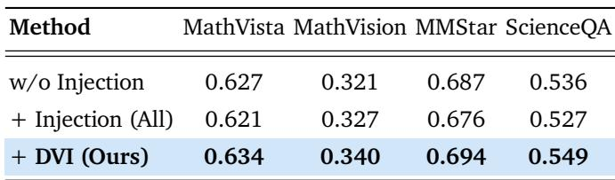
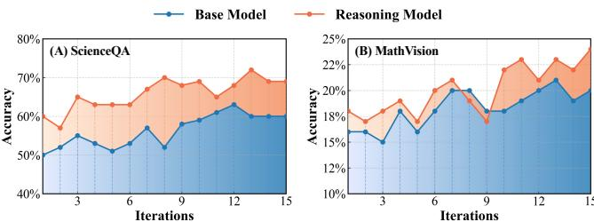
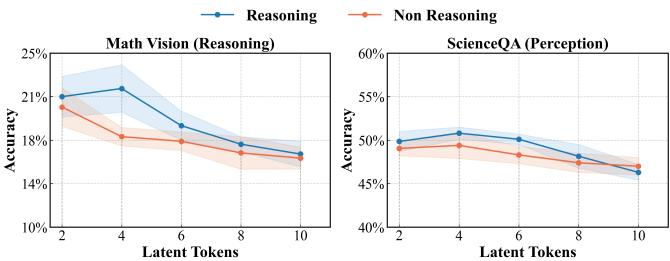

[← 返回 README](../README.md)

# 5. Experiments

## 一、Preview

实验部分涵盖：
- 5.1 Experiment Setup: 6 个模型基线 + 3 类方法基线 + 6 个 benchmark
- 5.2 Main Results: DMLR 在 95%+ 任务上达到最优
- 5.3 Ablation Study: 视觉注入策略、迭代数、噪声幅度、patch 数量、潜令牌数量
- 5.4 Quantitative Analysis: Visual grounding 可视化、潜行为分析、推理效率

---

## 二、原始文本

### 5.1 Experiment Setup

Baselines. We evaluate the proposed DMLR using two types of baselines: model-based and method-based. For the model baselines, we consider six representative MLLMs, including two reasoning models, R1-OneVision [48] and VLAA-Thinking [49], as well as four non-reasoning models, Qwen2.5-VL-3B/7B [42] and Qwen3-VL-4B/8B [50]. For method baselines, we consider two reasoning paradigms: Text-only Reasoning (CCoT [51]) and Vision-Text Involved Reasoning (ICoT [41], Multimodal-CoT [52]). We further include a Vanilla baseline where non-reasoning models answer directly and reasoning models use their default prompts.

Evaluation Benchmarks. We evaluate our method on three tasks across six benchmarks: (1) Mathematics Reasoning (MathVista mini [53], MathVision mini [54], MM Math [55]); (2) Visual Reasoning (HallusionBench [56], MMVP [24]); (3) Multimodal Composition (MMStar [57], ScienceQA [58]). Details are provided in Appendix A.1.

Implementation Details. All frameworks adopt the eager attention mode to enable access to internal attention maps. A total of 4 latent think tokens tau are used, with m = 2 visual candidate patches injected at each iteration. The default number of optimization iterations is set to 15, with a learning rate of 10^{-3}. To ensure stable exploration in the latent space, the perturbation magnitude sigma is set to 10%. All experiments are conducted on four NVIDIA H100 GPUs, with further detailed parameter analyses in Appendix A.3.

> 💡 **实验配置解读**:
>
> | 参数 | 值 | 说明 |
> |------|-----|------|
> | Latent Think Tokens (L) | 4 | 潜令牌数量 |
> | Candidate Patches (m) | 2 | 每次注入的候选视觉 patch |
> | Iterations (T) | 15 | 优化步数 |
> | Learning Rate (eta) | 1e-3 | 策略梯度学习率 |
> | Noise Scale (sigma) | 10% | 高斯噪声标准差 |
> | GPU | 4x NVIDIA H100 | |
> | Attention Mode | Eager | 用于获取内部 attention map |

### 5.2 Main Results

Overall Results. As shown in Table 1, models integrated with DMLR achieve the best performance on over 95% of tasks. On mathematical and visual reasoning benchmarks, Qwen2.5-VL-7B achieves average improvements of +1.5% in mathematics and +0.9% in visual reasoning, while the reasoning counterpart R1-OneVision attains average gains of +4.5% and +3.45% on the two domains, respectively. These results indicate that DMLR generalizes robustly across diverse model paradigms and scales. Unlike other baseline methods that often involve trade-offs between reasoning and perception, DMLR consistently improves performance in both domains. For instance, while ICoT yields noticeable gains on mathematical tasks but provides only limited improvements on visual reasoning (e.g., MMVP), DMLR delivers more stable cross domain enhancements, with DMLR-integrated VLAA-Thinking averaging +2.43% higher across all benchmarks.

*Table 1: Comparison of different reasoning methods and DMLR across various benchmarks. All metrics are reported in Accuracy (%). Results are evaluated over a diverse suite of mathematics reasoning, visual reasoning, and multimodal composition tasks under multiple backbone models.*

> 💡 **Table 1 批读 — 主要结果分析**:
>
> **关键发现**:
> 1. **跨模型泛化**: DMLR 在 6 个不同 backbone (Qwen2.5-VL-3B/7B, Qwen3-VL-4B/8B, R1-OneVision, VLAA-Thinking) 上都一致提升，证明了方法的通用性
> 2. **推理模型受益更大**: R1-OneVision 平均 +4.5% (数学) +3.45% (视觉) vs Qwen2.5-VL-7B +1.5% +0.9%。推理能力越强的模型，潜空间优化的空间越大
> 3. **跨域稳定性**: DMLR 在数学推理和视觉推理上都有稳定提升，不像 ICoT 在数学上提升明显但在视觉推理上提升有限（如 MMVP）
> 4. **最大提升**: R1-OneVision + DMLR 在 MathVision 上达到 +4.1%，在 HallusionBench 上达到 +5.94%
> 5. **vs Baselines**: DMLR 在所有 6 个模型 + 7 个 benchmark 的组合中，95%+ 达到 SOTA

### 5.3 Ablation Study

*Table 2: Ablation on Latent Visual Injection. We compare different injection strategies across multiple benchmarks. All injects all visual patches at every iteration, while Ours injects the best visual patches. Refer to Section 5.1 for detailed settings.*

> 💡 **Table 2 批读 — 消融实验**:
> - w/o Injection: 移除视觉注入 → 推理稳定但感知准确率下降 → 视觉信息在潜空间优化中确实是必要的
> - +Injection (All): 注入所有视觉 patches → 增强了感知但引入了不稳定性（冗余信息干扰）→ 在某些 benchmark 上甚至比 w/o Injection 差
> - +DVI (Ours): 动态选择最优 patches → 在所有 benchmark 上一致最优
> - **结论**: 视觉注入是必要的，但"注入什么"比"是否需要注入"更重要——DVI 的核心价值在于**选择性地注入最有用的视觉信息**

Impact of Visual Injection Strategies. We evaluate various visual injection strategies to assess their effects on reasoning performance. As shown in Table 2, removing visual injection maintains stable reasoning results but leads to a clear drop in perceptual accuracy, underscoring the necessity of visual cues during latent optimization. Injecting all visual patches enhances perception but introduces instability due to redundant visual information. In contrast, DMLR exhibits consistently more stable performance, indicating that its continuously selects more relevant and stable visual information throughout the iterative optimization.

Impact of Iteration Number. As shown in Figure 6, increasing the number of iterations leads to a steady improvement on both reasoning and perception tasks, indicating that iterative optimization effectively enhances latent reasoning. Morever, the reasoning model maintains consistently higher accuracy throughout the process and continues to yield gains even after multiple iterations, demonstrating a stronger ability to benefit from iterative refinement.

*Figure 6: Effect of iterations on performance. For both the base model and the reasoning model, accuracy on both datasets increases as the number of iterations grows.*

Impact of Noise Scale. We further analyze the influence of the perturbation magnitude sigma on latent optimization. As shown in Figure 7(b), increasing the initial noise scale promotes effective exploration, allowing the model to cover a wider range of latent trajectories and identify higher-confidence reasoning paths. However, when sigma becomes excessively large, the injected perturbation makes the updates unstable, leading to a subsequent drop in performance. This indicates that latent reasoning benefits from only a modest level of perturbation.

Impact of Visual Patch Number. As shown in Figure 7(a), performance improves when a moderate number of candidate visual patches are injected, whereas injecting an excessive number of patches leads to a clear decline. This trend indicates that a limited number of candidates is sufficient for effective updates, while excessive patches introduce redundant visual information that negatively affect optimization. Furthermore, Figure 8 shows that as the iterations progress, the reward steadily increases and the selected best patch becomes increasingly stable, exhibiting a clear convergence trend. This trend indicates that the dynamic injection strategy does not continually introduce additional visual patches into the latent space, but instead converges toward a small set of highly relevant patches during optimization.

*Figure 7: (A) Effect of the number of injected candidate visual patches on performance. (B) Impact of noise magnitude (%) on performance. All results are evaluated on the MathVision dataset.*

> 💡 **Figure 7 批读**: (A) 候选 patch 数 m 的影响——m=2 附近最优，m 过大性能下降（冗余信息），m 过小信息不足。(B) 噪声 sigma 的影响——sigma=10% 附近最优，太小的噪声探索不足（局部最优），太大的噪声导致更新不稳定。

*Figure 8: Confidence reward and best visual patch injection across iterations. Both the base model and the reasoning model exhibit a clear positive correlation.*

> 💡 **Figure 8 批读**: reward 随迭代稳步上升，同时 best patch 的注入趋于稳定 → DVI 策略确实在收敛，不会无限注入新 patch。推理模型的 reward 曲线整体高于基础模型，说明推理模型在潜空间中有更清晰的"信心格局"。

*Figure 9: Effect of the number of latent tokens. Increasing the number of latent tokens initially improves performance, but excessive tokens lead to noticeable degradation.*

> 💡 **Figure 9 批读**: 潜令牌数量 L 的影响——L=2~4 最优，L 过大性能下降且推理模型波动更剧烈。更多潜令牌不代表更好的推理，反而增加了优化难度（维度灾难 + 不稳定性）。

Number of Latent Think Tokens. We further evaluate the impact of the number of latent think tokens on overall performance. As shown in Figure 9, setting the number of latent tokens to a small range (2-4) yields stable improvements on both reasoning and perception tasks. However, as the number of tokens continues to increase, performance on both tasks begins to decline, with the reasoning model exhibiting more pronounced fluctuations. This overall trend indicates that increasing the number of latent tokens beyond a moderate level does not provide additional benefits and instead makes the optimization process less stable.

> 💡 **消融解读 — 综合总结**:
>
> | 消融维度 | 最优设置 | 关键发现 |
> |---------|---------|---------|
> | Visual Injection | DVI (动态选择) | 注入优于不注入；选择性注入优于全注入 |
> | Iterations | 15+ (持续提升) | 迭代优化有效，推理模型受益更多 |
> | Noise Scale | ~10% | 适度扰动必要；过大不稳定 |
> | Candidate Patches | 2 | 有限候选足够；过多冗余 |
> | Latent Tokens | 2-4 | 适度最优；过多引入不稳定性 |

### 5.4 Quantitative Analysis

Visual Grounding Analysis. We visualize the attention heatmaps of VLAA-Thinking during the reasoning process. As shown in Figure 10(a), the explicit CoT baseline often shifts its attention toward task-irrelevant regions, whereas DMLR maintains a stable focus on task-relevant areas. This demonstrates that latent multimodal reasoning produces more consistent and reliable visual grounding throughout the reasoning process. Figure 10(b) further shows the evolution of attention across iterations. The attention distribution gradually converges toward task-relevant regions in models integrated with DMLR, reflecting a more stable and consistent focus throughout the optimization.

Latent Behavior Analysis. We visualize the final distributions of latent think tokens, text tokens, and image tokens using t-SNE [59] to analyze the effect of the iterative optimization on the latent reasoning. As shown in Figure 10(c), the latent think tokens form a tight cluster that is well separated from both text and visual embeddings, and are located in a stable intermediate region between the two modalities. This distribution suggests that the optimized latent tokens become modality-independent, forming a unified cross-modal semantic representation. The compactness of the cluster further indicates that the optimization process yields more stable and consistent latent reasoning states.

*Figure 10: Qualitative analysis of our DMLR framework. (A) Visual comparison of visual grounding behaviors between Explicit CoT and DMLR across diverse queries. DMLR produces more focused and stable visual grounding than explicit CoT. (B) Perception optimization across latent think token iterations, where visual attention becomes progressively sharper and better aligned with relevant regions. (C) Visualization of latent embeddings showing the geometric separation of latent think tokens, text tokens, and image tokens, illustrating the structured organization of the latent reasoning space.*

> 💡 **Figure 10 批读**:
> - (A) DMLR 的 visual grounding 比显式 CoT 更聚焦于任务相关区域，减少了注意力漂移
> - (B) 随着迭代进行，视觉注意力逐渐收敛到任务相关区域 → DVI 的优化是有效的
> - (C) t-SNE 显示：潜令牌形成紧密簇、与文本/图像嵌入分离、位于跨模态中间区域 → 潜令牌形成了**模态无关的统一语义表示**，这正是 "reasoning within the mind" 的几何体现

Inference Efficiency Analysis. As shown in Figure 11, different reasoning paradigms exhibit distinct tradeoffs between accuracy and efficiency. The explicit methods such as Multimodal CoT rely on long-chain text generation, incurring substantial computational overhead. Although ICoT enhances reasoning to some extent, it injects a large volume of visual information during decoding, which significantly slows inference. In contrast, DMLR performs optimization entirely within the latent space, introducing no additional sequence generation cost. Moreover, its dynamic visual injection strategy selects only the relevant visual patches to the current latent state at each iteration, eliminating redundant visual computation. By preserving accuracy gains while reducing inference overhead, DMLR achieves a more favorable balance between efficiency and performance.

*Figure 11: Comparison of efficiency and accuracy across various reasoning methods on the MathVision Benchmark. DMLR achieves the best overall trade-off, delivering higher accuracy while maintaining strong inference efficiency. The X-axis reports the efficiency metric (Acc/AvgBatchTime)^2.*

> 💡 **Figure 11 批读 — 效率-准确率权衡**:
> - 横轴: (Acc/AvgBatchTime)^2，兼顾准确率和速度
> - 纵轴: Acc (准确率)
> - 显式 CoT: 高准确率但低效率（长链文本生成开销大）
> - ICoT: 在解码时注入大量视觉信息，效率显著下降
> - DMLR: 右上角最优区域——准确率最高 + 效率最好
> - **关键优势**: 潜空间优化不需要生成额外 token，DVI 只注入少量相关 patches

---

## 三、Summary

- **Main Results**: DMLR 在 95%+ 的任务和模型组合上达到最优，推理模型受益更大（+4.5%/+3.45%）
- **Ablation**: DVI 优于不注入和全注入；迭代/噪声/patch/令牌数均在适度范围内最优
- **Efficiency**: 潜空间优化无额外生成开销 → 准确率与效率的最佳平衡点
- **Visualization**: DMLR 的 visual grounding 更稳定、注意力更聚焦、潜表示形成跨模态统一语义空间
