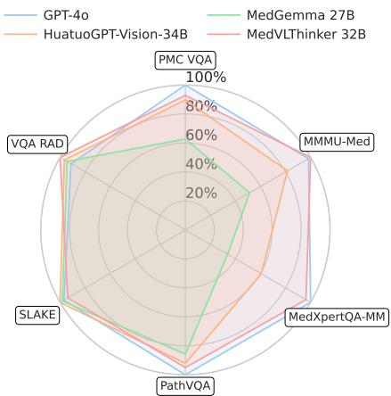
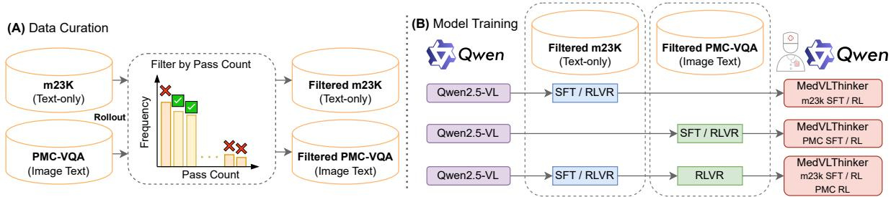

[← 返回 README](../README.md)

# 00 - Abstract & Overview

> 📌 **Section Preview**: 本文档包含论文的摘要、Figure 1（性能总览图）和 Figure 2（数据过滤与训练pipeline图）。摘要概述了MedVLThinker的核心贡献：首个完全开源的多模态医学推理模型构建方案，包括系统化数据筛选和两种训练范式（SFT和RLVR）。关键发现是RLVR始终显著优于SFT，且文本数据训练的收益超过图文多模态数据。

---

Large Reasoning Models (LRMs) have introduced a new paradigm in AI by enabling models to "think before responding" via chainof-thought reasoning. However, the absence of open and reproducible recipes for building reasoning-centric medical LMMs hinders community-wide research, analysis, and comparison. In this paper, we present MedVL-Thinker, a suite of simple yet strong baselines. Our fully open recipe consists of: (1) systematic data curation for both text-only and imagetext medical data, filtered according to varying levels of reasoning difficulty, and (2) two training paradigms: Supervised Fine-Tuning (SFT) on distilled reasoning traces and Reinforcement Learning with Verifiable Rewards (RLVR) based on final answer correctness. Across extensive experiments on the Qwen2.5-VL model family (3B, 7B) and six medical QA benchmarks, we find that RLVR consistently and significantly outperforms SFT. Additionally, under the RLVR framework, a key, counterintuitive finding is that training on our curated text-only reasoning data provides a more substantial performance boost than training on multimodal image-text data. Our best open 7B model, trained using the RLVR recipe on textonly data, establishes a new state-of-the-art on existing public VQA benchmarks, surpassing all previous open-source medical LMMs. Furthermore, scaling our model to 32B achieves performance on par with the proprietary GPT-4o. We release all curated data, models, and code to provide the community with a strong, open foundation for future research in multimodal medical reasoning.

> 💡 **问题动机**: 当前缺少开放可复现的医学多模态推理模型构建方案，阻碍了社区研究、分析和比较。本文提出MedVLThinker作为首个完全开源的baseline，填补这一空白。核心问题：如何在多模态医学场景中有效结合推理能力？

> 💡 **机制拆解**: 摘要揭示了两个关键设计维度：(1) 数据策略——系统化筛选文本和图文数据，按推理难度过滤；(2) 训练策略——SFT（基于蒸馏推理链）vs RLVR（基于答案正确性的可验证奖励）。这两个维度交叉构成了本文的实验空间。

---

*Figure 1: MedVLThinker provides a simple yet strong baseline for multimodal medical reasoning. Notably, MedVLThinker-32B yields performance on par with the closed-source GPT-4o model.*

> 💡 **Figure 1 批读**: 该图展示了MedVLThinker不同规模模型的性能对比雷达图/柱状图。核心信息：(1) 3B/7B/32B模型均通过RLVR训练获得提升；(2) 32B版本（63.12% avg）与闭源GPT-4o（63.74% avg）几乎持平；(3) 所有模型均使用text-only数据训练。这张图直接支撑了摘要中的核心claim——开放模型可以匹敌商业闭源系统。

---

Keywords: Medical, Reasoning, Multimodal, Vision-Language, Health Care

Data and Code Availability Our code, models, and data are publicly available at https://github.com/UCSC-VLAA/MedVLThinker.

Institutional Review Board (IRB) Our research does not require IRB approval.

---

*Figure 2: The data filtering and training pipeline. (A) We first filter both text-only m23k dataset and image-text PMC-VQA dataset, by generating multiple answers per question with Qwen2.5-VL-Instruct. Then we filter those questions are answered all wrong or almost correct. (B) Based on the filtered two datasets, we conduct supervised finetuning (SFT), reinforcement learning with verifiable rewards (RLVR), and their combination to train a herd of multimodal medical large reasoning models.*

> 💡 **Figure 2 批读**: 这是全文最核心的pipeline图，分为(A)数据过滤和(B)训练策略两部分。数据过滤的关键创新是使用Qwen2.5-VL-Instruct对每个问题生成16次回答，记录pass count，然后筛掉全错(pass=0)或几乎全对(pass>=7)的问题，保留中等难度问题。训练策略包括SFT、RLVR及二者的组合（SFT→RL, RL→RL）。这张图对应Method章节的核心内容。

---

> 💡 **Q&A 批注记录**:
>
> **Q: 为什么SFT和RLVR的实验结果反差如此巨大？SFT甚至在某些情况下降性能？**
> A: 摘要给出关键线索——RLVR consistently and significantly outperforms SFT。具体原因在Section 4.3有详细分析：SFT on text-only CoT data可能overload模型（long, possibly mismatched rationales），而RLVR直接优化模型自身的推理策略。这种反直觉现象是本文最核心的发现之一。
>
> **Q: "text-only data provides more substantial boost than multimodal data" 是否意味着多模态数据不重要？**
> A: 不。这个发现指出现有多模态数据（PMC-VQA）存在质量问题（GPT-3.5生成，有噪声），而非多模态信息本身无用。Discussion section明确指出了未来需要更高质量的多模态训练数据。

---

### 🔖 Section 总结

- **核心贡献**: 首个完全开源的医学视觉-语言推理模型构建方案
- **关键发现**: RLVR > SFT; 文本数据训练 > 图文数据训练
- **最佳结果**: MedVLThinker-32B (63.12%) 匹敌 GPT-4o (63.74%)
- **数据规模**: m23k 23,493 (filtered→16,512); PMC-VQA 176,948 (filtered→115,456)
- **训练范式**: SFT (CoT蒸馏) + RLVR (GRPO, binary reward +/-1)
