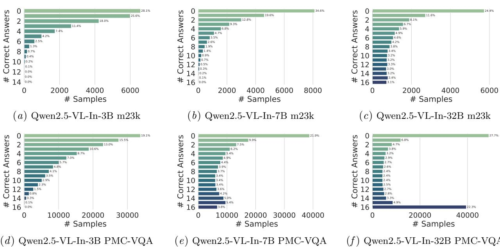

[← 返回 README](../README.md)

# 03 - Methods

> 📌 **Section Preview**: 方法部分描述了MedVLThinker的数据筛选流程和两种核心训练策略。首先介绍数据来源（m23k文本数据和PMC-VQA图文数据），然后详细阐述基于pass count的难度过滤机制（使用Qwen2.5-VL-Instruct进行16次采样，保留中间难度问题），最后深入讲解SFT（CoT蒸馏）和RLVR（GRPO with binary reward）两种训练范式的数学原理和实现细节。

---

We describe our data curation process and training methodologies for MedVLThinker. Figure 2 illustrates the overall pipeline of data filtering and model training.

> 💡 **机制拆解**: Method部分的核心架构：Data Curation（数据筛选）→ Training Strategies（SFT + RLVR）。输入是原始医学QA数据集，经过难度探针过滤和teacher生成CoT后，分别进入SFT和RLVR两条训练路线。SFT需要teacher CoT作为监督信号，RLVR仅需question-answer对和verifier。

---

Data Curation and Filtering. We gather two datasets for training: a text-only medical QA dataset and a multimodal (image+text) medical QA dataset. For text-only data, we use the m23k Huang et al. (2025), which compiles 23,493 multiple-choice medical questions from the training splits of MedQA Jin et al. (2021), MedMCQA Pal et al. (2022), and HeadQA Vilares and Gomez-Rodriguez (2019). Each question in m23k is accompanied by a set of candidate answers, and we have access to high-quality reasoning chains (CoTs) for these questions distilled from the DeepSeek-R1 Guo et al. (2025) model. For multimodal data, we adopt PMC-VQA Zhang et al. (2023), a large dataset of 176,948 visual QA pairs derived from biomedical literature figures and captions (covering about 149k images). PMC-VQA was generated using GPT-3.5 and covers a broad range of medical topics, making it a general-purpose multimodal medical QA resource (unlike modality-specific datasets such as PathVQA He et al. (2020), SLAKE Liu et al. (2021), VQA-Rad Lau et al. (2018), which target one type of image).

> 💡 **机制拆解**: 两个数据集的对比：
> - **m23k (文本)**: 23,493题，来自MedQA/MedMCQA/HeadQA的training split，是人类编写的医学考试题，质量高。CoT由DeepSeek-R1生成。
> - **PMC-VQA (图文)**: 176,948个QA pairs，覆盖约149k张图片，GPT-3.5从PubMed Central图表/图注生成，质量参差不齐。
>
> 关键设计选择：选择PMC-VQA而非PathVQA/SLAKE/VQA-Rad等专用数据集，是为了训练一个general-purpose的医学推理模型，而非领域专用模型。这与baseline的定位一致。

---

Not all questions in these datasets are equally useful for training a reasoning model; some are too easy (already trivial for the base model) and some are too hard (unsolvable even with reasoning). Following recent curriculum learning insights Muennighoff et al. (2025), we perform a difficulty-based filtering on both datasets. We prompt three variants of a general multimodal model (Qwen2.5-VL-Instruct with 3B, 7B, 32B parameters) to answer each question 16 times (using nucleus sampling with temperature 1.0). For each question, we record the pass count, i.e. the number of trials (out of 16) that produced the correct answer. Figure 3 shows the distribution of pass counts on the text-only m23k and image-based PMC-VQA, for each model size. As model scale increases, more questions achieve high pass counts (e.g. the 32B model answers a larger fraction of questions correctly in a majority of trials). This indicates that the base model's capability improves with scale, which in turn means that a sufficiently large model can solve many of the questions reliably given enough attempts. For the purposes of training data selection, we focus on medium-difficulty questions that are neither always solved nor hopelessly unsolved. Concretely, we use the results of the 3B model to filter the data: any question with pass count = 0 (all trials wrong) or >= 7 (correct in at least 7 out of 16 trials) is removed. This retains questions that a smaller model finds neither trivial nor impossible, under the assumption that these medium-difficulty questions will benefit most from reasoning training. After filtering, the text-only dataset is reduced to 16,512 questions and the image-text dataset to 115,456 questions. These filtered datasets are used for all subsequent training of 3B, 7B, and 32B models, ensuring a fair comparison across model scales.

> 💡 **机制拆解**: 难度过滤的数学描述：
> - **探针模型**: Qwen2.5-VL-Instruct (3B/7B/32B)
> - **采样策略**: nucleus sampling, T=1.0, 16次
> - **Pass count定义**: p = (16次采样中回答正确的次数)/16
> - **过滤规则**: 移除 p=0 (too hard) 或 p>=7/16 (too easy)
> - **过滤依据**: 使用3B模型的结果（最小模型，确保过滤标准对所有规模都是合理的）
>
> 设计原理：基于curriculum learning的思想（Muennighoff et al. 2025），中等难度的问题最有利于推理训练——太简单没有学习价值，太难无法学习。使用3B模型作为过滤标准是一个务实选择：确保过滤后的数据对所有规模模型都是有挑战性但可学习的。

*Figure 3: Probing the questions difficulty with Qwen2.5-VL-Instruct. For each question, we generate 16 answers. Then we draw the pie plots for the pass count. When the scale of the multimodal LLM increased, the number of high pass count questions increased. This indicates the potential of the models, especially for latter RLVR training, which encourages the models to improve this possibility to answer questions correctly. The pass count is used for latter data filtering.*

> 💡 **Figure 3 批读**: 该图展示了三个规模模型（3B/7B/32B）在m23k和PMC-VQA上的pass count分布饼图。关键观察：(1) 模型越大，高pass count问题占比越高——说明大模型的基础能力更强，在多次采样中更容易答对；(2) RLVR训练的目标正是提高单次采样答对的概率（即提升pass rate）；(3) 该图直接支撑了数据过滤策略的设计依据——中间难度区域的问题最有训练价值。注意：过滤使用的是3B模型的结果，而非各模型各自的结果。

> 💡 **Q&A 批注记录**: **Q: 为什么用3B模型的结果来过滤，而不是各自模型规模？** A: 论文使用3B模型对全部问题进行16次采样，基于3B的pass count统计进行过滤（剔除pass=0和pass>=7的问题），然后将相同的过滤后数据用于3B/7B/32B所有模型的训练。这样做的目的是"ensuring a fair comparison across model scales"——保证不同规模模型的训练数据完全相同。但这种"一刀切"策略可能不是最优的：32B的base能力更强，它可能需要更难的问题才能获得有效的训练信号。作者在Appendix D Limitation中也承认了这一点。

---

We train our MedVLThinker models on the filtered data under different strategies, as outlined above. We perform SFT and RLVR on the text-only and image-text datasets separately to isolate the effect of each data modality. In addition, we experiment with two combined strategies: (a) SFT on text-only data followed by RL on image-text data (denoted SFT + RL), and (b) RL on text-only data followed by RL on image-text data (RL + RL). Figure 2(B) illustrates the training variants. Below, we describe the two core training paradigms in detail:

> 💡 **消融解读**: 训练策略的实验设计形成了4x2的消融空间：
> - **数据维度**: text-only vs image-text
> - **方法维度**: SFT vs RLVR
> - **组合维度**: SFT→RL, RL→RL
>
> 这种fully crossed实验设计使得可以独立分析每个因素的影响。

---

## 3.1. Training Strategies

### Supervised Fine-Tuning (SFT)

Supervised fine-tuning forms the foundation of our pipeline. Starting from a general-purpose pretrained multimodal language model (Qwen2.5-VL), we minimize the token-level cross-entropy loss on the curated question-answer pairs (with their reasoning traces). Using teacher-forced learning on the high-quality CoT annotations provides a dense supervision signal, allowing the model to quickly internalize domain-specific medical knowledge, terminology, answer formatting, and the nuanced conventions of clinical explanations. For text-only questions, we use long-form rationales generated by the DeepSeek-R1 model as targets, and for image-based questions, we use GPT-4o-generated rationales. This SFT step teaches the model to emulate the step-by-step reasoning of superior teachers.

> 💡 **公式批读**: SFT的数学形式：
> - Loss = -(1/T) * sum(t=1..T) log P_theta(y_t | x, y_<t)
> - 其中 x = (question, [image]) 输入，y = teacher CoT + final answer
> - Teacher-forcing: 每一步的真值来自teacher的CoT
> - **文本题teacher**: DeepSeek-R1 (纯文本LRM)
> - **图文题teacher**: GPT-4o (视觉LLM)
>
> 为什么SFT on text-only CoT反而会降低性能？（这是全文最核心的问题）可能原因：(1) DeepSeek-R1的推理风格是为纯文本设计的，与需要同时处理图像的多模态模型的推理模式存在distribution gap；(2) SFT强制模型模仿teacher的long-form CoT，可能overfit到teacher的特定表达方式，而失去了模型自身的推理灵活性；(3) 医学考试题（m23k）的domain可能与多模态benchmark不够匹配。

---

### Reinforcement Learning with Verifiable Rewards (RLVR)

After SFT, we further refine the model using RL on answer correctness as feedback. We adopt Group Relative Policy Optimization (GRPO), a variant of PPO that operates on a group of sampled outputs. For each question, we sample N reasoning trace rollouts from the model (we use N = 8 in our experiments). A deterministic verifier then checks each output: if the answer is given in the expected format (e.g., the model produces a chain-of-thought delineated by special tokens and then a final answer choice) and the final answer is correct, a reward +1 is assigned; otherwise, a reward -1 is assigned. We normalize (whiten) these binary rewards across the group of outputs to obtain advantage estimates. The GRPO algorithm then updates the model policy using a PPO-style clipped objective, where the usual learned value function is replaced by group-based advantage computation. This yields a KL-regularized, contrastive policy update that steadily pushes the model to generate more verifiably correct reasoning traces (i.e. reasoning that leads to the correct answer) while constraining it to stay close to the behavior policy (to avoid degeneration). Importantly, RLVR does not require explicit CoT annotations, only a reliable way to verify final answer correctness, making it an appealing method to enhance reasoning using the same data. In our setting, all questions are multiple-choice or otherwise have objectively correct answers, so the reward signal is automatically obtained.

> 💡 **公式批读**: GRPO (Group Relative Policy Optimization) 的核心机制：
>
> **Step 1 - 采样**: 对于每个问题，从当前策略pi_theta采样N=8条推理链。
>
> **Step 2 - 验证**: Verifier检查每条链的format（是否有<think>...</think> <answer>...</answer>结构）和最终答案的正确性。Reward r_i = +1 (correct) or -1 (incorrect/wrong format)。
>
> **Step 3 - 白化**: 在N条链的group内计算advantage：
>   A_i = (r_i - mean(r)) / std(r)
> 这替代了PPO中需要learned value function的advantage估计。
>
> **Step 4 - 策略更新**: PPO-style clipped objective：
>   L = min(r_t(theta) * A_t, clip(r_t(theta), 1-eps, 1+eps) * A_t) - beta * KL(pi_theta || pi_ref)
> 其中 r_t(theta) = pi_theta(a_t|s_t) / pi_old(a_t|s_t)
>
> **关键设计选择**:
> - 不需要critic/value network（GRPO的核心效率优势）
> - KL penalty (beta) 约束策略不偏离参考策略太远，防止reward hacking
> - Binary reward (+1/-1) 足够简洁，reward signal自动可获取（MCQ场景）
>
> **与SFT的本质区别**: SFT要求模型模仿teacher的推理过程（过程监督），RLVR只关心最终答案是否正确（结果监督）。结果监督给了模型更大的探索空间——模型可以发展出自己的推理风格，只要最终答案正确即可。

> 💡 **Q&A 批注记录**:
>
> **Q: GRPO和标准PPO的关键区别是什么？为什么选择GRPO？**
> A: GRPO (Shao et al. 2024, from DeepSeekMath) 的核心创新是用group-based advantage替代了标准PPO中的learned critic/value network。对于每个问题，采样N条输出后，通过组内白化计算advantage。这有两个好处：(1) 不需要训练额外的value network，节省显存和计算；(2) group内的相对比较更稳定，因为同一问题的所有候选共享相同的context。在医学MCQ场景下，这种设计特别合适——对同一问题的N次不同回答构成自然的比较组。
>
> **Q: RLVR只使用binary reward (+1/-1)会不会太粗糙？**
> A: 这确实是一个合理的concern。Binary reward虽然粗糙，但在这个setting下有几个优势：(1) MCQ有明确的正确答案，reward signal无歧义；(2) +1/-1经过组内白化后，有效区分了组内相对好的和差的response；(3) 避免reward shaping引入的人为bias。但是，对于开放式生成或多步临床推理，binary reward确实不够——作者在Appendix C Discussion中也指出这是future work的方向。

---

> 💡 **Q&A 批注记录**:
>
> **Q: Method部分没有提供RLVR的损失函数公式，GRPO的具体数学形式是什么？**
> A: 论文在正文中描述了GRPO的操作流程但未给出完整公式。根据Shao et al. (2024)和VERL框架的实现（Appendix A），GRPO的objective为：
>   J(θ) = E[ min(r_t(θ) * A_t, clip(r_t(θ), 1-ε, 1+ε) * A_t) ] - β * D_KL(π_θ || π_ref)
> 其中A_t = (r_i - mean(r_group)) / std(r_group)，即组内白化的advantage。KL项使用β=0.01的正则化（Appendix A）。

---

### 🔖 Section 总结

- **数据来源**: m23k (23,493 → 16,512 text QA) + PMC-VQA (176,948 → 115,456 image-text QA)
- **难度过滤**: pass count统计 (16次采样), 移除pass=0或pass>=7的问题
- **CoT Teacher**: Text→DeepSeek-R1, Image→GPT-4o
- **SFT**: token-level cross-entropy on teacher CoT+answer, 3 epochs, lr=1e-4
- **RLVR/GRPO**: N=8 rollouts, binary reward (+1/-1), group-based advantage (whiten), PPO-style clipped objective + KL penalty, lr=1e-6
- **训练变体**: SFT(text), SFT(image-text), RL(text), RL(image-text), SFT+RL, RL+RL
- **核心区别**: SFT=过程监督（模仿teacher推理），RLVR=结果监督（只验证答案正确性）
