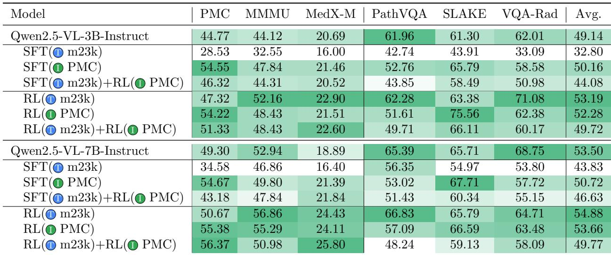
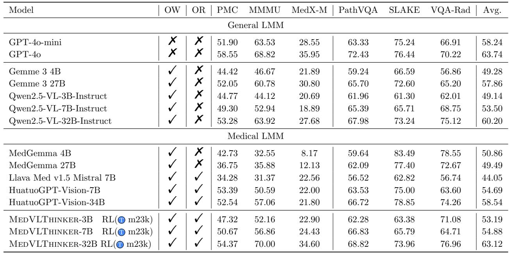
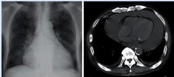
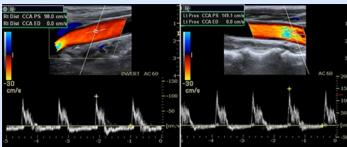
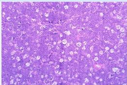

[← 返回 README](../README.md)

# 04 - Experiments

> 📌 **Section Preview**: 实验部分是全文最核心的内容，包含三个子部分。(4.1) Implementation Details描述了训练超参数、硬件配置和GRPO实现细节；(4.2) Evaluation介绍了6个benchmark（3个通用+3个模态专用）和评估协议；(4.3) Results展示了Table 1（消融实验）、Table 2（SOTA对比），以及四个维度的分析——训练范式对比（SFT vs RLVR）、数据模态对比（text vs image-text）、组合策略效果、模型规模影响和定性案例（Figure 4）。

---

## 4.1. Implementation Details

We initialize our models from the Qwen2.5-VL checkpoint. For SFT, we fine-tune the model for 3 epochs with a batch size of 32 and learning rate 1 x 10^{-4}. For RLVR, we train using GRPO for 5 epochs on the text-only data and 1 epoch on the image-text data, with a learning rate of 1 x 10^{-6}. We set the total batch size to 128 for text-only RL (sufficient to sample 8 rollouts per question) and 256 for image-text RL (since each sample includes image features). For experiments where RL is continued on a second dataset (e.g., applying RL on PMC-VQA after an SFT on m23k), we reduce the batch size (to 64) during the second stage to accommodate the longer sequence lengths (the combined image + CoT + answer sequence can reach ~2048 tokens). All models are trained on 8 x H100 GPUs using mixed precision, except the 32B model, which is trained on 32 GPUs.

> 💡 **机制拆解**: 训练配置的关键参数：
>
> | 参数 | SFT | RLVR (text) | RLVR (image) | 二阶段RL |
> |------|-----|-------------|---------------|----------|
> | Epochs | 3 | 5 | 1 | - |
> | Batch Size | 32 | 128 | 256 | 64 |
> | Learning Rate | 1e-4 | 1e-6 | 1e-6 | 1e-6 |
> | Rollouts (N) | - | 8 | 8 | 8 |
> | Sequence Length | - | ~1024 | ~2048 | ~2048 |
>
> 关键设计选择：
> - RLVR的lr比SFT小两个数量级（1e-6 vs 1e-4），这是RL稳定的标准做法。
> - Image-text RL的batch size (256) 大于text RL (128)，因为图片需要更多显存/更长的序列。
> - 二阶段RL降低batch size到64以适应更长的序列（image+CoT+answer可达2048 tokens）。
> - 32B需32张GPU（8x→32x），说明scale factor约4x。

---

## 4.2. Evaluation

We evaluate our models on a suite of six multimodal medical QA benchmarks, which can be divided into two categories: (1) general-domain medical QA and (2) modality-specific QA. The general-domain evaluations include the test set of PMC-VQA Zhang et al. (2023) (for direct comparison, since our models train on a filtered subset of its training data), the validation set of MMMU-Health Yue et al. (2024) (the health and medicine portion of the MMMU benchmark), and MedXpert-MM Zuo et al. (2025), a challenging benchmark requiring complex reasoning over multimodal inputs. The modality-specific evaluations include PathVQA He et al. (2020) (pathology images), SLAKE Liu et al. (2021) (slit-lamp ophthalmology images) and VQA-Rad Lau et al. (2018) (radiology X-rays). Together, these six datasets cover a broad range of medical visual question answering scenarios, from generic biomedical knowledge to highly specialized imaging tasks.

> 💡 **机制拆解**: 6个benchmark的分类和特点：
>
> **通用医学QA（3个）**:
> - **PMC-VQA** (test set): 生物医学文献QA，与训练数据同源（但使用test split），直接衡量训练效果
> - **MMMU-Health** (val set): MMMU的医学子集，多学科多模态理解，评估泛化能力
> - **MedXpert-MM**: 最具挑战性的benchmark，需要复杂推理，acc普遍较低（最高~35%），是区分模型推理能力的关键指标
>
> **模态专用QA（3个）**:
> - **PathVQA**: 病理图像QA (organ-level)
> - **SLAKE**: 眼科裂隙灯图像QA
> - **VQA-Rad**: 放射科X光QA
>
> 这个benchmark选择覆盖了从通用到专用、从简单到复杂的完整医学视觉QA谱系。

---

For each benchmark, we report the accuracy (% of questions answered correctly). Model responses are generated using greedy decoding (temperature 0) to evaluate base capability without sampling variance. We note that even with deterministic decoding, slight nondeterminism in the inference engine (due to floating-point precision) can cause minimal variability; thus, we run each evaluation 3 times and report the average accuracy (the standard deviation was below 0.1 and is provided in the appendix for completeness). In the result tables, we use the notation (1) to indicate models trained on the text-only (m23k) data and (2) for models trained on the image-text (PMC-VQA) data. For example, "SFT (1)" denotes a model fine-tuned on text-only CoT data, and "RL (1) + RL (2)" denotes a model first trained with RL on text-only data then further with RL on image-text data.

> 💡 **机制拆解**: 评估协议的设计亮点：
> - **Greedy decoding (T=0)**: 消除采样方差，评估模型的单次最佳表现，而非多次采样的upper bound。这反映了最严格的单次推理能力。
> - **3次平均**: 即使T=0，浮点精度仍可能引入微小变化，3次取平均并报告std<0.1。
> - **符号约定**: (1)/(2) 对应text-only/image-text，在table中保持一致的符号系统。

---

## 4.3. Results

### Impact of Training Paradigm (SFT vs. RLVR)

Table 1 summarizes the performance of the Qwen2.5-VL 3B and 7B models under various training recipes. We observe that RLVR-trained models consistently outperform SFT-trained models of the same size across all benchmarks. For the 3B base, RLVR on text-only data (RL (1)) achieves 53.19% average accuracy, versus 32.80% for SFT on text-only (SFT (1)) (a dramatic drop below the 49.14% base performance). Similarly, the 7B RL (1) model reaches 54.88% average, compared to 43.83% for SFT (1) (again, SFT underperforms even the 53.50% base model). These results confirm that simply fine-tuning on distilled CoT data does not guarantee better performance -- in fact, it may overload the model with long, possibly mismatched rationales that hurt its effectiveness on multimodal QA. In contrast, RLVR directly optimizes the model's own reasoning policy and proves markedly more effective at improving accuracy.

> 💡 **消融解读**: SFT vs RLVR的核心对比（关键数据）：
>
> | 规模 | Base Acc | SFT(text) Acc | Change | RL(text) Acc | Change |
> |------|----------|---------------|--------|--------------|--------|
> | 3B | 49.14% | 32.80% | **-16.34%** | 53.19% | +4.05% |
> | 7B | 53.50% | 43.83% | **-9.67%** | 54.88% | +1.38% |
>
> 最震撼的发现：SFT(text)不仅没有提升，反而大幅降低性能！可能原因：
> 1. **Distribution mismatch**: DeepSeek-R1的CoT风格与Qwen2.5-VL的推理风格不匹配
> 2. **Overfitting to teacher style**: SFT强制模型模仿特定推理模式，失去了模型的灵活性
> 3. **Sequence length overload**: Long CoT序列可能导致模型注意力分散
>
> RLVR的优势：不需要teacher的CoT，模型自主探索推理路径，只需要最终答案的验证信号。

---

### Impact of Training Data (Text-only vs. Image-text)

The choice of training data modality also has a significant effect. From Table 1, training on the text-only data tends to yield better results than training on the image-text data. For instance, the 7B RL (1) (54.88% avg) outperforms RL (2) (53.66% avg). However, SFT on the text-only CoT data consistently harms performance relative to the base model (43.83% for 7B SFT (1)), whereas SFT on the multimodal data yields a slight improvement over base on some benchmarks (e.g., +1-2% on PathVQA, SLAKE) but overall comparable average (50.72% SFT (2) vs 53.50% base). We hypothesize that the long, text-only rationales distilled from a text-based LRM (DeepSeek) may not align well with the needs of a multimodal model that also has to interpret images. The image-based data, while noisy, at least engages the model's visual processing during training, which might explain why SFT (2) does not drastically degrade performance. Nonetheless, the strongest gains come from RLVR on text-only data, which boosts performance substantially (e.g., +4.05% for 3B, +1.38% for 7B, compared to base). RLVR on the multimodal data also improves over base, but to a lesser degree. These results highlight that in RLVR, high-quality textual QA data (with verifiable answers) can be more valuable than larger but noisier image-based data for training the reasoning capability of multimodal models. Improving the quality of multimodal training data remains an important challenge (see Discussion).

> 💡 **消融解读**: 数据模态的核心对比：
>
> | 方法 | 3B-text | 3B-image | 7B-text | 7B-image | 趋势 |
> |------|---------|----------|---------|----------|------|
> | SFT | 32.80% | 50.16% | 43.83% | 50.72% | Image>SFT? (但都<Base) |
> | RLVR | **53.19%** | 52.28% | **54.88%** | 53.66% | Text > Image |
>
> 关键洞察：
> 1. **SFT下Image-text > Text-only**: 因为image data至少让模型保持视觉处理能力，而text-only CoT可能让模型"忘记"如何处理视觉输入
> 2. **RLVR下Text-only > Image-text**: RLVR对数据质量敏感——text-only数据（人工编写考试题）的质量高于自动生成的PMC-VQA
> 3. **质量 vs 模态**: 问题不在于"文本vs图像"，而在于"高质量数据 vs 低质量数据"。如果能获得高质量的图文训练数据，结果可能会反转。

---

*Table 1: Performance on multimodal medical benchmarks for our baselines. We use greedy decoding to evaluate the ability of the models. (1) means text-only data; (2) means image-text data.*

> 💡 **Table 1 批读**: 这张表是全文最核心的实验证据。重点关注几个模式：
>
> **1. RLVR > SFT (一致)**: 无论是3B还是7B，无论是text还是image-text，RLVR always outperforms SFT。差距在text-only数据上尤为显著（3B: 53.19% vs 32.80%, +20.39%）。
>
> **2. SFT(text)灾难性下降**: 3B从49.14%降到32.80%，7B从53.50%降到43.83%。这对所有benchmark都一致，不是个别benchmark的问题。
>
> **3. RL(text)是唯一稳定提升的配方**: 在所有setting中，只有RL(text) consistently improves over base。
>
> **4. 组合策略无效**: SFT(text)+RL(image) (44.08%/46.63%) 和 RL(text)+RL(image) (49.72%/49.77%) 都不如纯RL(text) (53.19%/54.88%)。这表明当前的image-text数据不仅无用，甚至有害。
>
> **5. SLAKE的异常**: SFT/RL on image-text在SLAKE上表现最好（75.56% for 3B RL(image)），可能是因为SLAKE的眼科图像与PMC-VQA的医学图像有更强的domain overlap。

---

### Combined Training Strategies

We also evaluated whether combining text-only and image-text training yields further benefits. Two combinations were tried: SFT on text then RL on images (SFT (1) + RL (2)), and RL on text then RL on images (RL (1) + RL (2)). As Table 1 shows, neither strategy provided gains over the single-modality RL training. In fact, for the 7B model, SFT (1) + RL (2) (53.07% avg) was worse than RL (2) alone (53.66%), and RL (1) + RL (2) (49.77%) fell behind RL (1) (54.88%). For the 3B model, similar results are observed. It appears that after a model has been optimized on the text-only data, adding the image-text data (even via RL) can hinder the reasoning capability, resulting in a net drop in performance. We conclude that the best recipe in our study is to apply RLVR directly on a high-quality text-only reasoning dataset. This produces the top results for both 3B and 7B. In most cases, adding an SFT stage or an extra RL stage on image data does not help, and in the worst case, it reduces accuracy.

> 💡 **消融解读**: 组合策略失败的可能原因分析：
>
> | 组合 | 3B Avg | vs 最佳单模态 | 7B Avg | vs 最佳单模态 |
> |------|--------|---------------|--------|---------------|
> | SFT(text)+RL(image) | 44.08% | -9.11% | 46.63% | -8.25% |
> | RL(text)+RL(image) | 49.72% | -3.47% | 49.77% | -5.11% |
>
> 两种组合策略都失败了，且RL→RL的下降幅度小于SFT→RL。可能原因：
> 1. **Catastrophic forgetting**: 在text-only数据上学到的推理能力被后续的image-text训练"冲淡"
> 2. **Distribution shift**: image-text数据的分布（GPT-3.5生成的PMC-VQA QA pairs）与text-only数据（人工医学考试题）差异过大
> 3. **Negative transfer**: 低质量的image-text数据引入了noise而非有效信号
>
> 这说明当前的image-text训练数据（PMC-VQA）不适合作为secondary training stage。

---

### Effect of Model Scale

Increasing the model size clearly improves performance across the board. The 7B models outperform the 3B models in every corresponding setting (comparing rows in Table 1). For example, the base 7B is 4.36% higher on average than base 3B; the RL (1) 7B is +1.69% higher than its counterpart 3B; and SFT (2) 7B is +0.56% higher than SFT (2) 3B. On certain benchmarks like MedXpert-MM (which is especially challenging and requires complex reasoning), the gap is more pronounced: the best 7B (RL (1)) attains 24.43% versus 22.90% for the best 3B, and 7B SFT (1) achieves 16.40% vs 16.00% for 3B (both quite low). This trend suggests that larger models have more capacity to learn medical knowledge and to benefit from the reasoning training. Pushing to even larger scales may continue to yield gains (we test a 32B model below).

> 💡 **消融解读**: 模型规模的scaling分析：
>
> | Setting | 3B Acc | 7B Acc | Delta (7B-3B) |
> |---------|--------|--------|----------------|
> | Base | 49.14% | 53.50% | +4.36% |
> | SFT(text) | 32.80% | 43.83% | +11.03% |
> | SFT(image) | 50.16% | 50.72% | +0.56% |
> | SFT+RL | 44.08% | 46.63% | +2.55% |
> | **RL(text)** | 53.19% | **54.88%** | +1.69% |
> | RL(image) | 52.28% | 53.66% | +1.38% |
> | RL+RL | 49.72% | 49.77% | +0.05% |
>
> 关键趋势：
> 1. Base model scaling效果最大（+4.36%），说明Qwen2.5-VL本身的规模效益就很强
> 2. SFT(text)下scaling效果也很大（+11.03%），因为大模型有更多capacity去"吸收"CoT数据，即使最终还是低于base
> 3. RL(text)的scaling收益递减（+1.69%）：RL已经让模型接近其capacity上限
> 4. MedXpert-MM上7B的优势最大（24.43% vs 22.90%），说明复杂推理任务更受益于模型规模

---

*Table 2: Performance on multimodal medical benchmarks with other methods. We use greedy decoding to evaluate the ability of the models. (1) means text-only data. Open Weights (OW): only the model parameters are released; Open Recipe (OR): data, code, and training details are released, enabling full reproducibility.*

> 💡 **Table 2 批读**: SOTA对比表的核心信息：
>
> **与开源医学LMMs对比**:
> - MedVLThinker-7B RL(text) (54.88%) > HuatuoGPT-Vision-7B (54.69%, 但该表显示的可能是不同版本)
> - MedVLThinker-3B RL(text) (53.19%) > MedGemma 4B (50.86%)
> - 注意：HuatuoGPT-Vision-34B (58.54%) 使用了34B参数，比7B大得多
>
> **与闭源模型对比**:
> - MedVLThinker-32B (63.12%) ≈ GPT-4o (63.74%)，仅差0.62%
> - MedVLThinker-32B (63.12%) > GPT-4o-mini (58.24%)，超出4.88%
> - MedVLThinker-32B (63.12%) > Qwen2.5-VL-32B-Instruct (60.20%)，比base 32B提升了2.92%
>
> **OW (Open Weights) vs OR (Open Recipe)**:
> - 表中标注了每个模型的开放性：OW=权重开放，OR=完全可复现（数据+代码+训练细节）
> - MedVLThinker是全表唯一同时具有OW和OR的模型——这是全文的核心贡献claim
>
> **Gemma系列的异常**: MedGemma 27B (49.49%) 甚至不如27B base Gemma (57.86%)，与本文SFT(text)降低性能的现象一致。

---

### Comparison to Previous Models

In Table 2, we compare our MedVLThinker models against prior open-source medical VLMs and against GPT-4-based models. Our 7B RLVR-trained model achieves an average score of 54.88%, which is 3-4% higher than the reported performance of HuatuoGPT-Vision-7B-Qwen2.5 (48.60% avg) and also above LLaVA-Med v1.5 (Mistral-7B). On general-domain benchmarks like MedXpert-MM, our advantage is even larger: MedVLThinker-7B scores 24.43% vs HuatuoGPT-Vision's 22.00%. This demonstrates the benefit of our focused reasoning training. HuatuoGPT-Vision was primarily trained with instruction tuning on multimodal data (and a bit of RLHF), and it underperforms on challenging reasoning questions. We also note that HuatuoGPT-Vision reportedly suffered a large performance drop on generic medical QA after its multimodal fine-tuning (similar to our observation that SFT on image data can hurt general QA). In contrast, our RLVR approach improved performance without such trade-offs. Finally, our MedVLThinker-32B (RL on text-only) reaches 63.12% average accuracy, surpassing the GPT-4o-mini model (58.24%) and essentially matching the full GPT-4o (63.74%) on these benchmarks. This is a notable result: it suggests that with sufficient model size and proper training, open models can approach the performance of proprietary models like GPT-4 on specialized tasks. We emphasize that our entire training pipeline, data, and models are open-source, providing a foundation for the community to build upon.

> 💡 **消融解读**: Comparison to Previous Models的逐项分析：
>
> **vs HuatuoGPT-Vision-7B**: MedVLThinker-7B (54.88%) 在推理能力上有明显优势，特别是在MedXpert-MM (24.43% vs 22.00%)。原因是HuatuoGPT-Vision主要靠instruction tuning，缺乏显式推理训练。
>
> **vs LLaVA-Med v1.5 (Mistral-7B)**: 44.05% → MedVLThinker提升10+个百分点，证明了推理训练的重要性。
>
> **vs GPT-4o**: MedVLThinker-32B (63.12%) vs GPT-4o (63.74%)，差异仅0.62%。这是一个重要的milestone——开源模型在专业医学QA任务上接近闭源SOTA。
>
> **vs GPT-4o-mini**: MedVLThinker-32B超出GPT-4o-mini约4.88%，说明专精训练（domain-specific reasoning）比通用能力更重要。
>
> **vs Qwen2.5-VL-32B-Instruct (base)**: RL训练提升了2.92%，虽然绝对值不大但考虑到(1)只有5 epochs RL，(2)只用text-only数据，(3)在6个benchmark上一致提升，这个增益是显著的。

---

### Qualitative Results

We provide a few anecdotal examples of our model's outputs in Figure 4 to illustrate the reasoning quality of text-only RLVR training. More qualitative results of 3B, 7B, and 32B models can be found in the supplemental materials.

*Figure 4: Case study on multiple medical VQA benchmarks with our 32B text-only RLVR model. Our MedVLThinker demonstrates robust reasoning capability across various imaging modalities.*

> 💡 **Figure 4 批读**: 定性案例展示了32B模型在三个benchmark上的推理过程：
>
> **案例1 (PMC-VQA)**: 心包积液问题——模型结合胸部X光和CT扫描两种图像进行综合分析，识别出"massive pericardial effusion"（大量心包积液）。体现了模型的多图综合分析能力。
>
> **案例2 (MedXpertQA-MM)**: 颈动脉超声问题——模型分析左右颈总动脉的血流速度数据，识别出舒张期血流逆转现象，正确诊断为主动脉瓣关闭不全（aortic insufficiency）。这是需要专业知识的高级推理。
>
> **案例3 (PathVQA)**: Burkitt淋巴瘤病理图——模型识别出"starry-sky"（星空样）组织学特征和tingible body macrophages，正确判断为Burkitt淋巴瘤。展示了模型在病理图像上的专业知识。
>
> 这些案例共同证明：即使是text-only RLVR训练，模型也能在多模态场景中产生高质量的结构化推理（`<think>...</think>` + `<answer>...</answer>`格式）。

> 💡 **Q&A 批注记录**:
>
> **Q: Figure 4的案例都是text-only RLVR训练的吗？那模型如何处理图像输入？**
> A: 是的，这些案例来自32B text-only RLVR模型。注意：RLVR text-only training是指训练数据中没有图像（纯文本医学问答），但base model（Qwen2.5-VL）本身就是多模态的，在pretraining阶段已经学会了处理图像。text-only RLVR fine-tuning本质上是强化模型的"文本推理链"能力，而不是从头学习视觉理解。推理时模型仍然接收图像输入，只是训练阶段没有使用图像进行RL优化。
>
> **Q: 为什么text-only训练后模型仍然能很好地处理多模态输入？**
> A: 这涉及到迁移学习：医学知识和推理能力在很大程度上是模态无关的（如"starry-sky pattern → Burkitt lymphoma"的知识），通过text-only数据学习推理范式后，模型可以将这种推理能力泛化到视觉输入上。这类似于人类医生学习了医学原理后，可以将其应用于不同类型的影像读片。

---

### 🔖 Section 总结

- **训练配置**: SFT 3 epochs lr=1e-4 batch=32; RLVR 5/1 epochs lr=1e-6 batch=128/256; 8xH100(32x for 32B)
- **评估**: 6 benchmarks (3 general + 3 modality-specific), greedy decoding (T=0), 3-run average
- **核心发现1 (SFT vs RLVR)**: RLVR consistently >> SFT; SFT(text)降9.67-16.34%, RL(text)升1.38-4.05%
- **核心发现2 (Text vs Image)**: RL(text) > RL(image); SFT(image) ≈ base (不降但也不升)
- **核心发现3 (组合策略)**: 任何组合都不如纯RL(text); 添加image-text数据会降低性能
- **核心发现4 (Scale)**: 7B consistently > 3B; 32B (63.12%) 匹敌 GPT-4o (63.74%)
- **定性结果**: Text-only RLVR训练的模型展现出跨模态、结构化的高质量推理能力
