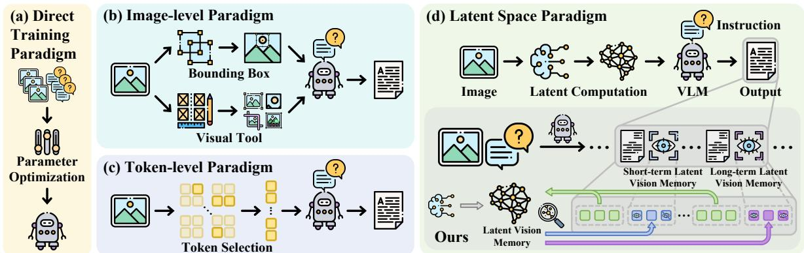

[← 返回 README](../README.md)

# 1. Introduction

## 📌 预览
本节建立研究动机、现有方法缺口和贡献列表，是理解论文叙事的入口。

---

Visual-Language Models (VLMs) have demonstrated impressive capabilities in visual understanding, reasoning and generation [31, 50]. Latest flagship models, both closedsourced [2, 11, 39] and open-sourced [1, 4, 55, 56, 63], represent a significant leap towards a general-purpose intelligent model that can both perceive and think about the visual world. Despite their success, VLMs still face significant inherent challenges when tackling complicated tasks that require advanced visual abilities, such as fine-grained perception, multi-step reasoning, or maintaining fidelity over long generative sequences [17, 25]. A fundamental limitation stems from the pervasive propensity, exhibited during deep autoregressive decoding, toward a deficit in visual memory, which prioritizes accumulated textual context over the initial visual evidence and lacks visual semantic knowledge [52, 90]. It manifests as a “visual processing bottleneck” that impairs performance in fine-grained visual understanding, efficient reasoning, and robust generation.

> 💡 **批注**: 这段按 VisMem 的动态视觉记忆主线读：模型需要在生成过程中保留细粒度视觉证据，同时把可复用语义经验压缩成长期 latent memory；关键是何时调用、如何更新、是否真的缓解 visual grounding 丢失。

Prior efforts to overcome this limitation have explored several distinct strategic axes, which can be primarily categorized into four paradigms, as illustrated in Fig. 1. One intuitive paradigm is the (a) direct training paradigm, which optimizes model parameters via fine-tuning or reinforcement learning [26, 35, 44, 66]. This relatively brute-force approach often sacrifices generalization for task-specific performance, leading to catastrophic forgetting. Another axis concerns the representation space of the intervention, (b) image-level paradigm, operating in the pixel space by explicitly synthesizing new visual inputs, which offers image-level thinking but at a prohibitive computational cost [13, 24, 29, 48, 49, 87]. Conversely, (c) token-level paradigm constrains operations to visual tokens, which is more efficient but fundamentally non-generative, limiting the model to merely re-surfacing what it has already encoded [8, 16, 28, 75]. Recently, a promising direction lies in the (d) latent space paradigm, which introduces continuous latent contexts in the sequential inference process. Unfortunately, existing latent space methods either rely solely on the language space [21, 30, 47, 68, 81] or require auxiliary visual data [70], limiting their application in VLMs.

> 💡 **批注**: 这段按 VisMem 的动态视觉记忆主线读：模型需要在生成过程中保留细粒度视觉证据，同时把可复用语义经验压缩成长期 latent memory；关键是何时调用、如何更新、是否真的缓解 visual grounding 丢失。

To overcome this problem, we resort to cognitive psychology, specifically the Dennis Norris Theory [38]:

Short-term memory and long-term memory are two distinct storage systems that can be modeled on their neural underpinnings, the former is governed by vision, while the latter holds sway over abstract semantics.

> 💡 **批注**: 这段按 VisMem 的动态视觉记忆主线读：模型需要在生成过程中保留细粒度视觉证据，同时把可复用语义经验压缩成长期 latent memory；关键是何时调用、如何更新、是否真的缓解 visual grounding 丢失。

While this cognitive theory reveals the essence of human cognition, it can be smoothly translated into an architectural principle of VLMs: short-term memory is visually-dominant, enhancing perception of the current visual scenes, while long-term memory is semanticallydominant, providing generalized knowledge and contextualized semantic, completing the full cognitive chain.

> 💡 **批注**: 这段按 VisMem 的动态视觉记忆主线读：模型需要在生成过程中保留细粒度视觉证据，同时把可复用语义经验压缩成长期 latent memory；关键是何时调用、如何更新、是否真的缓解 visual grounding 丢失。

*Figure 1.: Figure 1. Four primary paradigms for enhancing visual capabilities: (a) the direct training paradigm, (b) the image-level paradigm, (c) the token-level paradigm, and (d) the latent space paradigm. Our VisMem belongs to the last one, featuring latent vision memory.*

> 💡 **Figure 1. 批读**: 这张图要结合 VisMem 的记忆机制读：看它是在说明短期/长期 memory 的结构、invocation/formation 的流程，还是在展示 grounding 保持、消融和泛化效果。

Based on such inspiration, we propose VisMem, a novel and cognitively-aligned framework that systematically incorporates short- and long-term latent vision memory into VLMs. VisMem functions by non-intrusively extending the vocabulary of VLMs with special tokens that trigger ondemand latent vision memory invocation during autoregressive generation. Upon generating an invocation token, a lightweight query builder assesses the hidden states, which contains the current multi-modal cognition, to formulate a contextual-aware query which is then dispatched to one of two specialized, lightweight memory formers: short-term memory former that generates latent tokens encoding finegrained, perceptual evidences of current visual inputs; longterm memory former that synthesizes tokens representing abstract, high-level semantic knowledge. These generated latent memory tokens are seamlessly inserted into the generation stream, enriching the contexts and enabling it to output with a seamless integration of detailed visual information and generalized semantic knowledge.

> 💡 **批注**: 这段按 VisMem 的动态视觉记忆主线读：模型需要在生成过程中保留细粒度视觉证据，同时把可复用语义经验压缩成长期 latent memory；关键是何时调用、如何更新、是否真的缓解 visual grounding 丢失。

With a two-stage training paradigm based on reinforcement learning tailored for our proposed framework, the model learns to first generate effective memory contents, based on which the optimal patterns for invoking the memory is then learned. Our extensive experiments across a wide range of benchmarks spanning visual understanding, reasoning, and generation demonstrate that our approach can substantially enhance the comprehensive visual capabilities on various base models, while also improving crossdomain generalization and mitigating the problem of catastrophic forgetting. Our contributions are listed as follows:

> 💡 **批注**: 这段按 VisMem 的动态视觉记忆主线读：模型需要在生成过程中保留细粒度视觉证据，同时把可复用语义经验压缩成长期 latent memory；关键是何时调用、如何更新、是否真的缓解 visual grounding 丢失。

• We propose a novel paradigm to proactively harness vision memory, alleviating the “visual processing bottleneck” and augmenting advanced visual capabilities. • We propose a short- and long-term latent vision memory system with distinct purposes and mechanisms, which is

> 💡 **贡献批读**: 这组贡献最好拆成三层理解：问题层是 visual processing bottleneck；机制层是 short-/long-term latent memory 与 dynamic invocation；验证层是跨任务增益、跨域泛化、抗遗忘和效率分析。

analogous to the cognitive psychology. • We propose a dynamic memory invocation mechanism for seamlessly invoking and inserting latent memory tokens into the autoregressive inference process. • We evaluate the framework on extensive benchmarks, showcasing significant improvements in advanced visual capacities, cross-domain generalization, catastrophic forgetting mitigation, and compatibility across base models.

> 💡 **批注**: 这段按 VisMem 的动态视觉记忆主线读：模型需要在生成过程中保留细粒度视觉证据，同时把可复用语义经验压缩成长期 latent memory；关键是何时调用、如何更新、是否真的缓解 visual grounding 丢失。

---

## 🔖 Section 总结

### 核心洞察
1. 本节精读重点：把 VisMem 的短期视觉保留、长期语义巩固、推理时调用和实验消融联系起来看，判断它是否真正缓解 visual grounding 丢失。
2. 阅读重点是把本节的机制/证据映射到论文主 claim。
3. 后续如有疑问，可在本 section 继续补充更细批注。
