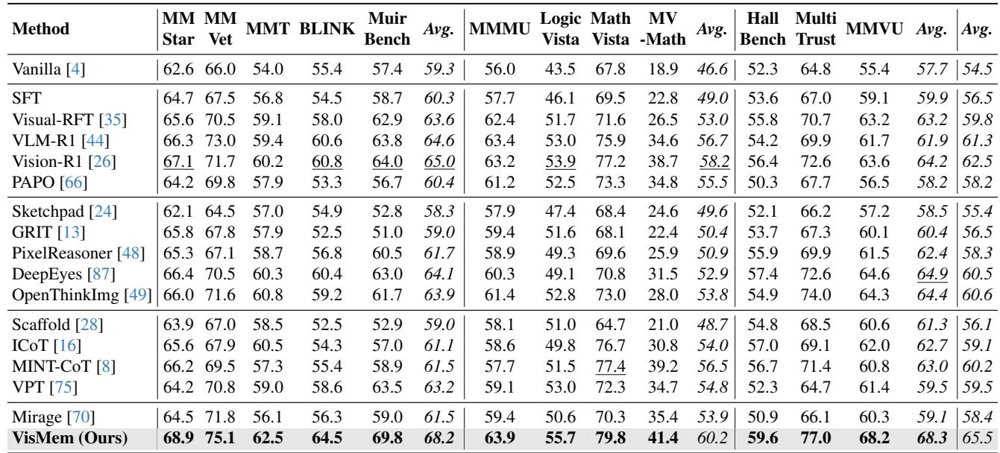
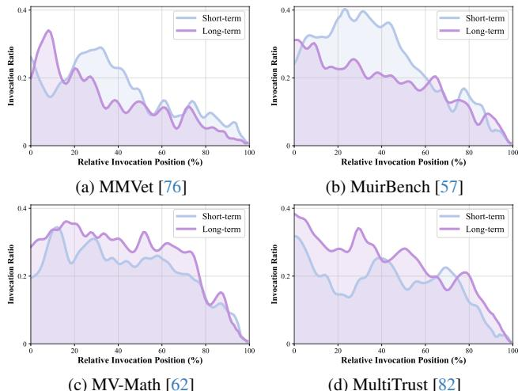
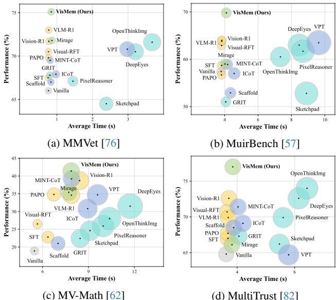
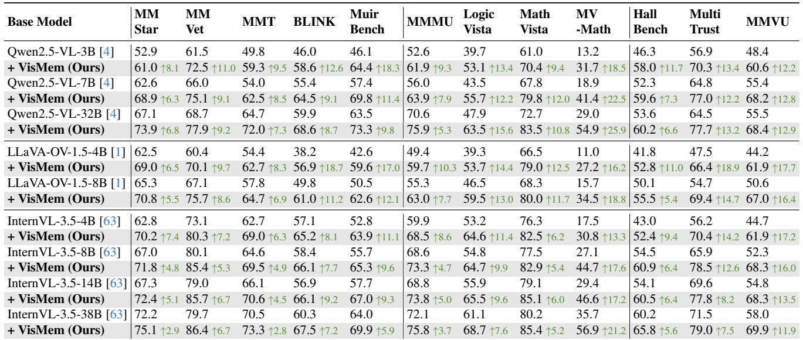
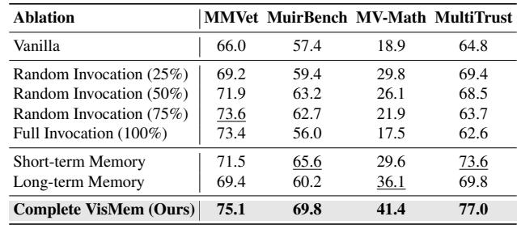

[← 返回 README](../README.md)

# Method

## 📌 预览
本文件合并 Method/Background 等核心技术段落，重点看 latent memory/reasoning/alignment 的构造、读写和训练目标。

---

# 2.1. Visual Capacities Enhancement

As demonstrated in Fig. 1, existing methods to alleviate “visual processing bottleneck” of VLMs broadly fall into four main categories: (a) direct training paradigm, which directly optimizes model parameters for target visual tasks, as in SFT, Visual-RFT [35], VLM-R1 [44], Vision-R1 [26], and PAPO [66]. Nonetheless, these methods suffer from catastrophic forgetting, specifically manifested as the degradation of general capabilities and overspecialization in specific visual cognition tasks [74, 89]; (b) image-level paradigm, which either leverages bounding boxes to denote visual evidence, represented by methods as Visual CoT [42], DeepEyes [87], SpatialVTS [33], VGR [58], and GRIT [13], or externally generate the iterative visual inputs via predefined tools, as seen in Sketchpad [24], VPRL [69], PyVision [85], OpenAI o3 [40], Pixel-Reasoner [48], MVoT [29], and OpenThinkImg [49]. Nevertheless, modifying visual inputs incurs extremely high computational costs, accompanied by high latency and reliance on external tools and concretized images; (c) tokenlevel paradigm, which select original representations and cannot modify visual evidences, thus restricted by insufficiently refined information and suboptimal selection strategies, as in ICoT [16], MINT-CoT [8], SCAFFOLD [28], LLaVA-AURORA [6], VPT [75], Chameleon [54], (d) latent space paradigm, which employs latent states to optimize autoregressive generation, but its focus remains on pure language models, e.g., Coconut [21], MemGen [81],

> 💡 **批注**: 这里的核心是 latent-space 计算：作者希望在连续表示中完成推理/记忆，而不是完全依赖显式文本链。

LatentSeek [30], SoftCoT [68], CODI [47]. Although Mirage [70] attempts to construct a latent vision space, requiring substantial manually labeled images. Our VisMem also belongs to this paradigm, but differs from existing methods by integrating latent vision memory within generation processes, characterized by a short and long memory system.

> 💡 **批注**: 这是记忆机制段落：重点区分“调用/读出 memory”和“形成/写入 memory”，以及 memory 是否动态变化。

# 3. Methodology

# 3.1. Preliminary

Problem Formulation. Based on the interaction process of VLMs, we formulate the problem and introduce the notations used. We first define a policy model $\mathcal { P }$ , which is powered by a base VLM. Given a visual task to be solved, feeding a instruction-vision pair $( I , V )$ sampled from a task distribution $\mathcal { D }$ , the policy model unfolds a corresponding trajectory $\tau$ at a timestep $t$ , including pairs of current state $s _ { t }$ of the environment and the action $a _ { t }$ performed by the model. Here, the state of the environment includes textual contexts and visual observations. Internally, the action is generated sequentially by the token-by-token autoregressive decoding of the model, yielding the output token sequence $\{ x _ { t , 1 } , x _ { t , 2 } , \ldots , x _ { t , l } \}$ . The generation of $i \mathrm { - } t h$ output token $\boldsymbol { x } _ { t , i }$ could be presented as:

> 💡 **批注**: 这里在讨论视觉证据是否被保留和利用；要问模型是否真的看图，而不是被语言先验带偏。

*Equation 1: Equation extracted by MinerU.*

> 💡 **Equation 1 批读**: 公式通常定义 latent update、memory transition、loss 或 routing；建议把符号对应到视觉证据、query、memory 和输出。

where the prediction is conditioned on the current environment state and previously generated tokens. To endow the model with vision memory, a vision memory system $\mathcal { M }$ is adhered to the policy model, thus, the objective is to optimize the memory-enhanced model jointly and to maximize its expected performance:

> 💡 **批注**: 这是记忆机制段落：重点区分“调用/读出 memory”和“形成/写入 memory”，以及 memory 是否动态变化。

*Equation 2: Equation extracted by MinerU.*

> 💡 **Equation 2 批读**: 公式通常定义 latent update、memory transition、loss 或 routing；建议把符号对应到视觉证据、query、memory 和输出。

where $S \left( \cdot \right)$ denotes the quantifiable performance results, e.g., accuracy or signal from a reward model.

> 💡 **批注**: 这是实验证据：要同时看任务指标、鲁棒性、效率和消融。

Motivation. Building on the Dennis Norris Theory [38], which aligns with contemporary models of human memory, the coordinated operation of short- and long-term visual memories surmounts the “visual processing bottleneck”. Short-term latent visual memory maintains fine-grained detail for immediate use and is thus visually dominant; by contrast, long-term latent visual memory abstracts across experiences to enable flexible reuse and is therefore semantically dominant. Taking the task illustrated in Fig. 2 as a case in point, “find the classic Lay’s on the shelf” entails the deployment of short-term vision memory, retaining visual details for immediate perceptual demands, while “get in the promotion” triggers generalized semantic knowledge about the “promotion label” acquired from historical scenarios, which is grounded in long-term latent memory, to facilitate the comprehension of the task-based sight. Existing paradigms for enhancing visual capabilities fail to adequately consider vision memory, thus, our VisMem proposes a latent memory method to bridge this gap. More theoretical foundations are in Appendix 6.

> 💡 **批注**: 这是记忆机制段落：重点区分“调用/读出 memory”和“形成/写入 memory”，以及 memory 是否动态变化。

Memory System. Based on previous contents, the task could be further disassembles into two main interactive parts: memory invocation (Sec. 3.2): related to “where and how to invoke the short- or long-term vision memory”; memory formation (Sec. 3.3): related to “what content should the short- or long-term vision memory convey”. Additionally, these two decomposed processes interact closely with each other, with distinct priorities and objectives, requiring a meticulously designed training recipe (Sec. 3.4).

> 💡 **批注**: 这是记忆机制段落：重点区分“调用/读出 memory”和“形成/写入 memory”，以及 memory 是否动态变化。

# 3.2. Memory Invocation

As illustrated in Fig. 2, our latent vision memory invocation strategy largely aligns with the standard generation pipeline of VLMs, thereby preserving their robust fundamental visual capabilities. Typically, VLMs generate rationales and answers; however, such pure text sequences lack the granularity to capture fine-grained visual perceptions and semantics, which poses challenges to accurate visual understanding, reasoning, and generation. This limitation arises because during inference, VLMs tend to prioritize accumulated textual context over visual evidence, a phenomenon particularly pronounced in long sequences [17, 25, 72, 78]. To address this, we extend the vocabulary $\nu$ of VLMs by incorporating four additional memory-operation tokens, resulting in ${ \mathcal { V } } ^ { \bar { \prime } } = { \mathcal { V } } \cup \left\{ < m _ { I } ^ { s } > , < m _ { E } ^ { s } > , \dot { < } m _ { I } ^ { l } > , < m _ { E } ^ { l } > \right\}$ . Here, $< m _ { I } >$ and $< m _ { E } >$ form paired invocation and end tokens, where the superscripts $s$ and $l$ denote short- or long-term memory, respectively. Specifically, we register these as indivisible special tokens in the tokenizer and enlarge the embedding matrix from $\mathbb { R } ^ { | \nu | \times d }$ to $\mathbb { R } ^ { ( | \nu | + 4 ) \times d }$ , where $d$ is the dimension of the model. Furthermore, we initialize the embeddings of the invocation tokens $( < m _ { I } ^ { s } >$ and $< m _ { I } ^ { l } >$ ) using the embedding vector of a delimiter token with small perturbations, and update these embeddings during training to facilitate faster convergence. The two end tokens $( < m _ { E } ^ { s } >$ and $< m _ { E } ^ { l } >$ ) are treated as structural markers; they are initialized analogously with a lower learning rate. In practice, we also employ constrained decoding to encourage wellformed invocation-end pairs.

> 💡 **批注**: 这是记忆机制段落：重点区分“调用/读出 memory”和“形成/写入 memory”，以及 memory 是否动态变化。

*Figure 2.: Figure 2. The overview of our proposed VisMem.*

> 💡 **Figure 2. 批读**: 这张图通常展示框架、视觉案例或 latent/memory 流程。重点看视觉证据如何进入、保留或更新 latent memory。

Specifically, the latent vision memory invocation tokens function as triggers for initiating memory insertion, based on the continuous internal cognitive states. During autoregressive generation (see Eq. (4)), upon the output of an invocation token, the memory former immediately initiates the latent vision memory formation procedure:

> 💡 **批注**: 这是记忆机制段落：重点区分“调用/读出 memory”和“形成/写入 memory”，以及 memory 是否动态变化。

*Equation 3: Equation extracted by MinerU.*

> 💡 **Equation 3 批读**: 公式通常定义 latent update、memory transition、loss 或 routing；建议把符号对应到视觉证据、query、memory 和输出。

The resulting latent vision memory, whether short- or longterm as dictated by the specific token type, is subsequently inserted right after the already output invocation token. Following this insertion, the corresponding end token for short $( < m _ { E } ^ { s } > )$ or long memory $( < m _ { E } ^ { l } > )$ is automatically appended to resume token-by-token decoding:

> 💡 **批注**: 这是记忆机制段落：重点区分“调用/读出 memory”和“形成/写入 memory”，以及 memory 是否动态变化。

*Equation 4: Equation extracted by MinerU.*

> 💡 **Equation 4 批读**: 公式通常定义 latent update、memory transition、loss 或 routing；建议把符号对应到视觉证据、query、memory 和输出。

# 3.3. Memory Formation

To activate the vision memory capability of VLMs, we integrate two memory components: short-term vision memory, which encodes rich visual evidence, and long-term vision memory, which primarily encodes high-level, knowledgebased visual pertinent semantics, without modifying the core VLM and damaging general abilities. This integration leverages short-term memory to enhance advanced visual perception and comprehension, while long-term memory enables the generalization of semantic experiences during reasoning, thus comprehensively enhancing the overall visual performance. As illustrated in Fig. 2, the memory formation process hinges on two core components: a query builder $\boldsymbol { B }$ , which is responsible for generating queries to hook memory; and memory formers $\mathcal { F } _ { s }$ and $\mathcal { F } _ { l }$ , which are dedicated to constructing latent visual memories.

> 💡 **批注**: 这是记忆机制段落：重点区分“调用/读出 memory”和“形成/写入 memory”，以及 memory 是否动态变化。

Query Builder. Through this process, we transform hidden states incorporating current cognition into a more efficient and accurate memory query. Initially, we instantiate a lightweight transformer encoder denoted as $\boldsymbol { B }$ and a learnable memory query $\mathbf { Q } _ { i n i t } = \{ q _ { 1 } , . . . , q _ { K } \}$ , where $K$ represents the length of the query sequence and each $q \in \mathbb { R } ^ { d }$ . Given the state at a particular time, $\boldsymbol { B }$ encodes the query sequence based on internal visual and contextual hidden states to retrieve the corresponding latent memory contents. During each invocation, as the policy model generates the current output token sequence, i.e., the token sequence starting from the initial position or from the end of the previous invocation, it accordingly produces a sequence of hidden state vectors $\{ h _ { 1 } , \ldots , h _ { z } \}$ . Similarly, visual encoder produces visual hidden state vectors $\{ v _ { 1 } , \ldots , v _ { y } \}$ . Thus, the combination of them $\mathbf { H } = \{ v _ { 1 } , \ldots , v _ { y } , h _ { 1 } , \ldots , h _ { z } \} \in \mathbb { R } ^ { ( y + z ) \times d }$ , characterizing the multi-modal cognitive state at the time, where $y$ and $z$ denote the lengths. Subsequently, we concatenate the initialized memory query to the rear of these hidden states to update the queried semantic information:

> 💡 **批注**: 这是记忆机制段落：重点区分“调用/读出 memory”和“形成/写入 memory”，以及 memory 是否动态变化。

*Equation 5: Equation extracted by MinerU.*

> 💡 **Equation 5 批读**: 公式通常定义 latent update、memory transition、loss 或 routing；建议把符号对应到视觉证据、query、memory 和输出。

where we select the output of the last layer of the encoder (see Eq. (10)), and take the last $K$ encoded vectors as the memory query $\mathbf { Q } \in \mathbb { R } ^ { K \times d }$ to hook latent memory. Furthermore, we employ a masked attention to exclusively enable attention propagation from the query to the hidden states $\mathbf { H }$ , while suppressing attention in the reverse direction, i.e., from $\mathbf { H }$ to $\mathbf { Q }$ (see Eq. (11)). Here, both short- and long-term memory share the same query builder $\boldsymbol { B }$ .

> 💡 **批注**: 这是记忆机制段落：重点区分“调用/读出 memory”和“形成/写入 memory”，以及 memory 是否动态变化。

Latent Memory Former. Distinct from many existing paradigms [26, 44, 70], we internalize the latent vision memory into lightweight formers, preserving the general abilities of base VLMs and ensuring the compatibility of our paradigm. We initialize two lightweight LoRA adapters, which are respectively designated as the short-term memory former $\mathcal { F } _ { s }$ and long-term memory former $\mathcal { F } _ { l }$ , attached to the vision encoder and the final language model of the VLM, without directly tampering with the core parameters. More precisely, we first append the generated memory query $\mathbf { Q }$ along with a set of learnable memory tokens after the corresponding target token sequence $\mathbf { X }$ . Then we process it by short-term or long-term memory former, which contextualizes and embeds the latent memory information:

> 💡 **批注**: 这是记忆机制段落：重点区分“调用/读出 memory”和“形成/写入 memory”，以及 memory 是否动态变化。

*Equation 6: Equation extracted by MinerU.*

> 💡 **Equation 6 批读**: 公式通常定义 latent update、memory transition、loss 或 routing；建议把符号对应到视觉证据、query、memory 和输出。

where short- and long-term latent vision memory $\mathbf { M } _ { s / l } \in$ $\mathbb { R } ^ { N _ { s / l } \times d }$ , while $N _ { s }$ and $N _ { l }$ are the predetermined lengths of memory tokens, which can be taken from $\{ 2 , 4 , 8 , 1 6 , 3 2 \}$ . For the short-term pathway, the resultant memory representation is concatenated with the visual token stream, and pass through the original projector to align it with the representation space of the language model. The two memory formers serve as dedicated memory carriers, exclusively storing visual evidences and semantic knowledge within themselves. When the policy model executes a memory invocation, the incoming memory query triggers externalization of useful short- or long-term memory. These memories are seamlessly inserted into the token generation process alongside the invocation and end signals and barely interfere with the original generation, as specified in Eq. (4).

> 💡 **批注**: 这是记忆机制段落：重点区分“调用/读出 memory”和“形成/写入 memory”，以及 memory 是否动态变化。

# 3.4. Training Recipe

We design a two-stage training procedure based on GRPO [43], whose optimization objectives are to optimize the effective formation and invocation of latent memory. The first stage enhances the utility of memory, while the second stage maximizes the reward of each invocation, thereby accelerating the convergence of different components steadily. More detailed algorithms and implementations are present in Appendix 7.2 and 8.3.

> 💡 **批注**: 这是记忆机制段落：重点区分“调用/读出 memory”和“形成/写入 memory”，以及 memory 是否动态变化。

Stage I: Memory Formation Optimization. In this stage, we update the query builder $\boldsymbol { B }$ , and memory formers $\mathcal { F } _ { s / l }$ while keeping the policy model $\mathcal { P }$ frozen. Initially, during the autoregressive generation process, we randomly invoke either short- or long-term memory upon detecting the delimiter, thereby acquiring initial memory capabilities. Then, the scope of memory invocations is extended to the intervals between delimiters, this not only provides a richer trajectory of memory interactions but also enables memory invocation at arbitrary positions within the generation sequence. The core objective is to maximize the performance improvement relative to trajectory without memory integration $\Delta S ( \tau ) = S ( \tau ) - S ( \tau _ { b a s e } )$ , thereby enhancing the quality of the memory formation (full function in Eq. (14)):

> 💡 **批注**: 这是记忆机制段落：重点区分“调用/读出 memory”和“形成/写入 memory”，以及 memory 是否动态变化。

*Equation 7: Equation extracted by MinerU.*

> 💡 **Equation 7 批读**: 公式通常定义 latent update、memory transition、loss 或 routing；建议把符号对应到视觉证据、query、memory 和输出。

Stage II: Memory Invocation Optimization. In this process, we update part parameters $\theta$ of the policy model $\mathcal { P }$ , and keeps all the memory formation components frozen. At this stage, the policy model $\mathcal { P }$ is required to invoke memory efficiently and accurately, which entails two core requirements: selecting the correct memory type and avoiding invalid invocations. Thus, we add two penalties to the objective, which could be optimized by (full function in Eq. (15)):

> 💡 **批注**: 这是记忆机制段落：重点区分“调用/读出 memory”和“形成/写入 memory”，以及 memory 是否动态变化。

*Equation 8: Equation extracted by MinerU.*

> 💡 **Equation 8 批读**: 公式通常定义 latent update、memory transition、loss 或 routing；建议把符号对应到视觉证据、query、memory 和输出。

where $\alpha$ denotes the penalty intensity. The type penalty, $p _ { \mathrm { t y p e } } = \operatorname* { m a x } \left( 0 , S ( \tau _ { \mathrm { r e v } } ) - S ( \tau ) \right)$ , serves to penalize the erroneous selection of memory types, where $\tau _ { \mathrm { r e v } }$ represents the invocation of an alternative memory type. In parallel, the negative penalty $p _ { \mathrm { n e g } } = \operatorname* { m a x } \left( 0 , \overline { { S } } - S ( \tau ) \right)$ is designed to penalize invocations with negative returns, aiming to enhance efficiency. Here, $\overline { S }$ denotes the mean of quantifiable scores across candidate trajectories.

> 💡 **批注**: 这是记忆机制段落：重点区分“调用/读出 memory”和“形成/写入 memory”，以及 memory 是否动态变化。

# 4.1. Settings

Benchmarks. We select 12 benchmarks to comprehensively evaluate three main abilities of VLMs, i.e., understanding, reasoning and generation [31]. These benchmarks include: (1) understanding: MMStar [7], MMVet [76], MMT [73], BLINK [15], MuirBench [57]; (2) reasoning: MMMU [79], LogicVista [67], MathVista [37], MV-Math [62]; (3) generation: HallBench [19], Multi-Trust [82], MMVU [34]. Details are in Appendix 8.2.

> 💡 **批注**: 这是实验证据：要同时看任务指标、鲁棒性、效率和消融。

Baselines. We compare our VisMem against 15 baselines, falling into four categories: (a) direct training methods: SFT, Visual-RFT [35], VLM-R1 [44], Vision-R1 [26] and PAPO [66]; (b) image-level methods: GRIT [13], Sketchpad [24], MVoT [29], OpenThinkImg [49] and Deep-Eyes [87]; (c) token-level methods: Scaffold [28], MINT-CoT [8], ICoT [16], and VPT [75]; (d) latent space methods: Mirage [70]. Details are in Appendix 8.3.

> 💡 **批注**: 这里的核心是 latent-space 计算：作者希望在连续表示中完成推理/记忆，而不是完全依赖显式文本链。

Implementation Details. All experiments (except for Tab. 2) are implemented on Qwen2.5-VL-7B [4] based on 8

Table 1. Results on 12 benchmarks to evaluate visual understanding, reasoning and generation abilities. The best and second best values are emphasized, and the average values are calculated for both specific capabilities and overall results.

> 💡 **批注**: 这是实验证据：要同时看任务指标、鲁棒性、效率和消融。

*Table 1.: Table 1. Results on 12 benchmarks to evaluate visual understanding, reasoning and generation abilities. The best and second best values are emphasized, and the average values are calculated for both specific capabilities and overall results.*

> 💡 **Table 1. 批读**: 表格要看不同任务/模态/模型规模下是否一致提升；医学场景尤其关注 per-modality 和失败案例。

NVIDIA H200 141G GPUs. The length of memory query $K$ is set to 8, and the lengths of short-term $N _ { s }$ and longterm latent vision memory $N _ { l }$ are 8 and 16, respectively. More implementation details are listed in Appendix 8.4.

> 💡 **批注**: 这是记忆机制段落：重点区分“调用/读出 memory”和“形成/写入 memory”，以及 memory 是否动态变化。

# 4.3. Additional Analyses

Through additional analyses, we derive three key research observations pertaining to VisMem: [Obs.1] compatibility across base models, [Obs.2] dynamic and adaptive memory invocation, [Obs.3] relatively low inference latency.

> 💡 **批注**: 这是记忆机制段落：重点区分“调用/读出 memory”和“形成/写入 memory”，以及 memory 是否动态变化。

[Obs.1] VisMem is robustly compatible across various base models. As detailed in Tab. 2 and Fig. 11, to evaluate the generalizability of our approach across diverse base models, we assess nine widely used base models, encompassing Qwen2.5-VL-3B/32B [4], LLaVA-OV-1.5- 4B/8B [1], InternVL-3.5-4B/8B/14B/38B [63], with parameter scales ranging from 3B to 38B. The results indicate that our latent vision memory paradigm exhibits strong compatibility across various models, yielding significant performance improvements across most visual tasks.

> 💡 **批注**: 这是记忆机制段落：重点区分“调用/读出 memory”和“形成/写入 memory”，以及 memory 是否动态变化。

[Obs.2] The memory invocations are dynamic and selfadaptive. To elaborate on the effectiveness of our dual latent memory system, we characterize the properties of the short- and long-term memories it forms. As illustrated in Fig. 5, we first analyze the type-specific invocation ratios and their relative positions within the output sequence across four benchmarks. In summary, invocation ratios are self-adaptive across tasks, while both memory types exhibit a dynamic downward trend in invocation frequency throughout the output sequence. Task-specific comparisons in Fig. 9 further reveal that short-term latent memories are invoked more frequently to retrieve fine-grained details during visual information acquisition and understanding, particularly in multi-image scenarios, such as MuirBench [57]. Conversely, long-term latent vision memories play a more critical role in reasoning, e.g., in MV-Math [62], by providing abstract semantic knowledge relevant to the current task. Furthermore, Tab. 5 and 6, which detail the sub-task performance of MuirBench [57] and LogicVista [67] respectively, further illustrate that short-term and long-term latent visual memories are complementary. Their dynamic invocation yields superior performance compared to relying on a single memory type or the absence of vision memory.

> 💡 **批注**: 这是记忆机制段落：重点区分“调用/读出 memory”和“形成/写入 memory”，以及 memory 是否动态变化。

*Figure 5.: Figure 5. Results of memory invocation ratio and invocation relative position across four benchmarks.*

> 💡 **Figure 5. 批读**: 这张图通常展示框架、视觉案例或 latent/memory 流程。重点看视觉证据如何进入、保留或更新 latent memory。

[Obs.3] VisMem incurs minimal inference latency while yielding substantial performance gains. As showcased in Fig. 6 and Tab. 12, we compare the average inference time and task performance on four benchmarks to quantify the efficiency-performance trade-off of our method. Our Vis-Mem, by harnessing the capabilities of dual vision memory, attains the best performance while incurring insignificant inference latency. Notably, image-level paradigms significantly elevate inference latency, particularly for tasks involving long thinking paths. In contrast, our VisMem exhibits remarkable effectiveness while maintaining average inference latency comparable to that of direct training optimization and token-level methods.

> 💡 **批注**: 这是记忆机制段落：重点区分“调用/读出 memory”和“形成/写入 memory”，以及 memory 是否动态变化。

Ablation Study and Sensitivity Analysis. As reported in Tab. 3, we conduct ablative studies on the memory invocation and dual memory formation. The results reveal that both short-term and long-term memory components contribute to performance across diverse visual tasks, while their complementarity synergistically drives the optimal performance. Additionally, as detailed in Tab. 9, our design achieves a favorable balance between effectiveness and efficiency, with accurate and non-redundant memory invocation. As shown in Fig. 10 and Tab. 10, 11, we conduct sensitivity analyses of the sequence lengths of the memory query $K$ , short-term $N _ { s }$ and long-term $N _ { l }$ latent memory tokens. As observed, performance generally improves with increasing sequence lengths within a reasonable range. Notably, our selected hyper-parameters achieve a favorable balance between performance and computational efficiency.

> 💡 **批注**: 这是记忆机制段落：重点区分“调用/读出 memory”和“形成/写入 memory”，以及 memory 是否动态变化。

*Figure 6.: Figure 6. Results of average inference time and performance across four benchmarks. The size is proportional to its y-value.*

> 💡 **Figure 6. 批读**: 这张图通常展示框架、视觉案例或 latent/memory 流程。重点看视觉证据如何进入、保留或更新 latent memory。

Table 3. Ablations of latent vision memory invocation and dual latent vision memory formation.

> 💡 **批注**: 这是记忆机制段落：重点区分“调用/读出 memory”和“形成/写入 memory”，以及 memory 是否动态变化。

*Table 2.: Table 2. Results on nine base models with various sizes and sources, including Qwen2.5-VL-3B/7B/32B [4], LLaVA-OV-1.5-4B/8B [1], InternVL-3.5-4B/8B/14B/38B [63]. $\uparrow$ indicates the performance enhancement compared with the base model.*

> 💡 **Table 2. 批读**: 表格要看不同任务/模态/模型规模下是否一致提升；医学场景尤其关注 per-modality 和失败案例。

# VisMem: Latent Vision Memory Unlocks Potential of Vision-Language Models

Supplementary Material

# 6. Theoretical Foundations

As the mainstream position in anthropological cognitive psychology since the 20th century, short-term memory and long-term memory are two distinct storage systems that can be differentiated based on their functional and neural underpinnings [3, 38]. Specifically, the Dennis Norris Theory [38] proposes that short-term memory requires processing new visual information, temporarily storing multiple tokens, and enabling variable signals. It relies neurologically on vision-specific brain regions, e.g., the visual cortex and the posterior superior temporal lobe associated with verbal short-term memory), exhibiting visual dominance; longterm memory, however, centers on abstract semantic representations and relies on semantic-related brain regions like the medial temporal lobe and mid-temporal lobe.

> 💡 **批注**: 这是记忆机制段落：重点区分“调用/读出 memory”和“形成/写入 memory”，以及 memory 是否动态变化。

Thus, we propose a framework termed VisMem to invoke dual short and long latent memory during the tokenby-token autoregressive generation. Aligned with Dennis Norris Theory [38], we instantiate these roles in a VLM backbone via latent vision memory invocation and latent vision memory formation, which together produce distinct short and long latent memory tokens and integrate them into the generation stream of the model.

> 💡 **批注**: 这是记忆机制段落：重点区分“调用/读出 memory”和“形成/写入 memory”，以及 memory 是否动态变化。

# 7. Methodology Details

# 7.1. Query Builder

As described in Sec. 3.3, the we initialize a lightweight transformer-based encoder as memory builder $\boldsymbol { B }$ . We feed the concatenated memory query $\mathbf { Q }$ and hidden states of vision and output $\mathbf { H }$ into the builder to encoder query as memory hook (see Eq. (5)). The transformer-based builder has $L$ layers of encoders, the output process of the $\ell$ layer could be summarized as:

> 💡 **批注**: 这是记忆机制段落：重点区分“调用/读出 memory”和“形成/写入 memory”，以及 memory 是否动态变化。

*Equation 9: Equation extracted by MinerU.*

> 💡 **Equation 9 批读**: 公式通常定义 latent update、memory transition、loss 或 routing；建议把符号对应到视觉证据、query、memory 和输出。

where we simplify the input sequence to $x$ , and SM, MHA, FF, LN denote the softmax, multi-head self-attention, feedforward layer, layer normalization operations, respectively. In addition, $M$ is the mask which only allows attention from memory query $\mathbf { Q }$ to hidden states $\mathbf { H }$ , and blocks the reverse direction:

> 💡 **批注**: 这是记忆机制段落：重点区分“调用/读出 memory”和“形成/写入 memory”，以及 memory 是否动态变化。

*Equation 10: Equation extracted by MinerU.*

> 💡 **Equation 10 批读**: 公式通常定义 latent update、memory transition、loss 或 routing；建议把符号对应到视觉证据、query、memory 和输出。

where $C \gg 0$ is constant, thus the attention is close to $- \infty$

# 7.2. Training Recipe

As mentioned in Sec. 3.4, we design a two-stage training pipeline: at the first stage, the main objective is to optimize the memory formation process (see Eq. (7)); at the second stage, the main objective is to optimize the memory invocation (see Eq. (8)). We update the models based on reinforcement learning, i.e., GRPO strategy [43]. Specifically, for each instruction-vision pair $( I , V )$ , the policy model $\mathcal { P }$ generates a group of $G$ distinct candidate trajectories, termed as $\mathcal { T } = \{ \tau _ { 1 } , \dots , \tau _ { G } \}$ . For each trajectory, we utilize a $S \left( \cdot \right)$ to quantify the performance. Then, a group-relative baseline is calculated via averaging and standardizing all trajectories within the candidate group $G$ :

> 💡 **批注**: 这是记忆机制段落：重点区分“调用/读出 memory”和“形成/写入 memory”，以及 memory 是否动态变化。

*Equation 11: Equation extracted by MinerU.*

> 💡 **Equation 11 批读**: 公式通常定义 latent update、memory transition、loss 或 routing；建议把符号对应到视觉证据、query、memory 和输出。

Consequently, the group-relative advantage of each trajectory could be formulated as:

*Equation 12: Equation extracted by MinerU.*

> 💡 **Equation 12 批读**: 公式通常定义 latent update、memory transition、loss 或 routing；建议把符号对应到视觉证据、query、memory 和输出。

At the Stage I, the reinforcement learning optimizes the memory formation process, whose final objective function is:

> 💡 **批注**: 这是记忆机制段落：重点区分“调用/读出 memory”和“形成/写入 memory”，以及 memory 是否动态变化。

*Equation 13: Equation extracted by MinerU.*

> 💡 **Equation 13 批读**: 公式通常定义 latent update、memory transition、loss 或 routing；建议把符号对应到视觉证据、query、memory 和输出。

where $\epsilon$ controls the group-relative advantage ${ \hat { A } } , \beta$ regulates the KL divergence penalty, and the updated policy parameters $\pi ^ { \phi } = \pi ^ { \phi } \left( \mathbf { Q } \mid \mathbf { H } \right) \cdot \pi ^ { \phi } \left( \mathbf { M } _ { s / l } \mid \mathbf { Q } \right)$ .

> 💡 **批注**: 这是实验证据：要同时看任务指标、鲁棒性、效率和消融。

At the Stage $\mathbf { I I }$ , the reinforcement learning optimizes the memory invocation process, whose final objective function is:

> 💡 **批注**: 这是记忆机制段落：重点区分“调用/读出 memory”和“形成/写入 memory”，以及 memory 是否动态变化。

*Equation 14: Equation extracted by MinerU.*

> 💡 **Equation 14 批读**: 公式通常定义 latent update、memory transition、loss 或 routing；建议把符号对应到视觉证据、query、memory 和输出。

# 8.1. Training Data

During the two-stage training procedure, we use the same training data to optimize both the memory invocation and memory formation in the latent vision memory system. Initially, we include the training split dataset of the selected benchmarks and retain their original data division. For benchmarks without a training phase, we use them solely for evaluation. Additionally, we incorporate the Visual CoT [42] and Mullberry [71], improving the reasoning abilities.

> 💡 **批注**: 这是记忆机制段落：重点区分“调用/读出 memory”和“形成/写入 memory”，以及 memory 是否动态变化。

# 8.3. Baselines

We select a total of 16 baselines, including the vanilla model [4], 5 direct training paradigms: SFT, Visual-RFT [35], VLM-R1 [44], Vision-R1 [26], and PAPO [66]; 5 image-level paradigms: Sketchpad [24], GRIT [13], PixelReasoner [48], DeepEyes [87], and OpenThinkImg [49]; 4 token-level paradigms: Scaffold [28], ICoT [16], MINT-CoT [8], and VPT [75]; and 1 latent space paradigm: Mirage [70].

> 💡 **批注**: 这里的核心是 latent-space 计算：作者希望在连续表示中完成推理/记忆，而不是完全依赖显式文本链。

Here, VLM-R1 [44] and Vision-R1 [26] follow the main GRPO [20] paradigm based on VLMs. To assess the effectiveness of different methods, our VisMem is trained on Qwen-2.5-VL-7B [4]. For strategies initially implemented on other base models, e.g., GPT-4o [27] and Qwen2- VL [60], we transfer them to Qwen2.5-VL-7B [4] for fair comparison. Besides, we maintain identical training datasets across most counterparts; however, for those three methods with specially curated datasets, we follow their original settings. Namely, Mirage [70] requires additional labeled training images, so we follow its original training dataset; GRIT [13] uses a tailored training process with designed data; and MINT-CoT [8] curates high-quality mathematical samples with grids and annotations.

> 💡 **批注**: 这里在讨论视觉证据是否被保留和利用；要问模型是否真的看图，而不是被语言先验带偏。

# 8.4. Implementations

The configurations and implementations of the experiments include three main parts: the core hyperparameters, the parameters of the LoRA adapter, and the parameters we use during training. The configurations and implementations of the experiments are listed in Tab. 4.

> 💡 **批注**: 这是实验证据：要同时看任务指标、鲁棒性、效率和消融。

# 9.2. Cross-domain Generalization

To evaluate the cross-domain generalization capability of our model, we train it exclusively on general datasets, namely, Visual CoT [42] and Mullberry [71]), to verify whether latent visual memory can be transferred to unseen domains. As shown in Tab. 7 and Fig. 7, our method demonstrates superior performance, which exhibits a smaller performance drop than the fully trained model across all four selected benchmarks, confirming strong cross-domain generalization. Despite being trained on only two datasets, our method achieves a significant performance improvement of $9 . 1 - 2 0 . 5 \%$ across the four benchmarks, with a mere $2 \%$ performance gap relative to the fully trained model. When compared to other baselines, it still maintains a performance lead of $3 . 4 \% / 6 . 7 \% / 2 . 7 \% / 4 . 7 \%$ across the four evaluations, respectively.

> 💡 **批注**: 这是记忆机制段落：重点区分“调用/读出 memory”和“形成/写入 memory”，以及 memory 是否动态变化。

In general, the image-level, token-level, and latent space paradigms suffer from smaller performance degradation, whereas the direct training paradigm exhibits inferior generalization ability. For example, VLM-R1 [44] experiences a $5 . 3 \%$ performance drop; by contrast, this value is only $2 . 1 \%$ for OpenThinkImg [49], $1 . 1 \%$ for MINT-CoT [8], and $2 . 3 \%$ for our method. These results indicate that while direct training optimizations notably improve performance on specific tasks, they compromise generalization ability to some extent.

> 💡 **批注**: 这里的核心是 latent-space 计算：作者希望在连续表示中完成推理/记忆，而不是完全依赖显式文本链。

# 9.3. Catastrophic Forgetting Mitigation

To assess the extent of catastrophic forgetting, we conducted continual learning experiments with our VisMem and other baselines. As presented in Tab. 8 and Fig. 8, our method effectively mitigates forgetting of earlier tasks. It consistently achieves the best performance at each stage, demonstrating strong robustness against catastrophic forgetting. Following four-stage sequential continual training, it retains $7 2 . 1 \%$ performance on MMVet [76], outperforming $6 8 . 4 \%$ of DeepEyes [87] and $6 7 . 0 \%$ of Mirage [70].

> 💡 **批注**: 这是记忆机制段落：重点区分“调用/读出 memory”和“形成/写入 memory”，以及 memory 是否动态变化。

While the direct training paradigm significantly improves performance on specific tasks, it adapts to new tasks via direct updates to core parameters. This introduces conflicts when parameter update directions contradict the storage of existing knowledge, compounded by a lack of constraints from prior knowledge. Consequently, in stage 3, the performance of most direct training methods even falls below that of the vanilla model. In contrast, methods such as OpenThinkImg [49] and our proposed VisMem exhibit stronger knowledge retention and forward transfer capabilities. For instance, in stage 3, training on additional datasets further improves their performance on MMVet [76].

> 💡 **批注**: 这是实验证据：要同时看任务指标、鲁棒性、效率和消融。

# 9.4. Versatility across Various Base Models

As presented in Tab. 2 and Fig. 11, we incorporate our latent visual memory paradigm into 9 base models, including Qwen2.5-VL-3B/7B/32B [4], LLaVA-OV-1.5-4B/8B [1], and InternVL-3.5-4B/8B/14B/38B [63]. Our VisMem consistently enhances the visual capabilities of all base models, spanning 3B to 38B parameter sizes across three VLM families. For the widely used medium-sized models (i.e., 7B or 8B parameter models), our latent visual memory delivers substantial performance gains, which brings a $6 . 3 \substack { - 2 3 . 1 \% }$ improvement across all benchmarks for Qwen2.5-VL-7B [4], a $5 . 5 \substack { - 2 0 . 2 \% }$ improvement for LLaVA-OV-1.5-8B [1], and a $4 . 8 \mathrm { - } 1 7 . 6 \%$ improvement for InternVL-3.5-8B [63], respectively.

> 💡 **批注**: 这是记忆机制段落：重点区分“调用/读出 memory”和“形成/写入 memory”，以及 memory 是否动态变化。

Furthermore, in most benchmarks, smaller-parameter base models yield greater performance gains than their medium- or large-sized counterparts. This phenomenon may stem from an imbalance in task difficulty, which makes it more challenging for models with higher baseline scores to achieve further improvements. In contrast, larger models exhibit more significant gains in dense reasoning benchmarks: the integration of latent visual memory overcomes bottlenecks in visual reasoning by providing fine-grained visual evidence and semantic knowledge. Notably, this model-agnostic approach, independent of specific model architectures or structures, bolsters the prospects for broad practical application.

> 💡 **批注**: 这是记忆机制段落：重点区分“调用/读出 memory”和“形成/写入 memory”，以及 memory 是否动态变化。

Table 7. Results of various models with full training datasets and partial datasets (Visual CoT [42] and Mulberry [71]), and evaluated across four benchmarks.

> 💡 **批注**: 这是实验证据：要同时看任务指标、鲁棒性、效率和消融。

*Table 3.: Table 3. Ablations of latent vision memory invocation and dual latent vision memory formation.*

> 💡 **Table 3. 批读**: 表格要看不同任务/模态/模型规模下是否一致提升；医学场景尤其关注 per-modality 和失败案例。

Table 8. Results of various models on MMVet [76] with four-stage continual learning. Stage 0: MMVet [76]; Stage 1: BLINK [15], and MuirBench [57]; Stage 2: LogicVista [67], and Math-V [59]; Stage 3: MultiTrust [82], and MMVU [34].

> 💡 **批注**: 这是实验证据：要同时看任务指标、鲁棒性、效率和消融。

*Table 4.: Table 4. Configurations of parameters.*

> 💡 **Table 4. 批读**: 表格要看不同任务/模态/模型规模下是否一致提升；医学场景尤其关注 per-modality 和失败案例。

# 9.8. Inference Efficiency

As presented in Tab. 12 and the bubble plots in Fig. 6, we compare the average inference time, average inference speed, and task performance across the four benchmarks. Our approach achieves an optimal performance-efficiency balance, with minimal additional time overhead. For instance, image-level paradigms exhibit nearly twice the inference time of the vanilla model, resulting in significant latency and substantial inference overhead. In contrast, our VisMem introduces only controllable computational latency increments, ranging from $8 . 2 \%$ to $4 3 . 8 \%$ relative to the vanilla model, which are on par with those of other direct training and token-level paradigms.

> 💡 **批注**: 这里在讨论视觉证据是否被保留和利用；要问模型是否真的看图，而不是被语言先验带偏。

Table 12. Average inference time per sample (seconds), average inference speed (samples / seconds), and task performances across four benchmarks on various methods. Perf. indicates Performance.

> 💡 **批注**: 这是实验证据：要同时看任务指标、鲁棒性、效率和消融。

*Table 5.: Table 5. Results on 9 selected subsets of MuirBench [57]. We compare our VisMem with the second and third best scored counterparts, and separately use the short or long latent memory to assess the improvements of each.*

> 💡 **Table 5. 批读**: 表格要看不同任务/模态/模型规模下是否一致提升；医学场景尤其关注 per-modality 和失败案例。

*Figure 11.: Figure 11. Results on different base models.*

> 💡 **Figure 11. 批读**: 这张图通常展示框架、视觉案例或 latent/memory 流程。重点看视觉证据如何进入、保留或更新 latent memory。

---

## 🔖 Section 总结

### 核心洞察
1. 明确 latent/memory/alignment 的读写路径。
2. 区分训练时组件和推理时组件。
3. 关注是否能迁移到医学影像。
