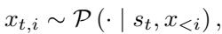
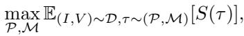
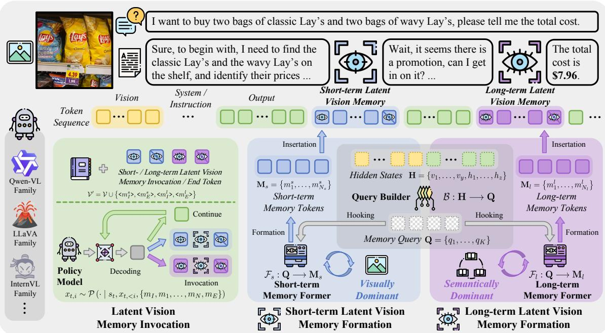
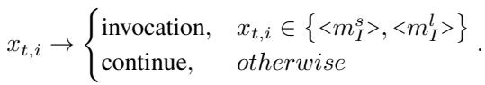
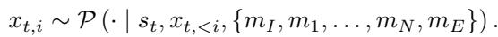
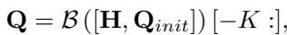
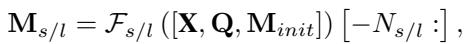
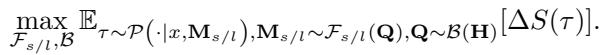
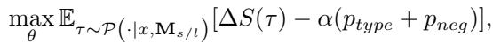

[← 返回 README](../README.md)

# 3. Methodology

## 📌 预览
本节是核心方法，重点看模块输入输出、训练目标、推理路径和与 baseline 的差异。

---

# 3.1. Preliminary

Problem Formulation. Based on the interaction process of VLMs, we formulate the problem and introduce the notations used. We first define a policy model $\mathcal { P }$ , which is powered by a base VLM. Given a visual task to be solved, feeding a instruction-vision pair $( I , V )$ sampled from a task distribution $\mathcal { D }$ , the policy model unfolds a corresponding trajectory $\tau$ at a timestep $t$ , including pairs of current state $s _ { t }$ of the environment and the action $a _ { t }$ performed by the model. Here, the state of the environment includes textual contexts and visual observations. Internally, the action is generated sequentially by the token-by-token autoregressive decoding of the model, yielding the output token sequence $\{ x _ { t , 1 } , x _ { t , 2 } , \ldots , x _ { t , l } \}$ . The generation of $i \mathrm { - } t h$ output token $\boldsymbol { x } _ { t , i }$ could be presented as:

> 💡 **批注**: 这段按 VisMem 的动态视觉记忆主线读：模型需要在生成过程中保留细粒度视觉证据，同时把可复用语义经验压缩成长期 latent memory；关键是何时调用、如何更新、是否真的缓解 visual grounding 丢失。

*Equation 1: Equation extracted by MinerU.*

> 💡 **Equation 1 批读**: 这里的公式要按 VisMem 的记忆更新路径读：输入是当前视觉 token、hidden state 或 memory slot，变化是 invocation/formation/consolidation，输出是可再次调用的 latent vision memory。

where the prediction is conditioned on the current environment state and previously generated tokens. To endow the model with vision memory, a vision memory system $\mathcal { M }$ is adhered to the policy model, thus, the objective is to optimize the memory-enhanced model jointly and to maximize its expected performance:

> 💡 **批注**: 这段按 VisMem 的动态视觉记忆主线读：模型需要在生成过程中保留细粒度视觉证据，同时把可复用语义经验压缩成长期 latent memory；关键是何时调用、如何更新、是否真的缓解 visual grounding 丢失。

*Equation 2: Equation extracted by MinerU.*

> 💡 **Equation 2 批读**: 这里的公式要按 VisMem 的记忆更新路径读：输入是当前视觉 token、hidden state 或 memory slot，变化是 invocation/formation/consolidation，输出是可再次调用的 latent vision memory。

where $S \left( \cdot \right)$ denotes the quantifiable performance results, e.g., accuracy or signal from a reward model.

> 💡 **批注**: 这段是 VisMem 主线：关注视觉证据如何在 VLM 长生成中被短期感知记忆保留、被长期语义记忆压缩，并在推理时重新注入 hidden stream。

Motivation. Building on the Dennis Norris Theory [38], which aligns with contemporary models of human memory, the coordinated operation of short- and long-term visual memories surmounts the “visual processing bottleneck”. Short-term latent visual memory maintains fine-grained detail for immediate use and is thus visually dominant; by contrast, long-term latent visual memory abstracts across experiences to enable flexible reuse and is therefore semantically dominant. Taking the task illustrated in Fig. 2 as a case in point, “find the classic Lay’s on the shelf” entails the deployment of short-term vision memory, retaining visual details for immediate perceptual demands, while “get in the promotion” triggers generalized semantic knowledge about the “promotion label” acquired from historical scenarios, which is grounded in long-term latent memory, to facilitate the comprehension of the task-based sight. Existing paradigms for enhancing visual capabilities fail to adequately consider vision memory, thus, our VisMem proposes a latent memory method to bridge this gap. More theoretical foundations are in Appendix 6.

> 💡 **批注**: 这段按 VisMem 的动态视觉记忆主线读：模型需要在生成过程中保留细粒度视觉证据，同时把可复用语义经验压缩成长期 latent memory；关键是何时调用、如何更新、是否真的缓解 visual grounding 丢失。

Memory System. Based on previous contents, the task could be further disassembles into two main interactive parts: memory invocation (Sec. 3.2): related to “where and how to invoke the short- or long-term vision memory”; memory formation (Sec. 3.3): related to “what content should the short- or long-term vision memory convey”. Additionally, these two decomposed processes interact closely with each other, with distinct priorities and objectives, requiring a meticulously designed training recipe (Sec. 3.4).

> 💡 **批注**: 这段按 VisMem 的动态视觉记忆主线读：模型需要在生成过程中保留细粒度视觉证据，同时把可复用语义经验压缩成长期 latent memory；关键是何时调用、如何更新、是否真的缓解 visual grounding 丢失。

# 3.2. Memory Invocation

As illustrated in Fig. 2, our latent vision memory invocation strategy largely aligns with the standard generation pipeline of VLMs, thereby preserving their robust fundamental visual capabilities. Typically, VLMs generate rationales and answers; however, such pure text sequences lack the granularity to capture fine-grained visual perceptions and semantics, which poses challenges to accurate visual understanding, reasoning, and generation. This limitation arises because during inference, VLMs tend to prioritize accumulated textual context over visual evidence, a phenomenon particularly pronounced in long sequences [17, 25, 72, 78]. To address this, we extend the vocabulary $\nu$ of VLMs by incorporating four additional memory-operation tokens, resulting in ${ \mathcal { V } } ^ { \bar { \prime } } = { \mathcal { V } } \cup \left\{ < m _ { I } ^ { s } > , < m _ { E } ^ { s } > , \dot { < } m _ { I } ^ { l } > , < m _ { E } ^ { l } > \right\}$ . Here, $< m _ { I } >$ and $< m _ { E } >$ form paired invocation and end tokens, where the superscripts $s$ and $l$ denote short- or long-term memory, respectively. Specifically, we register these as indivisible special tokens in the tokenizer and enlarge the embedding matrix from $\mathbb { R } ^ { | \nu | \times d }$ to $\mathbb { R } ^ { ( | \nu | + 4 ) \times d }$ , where $d$ is the dimension of the model. Furthermore, we initialize the embeddings of the invocation tokens $( < m _ { I } ^ { s } >$ and $< m _ { I } ^ { l } >$ ) using the embedding vector of a delimiter token with small perturbations, and update these embeddings during training to facilitate faster convergence. The two end tokens $( < m _ { E } ^ { s } >$ and $< m _ { E } ^ { l } >$ ) are treated as structural markers; they are initialized analogously with a lower learning rate. In practice, we also employ constrained decoding to encourage wellformed invocation-end pairs.

> 💡 **批注**: 这段按 VisMem 的动态视觉记忆主线读：模型需要在生成过程中保留细粒度视觉证据，同时把可复用语义经验压缩成长期 latent memory；关键是何时调用、如何更新、是否真的缓解 visual grounding 丢失。

*Figure 2.: Figure 2. The overview of our proposed VisMem.*

> 💡 **Figure 2. 批读**: 这张图要结合 VisMem 的记忆机制读：看它是在说明短期/长期 memory 的结构、invocation/formation 的流程，还是在展示 grounding 保持、消融和泛化效果。

Specifically, the latent vision memory invocation tokens function as triggers for initiating memory insertion, based on the continuous internal cognitive states. During autoregressive generation (see Eq. (4)), upon the output of an invocation token, the memory former immediately initiates the latent vision memory formation procedure:

> 💡 **批注**: 这段按 VisMem 的动态视觉记忆主线读：模型需要在生成过程中保留细粒度视觉证据，同时把可复用语义经验压缩成长期 latent memory；关键是何时调用、如何更新、是否真的缓解 visual grounding 丢失。

*Equation 3: Equation extracted by MinerU.*

> 💡 **Equation 3 批读**: 这里的公式要按 VisMem 的记忆更新路径读：输入是当前视觉 token、hidden state 或 memory slot，变化是 invocation/formation/consolidation，输出是可再次调用的 latent vision memory。

The resulting latent vision memory, whether short- or longterm as dictated by the specific token type, is subsequently inserted right after the already output invocation token. Following this insertion, the corresponding end token for short $( < m _ { E } ^ { s } > )$ or long memory $( < m _ { E } ^ { l } > )$ is automatically appended to resume token-by-token decoding:

> 💡 **批注**: 这段按 VisMem 的动态视觉记忆主线读：模型需要在生成过程中保留细粒度视觉证据，同时把可复用语义经验压缩成长期 latent memory；关键是何时调用、如何更新、是否真的缓解 visual grounding 丢失。

*Equation 4: Equation extracted by MinerU.*

> 💡 **Equation 4 批读**: 这里的公式要按 VisMem 的记忆更新路径读：输入是当前视觉 token、hidden state 或 memory slot，变化是 invocation/formation/consolidation，输出是可再次调用的 latent vision memory。

# 3.3. Memory Formation

To activate the vision memory capability of VLMs, we integrate two memory components: short-term vision memory, which encodes rich visual evidence, and long-term vision memory, which primarily encodes high-level, knowledgebased visual pertinent semantics, without modifying the core VLM and damaging general abilities. This integration leverages short-term memory to enhance advanced visual perception and comprehension, while long-term memory enables the generalization of semantic experiences during reasoning, thus comprehensively enhancing the overall visual performance. As illustrated in Fig. 2, the memory formation process hinges on two core components: a query builder $\boldsymbol { B }$ , which is responsible for generating queries to hook memory; and memory formers $\mathcal { F } _ { s }$ and $\mathcal { F } _ { l }$ , which are dedicated to constructing latent visual memories.

> 💡 **批注**: 这段按 VisMem 的动态视觉记忆主线读：模型需要在生成过程中保留细粒度视觉证据，同时把可复用语义经验压缩成长期 latent memory；关键是何时调用、如何更新、是否真的缓解 visual grounding 丢失。

Query Builder. Through this process, we transform hidden states incorporating current cognition into a more efficient and accurate memory query. Initially, we instantiate a lightweight transformer encoder denoted as $\boldsymbol { B }$ and a learnable memory query $\mathbf { Q } _ { i n i t } = \{ q _ { 1 } , . . . , q _ { K } \}$ , where $K$ represents the length of the query sequence and each $q \in \mathbb { R } ^ { d }$ . Given the state at a particular time, $\boldsymbol { B }$ encodes the query sequence based on internal visual and contextual hidden states to retrieve the corresponding latent memory contents. During each invocation, as the policy model generates the current output token sequence, i.e., the token sequence starting from the initial position or from the end of the previous invocation, it accordingly produces a sequence of hidden state vectors $\{ h _ { 1 } , \ldots , h _ { z } \}$ . Similarly, visual encoder produces visual hidden state vectors $\{ v _ { 1 } , \ldots , v _ { y } \}$ . Thus, the combination of them $\mathbf { H } = \{ v _ { 1 } , \ldots , v _ { y } , h _ { 1 } , \ldots , h _ { z } \} \in \mathbb { R } ^ { ( y + z ) \times d }$ , characterizing the multi-modal cognitive state at the time, where $y$ and $z$ denote the lengths. Subsequently, we concatenate the initialized memory query to the rear of these hidden states to update the queried semantic information:

> 💡 **批注**: 这段按 VisMem 的动态视觉记忆主线读：模型需要在生成过程中保留细粒度视觉证据，同时把可复用语义经验压缩成长期 latent memory；关键是何时调用、如何更新、是否真的缓解 visual grounding 丢失。

*Equation 5: Equation extracted by MinerU.*

> 💡 **Equation 5 批读**: 这里的公式要按 VisMem 的记忆更新路径读：输入是当前视觉 token、hidden state 或 memory slot，变化是 invocation/formation/consolidation，输出是可再次调用的 latent vision memory。

where we select the output of the last layer of the encoder (see Eq. (10)), and take the last $K$ encoded vectors as the memory query $\mathbf { Q } \in \mathbb { R } ^ { K \times d }$ to hook latent memory. Furthermore, we employ a masked attention to exclusively enable attention propagation from the query to the hidden states $\mathbf { H }$ , while suppressing attention in the reverse direction, i.e., from $\mathbf { H }$ to $\mathbf { Q }$ (see Eq. (11)). Here, both short- and long-term memory share the same query builder $\boldsymbol { B }$ .

> 💡 **批注**: 这段按 VisMem 的动态视觉记忆主线读：模型需要在生成过程中保留细粒度视觉证据，同时把可复用语义经验压缩成长期 latent memory；关键是何时调用、如何更新、是否真的缓解 visual grounding 丢失。

Latent Memory Former. Distinct from many existing paradigms [26, 44, 70], we internalize the latent vision memory into lightweight formers, preserving the general abilities of base VLMs and ensuring the compatibility of our paradigm. We initialize two lightweight LoRA adapters, which are respectively designated as the short-term memory former $\mathcal { F } _ { s }$ and long-term memory former $\mathcal { F } _ { l }$ , attached to the vision encoder and the final language model of the VLM, without directly tampering with the core parameters. More precisely, we first append the generated memory query $\mathbf { Q }$ along with a set of learnable memory tokens after the corresponding target token sequence $\mathbf { X }$ . Then we process it by short-term or long-term memory former, which contextualizes and embeds the latent memory information:

> 💡 **批注**: 这段按 VisMem 的动态视觉记忆主线读：模型需要在生成过程中保留细粒度视觉证据，同时把可复用语义经验压缩成长期 latent memory；关键是何时调用、如何更新、是否真的缓解 visual grounding 丢失。

*Equation 6: Equation extracted by MinerU.*

> 💡 **Equation 6 批读**: 这里的公式要按 VisMem 的记忆更新路径读：输入是当前视觉 token、hidden state 或 memory slot，变化是 invocation/formation/consolidation，输出是可再次调用的 latent vision memory。

where short- and long-term latent vision memory $\mathbf { M } _ { s / l } \in$ $\mathbb { R } ^ { N _ { s / l } \times d }$ , while $N _ { s }$ and $N _ { l }$ are the predetermined lengths of memory tokens, which can be taken from $\{ 2 , 4 , 8 , 1 6 , 3 2 \}$ . For the short-term pathway, the resultant memory representation is concatenated with the visual token stream, and pass through the original projector to align it with the representation space of the language model. The two memory formers serve as dedicated memory carriers, exclusively storing visual evidences and semantic knowledge within themselves. When the policy model executes a memory invocation, the incoming memory query triggers externalization of useful short- or long-term memory. These memories are seamlessly inserted into the token generation process alongside the invocation and end signals and barely interfere with the original generation, as specified in Eq. (4).

> 💡 **批注**: 这段按 VisMem 的动态视觉记忆主线读：模型需要在生成过程中保留细粒度视觉证据，同时把可复用语义经验压缩成长期 latent memory；关键是何时调用、如何更新、是否真的缓解 visual grounding 丢失。

# 3.4. Training Recipe

We design a two-stage training procedure based on GRPO [43], whose optimization objectives are to optimize the effective formation and invocation of latent memory. The first stage enhances the utility of memory, while the second stage maximizes the reward of each invocation, thereby accelerating the convergence of different components steadily. More detailed algorithms and implementations are present in Appendix 7.2 and 8.3.

> 💡 **批注**: 这段按 VisMem 的动态视觉记忆主线读：模型需要在生成过程中保留细粒度视觉证据，同时把可复用语义经验压缩成长期 latent memory；关键是何时调用、如何更新、是否真的缓解 visual grounding 丢失。

Stage I: Memory Formation Optimization. In this stage, we update the query builder $\boldsymbol { B }$ , and memory formers $\mathcal { F } _ { s / l }$ while keeping the policy model $\mathcal { P }$ frozen. Initially, during the autoregressive generation process, we randomly invoke either short- or long-term memory upon detecting the delimiter, thereby acquiring initial memory capabilities. Then, the scope of memory invocations is extended to the intervals between delimiters, this not only provides a richer trajectory of memory interactions but also enables memory invocation at arbitrary positions within the generation sequence. The core objective is to maximize the performance improvement relative to trajectory without memory integration $\Delta S ( \tau ) = S ( \tau ) - S ( \tau _ { b a s e } )$ , thereby enhancing the quality of the memory formation (full function in Eq. (14)):

> 💡 **批注**: 这段按 VisMem 的动态视觉记忆主线读：模型需要在生成过程中保留细粒度视觉证据，同时把可复用语义经验压缩成长期 latent memory；关键是何时调用、如何更新、是否真的缓解 visual grounding 丢失。

*Equation 7: Equation extracted by MinerU.*

> 💡 **Equation 7 批读**: 这里的公式要按 VisMem 的记忆更新路径读：输入是当前视觉 token、hidden state 或 memory slot，变化是 invocation/formation/consolidation，输出是可再次调用的 latent vision memory。

Stage II: Memory Invocation Optimization. In this process, we update part parameters $\theta$ of the policy model $\mathcal { P }$ , and keeps all the memory formation components frozen. At this stage, the policy model $\mathcal { P }$ is required to invoke memory efficiently and accurately, which entails two core requirements: selecting the correct memory type and avoiding invalid invocations. Thus, we add two penalties to the objective, which could be optimized by (full function in Eq. (15)):

> 💡 **批注**: 这段按 VisMem 的动态视觉记忆主线读：模型需要在生成过程中保留细粒度视觉证据，同时把可复用语义经验压缩成长期 latent memory；关键是何时调用、如何更新、是否真的缓解 visual grounding 丢失。

*Equation 8: Equation extracted by MinerU.*

> 💡 **Equation 8 批读**: 这里的公式要按 VisMem 的记忆更新路径读：输入是当前视觉 token、hidden state 或 memory slot，变化是 invocation/formation/consolidation，输出是可再次调用的 latent vision memory。

where $\alpha$ denotes the penalty intensity. The type penalty, $p _ { \mathrm { t y p e } } = \operatorname* { m a x } \left( 0 , S ( \tau _ { \mathrm { r e v } } ) - S ( \tau ) \right)$ , serves to penalize the erroneous selection of memory types, where $\tau _ { \mathrm { r e v } }$ represents the invocation of an alternative memory type. In parallel, the negative penalty $p _ { \mathrm { n e g } } = \operatorname* { m a x } \left( 0 , \overline { { S } } - S ( \tau ) \right)$ is designed to penalize invocations with negative returns, aiming to enhance efficiency. Here, $\overline { S }$ denotes the mean of quantifiable scores across candidate trajectories.

> 💡 **批注**: 这段按 VisMem 的动态视觉记忆主线读：模型需要在生成过程中保留细粒度视觉证据，同时把可复用语义经验压缩成长期 latent memory；关键是何时调用、如何更新、是否真的缓解 visual grounding 丢失。

---

## 🔖 Section 总结

### 核心洞察
1. 本节精读重点：把 VisMem 的短期视觉保留、长期语义巩固、推理时调用和实验消融联系起来看，判断它是否真正缓解 visual grounding 丢失。
2. 阅读重点是把本节的机制/证据映射到论文主 claim。
3. 后续如有疑问，可在本 section 继续补充更细批注。
