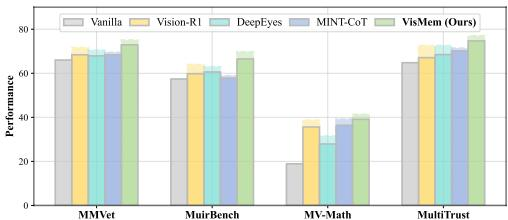
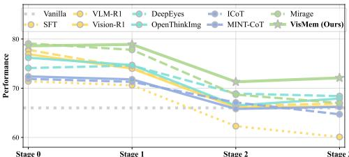

[← 返回 README](../README.md)

# 4. Experiments

## 📌 预览
本节验证方法是否成立，重点看主结果、消融、效率和视觉/病例案例。

---

# 4.1. Settings

Benchmarks. We select 12 benchmarks to comprehensively evaluate three main abilities of VLMs, i.e., understanding, reasoning and generation [31]. These benchmarks include: (1) understanding: MMStar [7], MMVet [76], MMT [73], BLINK [15], MuirBench [57]; (2) reasoning: MMMU [79], LogicVista [67], MathVista [37], MV-Math [62]; (3) generation: HallBench [19], Multi-Trust [82], MMVU [34]. Details are in Appendix 8.2.

> 💡 **批注**: 这段按 VisMem 的动态视觉记忆主线读：模型需要在生成过程中保留细粒度视觉证据，同时把可复用语义经验压缩成长期 latent memory；关键是何时调用、如何更新、是否真的缓解 visual grounding 丢失。

Baselines. We compare our VisMem against 15 baselines, falling into four categories: (a) direct training methods: SFT, Visual-RFT [35], VLM-R1 [44], Vision-R1 [26] and PAPO [66]; (b) image-level methods: GRIT [13], Sketchpad [24], MVoT [29], OpenThinkImg [49] and Deep-Eyes [87]; (c) token-level methods: Scaffold [28], MINT-CoT [8], ICoT [16], and VPT [75]; (d) latent space methods: Mirage [70]. Details are in Appendix 8.3.

Implementation Details. All experiments (except for Tab. 2) are implemented on Qwen2.5-VL-7B [4] based on 8

Table 1. Results on 12 benchmarks to evaluate visual understanding, reasoning and generation abilities. The best and second best values are emphasized, and the average values are calculated for both specific capabilities and overall results.

> 💡 **批注**: 主实验表最关键的不是某个 benchmark 的最高分，而是 VisMem 是否在 understanding、reasoning、generation 三类任务上都同向提升；这决定它是不是通用视觉记忆机制，而不是只对单一能力有效。

*Table 1.: Table 1. Results on 12 benchmarks to evaluate visual understanding, reasoning and generation abilities. The best and second best values are emphasized, and the average values are calculated for both specific capabilities and overall results.*

> 💡 **Table 1. 批读**: 表格要看主指标、次指标与效率/鲁棒性是否一致支持论文 claim。

NVIDIA H200 141G GPUs. The length of memory query $K$ is set to 8, and the lengths of short-term $N _ { s }$ and longterm latent vision memory $N _ { l }$ are 8 and 16, respectively. More implementation details are listed in Appendix 8.4.

> 💡 **批注**: 这段按 VisMem 的动态视觉记忆主线读：模型需要在生成过程中保留细粒度视觉证据，同时把可复用语义经验压缩成长期 latent memory；关键是何时调用、如何更新、是否真的缓解 visual grounding 丢失。

# 4.2. Main Results

The main experimental results demonstrate that our proposed memory system VisMem unlocks the untapped potentials with three key enhancements: $I E n h . I J$ advanced visual capabilities, [Enh.2] cross-domain generalization, [Enh.3] catastrophic forgetting alleviation.

> 💡 **批注**: 这段按 VisMem 的动态视觉记忆主线读：模型需要在生成过程中保留细粒度视觉证据，同时把可复用语义经验压缩成长期 latent memory；关键是何时调用、如何更新、是否真的缓解 visual grounding 丢失。

[Enh.1] VisMem enables advanced and comprehensive visual capabilities. As presented in Tab. 1, our proposed method demonstrates distinct superiority over other baseline models. Compared with the vanilla model, Vis-Mem achieves a notable average improvement of $1 1 . 0 \%$ across all benchmarks. When compared with the top three baselines (i.e., Vision-R1 [26], VLM-R1 [44], and Open-ThinkImg [49]), our method still maintains improvements of $3 . 0 \%$ , $4 . 2 \%$ , and $4 . 9 \%$ , respectively. Furthermore, it consistently enhances performance across the three core domains of visual tasks, namely, understanding, reasoning, and generation. Our latent vision memory mechanism yields comprehensive enhancements in visual capabilities, with specific gains of $+ 8 . 9 \%$ in visual understanding, $+ 1 4 . 4 \%$ in reasoning, and $+ 1 0 . 6 \%$ in generation, relative to the vanilla model. It is also noteworthy that direct RL-based methods (e.g., VLM-R1 [44] and Vision-R1 [26]) also achieve relatively better performance than most other paradigms. However, this approach of directly modifying parameters relies on incremental parameter updates, which may lead to the overwriting of prior general knowledge and result in catastrophic forgetting.

> 💡 **批注**: 这段按 VisMem 的动态视觉记忆主线读：模型需要在生成过程中保留细粒度视觉证据，同时把可复用语义经验压缩成长期 latent memory；关键是何时调用、如何更新、是否真的缓解 visual grounding 丢失。

*Figure 3.: Figure 3. Results of the cross-domain generalization study. Models are only trained on Visual CoT [42] and Mulberry [71]. Dashed bar indicates the results with full training data.*

> 💡 **Figure 3. 批读**: 这张图要结合 VisMem 的记忆机制读：看它是在说明短期/长期 memory 的结构、invocation/formation 的流程，还是在展示 grounding 保持、消融和泛化效果。

As illustrated in Tab. 5 and 6, we conduct additional evaluations on selected subsets of MuirBench [57] and LogicVista [67]. Endowed with short- and long-term vision memory, our VisMem outperforms all baseline methods by a substantial margin in tasks demanding fine-grained visual evidence, such as counting $( + 7 . 0 \% )$ , visual retrieval $( + 9 . 4 \% )$ , and grounding $( 1 3 . 1 \% )$ , while also yielding notable improvements in visual reasoning tasks, including inductive $( + 5 . 7 \% )$ and deductive $( + 7 . 1 \% )$ learning.

> 💡 **批注**: 这段按 VisMem 的动态视觉记忆主线读：模型需要在生成过程中保留细粒度视觉证据，同时把可复用语义经验压缩成长期 latent memory；关键是何时调用、如何更新、是否真的缓解 visual grounding 丢失。

[Enh.2] VisMem showcases great cross-domain generalization. To evaluate the cross-domain generalization capability of our model, specifically whether its stored latent visual memory can transfer across diverse unseen tasks, we exclusively train our VisMem and comparative baseline models on two datasets: Visual CoT [42] and Mulberry [71], then subsequently assess their performance on four unseen target benchmarks. As demonstrated in Fig. 3, 7, and Tab. 7, VisMem not only consistently achieves significant performance gains on out-of-domain tasks $( + 6 . 9 \%$ on MMVet [76], $+ 9 . 1 \%$ on MuirBench [57], $+ 2 0 . 2 \%$ on MV-Math [62], and $+ 9 . 9 \%$ on MultiTrust [82]), but also maintains leading performance relative to all baselines. Notably, our method outperforms the second-ranked model by a substantial margin of $2 . 7 \mathrm { - } 6 . 8 \%$ across all four benchmarks, while narrowing the performance gap relative to results obtained with full training data. This observation underscores its robust cross-domain knowledge transfer capability.

> 💡 **批注**: 这段按 VisMem 的动态视觉记忆主线读：模型需要在生成过程中保留细粒度视觉证据，同时把可复用语义经验压缩成长期 latent memory；关键是何时调用、如何更新、是否真的缓解 visual grounding 丢失。

Table 2. Results on nine base models with various sizes and sources, including Qwen2.5-VL-3B/7B/32B [4], LLaVA-OV-1.5-4B/8B [1], InternVL-3.5-4B/8B/14B/38B [63]. $\uparrow$ indicates the performance enhancement compared with the base model.

> 💡 **批注**: 这段是 VisMem 主线：关注视觉证据如何在 VLM 长生成中被短期感知记忆保留、被长期语义记忆压缩，并在推理时重新注入 hidden stream。

*Table 2.: Table 2. Results on nine base models with various sizes and sources, including Qwen2.5-VL-3B/7B/32B [4], LLaVA-OV-1.5-4B/8B [1], InternVL-3.5-4B/8B/14B/38B [63]. $\uparrow$ indicates the performance enhancement compared with the base model.*

> 💡 **Table 2. 批读**: 表格要看主指标、次指标与效率/鲁棒性是否一致支持论文 claim。

*Figure 4.: Figure 4. Results of four-stage continual learning on MMVet [76]. Stage 0 only includes itself, while stage 1, 2, 3 sequentially train models on different additional training data combinations.*

> 💡 **Figure 4. 批读**: 这张图要结合 VisMem 的记忆机制读：看它是在说明短期/长期 memory 的结构、invocation/formation 的流程，还是在展示 grounding 保持、消融和泛化效果。

[Enh.3] VisMem alleviates catastrophic forgetting. As illustrated in Fig. 4, 8, and Tab. 8, we conduct sequential training of the models across four stages, with performance assessed on MMVet [76] after each stage. At stage 0, the model was trained exclusively on the base task, and in subsequent stages, we incrementally incorporated selected benchmarks into the training process. From the continual learning results, our VisMem demonstrates significantly stronger knowledge retention capabilities. Although direct training paradigms yield relatively excellent overall performance in offline learning tasks with once-off training, they suffer from severe catastrophic forgetting. For instance, SFT exhibits over $10 \%$ performance degradation throughout the training process, the highest among all baselines. Additionally, at stage 0, VLM-R1 [44] and Vision-R1 [35] achieve performance improvements of $1 1 . 8 \%$ and $1 0 . 9 \%$ respectively compared to the vanilla model, however, these improvements are retained by less than $0 . 5 \%$ at stage 4. In contrast, our method effectively mitigates catastrophic forgetting, exhibiting the smallest performance gap relative to original full-data training among all baselines. It is further worth noting that our latent vision memory enhances performance at stages 1 and 3 without any degradation, reflecting superior cross-task generalization.

> 💡 **批注**: 这段按 VisMem 的动态视觉记忆主线读：模型需要在生成过程中保留细粒度视觉证据，同时把可复用语义经验压缩成长期 latent memory；关键是何时调用、如何更新、是否真的缓解 visual grounding 丢失。

# 4.3. Additional Analyses

Through additional analyses, we derive three key research observations pertaining to VisMem: [Obs.1] compatibility across base models, [Obs.2] dynamic and adaptive memory invocation, [Obs.3] relatively low inference latency.

> 💡 **批注**: 这段按 VisMem 的动态视觉记忆主线读：模型需要在生成过程中保留细粒度视觉证据，同时把可复用语义经验压缩成长期 latent memory；关键是何时调用、如何更新、是否真的缓解 visual grounding 丢失。

[Obs.1] VisMem is robustly compatible across various base models. As detailed in Tab. 2 and Fig. 11, to evaluate the generalizability of our approach across diverse base models, we assess nine widely used base models, encompassing Qwen2.5-VL-3B/32B [4], LLaVA-OV-1.5- 4B/8B [1], InternVL-3.5-4B/8B/14B/38B [63], with parameter scales ranging from 3B to 38B. The results indicate that our latent vision memory paradigm exhibits strong compatibility across various models, yielding significant performance improvements across most visual tasks.

> 💡 **批注**: 这段按 VisMem 的动态视觉记忆主线读：模型需要在生成过程中保留细粒度视觉证据，同时把可复用语义经验压缩成长期 latent memory；关键是何时调用、如何更新、是否真的缓解 visual grounding 丢失。

[Obs.2] The memory invocations are dynamic and selfadaptive. To elaborate on the effectiveness of our dual latent memory system, we characterize the properties of the short- and long-term memories it forms. As illustrated in Fig. 5, we first analyze the type-specific invocation ratios and their relative positions within the output sequence across four benchmarks. In summary, invocation ratios are self-adaptive across tasks, while both memory types exhibit a dynamic downward trend in invocation frequency throughout the output sequence. Task-specific comparisons in Fig. 9 further reveal that short-term latent memories are invoked more frequently to retrieve fine-grained details during visual information acquisition and understanding, particularly in multi-image scenarios, such as MuirBench [57]. Conversely, long-term latent vision memories play a more critical role in reasoning, e.g., in MV-Math [62], by providing abstract semantic knowledge relevant to the current task. Furthermore, Tab. 5 and 6, which detail the sub-task performance of MuirBench [57] and LogicVista [67] respectively, further illustrate that short-term and long-term latent visual memories are complementary. Their dynamic invocation yields superior performance compared to relying on a single memory type or the absence of vision memory.

> 💡 **批注**: 这段按 VisMem 的动态视觉记忆主线读：模型需要在生成过程中保留细粒度视觉证据，同时把可复用语义经验压缩成长期 latent memory；关键是何时调用、如何更新、是否真的缓解 visual grounding 丢失。

*Figure 5.: Figure 5. Results of memory invocation ratio and invocation relative position across four benchmarks.*

> 💡 **Figure 5. 批读**: 这张图要结合 VisMem 的记忆机制读：看它是在说明短期/长期 memory 的结构、invocation/formation 的流程，还是在展示 grounding 保持、消融和泛化效果。

[Obs.3] VisMem incurs minimal inference latency while yielding substantial performance gains. As showcased in Fig. 6 and Tab. 12, we compare the average inference time and task performance on four benchmarks to quantify the efficiency-performance trade-off of our method. Our Vis-Mem, by harnessing the capabilities of dual vision memory, attains the best performance while incurring insignificant inference latency. Notably, image-level paradigms significantly elevate inference latency, particularly for tasks involving long thinking paths. In contrast, our VisMem exhibits remarkable effectiveness while maintaining average inference latency comparable to that of direct training optimization and token-level methods.

> 💡 **批注**: 这段按 VisMem 的动态视觉记忆主线读：模型需要在生成过程中保留细粒度视觉证据，同时把可复用语义经验压缩成长期 latent memory；关键是何时调用、如何更新、是否真的缓解 visual grounding 丢失。

Ablation Study and Sensitivity Analysis. As reported in Tab. 3, we conduct ablative studies on the memory invocation and dual memory formation. The results reveal that both short-term and long-term memory components contribute to performance across diverse visual tasks, while their complementarity synergistically drives the optimal performance. Additionally, as detailed in Tab. 9, our design achieves a favorable balance between effectiveness and efficiency, with accurate and non-redundant memory invocation. As shown in Fig. 10 and Tab. 10, 11, we conduct sensitivity analyses of the sequence lengths of the memory query $K$ , short-term $N _ { s }$ and long-term $N _ { l }$ latent memory tokens. As observed, performance generally improves with increasing sequence lengths within a reasonable range. Notably, our selected hyper-parameters achieve a favorable balance between performance and computational efficiency.

> 💡 **批注**: 这段按 VisMem 的动态视觉记忆主线读：模型需要在生成过程中保留细粒度视觉证据，同时把可复用语义经验压缩成长期 latent memory；关键是何时调用、如何更新、是否真的缓解 visual grounding 丢失。

*Figure 6.: Figure 6. Results of average inference time and performance across four benchmarks. The size is proportional to its y-value.*

> 💡 **Figure 6. 批读**: 这张图要结合 VisMem 的记忆机制读：看它是在说明短期/长期 memory 的结构、invocation/formation 的流程，还是在展示 grounding 保持、消融和泛化效果。

Table 3. Ablations of latent vision memory invocation and dual latent vision memory formation.

*Table 3.: Table 3. Ablations of latent vision memory invocation and dual latent vision memory formation.*

> 💡 **Table 3. 批读**: 表格要看主指标、次指标与效率/鲁棒性是否一致支持论文 claim。

---

## 🔖 Section 总结

### 核心洞察
1. 本节精读重点：把 VisMem 的短期视觉保留、长期语义巩固、推理时调用和实验消融联系起来看，判断它是否真正缓解 visual grounding 丢失。
2. 阅读重点是把本节的机制/证据映射到论文主 claim。
3. 后续如有疑问，可在本 section 继续补充更细批注。
