[← 返回 README](../README.md)

# Appendix

## 📌 预览
附录通常包含实现细节、额外实验和推导，是复现与查漏的重点。

---

# 6. Theoretical Foundations

As the mainstream position in anthropological cognitive psychology since the 20th century, short-term memory and long-term memory are two distinct storage systems that can be differentiated based on their functional and neural underpinnings [3, 38]. Specifically, the Dennis Norris Theory [38] proposes that short-term memory requires processing new visual information, temporarily storing multiple tokens, and enabling variable signals. It relies neurologically on vision-specific brain regions, e.g., the visual cortex and the posterior superior temporal lobe associated with verbal short-term memory), exhibiting visual dominance; longterm memory, however, centers on abstract semantic representations and relies on semantic-related brain regions like the medial temporal lobe and mid-temporal lobe.

> 💡 **批注**: 这段按 VisMem 的动态视觉记忆主线读：模型需要在生成过程中保留细粒度视觉证据，同时把可复用语义经验压缩成长期 latent memory；关键是何时调用、如何更新、是否真的缓解 visual grounding 丢失。

Thus, we propose a framework termed VisMem to invoke dual short and long latent memory during the tokenby-token autoregressive generation. Aligned with Dennis Norris Theory [38], we instantiate these roles in a VLM backbone via latent vision memory invocation and latent vision memory formation, which together produce distinct short and long latent memory tokens and integrate them into the generation stream of the model.

> 💡 **批注**: 这段按 VisMem 的动态视觉记忆主线读：模型需要在生成过程中保留细粒度视觉证据，同时把可复用语义经验压缩成长期 latent memory；关键是何时调用、如何更新、是否真的缓解 visual grounding 丢失。

# 7. Methodology Details

# 7.1. Query Builder

As described in Sec. 3.3, the we initialize a lightweight transformer-based encoder as memory builder $\boldsymbol { B }$ . We feed the concatenated memory query $\mathbf { Q }$ and hidden states of vision and output $\mathbf { H }$ into the builder to encoder query as memory hook (see Eq. (5)). The transformer-based builder has $L$ layers of encoders, the output process of the $\ell$ layer could be summarized as:

> 💡 **批注**: 这段按 VisMem 的动态视觉记忆主线读：模型需要在生成过程中保留细粒度视觉证据，同时把可复用语义经验压缩成长期 latent memory；关键是何时调用、如何更新、是否真的缓解 visual grounding 丢失。

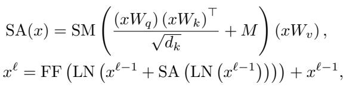
*Equation 9: Equation extracted by MinerU.*

> 💡 **Equation 9 批读**: 这里的公式要按 VisMem 的记忆更新路径读：输入是当前视觉 token、hidden state 或 memory slot，变化是 invocation/formation/consolidation，输出是可再次调用的 latent vision memory。

where we simplify the input sequence to $x$ , and SM, MHA, FF, LN denote the softmax, multi-head self-attention, feedforward layer, layer normalization operations, respectively. In addition, $M$ is the mask which only allows attention from memory query $\mathbf { Q }$ to hidden states $\mathbf { H }$ , and blocks the reverse direction:

> 💡 **批注**: 这段按 VisMem 的动态视觉记忆主线读：模型需要在生成过程中保留细粒度视觉证据，同时把可复用语义经验压缩成长期 latent memory；关键是何时调用、如何更新、是否真的缓解 visual grounding 丢失。

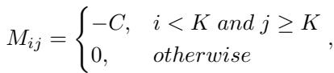
*Equation 10: Equation extracted by MinerU.*

> 💡 **Equation 10 批读**: 这里的公式要按 VisMem 的记忆更新路径读：输入是当前视觉 token、hidden state 或 memory slot，变化是 invocation/formation/consolidation，输出是可再次调用的 latent vision memory。

where $C \gg 0$ is constant, thus the attention is close to $- \infty$

# 7.2. Training Recipe

As mentioned in Sec. 3.4, we design a two-stage training pipeline: at the first stage, the main objective is to optimize the memory formation process (see Eq. (7)); at the second stage, the main objective is to optimize the memory invocation (see Eq. (8)). We update the models based on reinforcement learning, i.e., GRPO strategy [43]. Specifically, for each instruction-vision pair $( I , V )$ , the policy model $\mathcal { P }$ generates a group of $G$ distinct candidate trajectories, termed as $\mathcal { T } = \{ \tau _ { 1 } , \dots , \tau _ { G } \}$ . For each trajectory, we utilize a $S \left( \cdot \right)$ to quantify the performance. Then, a group-relative baseline is calculated via averaging and standardizing all trajectories within the candidate group $G$ :

> 💡 **批注**: 这段按 VisMem 的动态视觉记忆主线读：模型需要在生成过程中保留细粒度视觉证据，同时把可复用语义经验压缩成长期 latent memory；关键是何时调用、如何更新、是否真的缓解 visual grounding 丢失。

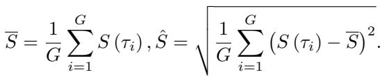
*Equation 11: Equation extracted by MinerU.*

> 💡 **Equation 11 批读**: 这里的公式要按 VisMem 的记忆更新路径读：输入是当前视觉 token、hidden state 或 memory slot，变化是 invocation/formation/consolidation，输出是可再次调用的 latent vision memory。

Consequently, the group-relative advantage of each trajectory could be formulated as:

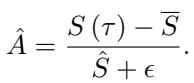
*Equation 12: Equation extracted by MinerU.*

> 💡 **Equation 12 批读**: 这里的公式要按 VisMem 的记忆更新路径读：输入是当前视觉 token、hidden state 或 memory slot，变化是 invocation/formation/consolidation，输出是可再次调用的 latent vision memory。

At the Stage I, the reinforcement learning optimizes the memory formation process, whose final objective function is:

> 💡 **批注**: 这段按 VisMem 的动态视觉记忆主线读：模型需要在生成过程中保留细粒度视觉证据，同时把可复用语义经验压缩成长期 latent memory；关键是何时调用、如何更新、是否真的缓解 visual grounding 丢失。

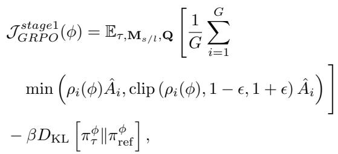
*Equation 13: Equation extracted by MinerU.*

> 💡 **Equation 13 批读**: 这里的公式要按 VisMem 的记忆更新路径读：输入是当前视觉 token、hidden state 或 memory slot，变化是 invocation/formation/consolidation，输出是可再次调用的 latent vision memory。

where $\epsilon$ controls the group-relative advantage ${ \hat { A } } , \beta$ regulates the KL divergence penalty, and the updated policy parameters $\pi ^ { \phi } = \pi ^ { \phi } \left( \mathbf { Q } \mid \mathbf { H } \right) \cdot \pi ^ { \phi } \left( \mathbf { M } _ { s / l } \mid \mathbf { Q } \right)$ .

> 💡 **批注**: 这里对应 Stage II 调用优化，关键不是 reward 写法本身，而是它是否真能把“何时调用、调用哪类记忆”学成可泛化策略，而不是只在训练分布上碰巧有效。

At the Stage $\mathbf { I I }$ , the reinforcement learning optimizes the memory invocation process, whose final objective function is:

> 💡 **批注**: 这段按 VisMem 的动态视觉记忆主线读：模型需要在生成过程中保留细粒度视觉证据，同时把可复用语义经验压缩成长期 latent memory；关键是何时调用、如何更新、是否真的缓解 visual grounding 丢失。

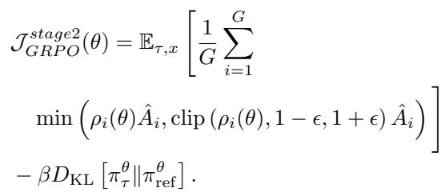
*Equation 14: Equation extracted by MinerU.*

> 💡 **Equation 14 批读**: 这里的公式要按 VisMem 的记忆更新路径读：输入是当前视觉 token、hidden state 或 memory slot，变化是 invocation/formation/consolidation，输出是可再次调用的 latent vision memory。

# 8. Experiment Details

# 8.1. Training Data

During the two-stage training procedure, we use the same training data to optimize both the memory invocation and memory formation in the latent vision memory system. Initially, we include the training split dataset of the selected benchmarks and retain their original data division. For benchmarks without a training phase, we use them solely for evaluation. Additionally, we incorporate the Visual CoT [42] and Mullberry [71], improving the reasoning abilities.

> 💡 **批注**: 这段按 VisMem 的动态视觉记忆主线读：模型需要在生成过程中保留细粒度视觉证据，同时把可复用语义经验压缩成长期 latent memory；关键是何时调用、如何更新、是否真的缓解 visual grounding 丢失。

# 8.2. Benchmarks

To comprehensively evaluate the performance of the selected baselines, we involve 12 benchmarks, consisting of 5 benchmarks of understanding, 4 benchmarks of reasoning, and 3 benchmarks of generation:

> 💡 **批注**: benchmark 列表本身也在支撑 claim。作者故意把理解、推理、生成三类任务都放进来，是为了证明 memory 模块影响的是通用视觉 cognition，而不只是某一种 QA 能力。

LogicVista [67] evaluates general logical cognition abilities across 5 logical reasoning tasks, which encompass 9 distinct capabilities. Each question is annotated with the correct answer and the human-written reasoning behind the selection.

HallBench [19] consists of images paired with questions, designed by human experts to assess the hallucination level of generation.

• MMStar [7] is a high-quality vision-centric benchmark meticulously curated by human experts. This benchmark assesses 6 core capabilities across 18 detailed axes of visual understanding.   
• MMVet [76] establishes 6 core visual understanding capabilities and investigates 16 critical integrations derived from their combinations. It uses an evaluator tailored for open-ended outputs.   
• MMT [73] consists of carefully curated multi-choice visual questions, covering 32 core meta-tasks and 162 subtasks within the field of visual understanding.   
• BLINK [15] reconstructs 14 classic computer vision tasks into multiple-choice questions. Each question is paired with either single or multiple images and supplemented with visual prompting.   
• MuirBench [57] covers 12 diverse multi-image tasks, which involve 10 categories of multi-image relations. Each standard instance is paired with an unanswerable variant that differs only minimally in semantics.   
• MMMU [79] comprises meticulously curated visual questions sourced from college exams, quizzes, and textbooks spanning 30 subjects and 183 subfields, which focus on advanced reasoning grounded in domain-specific knowledge.   
• MathVista [59] unifies the challenges of heterogeneous mathematical and visual tasks, which are curated from math-oriented multimodal datasets.   
• MV-Math [62] is a dataset comprising mathematical problems, integrating multiple images interleaved with text, and detailed annotations. It features multiple-choice, free-form, and multi-step questions across 11 subject areas at 3 difficulty levels.   
• MultiTrust [82] covers five primary aspects: truthfulness, safety, robustness, fairness, and privacy, evaluating the trustworthiness of generation.   
• MMVU [34] encompasses 12 categories, and designs evaluation metrics that measure the quality and error degree of generation.

> 💡 **Benchmark 分组批读**: 这一组 benchmark 条目建议按三类 claim 对齐看：视觉理解是否更稳、复杂推理是否更强、生成类任务是否更不丢 grounding。这样附录不会沦为只是罗列数据集名。

# 8.3. Baselines

We select a total of 16 baselines, including the vanilla model [4], 5 direct training paradigms: SFT, Visual-RFT [35], VLM-R1 [44], Vision-R1 [26], and PAPO [66]; 5 image-level paradigms: Sketchpad [24], GRIT [13], PixelReasoner [48], DeepEyes [87], and OpenThinkImg [49]; 4 token-level paradigms: Scaffold [28], ICoT [16], MINT-CoT [8], and VPT [75]; and 1 latent space paradigm: Mirage [70].

> 💡 **批注**: 这段是 VisMem 主线：关注视觉证据如何在 VLM 长生成中被短期感知记忆保留、被长期语义记忆压缩，并在推理时重新注入 hidden stream。

Here, VLM-R1 [44] and Vision-R1 [26] follow the main GRPO [20] paradigm based on VLMs. To assess the effectiveness of different methods, our VisMem is trained on Qwen-2.5-VL-7B [4]. For strategies initially implemented on other base models, e.g., GPT-4o [27] and Qwen2- VL [60], we transfer them to Qwen2.5-VL-7B [4] for fair comparison. Besides, we maintain identical training datasets across most counterparts; however, for those three methods with specially curated datasets, we follow their original settings. Namely, Mirage [70] requires additional labeled training images, so we follow its original training dataset; GRIT [13] uses a tailored training process with designed data; and MINT-CoT [8] curates high-quality mathematical samples with grids and annotations.

> 💡 **批注**: 这段按 VisMem 的动态视觉记忆主线读：模型需要在生成过程中保留细粒度视觉证据，同时把可复用语义经验压缩成长期 latent memory；关键是何时调用、如何更新、是否真的缓解 visual grounding 丢失。

# 8.4. Implementations

The configurations and implementations of the experiments include three main parts: the core hyperparameters, the parameters of the LoRA adapter, and the parameters we use during training. The configurations and implementations of the experiments are listed in Tab. 4.

> 💡 **批注**: implementation 表的重要性在于复现 memory 成本边界。VisMem 如果只能靠超大 memory 长度或极重训练日程取胜，方法价值会大幅下降；附录超参正是用来排除这种疑问。

# 9. Additional Results

# 9.1. Benchmark Subset Results towards Visual Subcapacities

To precisely identify the capability boundaries and advantages of our VisMem, rather than relying solely on overall scores to judge its quality, we evaluate the results of subsets of MuirBench [57] and LogicVista [67] benchmarks. We select 9 subsets of the former benchmark, including: counting, grounding, matching, scene, difference, cartoon, diagram, geographic, and retrieval. While in the latter benchmark, we also select 10 subsets, including 5 reasoning skills: inductive, deductive, numerical, spatial, and mechanical, and 5 capacities: patterns, puzzles, OCR, graphs, and tables. It is worth noting that the selected subsets are only part of the benchmark, thus, the average values of the 10 subsets are not the results of the benchmarks.

> 💡 **批注**: 这段按 VisMem 的动态视觉记忆主线读：模型需要在生成过程中保留细粒度视觉证据，同时把可复用语义经验压缩成长期 latent memory；关键是何时调用、如何更新、是否真的缓解 visual grounding 丢失。

Table 4. Configurations of parameters.

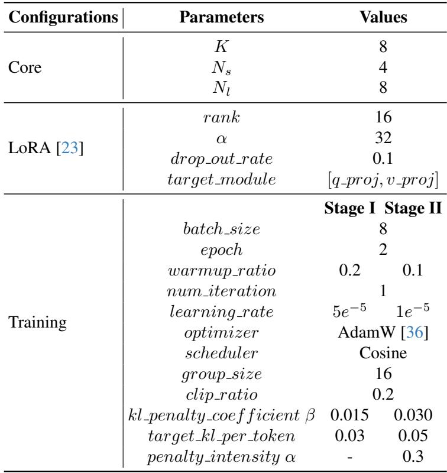
*Table 4.: Table 4. Configurations of parameters.*

> 💡 **Table 4. 批读**: 表格要看主指标、次指标与效率/鲁棒性是否一致支持论文 claim。

Table 5. Results on 9 selected subsets of MuirBench [57]. We compare our VisMem with the second and third best scored counterparts, and separately use the short or long latent memory to assess the improvements of each.

> 💡 **批注**: 这段按 VisMem 的动态视觉记忆主线读：模型需要在生成过程中保留细粒度视觉证据，同时把可复用语义经验压缩成长期 latent memory；关键是何时调用、如何更新、是否真的缓解 visual grounding 丢失。

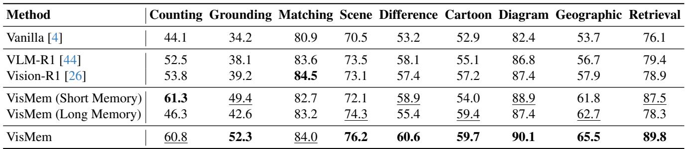
*Table 5.: Table 5. Results on 9 selected subsets of MuirBench [57]. We compare our VisMem with the second and third best scored counterparts, and separately use the short or long latent memory to assess the improvements of each.*

> 💡 **Table 5. 批读**: 表格要看主指标、次指标与效率/鲁棒性是否一致支持论文 claim。

As listed in Tab. 5, compared with VLM-R1 [44] and Vision-R1 [26], our VisMem achieves the best results on 7 subsets and ranks second on the remaining two subsets. Specifically, it has a generalized enhancement of at least $5 \%$ over the base model. Besides, VisMem improves the performance the vanilla model by $1 6 . 7 \% / 1 8 . 2 \% / 1 1 . 8 \% / 1 3 . 7 \%$ on the counting, grounding, geographic, and retrieval subtasks, vastly exceeding the second-best counterpart by 7.0- $1 3 . 1 \%$ . These results indicate that our latent vision memory system significantly promote the fine-grained visual cognition and perception of the base VLMs.

> 💡 **批注**: 这段按 VisMem 的动态视觉记忆主线读：模型需要在生成过程中保留细粒度视觉证据，同时把可复用语义经验压缩成长期 latent memory；关键是何时调用、如何更新、是否真的缓解 visual grounding 丢失。

As presented in Tab. 6, our VisMem outperforms two baseline models, i.e., VLM-R1 [44] and Vision-R1 [26], by achieving the top performance across 8 subsets. Specifically, it delivers a generalized improvement of no less than $7 \%$ over the base model. Notably, on inductive, deductive, graph-based, and table-based sub-tasks, VisMem surpasses the vanilla model by $1 4 . 8 \%$ , $1 4 . 8 \%$ , $1 8 . 4 \%$ , and $2 1 . 1 \%$ , respectively, which exceeds the second-ranked model by a substantial margin of $5 . 3 \mathrm { - } 7 . 1 \%$ . These results demonstrate that our latent visual memory system delivers contextualized semantic knowledge, thereby enhancing visual reasoning and robust generation capabilities.

> 💡 **批注**: 这段按 VisMem 的动态视觉记忆主线读：模型需要在生成过程中保留细粒度视觉证据，同时把可复用语义经验压缩成长期 latent memory；关键是何时调用、如何更新、是否真的缓解 visual grounding 丢失。

Table 6. Results on 10 selected subsets (5 reasoning skills and 5 capabilities) of LogicVista [67]. We compare our VisMem with the second and third best scored counterparts, and separately use the short or long latent memory to assess the improvements of each.

> 💡 **批注**: 这段按 VisMem 的动态视觉记忆主线读：模型需要在生成过程中保留细粒度视觉证据，同时把可复用语义经验压缩成长期 latent memory；关键是何时调用、如何更新、是否真的缓解 visual grounding 丢失。

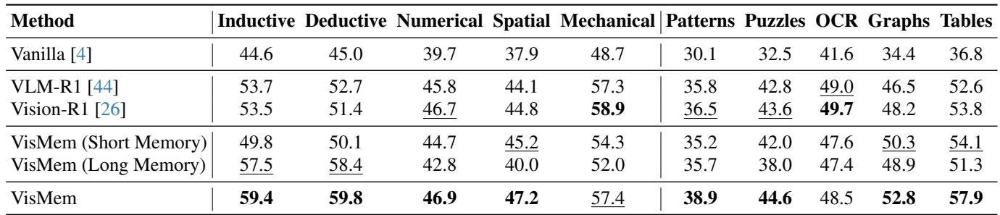
*Table 6.: Table 6. Results on 10 selected subsets (5 reasoning skills and 5 capabilities) of LogicVista [67]. We compare our VisMem with the second and third best scored counterparts, and separately use the short or long latent memory to assess the improvements of each.*

> 💡 **Table 6. 批读**: 表格要看主指标、次指标与效率/鲁棒性是否一致支持论文 claim。

# 9.2. Cross-domain Generalization

To evaluate the cross-domain generalization capability of our model, we train it exclusively on general datasets, namely, Visual CoT [42] and Mullberry [71]), to verify whether latent visual memory can be transferred to unseen domains. As shown in Tab. 7 and Fig. 7, our method demonstrates superior performance, which exhibits a smaller performance drop than the fully trained model across all four selected benchmarks, confirming strong cross-domain generalization. Despite being trained on only two datasets, our method achieves a significant performance improvement of $9 . 1 - 2 0 . 5 \%$ across the four benchmarks, with a mere $2 \%$ performance gap relative to the fully trained model. When compared to other baselines, it still maintains a performance lead of $3 . 4 \% / 6 . 7 \% / 2 . 7 \% / 4 . 7 \%$ across the four evaluations, respectively.

> 💡 **批注**: 这段按 VisMem 的动态视觉记忆主线读：模型需要在生成过程中保留细粒度视觉证据，同时把可复用语义经验压缩成长期 latent memory；关键是何时调用、如何更新、是否真的缓解 visual grounding 丢失。

In general, the image-level, token-level, and latent space paradigms suffer from smaller performance degradation, whereas the direct training paradigm exhibits inferior generalization ability. For example, VLM-R1 [44] experiences a $5 . 3 \%$ performance drop; by contrast, this value is only $2 . 1 \%$ for OpenThinkImg [49], $1 . 1 \%$ for MINT-CoT [8], and $2 . 3 \%$ for our method. These results indicate that while direct training optimizations notably improve performance on specific tasks, they compromise generalization ability to some extent.

# 9.3. Catastrophic Forgetting Mitigation

To assess the extent of catastrophic forgetting, we conducted continual learning experiments with our VisMem and other baselines. As presented in Tab. 8 and Fig. 8, our method effectively mitigates forgetting of earlier tasks. It consistently achieves the best performance at each stage, demonstrating strong robustness against catastrophic forgetting. Following four-stage sequential continual training, it retains $7 2 . 1 \%$ performance on MMVet [76], outperforming $6 8 . 4 \%$ of DeepEyes [87] and $6 7 . 0 \%$ of Mirage [70].

> 💡 **批注**: catastrophic forgetting 这段是 VisMem 区别于一般 latent adapter 的关键证据。如果 memory 真是可复用视觉经验载体，它应当在连续学习里优于直接改主干参数的做法。

While the direct training paradigm significantly improves performance on specific tasks, it adapts to new tasks via direct updates to core parameters. This introduces conflicts when parameter update directions contradict the storage of existing knowledge, compounded by a lack of constraints from prior knowledge. Consequently, in stage 3, the performance of most direct training methods even falls below that of the vanilla model. In contrast, methods such as OpenThinkImg [49] and our proposed VisMem exhibit stronger knowledge retention and forward transfer capabilities. For instance, in stage 3, training on additional datasets further improves their performance on MMVet [76].

> 💡 **批注**: 这段是 VisMem 主线：关注视觉证据如何在 VLM 长生成中被短期感知记忆保留、被长期语义记忆压缩，并在推理时重新注入 hidden stream。

# 9.4. Versatility across Various Base Models

As presented in Tab. 2 and Fig. 11, we incorporate our latent visual memory paradigm into 9 base models, including Qwen2.5-VL-3B/7B/32B [4], LLaVA-OV-1.5-4B/8B [1], and InternVL-3.5-4B/8B/14B/38B [63]. Our VisMem consistently enhances the visual capabilities of all base models, spanning 3B to 38B parameter sizes across three VLM families. For the widely used medium-sized models (i.e., 7B or 8B parameter models), our latent visual memory delivers substantial performance gains, which brings a $6 . 3 \substack { - 2 3 . 1 \% }$ improvement across all benchmarks for Qwen2.5-VL-7B [4], a $5 . 5 \substack { - 2 0 . 2 \% }$ improvement for LLaVA-OV-1.5-8B [1], and a $4 . 8 \mathrm { - } 1 7 . 6 \%$ improvement for InternVL-3.5-8B [63], respectively.

> 💡 **批注**: 这段按 VisMem 的动态视觉记忆主线读：模型需要在生成过程中保留细粒度视觉证据，同时把可复用语义经验压缩成长期 latent memory；关键是何时调用、如何更新、是否真的缓解 visual grounding 丢失。

Furthermore, in most benchmarks, smaller-parameter base models yield greater performance gains than their medium- or large-sized counterparts. This phenomenon may stem from an imbalance in task difficulty, which makes it more challenging for models with higher baseline scores to achieve further improvements. In contrast, larger models exhibit more significant gains in dense reasoning benchmarks: the integration of latent visual memory overcomes bottlenecks in visual reasoning by providing fine-grained visual evidence and semantic knowledge. Notably, this model-agnostic approach, independent of specific model architectures or structures, bolsters the prospects for broad practical application.

> 💡 **批注**: 这段按 VisMem 的动态视觉记忆主线读：模型需要在生成过程中保留细粒度视觉证据，同时把可复用语义经验压缩成长期 latent memory；关键是何时调用、如何更新、是否真的缓解 visual grounding 丢失。

Table 7. Results of various models with full training datasets and partial datasets (Visual CoT [42] and Mulberry [71]), and evaluated across four benchmarks.

> 💡 **批注**: 这段是 VisMem 主线：关注视觉证据如何在 VLM 长生成中被短期感知记忆保留、被长期语义记忆压缩，并在推理时重新注入 hidden stream。

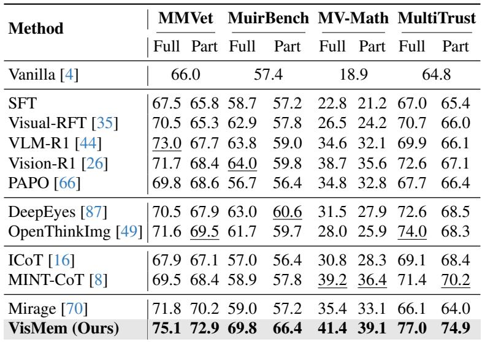
*Table 7.: Table 7. Results of various models with full training datasets and partial datasets (Visual CoT [42] and Mulberry [71]), and evaluated across four benchmarks.*

> 💡 **Table 7. 批读**: 表格要看主指标、次指标与效率/鲁棒性是否一致支持论文 claim。

Table 8. Results of various models on MMVet [76] with four-stage continual learning. Stage 0: MMVet [76]; Stage 1: BLINK [15], and MuirBench [57]; Stage 2: LogicVista [67], and Math-V [59]; Stage 3: MultiTrust [82], and MMVU [34].

> 💡 **批注**: 这段是 VisMem 主线：关注视觉证据如何在 VLM 长生成中被短期感知记忆保留、被长期语义记忆压缩，并在推理时重新注入 hidden stream。

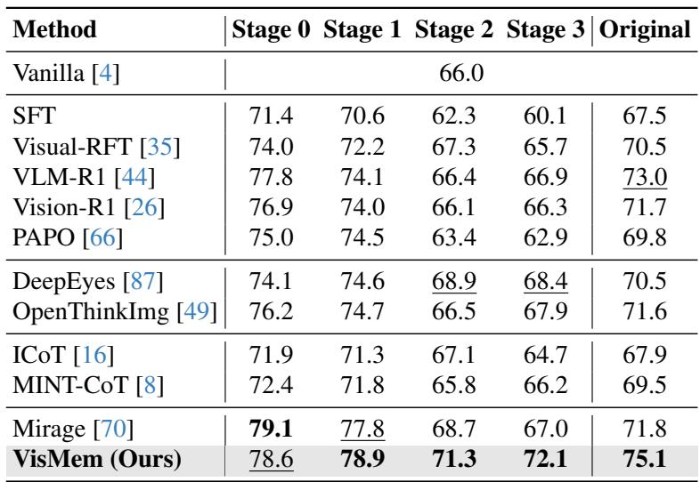
*Table 8.: Table 8. Results of various models on MMVet [76] with four-stage continual learning. Stage 0: MMVet [76]; Stage 1: BLINK [15], and MuirBench [57]; Stage 2: LogicVista [67], and Math-V [59]; Stage 3: MultiTrust [82], and MMVU [34].*

> 💡 **Table 8. 批读**: 表格要看主指标、次指标与效率/鲁棒性是否一致支持论文 claim。

# 9.5. Ablation Study

The vanilla model establishes a baseline characterized by the shortest inference time and highest speed across all benchmarks, yet exhibits the lowest performance. This confirms that latent vision memory is indispensable for enhancing task performance. For the random memory invocation variants, increasing the invocation probability $( 2 5 \% - 1 0 0 \% )$ results in longer inference time and reduced speed. Performance peaks at a $7 5 \%$ probability before declining, indicating that excessive memory invocation impairs efficiency without yielding additional performance benefits. Ablation studies of the short-term and long-term memory components reveal task-specific advantages: the short-term memory component outperforms on MuirBench [57] and MultiTrust [82], while the long-term component demonstrates superior performance on MV-Math [62]. Notably, the complete VisMem framework achieves the highest performance across all benchmarks, validating the value of integrating dual-component vision memory for balanced and robust visual capacities.

> 💡 **批注**: 这段按 VisMem 的动态视觉记忆主线读：模型需要在生成过程中保留细粒度视觉证据，同时把可复用语义经验压缩成长期 latent memory；关键是何时调用、如何更新、是否真的缓解 visual grounding 丢失。

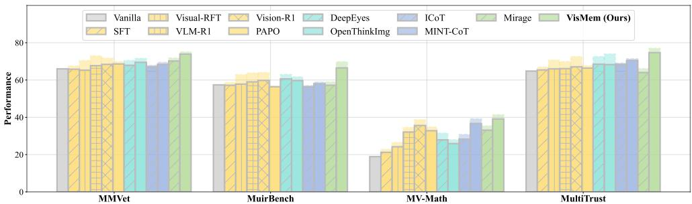
*Figure 7.: Figure 7. Results of various models of the cross-domain generalization study. Models are only trained on Visual CoT [42] and Mulberry [71], and are evaluated on four benchmarks.*

> 💡 **Figure 7. 批读**: 这张图要结合 VisMem 的记忆机制读：看它是在说明短期/长期 memory 的结构、invocation/formation 的流程，还是在展示 grounding 保持、消融和泛化效果。

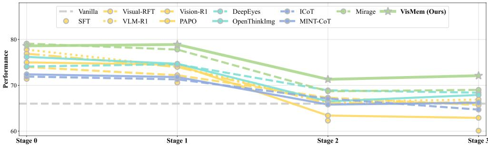
*Figure 8.: Figure 8. Results of four-stage continual learning on MMVet [76]. The model is sequentially trained on each training data combination (Stage $0 $ Stage $1 $ Stage $2  \mathrm { S t a g e } 3$ ). Stage 0 only includes MMVet [76] as training data, while Stage 1, 2, 3 add data targeting visual understanding [15, 57], reasoning [59, 67], and generation [34, 82].*

> 💡 **Figure 8. 批读**: 这张图要结合 VisMem 的记忆机制读：看它是在说明短期/长期 memory 的结构、invocation/formation 的流程，还是在展示 grounding 保持、消融和泛化效果。

Table 9. Ablations of latent vision memory invocation and dual vision memory formation. Following [81], “Random Invocation” denotes that the latent memory is inserted into the output sequence with a certain probability when outputting delimiter symbol tokens, and short or long latent memory is inserted with equal probability. When only utilizing short or long latent memory, we directly skip the formation of the specific memory if invocation tokens are predicted and continue the process of decoding.

> 💡 **批注**: 这段按 VisMem 的动态视觉记忆主线读：模型需要在生成过程中保留细粒度视觉证据，同时把可复用语义经验压缩成长期 latent memory；关键是何时调用、如何更新、是否真的缓解 visual grounding 丢失。

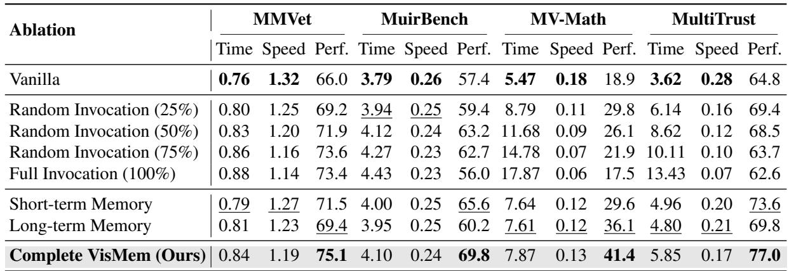
*Table extracted: Table extracted by MinerU. Ablation MMVet MuirBench MV-Math MultiTrust Time Speed Perf. Time Speed Perf. Time Speed Perf. Time Speed Perf. Vanilla 0.76 1.32 66.0 3.79 0.26 57.4 5.47 0.18 18.9 3.62 0.28 64.8*

> 💡 **Table extracted 批读**: 表格要看主指标、次指标与效率/鲁棒性是否一致支持论文 claim。

# 9.6. Analysis of Latent Vision Memory

We visualize the invocation ratio and relative invocation position, as presented in Fig. 5 and 9: the former illustrates benchmark-specific differences between the two memory components, while the latter depicts type-specific variations across the four benchmarks. In addition, as reported in Tab. 5 and 6, the short- and long-term latent visual memory components exhibit task-specific advantages for different visual sub-tasks. For instance, the short-term memory provides supplementary visual information to support enhanced visual understanding, such as counting, grounding, and visual retrieval. By contrast, the long-term memory encodes contextualized semantic knowledge, which strengthens complex visual reasoning. These results reveal that our proposed VisMem dynamically adjusts invocation position and frequency according to task characteristics, thereby balancing efficiency and performance.

> 💡 **批注**: 这段按 VisMem 的动态视觉记忆主线读：模型需要在生成过程中保留细粒度视觉证据，同时把可复用语义经验压缩成长期 latent memory；关键是何时调用、如何更新、是否真的缓解 visual grounding 丢失。

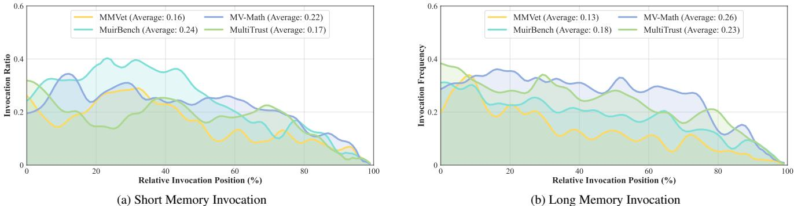
*Figure 9.: Figure 9. Results of memory invocation ratio and relative position across four benchmarks. The former denotes the proportion of invoked samples to all samples, while the relative position denotes the position in the whole output sequence when the invocation occurred. We apply gaussian smoothing to the curves to highlight their main trends.*

> 💡 **Figure 9. 批读**: 这张图要结合 VisMem 的记忆机制读：看它是在说明短期/长期 memory 的结构、invocation/formation 的流程，还是在展示 grounding 保持、消融和泛化效果。

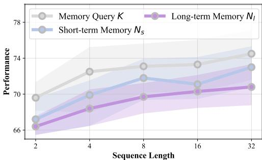
*Figure 10.: Figure 10. Results of sensitivity analysis on the sequence length of memory query $K$ , short- and long-term memory $N _ { s }$ and $N _ { l }$ .*

> 💡 **Figure 10. 批读**: 这张图要结合 VisMem 的记忆机制读：看它是在说明短期/长期 memory 的结构、invocation/formation 的流程，还是在展示 grounding 保持、消融和泛化效果。

Table 10. Results of different length of memory query $K$ .

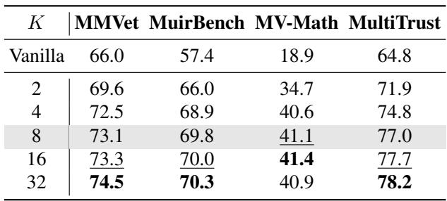
*Table 10.: Table 10. Results of different length of memory query $K$ .*

> 💡 **Table 10. 批读**: 表格要看主指标、次指标与效率/鲁棒性是否一致支持论文 claim。

# 9.7. Sensitive Analysis of Sequence Lengths

We conduct an analysis on MMVet [76] focused on the lengths of three key sequences: the memory query $K$ , the short-term latent visual memory $N _ { s }$ , and the long-term latent visual memory $N _ { l }$ . It is observed that as the lengths of these three sequences increase from 2 to 32, model performance improves accordingly, but this is accompanied by increased computational costs.

> 💡 **批注**: 这段按 VisMem 的动态视觉记忆主线读：模型需要在生成过程中保留细粒度视觉证据，同时把可复用语义经验压缩成长期 latent memory；关键是何时调用、如何更新、是否真的缓解 visual grounding 丢失。

Table 11. Results of different length of short latent vision memory $N _ { s }$ and the length of long latent vision memory $N _ { l }$ across four benchmarks.

> 💡 **批注**: 这段按 VisMem 的动态视觉记忆主线读：模型需要在生成过程中保留细粒度视觉证据，同时把可复用语义经验压缩成长期 latent memory；关键是何时调用、如何更新、是否真的缓解 visual grounding 丢失。

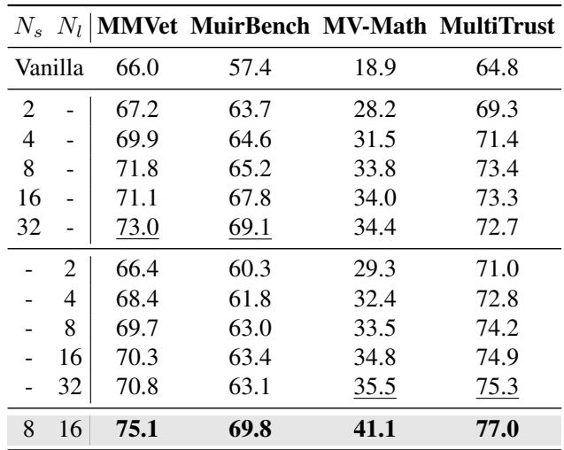
*Table 11.: Table 11. Results of different length of short latent vision memory $N _ { s }$ and the length of long latent vision memory $N _ { l }$ across four benchmarks.*

> 💡 **Table 11. 批读**: 表格要看主指标、次指标与效率/鲁棒性是否一致支持论文 claim。

# 9.8. Inference Efficiency

As presented in Tab. 12 and the bubble plots in Fig. 6, we compare the average inference time, average inference speed, and task performance across the four benchmarks. Our approach achieves an optimal performance-efficiency balance, with minimal additional time overhead. For instance, image-level paradigms exhibit nearly twice the inference time of the vanilla model, resulting in significant latency and substantial inference overhead. In contrast, our VisMem introduces only controllable computational latency increments, ranging from $8 . 2 \%$ to $4 3 . 8 \%$ relative to the vanilla model, which are on par with those of other direct training and token-level paradigms.

> 💡 **批注**: 这段是 VisMem 主线：关注视觉证据如何在 VLM 长生成中被短期感知记忆保留、被长期语义记忆压缩，并在推理时重新注入 hidden stream。

Table 12. Average inference time per sample (seconds), average inference speed (samples / seconds), and task performances across four benchmarks on various methods. Perf. indicates Performance.

> 💡 **批注**: 这里的效率表最能回答“memory 值不值”。如果性能增益只能靠显著更慢的推理换来，VisMem 就更像重计算而不是 smarter memory；作者因此必须同时报时间、速度和任务表现。

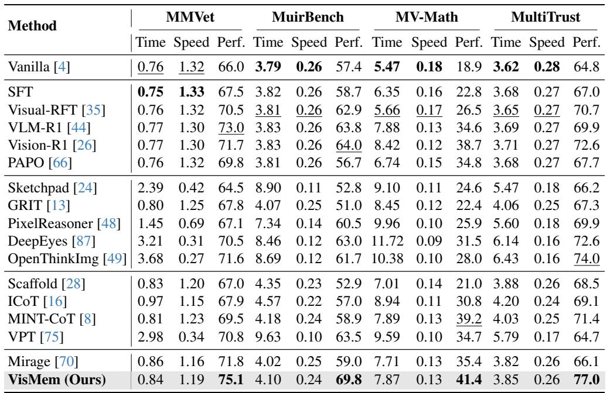
*Table 12.: Table 12. Average inference time per sample (seconds), average inference speed (samples / seconds), and task performances across four benchmarks on various methods. Perf. indicates Performance.*

> 💡 **Table 12. 批读**: 表格要看主指标、次指标与效率/鲁棒性是否一致支持论文 claim。

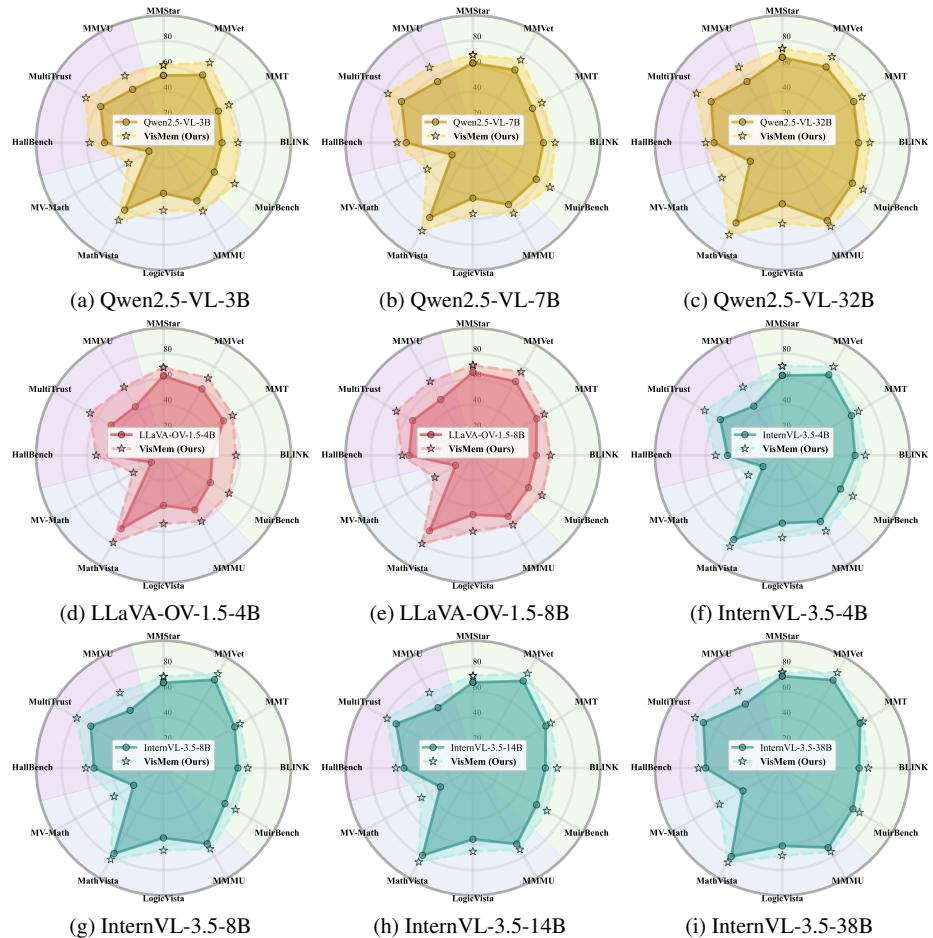
*Figure 11.: Figure 11. Results on different base models.*

> 💡 **Figure 11. 批读**: 这张图要结合 VisMem 的记忆机制读：看它是在说明短期/长期 memory 的结构、invocation/formation 的流程，还是在展示 grounding 保持、消融和泛化效果。

---

## 🔖 Section 总结

### 核心洞察
1. 本节精读重点：把 VisMem 的短期视觉保留、长期语义巩固、推理时调用和实验消融联系起来看，判断它是否真正缓解 visual grounding 丢失。
2. 阅读重点是把本节的机制/证据映射到论文主 claim。
3. 后续如有疑问，可在本 section 继续补充更细批注。
