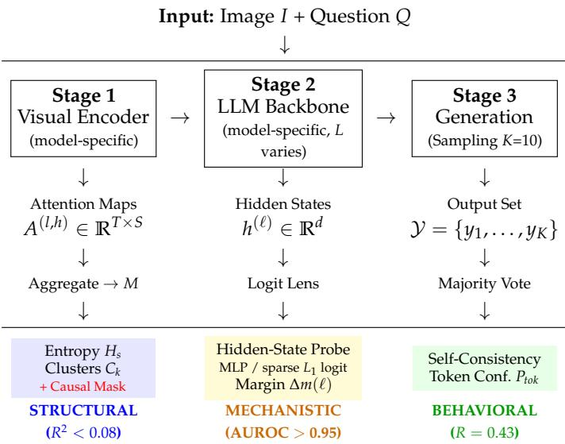

# 3 Methodology

[← 返回 README](../README.md)

---

We introduce VLM Reliability Probe (VRP), a comprehensive analysis pipeline designed to extract, quantify and correlate the internal state of the model with the correctness of the output (Figure 1). Our primary investigative goal is to disentangle two competing hypotheses regarding VLM reliability:

*Figure 1: VLM Reliability Probe (VRP) Framework. We instrument three computational stages: Stage 1 extracts cross-attention maps from the visual encoder, yielding Structural metrics (entropy H_s, clusters C_k); we aggregate A^{(l,h)} by averaging over heads and answer-token positions to form one per-layer spatial vector in R^S. Stage 2 probes hidden states via logit lens plus dense MLP and sparse L1-logistic probe variants, providing Mechanistic signals; Stage 3 samples K=10 outputs for Behavioral metrics (self-consistency). Key finding: Structural metrics fail (R^2 < 0.08), while Mechanistic probes succeed (AUROC > 0.95). Red indicates causal intervention points.*

> 💡 **Figure 1 批读 — VRP框架的三阶段架构**:
> 这张图是全文的方法论骨架，呈现了从浅层到深层的三层递进分析策略：
> - **Stage 1 (Structural):** 提取视觉编码器的交叉注意力图，计算空间熵(H_s)、聚类数(C_k)和注意力演化(ΔH_s)。这些是"传统"的可解释性指标——告诉你看哪里。
> - **Stage 2 (Mechanistic):** 通过Logit Lens将隐藏状态投影到词表空间，计算Truth Margin (ΔM_l)，训练密集MLP探针和稀疏L1逻辑回归探针。这是本文的核心方法贡献——探测内部状态中的可信度信号。
> - **Stage 3 (Behavioral):** 通过核采样(p=0.9, T=0.7)生成K=10条推理路径，计算Self-Consistency（一致率）。这是最强的行为信号但代价最高。
> - 红色标记是因果干预点——通过神经元消融验证哪些内部组件真正驱动了可信度。
> - 关键发现直接标注在图上：Structural metrics fail, Mechanistic probes succeed。

### Our findings reveal a disconnect:

1. **Visuals Lie:** The spatial structure of attention (entropy, clustering, focus) has almost no statistical relationship with correctness (R ≈ 0). A model can hallucinate while attending to the right region, or answer correctly with diffuse attention.

2. **Consistency Speaks:** The most reliable behavioral signal of truth is not found in pixel-space attention, but rather in the stability of linguistic generation. Self-Consistency Wang et al. (2022) outperforms all visual metrics, achieving R = 0.429.

3. **Causal Architectures Diverge:** Hidden-state representations house the most powerful predictive indicators (AUROC > 0.95). Crucially, massive scaling of neural ablations proves reliability paths are architecturally dependent. LLaVA centralizes truth in a sparse, fragile late-stage bottleneck, while PaliGemma and Qwen2-VL dynamically distribute these functions, remaining computationally robust even when ~ 50% or more of their most predictive subnetwork is bypassed.

> 💡 **机制拆解 — 两个竞争假设**:
> - **Structural Hypothesis (结构假设):** 可信度扎根于视觉编码器的空间注意力一致性。如果这个假设成立，那么H_s（空间熵）应该与正确性显著负相关，C_k（集群数）应该与正确性显著正相关。
> - **Consistency Hypothesis (一致性假设):** 可信度是生成动力学和潜在语言稳定性的产物。如果这个假设成立，那么Self-Consistency和隐藏状态探针应该显著优于注意力指标。
> 实验设计本质上是一个假设检验——用同一个数据集同时检验两个假设，看哪个预测能力更强。

> 💡 **Q&A 批注记录**:
> *Q: 为什么只选这三个模型进行跨架构分析？它们各自的代表意义是什么？*
> A: (1) LLaVA代表prefix-based架构——视觉token作为语言模型的前缀，是目前最广泛使用的VLM范式；(2) PaliGemma代表Google系的早期融合架构——视觉在浅层就开始与语言交互；(3) Qwen2-VL代表原生多模态架构——视觉和语言token交错排列。这三个选择覆盖了从"后期注入视觉"到"早期深度融合"的完整光谱。作者还提到仅使用中等规模开源模型（未涉及GPT-4V等闭源API），这是一个明确的限制。

## 3.1 Method Summary (Main Text)

We instrument VLMs with forward hooks to capture cross-attention maps and hidden states during generation, then compare structural signals (C_k, H_s) against linguistic/mechanistic signals (self-consistency, token confidence, and learned probe scores from dense MLP and sparse L1-logistic variants). In the main paper, we focus on the core reliability findings and cross-model comparisons.

> 💡 **公式批读 — 结构指标的数学定义**:
> - **空间熵 H_s**: 对每个注意力头、每个答案token位置的空间注意力向量，计算信息熵 H_s = -Σ p_i log(p_i)。高熵=注意力分散，低熵=注意力聚焦。
> - **集群数 C_k**: 取top-30%注意力质量的二值掩码，在patch网格上计算连通分量数。C_k = K_total - 1（去除主导分量后的次要分量数）。C_k = 0表示只有一个主导焦点，越大表示注意力越分散。
> - **注意力演化 ΔH_s**: 逐层追踪空间熵的变化，ΔH_s = H_s^{(l)} - H_s^{(l-1)}。正值表示注意力在扩散，负值表示注意力在锐化。

---

**📌 Preview:** 方法论部分建立了VRP框架，该框架通过前向钩子同时采集三种信号（结构、机制、行为），为后续实验提供了统一的评估基础设施。关键设计在于：不对模型做任何修改，仅通过"外部探测"来评估内部状态。

**🔖 Summary:** VRP是一个三阶段的分析管线：(1) Stage 1从视觉编码器提取结构指标（空间熵、聚类数）用于检验Structural Hypothesis；(2) Stage 2通过Logit Lens和探针提取机制信号用于检测隐藏状态中的可信度；(3) Stage 3通过Self-Consistency提取行为信号作为可靠性金标准。框架的核心优势在于统一了不同层次信号的比较基准。
