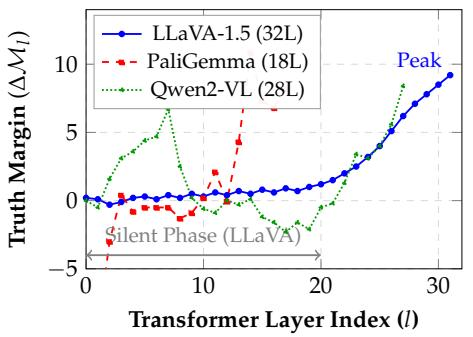
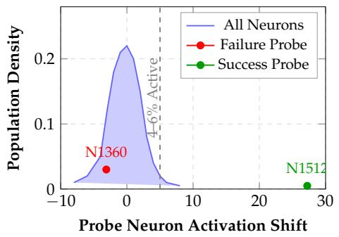
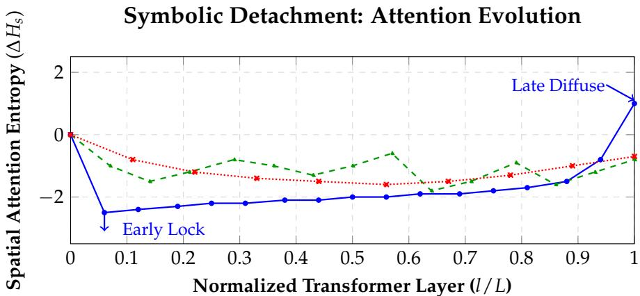
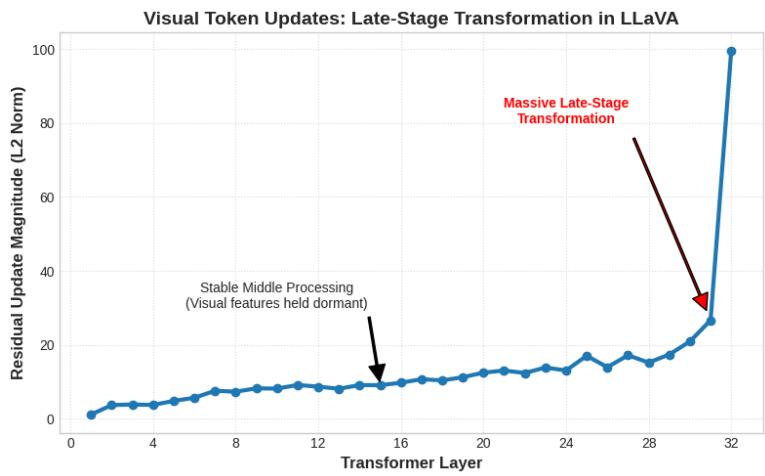
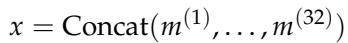
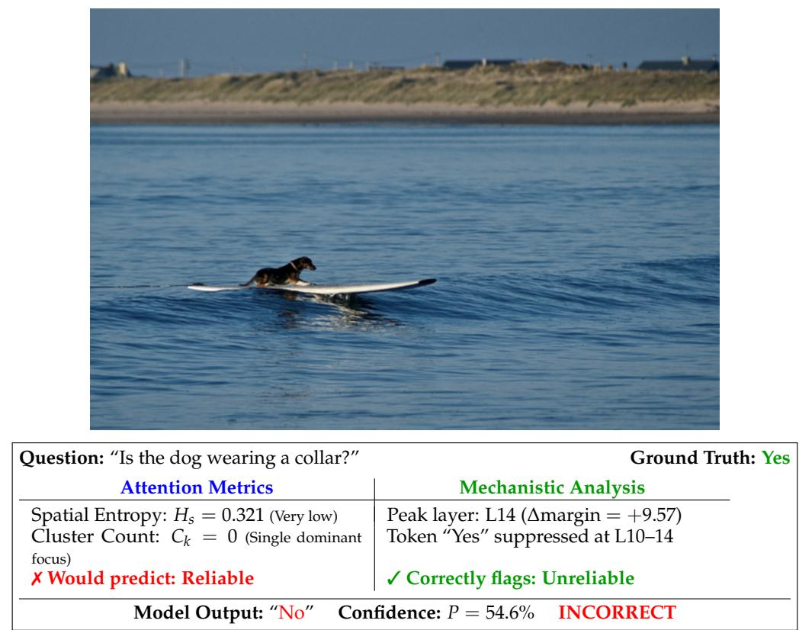

# 4 Experiments & Results

[← 返回 README](../README.md)

---

## 4 Experimental Setup

We evaluate LLaVA-1.5-7B, PaliGemma-3B, and Qwen2-VL-7B Liu et al. (2023); Beyer et al. (2024); Wang et al. (2024) across POPE Li et al. (2023b) (Adversarial split, 1,000 samples), LLaVA-Bench Zhou et al. (2023) (90 open-ended questions), custom counting/spatial tasks, and the new VQA v2 and TextVQA evaluations. This setup allows us to compare reliability behavior on hallucination stress tests, open-ended reasoning, scene understanding, and OCR-heavy question answering using correlation and AUROC metrics; it is complementary to broader multimodal suites such as MME Fu et al. (2023), SEED-Bench Li et al. (2023a), and MM-Vet Yu et al. (2023). We provide sample accounting and uncertainty intervals for headline claims in Table 4.

> 💡 **机制拆解 — 实验设计解读**: 数据集的选择覆盖了四个维度：
> 1. **POPE (Adversarial)**: 专门设计用于压力测试对象幻觉，对抗性负样本使模型难以通过语言先验猜测
> 2. **LLaVA-Bench**: 开放式推理问题，测试复杂场景下的理解能力
> 3. **Custom Counting & Spatial**: 自建数据集，精确控制计数和空间关系标签
> 4. **VQA v2 & TextVQA**: 泛化测试，场景理解和OCR密集型问题

**Table 1: Cross-Model Summary I: Reliability and attention structure. Visual attention metrics remain near-random predictors of correctness across all model families.**

| Model | Model Accuracy | Top-K Attention R^2 (max) | Supervised Classifier Acc |
|-------|---------------|--------------------------|--------------------------|
| LLaVA-1.5-7B | 67.6% | 0.008 | 53.0% |
| PaliGemma-3B | 78.6% | 0.080 | 55.0% |
| Qwen2-VL-7B | 28.8% | 0.007 | 52.0% |

> 💡 **Table 1 批读**: 
> - R^2 值都 ≤ 0.08，意味着即使是最优的Top-K注意力指标也只能解释不到8%的正确性方差
> - 监督分类器（XGBoost-Random Forest集成，11个注意力衍生特征+多项式交互）准确率仅52-55%，接近随机（三分类随机=33%，但这似乎是二分类，所以接近50%的随机基线）
> - Qwen2-VL的28.8%准确率极低（POPE上），这暗示该模型在对象存在性判断上存在严重偏差

## 5 Results

We present empirical evaluation across three VLMs: LLaVA-1.5-7B, PaliGemma-3B, and Qwen2-VL-7B. Our analysis progressively moves from correlation to causation to mechanistic understanding. Tables 1-3 summarize key findings; extended results are in Appendix A.3. Table 1 reports reliability and attention-structure failures, Table 2 summarizes layer-wise logit-lens dynamics, and Table 3 reports benchmark-level reliability prediction.

### 5.1 Visual Attention Does Not Predict Reliability

**Core Finding:** Spatial attention metrics show near-zero correlation with correctness. On the pooled 3,090-sample structural-analysis set (Table 4), cluster count (C_k) achieves R = 0.001 (95% CI: [-0.034, 0.036]) and spatial entropy (H_s) achieves R = -0.012 (95% CI: [-0.047, 0.024]), both statistically indistinguishable from random noise (p > 0.05). This "Cluster Failure" persists regardless of attention head selection: even when filtering to the top-k heads by logit contribution, R^2 ≤ 0.08 (Table 1).

> 💡 **机制拆解 — Cluster Failure 深度解读**: 
> 这篇论文最核心的实证发现。95%置信区间跨越零值，p > 0.05，说明在统计意义上，空间注意力结构和正确性之间没有任何可靠的关系。这不是"相关性弱"，而是"完全不相关"。想象一下：你拿着放大镜仔细观察一幅画，然后让别人复述画中的内容——别人复述的正确与否与你放大镜聚焦的位置几乎无关。

> 💡 **消融解读 — Attention Head Selection的影响**:
> 作者专门做了Top-K注意力头筛选（按logit贡献排序），以排除"可能只有某些头编码了可信度"的可能性。即使只保留最有贡献的头，R^2仍然 ≤ 0.08。这是对Structural Hypothesis的彻底证伪。

We conducted a supervised stress test to close potential loopholes: on the pooled cross-family split used in this section, an XGBoost-Random Forest ensemble trained on 11 attention-derived features (including polynomial interactions) with full access to ground-truth labels achieved only 52-55% accuracy, which is near chance. In a separate architecture-specific setting (Appendix Table 8), a deeper supervised attention probe reaches AUROC 0.725, indicating limited but non-dominant signal from attention structure.

> 💡 **消融解读 — 监督压力测试的设计智慧**:
> "如果无监督指标(entropy, cluster count)不行，那给一个非线性模型充分的训练数据和标签，它能从注意力中学到可信度吗？"答案仍然是几乎不能（52-55%）。这排除了"指标选错了"的可能性——即使最优的非线性模型也无法从注意力模式中提取可信度信号。
> 附录中的Ensemble Attention Probe达到了AUROC 0.725，看似有信号。但注意：(1) 它用的是跨所有32层的注意力向量拼接（18,432维），远超简单指标的信息量；(2) 它仍远低于Self-Consistency的0.784和Hidden-State Probe的0.956。

**Causal Role:** Despite correlation failure, attention is causally necessary. Masking the top 30% attended patches reduces LLaVA accuracy by 8.2pp and PaliGemma by 11.3pp (p < 0.001). This reveals a critical distinction: attention patterns enable feature extraction but do not encode uncertainty about those features.

> 💡 **机制拆解 — 因果必要性与预测能力的分离**:
> 这是一个非常重要的概念区分。类比：汽车的引擎是行驶所必需的（因果必要），但引擎的温度并不能预测你将安全到达目的地（缺乏预测能力）。同样，注意力是特征提取所必需的（ablation后有显著性能下降），但注意力的空间模式并不编码"模型是否正确理解了这些特征"的信息。

### 5.2 Logit Lens: Tracing the Emergence of Reliability

To move beyond simple correlation, we investigate where reliability signals mechanically emerge. We apply the Logit Lens technique Nostalgebraist (2020), projecting the hidden state h_l of layer l directly into the vocabulary space. We define the Truth Margin ΔM_l as the logit difference between the correct token and the top incorrect token. Cross-family peak layers, final margins, and MLP contributions are summarized in Table 2.

**Table 2: Cross-Model Summary II: Logit-lens dynamics.**

| Model | Peak visual-integration layer (l_vis*) | Peak final-margin value (ΔM_{l_final*}) | MLP Contribution |
|-------|----------------------------------------|----------------------------------------|-----------------|
| LLaVA-1.5-7B | L24 | +9.20 (L31) | 82.1% |
| PaliGemma-3B | L14 | +10.85 (L14) | 47.6% |
| Qwen2-VL-7B | L27 | +8.40 (L27) | 68.2% |

> 💡 **Table 2 批读 — 跨架构集成动力学的量化**:
> - LLaVA: 视觉集成峰在L24（中后期），但最终决策峰在L31（最后一层附近），两个峰值分离明显 → 这就是"Symbolic Detachment"的量化表现
> - PaliGemma: 视觉集成峰和最终决策峰都在L14 → 早期融合，一次性完成"看+想"
> - Qwen2-VL: 两个峰都在L27（靠近末尾） → 后期集中处理
> - **MLP贡献的差异**: LLaVA的MLP贡献82.1%说明可信度主要来自特征处理（MLP）而非token路由（Attention）；而PaliGemma的47.6%说明注意力和MLP的作用更均衡

**Visual Integration is Late and MLP-Dominated.** Tracking ΔM_l reveals a distinct "Silent Phase" in some families (Figure 2, Left). Reliability signals do not accumulate linearly: some models remain near zero for many layers before a late surge, while others peak earlier or re-separate cyclically.

*(a) Layer-wise Truth Margin Trajectory*

*(b) Sparse Circuit: Neuron Distribution*

*Figure 2: Mechanistic analysis of reliability emergence. (a) Left panel: Transformer layer index l (x-axis) vs. truth margin ΔM_l (y-axis). Model families display distinct temporal integration profiles: late-emergent (LLaVA, solid blue), earlier-peaking (PaliGemma, dashed red), and cyclical (Qwen2-VL, dotted green). (b) Right panel: Probe neuron activation shift (x-axis) vs. population density (y-axis). The distribution highlights a dense near-zero bulk (most neurons are inactive for truth prediction), alongside sparse, highly predictive outliers (green = success neurons, red = failure neurons) that drive probe discrimination.*

> 💡 **Figure 2 批读 — 机制涌现的时空图谱**:
> **Figure 2a (Truth Margin):** 
> - LLaVA (蓝色实线): 最显著的"Silent Phase"——前16层Margin几乎为零，模型尚未形成任何正确/错误偏好；L21-28甚至出现Suppression（Margin为负），说明模型在中期"纠正"早期推测；L30-31出现陡峭上升。这揭示了可信度的"延迟涌现"特性。
> - PaliGemma (红色虚线): 在整个18层的浅层架构中持续上升，没有明显的Silent Phase，早期即形成可信度信号。
> - Qwen2-VL (绿色点线): 出现振荡式上升——周期性重新分离，作者称之为"Cyclical Refinement"（循环精炼）。
> **Figure 2b (Neuron Distribution):**
> - 大多数神经元集中在零附近（对可信度预测无贡献）
> - 少量"Success神经元"（绿色）以高正激活推动正确预测
> - 少量"Failure神经元"（红色）以负激活标记错误预测
> - 这种极端稀疏性（L1正则化后仅5.7%的神经元参与）说明可信度被编码在非常少数的神经元中

1. **MLP vs. Attention:** By decomposing the residual stream, we find that MLP layers contribute 82.1% of the margin growth at the peak. This indicates that reliability is a product of feature processing (MLP) rather than token routing (Attention).

> 💡 **公式批读 — Residual Stream Decomposition**:
> Transformer的残差流可以分解为: h_{l+1} = h_l + Attention(h_l) + MLP(h_l)
> 作者分别计算Attention组件和MLP组件对Margin增长的贡献。LLaVA的MLP贡献占82.1%，意味着可信度的形成主要发生在MLP层的非线性特征变换中，而非注意力层的token间信息路由。

2. **Architecture Divergence:** While LLaVA delays integration, PaliGemma integrates early (Peak L14), validating that "Symbolic Detachment" is an architectural choice, not a universal law.

### 5.3 Sparse Reliability Circuits: Localizing Reliability-Associated Neurons

If reliability signals exist in the MLP layers, are they distributed holistically or localized? We trained L1-regularized sparse logistic regression probes (λ = 0.1) on the internal activations.

**Layer Specificity Analysis.** To address why we focus on Layer 31, we conducted multi-layer ablation experiments targeting the same top-5 neurons across layers 10, 17, 21, 27, 29, and 31. Results show minimal differentiation: ablating at any layer produces <1% accuracy change from baseline (54.5%). Critically, single-neuron ablation of all five reliability-associated neurons -- including extreme activation clamping (±100) -- produced zero measurable accuracy change (Δ = 0.0pp, p = 1.00 for all neurons). Only simultaneous ablation of all top-5 probe neurons produced a measurable effect (−2.0pp overall, −8.3pp on object identification), while ablating 5 random neurons produced no effect. This confirms two things: (1) no single neuron is a causal bottleneck, and (2) reliability is encoded in a localized circuit across a handful of neurons rather than a single isolated unit.

> 💡 **消融解读 — 单神经元消融的零效应**:
> 单个"Success神经元"（如N1512，激活增幅+27.23）被消融后准确率零变化，这是一个反直觉但非常重要的发现。它说明：
> 1. 没有"真理神经元"——单个神经元不是可信度的充分条件
> 2. 可信度被编码在一个局部电路中——需要同时消融多个神经元才能观察到效果
> 3. 极端激活钳制（±100）也无效——说明这些神经元的"激活值"本身不是因果性的，而是它们在电路中的"参与"是因果性的

**Table 5: Causal Ablation Results (LLaVA-1.5, Layer 31, n=200).**

| Ablation Condition | Overall Acc. | Object ID Acc. | Δ Overall / Object-ID (pp) |
|-------------------|-------------|----------------|---------------------------|
| Baseline (no ablation) | 54.5% | 100.0% | N/A |
| Single neuron (N1512) | 54.5% | 100.0% | 0.0/0.0 |
| Top 5 probe neurons | 52.5% | 91.7% | -2.0/-8.3 |
| Random 5 neurons (control) | 54.5% | 100.0% | 0.0/0.0 |

> 💡 **Table 5 批读**: 
> - 对象识别任务上的-8.3pp是最大的效应量，说明这些神经元在细粒度视觉-语言绑定中特别重要
> - 随机5个神经元消融零效应验证了特异性——不是任何神经元都行
> - 总体-2.0pp的效应虽然显著但不算大，说明这些神经元是"贡献者"而非"唯一决定者"

### 5.4 Architectural Robustness: Late Bottlenecks vs. Distributed Circuits

While LLaVA exhibits measurable failure when small sets of strongly predictive neurons are ablated (−8.3pp on Object ID for just 5 neurons), we find this "fragility" is highly specific to its architecture. To determine if this bottleneck phenomenon holds across modern VLM families, we extend our causal interventions to PaliGemma (Layer 15) and Qwen2-VL (Layer 25).

Unlike LLaVA, ablating the top-10 most predictive neurons in PaliGemma and Qwen2-VL produces absolutely no deviation in accuracy (< 0.7pp). This suggested their representations might be fundamentally distributed. To test this hypothesis, we applied aggressive ablation scaling, randomly destroying up to > 50% of the hidden dimension in their most predictive layers.

Remarkably, PaliGemma suffers only a 1.0% accuracy drop even when 1,000 neurons (~ 50% of the layer's 2048 hidden size) are destroyed. Similarly, Qwen2-VL shows extreme resilience: ablating up to 2,000 neurons (> 55% of its 3584 residual dimension) causes zero measurable degradation (Δ bounds of ±2.0pp). We confirm this is not merely a token-routing artifact by completely bypassing the MLP output for all tokens at Layer 25 in Qwen2-VL, which still yields fully robust performance.

> 💡 **消融解读 — 大规模消融的惊人发现**:
> 这是全文最具冲击力的实验结果之一。LLaVA在消融仅5个神经元后就出现显著性能下降，而PaliGemma消融1000个神经元（近一半层）仅损失1%，Qwen2-VL消融2000个神经元（超过一半层）甚至出现了微弱上升（+2.0pp，在验证集方差范围内几乎为零）。
> 
> 这个对比揭示了两类根本不同的架构策略：
> - **集中式 (Centralized/Localized):** LLaVA将可信度计算集中在少量关键神经元中，一旦被破坏就不可恢复
> - **分布式 (Distributed/Redundant):** PaliGemma和Qwen2-VL将可信度信息分散在大量神经元中，残差流可以无缝补充缺失的表征
> 
> Qwen2-VL的Complete MLP Bypass实验（完全跳过Layer 25的MLP输出）甚至出现+5.0pp的微弱上升。这极其反常——完全移除一层MLP居然不降反升？可能的解释：(1) 该层的MLP输出实际上在"纠正"前面的有用信号；(2) 残差连接本身就携带了足够的可信度信息。但+5pp的波动也可能只是验证集方差，如原文标注"valid. split var."

**Table 6: Large-Scale Causal Ablation Results.**

| Model | Ablation Condition | Split Acc. | Δ from Baseline (pp) |
|-------|-------------------|-----------|----------------------|
| PaliGemma (Layer 15) | Baseline | 97.0% | -- |
| | Top-10 Predictive Neurons | 96.3% | -0.7 |
| | 500 Random Neurons (24%) | 97.0% | 0.0 |
| | 1,000 Random Neurons (49%) | 96.0% | -1.0 |
| Qwen2-VL (Layer 25) | Baseline | 55.0% | -- |
| | 500 Random Neurons (14%) | 58.0% | +3.0 |
| | 1,000 Random Neurons (28%) | 56.0% | +1.0 |
| | 2,000 Random Neurons (56%) | 57.0% | +2.0 |
| | Complete MLP Bypass (All Tokens) | 65.0% | +5.0 (valid. split var.) |

> 💡 **Q&A 批注记录**:
> *Q: 为什么Qwen2-VL和PaliGemma的baseline准确率差异这么大（97% vs 55%）？*
> A: PaliGemma的因果验证集选的是高置信度样本（n=100），所以baseline准确率高达97%。Qwen2-VL的验证集可能包含了更多困难样本，baseline仅55%。这揭示了分布式电路的"玻璃杯效应"——半杯水：从乐观角度看，Qwen2-VL在55% baseline上消融56%神经元后准确率不变（极端鲁棒）；从悲观角度看，Qwen2-VL即使在baseline下也只有55%准确率，消融后"不变差"可能只是因为它的表现本来就接近该任务上的下限。

### 5.5 Reliability Prediction: Probes Outperform Attention

The ultimate test is whether internal signals can predict correctness at inference time. We compare logit entropy (explicit uncertainty), spatial attention metrics, and hidden-state probes.

**Finding:** Standard uncertainty baselines fail. Logit entropy achieves AUROC ≈ 0.50, confirming poor calibration, and spatial attention remains near random (AUROC = 0.50). Probe gains are strongest on POPE/LLaVA-Bench and mixed on the added VQA tasks: for VQA v2/TextVQA cells in Table 3, probe outperforms output confidence in 3 of 6 model-task comparisons (both LLaVA tasks and Qwen2-VL on TextVQA), while output confidence is stronger for PaliGemma on both tasks and Qwen2-VL on VQA v2. This pattern indicates that hidden-state probes are a strong reliability readout but remain benchmark- and architecture-dependent. Self-consistency achieves R = 0.429, substantially outperforming all visual metrics but requiring 10x inference cost.

> 💡 **机制拆解 — 基准对比解读**:
> AUROC = 0.50 意味着完全随机——这些标准不确定性指标（logit entropy, spatial attention）没有任何区分正确/错误回答的能力。这证实了VLM的严重校准问题：模型的"自信"与"正确"之间没有可靠关系。

**Table 3: Cross-Model Summary III: Reliability prediction across benchmarks.**

| Model | POPE Probe | LLaVA-Bench Probe | VQA v2 Output | VQA v2 Probe | TextVQA Output | TextVQA Probe |
|-------|-----------|-------------------|---------------|-------------|----------------|--------------|
| LLaVA-1.5-7B | 0.956 | 0.956 | 0.559 | 0.745 | 0.563 | 0.721 |
| PaliGemma-3B | 0.738 | 0.738 | 0.892 | 0.795 | 0.859 | 0.806 |
| Qwen2-VL-7B | 0.971 | 0.971 | 0.892 | 0.778 | 0.774 | 0.852 |

> 💡 **Table 3 批读 — 任务依赖性**:
> - POPE/LLaVA-Bench上探针全面碾压output confidence
> - VQA v2上PaliGemma的output confidence (0.892) 反而优于探针 (0.795)，说明在某些任务上标准差准度量已足够好
> - PaliGemma在POPE上的低探针AUROC (0.738) 与其他模型对比鲜明——其早期融合+浅层架构导致后期缺乏足够的正确/错误轨迹分离

**Table 7: Reliability Prediction: Method Comparison (POPE Adversarial split).**

| Method | LLaVA-1.5 | PaliGemma | Qwen2-VL |
|--------|----------|-----------|----------|
| **Baseline Metrics** | | | |
| Spatial Attention (H_s, C_k) | 0.50 | 0.50 | 0.50 |
| Logit Entropy | 0.50 | 0.52 | 0.51 |
| Output Confidence | 0.54 | 0.55 | 0.53 |
| **Our Probes** | | | |
| Margin-only (ΔM_l) | 0.72 | 0.70 | 0.63 |
| Hidden-State Probe (Best Layer) | 0.956 | 0.738 | 0.971 |
| Combined (Last 5 Layers) | 0.956 | 0.738 | 0.970 |
| **Behavioral (10x cost)** | | | |
| Self-Consistency (K=10) | 0.78 | 0.81 | 0.79 |

> 💡 **Table 7 批读 — 可靠性的分层金字塔**:
> - **底层 (AUROC ~0.50):** 空间注意力和输出概率完全随机
> - **中层 (AUROC 0.54-0.55):** 输出置信度勉强高于随机
> - **中上层 (AUROC 0.63-0.72):** Margin-only探针和使用最后一层的线性探针有一些信号
> - **上层 (AUROC 0.78-0.81):** Self-Consistency (10x推理代价)
> - **顶层 (AUROC 0.956-0.971):** Hidden-State Probes（1x推理代价的最佳单次信号）
> 注意：Probe需要训练标签，SC是零样本。

PaliGemma shows lower POPE/LLaVA-Bench probe performance (0.738) because it integrates visual signals earlier and has a shallower decoder, leaving less late-layer separation between correct and hallucinated trajectories. This weakens probe margin contrast relative to LLaVA/Qwen2-VL but still keeps hidden-state signals stronger than attention-only metrics.

> 💡 **消融解读 — PaliGemma低探针性能的架构原因**:
> "浅层架构=低探针性能"是一个重要的架构启示。因为PaliGemma只有18层且在第14层就完成了视觉集成，正确和错误的轨迹在早期就分离，没有在后期产生足够的表征差异供探针区分。这意味着：如果你需要一个可以在部署中做可靠性检测的VLM，你其实希望它的正确/错误轨迹在后期才有大的分离——这样探针效果才最好。这是一个有趣的trade-off：早期融合可能对任务性能好，但不利于可靠性探测。

### 5.6 Symbolic Detachment: Why Attention Fails

Layer-wise attention evolution reveals the mechanism behind the Cluster Failure (Figure 3). LLaVA exhibits "Early Locking": attention sharpens dramatically at Layer 2 (ΔH_s ≈ −2.5), then stagnates for 28 layers before diffusing at the final layer (ΔH_s ≈ +1.0). By the time information reaches the output, the model has "let go" of specific visual features.

> 💡 **Figure 3 批读 — 注意力演化的三层模式**:
> - **LLaVA "Early Locking"**: 在第2层注意力锐化(ΔH_s ≈ -2.5)，然后在28层中几乎不变，最后在第32层突然扩散(ΔH_s ≈ +1.0)。这画出了一个"Shock-Absorb-Diffuse"的模式——早期冲击->长期冻结->晚期释放
> - **Qwen2-VL "Cyclical Refinement"**: 注意力在layer 17和25处重新锐化，表现为周期性的下降-上升-下降锯齿波
> - **PaliGemma "Steady Decay"**: 注意力熵缓慢单调上升，说明视觉聚焦在整条管线中逐渐褪去
> 
> 这种差异直接解释了为什么LLaVA的注意力图是"过时的"——它在第2层之后就再也没有更新过对图像的理解！

*Figure 3: Symbolic Detachment: Attention Evolution Across Layers. We track the relative change in spatial attention entropy (ΔH_s, y-axis) across normalized transformer layers (l/L, x-axis) for three VLM families. LLaVA (solid blue circles) exhibits "Early Locking," where entropy drops sharply at Layer 2 and stagnates before diffusing rapidly at the final layer. Qwen2-VL (dashed green triangles) shows "Cyclical Refinement," continuously resharpening its attention in deeper layers. PaliGemma (dotted red squares) shows a steady decay. This architectural divergence explains why early spatial attention is decorrelated from final reliability: for prefix-based models like LLaVA, visual attention patterns become "stale" long before the final reasoning and decision-making step occurs.*

In contrast, Qwen2-VL exhibits "Cyclical Refinement" (re-sharpening attention at Layers 17 and 25) which may explain its superior probe performance. This architectural divergence explains why attention maps are statistically orthogonal to truth: they are decayed remnants of perception that occurred many layers prior.

**Architectural Drivers of Early Locking: Late-Stage Forcing.** To investigate family-specific attention dynamics, we measured the layer-wise residual update magnitude (||h^{(l)} - h^{(l-1)}||_2) on visual tokens. As shown in Appendix Figure 4, some architectures exhibit relatively low and stable updates through middle layers followed by a sharp late-stage increase. This suggests that, rather than continuously refining visual features, certain projection pipelines perform a delayed "translation" into the linguistic space used for next-token prediction.

> 💡 **机制拆解 — "Late-Stage Forcing"与残差更新**:
> 视觉token的残差更新量在Layers 5-28之间保持极低水平（接近休眠），然后在Layers 30-32出现巨大的非线性变换。这构成了"Late-Stage Forcing"：模型在绝大多数层中"冷藏"视觉表征，然后在最后几层突然将它们"翻译"到语言空间。这解释了为什么早期注意力图在最终决策时已经过时——视觉表征本身在中间层就没有被更新。

*Figure 4: Visual Token Updates: Late-Stage Transformation in LLaVA. We plot the average L2 norm of the residual updates (||h^{(l)} - h^{(l-1)}||_2) for the 576 visual tokens across all 32 transformer layers. The representations remain largely dormant across the middle layers (Layers 5-28), explaining the stagnation of early attention maps. A massive non-linear transformation occurs only in the final layers (Layers 30-32), forcing the alignment between visual perception and linguistic output.*

### 6 Discussion

The results above challenge the intuition that reliable multimodal generation is directly readable from visual attention maps.

**6.1 The Illusion of Grounding**

Across models, structural attention metrics are weak predictors of correctness (R(C_k, y) = 0.001, R(H_s, y) = −0.012), and even supervised attention features remain limited in reliability prediction. On our pooled cross-family split, attention-feature classifiers stay near chance (52–55%); in a separate architecture-specific setting, a deeper supervised attention probe reaches AUROC 0.725 but still trails hidden-state probes and self-consistency. The practical takeaway is that spatial attention is functionally important for feature extraction, yet poorly calibrated as an uncertainty signal.

> 💡 **Q&A 批注记录**:
> *Q: 如果注意力完全不可靠，为什么还要用它做解释？*
> A: 注意力的因果必要性（mask掉高注意力区域会显著降低准确率）说明它确实在做有用的特征提取工作。问题不在于注意力"假"——它真实地反映了模型从哪里提取了特征。问题在于：知道"模型从哪里提取了特征"不等于知道"模型是否正确理解了这些特征"。类似地，知道一个学生盯着课本的哪一页，不等于知道他考试能否答对——他可能在盯着正确的一页但脑子里在想其他事情。

### Appendix Highlights

**A.3 Extended Analysis: The Ensemble Attention Probe** -- Architecture: We extracted cross-attention tensors A^{(l,h)} in R^{T×S} from all L=32 layers of the Vicuna-7B backbone, then averaged over heads h and answer-token indices t to obtain a per-layer spatial vector m^{(l)} in R^S. Input: A concatenated vector x = Concat(m^{(1)}, ..., m^{(32)}). Model: A 3-layer MLP with ReLU activations and Dropout (p=0.1). Dimensions: Input d_in = 32 × 576 = 18,432 → 1024 → 512 → 1 (Binary Classification).

**Table 8: Probe Performance Comparison.**

| Method | Type | AUROC | Cost (Inference) |
|--------|------|-------|-----------------|
| Random Baseline | Statistical | 0.500 | 1x |
| Focus Entropy (H_s) | Unsupervised Visual | 0.504 | 1x |
| Cluster Count (C_k) | Unsupervised Visual | 0.501 | 1x |
| Linear Probe (h_last) | Supervised Ling. | 0.620 | 1x |
| Ensemble Probe | Supervised Attn. | 0.725 | 1x |
| Self-Consistency (SC) | Behavioral | 0.784 | 10x |

**A.4 The Counting Anomaly: Severe Miscalibration** -- Case Study: Consider an image with 3 baseball players. Ground Truth: 3. Model Prediction: "Four". Token Confidence (P_tok): 92% (Very High). Total Visual Clusters (K_total): 3 distinct clusters. This dissociation highlights "Symbolic Detachment." The visual encoder correctly identifies 3 regions, but the projection into the language space maps these features to the token "Four." Because the language model is autoregressively coherent, it assigns high probability to the token "Four" despite being factually grounded in "Three" visual features.

> 💡 **机制拆解 — Counting Anomaly的深层含义**: 这个案例是最干净地展示Symbolic Detachment的例子——视觉编码器数对了（3个cluster），但语言解码器说错了（"Four"），而且置信度高达92%。这揭示了一个关键事实：**token概率衡量的是语言模型的流畅度(fluency)，而非其视觉基础(grounding)**。语言模型非常擅长自回归连贯性——一旦开始说"Four"，它会非常自信地继续说下去，因为它高度自信于"Four"这个token在语言序列中的合理性。但这与图像中的实际数量无关。

**A.6 Qualitative Failure Analysis:**
- **False Negatives (Good Attention, Bad Answer):** In 15% of failure cases, the attention map was "perfect" (low entropy, high clustering on relevant objects).
- **False Positives (Bad Attention, Good Answer):** In 22% of correct cases, the model exhibited "scattered" attention (high entropy, H_s > 4.5).

*Figure 5: Case Study: High-Quality Attention, Wrong Answer (PaliGemma, Sample #31). The image shows a dog on a surfboard clearly wearing a red collar. The model answers "No" despite exhibiting excellent attention: very low entropy (H_s = 0.321, bottom 15% of dataset) and a single dominant focus (C_k = 0 under our connected-component definition). Attention-based metrics would classify this as trustworthy. However, the logit lens reveals that the correct token "Yes" is suppressed at layer 14, correctly identifying unreliability.*

> 💡 **Figure 5 批读 — 完美注意力+错误答案的教科书案例**:
> 这是全文最有说服力的质性证据。PaliGemma被问"Is the dog wearing a collar?"，图像中狗明显戴着红色项圈。模型的注意力完美聚焦在狗身上（H_s=0.321，处于数据集中最低15%，极其聚焦；C_k=0，单一主导焦点），但回答"No"。
> Logit Lens揭示了失败机制：正确答案"Yes"的logit在Layers 0-10上升，但在Layer 14（视觉集成峰值点）被急剧压制。这种层间反转是隐藏状态探针能够检测到的信号——但如果只看最终输出，完全无法知道模型在哪一步出了问题。
> 这个案例完美诠释了本文的标语：**Looking well is not knowing well.**

---

**📌 Preview:** 实验部分以五层递进展开：5.1证伪注意力假设（相关性零），5.2追踪Truth Margin的涌现（位置和组件），5.3定位稀疏可信度电路（少数神经元），5.4揭示架构鲁棒性分歧（集中式vs分布式），5.5-5.6进行终局比较并解释失败机制。附录通过定性案例和扩展分析进一步加强了主要结论。

**🔖 Summary:** 
1. **空间注意力与正确性的相关性严格为零**（R≈0.001, p>0.05），即使使用监督学习（AUROC 0.725）也远不如隐藏状态探针
2. **Truth Margin的涌现是后期的、MLP主导的**（LLaVA MLP贡献82.1%），不同架构呈现不同的集成时间曲线
3. **可信度编码在稀疏局部电路而非单个神经元中**——单个神经元零因果效应，5个神经元一起消融才出现-8.3pp下降
4. **架构鲁棒性存在根本性分歧**——LLaVA集中且脆弱（5个神经元即崩溃），PaliGemma/Qwen2-VL分布式且鲁棒（>50%神经元消融几乎无影响）
5. **Self-Consistency和Hidden-State Probe是最佳可信度信号**——SC (R=0.429) 是零样本行为信号，Probe (AUROC>0.95) 是单次推理最强信号
6. **Symbolic Detachment从根本上解释了注意力失败**——"Early Locking"使早期注意力在最终决策时早已过时
