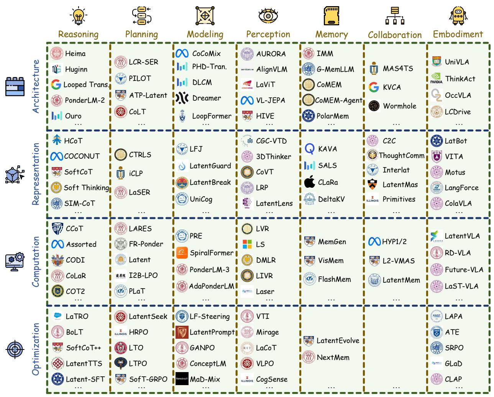

[← 返回 README](../README.md)

# 6 Outlook: What is Next?

## 📌 预览
本节保留原文并穿插批注，重点提炼与课题主线相关的机制和证据。

---

# 44

6.1 Perspective 45   
6.2 Challenge 46   
6.3 Future 46

*Figure 1: Figure 1 Overview of the latent space methods classified by two axes: four main Mechanisms (Section 4) and seven key Abilities (Section 5). Within our classification system, a single method may be affiliated with one or more mechanisms and capabilities. For the visualization in this figure, we adopt the most appropriate classification for each method; a comprehensive elaboration of these categories will be presented in the main text.*

> 💡 **Figure 1 批读**: 这张图通常承担方法框架、动机或视觉对比作用；重点看它支撑的是机制、效果还是局限。

Figure 1 Overview of the latent space methods classified by two axes: four main Mechanisms (Section 4) and seven key Abilities (Section 5). Within our classification system, a single method may be affiliated with one or more mechanisms and capabilities. For the visualization in this figure, we adopt the most appropriate classification for each method; a comprehensive elaboration of these categories will be presented in the main text.

> 💡 **批注**: 这是实验证据段：同时看主指标、消融、效率和案例，判断 claim 是否被支撑。

---

## 🔖 Section 总结

### 核心洞察
1. 本节对应论文原始大分节，原文已完整保留。
2. 阅读重点是把本节的机制/证据映射到论文主 claim。
3. 后续如有疑问，可在本 section 继续补充更细批注。
