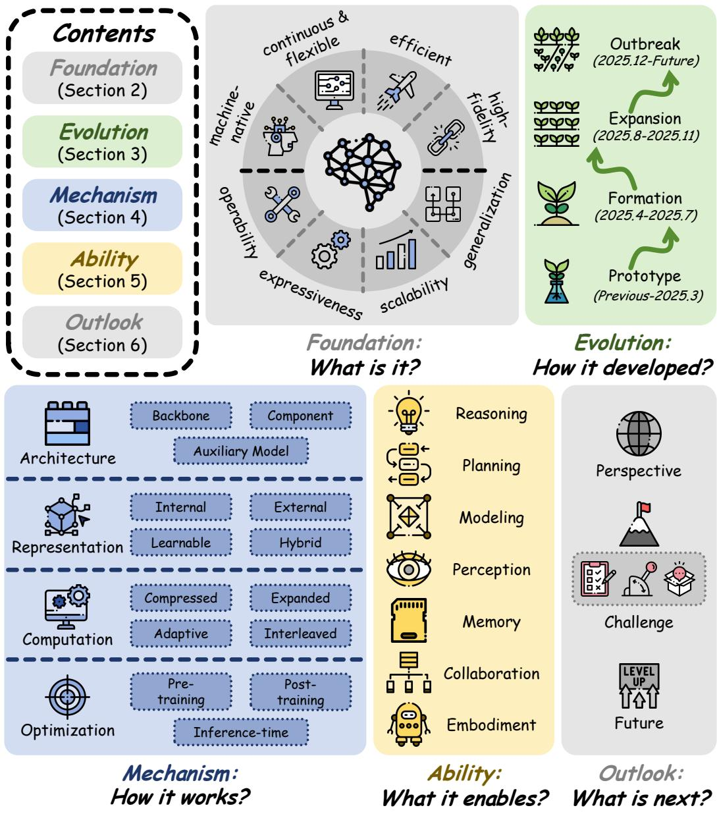

[← 返回 README](../README.md)

# 1 Introduction

## 📌 预览
本节建立研究动机、现有方法缺口和贡献列表，是理解论文叙事的入口。

---

Recent advances in language-based models, including Large Language Models (LLMs), Vision-Language Models (VLMs), Vision-Language-Action models (VLAs), and agentic systems built on language backbones, are still commonly understood through explicit token-level generation, where inputs, outputs, and even intermediate reasoning are expressed in human-readable form [202, 219, 254]. Yet this token-centric framing is increasingly insufficient [11, 58, 186]. Because computation in such models fundamentally unfolds through continuous activations, latent space is increasingly being reconceived not as a hidden implementation detail, but as a machine-native substrate, such as reasoning [58, 243, 295], perception [11, 137], memory [264, 273], communication [290, 300], and action [69, 142]. This shift is driven in part by the structural limitations of explicit space, its redundancy, discretization bottleneck, sequential decoding cost, and potential loss of fine-grained information, especially in complex, multimodal, or long-horizon settings. By contrast, latent-space computation offers a more continuous, compact, and expressive medium that can support higher-fidelity representations and more flexible allocation of computation.

> 💡 **批注**: 这段是 latent memory / medical VLM 主线：关注视觉证据如何进入 latent space、如何被记忆/更新/调用，以及是否能支撑可靠诊断。

Research has therefore moved far beyond the initial framing of latent space as latent reasoning alone.What began as an attempt to internalize chain-of-thought into continuous states has rapidly expanded into a broader systems paradigm spanning new modalities, new interaction settings, and new design choices [27, 99, 297]. However, this growth has also fragmented the literature in at least three ways: by application object, e.g., latent reasoning, visual understanding, and embodied action; by mechanism, e.g., architecture design, representation choice, computation pattern, and optimization strategy; and by scenario, spanning text, vision, multi-agent systems, and embodied environments. Existing reviews mainly focus on latent reasoning or implicit reasoning as a reasoning-specific phenomenon. What remains missing is a unified perspective that treats latent space as a broader computational and systems paradigm across modalities, paradigms, mechanisms, and capabilities.

> 💡 **批注**: 这段是 latent memory / medical VLM 主线：关注视觉证据如何进入 latent space、如何被记忆/更新/调用，以及是否能支撑可靠诊断。

*Figure 2: Figure 2 Outline of the survey, including five sections and sequential questions: Foundation: What is Latent Space? (Section 2), Evolution: How Did Latent Space Develop? (Section 3), Mechanism: How Does Latent Space Work? (Section 4), Ability: What Does Latent Space Enable? (Section 5), and Outlook: What is Next? (Section 6)*

> 💡 **Figure 2 批读**: 这张图通常承担方法框架、动机或视觉对比作用；重点看它支撑的是机制、效果还是局限。

Figure 2 Outline of the survey, including five sections and sequential questions: Foundation: What is Latent Space? (Section 2), Evolution: How Did Latent Space Develop? (Section 3), Mechanism: How Does Latent Space Work? (Section 4), Ability: What Does Latent Space Enable? (Section 5), and Outlook: What is Next? (Section 6)

> 💡 **批注**: 这是实验证据段：同时看主指标、消融、效率和案例，判断 claim 是否被支撑。

To address this gap, we organize the survey around five sequential questions that move from conceptual grounding to future outlook, as illustrated in Figure 2: What is latent space? How did it develop? How does it work? What does it enable? What is next? These questions define the macro-level narrative of the paper: Foundation (Section 2) delineates the concept of latent space and clarifies its relation to explicit space and to latent space in generative visual models; Evolution (Section 3) traces how the field progressed from prototype exploration to rapid outbreak; Mechanism (Section 4) explains how latent space is instantiated and operationalized; Ability (Section 5) examines what latent computation enables across downstream capabilities; and Outlook (Section 6) synthesizes open challenges and future directions. This five-question narrative is intentionally sequential. This organization allows us to preserve a clear narrative while also comparing diverse methods through shared principles and capability outcomes, rather than through task-specific labels alone.

> 💡 **批注**: 这段是 latent memory / medical VLM 主线：关注视觉证据如何进入 latent space、如何被记忆/更新/调用，以及是否能支撑可靠诊断。

Within this sequential narrative, our technical synthesis is anchored by a two-dimensional taxonomy shown in Figure 1. The first axis, Mechanism, asks how latent space is built and used, and covers four major lines: Architecture, Representation, Computation, and Optimization. The second axis, Ability, asks what latent space enables, and covers seven major capability domains: Reasoning, Planning, Modeling, Perception, Memory, Collaboration, and Embodiment. This design lets us preserve a clear survey-level storyline while also comparing diverse methods through shared design principles and shared capability outcomes, rather than through task-specific labels alone.

> 💡 **批注**: 这段是 latent memory / medical VLM 主线：关注视觉证据如何进入 latent space、如何被记忆/更新/调用，以及是否能支撑可靠诊断。

# Contributions

• We clarify the conceptual scope of latent space in language-based models, distinguishing it from explicit or verbal space and from the latent spaces commonly studied in generative visual models. • We provide a unified review of how latent space has evolved from early latent reasoning into a broader multimodal and systems-level research paradigm. • We introduce a two-dimensional taxonomy across Mechanism and Ability, offering a common framework for organizing otherwise fragmented methods and applications. • We provide a comprehensive collection of resources, including illustrative figures, structured tables, accessible links, and repositories, to facilitate further research and community engagement.

> 💡 **列表批读**: 这组条目通常是在列贡献、设置、发现或模块；建议逐条对应到论文 claim。

---

## 🔖 Section 总结

### 核心洞察
1. 本节对应论文原始大分节，原文已完整保留。
2. 阅读重点是把本节的机制/证据映射到论文主 claim。
3. 后续如有疑问，可在本 section 继续补充更细批注。
