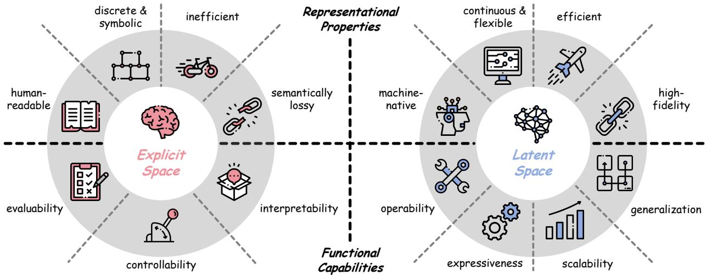
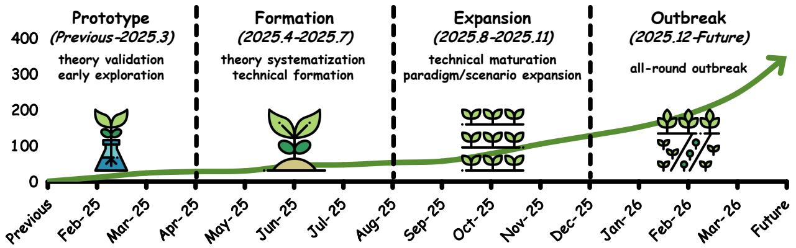

[← 返回 README](../README.md)

# 2 Foundation: What is Latent Space?

## 📌 预览
本节保留原文并穿插批注，重点提炼与课题主线相关的机制和证据。

---

As an emerging paradigm, the exploration of the latent space within language models has exhibited immense potential and vast room for further development. Accordingly, this section provides a preliminary elaboration covering its formal definition and comparisons with existing paradigms.

> 💡 **批注**: 这段是 one-step SR 主线：关注效率、保真-真实感权衡、扩散/flow 先验或单步生成路径。

# 2.1 Concept

In language-based models, i.e., classic autoregressive models, encompassing LLMs, VLMs, VLAs, and derivative systems with language backbone, the entire operational process unfolds explicitly within the explicit space, or the verbal space [202]. The most immediate and externally observable domain is: the discrete space of linguistic symbols in which inputs and outputs are expressed. Formally, this space is defined by a vocabulary that specifies the language model’s next-token predictions. In this space, language is represented as overt verbalized units, i.e., subword-level tokens [168], that are directly interpretable by humans. The training objective of a language model is typically formulated in this explicit space, since the model learns to assign probabilities to symbol sequences and to predict the next token given a textual prefix.

> 💡 **批注**: 这段是 latent memory / medical VLM 主线：关注视觉证据如何进入 latent space、如何被记忆/更新/调用，以及是否能支撑可靠诊断。

However, a language-based model does not operate solely on discrete symbols. To compute over language, it first maps tokens into internal continuous representations and transforms them through multiple layers of nonlinear computation. This gives rise to what is commonly called the latent space: the continuous, learned representational space in which the model encodes and manipulates information that is not explicitly verbalized at the token level. More precisely, the latent space of a language model can be understood as the family of hidden-state spaces, within which contextual, semantic, syntactic, and relational features of an input are jointly represented in this space. A token sequence in the explicit space is thus mapped to a trajectory of latent space, and these latent states are subsequently projected back into the verbal space to yield a probability distribution over possible next tokens. Furthermore, this latent space could be expanded into a

> 💡 **批注**: 这段是 one-step SR 主线：关注效率、保真-真实感权衡、扩散/flow 先验或单步生成路径。

*Figure 3: Figure 3 Comparison of the explicit space and latent space of the language models, including their representational properties and functional capabilities.*

> 💡 **Figure 3 批读**: 这张图通常承担方法框架、动机或视觉对比作用；重点看它支撑的是机制、效果还是局限。

Figure 3 Comparison of the explicit space and latent space of the language models, including their representational properties and functional capabilities.

> 💡 **批注**: 这段是 one-step SR 主线：关注效率、保真-真实感权衡、扩散/flow 先验或单步生成路径。

unified space beyond language that maps modality-specific inputs into continuous internal representations.   
We further provide a formal definition and formulation in Section 4.

# 2.2 Comparison with Explicit Space

To further elucidate the unique characteristics of the latent space, we conduct a comparative analysis with the traditional explicit space, or verbal space, across several critical dimensions [141, 231, 232]. As demonstrated in Figure 3, this comparison highlights a paradigm shift in the representational properties and functional capabilities of the two language models.

> 💡 **批注**: 这段是 one-step SR 主线：关注效率、保真-真实感权衡、扩散/flow 先验或单步生成路径。

# 2.2.1 Representational Properties

The two distinct paradigms of language models, i.e., explicit space and latent space, exhibit fundamental differences in their representational forms, information processing modes, and practical performances. The latent space uses a Machine-native vectorized representation that is Continuous, Flexible, Efficient, and capable of preserving High-fidelity semantic information.

> 💡 **批注**: 这段是 one-step SR 主线：关注效率、保真-真实感权衡、扩散/flow 先验或单步生成路径。

Human-readable v.s. Machine-native. In the explicit space, every state is expressed as a sequence of natural language tokens drawn from a finite vocabulary. This endows the generated trajectories with direct human readability and verifiability [219, 254].

By contrast, the latent space is a machine-native representational paradigm that lacks direct human legibility. Its core representations are high-dimensional real-valued vectors, where individual dimensions do not have a straightforward correspondence to human-interpretable semantic, structural, or perceptual features [148, 239]. Tailored for the intrinsic operational logic of language models, the latent representation and operations can be processed by the model, without the need for transformations of human-readable signals, reducing computational redundancy from additional encoding/decoding overhead [58, 167, 273].

> 💡 **批注**: 这段是 one-step SR 主线：关注效率、保真-真实感权衡、扩散/flow 先验或单步生成路径。

Discrete & Symbolic v.s. Continuous $\&$ Flexible. Explicit-space representations are redundant, discrete, and symbolic. For instance, a chain-of-thought trace for a complex reasoning problem may span thousands of tokens [219]. Each token is a discrete symbol whose meaning is grounded in linguistic convention, and the relationship to other tokens is expressed through positional and grammatical structure [92, 238]. This decoding pattern is, in part, a redundancy and inflexibility: the majority of tokens serve textual coherence rather than substantive semantic contents [40, 234]. They ensure grammaticality, maintain topic continuity, and satisfy the autoregressive constraint that each token be a plausible continuation of the preceding sequence and be mapped into a finite discrete token, obligations that have no intrinsic connection to the logical structure of the autoregressive generation [35, 138, 239].

> 💡 **批注**: 这段信息较密，建议拆成“问题/设定 → 方法/机制 → 结果/影响”三层读。

Conversely, latent space exhibits inherent continuity and flexibility. It encapsulates core semantic information in a continuous form, discarding superficial linguistic redundancies and symbolic mapping [58, 174, 294]. Liberated from the constraints of discrete tokenization and autoregressive linguistic conventions, this nature confers upon latent space distinct advantages in bolstering representational capacity: in reasoning models, it elevates explicit reasoning trajectories onto continuous manifolds [181, 298]; in visual scenarios, it enables smoother multimodal operations (e.g., fusion, alignment, and interaction) within latent spaces marked by a narrower modality gap [183, 227, 264]; in collaboration, it inherently serves as a more fitting medium for information storage and transmission [48, 300]. In essence, the continuous and flexible properties enable language-based models to prioritize the intrinsic semantic essence, unlocking potential across diverse tasks.

> 💡 **批注**: 这段是 one-step SR 主线：关注效率、保真-真实感权衡、扩散/flow 先验或单步生成路径。

Inefficient v.s. Efficient. Conventional autoregressive generation operates entirely within an explicit discrete space, and this paradigm inherently introduces at least three fundamental inefficiencies [233, 277]: First, linguistic redundancy: as the main medium of explicit space, natural language introduces unavoidable structural and semantic redundancy, further reducing the efficiency [35, 92]; Second, representational transformation inefficiency: the model is forced to transfer representations through a narrow, explicit channel at every generation step, including intermediate steps [107, 153]. This mandatory conversion introduces unnecessary and high representational conversion costs. Third, sequential decoding overhead: discrete tokenization locks generation into a strictly sequential pipeline: each token requires a full model forward pass and vocabulary-wide probability calculation. This sequential paradigm not only has low computational efficiency but also increases computational burden [4, 94]; In contrast, latent space methods bypass these inefficiencies, e.g., removing mandatory representation conversion in inter-agent communication [48, 290, 300], and efficient recurrent or looped computation patterns [50, 167].

> 💡 **批注**: 这段是 one-step SR 主线：关注效率、保真-真实感权衡、扩散/flow 先验或单步生成路径。

Semantically-lossy v.s. High-fidelity. Explicit-space representations are prone to semantic loss. When a model externalizes its internal continuous state as a token sequence, the mapping from latent activations to discrete symbols imposes a quantization bottleneck: a finite vocabulary and the combinatorial constraints of natural language delimit what can be expressed [159, 221]. As a result, fine-grained uncertainty, intermediate computational traces, cross-modal alignments, and other structures that are difficult to render in language may be compressed, distorted, or discarded. In this sense, natural language constitutes a semantically lossy transformation of the underlying computational state.

> 💡 **批注**: 这段是 one-step SR 主线：关注效率、保真-真实感权衡、扩散/flow 先验或单步生成路径。

Latent-space representations, by contrast, preserve information with higher fidelity. By avoiding discretization and linguistic rendering, latent variables can carry rich, continuous information between computational steps, including content that is inexpressible in natural language and representations that naturally support multimodal structure. This perspective motivates a growing line of work directly in latent space, such as continuous thoughts [58, 174, 294], latent memory [65, 264, 273], and latent visual reasoning [95, 251], etc.

> 💡 **批注**: 这段是 latent memory / medical VLM 主线：关注视觉证据如何进入 latent space、如何被记忆/更新/调用，以及是否能支撑可靠诊断。

# 2.2.2 Functional Capabilities

The latent space, as a machine-native representational space, possesses multiple key functional capabilities that distinguish it from the explicit space, including Operability, Expressiveness, Scalability, Generalization, as well as Evaluability, controllability, and interpretability, which collectively underpin its utility in various advanced computational and representational tasks.

Operability. As a machine-native representational space, the operability of latent space characterizes its utility as a structured, differentiable manifold that serves as several internal computational substrates. This operability seamlessly enables direct calculations (such as concatenation, linear combination, etc.) and also advanced operations, e.g., controllable semantic steering [84, 250], active intervention [49, 98, 295], iterative interleaving [20, 111], and visual latent thinking [183, 211, 276]. On the contrary, the discrete tokens in the explicit space are inherently non-differentiable and lack the support of a continuous, structured manifold, rendering the aforementioned fine-grained, advanced semantic operations infeasible and permitting only limited, indirect token-level operations.

> 💡 **批注**: 这段信息较密，建议拆成“问题/设定 → 方法/机制 → 结果/影响”三层读。

Expressiveness. It serves as a core capacity for internalizing and manipulating complex, high-dimensional, and even non-linguistic information. In contrast to natural language, which is constrained by a discrete vocabulary and grammatical conventions, representations within latent space provide a substantially richer representational substrate. In principle, it can express the representation including but not limited to the whole explicit space, enabling efficient communication [252, 290, 300], visual perception [11, 28, 251], embodied action planning [14, 69], latent memory formation [264, 273], etc.

> 💡 **批注**: 这段是 latent memory / medical VLM 主线：关注视觉证据如何进入 latent space、如何被记忆/更新/调用，以及是否能支撑可靠诊断。

Scalability. It follows naturally from the compactness and parallelizability of vectorized representations. Latent-space approaches are therefore well-positioned to benefit from continued scaling of longer reasoning trajectories [117, 164, 188, 220], deeper agent interaction turns [265, 290], and test-time compute [50, 262, 274].

Generalization. It further bolsters the ability to generalize effectively to inputs distinct from those encountered during training, which capture abstract semantic structures rather than superficial linguistic patterns. By embedding abstract semantic concepts into a latent space, models gain improved cross-domain transfer and zero-shot generalization, enabling the transfer of learned abstractions to previously unseen tasks and domains. Transfer learning [195, 270], and cross-domain robustness [37, 177, 264, 273] have all been empirically shown to benefit from such informative latent representations.

> 💡 **批注**: 这段是 one-step SR 主线：关注效率、保真-真实感权衡、扩散/flow 先验或单步生成路径。

Evaluability $\&$ Controllability & Interpretability. This denotes the ability of humans or automated systems to evaluate, control, observe, interpret, and audit the autoregressive generation process. For explicit generation, the resulting generation traces are evaluable, controllable, and interpretable, as each intermediate step is represented in a human-readable format [6, 89, 108]. In principle, systems built upon explicit reasoning mechanisms can integrate human-aligned verification or automated consistency checks. In contrast, machine-native latent space representations make it inherently difficult for humans to perform granular, direct evaluation, control, and interpretation of the generation process, posing potential challenges to model evaluability, controllability, and interpretability (Section 6.2).

> 💡 **批注**: 这段是 one-step SR 主线：关注效率、保真-真实感权衡、扩散/flow 先验或单步生成路径。

# 2.3 Comparison with Generative Visual Models

The latent space of generative visual models is derived from a VAE-style framework [85], which learns a probabilistic mapping from high-dimensional observations to a compact continuous representation. Subsequent work introduced discrete latent codes via VQ-VAE [201], and the decisive step toward scalable synthesis was taken by latent diffusion models [162], which demonstrated that diffusion processes operating in a perceptually compressed latent space could achieve both computational efficiency and high sample fidelity. Extensions to video generation, including VideoLDM [12] and related architectures, further organized this space along a spatiotemporal axis, encoding appearance and motion as jointly structured representations.

> 💡 **批注**: 这段是 one-step SR 主线：关注效率、保真-真实感权衡、扩散/flow 先验或单步生成路径。

Despite the shared reliance on learned continuous representations, the latent spaces of generative visual models and large language models differ fundamentally in their geometric structure, representational organization, and conditioning regimes.

> 💡 **批注**: 这段是 one-step SR 主线：关注效率、保真-真实感权衡、扩散/flow 先验或单步生成路径。

Training Objective. The latent space of generative visual models is explicitly shaped by a reconstruction objective, which anchors the learned geometry to the statistical structure of the visual signal [12, 200]. This produces a relatively smooth, locally Euclidean manifold in which linear interpolation between encoded points yields perceptually coherent intermediates, and in which distances carry interpretable perceptual meaning. Rather than a reconstruction objective, language model hidden states are organized by a predictive criterion, next-token prediction in autoregressive models [13], with no explicit constraint on the geometry of the space.

> 💡 **批注**: 这段是 one-step SR 主线：关注效率、保真-真实感权衡、扩散/flow 先验或单步生成路径。

Structure. Latent space of visual generative models maintains an explicit spatiotemporal structure: the latent tensor of an image is a spatial grid of patch-level codes [43, 150], and that of a video extends this grid along the temporal axis, with motion treated as a first-class representational element. This structural regularity reflects the continuous, compositional nature of visual scenes, in which spatial proximity and temporal coherence are strong inductive priors. On the contrary, the latent space of a language model focuses on the linguistic semantics and is devoid of spatial topology or physical dynamics.

> 💡 **批注**: 这段是 one-step SR 主线：关注效率、保真-真实感权衡、扩散/flow 先验或单步生成路径。

Controllability. Precise control over visual generation is exercised through dedicated architectural pathways integrated into the model itself [278]. These signals include pose sequences, depth maps, segmentation masks, and reference images, affording fine-grained, spatially localized control over the generated output by conditioning applied directly within the representational substrate.

> 💡 **批注**: 这段是 one-step SR 主线：关注效率、保真-真实感权衡、扩散/flow 先验或单步生成路径。

*Figure 4: Figure 4 Timeline of representative works in the evolution of latent space research, organized into four developmental stages: Prototype (Section 3.1), Formation (Section 3.2), Expansion (Section 3.3), and Outbreak (Section 3.4) stages, where the horizontal axis denotes the month, and vertical axis indicates the number of the latent-level works.*

> 💡 **Figure 4 批读**: 这张图通常承担方法框架、动机或视觉对比作用；重点看它支撑的是机制、效果还是局限。

Figure 4 Timeline of representative works in the evolution of latent space research, organized into four developmental stages: Prototype (Section 3.1), Formation (Section 3.2), Expansion (Section 3.3), and Outbreak (Section 3.4) stages, where the horizontal axis denotes the month, and vertical axis indicates the number of the latent-level works.

> 💡 **批注**: 这是实验证据段：同时看主指标、消融、效率和案例，判断 claim 是否被支撑。

---

## 🔖 Section 总结

### 核心洞察
1. 本节对应论文原始大分节，原文已完整保留。
2. 阅读重点是把本节的机制/证据映射到论文主 claim。
3. 后续如有疑问，可在本 section 继续补充更细批注。
