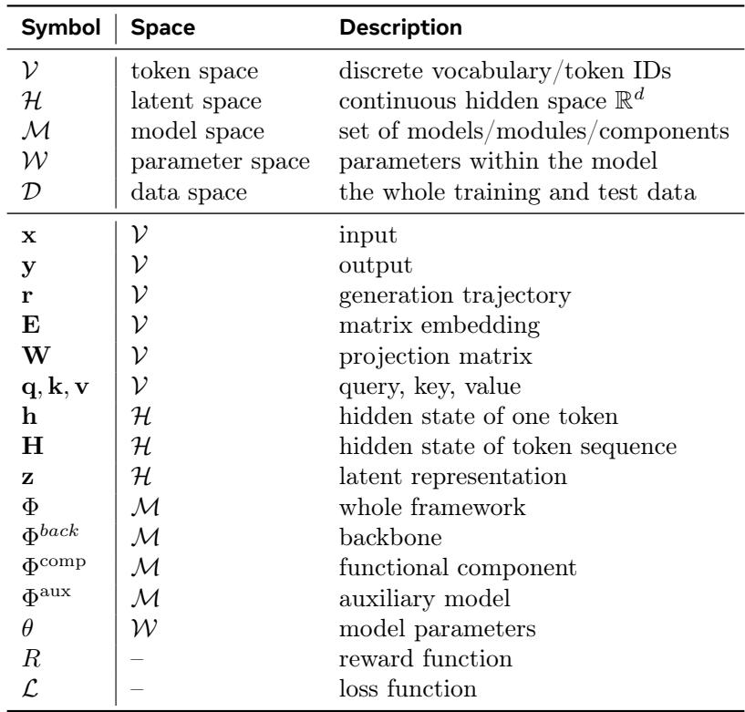

[← 返回 README](../README.md)

# 3 Evolution: How Did Latent Space Develop?

## 📌 预览
本节保留原文并穿插批注，重点提炼与课题主线相关的机制和证据。

---

As large language models have demonstrated outstanding performance across a range of natural language understanding and reasoning tasks, the exploration of their latent spaces has undergone a remarkably rapid and transformative evolution. In this section, we trace the developmental trajectory of this emerging paradigm, organizing the literature into four chronologically and thematically coherent stages (Figure 4): (1) Prototype (Previous – Mar 2025), where pioneering works first demonstrated the feasibility of moving reasoning from discrete token sequences into continuous latent representations; (2) Formation $\left( \mathrm { A p r \mathrm { ~ - ~ } J u l ~ 2 0 2 5 } \right)$ , where theoretical foundations were established and systematic evaluations emerged, with research primarily centered on textual latent reasoning and initial explorations into multimodal settings; (3) Expansion (Aug – Nov 2025), where the field rapidly diversified into visual tasks, embodied action, multi-agent collaboration, and other application paths; and (4) Outbreak (Dec 2025 – Present), where explosive growth drove architectural innovation, advanced optimization, rigorous theoretical analysis, and cross-modal integration toward maturity.

> 💡 **批注**: 这一段把 latent 研究从“几篇热论文”变成了历史阶段。读法上要盯住每一阶段主要解决的瓶颈，而不是只记代表作名字。

# 3.1 Prototype

The prototype stage marks the genesis of latent space reasoning, where researchers first question whether large language models must articulate every intermediate reasoning step in natural language. In this stage, Theory Validation and Early Exploration begin to use continuous representations as an alternative substrate.

Theory Validation. Before the first latent systems appeared, several works laid essential groundwork by revealing that reasoning-like behavior is already encoded in the internal representations of language models. Represented by HCoT [122], early precursors show that a full CoT trace can be compressed into a compact special-token representation via contrastive semantic alignment, suggesting that much of the information in explicit CoT is redundant for the model itself. Meanwhile, Zhang and Viteri [277] discovers latent thinking vectors by extracting steering vectors from model activations, and demonstrates that injecting these vectors at inference time can elicit CoT-like reasoning without any fine-tuning or explicit prompting. From a theoretical perspective, Hu et al. [66] offers a Hopfieldian interpretation, framing reasoning as transitions across representation spaces with grounding in cognitive neuroscience. Furthermore, Latent Space Chainof-Embedding [217] demonstrates that LLMs can perform self-evaluation through latent embeddings rather than explicit verbal outputs. Together, these precursors establish a critical insight: the capacities of language models are not fundamentally bound to discrete token sequences, but are already substantially encoded in their latent spaces.

Early Exploration. Building on these insights, the initial stage produced a series of high-impact works that gradually shaped the initial direction of latent space reasoning. COCONUT [58] proposes the first complete framework for reasoning in continuous latent space, feeding the last hidden state back as the next input embedding to form a loop of continuous thoughts that bypasses the discrete vocabulary bottleneck. Its key finding is that continuous thought vectors can encode superpositions of multiple potential next steps, enabling emergent breadth-first search in latent space. Along a similar compression-based direction, CCoT [31] introduces contemplation tokens that compress explicit reasoning chains into dense latent form. At the same time, Liu et al. [117] augments the KV cache with latent embeddings via an offline coprocessor, keeping the decoder entirely frozen. Both demonstrate that latent representation can be injected into existing models through parameter-efficient adaptation without inference latency overhead.

> 💡 **批注**: Prototype 阶段的关键不是性能，而是“可行性示范”。COCONUT 证明 latent reasoning 能跑起来；KV-cache/压缩路线证明不一定要从头改模型，现有模型也能接入 latent 机制。

Subsequently, Huginn [50] proposes using recurrent depth to scale test-time compute in latent space, iterating a shared transformer block a variable number of times to perform all reasoning implicitly without specialized reasoning data. SoftCoT [243] provides the first plug-in approach to latent space, projecting instance-specific soft thought tokens into the frozen backbone’s representation space to avoid catastrophic forgetting.

Taken together, the prototype stage establishes the feasibility of latent-space reasoning, but it also exposes its first major bottleneck: the field still lacks a systematic account of why latent reasoning works, when it outperforms explicit CoT, and how it should be evaluated beyond isolated proof-of-concept demonstrations. In other words, the central challenge at this stage is not capability alone, but interpretability, formalization, and comparability. These limitations directly motivate the next stage, where the community moves from scattered prototypes toward theoretical systematization, benchmark construction, and more principled technical design.

# 3.2 Formation

The formation stage advances from the prototype-stage insights toward building a more practically meaningful research program. This period is primarily centered on textual latent reasoning and is characterized by two advances: Theoretical Systematization that explains why it works, Technical Formation that works on how well it works, and initial explorations of extension into multimodal and embodied settings.

Theory Systematization. The most transformative contribution of this stage is the theoretical understanding of continuous thought mechanisms. These theoretical works provide formal guarantees for the expressiveness and computational advantages of latent space, grounding the empirical successes of the prototype stage in rigorous mathematical frameworks. Zhu et al. [294] (Reasoning by Superposition) provide the first formal complexity analysis, proving that continuous thought vectors acting as superposition states can encode multiple search frontiers simultaneously, offering a rigorous explanation for COCONUT’s empirically observed behavior. CoT2 [52] further quantifies the relationship between parallelism and embedding dimension and introduces continuous supervision and reinforcement learning for continuous thought optimization. Saunshi et al. [167] prove that looped transformers with latent iterations can express strictly more complex computations than standard transformers, establishing theoretical separation results for recurrent-depth architectures.

Technical Formation. The formation stage also witnesses important methodological innovations that translate the prototypes into more practical and versatile latent techniques. These advances span both representation design and optimization strategies, progressively expanding the toolkit available. On the representation front, a series of works explored latent representation design: Assorted [181] proposes mixing latent discrete tokens with text tokens to achieve shorter traces with improved accuracy; CODI [174] formalizes a self-distillation procedure where the same model serves as both teacher and student to generate reasoning chains in explicit and latent spaces respectively; and BoLT [164] shifts attention to pretraining, treating web text as compressed outcomes of thought processes and using bootstrapping for data-efficient pretraining.

> 💡 **批注**: Formation 阶段的标志是从“能做”转向“怎么做更稳、更系统”。representation design、self-distillation、pretraining 都是在把 latent 从 demo 变成可复用工具链。

On the optimization front, represented by HRPO [266], System-1.5 [214], and CoLaR [188], a family of methods respectively introduced latent reinforcement methods, adaptive computation allocation between language and latent spaces, and dynamic inference-time controllable compression. These works demonstrate that latent optimization can be optimized end-to-end and adaptively allocated across different modalities.

Another characteristic of this stage is that latent-level models begin extending beyond text-only LLMs. While the primary focus remains on textual reasoning, several pioneering efforts demonstrate the broader applicability of the latent space paradigm across modalities. Mirage [251] enables VLMs to think visually by recasting hidden states as latent visual tokens interleaved with text, implementing internal visual manipulation analogous to human mental imagery. UniVLA [14] introduces task-centric latent actions for cross-embodiment robot policies, learning latent action representations from internet-scale video. These early multimodal explorations demonstrate that the latent space paradigm is not confined to textual reasoning but may constitute a general framework applicable across modalities and embodiment types.

Despite these advances, the formation stage remains constrained by a second bottleneck: most methods are still developed and evaluated within relatively narrow settings, with text-centric assumptions, limited downstream diversity, and weak integration across memory, planning, communication, and action. As a result, the field has learned how to make latent reasoning more principled, but not yet how to make it broadly useful across heterogeneous scenarios. This gap naturally drives the next stage, where the main question shifts from “can latent reasoning be formalized?” to “how far can the latent-space paradigm generalize across domains, modalities, and system settings? ”

# 3.3 Expansion

The expansion stage transforms latent space research from a text-centric landscape into a multi-modal, multi-domain ecosystem. This stage witnesses rapid diversification along concurrent dimensions. The period is marked by the Technical Maturation of domain-specific innovations and Paradigm/Scenario Expansion of cross-cutting themes such as latent memory, test-time scaling, and RL-based optimization.

Technical Maturation. In the LLM domain, latent methods evolve from proof-of-concept to more sophisticated systems that address challenges in memory, scalability, optimization, and domain-specific applications. The research landscape broadens considerably, with multiple sub-directions developing in parallel. Represented by MemGen [273], a line of works pioneers latent memory for agents, interweaving reasoning and memory so that planning, procedural, and working memory types emerge without explicit supervision. On the test-time scaling front, LTPO [258] treats latent thought vectors as optimizable parameters with online policy gradient; Ouro [296] moves optimization into pretraining via looped language models; and You et al. [262] enables parallel test-time scaling through stochastic sampling strategies with a latent reward model for trajectory selection. For RL-driven optimization, SofT-GRPO [291] solves the differentiability challenge of applying RL to continuous latent reasoning through Gumbel-reparameterized policy optimization. In the interleaving and hybrid direction, SpiralThinker [155] and CLaRa [59] propose text-latent iterative interleaving and unified retrieval-augmented generation in shared continuous spaces, respectively. Additionally, domain-specific applications emerge, including search-and-recommendation unification [177], code language model interpretability [172], and System $1 / 2$ dual-architecture communication [33].

Paradigm/Scenario Expansion. The expansion stage sees an explosion of visual latent-level methods, establishing the paradigm of thinking in visual space as a complement to textual reasoning. These methods enable VLMs to perform internal visual manipulation and reasoning directly in latent representations, bypassing the information loss incurred by converting visual content into discrete text tokens. Represented by LVR [95] and Monet [211], a family of works introduces autoregressive reasoning in the visual embedding space, generating latent states interleaved with text for fine-grained visual understanding. 3DThinker [28] further extends this to 3D mental simulation from limited 2D views by aligning latent representations with 3D foundation models. Another line address latent visual tasks: VisMem [264] proposes cognitively inspired short-term and long-term latent vision memory modules, while CoMEM [230] scales continuous memory for visual agents. Works such as Latent Sketchpad [276] and LaCoT [183] further explore visual scratchpads for planning and variational inference for visual reasoning, respectively.

> 💡 **批注**: 这段对当前项目最关键。`VisMem` 在作者自己的历史叙事里属于 Expansion 阶段的“visual latent memory”支线，说明它不是孤立点子，而是 latent 从 text reasoning 向 perception/memory 外扩的代表。

The expansion stage gives birth to latent communication as a new paradigm for multi-agent systems. Unlike traditional text-based inter-agent communication, latent communication enables direct exchange of continuous representations, offering higher bandwidth and lower latency. C2C [48] introduces direct semantic communication between LLMs via KV-cache projection and fusion. [290] develops a theoretical framework for mind-to-mind latent thought communication, while LatentMAS [300] demonstrates latent collaboration through shared latent working memory, significantly reducing output tokens while improving accuracy.

The embodied domain also expands significantly during this stage, with latent representations becoming a central tool for learning and transferring robotic manipulation and navigation skills. Self-supervised pretraining from unlabeled video emerged as a key methodology. Represented by LAPA [256] and LAWM [196], a line of self-supervised methods pioneers latent action pretraining from unlabeled video data through world modeling. OccVLA [118] integrates implicit 3D occupancy supervision for interpretable trajectory planning, while

SRPO [45] applies RL with latent world representations for VLA training. ATE [281] enables data-efficient VLA adaptation through unified latent guidance, achieving substantial real-world cross-embodiment gains.

However, rapid expansion also introduces a new bottleneck: the field becomes increasingly fragmented. Once latent-space methods spread across language, vision, multi-agent systems, and embodiment, the main challenge is no longer lack of applications, but lack of unification. Different works adopt different architectural assumptions, optimization objectives, evaluation criteria, and latent interfaces, making it difficult to compare methods or identify stable design principles. This fragmentation sets the stage for the outbreak period, in which the research frontier shifts toward architectural specialization, optimization sophistication, and more mature attempts to consolidate latent space as a first-class computational paradigm.

# 3.4 Outbreak

The outbreak stage represents an explosive acceleration of the field, characterized by the All-roundOutbreak of all research threads. The maturity of this stage is reflected in many hallmarks: architectural and representational specialization, with purpose-built models designed specifically for latent representation; computation and optimization sophistication, with methods addressing fine-grained challenges such as exploration collapse and latent reward encoding; Moreover, multi-scenario surge, with unified frameworks spanning language, vision, action, and multi-agent systems.

All-round Outbreak. A defining feature of this stage is the increasing specialization of model architectures. Rather than merely adapting standard transformer backbones via shallow recurrence or iterative decoding, recent work has developed architectures explicitly designed to support latent computation as a first-class mechanism. These models generally aim to improve the controllability, efficiency, and expressiveness of reasoning in latent space.

> 💡 **批注**: Outbreak 阶段说明 latent 已经不再满足于“挂插件”。研究开始直接为 latent 设计 backbone、优化器和跨模态接口，这意味着它在向独立系统范式靠拢。

Representative examples include Dreamer [86] and LoopFormer [72], which introduce depth-recurrent designs that combine sequence attention with depth-wise computation and elastic looping, thereby enabling budgetaware reasoning and more flexible compute allocation. MLRA [121] further revises the attention mechanism through low-rank projections, while DLCM [158] shifts the granularity of latent computation from token-level operations toward concept-level reasoning with adaptive conceptual boundaries. Collectively, these studies suggest that architectural development is moving beyond incremental modifications to sequence models toward dedicated latent-space systems.

Alongside architectural specialization, optimization strategies for latent space also become substantially more sophisticated. For example, ReLaX [280] and Active Latent Planning [292] advance latent-space exploration by moving beyond imitation-based learning toward more explicit reinforcement-learning-based planning. At the same time, Özeren and Aßenmacher [149] demonstrate, through a systematic analysis, that reinforcement learning remains sensitive to design choices and continues to face persistent optimization challenges. LED [189] addresses post-training exploration collapse by leveraging entropy variation across recurrent depth. In contrast, Latent Thinking Optimization [41] shows that latent thoughts can themselves encode reward-relevant information, thereby opening the possibility of directly optimizing latent trajectories without relying exclusively on external reward models. Overall, these developments indicate that optimization is becoming an independent axis of progress rather than a secondary concern.

In visual tasks, recent studies demonstrate that latent space supports increasingly complex forms of multi-step and interleaved inference. ILVR [39] and CrystaL [283], for instance, explore visual-text interleaved reasoning and report the emergence of visual latent representations during the reasoning process. LIVR [100] and Mull-Tokens [160] further extend this line of work by pushing visual reasoning more fully into latent space and by proposing modality-agnostic latent thinking mechanisms. Related efforts such as VL-JEPA [21] and DMLR [111] further expand the design space of visual reasoning and highlight the growing diversity of methodological formulations in this area.

A similar expansion is also evident in multi-agent systems, where latent communication evolves from preliminary demonstrations into more structured frameworks for coordination and representation sharing. Dery et al. [38] propose latent-space communication via K-V cache alignment with lightweight adapters, enabling translation between heterogeneous internal states. L2-VMAS [265] and Wormhole [124] extend this perspective to visual and heterogeneous multi-agent settings, while LatentMem [47] introduces shared latent memory mechanisms for multi-agent experience accumulation. These works suggest that latent communication is becoming an important mechanism for scalable inter-agent coordination.

Table 1 General notations used throughout the paper.

*Table 1: Table 1 General notations used throughout the paper.*

The embodied VLA setting provides another major area of expansion. Here, latent representations increasingly serve as a unifying interface for perception, generation, and action, and latent action modeling is emerging as a central design paradigm. Motus [10] and VLA-JEPA [184] exemplify this trend by developing unified latent action world models that integrate action generation and environment understanding within a shared latent space. Villa-X [26] and JALA [131] further improve the expressiveness and scalability of latent action modeling, while CoWVLA [249] introduces world-model reasoning in latent motion space. Additional work, including WholeBodyVLA [77], SwiftVLA [142], and LoLA [213], reinforces the view that latent action representations are becoming increasingly central to VLA pretraining and deployment.

At the same time, the outbreak stage surfaces the next-order bottleneck for the field as a whole: once latentspace methods become specialized, powerful, and widespread, the hardest problem is no longer demonstration but consolidation. The open questions now concern standardization of latent interfaces, principled evaluation across modalities, alignment between latent efficiency and interpretability, and the integration of latent computation into broader agentic systems. In this sense, the outbreak stage does not mark the end of the story; rather, it reveals that the next phase of progress will likely depend on turning a rapidly growing collection of techniques into a coherent science and harness engineering for latent computation.

---

## 🔖 Section 总结

### 核心洞察
1. Evolution 部分把 latent 从 prototype 到 outbreak 的路线讲清楚了：先证明可行，再系统化，再跨模态扩展，最后形成专用架构和优化学派。
2. `VisMem`、`Visual-Enhanced-Depth-Scaling`、`MedSynapse-V` 都应被看作 Expansion/Outbreak 阶段的产物，而不是早期 latent reasoning 论文的简单套壳。
3. 读新论文时，一个好问题是：它是在延续这条时间线中的哪一步，而不是单看 benchmark 涨了多少。
