[← 返回 README](../README.md)

# 4 Mechanism: How Does Latent Space Work?

## 📌 预览
本节保留原文并穿插批注，重点提炼与课题主线相关的机制和证据。

---

Mechanism concerns how latent space is instantiated, structured, and operationalized within a model, beyond the high-level question of why it is useful. Existing methods differ not only in where latent variables are introduced, but also in how they are represented, how computation is carried out through them, and at which stage they are shaped or exploited. To organize this design space, we categorize latent-space mechanisms along four complementary axes: Architecture (Section 4.1) characterizes the structural role of latent space in the model, including whether it is embedded in the backbone, realized as a dedicated component, or supported by an auxiliary model; Representation (Section 4.2) describes the form of latent variables, distinguishing internal, external, learnable, and hybrid representations. Computation (Section 4.3) captures how the latent space participates in information processing, including compressed, expanded, adaptive, or interleaved computation. Optimization (Section 4.4) focuses on when and how latent space is induced, aligned, or refined, spanning pre-training, post-training, and inference-time mechanisms. These four mechanistic types provide a unified lens for comparing diverse approaches and clarify the major design choices that govern how latent spaces are constructed and used in modern language-based systems.

> 💡 **批注**: 这段是 one-step SR 主线：关注效率、保真-真实感权衡、扩散/flow 先验或单步生成路径。

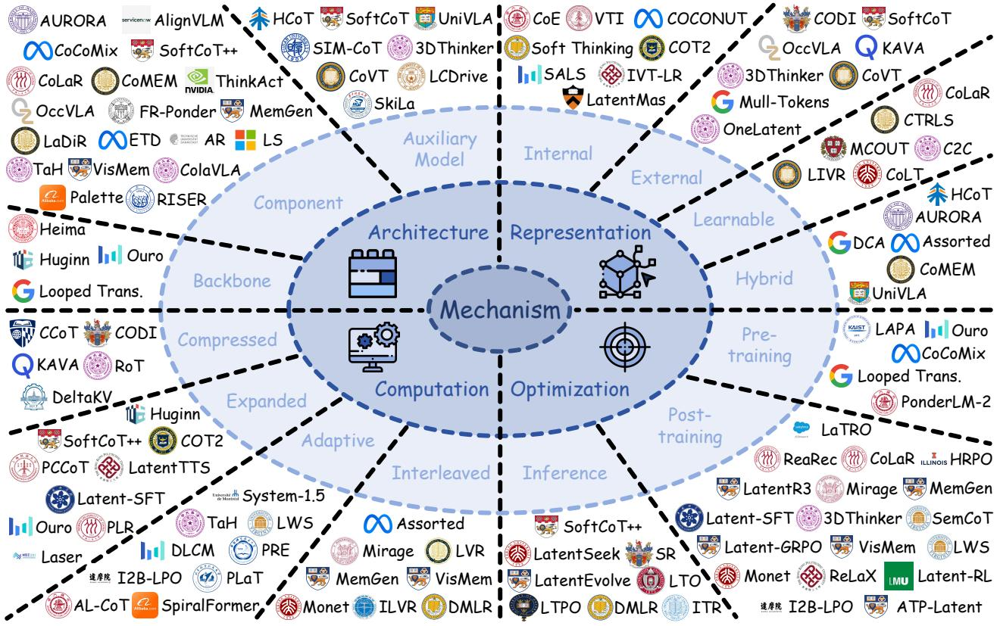
*Figure 5: Figure 5 Representative works operate in accordance with latent space mechanisms. We classify all methods into four lines based on diverse ways of utilizing the latent space, including: Architecture (Section 4.1), Representation (Section 4.2), Computation (Section 4.3), and Optimization (Section 4.4).*

> 💡 **Figure 5 批读**: 这张图通常承担方法框架、动机或视觉对比作用；重点看它支撑的是机制、效果还是局限。

Figure 5 Representative works operate in accordance with latent space mechanisms. We classify all methods into four lines based on diverse ways of utilizing the latent space, including: Architecture (Section 4.1), Representation (Section 4.2), Computation (Section 4.3), and Optimization (Section 4.4).

> 💡 **批注**: 这是实验证据段：同时看主指标、消融、效率和案例，判断 claim 是否被支撑。

General Notation and Formalization. Based on the notations in Table 1, we first formalize the standard autoregressive generation paradigm. Given an input sequence $\textbf { x } \in { \mathcal { V } }$ , a model $\Phi _ { \theta }$ defines a conditional distribution over the output sequence $\mathbf y \in \mathcal V$ :

> 💡 **批注**: 这段是 one-step SR 主线：关注效率、保真-真实感权衡、扩散/flow 先验或单步生成路径。

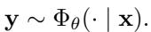
*Equation 1: Equation extracted by MinerU.*

> 💡 **Equation 1 批读**: 公式通常定义过程、loss 或更新规则；建议把符号对应到输入、模型、记忆/控制变量与输出。

where generation is performed purely in token space: the model predicts each output token conditioned on the input and the previously generated context. Although the computation is internally carried out through continuous hidden states $\mathbf { h } \in \mathcal { H }$ , the generation interface itself remains token-to-token.

> 💡 **批注**: 这段是 one-step SR 主线：关注效率、保真-真实感权衡、扩散/flow 先验或单步生成路径。

Latent-space methods extend this formulation by introducing an additional latent representation $\mathbf { z } \in \mathcal { H }$ , such that generation is conditioned not only on the observable input $\mathbf { x }$ but also on a continuous latent variable:

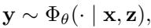
*Equation 2: Equation extracted by MinerU.*

> 💡 **Equation 2 批读**: 公式通常定义过程、loss 或更新规则；建议把符号对应到输入、模型、记忆/控制变量与输出。

where $\mathbf { z }$ denotes a latent representation in the latent space $\mathcal { H }$ . Compared with standard autoregressive generation, the latent variable $\mathbf { z }$ provides an additional channel for encoding information that may be difficult to express directly in token space, such as global semantics, multimodal features, intermediate reasoning states, structural constraints, or other task-relevant factors.

Table 2 Overview of the Backbone (Section 4.1.1) based architecture. We compare the hidden dimension, layer, size, and architectural feature of these backbones.

> 💡 **批注**: 这是实验证据段：同时看主指标、消融、效率和案例，判断 claim 是否被支撑。

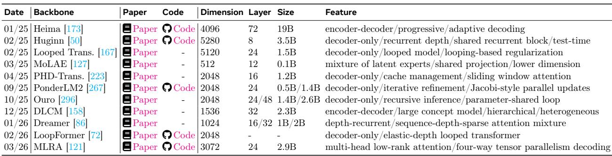
*Table 2: Table 2 Overview of the Backbone (Section 4.1.1) based architecture. We compare the hidden dimension, layer, size, and architectural feature of these backbones.*

> 💡 **Table 2 批读**: 表格要看主指标、次指标与效率/鲁棒性是否一致支持论文 claim。

Under this perspective, the central question is not merely whether a method uses latent variables, but how latent space is instantiated and integrated into the generation process. This motivates the mechanism-oriented taxonomy in this survey.

# 4.1 Architecture

Recent advances in latent-level methods have catalyzed a profound rethinking of the established architectural design paradigms for models operating in explicit representational spaces [66]. Departing from the exclusive reliance on conventional autoregressive frameworks, an increasing number of studies have pioneered innovative mechanisms that enable core computations within latent spaces, where high-level cognitive processes [104], e.g., reasoning, perception, and planning, can be conducted with substantially enhanced efficiency and expressiveness. This transformative shift extends far beyond a mere change of representational domain; it encapsulates a fundamental evolution in the architectural philosophy of modern neural models [294].

> 💡 **批注**: 这段是 one-step SR 主线：关注效率、保真-真实感权衡、扩散/flow 先验或单步生成路径。

This emerging paradigm reveals that latent space is evolving from an isolated technical heuristic into a general, foundational architectural principle. To answer the core question: what architectures are utilized to learn the latent space?, we distinguish these methods by the location where latent space $\mathcal { H }$ is integrated into $\Phi$ , with a focus on the structure of the latent system within model space $\Phi = \left\{ \Phi ^ { b a c k } , \Phi ^ { c o m p } , \Phi ^ { a u x } \right\}$ . As reported in Table 2 and Table 3, we classify all existing architecture-driven methods into three categories:

> 💡 **批注**: 这段是 one-step SR 主线：关注效率、保真-真实感权衡、扩散/flow 先验或单步生成路径。

# Mechanism: Architecture

• Backbone (Section 4.1.1): endows the main model with native latent capacity through recurrent, looping, recursive structures, thereby making an architectural primitive. • Component (Section 4.1.2): employs generation, projection heads, alignment, control, storage, or other components, which allow latent functions while preserving the main model skeleton. • Auxiliary Model (Section 4.1.3): utilizes an extra model to provide supervision signals or intermediate features to guide or supplement the host model.

> 💡 **列表批读**: 这组条目通常是在列贡献、设置、发现或模块；建议逐条对应到论文 claim。

# 4.1.1 Backbone

In this category, latent computation is intrinsically embedded in the primary generative architecture rather than introduced via an external auxiliary module. Formally, the backbone itself carries out an iterative or structured transition over latent states:

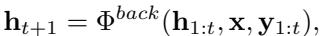
*Equation 3: Equation extracted by MinerU.*

> 💡 **Equation 3 批读**: 公式通常定义过程、loss 或更新规则；建议把符号对应到输入、模型、记忆/控制变量与输出。

where each subsequent output token is produced based on the updated hidden state, under this formulation, the latent operation constitutes a native operational mechanism of $\Phi ^ { b a c k } ( \cdot )$ itself, meaning that the reasoning or intermediate transformation process is realized internally within the backbone, without requiring any additional component.

Existing backbone-based methods can be broadly understood from three complementary perspectives: Parameter-shared, Iterative Refinement, and Augmented. Rather than simply following the explicit-level counterparts, these works revisit the backbone design itself to offer a promising path.

> 💡 **批注**: 这是实验证据段：同时看主指标、消融、效率和案例，判断 claim 是否被支撑。

Parameter-shared Backbone. From the perspective of parameter sharing, a representative line of work replaces a deep stack of distinct layers with a smaller set of reusable modules applied repeatedly. However, in this paradigm, the recurrent depth or times is typically fixed. Huginn [50], for example, adopts a decoder-only architecture, but compensates for the shallow explicit depth by introducing a shared recurrent block that is reused across multiple depth steps. This design substantially reduces the number of unique parameters while enabling test-time scaling, where additional recurrent steps can be applied during inference to trade compute for performance. Looped Trans. [167] further develops this idea by enforcing an explicit layer-looping mechanism. A key technical feature is its looping-based regularization, which stabilizes the hidden-state dynamics under repeated application of the same transformation and encourages convergence of iterative representations. In a related efficiency-oriented setting, PHD-Trans. [223] explores how such recurrent computation can remain practical under long-context decoding. It integrates cache management with sliding-window attention, reducing memory overhead while preserving the benefits of repeated updates.

> 💡 **批注**: 这段是 latent memory / medical VLM 主线：关注视觉证据如何进入 latent space、如何被记忆/更新/调用，以及是否能支撑可靠诊断。

Iterative Backbone. This paradigm highlights the iterative process and dynamic updating, with variable or learnable depth allocation. For instance, Ouro [296] introduces a recursive inference framework whose iterations can serve as an alternative scaling axis, analogous to increasing architectural depth, showing that repeated application of parameter-shared transformations can yield consistent gains. LoopFormer [72] introduces an elastic-depth looped transformer, where the number of loop iterations is not fixed but can vary across inputs or computational budgets. This makes recurrent-depth execution more flexible and better aligned with the complexity of individual examples. PonderLM2 [267] is a representative method in this category. Built as a decoder-only model, it employs iterative refinement via Jacobi-style parallel updates. Instead of strictly following the standard autoregressive regime, where each forward pass advances the prediction by one token, it also performs multi-step hidden-state evolution in parallel, enabling richer internal computation while retaining decoding efficiency.

> 💡 **批注**: 这段是 one-step SR 主线：关注效率、保真-真实感权衡、扩散/flow 先验或单步生成路径。

Augmented Backbone. Beyond these two designs, several works explore augmented architectures at different granularities. For example, Heima [223] and DLCM [158], unlike most encoder-only designs, employ hierarchical encoder-decoder architectures to organize latent computation. The latter one also shifts computation from tokens to a compressed concept space, with more efficient semantic operations. Dreamer [86] and MLRA [121] design sequence-depth sparse attention mixtures and low-rank attention, respectively, making multi-step latent transitions computationally tractable and efficient. In addition, MoLAE [127] designs an architecture of reformulating the mixture of latent experts in lower dimension.

> 💡 **批注**: 这段是 one-step SR 主线：关注效率、保真-真实感权衡、扩散/flow 先验或单步生成路径。

Summary. Overall, backbone-oriented methods represent the most intrinsic form of architecture-level latent modeling. Parameter-sharing approaches improve efficiency by reusing subsets of layers or models; iterative-refinement methods further enhance flexibility by enabling dynamic, adaptive iterations; and augmentation-based designs provide a broader view of architectural shifts. This shift provides the foundation for more flexible, computation-aware, and cognitively expressive generative systems.

> 💡 **批注**: 这段是 one-step SR 主线：关注效率、保真-真实感权衡、扩散/flow 先验或单步生成路径。

# 4.1.2 Component

This paradigm preserves the original backbone architecture but augments it with functional modules that construct, transform, store, or retrieve latent representations. Formally, a component produces and is then injected into the backbone decoding process:

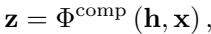
*Equation 4: Equation extracted by MinerU.*

> 💡 **Equation 4 批读**: 公式通常定义过程、loss 或更新规则；建议把符号对应到输入、模型、记忆/控制变量与输出。

where the backbone $\Phi ^ { b a c k } ( \cdot )$ remains the principal generator, while the extra component $\Phi ^ { \mathrm { c o m p } } ( \cdot )$ acts as a plug-in operator over latent space, and the output $\mathbf { z }$ will be used in Equation 2.

Such a design preserves the backbone architecture while equipping it with a latent mechanism to facilitate or guide downstream generation. It covers a broad family of modules that operate on latent spaces while leaving the backbone largely frozen. We categorize existing approaches into five component families: Generation, Projection, Alignment, Control, and Storage, in view of their functional characteristics.

Table 3 Overview of the Component (Section 4.1.2) and Auxiliary Model (Section 4.1.3) based architecture, respectively. We compare the modality, backbone, the type of the component module or external model, function, and scenario. Here, (VQ)-AE, SAE, MLP, Q-Former, LoRA, and JEPA denote (vector quantized) variational autoencoder, multilayer perceptron, querying transformer, low-rank adaptation, and joint embedding predictive architecture, respectively.

> 💡 **批注**: 这段是 one-step SR 主线：关注效率、保真-真实感权衡、扩散/flow 先验或单步生成路径。

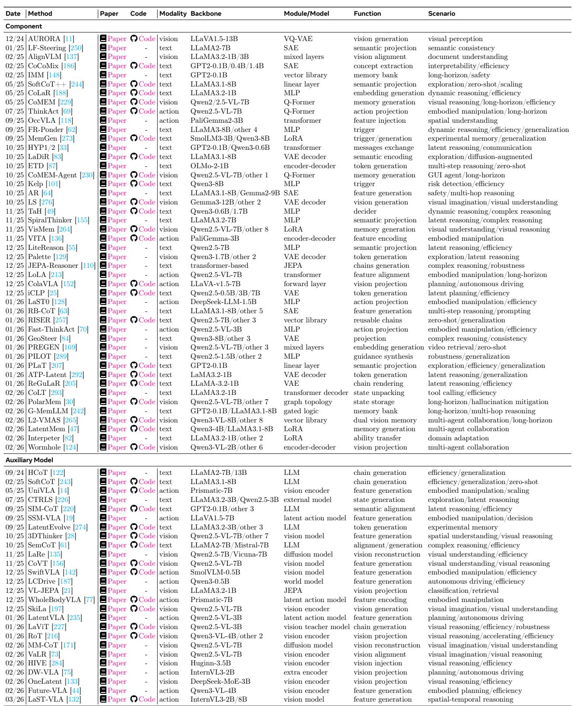
*Table 3: Table 3 Overview of the Component (Section 4.1.2) and Auxiliary Model (Section 4.1.3) based architecture, respectively. We compare the modality, backbone, the type of the component module or external model, function, and scenario. Here, (VQ)-AE, SAE, MLP, Q-Former, LoRA, and JEPA denote (vector quantized) variational autoencoder, multilayer perceptron, querying transformer, low-rank adaptation, and joint embedding predictive architecture, respectively.*

> 💡 **Table 3 批读**: 表格要看主指标、次指标与效率/鲁棒性是否一致支持论文 claim。

Generation Component. A major line of this part aims to construct intermediate latent states in hidden space, allowing the model to synthesize new implicit objectives, subgoals, or reasoning states that are not previously available as explicit symbols. A representative paradigm is realized as discrete tokens or a soft chain evolving rather than through explicit verbalized chains. For instance, ETD [87] introduces an encode–think–decode mechanism that shifts part of the process into latent computation without requiring explicit verbalization. At the same time, Palette [129], iCLP [25], ATP-Latent [292], and ReGuLaR [205] employ VAE-style components to modulate high-level contexts and encourage diverse exploration. At a coarser granularity, JEPA-Reasoner [110] formulates reasoning as a chain of latent predictions under a JEPA-style framework, thereby decoupling latent reasoning from surface token generation.

> 💡 **批注**: 这段是 latent memory / medical VLM 主线：关注视觉证据如何进入 latent space、如何被记忆/更新/调用，以及是否能支撑可靠诊断。

Beyond latent trajectory generation, another line of work leverages non-trajectory latent signals, e.g., compressed embeddings, activation-space features, or learned steering vectors. CoLaR [188], for example, enables more efficient silent reasoning through embedding prediction and control. More broadly, AR [64] and RB-CoT [63] both employ SAE to generate interpretable feature directions in activation space, while PILOT [289] synthesizes latent guidance vectors via an MLP to steer decoding. Additionally, MemGen [273], VisMem [264], and LatentMem [47] also adopt LoRA attached to the backbone to weave latent memories as an injection.

> 💡 **批注**: 这段是 one-step SR 主线：关注效率、保真-真实感权衡、扩散/flow 先验或单步生成路径。

This idea has also been extended to the multimodal setting, where latent variables serve not only as semantic states but also as vision carriers. Recent works, such as AURORA [11], introduce a variational autoencoder to synthesize perception tokens, enabling richer visual understanding. CoMEM [229] and its agent variant CoMEM-Agent [230] deploy querying transformers to produce compact visual memory tokens, showing potential in long-horizon tasks. In addition, SteerVAD [18] generates related latent frame-level vision embeddings from mixed layers for video-based tasks, and Latent Sketchpad [276] uses a VAE decoder to generate intermediate visual imaginations during multi-step visual reasoning.

> 💡 **批注**: 这段是 latent memory / medical VLM 主线：关注视觉证据如何进入 latent space、如何被记忆/更新/调用，以及是否能支撑可靠诊断。

Projection Component. This category does not primarily synthesize new latent content, but instead improves reasoning or control by projecting existing internal representations into a different target space. Several works attach lightweight linear layers, e.g., SoftCoT++ [244] and PLaT [207], or MLPs, such as SpiralThinker [155] and LiteReason [55], that project hidden states into a target semantic space. Besides, LF-Steering [250] trains an SAE to project activations into a semantic subspace to ensure semantic consistency.

In another typical path, projection serves as a bridge across modalities or agents. Wormhole [124] connects heterogeneous visual agents through an encoder–decoder bridge that projects each agent’s visual representation into a shared latent space. OccVLA [118] projects 3D spatial features via a transformer adapter, improving unified multimodal understanding. Furthermore, as embodied scenarios advance, more researchers are focusing on action projection. For instance, LCLA [182] and LaST0 [128] attach MLP projectors in embodied manipulation. ThinkAct [69] and Fast-ThinkAct [70] both attach Q-former and MLP heads to project visual reasoning traces into robot action spaces. Combining both, VITA [136] adopts an encoder–decoder architecture to encode visual-action context into one latent representation, unifying perception and control in manipulation, while ColaVLA [152] introduces a forward layer that projects visual features into the action-planning space.

> 💡 **批注**: 这段是 one-step SR 主线：关注效率、保真-真实感权衡、扩散/flow 先验或单步生成路径。

Alignment Component. While generation creates and projection reshapes, alignment ensures the transformed latent is anchored to something meaningful. These components enforce correspondence between latent representations and external grounding signals, whether visual features, task semantics, or cross-domain knowledge. AlignVLM [137] redesigns the cross-modal fusion layers, introducing mixed alignment layers that more faithfully bind visual tokens to textual semantics, while PREGEN [169] aligns generated video embeddings to retrieval-relevant textual semantics. Aligned with generative priors, LaDiR [83] and LoLA [213] align hidden states into diffusion-compatible or transformer-based semantic spaces, ensuring consistency with desirable grounding signals. Extending to cross-domain scenes, Interpreter [82] uses LoRA to transfer latent abilities across domains, aligning source-domain competencies with target-domain representations.

> 💡 **批注**: 这段是 latent memory / medical VLM 主线：关注视觉证据如何进入 latent space、如何被记忆/更新/调用，以及是否能支撑可靠诊断。

Control Component. It determines when and how the model enters, exits, or delegates latent modes. Rather than generating content, they act as meta-level switches or routers that adaptively modulate the generation process. To provide switching signals, FR-Ponder [62] trains a small MLP gating head to predict whether a given input requires extended latent pondering, and TaH [49] positions a small MLP-style decider at each layer that votes on whether to enter a latent deliberation phase, enabling dynamic budget allocation in latent manifolds. MemGen [273] incorporates a trigger, implemented via LoRA or entropy signals, that determines when memory should be invoked, while Kelp [101] similarly uses an MLP-based module for risk-sensitive inputs in safety scenarios.

> 💡 **批注**: 这段是 latent memory / medical VLM 主线：关注视觉证据如何进入 latent space、如何被记忆/更新/调用，以及是否能支撑可靠诊断。

Storage Component. Storage components maintain persistent latent states across steps, turns, or episodes, enabling models to accumulate, compress, and retrieve information without relying on the finite context window. IMM [148] and L2-VMAS [265] introduce a differentiable vector library that acts as a latent memory bank, and G-MemLLM [242] scales this with a gated write–read logic that selectively updates memory. Further, PolarMem [30] replaces the flat vector store with a graph-topology structure that clusters and links visual memory across episodes.

> 💡 **批注**: 这段是 latent memory / medical VLM 主线：关注视觉证据如何进入 latent space、如何被记忆/更新/调用，以及是否能支撑可靠诊断。

Summary. Component-based methods preserve the backbone architecture while augmenting it with plug-in latent modules that construct, transform, align, control, or store internal representations for downstream generation. Rather than replacing the backbone, these components operate as functional operators over latent space, enhancing reasoning, grounding, controllability, and memory with minimal architectural disruption. Existing approaches can be broadly organized into five families: generation components that synthesize latent reasoning states; projection components that map hidden representations into task-relevant spaces; alignment components that anchor latents to external semantics or priors; control components that regulate latent computation adaptively; and storage components that maintain persistent latent storage.

> 💡 **批注**: 这段是 latent memory / medical VLM 主线：关注视觉证据如何进入 latent space、如何被记忆/更新/调用，以及是否能支撑可靠诊断。

# 4.1.3 Auxiliary Model

Here, the latent guidance signal is introduced by an external auxiliary model, rather than being natively induced within the backbone or instantiated by an internal functional component. Concretely, an auxiliary model first produces a latent representation and then is used to condition, guide, or refine the generation process of the host model:

> 💡 **批注**: 这段是 one-step SR 主线：关注效率、保真-真实感权衡、扩散/flow 先验或单步生成路径。

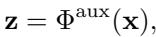
*Equation 5: Equation extracted by MinerU.*

> 💡 **Equation 5 批读**: 公式通常定义过程、loss 或更新规则；建议把符号对应到输入、模型、记忆/控制变量与输出。

where the latent introduction is outsourced to auxiliary model $\Phi ^ { a u x } ( \cdot )$ to replenish the host model $\Phi ^ { b a c k } ( \cdot )$ , then $\mathbf { z }$ will be injected into the autoregressive process in Equation 2.

> 💡 **批注**: 这段是 one-step SR 主线：关注效率、保真-真实感权衡、扩散/flow 先验或单步生成路径。

This paradigm introduces a functional division of labour: the host model retains responsibility for downstream prediction, while the auxiliary model either shapes its learning objective or enriches its internal representations. The resulting works bifurcate cleanly into two families according to what the auxiliary model contributes: Supervision-oriented approaches that provide training signals, and Feature-oriented approaches that provide intermediate representations.

> 💡 **批注**: 这段是 one-step SR 主线：关注效率、保真-真实感权衡、扩散/flow 先验或单步生成路径。

Supervision-oriented Auxiliary Model. For the methods in this paradigm, the auxiliary models supply signals that guide the host model with semantic constraints, regularization, and supervision. The most direct strategy is to leverage another language model serving as a teacher to generate expressive traces. For instance, HCoT [122] and LaViT [227] instantiate assistant models to generate explicit reasoning chains, whose internal representations are then distilled into the host hidden states. SoftCoT [243] extends this paradigm by projecting the auxiliary chain into a continuous latent embedding rather than discrete token sequences, yielding soft supervision compatible with gradient-based fine-tuning. For finer-grained supervision, some methods focus on aligning the host latent representations with those of an external reference model. SIM-CoT [220] and SemCoT [61] couple addition models whose hidden states function as semantic anchors, and train the host to reproduce these representations within its own latent space via a contrastive objective.

> 💡 **批注**: 这段是 one-step SR 主线：关注效率、保真-真实感权衡、扩散/flow 先验或单步生成路径。

Another group treats the auxiliary model as a state generator whose outputs define structured training targets over latent trajectories. CTRLS [226] uses a small LLM to synthesise intermediate reasoning states that serve as exploration waypoints within the host latent space. LatentEvolve [274] extends this idea to evolutionary optimisation, employing an auxiliary model to generate candidate token sequences that drive iterative refinement of memory representations. CoLT [293] takes a more task-specific stance, assigning a tinyscale auxiliary model to decompose latent tool-calling states into interpretable intermediate representations that supervise the internal planning phase.

> 💡 **批注**: 这段是 latent memory / medical VLM 主线：关注视觉证据如何进入 latent space、如何被记忆/更新/调用，以及是否能支撑可靠诊断。

Feature-oriented Auxiliary Model. These auxiliary models shift the locus to features available for the host model, generating and injecting intermediate representations directly into the computation graph. This paradigm is especially prevalent in multimodal and embodied settings, where the heterogeneity between modalities, i.e., language, vision, and action, creates representational bottlenecks. A sizeable cohort of methods employs dedicated vision models whose outputs supplement or supplant the host’s own visual representations. CoVT [156] frames this injection as a chain of visual thought, wherein auxiliary vision models iteratively construct intermediate visual representations analogous to the token-level reasoning steps of textual CoT. 3DThinker [28] pairs a specialised 3D foundation model that provides spatially-grounded geometric priors. Further works, including LaRe [135], MM-CoT [171], and VaLR [73], leverage diffusion-architected generative models. Given a visual input, they reconstruct or imagine visual states whose latent codes are fed to the host model as an enriched perceptual context, enabling forms of visual imagination. OneLatent [133] and RoT [216] use a vision encoder to render textual reasoning into latent visual spaces. In addition, SkiLa [197] and VL-JEPA [21] further explore vision projection in generative and self-supervised regimes, respectively.

> 💡 **批注**: 这段是 one-step SR 主线：关注效率、保真-真实感权衡、扩散/flow 先验或单步生成路径。

In embodied and autonomous systems, the role of the auxiliary model shifts to policy grounding and environment perception. UniVLA [14] incorporates a dedicated vision encoder to generate task-specific feature sequences, and SSM-VLA [19] introduces a VLM-based auxiliary that bridges visual perception and motor action within a state-space framework. SwiftVLA [142] and LaST-VLA [132] introduce spatial-temporal information through vision auxiliary, proving particularly beneficial for long-horizon manipulation tasks that demand coherent temporal reasoning. In autonomous driving, LCDrive [187] and DW-VLA [75] incorporate world models and extra vision encoders, respectively, as auxiliary feature sources, grounding consistent representations of scene dynamics. Future-VLA [44] takes this further by conditioning action generation on auxiliary-predicted future visual features, effectively rendering the auxiliary model as a predictive look-ahead mechanism. In addition, WholeBodyVLA [77] and LatentVLA [235] extend this to whole-body humanoid control by employing a latent action model as a feature encoder whose representations capture joint-level coordination structure.

> 💡 **批注**: 这段是 latent memory / medical VLM 主线：关注视觉证据如何进入 latent space、如何被记忆/更新/调用，以及是否能支撑可靠诊断。

Summary. The auxiliary-model paradigm introduces latent guidance through an external model rather than the backbone itself. Such auxiliary models either provide supervision signals to shape the backbone’s latent space or supply intermediate features that enrich its internal computation, making this paradigm particularly effective for complex reasoning, multimodal understanding, and embodied decision-making.

> 💡 **批注**: 这段是 one-step SR 主线：关注效率、保真-真实感权衡、扩散/flow 先验或单步生成路径。

# 4.2 Representation

The transition from discrete token sequences to the continuous latent space $\mathcal { H }$ necessitates a precise definition of the core information carrier: the latent representation $\textbf { z } \in \ \mathcal { H }$ . Unlike discrete tokens $\textbf { x } \in { \mathcal { V } }$ , which are constrained to a predefined vocabulary, latent representations reside on a continuous, high-dimensional manifold, enabling substantially richer semantic expressivity [8, 58, 243].

Two central questions motivate the study of these methods: what information does a latent representation encode, and how is it integrated into the generative pipeline? The answers fundamentally determine the representational capacity, training dynamics, and generalization behavior of the resulting system. To provide a coherent organizational framework, we propose a taxonomy that classifies existing methods along two orthogonal axes: the subject of the representation (how $\mathbf { z }$ is structurally constructed, i.e., whether it is computed natively within the backbone or generated by a structurally independent module) and its parameterization (whether the construction process relies on fixed model states or incorporates dedicated trainable modules). As illustrated in Figure 6 and Table 4, the intersection of these axes yields a comprehensive taxonomy comprising four distinct paradigms, detailed as follows:

> 💡 **批注**: 这段是 one-step SR 主线：关注效率、保真-真实感权衡、扩散/flow 先验或单步生成路径。

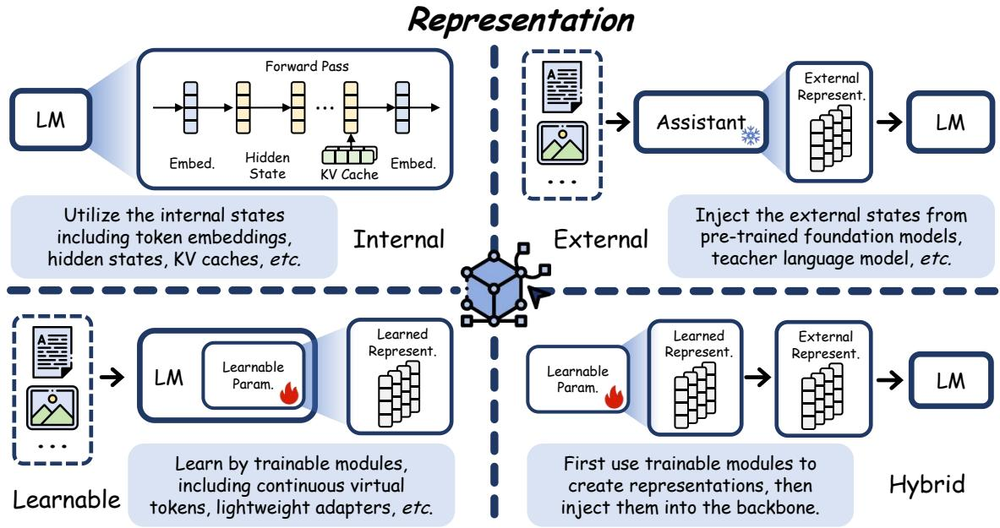
*Figure 6: Figure 6 The schematic diagram of Representation mechanism, including four sub-types: Internal (Section 4.2.1), External (Section 4.2.2), Learnable (Section 4.2.3), and Hybrid (Section 4.2.4).*

> 💡 **Figure 6 批读**: 这张图通常承担方法框架、动机或视觉对比作用；重点看它支撑的是机制、效果还是局限。

Figure 6 The schematic diagram of Representation mechanism, including four sub-types: Internal (Section 4.2.1), External (Section 4.2.2), Learnable (Section 4.2.3), and Hybrid (Section 4.2.4).

> 💡 **批注**: 这是实验证据段：同时看主指标、消融、效率和案例，判断 claim 是否被支撑。

# Mechanism: Representation

• Internal (Section 4.2.1): operates directly on activations produced during the backbone’s forward pass, including token embeddings, intermediate hidden states, and KV caches. • External (Section 4.2.2): derived from a structurally independent auxiliary system (e.g., a pre-trained encoder), and injects these exogenous signals into the backbone as conditioning inputs or supervision targets while the auxiliary source remains frozen. • Learnable (Section 4.2.3): constructed by dedicated trainable modules (e.g., continuous virtual tokens or lightweight adapters) that are embedded directly into the backbone and optimized end-to-end under specific task objectives. • Hybrid (Section 4.2.4): combines the Learnable and External paradigms sequentially by first using trainable modules to create specialized representations, then injecting these states as exogenous signals into the backbone for conditioning or latent supervision.

> 💡 **列表批读**: 这组条目通常是在列贡献、设置、发现或模块；建议逐条对应到论文 claim。

# 4.2.1 Internal

In the internal paradigm, $\mathbf { z }$ is derived exclusively from endogenous activations generated during the backbone’s standard forward pass, without introducing any additional parameters. Let $\Phi ^ { \mathrm { b a c k } }$ consist of $L$ transformer blocks decomposed as:

> 💡 **批注**: 这是实验证据段：同时看主指标、消融、效率和案例，判断 claim 是否被支撑。

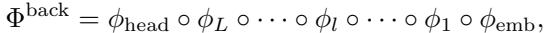
*Equation 6: Equation extracted by MinerU.*

> 💡 **Equation 6 批读**: 公式通常定义过程、loss 或更新规则；建议把符号对应到输入、模型、记忆/控制变量与输出。

where $\phi _ { \mathrm { e m b } } : \mathcal { V }  \mathbb { R } ^ { d }$ maps discrete tokens to continuous embeddings via the embedding matrix $\mathbf { E } \in \mathbb { R } ^ { | \mathcal { V } | \times d }$ each transformer block $\phi _ { l } : \mathbb { R } ^ { d \times T ^ { \prime } }  \mathbb { R } ^ { d \times T ^ { \prime } }$ processes the full sequence of $T$ tokens, and $\phi _ { \mathrm { h e a d } }$ projects the final hidden states back to the vocabulary space. Let $\mathbf { h } _ { l } ^ { t } \in \mathbb { R } ^ { d }$ denote the hidden state of token $t$ at layer $\it l$ , and let $\mathbf { H } _ { l } = \left| \mathbf { h } _ { l } ^ { 1 } , \ldots , \mathbf { h } _ { l } ^ { T } \right| \in \mathbb { R } ^ { T \times d }$ collect all token states at layer $\it l$ . The latent representation is then a deterministic readout:

> 💡 **批注**: 这段信息较密，建议拆成“问题/设定 → 方法/机制 → 结果/影响”三层读。

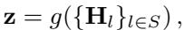
*Equation 7: Equation extracted by MinerU.*

> 💡 **Equation 7 批读**: 公式通常定义过程、loss 或更新规则；建议把符号对应到输入、模型、记忆/控制变量与输出。

where $g ( \cdot )$ is a parameter-free aggregation function applied over the set of layer activations $S$ (e.g., index selection, mean pooling across tokens, or a fixed linear combination over layers). Depending on which

> 💡 **批注**: 这是实验证据段：同时看主指标、消融、效率和案例，判断 claim 是否被支撑。

Table 4 Overview of the Internal (Section 4.2.1), External (Section 4.2.2), Learnable (Section 4.2.3), and Hybrid (Section 4.2.4) representation. We compare the modality, backbone, representation subject, and scenario.

> 💡 **批注**: 这是实验证据段：同时看主指标、消融、效率和案例，判断 claim 是否被支撑。

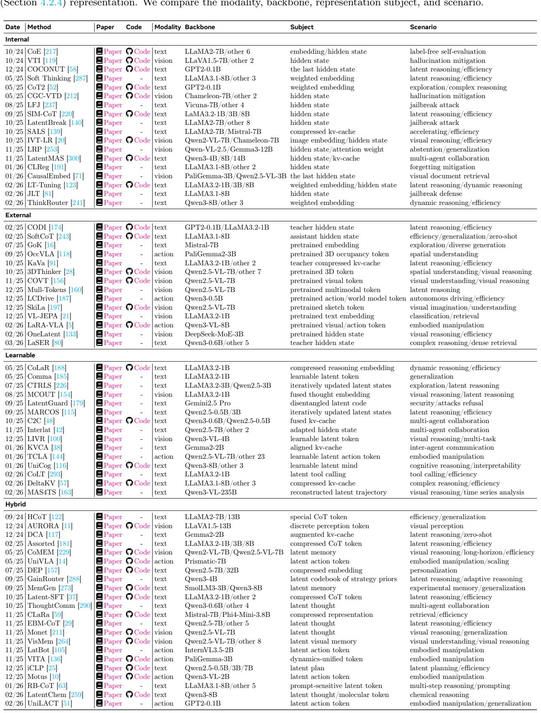
*Table 4: Table 4 Overview of the Internal (Section 4.2.1), External (Section 4.2.2), Learnable (Section 4.2.3), and Hybrid (Section 4.2.4) representation. We compare the modality, backbone, representation subject, and scenario.*

> 💡 **Table 4 批读**: 表格要看主指标、次指标与效率/鲁棒性是否一致支持论文 claim。

activation type is extracted, internal representations manifest in three principal forms: Hidden State, Weighted Embedding, and Cache.

Internal Hidden State. As the most prevalent form, intermediate activations are extracted to provide a continuous summary of the model’s evolving computation. Common instantiations include taking the last hidden state of position $T$ , or computing a mean-pooled representation across all tokens at a particular layer $\it { \Delta } l$

> 💡 **批注**: 这段是 one-step SR 主线：关注效率、保真-真实感权衡、扩散/flow 先验或单步生成路径。

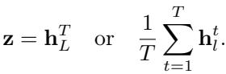
*Equation 8: Equation extracted by MinerU.*

> 💡 **Equation 8 批读**: 公式通常定义过程、loss 或更新规则；建议把符号对应到输入、模型、记忆/控制变量与输出。

For example, COCONUT [58] establishes a foundational pattern for continuous generation by feeding the last hidden state directly back as the next input embedding, bypassing discrete vocabulary projection and forming a recurrent loop of continuous “thoughts”. SIM-CoT [220] and LatentMAS [300] adopt this recurrent paradigm. Beyond direct generation, the rich semantic geometry of hidden states proves valuable in downstream applications. For instance, CoE [217] constructs chains of embeddings from pooled hidden states to perform label-free self-evaluation. In multimodal settings, internal activations frequently serve as diagnostic and corrective signals: VTI [119] and CGC-VTD [212] dynamically probe intermediate hidden states to detect and mitigate visual hallucinations. Final hidden states have also been repurposed as compressed visual-semantic summaries: IVT-LR [20] fuses them with image embeddings for efficient visual reasoning, while CausalEmbed [71] projects them into dense representations for visual document retrieval. Because these states natively encode pre-trained knowledge, CLReg [191] further leverages them as a regularizer to mitigate catastrophic forgetting. The high expressivity of endogenous states is, however, a double-edged sword from a security perspective. On the offensive side, LFJ [237] and LatentBreak [140] exploit hidden-state vulnerabilities to mount latent jailbreak attacks that bypass discrete text-level filters. Conversely, JLT [81] monitors these same signals defensively, using them to detect malicious intent and improve jailbreak robustness.

> 💡 **批注**: 这段是 latent memory / medical VLM 主线：关注视觉证据如何进入 latent space、如何被记忆/更新/调用，以及是否能支撑可靠诊断。

Internal Weighted Embedding. This form replaces hard token sampling with a soft, probability-weighted combination over the vocabulary embedding matrix $\mathbf { E } \in \mathbb { R } ^ { | \mathcal { V } | \times d }$ . Let $\pmb { \alpha } \in \mathbb { R } ^ { | \nu | }$ denote a weight vector derived from the model’s output logits (i.e., via softmax); the latent representation is:

> 💡 **批注**: 这段是 one-step SR 主线：关注效率、保真-真实感权衡、扩散/flow 先验或单步生成路径。

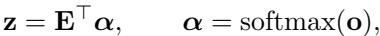
*Equation 9: Equation extracted by MinerU.*

> 💡 **Equation 9 批读**: 公式通常定义过程、loss 或更新规则；建议把符号对应到输入、模型、记忆/控制变量与输出。

where $\mathbf { o } \in \mathbb { R } ^ { | \nu | }$ denotes the pre-softmax logits. Because $\pmb { \alpha }$ lies in the probability simplex, $\mathbf { z }$ is constrained to the convex hull of the vocabulary embedding vectors.

This differentiable relaxation forms a superposition of candidate token embeddings [52, 287], enabling gradient flow through the discrete generation step and facilitating parallel exploration of the reasoning space. LT-Tuning [123] builds on this property with a context-prediction fusion mechanism that exploits predictive semantic guidance from the vocabulary embedding space to construct robust latent thoughts. ThinkRouter [241] further leverages the continuous nature of $\mathbf { z }$ for confidence-aware routing, dynamically switching between continuous latent thinking and discrete token generation based on model uncertainty.

> 💡 **批注**: 这段是 one-step SR 主线：关注效率、保真-真实感权衡、扩散/flow 先验或单步生成路径。

Internal Cache. The third form treats accumulated key-value pairs as structured latent memory, enabling efficient context reuse without recomputation. Given the hidden states $\mathbf { H } _ { l } \in \mathbb { R } ^ { T \times d }$ , the cache representations are computed via learned projection matrices:

> 💡 **批注**: 这段是 latent memory / medical VLM 主线：关注视觉证据如何进入 latent space、如何被记忆/更新/调用，以及是否能支撑可靠诊断。

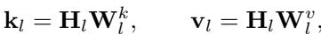
*Equation 10: Equation extracted by MinerU.*

> 💡 **Equation 10 批读**: 公式通常定义过程、loss 或更新规则；建议把符号对应到输入、模型、记忆/控制变量与输出。

where $\mathbf { W } _ { l } ^ { k } , \mathbf { W } _ { l } ^ { v } \in \mathbb { R } ^ { d \times d _ { k } }$ project the sequence into the key and value spaces of the attention heads.

By treating these compressed tensors as operational memory, SALS [139] exploits sparse attention patterns over the KV cache to accelerate inter-step computation and improve inference efficiency. LatentMAS [300] extends this to multi-agent collaboration, using the KV cache as a shared, continuous working memory that enables agents to coordinate without explicit textual communication. In the multimodal domain, LRP [253] combines attention weights and hidden states to capture richer visual semantics, demonstrating improved abstraction and generalization on complex visual tasks.

> 💡 **批注**: 这段是 latent memory / medical VLM 主线：关注视觉证据如何进入 latent space、如何被记忆/更新/调用，以及是否能支撑可靠诊断。

Summary. The internal paradigm converts endogenous model activations into parameter-free latent representations, entirely bypassing the discrete vocabulary bottleneck. By treating standard computational byproducts as versatile semantic assets, it demonstrates that intrinsic model states carry sufficient representational capacity to support continuous reasoning, accelerate inference, and enable robust downstream analysis.

> 💡 **批注**: 这段是 one-step SR 主线：关注效率、保真-真实感权衡、扩散/flow 先验或单步生成路径。

# 4.2.2 External

In the external paradigm, $\mathbf { z }$ originates from an auxiliary encoder $\Phi ^ { \mathrm { a u x } }$ that is structurally independent of the backbone. Given an auxiliary input $\bf { x } _ { a u x }$ , which may coincide with $\mathbf { x }$ or belong to a different modality:

> 💡 **批注**: 这段是 one-step SR 主线：关注效率、保真-真实感权衡、扩散/flow 先验或单步生成路径。

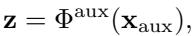
*Equation 11: Equation extracted by MinerU.*

> 💡 **Equation 11 批读**: 公式通常定义过程、loss 或更新规则；建议把符号对应到输入、模型、记忆/控制变量与输出。

where $\Phi ^ { \mathrm { a u x } }$ is kept frozen during backbone training. Because $\Phi ^ { \mathrm { a u x } }$ and $\Phi ^ { \mathrm { b a c k } }$ operate in distinct latent manifolds with potentially mismatched dimensionalities ( $d _ { \mathrm { a u x } } \neq d _ { \mathrm { b a c k } }$ ), $\mathbf { z }$ requires explicit structural alignment before integration. Depending on its functional role, this paradigm operates in two modes.

> 💡 **批注**: 这段是 one-step SR 主线：关注效率、保真-真实感权衡、扩散/flow 先验或单步生成路径。

First, as a conditioning input to guide backbone generation, $\mathbf { z }$ is first aligned to the backbone’s native latent space via a learned projection $\psi : \mathbb { R } ^ { d _ { \mathrm { a u x } } }  \mathbb { R } ^ { d _ { \mathrm { b a c k } } }$ (e.g., a linear map or MLP), and the backbone conditions its output on the projected signal:

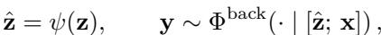
*Equation 12: Equation extracted by MinerU.*

> 💡 **Equation 12 批读**: 公式通常定义过程、loss 或更新规则；建议把符号对应到输入、模型、记忆/控制变量与输出。

where [zˆ; x] denotes a latent integration mechanism such as prefix concatenation or cross-attention injection.

Second, as a supervision target for representation alignment or knowledge distillation, $\mathbf { z }$ serves as a dense, non-verbalized supervision target. The backbone’s internal state $\mathbf { h }$ is trained to match the projected external signal. This continuous supervision transfers rich semantic priors from $\Phi ^ { \mathrm { a u x } }$ to the backbone without the information bottleneck imposed by discrete token generation. Based on the modality and functional role of $\Phi ^ { \mathrm { a u x } }$ , we identify three directions: Reasoning Priors, Perceptual Priors, and Embodied Priors.

> 💡 **批注**: 这是蒸馏逻辑：重点看 teacher 的什么能力被迁移给 student，以及训练/推理阶段各自保留哪些模块。

External Reasoning Priors. Here, the auxiliary source operates in the semantic domain to supply the backbone with structured logic and cognitive traces. A prevalent strategy is knowledge distillation from an expert reasoning model. CODI [174] formalizes this via a self-distillation loop in which the frozen teacher’s hidden states serve as continuous supervision targets, guiding the implicit reasoning of the student. SoftCoT [243] extends this concept to explicit injection: a lightweight assistant model generates speculative reasoning chains that are projected into soft-token embeddings and prepended to the backbone input, creating a gradient-compatible conditioning signal that substantially improves zero-shot generalization. KaVa [91] bypasses intermediate output tokens entirely by distilling the teacher’s compressed KV cache, directly transferring structured attention states as compact latent priors.

> 💡 **批注**: 这段是 one-step SR 主线：关注效率、保真-真实感权衡、扩散/flow 先验或单步生成路径。

External Perceptual Priors. Here, pre-trained vision encoders or specialized multimodal auxiliary models supply spatially, temporally, or structurally rich feature maps to augment a primarily textual backbone. 3DThinker [28] injects spatially grounded 3D tokens from a specialized auxiliary network to supply geometric priors that the base model cannot derive from two-dimensional inputs alone. SkiLa [197] leverages pre-trained sketch tokens to interleave intermediate visual thoughts with textual reasoning, explicitly grounding the model’s spatial understanding. VL-JEPA [21] employs pre-trained embeddings from a predictive-coding model in an abstract representation space to improve cross-modal classification and retrieval. COVT [156] uses an auxiliary vision model to iteratively extract visual tokens and fuse them into the backbone to construct continuous visual thought chains. OneLatent [133] demonstrates that hidden states from a strong visionlanguage model can condense rich perceptual and OCR context into a single latent token for highly efficient visual reasoning. Mull-Tokens [160] generalizes this injection with modality-agnostic latent tokens derived from an auxiliary system, enabling uniform latent reasoning across both linguistic and visual substrates.

> 💡 **批注**: 这段是 latent memory / medical VLM 主线：关注视觉证据如何进入 latent space、如何被记忆/更新/调用，以及是否能支撑可靠诊断。

External Embodied Priors. This direction, prevalent in embodied models and autonomous driving, relies on auxiliary models to generate structured latent representations of environmental dynamics, 3D geometry, and future actions. OccVLA [118] applies pre-trained 3D occupancy tokens as a supervisory signal to impart fine-grained spatial understanding without requiring explicit 3D inputs at inference time. LCDrive [187] incorporates an external world model to generate action and scene tokens that inject temporally consistent representations of scene dynamics, grounding the host model’s navigational reasoning. LaRA-VLA [5] bridges continuous perception and motor control by utilizing pre-trained visual and action tokens, enabling a smooth transition from explicit multimodal supervision to internalized latent reasoning for complex embodied manipulation.

> 💡 **批注**: 这段是 latent memory / medical VLM 主线：关注视觉证据如何进入 latent space、如何被记忆/更新/调用，以及是否能支撑可靠诊断。

Summary. The external paradigm provides a principled approach to bridging modality gaps and circumventing the discrete token bottleneck by injecting structured knowledge from independent auxiliary systems. By aligning reasoning, perceptual, and embodied priors as either dynamic conditioning signals or dense supervision targets, it endows the backbone with continuous reasoning capabilities and complex structural constraints — without modifying the backbone’s parameters. This demonstrates that a foundation model’s representational scope is not strictly bounded by its native architecture: leveraging specialized latent priors offers a scalable pathway to expand semantic reach while keeping the backbone largely frozen.

> 💡 **批注**: 这段是 one-step SR 主线：关注效率、保真-真实感权衡、扩散/flow 先验或单步生成路径。

# 4.2.3 Learnable

In the learnable paradigm, $\mathbf { z }$ is actively constructed by a parameterized module $\Phi ^ { \mathrm { c o m p } }$ with learnable parameters $\theta$ that is directly embedded within the backbone architecture (e.g., continuous virtual tokens or lightweight adapters). Let c denote an optional conditioning context, such as the input $\mathbf { x }$ , intermediate hidden states $\mathbf { h }$ , or the empty set ( $\mathbf c = \emptyset$ ). The latent representation is formulated as:

> 💡 **批注**: 这是实验证据段：同时看主指标、消融、效率和案例，判断 claim 是否被支撑。

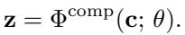
*Equation 13: Equation extracted by MinerU.*

> 💡 **Equation 13 批读**: 公式通常定义过程、loss 或更新规则；建议把符号对应到输入、模型、记忆/控制变量与输出。

Unlike the external paradigm, $\Phi ^ { \mathrm { c o m p } }$ is structurally coupled with the backbone. The parameters $\theta$ are optimized end-to-end driven by specific task objectives (either independently with a frozen backbone or jointly with $\theta ^ { \mathrm { b a c k } }$ ). Depending on the targeted optimization objective, learnable representations manifest in three primary forms: Compression Learning, Distribution Learning, and Alignment Learning.

> 💡 **批注**: 这是实验证据段：同时看主指标、消融、效率和案例，判断 claim 是否被支撑。

Compression Learning. The first class is driven by information-bottleneck principles, optimizing $\Phi ^ { \mathrm { c o m p } }$ to compress explicit data into dense, continuous vectors. CoLaR [188] learns to aggregate consecutive reasoning tokens into compressed embeddings using a variance-preserving scaling factor. CoLT [293] employs supervised learning to condense long reasoning trajectories into continuous seed tokens for parametric tool calls. In the multimodal domain, LIVR [100] imposes a visual bottleneck during training, requiring the model to learn implicit spatial compressions without relying on explicit textual descriptions. At the memory level, DeltaKV [57] encodes residual differences between successive cache states to substantially compress long-term reasoning overhead.

> 💡 **批注**: 这段是 latent memory / medical VLM 主线：关注视觉证据如何进入 latent space、如何被记忆/更新/调用，以及是否能支撑可靠诊断。

Distribution Learning. The second class abandons deterministic point mappings, instead optimizing $\Phi ^ { \mathrm { c o m p } }$ to capture the underlying stochastic distributions and structural manifolds of reasoning. CTRLS [226] formulates reasoning as a Markov decision process and models state transitions via Dirichlet distributions to capture epistemic uncertainty. MARCOS [115] employs a conditional hidden Markov model with step-level latent variables, relying on variational training to learn stochastic continuous representations. UniCog [116] formulates cognitive distributions as a latent variable model, optimizing an evidence lower bound to project activations into a high-dimensional sparse space. LatentGuard [179] learns to model the latent space using a VAE, manipulating the resulting semantic distributions to enable robust refusal of adversarial inputs.

> 💡 **批注**: 这段是 one-step SR 主线：关注效率、保真-真实感权衡、扩散/flow 先验或单步生成路径。

Alignment Learning. The third class optimizes $\Phi ^ { \mathrm { c o m p } }$ to construct cross-space projections, bridging rigid boundaries such as distinct modalities or heterogeneous agent architectures. KVCA [38] learns a globally shared latent manifold $\Sigma$ via cross-attention to translate KV caches between architecturally heterogeneous models. C2C [48] trains a neural MLP to directly project KV caches between specific models by aligning their terminal-layer representations. Interlat [42] optimizes communication adapters via a weighted Jensen-Shannon divergence to align transmitted hidden states with the receiving agent’s internal representations. This paradigm also bridges modalities: MCOUT [154] learns cross-modal attention fusion while penalizing entropy collapse; MAS4TS [163] learns to reconstruct predictive numerical trajectories from visual time-series plots; and TCLA [144] aligns noisy observational signals with clean, VLM-prompted latent action targets for embodied manipulation.

> 💡 **批注**: 这段是 one-step SR 主线：关注效率、保真-真实感权衡、扩散/flow 先验或单步生成路径。

Summary. The learnable paradigm excels at acquiring latent structures explicitly optimized for specific downstream objectives, breaking free from the rigid semantic boundaries imposed by textual pre-training. This flexibility allows models to encode non-verbal modalities (e.g., complex spatial layouts and embodied actions) and support high-bandwidth inter-agent collaboration. However, granting unconstrained optimization access to continuous spaces introduces the risk of manifold overfitting: modules may memorize the noise in supervision signals, yielding highly specialized representations that sacrifice zero-shot generalization. Rigorous regularization, including enforced structural sparsity, variance-preserving normalizations, and controlled belief-shift tuning, which is therefore essential to maintain broad utility.

> 💡 **批注**: 这段是 one-step SR 主线：关注效率、保真-真实感权衡、扩散/flow 先验或单步生成路径。

# 4.2.4 Hybrid

The hybrid paradigm utilizes a dedicated, structurally independent module $\Phi ^ { \mathrm { c o m p } }$ with learnable parameters $\theta$ to construct a structured latent representation. Let $\mathbf { c }$ denote a conditioning context drawn from the input $\mathbf { x }$ or auxiliary features. The hybrid representation is formulated as:

> 💡 **批注**: 这是实验证据段：同时看主指标、消融、效率和案例，判断 claim 是否被支撑。

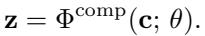
*Equation 14: Equation extracted by MinerU.*

> 💡 **Equation 14 批读**: 公式通常定义过程、loss 或更新规则；建议把符号对应到输入、模型、记忆/控制变量与输出。

Crucially, unlike the Learnable paradigm, $\Phi ^ { \mathrm { c o m p } }$ remains architecturally disjoint from the backbone $\Phi ^ { \mathrm { b a c k } }$ Once constructed, $\mathbf { z }$ is deployed in the same manner as the External paradigm: it acts either as an exogenous conditioning signal injected into a typically frozen backbone (serving as a learned alignment bridge), or as a rich, optimized supervision target for latent distillation. This approach can be summarized into three functional categories: Traces, Grounding, and Augmentation.

> 💡 **批注**: 这段是 latent memory / medical VLM 主线：关注视觉证据如何进入 latent space、如何被记忆/更新/调用，以及是否能支撑可靠诊断。

Traces. The first branch distills discrete reasoning trajectories into compact continuous vectors that guide the backbone without the latency of explicit chain-of-thought generation. HCoT [122] compresses multi-step reasoning into a specialized thought token injected into a frozen decoder to accelerate inference. Assorted [181] combines latent and text tokens by compressing reasoning segments via a VQ-VAE codebook. Latent-SFT [37] restricts the latent space to the column space of the pre-trained vocabulary matrix via induction-supervision masking. EBM-CoT [29] refines thought trajectories toward lower-energy regions via Langevin dynamics calibration. GainRouter [288] learns a codebook of discrete strategy priors to condition single-pass decoding on continuous thinking vectors. ThoughtComm [290] employs a sparsity-regularized autoencoder to transmit latent thoughts between agents. For specialized domains, LatentChem [259] aligns projected molecular representations with linguistic spaces, while iCLP [25] and RB-CoT [63] generate prompt-sensitive latent plans to guide multi-step reasoning.

> 💡 **批注**: 这段是 one-step SR 主线：关注效率、保真-真实感权衡、扩散/flow 先验或单步生成路径。

Grounding. The second branch translates continuous sensory or control signals into structured latent tokens, grounding the frozen backbone in physical reality. In the visual domain, AURORA [11] trains a VQ-VAE to produce discrete visual latent codes that enhance spatial perception, while Monet [211] generates continuous embeddings as intermediate visual thoughts via multi-stage distillation. In embodied robotics, UniVLA [14] derives task-centric latent actions from heterogeneous videos and projects them into a unified action space. LatBot [105] decomposes latent actions into discrete motion and scene tokens; Motus [10] extracts pixel-level delta actions via optical flow; UniLACT [51] constructs depth-aware latent action representations from RGB-D frames; and VITA [136] maps visual-action dynamics into unified codebooks.

> 💡 **批注**: 这段是 latent memory / medical VLM 主线：关注视觉证据如何进入 latent space、如何被记忆/更新/调用，以及是否能支撑可靠诊断。

Augmentation. The third branch condenses large contextual histories into compressed soft prompts or dynamically augmented cache states, extending effective context beyond standard window limits. DCA [117] generates latent embeddings via an offline coprocessor and appends them directly to the KV cache, enriching context without altering the decoding architecture. CLaRa [59] encodes lengthy documents into compact memory tokens via a salient compressor trained on synthetic data, enabling end-to-end optimization of the retrieval representation space. DEP [157] isolates user-specific interaction patterns via a sparse autoencoder and injects them as soft prompts for personalized generation. In multimodal settings, VisMem [264] and CoMEM [229] construct dedicated visual memory tokens that distill episodic experiences for long-horizon planning, while MemGen [273] integrates episodic representations into computation for self-evolving behavior.

> 💡 **批注**: 这段是 latent memory / medical VLM 主线：关注视觉证据如何进入 latent space、如何被记忆/更新/调用，以及是否能支撑可靠诊断。

Summary. Hybrid representations are particularly suited to complex, multimodal, or domain-specialized settings in which the gap between raw inputs and the backbone’s textual manifold creates bottlenecks that neither purely internal nor purely learnable approaches can adequately resolve. By first constructing a task-specific latent representations via targeted learnable acquisition and subsequently deploying it as a structured external conditioning signal, hybrid approaches achieve a dual advantage: semantic fidelity, grounding representations in the raw input modality; and computational efficiency, sparing the backbone from processing raw, high-dimensional inputs at inference time.

> 💡 **批注**: 这段是 latent memory / medical VLM 主线：关注视觉证据如何进入 latent space、如何被记忆/更新/调用，以及是否能支撑可靠诊断。

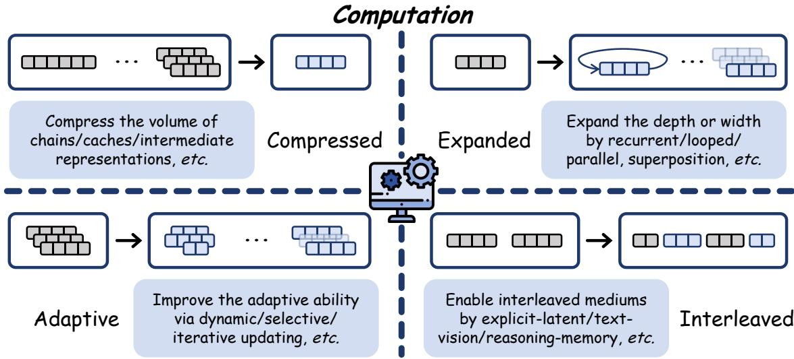
*Figure 7: Figure 7 The schematic diagram of Computation mechanism, including four sub-types: Compressed (Section 4.3.1), Expanded (Section 4.3.2), Adaptive (Section 4.3.3), and Interleaved (Section 4.3.4).*

> 💡 **Figure 7 批读**: 这张图通常承担方法框架、动机或视觉对比作用；重点看它支撑的是机制、效果还是局限。

Figure 7 The schematic diagram of Computation mechanism, including four sub-types: Compressed (Section 4.3.1), Expanded (Section 4.3.2), Adaptive (Section 4.3.3), and Interleaved (Section 4.3.4).

> 💡 **批注**: 这是实验证据段：同时看主指标、消融、效率和案例，判断 claim 是否被支撑。

# 4.3 Computation

In recent years, research on latent-level computation has advanced rapidly, reflecting a broader departure from the conventional paradigm in which language models perform inference through fixed-depth, token-by-token generation [46, 297]. Instead, a growing body of work aims to equip models with more flexible, efficient, and scalable computational mechanisms by shifting part of the reasoning process to the latent space.

> 💡 **批注**: 这段是 one-step SR 主线：关注效率、保真-真实感权衡、扩散/flow 先验或单步生成路径。

To enable a systematic analysis, a central question to consider is: what kinds of computational operations are performed in the latent space? From this perspective, existing methods can be organized along the dimension of operation, yielding four major categories. Specifically, based on their underlying computational operations, as illustrated in Figure 7 and Table 5, we classify existing approaches into four representative types:

> 💡 **批注**: 这是实验证据段：同时看主指标、消融、效率和案例，判断 claim 是否被支撑。

# Mechanism: Computation

• Compressed (Section 4.3.1): reduces the volume of explicit traces, internal states and crossmodal features, enhancing the efficiency while preserving expressiveness.   
• Expanded (Section 4.3.2): increases the effective computation by expanding computation along depth or width by recurrent, looped, parallel, superposition, and structural designs, enabling higher information bandwidth.   
• Adaptive (Section 4.3.3): allocates computation adaptively instead of a fixed budget by dynamic depth, width, shortcuts, halting, semantic-unit boundaries adaptation, and control adaptation, balancing capacity and efficiency flexibly.   
• Interleaved (Section 4.3.4): interleave heterogeneous generation medias to bridge explicit-latent, language-vision, reasoning-memory, or planning-perception.

> 💡 **列表批读**: 这组条目通常是在列贡献、设置、发现或模块；建议逐条对应到论文 claim。

# 4.3.1 Compressed

This paradigm subsumes approaches that project an explicit trajectory $\mathbf { r } \in \mathcal { V }$ onto a semantically dense latent representation $\mathbf { z }$ . A compression operator $\Phi ( \cdot )$ acts upon the intermediate hidden states $\mathbf { h }$ to yield:

> 💡 **批注**: 这段是 one-step SR 主线：关注效率、保真-真实感权衡、扩散/flow 先验或单步生成路径。

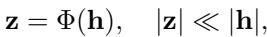
*Equation 15: Equation extracted by MinerU.*

> 💡 **Equation 15 批读**: 公式通常定义过程、loss 或更新规则；建议把符号对应到输入、模型、记忆/控制变量与输出。

where $\Phi ( \cdot )$ may be realized as both a functional component $\Phi ^ { c o m p } ( \cdot )$ or the backbone $\Phi ^ { \mathrm { b a c k } }$ itself, reducing autoregressive overhead while preserving the semantic fidelity requisite for faithful downstream decoding.

> 💡 **批注**: 这段是 one-step SR 主线：关注效率、保真-真实感权衡、扩散/flow 先验或单步生成路径。

Table 5 Overview of the Compressed (Section 4.3.1), Expanded (Section 4.3.2), Adaptive (Section 4.3.3), and Interleaved

> 💡 **批注**: 这是实验证据段：同时看主指标、消融、效率和案例，判断 claim 是否被支撑。

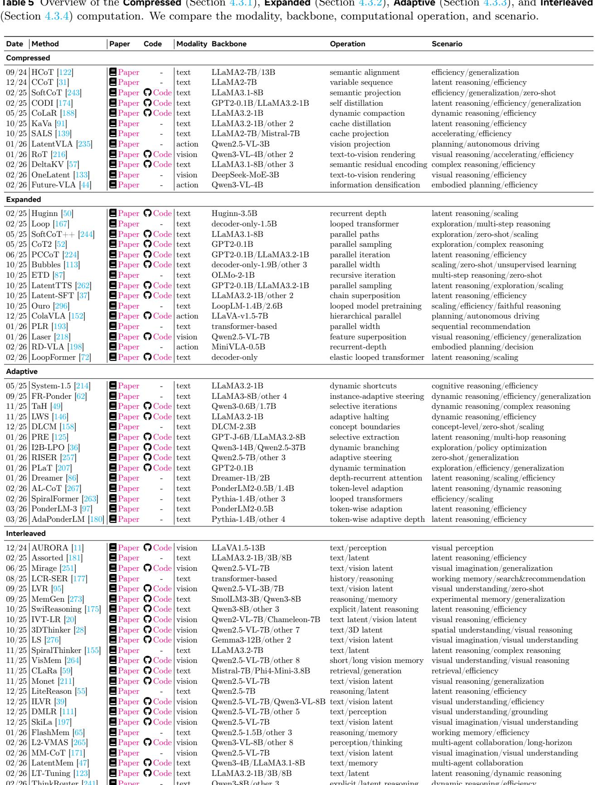
*Table 5: Table 5 Overview of the Compressed (Section 4.3.1), Expanded (Section 4.3.2), Adaptive (Section 4.3.3), and Interleaved*

> 💡 **Table 5 批读**: 表格要看主指标、次指标与效率/鲁棒性是否一致支持论文 claim。

Compressed computation aims to reduce the cost of explicit intermediate computation by mapping verbose reasoning trajectories or high-dimensional hidden states into compact latent representations, while preserving the semantic information necessary for accurate downstream decoding. Rather than eliminating reasoning altogether, this paradigm seeks to retain inferential content in a more information-dense form, thereby improving efficiency across textual, internal, and cross-modal reasoning processes in three forms: Traces Compression, States Compression, and Features Compression.

Traces Compression. Recent work on this direction can be organized around a shared goal: preserving inferential fidelity while reducing explicit trace lengths. HCoT [122] and SoftCoT [243] emphasize semantic alignment across abstraction levels, with HCoT [122] using hierarchical compression to skip redundant intermediate tokens and SoftCoT [243] projecting reasoning into a continuous soft-token space that decouples reasoning depth from discrete trace length, thereby supporting zero-shot transfer without task-specific retraining. In parallel, CCoT [31] models compression as variable-length latent allocation, assigning shorter representations to simpler inferences and richer ones to more complex deductions, while CODI [174] and CoLaR [188] focus on adaptive compaction through self-distillation and dynamic token-level control, respectively.

> 💡 **批注**: 这段是 one-step SR 主线：关注效率、保真-真实感权衡、扩散/flow 先验或单步生成路径。

States Compression. A complementary and potentially deeper form of compression targets not the decoded token sequence but the internal cache, whose linear growth with sequence length has become a major bottleneck for long-context and reasoning-intensive inference. Recent work explores three main approaches. KaVa [91] formulates KV-cache compression as a knowledge distillation problem, training a student model to match the output distribution of a teacher operating over the full cache. SALS [139] instead adopts a lightweight, training-free strategy by projecting the cache into a low-rank principal subspace, arguing that the dominant directions are sufficient to preserve attention patterns with bounded error. DeltaKV [57] exploits the high correlation between KV-caches across successive reasoning steps, storing semantically compressed residuals rather than full cache states, and reports particularly strong gains on multi-step reasoning tasks where inter-step redundancy is greatest.

> 💡 **批注**: 这段是 one-step SR 主线：关注效率、保真-真实感权衡、扩散/flow 先验或单步生成路径。

Features Compression. Recent work on latent-space compression has moved beyond text to multimodal and embodied settings, where the main bottleneck is the high-dimensional visual and action representations used in perception–action loops such as autonomous driving, robot manipulation, and embodied navigation. In visual reasoning, RoT [216] renders intermediate reasoning states as low-resolution image patches rather than token sequences, enabling subsequent steps to operate over compressed visual structure, OneLatent [133] learns a single latent visual token that distills the image context needed for downstream reasoning, achieving competitive performance with a drastically reduced visual token budget. In embodied control, LatentVLA [235] projects visual inputs into compact action latents for real-time planning, showing that low-dimensional representations can retain the information necessary for closed-loop decision making, while Future-VLA [44] extends this idea by learning future-conditioned latents that incorporate anticipated states without increasing dimensionality.

> 💡 **批注**: 这段是 latent memory / medical VLM 主线：关注视觉证据如何进入 latent space、如何被记忆/更新/调用，以及是否能支撑可靠诊断。

Summary. Overall, compressed reasoning can be understood as a unifying paradigm for trading explicit length for latent density. Across explicit traces, internal states, and cross-modal representations, existing methods share the same central objective: to preserve reasoning fidelity while reducing the computational and memory overhead associated with verbose intermediate representations. This suggests that effective reasoning need not always remain fully tokenized or fully materialized, and that semantically compact representations may provide a scalable foundation for efficient inference in increasingly complex reasoning systems.

> 💡 **批注**: 这段是 latent memory / medical VLM 主线：关注视觉证据如何进入 latent space、如何被记忆/更新/调用，以及是否能支撑可靠诊断。

# 4.3.2 Expanded

In this category, it augments the effective computational capacity of the model by extending latent computation along the depth or width dimensions. Formally, the model iterates over a step- $T$ , width- $K$ :

> 💡 **批注**: 这段是 one-step SR 主线：关注效率、保真-真实感权衡、扩散/flow 先验或单步生成路径。

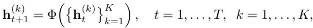
*Equation 16: Equation extracted by MinerU.*

> 💡 **Equation 16 批读**: 公式通常定义过程、loss 或更新规则；建议把符号对应到输入、模型、记忆/控制变量与输出。

where $\mathbf { h } _ { t } ^ { ( k ) }$ denotes the $k$ -th latent trajectory at step $t$ , and all $K$ paths share a common initialization $\mathbf { h } ^ { ( 0 ) }$

> 💡 **批注**: 这段是 one-step SR 主线：关注效率、保真-真实感权衡、扩散/flow 先验或单步生成路径。

Expanded methods increase the effective computational capacity by enlarging the latent process along different dimensions. Rather than relying on a single fixed forward pass, they enable the model to trade extra latent computation for stronger ability, improved faithfulness, and better adaptability across tasks, which could be classified into three types of expansion: Depth Expansion, Width Expansion, and Structural Expansion.

> 💡 **批注**: 这段是 one-step SR 主线：关注效率、保真-真实感权衡、扩散/flow 先验或单步生成路径。

Depth Expansion. Depth-expanding approaches increase effective compute by reusing the same or structurally similar layers across multiple recurrent passes, allowing the model to iteratively refine a latent representation before producing an output. In recurrent pretraining, Huginn [50] introduces a lightweight model trained from scratch with recurrent depth, where a fixed transformer block is applied for a variable number of thinking steps, thereby decoupling parameter count from inference-time compute and enabling test-time scaling without adding parameters. RD-VLA [198] extends this paradigm to embodied models and shows that recurrent latent refinement improves long-horizon manipulation planning. In looped transformers, Loop [167] demonstrates that repeatedly applying the full decoder stack can induce genuinely multi-step reasoning rather than simply approximating a deeper fixed network , while LoopFormer [72] adds inputadaptive looping to allocate depth dynamically according to task complexity . From a pretraining perspective, Ouro [296] shows favorable scaling behavior along the looping dimension, with gains in faithfulness and efficiency . Relatedly, ETD [87] proposes an encode-think-decode framework in which a latent thought state is iteratively refined before decoding, yielding strong zero-shot generalization on arithmetic and commonsense tasks without explicit chain-of-thought supervision.

> 💡 **批注**: 这段是 one-step SR 主线：关注效率、保真-真实感权衡、扩散/flow 先验或单步生成路径。

Width Expansion. These methods contrast with other approaches by allocating compute across multiple parallel hypotheses or latent trajectories, thereby prioritizing broad exploration over sequential refinement. This paradigm appears in several recent frameworks, SoftCoT++ [244] instantiates multiple parallel reasoning paths in continuous embedding space and aggregates them before decoding, achieving zero-shot performance gains that scale monotonically with the number of paths without requiring path-specific supervision. A similar principle underlies LatentTTS [262], which performs concurrent latent tree search and prunes partial hypotheses with a learned value function. PCCoT [224] further extends this idea by enabling multiple latent chains to run in parallel and exchange information at synchronization points, improving efficiency while preserving solution diversity; likewise, CoT2 [52] shows that parallel sampling in continuous thought space substantially benefits even GPT2-scale models on compositional reasoning tasks. In specialized settings, Bubbles [113] formulates width expansion as parallel “bubbles" whose pooled representations support zeroshot and unsupervised learning at scale, while PLR [193] applies parallel latent reasoning to sequential recommendation, where diverse latent representations better capture user preference uncertainty than a single deterministic pass.

> 💡 **批注**: 这段是 latent memory / medical VLM 主线：关注视觉证据如何进入 latent space、如何被记忆/更新/调用，以及是否能支撑可靠诊断。

Structural Expansion. A smaller but conceptually distinct line of work departs from simply increasing the depth or width of the computation graph and instead introduces new topological primitives for composing latent information across positions, modalities, or levels of control. Latent-SFT [37] supervises models on superposed latent chains—continuous compressions of multi-step reasoning trajectories—rather than their token-level realizations, thereby reducing decoding cost while preserving reasoning performance. Extending a similar superposition principle to visual reasoning, Laser [218] fuses multi-scale visual features into a shared latent representation instead of processing each resolution independently. At the system level, ColaVLA [152] decomposes VLA modeling into parallel but interactive high-level semantic reasoning and low-level motor planning streams, linked through cross-attention across temporal scales, which better aligns linguistic abstraction with continuous control.

> 💡 **批注**: 这段是 one-step SR 主线：关注效率、保真-真实感权衡、扩散/flow 先验或单步生成路径。

Summary. In this part, approaches enrich latent reasoning by scaling computation along three complementary dimensions: depth, width, and structure. Depth expansion emphasizes iterative refinement through recurrent or looped computation, width expansion promotes parallel exploration over multiple latent hypotheses, and structural expansion introduces richer topologies for composing information across trajectories, positions, or modalities. Together, these methods share a common goal of improving reasoning performance by increasing effective calculation in latent space, while avoiding a proportional increase in model parameters.

> 💡 **批注**: 这段是 latent memory / medical VLM 主线：关注视觉证据如何进入 latent space、如何被记忆/更新/调用，以及是否能支撑可靠诊断。

# 4.3.3 Adaptive

In this part, methods generalize the Expanded framework by conditioning both recurrence depth $T$ and trajectory width $K$ on the input complexity of $\mathbf { x }$ , rather than prescribing them as fixed hyperparameters. A learned halting functional $\tau$ governs instance-specific termination, yielding a variable-horizon computation:

> 💡 **批注**: 这段是 one-step SR 主线：关注效率、保真-真实感权衡、扩散/flow 先验或单步生成路径。

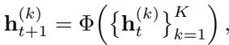
*Equation 17: Equation extracted by MinerU.*

> 💡 **Equation 17 批读**: 公式通常定义过程、loss 或更新规则；建议把符号对应到输入、模型、记忆/控制变量与输出。

where $t \in [ 1 , T ]$ and $k \in \left[ 1 , K \right]$ may be determined at the granularity of tokens boundaries, or other adaptive strategies based on the current hidden states by a halting function $\tau ( \cdot )$ :

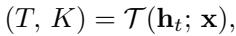
*Equation 18: Equation extracted by MinerU.*

> 💡 **Equation 18 批读**: 公式通常定义过程、loss 或更新规则；建议把符号对应到输入、模型、记忆/控制变量与输出。

where the halting function could be a explicit component, or be internalized the model. This input-conditioned allocation concentrates reasoning depth where warranted by task difficulty, realizing a principled trade-off between computational frugality and expressive capacity.

> 💡 **批注**: 这段是 one-step SR 主线：关注效率、保真-真实感权衡、扩散/flow 先验或单步生成路径。

Adaptive computation allows the model to allocate computational resources dynamically according to the complexity of the input, rather than relying on a fixed recurrence depth or trajectory width. In this setting, the amount, structure, and locus of computation become input-dependent, enabling the model to balance efficiency and capacity more flexibly. Existing methods can be broadly understood from three perspectives: Depth/Width Adaptation, Semantic Adaptation, and Control Adaptation.

> 💡 **批注**: 这段是 one-step SR 主线：关注效率、保真-真实感权衡、扩散/flow 先验或单步生成路径。

Depth/Width Adaptation. A natural axis for adaptive computation is depth, that is, the number of steps applied. Building on this principle, TaH [49] proposes a think-and-halt mechanism that allows a shared-weight iterative model to exit early on easy tokens while allocating additional refinement steps to harder ones. LWS [146] similarly treats halting as a learned policy, jointly optimizing an auxiliary stopping variable with the language modeling objective. Moving from depth-wise iteration to latent-chain guidance, PLaT [207] learns when to terminate latent token generation before decoding, explicitly trading off depth against efficiency. At the architectural level, Dreamer [86] and SpiralFormer [263] replace fixed-depth stacks with weight-tied recurrent transformers, demonstrating that depth adaptivity can be achieved not only through learned halting policies but also through recurrent designs.

> 💡 **批注**: 这段是 one-step SR 主线：关注效率、保真-真实感权衡、扩散/flow 先验或单步生成路径。

While depth adaptation modulates the length of the computational chain, width adaptation modulates its branching structure, i.e., the parallel hypotheses or policy trajectories explored at each step. I2B-LPO [36] learns to expand its branching factor in regions of high uncertainty and to collapse branches where confidence is sufficient, demonstrating that width adaptation is particularly impactful in long-horizon reasoning tasks where premature commitment to a single reasoning path leads to systematic failure.

> 💡 **批注**: 这是实验证据段：同时看主指标、消融、效率和案例，判断 claim 是否被支撑。

Semantic Adaptation. This paradigm allocates computation at the finest granularity by assigning different budgets to individual tokens or semantic units within a single forward pass. For example, AL-CoT [267] applies token-level adaptation within the semantic, assigning more refinement steps to difficult tokens. A similar idea is developed in PonderLM-3 [97] and AdaPonderLM [180], which endow individual tokens with learned depth or halting decisions, enabling heterogeneous per-token computation and stronger semantic consistency. In contrast, DLCM [158] shifts adaptation from tokens to semantically coherent concepts that may span multiple tokens.

Control Adaptation. This part refers to methods that regulate computation through control signals, e.g., learned activation vectors, routing policies, or extraction mechanisms. System-1.5 [214] introduces cognitive shortcuts that allow to bypass intermediate transformer blocks according to estimated input difficulty. FR-Ponder [62] extends this idea through instance-adaptive activation steering, routing each input through a dynamically selected subset of representational subspaces based on early-layer features. RISER [257] similarly treats adaptation as the composition of latent reasoning skills encoded as steering directions in activation space, enabling zero-shot generalization to unseen tasks without gradient-based updating. Complementarily, PRE [125] shows that selective extraction of intermediate-layer representations as reversed signals, outperforming reliance on final-layer outputs.

> 💡 **批注**: 这段是 latent memory / medical VLM 主线：关注视觉证据如何进入 latent space、如何被记忆/更新/调用，以及是否能支撑可靠诊断。

Summary. In summary, adaptive methods generalize fixed-budget recurrent reasoning into an inputconditioned computation paradigm. Across depth/width adaptation, semantic adaptation, and control adaptation, the common goal is to allocate computation more selectively: spending more resources on difficult inputs, uncertain reasoning branches, or critical semantic units, while preserving efficiency on simpler cases. Taken together, these approaches suggest that the future of adaptive methods lie not merely in increasing computation, but in learning where, when, and how to use it most effectively.

> 💡 **批注**: 这是实验证据段：同时看主指标、消融、效率和案例，判断 claim 是否被支撑。

# 4.3.4 Interleaved

This paradigm constructs a heterogeneous generation sequence by alternating discrete token embeddings in $\nu$ with continuous latent in $\mathcal { H }$ , yielding interleaved generation:

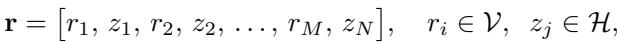
*Equation 19: Equation extracted by MinerU.*

> 💡 **Equation 19 批读**: 公式通常定义过程、loss 或更新规则；建议把符号对应到输入、模型、记忆/控制变量与输出。

where the $\mathbf { r }$ generation trajectory, achieving a synergistic coupling of explicit symbolic reasoning and implicit neural computation.

> 💡 **批注**: 这段是 one-step SR 主线：关注效率、保真-真实感权衡、扩散/flow 先验或单步生成路径。

Interleaved computation views reasoning as a heterogeneous sequential process in which discrete tokens and continuous latents are alternated within a unified trajectory. Compared with purely token-based or purely latent reasoning, this paradigm provides a more flexible interface for allocating computation across explicit symbolic steps and implicit neural operations. Existing work can be broadly grouped into three categories: Explicit-latent Interleaving, Modality Interleaving, and Task Interleaving.

> 💡 **批注**: 这段是 latent memory / medical VLM 主线：关注视觉证据如何进入 latent space、如何被记忆/更新/调用，以及是否能支撑可靠诊断。

Explicit-latent Interleaving. Hybrid generation interleaves natural-language tokens with latent internal states within a single trajectory, motivated by the observation that many intermediate steps need not be fully verbalised and can therefore be executed more efficiently without degrading performance. Early empirical support comes from Assorted [181], which shows that replacing selected verbal chain-of-thought steps with latent activations preserves downstream accuracy while substantially reducing token usage. Subsequent work extends this idea in two main directions. One line studies fixed or curriculum-based interleaving schemes: SpiralThinker [155] progressively internalises explicit reasoning steps through a spiral curriculum, and LiteReason [55] demonstrates that even a lightweight model can learn a form of mixed explicit–latent reasoning. A second line makes the explicit–latent boundary itself adaptive: SwiReasoning [175] learns a step-level switching policy via reinforcement learning, LT-Tuning [123] incorporates latent-thought positions into instruction tuning, and ThinkRouter [241] routes queries to different reasoning depths at the system level to balance efficiency and accuracy.

> 💡 **批注**: 这段是 latent memory / medical VLM 主线：关注视觉证据如何进入 latent space、如何被记忆/更新/调用，以及是否能支撑可靠诊断。

Modality Interleaving. When generation over non-textual inputs such as visual imagination, or perceptual feature maps, latent representations are not merely an efficiency mechanism but a representational requirement, since the underlying information cannot be fully captured in discrete text. Modality-interleaving methods therefore integrate continuous perceptual latents with linguistic tokens, allowing models to perform intermediate reasoning in the latent domain. Early work such as AURORA [11] established this paradigm by inserting explicit perceptual reasoning steps. Subsequent studies, including Mirage [251], LVR [95], VisMem [264], and Monet [211], showed that directly interleaving vision latents into architectures improves visual tasks without relying on textual scene descriptions.

> 💡 **批注**: 这段是 one-step SR 主线：关注效率、保真-真实感权衡、扩散/flow 先验或单步生成路径。

A related line of work extends interleaving to multiple latent types: IVT-LR [20] couples text and vision activations through cross-attention, while SkiLa [197], LS [276], and MM-CoT [171] use visual latents as an internal sketchpad that supports subsequent language reasoning. Beyond two-dimensional perception, 3DThinker [28] incorporates spatial latents for geometric and spatial reasoning, and DMLR [111] together with ILVR [39] shows that sparse latent interleaving can preserve strong grounding performance while reducing computational cost.

> 💡 **批注**: 这段是 latent memory / medical VLM 主线：关注视觉证据如何进入 latent space、如何被记忆/更新/调用，以及是否能支撑可靠诊断。

Task Interleaving. A third family views interleaving not as a mechanism for mixing token types or modalities, but as a means of coordinating heterogeneous functional modules such as memory stores, retrieval components, generative heads, and agent sub-processes. Its defining feature is that the interleaved latent stream carries task-specific structured signals, e.g., retrieved evidence, episodic memory traces, or inter-agent communications, rather than general-purpose reasoning states. In single-model settings, this idea primarily appears as memory–reasoning integration: LCR-SER explicitly interleaves a compressed history buffer with ongoing inference for sequential recommendation [177]; MemGen [273], VisMem [264] and FlashMem [65] equip models with persistent working memory through, respectively, generated memory tokens; and CLaRa [59] interleaves retrieval and generation in a jointly trained latent lookup framework, rather than treating retrieval as an external pipeline. In multi-agent settings, interleaving further serves as a coordination protocol across asynchronously operating agents: LatentMem [47] introduces a shared latent memory that supports implicit communication during collaborative problem solving, while L2-VMAS [265] alternates perceptual and planning streams across agents to maintain a coherent joint world model in long-horizon embodied tasks.

> 💡 **批注**: 这段是 latent memory / medical VLM 主线：关注视觉证据如何进入 latent space、如何被记忆/更新/调用，以及是否能支撑可靠诊断。

Summary. Interleaved computation generalises the generation process beyond a homogeneous token stream by allowing models to alternate between symbolic outputs and latent computations. This design improves efficiency when some intermediate steps need not be verbalised, expands representational capacity when generation must operate over non-textual modalities, and enables tighter coordination when multiple functional modules or agents interact within a shared trajectory. Taken together, these studies suggest that interleaving is not merely a decoding strategy, but a general principle for organising hybrid computation systems that combine explicit interpretability with implicit computational power.

> 💡 **批注**: 这段是 one-step SR 主线：关注效率、保真-真实感权衡、扩散/flow 先验或单步生成路径。

# 4.4 Optimization

Latent space optimization generally happens at three stages: pre-training, post-training, and inference. The three stages differ mainly in what is optimized: during pre-training and post-training, the optimized variable is typically model parameters $\theta \in \mathcal { W }$ (or a subset of them); during inference, the model parameters are mostly fixed (sometimes also be trained), and the optimized variable is instead an inference-time state, such as a latent representation $\mathbf { z } \in \mathcal { H }$ or a generation trajectory $\mathbf { r } \in \mathcal { V }$ . For each stage, we categorize methods based on two aspects: supervision, that specifies what provides the learning signal; objective, that captures the purpose behind each loss component for latent optimization. Based on underlying computational operations, we categorize existing methods into three representative types:

> 💡 **批注**: 这段是 one-step SR 主线：关注效率、保真-真实感权衡、扩散/flow 先验或单步生成路径。

# Mechanism: Optimization

• Pre-training (Section 4.4.1): starts with a randomly initialized model and trains it from the scratch, enabling native latent-level abilities.   
• Post-training (Section 4.4.2): enhances the ability of pre-trained models, with diverse supervision signals and objectives, learning the latent space.   
• Inference (Section 4.4.3): focuses on inference manipulation of latent states, allowing dynamic adjustment.

> 💡 **列表批读**: 这组条目通常是在列贡献、设置、发现或模块；建议逐条对应到论文 claim。

# 4.4.1 Pre-training

During the pre-training stage, $\mathbf { z }$ is trained jointly with the base model from scratch, the objective is to learn model parameters from large-scale pre-training data $\mathcal { D }$ . Formally, the optimization variable is $\theta \in \Phi$ , and the objective can be written as:

> 💡 **批注**: 这段是 one-step SR 主线：关注效率、保真-真实感权衡、扩散/flow 先验或单步生成路径。

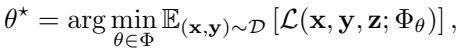
*Equation 20: Equation extracted by MinerU.*

> 💡 **Equation 20 批读**: 公式通常定义过程、loss 或更新规则；建议把符号对应到输入、模型、记忆/控制变量与输出。

where $\theta \in \Phi \subseteq \mathcal { W }$ denotes the set of trainable parameters in pre-training, and $\mathcal { L }$ trains the whole system end-to-end.

> 💡 **批注**: 这是实验证据段：同时看主指标、消融、效率和案例，判断 claim 是否被支撑。

Optimization at this stage mostly relies on simple, scalable supervision already well-established for explicitspace training, rather than more sophisticated supervision that requires human annotation or elaborate processing. To stabilize training, optional auxiliary losses are designed to regulate the latent space. In total, these methods fall into three types: Autoregressive Supervision, Auxiliary Supervision, and Reinforcement.

Autoregressive Supervision Pre-Training. This category focuses on internalizing reasoning as a natural byproduct of next-token prediction or recurrent looping, without explicitly matching intermediate representations. Implementing Jacobi-iteration-based parallel training, PonderLM-2 [267] efficiently computes recursive latent thoughts without strict causal blocking. Exploring recurrent depth scaling through looped transformer layers, Looped Trans. [167] natively simulates complex reasoning via continuous latent updates. Scaling looped language models up to 2.6 billion parameters, Ouro [296] utilizes an entropy-regularized objective for consistent latent reasoning. To address scaling efficiency, PHD-Trans. [223] optimizes predictions via dynamic exploration of continuous states. To maintain stability in dynamic scenarios, AL-CoT [268] employs continuous state prediction objectives.

> 💡 **批注**: 这段是 latent memory / medical VLM 主线：关注视觉证据如何进入 latent space、如何被记忆/更新/调用，以及是否能支撑可靠诊断。

Auxiliary Supervision Pre-Training. This direction explicitly guides the formation of the latent space geometry through auxiliary semantics, contrastive learning, or reconstruction objectives. Optimizing continuous semantic concepts via cross-entropy and reconstruction losses, CoCoMix [186] implicitly guides multi-task textual predictions. Incorporating InfoNCE and cross-entropy, LARES [112] aligns latent representations for sequential recommendation. Introducing latent action pretraining via VQ-VAE, LAPA [255] learns discretized latent actions directly from unannotated videos. Aligning visual latent spaces from videos with proprioceptive action spaces, CLAP [272] utilizes contrastive pretraining for robust embodied manipulation. Bypassing full visual dynamic reconstruction, JALA [131] derives predictive action embeddings jointly aligned with inverse dynamics and sparse physical actions. Focusing on mean squared error and task losses, CARE [176] scales multi-task prediction for embodied manipulation. Utilizing cross-entropy and mean squared error, ConceptLM [126] learns latent representations natively for efficient multi-task prediction.

> 💡 **批注**: 这段是 one-step SR 主线：关注效率、保真-真实感权衡、扩散/flow 先验或单步生成路径。

Reinforcement Pre-Training. This category integrates reward signals directly into the foundational pretraining phase to actively shape latent thought trajectories. Integrating reinforcement signals, LoopRPT [190] reframes next-token prediction as a reasoning task via noisy latent rollouts, optimizing intermediate representations to compress effective reasoning into fewer iterations from the very beginning of the lifecycle.

Summary. Methods at this stage embed latent reasoning capacity directly into model parameters during large-scale training, foregoing the need for human annotation or elaborate supervision. The dominant approach is autoregressive prediction over continuous states, where looped or recurrent architectures naturally develop latent reasoning through standard next-token objectives. Auxiliary losses serve a regularizing role, shaping the geometry of the latent space without disrupting scalability. A nascent thread introduces reinforcement signals at pre-training time, aiming to instill efficient reasoning trajectories before any fine-tuning occurs.

> 💡 **批注**: 这段是 latent memory / medical VLM 主线：关注视觉证据如何进入 latent space、如何被记忆/更新/调用，以及是否能支撑可靠诊断。

# 4.4.2 Post-training

During the post-training stage, $\mathbf { z }$ is further optimized via fine-tuning on a pre-trained model. Thanks to the reduced data requirements compared to pre-training, post-training supervision can involve more sophisticated data augmentation or specialized loss designs. Many methods focus on defining an additional signal to supervise the latent variable, as supervision on explicit variables alone may not be sufficient. Again, the optimized variable is still model parameters, but the optimization is now restricted to a post-training objective:

> 💡 **批注**: 这段是 one-step SR 主线：关注效率、保真-真实感权衡、扩散/flow 先验或单步生成路径。

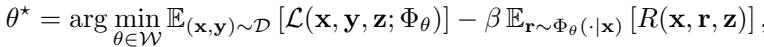
*Equation 21: Equation extracted by MinerU.*

> 💡 **Equation 21 批读**: 公式通常定义过程、loss 或更新规则；建议把符号对应到输入、模型、记忆/控制变量与输出。

where the formulation subsumes supervised fine-tuning, preference optimization, and reinforcement-learningbased alignment. In latent-space methods, post-training often specializes in refining how latent variables are induced, controlled, or aligned with downstream objectives. Based on the supervision signals, there are three types, including: Explicit Supervision, Implicit Supervision, and Reinforcement Learning.

Explicit Supervision Fine-Tuning. This category optimizes latent reasoning by applying loss functions solely to the final human-readable output, without providing step-by-step targets for the continuous representations. Fine-tuning continuous variables via specific task losses, LATPC [260] enhances safety and robustness against jailbreak attacks. Using task loss alignment, GainRouter [288] dynamically routes features to enable fast and adaptive latent reasoning. Steering hidden states on a learned latent manifold, GeoSteer [84] ensures faithful and logically consistent reasoning trajectories. Fine-tuning models with cross-entropy and regularization, PILOT [289] internalizes the strategic oversight of large models into intrinsic latent guidance. Focusing on next-token prediction and alignment, TS [2] utilizes cross-entropy to streamline latent reasoning.

> 💡 **批注**: 这段是 latent memory / medical VLM 主线：关注视觉证据如何进入 latent space、如何被记忆/更新/调用，以及是否能支撑可靠诊断。

Implicit Supervision Fine-Tuning. This approach provides explicit gold targets for latent representations using knowledge distillation, contrastive alignment, or step-wise reconstruction signals.

> 💡 **批注**: 这是蒸馏逻辑：重点看 teacher 的什么能力被迁移给 student，以及训练/推理阶段各自保留哪些模块。

Distillation-based methods anchor latent states to teacher-provided signals. SPOT [32] compresses explicit reasoning trajectories into compact latent tokens by anchoring them to corresponding teacher spans, while SemCoT [61] distills ground-truth reasoning into semantically aligned implicit tokens to accelerate computation. Latent-SFT [37] takes a different angle, redefining latent tokens as vocabulary-space superpositions and training them with KL divergence and cross-entropy losses.

> 💡 **批注**: 这是蒸馏逻辑：重点看 teacher 的什么能力被迁移给 student，以及训练/推理阶段各自保留哪些模块。

Contrastive learning constitutes another prominent technique. LTA-Thinker [206] and EPR-Latent [215] employ contrastive objectives to optimize latent thought distributions and refine intermediate representations, respectively, while ReaRec [192] applies the same principle to sequential recommendation. EBM-CoT [29] further combines contrastive signals with regularization to improve overall latent reasoning efficiency.

> 💡 **批注**: 这段是 latent memory / medical VLM 主线：关注视觉证据如何进入 latent space、如何被记忆/更新/调用，以及是否能支撑可靠诊断。

Table 6 Overview of the Pre-training (Section 4.4.1), Post-training (Section 4.4.2), and Inference (Section 4.4.3) optimization. We compare the modality, backbone, computational operation, and scenario. Here, Recon., CE, InfoNCE, KL, MSE, and CL denote reconstruction, cross-entropy, information noise-contrastive estimation, Kullback–Leibler divergence, mean squared error, and contrastive learning, respectively.

> 💡 **批注**: 这是实验证据段：同时看主指标、消融、效率和案例，判断 claim 是否被支撑。

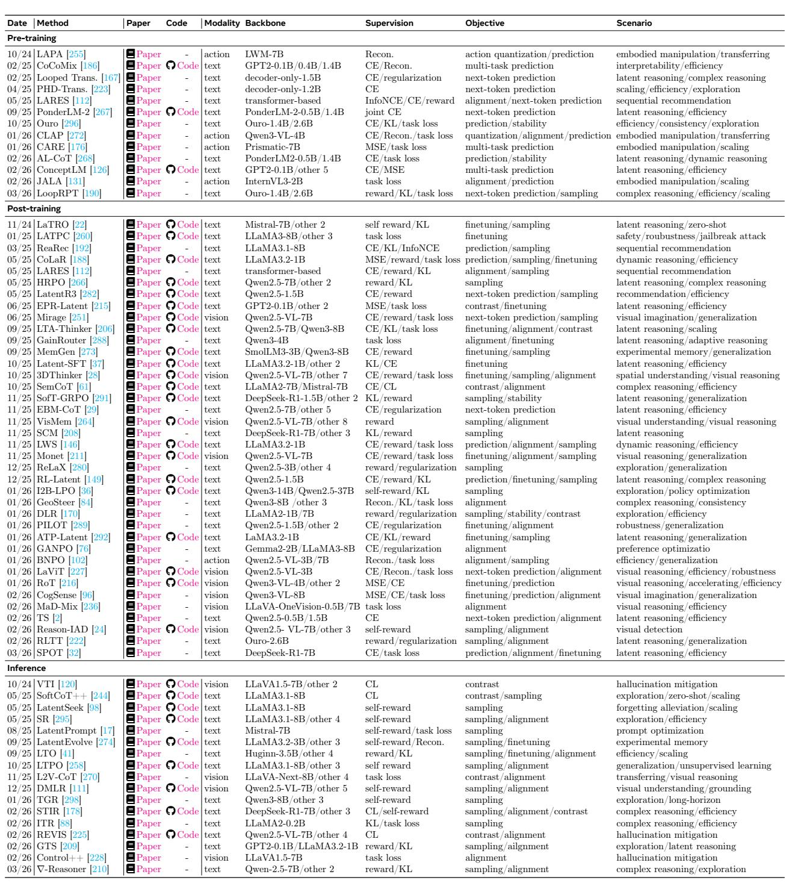
*Table 6: Table 6 Overview of the Pre-training (Section 4.4.1), Post-training (Section 4.4.2), and Inference (Section 4.4.3) optimization. We compare the modality, backbone, computational operation, and scenario. Here, Recon., CE, InfoNCE, KL, MSE, and CL denote reconstruction, cross-entropy, information noise-contrastive estimation, Kullback–Leibler divergence, mean squared error, and contrastive learning, respectively.*

> 💡 **Table 6 批读**: 表格要看主指标、次指标与效率/鲁棒性是否一致支持论文 claim。

Reconstruction objectives are especially prevalent in multimodal settings, where aligning across modalities demands explicit feature-level supervision. LaViT [227] jointly predicts next tokens and reconstructs visual features to align cross-modal reasoning, and RoT [216] takes a distinctive approach by rendering chain-ofthought as images and applying MSE together with cross-entropy. BNPO [102] uses reconstruction and task losses to align embodied action spaces. Methods such as Mirage [251], 3DThinker [28], VisMem [264],

Monet [211], and CogSense [96] further demonstrate the breadth of this paradigm across visual imagination, spatial reasoning, and generalization tasks.

Reinforcement Learning. To mitigate geometric drift, this sub-category leverages policy gradients, rewards, and preference signals to autonomously discover efficient latent trajectories.

Self-rewarding mechanisms form one important thread, where the model itself provides the training signal without external annotation. LaTRO [22] formulates reasoning as a variational sampling process optimized via the model’s own probability estimates, and I2B-LPO [36] employs an iterative information bottleneck with self-rewards for thorough latent policy exploration. MemGen [273] similarly relies on targeted self-rewards to enhance generalization.

> 💡 **批注**: 这段是 one-step SR 主线：关注效率、保真-真实感权衡、扩散/flow 先验或单步生成路径。

A further set of methods introduces specialized regularizers to stabilize or enrich the optimization landscape. SofT-GRPO [291] applies Gumbel reparameterization for stable group relative policy optimization, GANPO [76] introduces an adversarial regularizer to robustify preference optimization, and DLR [170] combines contrastive stability constraints with reward signals for directed latent exploration. HRPO [266] takes a hybrid approach, using a learnable gate to progressively integrate continuous hidden states with discrete tokens. CoLaR [188], LWS [146], LatentR3 [282], and Reason-IAD [24] round out the landscape by applying reward-driven optimization to dynamic trajectory prediction, sequential recommendation, and visual spatial understanding. KL divergence regularization also serves as a recurring stabilization mechanism across many methods. LARES [112], RL-Latent [149], SCM [208], and ATP-Latent [292] all incorporate KL penalties alongside reward objectives to prevent excessive deviation from the reference policy during latent space optimization. ReLaX [280] further addresses premature convergence through strict reward regularization, and RLTT [222] distributes rewards across the full trajectory to improve alignment.

> 💡 **批注**: 这段是 one-step SR 主线：关注效率、保真-真实感权衡、扩散/flow 先验或单步生成路径。

Summary. Compared to pre-training, post-training affords greater flexibility in supervision design, enabling richer signals such as distillation, contrastive alignment, and reward-based feedback to refine latent representations. A central tension in this stage is whether to supervise latent variables explicitly through gold targets or implicitly through output-level task losses alone. Reinforcement learning methods go further by treating latent trajectory discovery as a policy optimization problem, allowing models to autonomously identify compact and efficient reasoning paths without relying on predetermined supervision.

> 💡 **批注**: 这段是 one-step SR 主线：关注效率、保真-真实感权衡、扩散/flow 先验或单步生成路径。

# 4.4.3 Inference

For inference-time latent optimization, the model weights $\theta$ are usually frozen (also could be trained) and the latent states $\mathbf { z }$ are directly manipulated at test time. Unlike pre-training and post-training, inference-time methods treat $\mathbf { z }$ itself as the optimization variable. Formally, let $\theta$ denote the trained parameters, then the optimized variable becomes $\omega$ , with:

> 💡 **批注**: 这段是 one-step SR 主线：关注效率、保真-真实感权衡、扩散/flow 先验或单步生成路径。

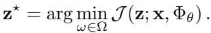
*Equation 22: Equation extracted by MinerU.*

> 💡 **Equation 22 批读**: 公式通常定义过程、loss 或更新规则；建议把符号对应到输入、模型、记忆/控制变量与输出。

where $\Omega$ is the feasible region of the variable, and $\mathcal { I }$ is the inference-time objective, final output is then generated conditioned on the optimized inference-time state. The part includes Scaling, Tuning, and Guidance.

Inference Scaling. This category focuses on exploring the latent space by generating multiple candidate trajectories and employing reward-based heuristics to identify the optimal reasoning path. Employing a continuous-space classifier as a latent reward model, LTO [41] aggressively prunes incorrect thinking patterns during inference. Performing manifold-informed latent foresight search, TGR [298] scores candidate latent anchors to encourage smooth trajectories and diverse long-horizon exploration. Reformulating latent exploration as conditional sampling over continuous thought representations, GTS [209] utilizes a Gaussian Thought Sampler to predict context-dependent perturbation distributions. Applying self-reward sampling, LatentSeek [98] effectively alleviates catastrophic forgetting during continuous generation. Employing selfrewards, SR [295] samples and aligns soft reasoning explorations to maximize efficiency. Leveraging the latent semantic space, LatentPrompt [17] automatically evaluates and optimizes prompts via intrinsic self-rewards. Utilizing KL divergence and task losses, ITR [88] guides inference-time sampling to greatly improve complex reasoning efficiency. Enhancing visual understanding and grounding, DMLR [111] implements continuous self-reward sampling and alignment.

> 💡 **批注**: 这段是 latent memory / medical VLM 主线：关注视觉证据如何进入 latent space、如何被记忆/更新/调用，以及是否能支撑可靠诊断。

Inference Tuning. This approach shifts from trial-and-error stochastic search to continuous, gradientbased optimization executed directly on the latent variables or policy during the forward pass. Optimizing intermediate latent thought vectors on the fly, LTPO [258] utilizes an online policy gradient method guided by an intrinsic confidence-based reward. Integrating differentiable optimization over token logits, $\nabla$ -Reasoner [210] refines the policy directly within the decoding loop via gradient descent in the continuous sample space. Combining self-reward and reconstruction losses, LatentEvolve [274] dynamically samples and fine-tunes experimental memory states through test-time scaling.

> 💡 **批注**: 这段是 latent memory / medical VLM 主线：关注视觉证据如何进入 latent space、如何被记忆/更新/调用，以及是否能支撑可靠诊断。

Inference Guidance. This category applies targeted structural constraints, contrastive logic, or sparse interventions to dynamically guide latent representations and prevent hallucinations. Steering internal activations via sparse interventions, REVIS [225] mitigates object hallucination in large vision-language models by extracting pure visual information vectors. Internalizing contrastive learning and self-rewards, STIR [178] introduces a value-modulated trajectory intervention that dynamically injects context-specific impulses via anchor-based gating. Perturbing latent thoughts via specialized initial tokens, SoftCoT $^ { + + }$ [244] uses contrastive learning to enforce diversity among soft representations. Utilizing contrastive learning at inference time, VTI [120] successfully mitigates hallucinations in massive visual models. Contrasting visual features at test time, L2V-CoT [270] tightly aligns transferring and visual reasoning capabilities through latent intervention. Preventing visual hallucinations dynamically, Control++ [228] applies highly targeted task losses during the alignment generation process.

> 💡 **批注**: 这段是 latent memory / medical VLM 主线：关注视觉证据如何进入 latent space、如何被记忆/更新/调用，以及是否能支撑可靠诊断。

Summary. Unlike parameter-level optimization, inference-time methods treat latent states themselves as the optimization variable while keeping model weights fixed. The key distinction among approaches lies in the search strategy: scaling methods explore the latent space stochastically through reward-guided trajectory selection, optimization methods apply gradient updates directly to latent variables during decoding, and guidance methods impose structural or contrastive constraints to correct latent representations on the fly, particularly to suppress hallucinations.

> 💡 **批注**: 这段是 one-step SR 主线：关注效率、保真-真实感权衡、扩散/flow 先验或单步生成路径。

---

## 🔖 Section 总结

### 核心洞察
1. 本节对应论文原始大分节，原文已完整保留。
2. 阅读重点是把本节的机制/证据映射到论文主 claim。
3. 后续如有疑问，可在本 section 继续补充更细批注。
