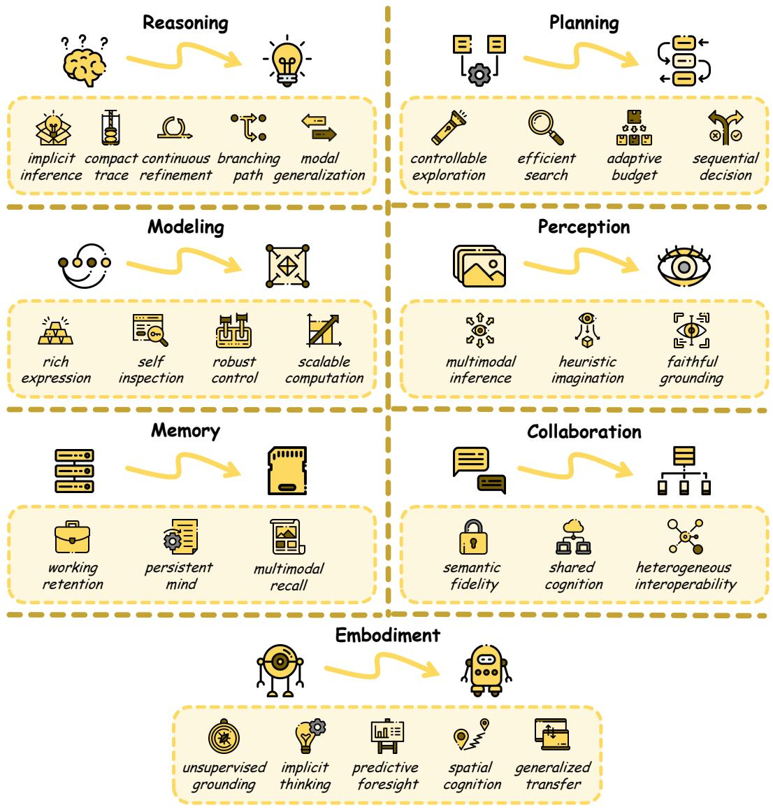

[← 返回 README](../README.md)

# 5 Ability: What Does Latent Space Enable?

## 📌 预览
本节保留原文并穿插批注，重点提炼与课题主线相关的机制和证据。

---

The latent space, as a machine-native representational substrate within large models, unlocks a spectrum of emergent capabilities that transcend the boundaries of explicit token-level processing. In this section, we systematically examine these capabilities along seven dimensions: Reasoning (Section 5.1) concerns the ability to carry out deduction and relational computation through continuous internal states; Planning (Section 5.2) emphasizes the prospective organization of solution trajectories, resource allocation, and multi-step decisionmaking; Modeling (Section 5.3) focuses on the characterization, interpretability, controllability, and scalable depth of latent representations themselves; Perception (Section 5.4) enables models to preserve and manipulate rich, spatially structured information for more faithful visual understanding; Memory (Section 5.5) supports compact, persistent, and adaptive knowledge retention across contexts; Collaboration (Section 5.6) allows multiple agents to exchange semantic content directly through latent channels rather than discrete language alone; and Embodiment (Section 5.7) extends latent computation into physical interaction, supporting grounded action, predictive foresight, spatial imagination, and transfer across heterogeneous bodies. As depicted in Figure 8, each dimension reflects a distinct facet of intelligence that latent representations uniquely empower, ranging from internal logical deduction to physical interaction with the environment.

> 💡 **批注**: Ability 这一节真正做的是把 latent 的收益从“推理更短更快”扩成“模型整体能力结构改变了”。这也是为什么这篇 survey 能覆盖 memory、perception、collaboration，而不只停留在 CoT 压缩。

# 5.1 Reasoning

Reasoning in latent space refers to the capacity of large models to perform logical deduction, relational computation, and conclusion generation through internal continuous representations rather than through explicit token-by-token verbalization. The shift from explicit CoT reasoning [219] to latent reasoning represents a fundamental paradigm change: instead of articulating every intermediate step in natural language, models learn to think within a continuous, high-dimensional latent manifold [58, 294].

This paradigm offers substantial advantages in computational efficiency, representational capacity, and the ability to encode superpositions of multiple reasoning paths simultaneously. We organize this rapidly expanding landscape along six abilities: Implicit Inference without full verbalization, Compact Trace that condenses long chains into compact states, Continuous Refinement that sustains and revises thought in latent form, Branching Path over multiple candidates, and Modal Generalization beyond text-only settings.

*Figure 8: Figure 8 Core abilities brought by the latent space, including: Reasoning (Section 5.1), Planning (Section 5.2), Modeling (Section 5.3), Perception (Section 5.4), Memory (Section 5.5), Collaboration (Section 5.6), and Embodiment (Section 5.7).*

> 💡 **Figure 8 批读**: Figure 8 最适合拿来判断一篇论文“解决的是能力问题还是机制问题”。比如 `VisMem` 主打 Memory/Perception，`Visual-Enhanced-Depth-Scaling` 主打 Reasoning/Perception，`MedSynapse-V` 则把 Memory 与诊断型 Reasoning 绑在一起。

Figure 8 Core abilities brought by the latent space, including: Reasoning (Section 5.1), Planning (Section 5.2), Modeling (Section 5.3), Perception (Section 5.4), Memory (Section 5.5), Collaboration (Section 5.6), and Embodiment (Section 5.7).

Implicit Inference. A central motivation for moving reasoning into latent space is the growing evidence that explicit CoT, while interpretable, is often redundant and fundamentally constrained by the discrete, sequential nature of language. Converging evidence from CoT compression [122, 277], implicit capability elicitation [22, 99], and latent self-evaluation [217] shows that reasoning-like behavior is already substantially encoded in the continuous activation spaces of pretrained models. Further analyses establish latent reasoning as a distinct computational mode encompassing richer, non-sequential inference [27, 63], collectively challenging the assumption that reasoning must be externalized in tokens. Building on these insights, COCONUT [58] demonstrated that continuous thought vectors can encode superpositions of multiple reasoning paths, enabling emergent breadth-first search and showing that models can infer internally before committing to language.

Compact Trace. One major ability unlocked by latent space is compressing explicit CoT into far more compact internal states without losing its problem-solving value. A broad range of supervision and post-training studies [31, 61, 173, 174, 215, 220, 288] shows that long reasoning traces can be absorbed into compact latent states while preserving much of their functional value. This evidence suggests that already-trained models can acquire compressed reasoning ability with only modest additional overhead. The collective evidence indicates that reasoning chains can be preserved in representations orders of magnitude more compact, revealing fundamental redundancy in token-level reasoning.

Continuous Refinement. Beyond compressing existing CoT, latent space also supports the ability to sustain, blend, and iteratively revise thought as a continuous state. Soft token methods [208, 243, 287] replace discrete sampling with probability-weighted embedding mixtures or learned concept-level blending, while stochastic refinement through diffusion [83] and Markov dynamics [115] enables revision of earlier reasoning decisions. Energy-based consistency enforcement [29] and theoretical analyses of vocabulary-space superposition [37, 52] further show that such latent states can preserve coherence while remaining amenable to simultaneous optimization. Thought augmentation and contextualization [123, 129, 164, 185, 206] enrich this refinement ability by fusing task-relevant and background knowledge and modulating reasoning through targeted interventions.

Branching Path. The continuous nature of latent space enables fundamentally new reasoning topologies that let models explore several candidate trajectories at once. Parallel latent reasoning [113, 224, 244, 262] demonstrates simultaneous search through soft path sampling, stochastic width, and Jacobi iteration, reducing wall-clock latency while maintaining quality. Hybrid latent-explicit systems [155, 175, 181, 241] further suggest that models can flexibly alternate between compact internal search and selective externalization when beneficial. Studies of dual-system orchestration [33] reinforce this view, indicating that strong reasoners benefit from coordinating multiple reasoning paths and modes rather than committing to a single linear trace.

Modal Generalization. A key indicator of the maturity of latent reasoning is its ability to generalize beyond text-only settings. Modality-agnostic continuous thought [154, 160] demonstrates that the latent reasoning paradigm applies across linguistic, visual, and heterogeneous substrates, while cross-modal transfer and efficiency techniques [133, 171, 216, 270] show that this capability can move across modalities with increasing compactness. We defer detailed treatment of visual latent reasoning to the Perception subsection (Section 5.4).

Beyond vision, domain-specific applications spanning chemical synthesis [3], narrative generation [55], novelty discovery [16], and joint-embedding prediction [110] demonstrate broad applicability. Structured spatialtemporal reasoning [203, 247] extends this generalization to geometric and temporal domains, while faithfulness and controllability studies [64, 205, 257, 279] show that latent reasoning can remain reliable as it moves across settings.

# 5.2 Planning

Planning concerns the search for optimal trajectories through the solution landscape, where the continuous, differentiable nature of the latent manifold admits gradient-based policy optimization and iterative trajectory refinement. Unlike reasoning, which focuses on logical deduction within a given context, planning emphasizes the prospective organization of computation, determining where to allocate resources, how to explore the solution space, and when to terminate search [207, 240]. We examine latent planning through four abilities: Controllable Exploration over internal solution paths, Search Efficiency in navigating the latent manifold, Adaptive Budget allocation that matches compute to difficulty, and Sequential Decision in downstream interactive tasks.

Controllable Exploration. A central ability in latent planning is controlling internal solution trajectories rather than merely generating the next token greedily. RL-based trajectory optimization [41, 258, 266, 291] shows that continuous thought representations can be directly improved via policy gradients, Gumbel reparameterization, and test-time refinement. Training stability and diversity remain active challenges, addressed through exploration collapse prevention [36], systematic design analysis [149], and contrastive reward shaping [170]. These works collectively establish that latent geometry enables deliberate trajectory improvement that is fundamentally difficult in discrete token space.

Efficient Search. The latent manifold provides a natural substrate where geometric smoothness and continuity can be exploited for efficient navigation. Exploration restoration and trajectory diversification [189, 280, 295] maintain reasoning variety through entropy exploitation, latent decoding, and controlled embedding exploration, while geometry-guided search [98, 178, 298] leverages intrinsic manifold properties for instance-level targeting and long-context foresight.

Adaptive Budget. A defining characteristic of latent planning is dynamic, input-dependent resource allocation. Adaptive depth and horizon determination [62, 146, 207, 292] adjusts reasoning depth through instance-level steering, RL-based stopping, dynamic termination, and active budget determination, investing computation proportionally to problem complexity.

Sequential Decision. Latent planning has been productively deployed in sequential decision-making domains, where the temporal structure of user behavior or system states naturally maps onto trajectory optimization in latent space.In recommendation, retrieval,and cross-domain adaptation [54, 112, 177, 188, 193, 204, 271, 282], latent planning improves sequential prediction, re-ranking, and transfer by maintaining and refining internal trajectories over time. In multi-step planning and tool use [25, 102, 226, 269, 289, 293], it supports sustained state tracking, optimization over intermediate decisions, and tighter control of multimodal agents, and further extends to reparameterizing the action space itself—compressing recurrent low-entropy scaffolds into compact latent action units to directly reduce the effective decision horizon while preserving executability. The breadth of these applications, spanning recommendation systems, information retrieval, tool use, action representation learning, and conversational AI, establishes latent planning as a versatile paradigm that extends well beyond the scope of traditional reasoning benchmarks.

# 5.3 Modeling

Modeling encompasses the ability to characterize, inspect, and shape latent representations within large language models. While reasoning and planning concern what models compute in latent space, modeling focuses on what latent representations let us understand and control about the computation itself. We structure this dimension into four abilities: Rich Expression to encode complex computation, Self Inspection that makes internal states analyzable, Robust Control over risky or unstable behavior, and Scalable Computation that expands capacity through latent recurrence.

Rich Expression. Rigorous analysis increasingly shows that latent space supports a richer computational capacity than explicit token-only reasoning. Expressiveness analyses [239, 294] prove that continuous thought vectors encode multiple search frontiers simultaneously and achieve provably greater expressiveness than CoT, while monitorability analysis [89] reveals the associated trade-offs between efficiency and interpretability. Fundamental limitation results [166, 301] show that exploration and execution cannot be simultaneously optimized within fixed budgets, and that reasoning depth correlates weakly with correctness under certain conditions. Cognitive and domain-specific frameworks [66, 172] frame reasoning as transitions across representation spaces, extending insights from neuroscience to program understanding, together clarifying both the power and the boundaries of latent reasoning.

Self Inspection. Understanding the internal dynamics of latent reasoning is critical because latent space increasingly supports direct inspection of what the model is representing and how those states evolve. Validity probing [107, 285] examines whether latent tokens encode genuine reasoning or exploit artifacts and whether models truly reason step-by-step or develop qualitatively different strategies. Transparency and visualization methods [23, 116, 145] make internal representations interpretable through latent debate, geometry visualization, polarity-aware probing, and cognitive analysis. Representation-level analysis [143, 161] demonstrates information preservation and reveals rich semantic dimensions beyond task performance, while information flow studies [125, 195] uncover multi-hop reasoning paths and cross-lingual transition mechanisms. Practical steering [82, 84] further suggests that inspection is not merely descriptive, but can directly support targeted improvements.

Robust Control. Latent space provides a powerful but double-edged lever for model safety, because the same representations that enable strong performance can also be manipulated for both attack and defense. On the one hand, attack vectors [140, 237] exploit latent fusion and feedback-based gradients, alongside backdoor triggers embedded in latent CoT. On the other hand, layered defense mechanisms [101, 179, 250, 260] provide controllable steering, adversarial training, feature activation steering, and streaming risk detection. Training-phase safety [6, 76, 191] addresses adversarial regularization, contrastive unlearning, and human preference modeling, underscoring that robust latent control is essential for building safe systems.

Scalable Computation. Modeling also highlights the ability of latent systems to expand effective depth and capacity without proportionally expanding explicit token generation. Formal expressiveness results [167] confirm that looped transformers with latent iterations express strictly more complex computations than feedforward counterparts. Recurrent-block scaling [1, 50, 87, 296] iterates shared blocks for test-time compute, scales looped pretraining, introduces encode-think-decode architectures, and demonstrates out-of-distribution generalization. Progressive refinement and architectural variants [72, 86, 130, 263] extend this flexibility through depth-recurrent attention, elastic depth, and multi-resolution recursion. Adaptive depth allocation [49, 97, 180, 214] further enables dynamic computation through selective iteration, dual-process routing, and token-wise pondering.

Beyond recurrence, concept-level and efficiency innovations [121, 158] operate on adaptive semantic boundaries and achieve KV cache efficiency, while representation-level design [17, 157, 204, 223] bypasses discrete bottlenecks in prompt optimization, pretraining scaling, and deployed system efficiency.

# 5.4 Perception

Perception in latent space addresses the fundamental challenge of enabling large models, particularly VLMs, to understand, represent, and process visual information in continuous, high-fidelity latent spaces. Current VLMs still face a critical bottleneck: converting rich visual content into discrete text tokens inevitably discards spatial structure, fine-grained detail, and relational geometry [11, 95]. Latent perception overcomes this limitation by preserving dense, spatially-structured information that discrete tokenization necessarily destroys, enabling models to reason about visual content with the richness and nuance of human perception. We organize latent perception into three progressively deeper abilities: Multimodal Inference over internal visual representations, Heuristic Imagination for generative manipulation and 3D understanding, and Faithful Grounding that improves output faithfulness through representation-level intervention.

Multimodal Inference. A primary thrust is enabling VLMs to reason about visual content through internal latent representations rather than text-mediated descriptions. Foundational latent visual reasoning [95, 211] demonstrated that generating and updating latent visual states alongside text enables fine-grained visual understanding unattainable through text-only reasoning. Follow-up work [21, 39, 100, 183, 218] shows that this visual inference ability can remain both accurate and efficient through selective computation, coarse-to-fine processing, and joint embedding prediction without pixel-level reconstruction. Multimodal coordination and alignment studies [20, 73, 96, 111, 169, 225, 283, 284] further show that structured visual latents can be enriched, stabilized, and generalized to temporal domains.

Heuristic Imagination. Latent perception also enables VLMs to perform visual heuristic imagination, generating and manipulating internal visual representations as part of the reasoning process, analogous to human mental imagery. This capability is valuable for tasks requiring spatial reasoning, 3D understanding, or visual planning that cannot be adequately expressed in text. Internal visual imagination [28, 251] empower latent manipulation and align VLM features with 3D foundation models, while visual scratchpads [156, 197, 276] introduce sketching mechanisms that capture dense spatial and geometric information through continuous visual tokens. Perceptual fidelity preservation [135, 227] ensures that latent visual representations maintain fidelity during distillation and dynamically refocuses attention across modality gaps.

Faithful Grounding. A critical application of latent perception is improving the faithfulness of VLM outputs by intervening at the representation level, addressing the pervasive problem of hallucination. Hallucination mitigation via latent steering and architectural alignment [120, 137] corrects visual-textual misalignments and addresses root causes, while perceptual grounding tokens [11] provide auxiliary signals through depth maps and detection outputs. Representation analysis and diagnostics [9, 90, 246, 253] reveal when perceptual failures occur and support calibrated uncertainty estimation. Domain-specific deployment in industrial and video anomaly detection [18, 24] demonstrates practical reliability improvements. These methods collectively establish latent perception as a powerful mechanism for reducing the gap between what models see and what they report, with direct implications for the reliability of deployed vision-language systems.

# 5.5 Memory

Memory has emerged as a necessary complement to LLMs, whose stateless architecture needs external mechanisms to retain knowledge across inference steps [68]. Yet token-based memory introduces its own bottleneck: representing accumulated context as discrete sequences inflates prompt length, degrades retrieval fidelity, and prevents the gradient-based optimization needed for adaptive memory consolidation. Latent memory resolves this by encoding persistent knowledge as continuous vectors, enabling compact cross-context retention with superior fidelity and adaptability. We organize latent memory into three progressively broader abilities: Working Retention for cache intervention, Persistent Mind evolution for self-evolving knowledge stores, and Multimodal Recall grounding across visual and embodied modalities.

> 💡 **批注**: 这段是当前 topic 的理论总纲。作者对 latent memory 的判断非常明确：它解决的不只是 prompt 太长，而是 token memory 在 fidelity、adaptive consolidation、multimodal grounding 上都有结构性瓶颈。

Working Retention. Continuous latent representations transform the KV cache from a passive record into an actively managed working memory that can be augmented, compressed, and consolidated far beyond what discrete token sequences allow. Differentiable cache injection and selective token retention schemes [117, 223] demonstrate that models can deliberate asynchronously and scale to longer sequences without proportional memory growth, while low-rank and cross-layer compression [57, 139] confirm that latent key-vector structure can be exploited to reduce cache footprint without sacrificing representational fidelity. Intrinsic consolidation [65] further shows that working memory can be synthesized directly from the model’s own transient reasoning states, where uncertainty-driven triggering eliminates the need for auxiliary encoders.

Persistent Mind. Latent representations unlock a qualitatively different memory regime where knowledge stores persist across context resets, update selectively, and differentiate into specialized functions through experience alone. Gated and generative approaches [242, 273, 286] establish that latent slots can be durably maintained through differentiable selective writing while being dynamically synthesized on demand, with planning, procedural, and working memory faculties emerging without explicit cognitive supervision. Selfevolving and retrieval-unified methods [59, 274] further demonstrate that these stores improve across queries through dual-phase episodic and procedural consolidation, and can collapse external document retrieval into the same continuous space as generation, enabling end-to-end optimization; this persistent memory regime extends naturally to multi-agent settings [47], where role-conditioned composition resolves homogenization and token-overhead bottlenecks inherent to shared context.

Multimodal Recall. Latent space imposes a structural memory barrier for visual and embodied agents: spatial layout, widget details, and temporal continuity are lost in conversion, rendering token-based memory incapable of sustaining perceptual grounding during extended generation [229, 264]. Continuous encoding methods [229, 230] prove that VLMs can compress multimodal knowledge into fixed-length embeddings compatible with frozen backbones. Unlike text-based memory under long prompts, these methods scale performance monotonically with memory depth. Cognitively structured variants [264] further reveal that organizing latent stores into complementary perceptual and semantic modules prevents systematic drift, establishing continuous latent memory as the essential substrate for anchoring complex tasks.

> 💡 **批注**: `VisMem` 被点名放在 Multimodal Recall 这里，说明它在这篇综述中的关键身份不是“一个通用 agent memory”，而是“解决视觉 grounding 漂移的连续记忆结构”。

# 5.6 Collaboration

Collective intelligence in agent systems has traditionally been mediated by natural language [60]. Yet language constitutes an inherent bottleneck: compressing internal representations into discrete tokens discards semantic nuance, increases communication latency, and breaks the gradient pathways required for joint optimization [48, 300]. Latent collaboration addresses these limitations by enabling agents to exchange continuous representations, preserving richer internal states and supporting a more expressive form of collective collaboration. We organize latent collaboration into three progressively broader abilities: Semantic Fidelity for lossless inter-agent state transfer via latent channels, Shared Cognition for identifying and evolving shared latent thought structures across agents, and Heterogeneous Interoperability for extending latent collaboration across diverse model families and modalities without architectural coupling.

Semantic Fidelity. Continuous representations unlock the most structurally immediate advance in multiagent collaboration: replacing token-based message passing with direct latent state transfer that preserves the full semantic content of each agent’s internal representations. Work on KV-cache and hidden-state communication [42, 48, 300] demonstrates that agents can exchange internal states without intermediate decoding, with theoretical analyses confirming that it has strictly higher expressiveness and lower complexity than text-based counterparts. Complementary alignment approaches [38] further show that a shared latent space can be learned across heterogeneous models, establishing a unified high-bandwidth collaboration channel without modifying any pre-trained parameters.

Shared Cognition. Latent representations further make the structure of shared cognition between agents identifiable and continuously evolvable, a capability that text communication fundamentally lacks. Formal latent variable analyses [47, 265, 290] prove that shared and private thought components between agents can be identified from observable outputs nonparametrically, with the global topology of thought-sharing relationships also theoretically recoverable. Strategy evolution methods [194] demonstrate that agents can update collaborative strategies by reflecting on text embeddings and propagating these reflections into external latent vectors, where stable, disentangled strategic styles emerge over long horizons without model fine-tuning.

Heterogeneous Interoperability. Latent space also enables coordination across agents of different architectures, specializations, and modalities through a shared continuous substrate rather than task-specific natural language protocols. Agent Primitives [79] show that recurring MAS interaction patterns can be abstracted into reusable latent building blocks that generalize across tasks without manual role engineering. Visual latent frameworks [124, 265] further demonstrate that perceptual and reasoning trajectories in multimodal systems can be decoupled into complementary latent memories to overcome the performance-degrading scaling wall of text-centric communication, and that the visual interface of VLMs can serve as a model-agnostic port for injecting heterogeneous reasoning traces directly into a receiver’s perceptual pathway, enabling training-free cross-family collaboration without pair-specific translators.

# 5.7 Embodiment

Embodied agents confront a data bottleneck that no purely linguistic domain faces as acutely: every increment in physical diversity, e.g., new hardware morphologies, viewpoints, and task environments, invalidates existing labeled demonstrations and forces platform-specific re-collection that does not transfer [14, 114, 142]. Action in latent space compounds this by severing the continuous geometric and causal structure that manipulation requires, collapsing spatially rich dynamics into a symbolic bottleneck that discards depth, temporal continuity, and cross-embodiment correspondence. Latent representations dissolve all three failure modes simultaneously, enabling action semantics to emerge from unlabeled video, deliberate reasoning to be internalized as continuous state trajectories, and spatial priors to be distilled directly into policy backbones without instrumentation or re-annotation. We organize latent embodiment into five progressively broader abilities: Unsupervised Grounding for deriving transferable action representations from unlabeled video without embodiment-specific labels, Implicit Thinking for internalizing multi-step planning as continuous latent computation without explicit chain-of-thought generation, Predictive Foresight for simulating future states in latent space to generate dense training signals and guide real-time decision-making, Spatial Cognition for reconstructing 3D/4D geometric structure from 2D observations within the policy latent space, and Generalized Transfer for bridging heterogeneous hardware morphologies through a shared body-agnostic latent substrate.

Unsupervised Grounding. The most consequential advantage latent representations confer on embodied AI is the ability to ground action semantics from internet-scale video without any teleoperation labels, converting the scarcity of robot demonstrations from a structural ceiling into a surmountable bottleneck. Quantization and continuous codebook approaches establish that inter-frame visual transitions can be compressed into latent action tokens that generalize across embodiments and outperform label-supervised models in low-data regimes [14, 196, 255], while grounding fidelity improves further when latent objectives are constrained by physical trajectory priors, contrastive proprioceptive alignment, or disentangled structure-and-motion decomposition [10, 34, 105, 131, 249, 272]. Spatial and temporal structure serve as auxiliary grounding signals that sharpen action-relevance and suppress task-irrelevant distractors, as confirmed by frameworks that jointly address geometric and temporal bottlenecks [19] and by pretraining pipelines that interleave cross-viewpoint alignment with latent action learning [74, 77], collectively demonstrating that the quality of the latent action space, not the quantity of labeled data, is the primary determinant of downstream manipulation generalization.

Implicit Thinking. Continuous representations enable a qualitatively different mode of embodied cognition: replacing the latency-dominated, linguistically bottlenecked chain-of-thought with compact latent trajectories that carry multi-step deliberation directly into the action generation pathway. Reinforcement-learned visual plan latents and their distilled successors [69, 70] show that embodied reasoning can be grounded in actionaligned visual rewards and compressed into a handful of continuous tokens, achieving long-horizon planning and few-shot adaptation at a fraction of the inference cost of textual alternatives. Curriculum-based approaches that progressively internalize explicit chain-of-thought supervision into pure latent computation [5], architectures that iterate action predictions through recurrent latent refinement at constant memory [198], and frameworks that unify visual dynamics, spatial priors, and proprioceptive states within a single token-efficient reasoning space [128, 132, 136, 152, 187, 235] collectively establish that latent reasoning is not merely more efficient than symbolic alternatives but strictly more expressive for the continuous, spatial domain of physical control.

Predictive Foresight. Latent representations uniquely enable embodied agents to simulate future states without generating pixels, allowing imagined outcomes to serve as training supervision and real-time decision guidance rather than expensive auxiliary outputs. JEPA-style pretraining [184] demonstrates that predicting target-encoder latents of future frames in a leakage-free regime yields dynamics abstractions robust to camera motion and background variation, while world-model-derived latent distances [45] provide dense progress rewards that resolve the sparsity bottleneck of VLA reinforcement learning, achieving near-complete task mastery within two hundred RL steps from a sparse-reward baseline. Frameworks that generate foresight and action within the same latent autoregressive pass [44, 69] further demonstrate that action-aligned visual rewards and reviewable visual look-aheads can be produced in a single forward pass, establishing latent-space future simulation as a training and deployment mechanism that discrete token prediction fundamentally cannot replicate.

Spatial Cognition. Physical manipulation imposes a 3D geometric demand on policies trained from 2D observations, and latent representations are uniquely positioned to reconstruct spatial structure without requiring explicit depth sensors or 3D annotations. Knowledge distillation of frozen geometry-aware encoders into LLM visual token representations [51, 53, 142] demonstrates that aligning policy latents with 3D and 4D structural features injects spatial priors into the backbone without architectural modification, enabling precise contact-rich manipulation where appearance-only latents systematically fail. Treating dense 3D occupancy as both a latent predictive output and a supervisory signal [118] shows that volumetric spatial awareness can be developed from auto-annotated 2D data alone, while jointly addressing geometric and temporal grounding bottlenecks [19, 74] confirms that geometry-aware encoding and cross-viewpoint alignment are complementary and mutually necessary, establishing latent spatial imagination as the representational prerequisite for precise physical interaction under realistic sensor constraints.

Generalized Transfer. Cross-hardware deployment is the structural bottleneck that prevents generalist embodied intelligence from scaling: every morphological change invalidates action spaces and demands platformspecific retraining that cannot amortize across the growing diversity of robotic hardware. Latent action spaces resolve this by functioning as body-agnostic abstraction layers where semantically equivalent motions from heterogeneous embodiments converge, enabling zero-shot cross-platform deployment and data-efficient adaptation without access to task rewards or target-platform demonstrations [77, 176, 281]. Language-action disentanglement via Bayesian decomposition [106] and state-aware latent re-representation [213] further demonstrate that the same latent substrate simultaneously resolves instruction-following collapse and supports multi-modal cross-task generalization, while navigation-oriented latent alignment [182] confirms that the body-agnostic latent principle extends from manipulation to embodied navigation, establishing continuous latent action spaces as the necessary foundation for embodied intelligence that must generalize across hardware morphology, task distribution, and physical environment simultaneously.

---

## 🔖 Section 总结

### 核心洞察
1. Ability taxonomy 说明 latent 的真正外延已经从 reasoning 扩展到 perception、memory、collaboration、embodiment。
2. 对当前项目最重要的三条线是 Reasoning、Perception、Memory，而 `VisMem` 与 `MedSynapse-V` 明确落在后两条交叉处。
3. 读单篇论文时，先判断它提升的是哪类能力，再回头看它用了什么机制，会更稳。
