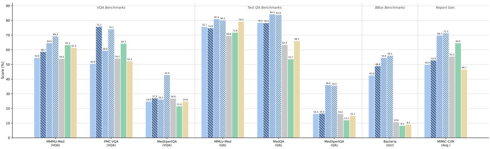

[← 返回 README](../README.md)

---

## 📌 Preview

引言部分指出了医学 MLLM 的三个核心缺口：依赖蒸馏数据而缺乏结构化监督、模态覆盖范围窄、以及跨模态泛化能力不足。MedMO 通过一个可扩展的渐进式后训练流程（使用来自 45 个数据集的 2600 万+样本）来解决这些问题。

---

## 1. Introduction

Recent advancements in Multimodal Large Language Models (MLLMs) have significantly accelerated progress across multimodal reasoning and understanding tasks [16, 21, 39, 62, 112]. These models unify vision and language comprehension, achieving near-human performance on tasks such as image captioning, visual question answering (VQA), and multimodal reasoning. Despite their remarkable capabilities in general domains, their application to the medical domain remains substantially limited [43, 61, 99]. Biomedical data fundamentally differ from web-scale vision--language pairs: medical images demand precise, domain-specific interpretation, often requiring expert contextualization and robust grounding to textual clinical knowledge [46]. As a result, general-purpose models frequently produce uncertain or hallucinated outputs when applied to medical tasks [14, 45].

To overcome these challenges, recent efforts have sought to adapt general-domain MLLMs into specialized medical multimodal models by incorporating domain-specific data and supervision [32, 76, 93, 107, 110]. Early models such as LLaVA-Med[45] leveraged PubMed-derived datasets for aligning medical images with textual knowledge, achieving foundational progress but limited by noisy data and narrow modality coverage. Subsequent works such as HuatuoGPT-Vision [14], GMAI-VL [46], and HealthGPT [47] introduced high-quality datasets, refined post-training strategies, and scaling recipes that improved alignment and reasoning. Parallel advancements in reasoning-based models, such as OpenAI's o-series [63, 65] and DeepSeek-R1 [23], as well as reinforcement learning with verifiable rewards (RLVR)[77, 104], have inspired recent medical research efforts[40, 68] toward enhancing reasoning reliability and factual grounding in clinical scenarios.

Nevertheless, three key limitations persist in existing medical MLLMs. (1) The majority rely on distilled data from advanced proprietary models [21, 22, 62, 63, 64, 65], which, while scalable, often lack accurate domain grounding, particularly for fine-grained clinical reasoning. (2) Distillation pipelines frequently depend solely on generative outputs without structured supervision, amplifying hallucination risks and inconsistencies. (3) Current models focus on individual tasks or narrow modality subsets (e.g., radiology or pathology) rather than achieving unified, cross-modal generalization across the diverse imaging modalities prevalent in real-world healthcare.

To bridge these gaps, we introduce MedMO, a powerful open-source post-trained multimodal large vision--language model (VLM) purpose-built for comprehensive medical image understanding and grounding (See Figure 1). MedMO is developed through a scalable and modular post-training pipeline, emphasizing progressive multimodal alignment, domain-specific reasoning, and cross-modal robustness. We curate and harmonize a 26M+ with 45 open-source multimodal dataset, combining diverse medical imaging modalities (radiology, pathology, ophthalmology, dermatology, CT, MRI, ultrasound, and surgical videos) with carefully aligned text sources from open biomedical corpora and general-domain visual data. Through multi-stage posttraining, MedMO progressively enhances its capacity for visual grounding, clinical reasoning, and textual alignment, establishing a scalable pipeline toward a generalist foundation multimodal model for medical AI.

We further conduct comprehensive experiments and analyses on data curation, training, and alignment strategies, providing a transparent and reproducible framework for future medical MLLM development. Extensive evaluations demonstrate that MedMO achieves state-of-the-art (SOTA) performance across diverse benchmarks, surpassing prior open and proprietary systems on tasks including medical VQA, report generation, and diagnostic reasoning.

### Our main contributions are summarized as follows:

* We develop a powerful open-source post-trained multimodal large VLM, MedMO, designed for comprehensive medical image understanding and grounding.

* We curate over 26M multimodal medical and biomedical samples from 45 datasets and establish a multi-stage posttraining that progressively enhances cross-modal alignment and reasoning. This provides a scalable roadmap toward a generalist foundation model for medical.

* To evaluate VLM performance on detection tasks, we construct a dedicated Cell dataset from opensource microscopy images with varying sizes, shapes, and densities.

* We conduct extensive experiments and analyses across data and methodology dimensions, providing an open benchmark for future multimodal medical LLM research and training recipes.

*Figure 1. Benchmark performance of MedMO-4B and MedMO-8B variants (base and Next) across medical VQA, QA, grounding, and report generation. MedMO-8B-Next consistently leads all comparisons, outperforming Fleming-VL-8B by +6.0% on MMMU-Med (69.3% vs. 63.3%), +9.8% on PMC-VQA (74.1% vs. 64.3%), +8.4% on MMLU-Med (80.2% vs. 71.8%), +17.7% on MedQA (83.8% vs. 66.1%), +15.8% on MIMIC-CXR (71.3% vs. 55.5%), and +47.0 IoU on Bacteria grounding (56.1 vs. 9.1). MedMO-4B-Next remains competitive despite its smaller scale, surpassing Fleming-VL-8B on most benchmarks. Overall, MedMO-8B-Next achieves the best average scores (VQA: 72.7%, QA: 60.1%) against Fleming-VL-8B (VQA: 66.1%, QA: 45.7%), while even the compact MedMO-4B-Next (VQA: 68.5%, QA: 55.0%) outperforms Fleming across both categories, and MedMO-8B (VQA: 63.2%, QA: 61.3%) demonstrates strong QA reasoning despite a lower VQA average.*

> 💡 **Figure 1 批读**: 这张雷达图是整篇论文的"一句话性能概览"。关键观察：(1) MedMO-8B-Next 对 Fleming-VL-8B 的领先在所有维度上是全方位的，没有短板，说明四个训练阶段是协同增效的而非此消彼长的。（2）值得注意的是，MedMO-8B（base，无RL）在 QA 维度（61.3%）反而略高于 Next（60.1%），暗示RL阶段对文本QA可能产生了轻微的遗忘效应。（3）MedMO-4B-Next 的 VQA（68.5%）和 QA（55.0%）击败了 Fleming-VL-8B，这验证了数据质量和课程设计比模型规模更重要。

---

## 🔖 Summary

引言清晰地指出现有医学 MLLM 的三个结构性问题：(1) 依赖蒸馏而无真值监督，导致模型输出缺乏 grounded；(2) 训练中缺乏结构化监督，放大了幻觉风险；(3) 大多数模型仅处理狭窄的模态子集。MedMO 的回应——来自 45 个数据集的 2600 万+样本 + 渐进式训练 + grounding 能力——精准针对这三个问题。四项贡献涵盖了模型开发、数据工程、基准构建和实证分析。

> 💡 **问题动机 深度解读**: 三个局限的排序值得注意。第一条（依赖蒸馏数据）是根源性的：从 GPT-4V 等 proprietary model 蒸馏数据虽然可扩展，但这些模型的医学知识本身就不可靠（GPT-4V 在医学任务上的幻觉率可达 30-40%），蒸馏只会"垃圾进，垃圾出"。MedMO 的核心立场是：用开源、结构化、多任务的监督信号替代蒸馏，从根本上解决医学知识的"grounding"问题。

> 💡 **规模解读**: "26M+ samples from 45 datasets" 的具体构成在正文中展开：核心是 MedTrinity 的 18.5M 对（占71%），其余 7.5M+ 来自其余 44 个数据集。这意味着数据集的基础是健康但并非完美 -- MedTrinity 本身是自动生成的 instruction-following 数据，可能存在噪声。后续 stage 2-4 的高质量和专家标注数据（3M + 4.3M + 300K）共计约 7.6M，占总数据量的 ~29%，这部分才是真正的"质量提升"。

> 💡 **Q&A 批注记录**: MedMO-8B (base) 在 QA 上的表现（61.3%）甚至略高于 RL 后的 Next 版本（60.1%），这是否说明 GRPO/RLVR 在医学文本 QA 上是不必要甚至有害的？参见 Section 4 中的更详细消融分析。

[← 返回 README](../README.md)
