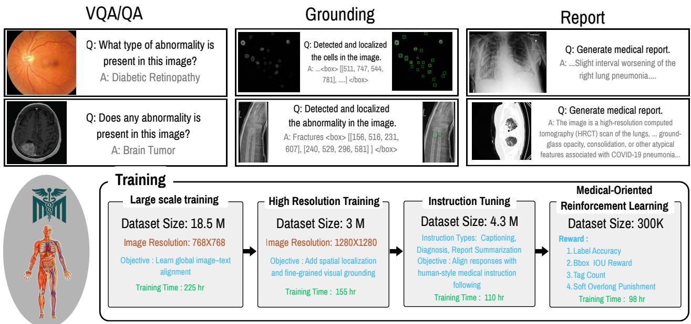

[← 返回 README](../README.md)

---

## 📌 Preview

MedMO 基于 Qwen3-VL 构建，采用四阶段流程：(1) 在 18.5M 图文对上进行通用医学 SFT；(2) 在 3M 样本上进行高分辨率 SFT 并引入 grounding；(3) 在 4.3M 对上进行指令微调；(4) 基于 GRPO 的 RL，采用新颖的边界框奖励（使用 Hungarian 匹配的 GIoU + 归一化 L1）。

---

## 3. Methodology-MedMO

The overall methodology and multi-stage training pipeline are provided in Figure 2. Starting from the Qwen3-VL-8B-Instruct model, our approach consists of four sequential post-training stages: (1) General SFT aimed to train on large-scale instruction data to build foundational medical understanding; (2) High-quality medical image supervised fine-tuning, focused on expert-curated data to enhance visual grounding; (3) Instruction tuning and grounding fine-tuning, which align the model with clinical answering and spatial localization tasks; and (4) Reinforcement learning, designed to further improve instruction-following behavior and grounding accuracy. The following subsections provide an overview of the supervised fine-tuning strategy, followed by detailed descriptions of each stage.

### 3.1. Overview of Supervised Fine-tuning

Our supervised fine-tuning (SFT) approach follows the standard next-token prediction paradigm for vision-language models. Given a multimodal input consisting of an image v and text sequence **x** = {x_1, x_2, ..., x_n}, the model learns to predict the target response **y** = {y_1, y_2, ..., y_m} by maximizing the conditional likelihood:

$$\mathcal { L } _ { \mathrm { S F T } } = - \sum _ { i = 1 } ^ { m } \log p _ { \theta } ( y _ { i } \mid \mathbf { v } , \mathbf { x } , y _ { < i } ) ,\tag{1}$$

where θ represents the model parameters, and y_<i denotes all previously generated tokens. MedMO builds upon the Qwen3-VL architecture, which consists of three primary components: (1) a vision encoder E_v that processes input images into visual representations; (2) a vision--language adapter A that projects multi-level ViT features into the language model's embedding space through a DeepStack fusion mechanism, capturing fine-grained visual details and enhancing image--text alignment; and (3) a large language model decoder D that generates textual responses.

> 💡 **公式批读 (Eq. 1)**: 标准next-token prediction的negative log-likelihood。关键点在于条件变量中同时包含 image v 和 text prompt x -- 这是标准的VLM SFT formulation。值得注意的是，MedMO 并没有引入任何对比损失或专门的 vision-language 对齐损失，完全依赖自回归语言建模驱动跨模态学习。这种"所有任务皆为 text generation"的设计简化了训练，但可能导致 visual feature 的利用效率不够高。

### 3.2. Stage 1: General Medical SFT

The first stage aims to establish foundational medical knowledge across diverse modalities and clinical scenarios. We utilize the publicly available MedTrinity dataset [96], comprising 18.5M large-scale instruction-following samples. This dataset D_general spans multiple imaging modalities (X-ray, CT, MRI, ultrasound, pathology, etc.) and includes captioning, visual question answering (VQA), and general-domain multimodal tasks, as illustrated in Figure 4.

The Stage 1 dataset consists of:

* Medical image captioning: D_caption with detailed textual descriptions of medical images.
* Medical VQA: D_vqa covering disease identification, anatomical recognition, and reasoning tasks.
* General multimodal data: D_general-mm for maintaining broad visual--language alignment.

The combined dataset is defined as:

$$\mathcal { D } _ { \mathrm { s t a g e } 1 } = \mathcal { D } _ { \mathrm { c a p t i o n } } \cup \mathcal { D } _ { \mathrm { v q a } } \cup \mathcal { D } _ { \mathrm { g e n e r a l - m m } } .\tag{2}$$

> 💡 **机制拆解 - Stage 1 设计哲学**: Stage 1 用 18.5M 样本做大规模宽域对齐，这个设计的关键在于 D_general-mm（通用多模态数据）的引入。论文强调这部分数据是为了"maintaining broad visual--language alignment"，即防止模型在医学领域过度特殊化而丧失通用视觉理解能力。这反映了医学 VLM 训练的一个核心张力：如何在 domain-specific knowledge 和 general vision-language capabilities 之间取得平衡。

*Figure 2. Overview of the multi-stage training pipeline for medical image analysis. The workflow consists of three main capabilities: (Top row) VQA/QA for identifying abnormalities in medical images, Grounding for spatial localization of detected features with bounding box coordinates, and Report generation for producing detailed medical reports. (Bottom) The training pipeline progresses through four sequential stages: (1) Large-scale training on 18.5M image-text pairs at 768x768 resolution for global image-text alignment, (2) High-resolution training on 3M samples at 1280x1280 resolution to enhance spatial localization and fine-grained visual grounding, (3) Instruction tuning on 4.3M samples covering captioning, diagnosis, and report summarization tasks to align responses with human-style medical instruction following, and (4) Medical-oriented reinforcement learning on 300K samples optimized using four reward signals: label accuracy, bounding box IoU, tag count, and soft overlap punishment. The complete pipeline for the MedMO-8B.*

> 💡 **Figure 2 批读**: 这张Pipeline图将MedMO的设计逻辑讲得最清楚。上半部分是三个能力输出（VQA/QA, Grounding, Report Generation），下半部分是四个训练阶段的递进。关键设计选择：
> (1) 分辨率变化 -- Stage 1 (768) → Stage 2 (1280)，分辨率提升专门服务于fine-grained visual grounding。
> (2) 数据量递减 -- 18.5M → 3M → 4.3M → 300K，遵循 "大而全→少而精" 的质量递进。
> (3) 四个reward信号中，label accuracy 和 bounding box IoU 是最核心的两个，tag count 和 soft overlap punishment 是辅助性的正则化信号（控制box数量的合理性）。

### 3.3. Stage 2: Quality Medical Image and Grounding

The second stage of SFT focuses on high-quality, expert-annotated medical image--text pairs to strengthen visual understanding and introduce grounding capability. We curate a refined dataset D_hq that includes both standard image--text supervision and medical grounding datasets containing bounding-box annotations (e.g., Chest X-ray, Wrist X-ray, Cell Microscopy, and CT). This stage extends the model's visual encoder to predict localized features and bounding box coordinates, enabling spatial awareness while preserving global image--text alignment. Training objectives remain consistent with Stage 3.2, combining captioning and VQA with supervised grounding signals.

**Grounding Dataset.** The grounding dataset D_ground includes: (1) Object detection annotations for anatomical structures and lesions, (2) Referring expression comprehension, and (3) Visual grounding QA pairs for spatial localization.

> 💡 **机制拆解 - Stage 2 引入了什么新能力**: Stage 2 的核心创新在于将 grounding 作为首个引入的显式空间能力。关键在于"preserving global image--text alignment" -- grounding supervision 是作为额外信号嵌入到已有的 captioning+VQA 框架中的，而非独立训练一个 detection head。这种"unified generation"方式使得 bounding box 可以像普通文本 token 一样通过自回归生成（"box coordinates as text tokens"），与 Qwen2.5-VL 的 grounded output 范式一致。

> 💡 **Q&A 批注记录**: 为什么 grounding 放在 Stage 2 而不是 Stage 1？可能原因是 Stage 1 的 MedTrinity 数据（18.5M）虽然规模大但质量不够高，在低质量数据上引入 bounding box supervision 可能导致模型学到错误的定位模式。先建立基本的医学理解（Stage 1），再在高质量数据上引入 grounding（Stage 2），是更稳健的策略（先泛化后特化）。

### 3.4. Stage 3: Instruction Tuning

The third stage aligns MedMO's responses with humanstyle medical reasoning through instruction tuning. Using a dataset D_inst of 4.3M multimodal instruction--response pairs, this phase covers captioning, diagnostic question answering, report summarization, and retrieval-based reasoning tasks. Instruction tuning improves task generalization and factual consistency, integrating clinical context understanding into both text- and vision-guided reasoning.

> 💡 **Stage 3 与 Stage 2 的区分**: Stage 2 聚焦于"看准"（grounding + high-resolution），Stage 3 聚焦于"说对"（instruction-following + reasoning）。4.3M instruction pairs 的数据规模虽小于 Stage 1 的 18.5M，但数据质量更高，且包含了完整的 diagnostic QA 和 report summarization 任务，是模型医学推理能力的核心塑造阶段。

### 3.5. Stage 4: Reinforcement Learning

The final stage employs GRPO [77] to enhance instruction-following capabilities through preference learning.

**GRPO Objective.** It optimizes the model by comparing multiple sampled responses for the same input. For each input (v, x), we sample G responses {y^(1), ..., y^(G)} from the current policy π_θ. Each response is evaluated using a reward function r(v, x, y) that measures quality.

We follow the same objective as in GRPO [23, 77] with clip-higher and token level loss motivated from from DAPO [104]. For (q, a) ~ D, {o_i}_(i=1)^G ~ π_(θ_old)(·|q):

$$J ( \theta ) = \mathbb { E } _ { ( q , a ) , o _ { i } } \lfloor \frac { 1 } { \sum _ { i = 1 } ^ { G } | o _ { i } | } \sum _ { i = 1 } ^ { \cup } | o _ { i } | \sum _ { t = 1 } \operatorname* { m i n } ( r _ { i , t } ( \theta ) \hat { A } _ { i , t } ,$$

$$\mathrm { c l i p } \big ( r _ { i , t } ( \theta ) , 1 - \varepsilon _ { \mathrm { l o w } } , 1 + \varepsilon _ { \mathrm { h i g h } } \big ) \hat { A } _ { i , t } \Big ) \Bigg ]\tag{3}$$

$$r _ { i , t } ( \theta ) = \frac { \pi _ { \theta } ( o _ { i , t } \mid q , o _ { i , < t } ) } { \pi _ { \theta _ { \mathrm { o l d } } } ( o _ { i , t } \mid q , o _ { i , < t } ) } ,\tag{4}$$

$$\hat { A } _ { i , t } = \frac { R _ { i } - \mathrm { m e a n } ( \{ R _ { i } \} _ { i = 1 } ^ { G } ) } { \mathrm { s t d } ( \{ R _ { i } \} _ { i = 1 } ^ { G } ) } .\tag{5}$$

The KL divergence term ensures the policy doesn't deviate too far from the reference model π_ref:

$$\begin{array} { r } { \mathcal { L } _ { \mathrm { K L } } = \mathbb { E } _ { ( \mathbf { v } , \mathbf { x } , \mathbf { y } ) } \left[ D _ { \mathrm { K L } } ( \pi _ { \theta } ( \cdot  { | } \mathbf { v } , \mathbf { x } ) \| \pi _ { \mathrm { r e f } } ( \cdot  { | } \mathbf { v } , \mathbf { x } ) ) \right] . } \end{array}\tag{6}$$

For the reward function, we combine label accuracy, bounding-box reward, tag count, and soft-overlap penalty (see Fig. 2). While these components are common in RLbased training, we introduce the Bounding Box Reward as a verifiable, spatially grounded signal that directly enhances localization performance.

> 💡 **公式批读 (Eq. 3-6) -- GRPO 核心机制**: 
> GRPO（Group Relative Policy Optimization）的核心思想是：对每个 prompt 采样 G=8 个 response，用组内相对排名（均值/标准差归一化）作为 advantage 信号（Eq. 5），避免了需要训练单独的 critic/value function。Eq. 3 中的 clip 机制借鉴了 PPO 的 trust region 约束，但使用了不对称的 clip bounds (ε_low=0.15, ε_high=0.25，非对称裁剪允许更大的正向更新)。
> Eq. 6 的 KL penalty 是标准的 policy regularization，防止模型在 RL 过程中过分偏离 SFT 阶段学到的医学知识（防止 catastrophic forgetting）。

> 💡 **机制拆解 -- 为什么用 DAPO 的 token-level loss**：标准的 GRPO 使用 sequence-level advantage（整条 response 的总 reward），但 DAPO 引入了 token-level loss，允许对 response 中的每个 token 进行差异化更新。这对 medical grounding 特别重要：一个 response 中可能包含正确的诊断（高 reward）和错误的 box 坐标（低 reward），token-level 更新可以分别对待这两部分。

#### 3.5.1. Bounding Box Reward

Given ground truth boxes G = {g_j}_(j=1)^G and predictions P = {p_i}_(i=1)^P in XYXY format and GIoU_ij in [-1, 1] [71], we score pairs via

$$L 1 _ { i j } = \frac { | x _ { 1 } ^ { p } - x _ { 1 } ^ { g } | + | y _ { 1 } ^ { p } - y _ { 1 } ^ { g } | + | x _ { 2 } ^ { p } - x _ { 2 } ^ { g } | + | y _ { 2 } ^ { p } - y _ { 2 } ^ { g } | } { 2 \sqrt { H ^ { 2 } + W ^ { 2 } } }$$

Normalize by the average image dimension makes the denominator resolution-invariant and proportional to image diagonal length. We obtain a one-to-one assignment M ⊆ {1...P} x {1...G} by Hungarian matching on

$$C _ { i j } = w _ { \mathrm { L } 1 } ^ { m } L 1 _ { i j } + w _ { \mathrm { G } } ^ { m } \left( 1 - \mathrm { G I o U } _ { i j } \right) , \quad w _ { \mathrm { L } 1 } ^ { m } = 5 , ~ w _ { \mathrm { G } } ^ { m } = 2 .$$

For each matched pair (i, j) in M, define a per-pair quality

$$s _ { i j } = \frac { w _ { \mathrm { L 1 } } \left( 1 - \mathrm { c l i p } _ { [ 0 , 1 ] } ( L 1 _ { i j } ) \right) + w _ { \mathrm { G } } \left( \frac { \mathrm { G I o U } _ { i j } + 1 } { 2 } \right) } { w _ { \mathrm { L 1 } } + w _ { \mathrm { G } } } ,$$

where w_L1 = 5, w_G = 2. The reward is a coverage-normalized sum with optional FP/FN penalties (Pen):

$$\mathbf { B } = \frac { 1 } { G } \sum _ { ( i , j ) \in M } s _ { i j } , \mathrm { P e n } = \frac { \lambda _ { \mathrm { F N } } ( G - | M | ) + \lambda _ { \mathrm { F P } } ( P - | M | ) } { \operatorname* { m a x } ( 1 , G ) } ,$$

$$\begin{array} { r }  \boxed { R _ { \mathsf { b b o x } } = \mathrm { c l i p } _ { [ 0 , 1 ] } \big ( \mathbf { B } - \mathbf { P e n } \big ) } \end{array} .$$

> 💡 **公式批读 -- Bounding Box Reward 的工程智慧**: 这是论文中最精巧的 reward 设计。(1) **Hungarian匹配** 确保了全局最优的一对一box分配，避免greedy匹配可能导致的次优pairing。(2) **L1和GIoU的加权组合**（5:2）更重视空间位置精度而非重叠度 -- 这个权重选择是经验性的，但反映了医学grounding中"先找到大致位置，再精确框选"的优先级。(3) **Coverage Normalization**（除以G而非除以|M|）确保即使部分miss也不能得满分，鼓励full coverage。(4) **FP/FN Penalty** 在default λ=0时是关闭的，意味着base reward主要优化precision，可选择性地加入recall惩罚。

> 💡 **Q&A 批注记录**: 为什么 w_L1=5 > w_G=2？L1重配比GIoU重配高2.5倍。这暗示作者认为在RL训练初期，模型更需要学习"box的中心在哪里"而非"box的大小是否精确" -- L1捕捉位置偏差，GIoU捕捉形状偏差。在实际医学图像中，abnormality的边界本身就模糊，精确的GIoU高分不如合理的空间定位重要。

---

## 🔖 Summary

方法论由三个 SFT 阶段加一个 RL 阶段构成。从 18.5M 粗粒度对齐到 300K 细粒度 RL（带边界框奖励）的阶段递进遵循课程设计思路。使用 Hungarian 匹配的 GIoU + 归一化 L1 边界框奖励是最具新颖性的组件，提供了可验证的空间信号来驱动 grounding 提升，而无需额外的检测头。

[← 返回 README](../README.md)
