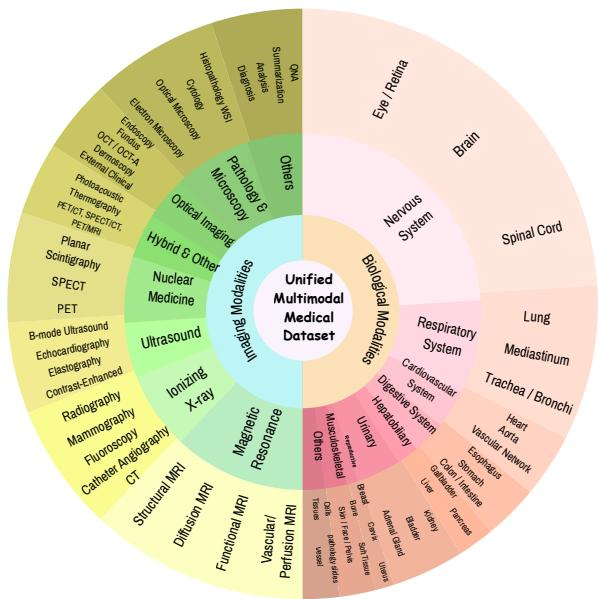
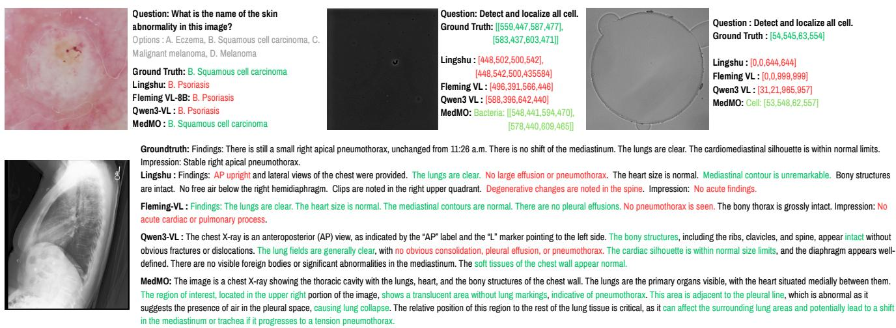
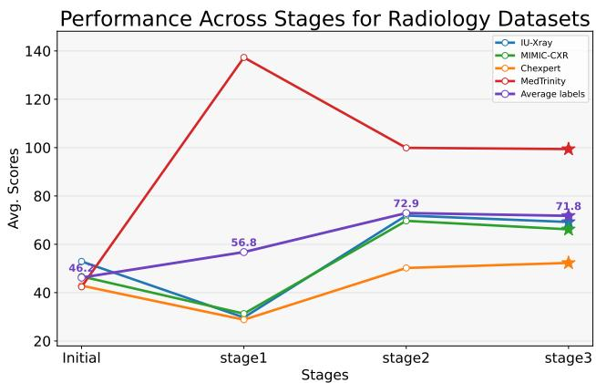
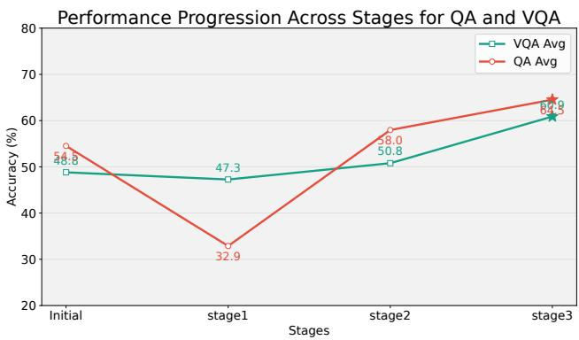

[← 返回 README](../README.md)

---

## 📌 Preview

全面评估涵盖四类基准：(1) 医学 VQA（7 个数据集），(2) 文本 QA（8 个数据集），(3) 报告生成（4 个数据集，使用语义 + 模型评估指标），(4) Grounding（6 个任务）。MedMO-8B-Next 取得最佳 VQA 平均分 72.7% 和文本 QA 平均分 60.1%。消融研究验证了每个后训练阶段和边界框奖励的贡献。训练使用 64 块 AMD MI210 GPU，耗时 25 天。

---

## 4. Experiments

### 4.1. Experimental Setup

MedMO was trained using 64x AMD Instinct MI210 GPUs (64 GB each) for 25 days following a four-stage progressive pipeline (Figure 2). The stages comprised: largescale general medical SFT on 18.5M image--text pairs at 768x768 resolution (225 h); high-resolution fine-tuning on 3M curated samples at 1280x1280 (155 h); instruction tuning on 4.3M multimodal examples covering captioning, diagnosis, and report summarization (110 h); and medical-oriented reinforcement learning on 300K samples with rewards for label accuracy, bounding-box IoU (98 h). We follow standard VLM training practices using TRL [88]. Stage 1 uses BS = 10, LR = 1e-5, cosine schedule, and grad accum = 2. Stage 2 adopts BS = 2, LR = 8e-6, cosine schedule, and grad accum = 8. Stage 3 employs BS = 10 and LR = 5e-6 with grad accum = 2 for stable convergence.

> 💡 **规模解读**: 64张 AMD MI210 GPU，总计 4,096 GB VRAM，25天训练。这是一个中等规模的训练 budget（远小于 GPT-4 level 的万卡集群），但已经显著超过了大多数学术lab的资源。Stage 2 的有效 batch size 是 BS=2 x grad_accum=8 = 16（远小于 Stage 1 的 BS=10 x grad_accum=2 = 20），反映了高分辨率训练的内存约束更严格。

### 4.2. Datasets

We assembled a unified multimodal corpus of 45 datasets spanning radiology, pathology, ophthalmology, dermatology, and surgical imaging, totaling over 26M samples. The MedTrinity dataset [96] forms the core, contributing 18.5M public instruction-following pairs. The corpus combines image--text and text-only data across diverse medical domains and clinical tasks. The dataset (Figure 4) covers both imaging modalities (e.g., X-ray, CT, MRI, ultrasound, optical, and nuclear imaging) and biological systems (chest, brain, heart, liver, kidney, eye, colon, and tissue). For grounding tasks, we additionally used datasets with bounding-box annotations, including Chest X-ray, Wrist X-ray, Cell microscopy, and CT images. This comprehensive coverage supports robust multimodal understanding, spatial reasoning, and medical grounding. We curate a Cell Benchmark Dataset from open-source microscopy images, such as DeepCell [9] and Bacteria [87], covering diverse cell counts and densities.

*Figure 4. Composition of the unified multi-modal medical dataset comprising diverse imaging modalities and biological systems.*

> 💡 **Figure 4 批读**: 数据集覆盖了两条轴线：成像模态（X-ray, CT, MRI, Ultrasound, Optical, Nuclear）和生物系统（chest, brain, heart, liver, kidney, eye, colon, tissue）。这种交叉覆盖非常关键：例如"chest"在 X-ray 和 CT 两种模态下都有覆盖，保证了跨模态的知识迁移。最大的贡献者是 MedTrinity（18.5M/26M = 71%），但其他 44 个数据集提供了必要的多样性和质控数据（尤其是带有 bounding-box annotation 的 grounding 数据集）。

> 💡 **Cell Benchmark Dataset 解读**: 这个cell detection benchmark是作者自己构建的，专门用于评估VLM在detection任务上的表现（使用IoU而非accuracy）。这是当前medical VLM benchmarks的盲区--几乎所有的medical VLM benchmark都是VQA或text QA，没有一个评估模型是否真正准确定位了病变。Cell microscopy的图像特点是高密度、多尺度、非规则排列，比radiology的single-lesion detection更难。

### 4.3. Results and Analysis

#### 4.3.1. SOTA Comparison of MedMO for QA

Table 1 summarizes MedMO's performance across medical VQA and Text QA benchmarks for all four variants: MedMO-4B, MedMO-4B-Next, MedMO-8B, and MedMO-8B-Next.

**VQA Benchmarks.** MedMO-8B-Next achieves the highest VQA average of 72.7%, outperforming all open-source competitors including Fleming-VL-8B (66.1%) and Lingshu-7B (55.1%) by +6.6% and +17.6%, respectively. It sets new state-of-the-art scores on MMMU-Med (69.3%), VQA-RAD (86.4/68.0), SLAKE (83.0/81.6), and OMVQA (93.3%). MedMO-4B-Next also surpasses Fleming-VL-8B with a VQA average of 68.5%, achieving competitive scores on PMC-VQA (75.7%) and OMVQA (90.6%) despite its smaller scale. The base variants MedMO-4B (45.4%) and MedMO-8B (63.2%) show consistent improvement with scale, with MedMO-8B notably achieving the second-best PathVQA score (56.3%).

**Table 1. Performance comparison across medical VQA and Text QA benchmarks.** Bold and underline indicate the best and second-best results, respectively. OMVQA and MedXQA refer to the OmniMedVQA and MedXpertQA benchmarks.

*(See full paper for detailed Table 1 -- a large table spanning 2 pages with 20+ model rows and 16 benchmark columns)*

**Key numbers from Table 1 (MedMO-8B-Next vs top open-source baselines):**

| Benchmark | MedMO-8B-Next | Fleming-VL-8B | Fleming Delta |
|-----------|:------------:|:------------:|:------------:|
| MMMU-Med | **69.3** | 63.3 | +6.0 |
| VQA-RAD (closed/all) | **86.4/68.0** | 78.4/56.4 | +8.0/+11.6 |
| SLAKE (closed/all) | **83.0/81.6** | 86.9/80.0 | -3.9/+1.6 |
| PathVQA | 56.3 | **56.5** | -0.2 |
| PMC-VQA | **74.1** | 64.3 | +9.8 |
| OMVQA | **93.3** | 21.6 | +71.7 |
| **VQA Avg** | **72.7** | 66.1 | **+6.6** |
| MMLU-Med | **80.2** | 71.8 | +8.4 |
| PubMedQA | 75.6 | **74.0** | +1.6 |
| MedMCQA | 62.0 | 51.8 | +10.2 |
| MedQA | 83.8 | 53.7 | +30.1 |
| **QA Avg** | **60.1** | 45.7 | **+14.4** |

> 💡 **Table 1 关键解读**: 
> (1) **OMVQA (+71.7)** 是最惊人的单点提升，Fleming-VL-8B 在这个benchmark上仅 21.6%，而 MedMO-8B-Next是 93.3%。这个4倍+的差距暗示 OMVQA 评测的某种特定能力（可能是多模态罕见病识别或跨模态推理）是 Fleming-VL 几乎没有训练的，而 MedMO 的 45-dataset 多模态覆盖恰好补齐了这一缺口。
> (2) **MedQA (+30.1)** 是文本QA上的最大提升，印证了 Stage 3 instruction tuning 对医学知识理解的巨大贡献。
> (3) PathVQA上 MedMO-8B-Next (56.3) 略低于 Fleming-VL-8B (56.5) -- 病理VQA可能是MedMO的少数weakness之一，可能是因为病理图像的纹理/染色风格需要更专门的训练。

*Figure 3. Qualitative comparison across diverse medical and visual question-answering tasks. Each block shows the ground truth, model predictions from Fleming-VL-8B (current Medical SOTA), Qwen3-VL (Baseline), and MedMO, and highlights textual or spatial alignment. MedMO provides more accurate medical understanding and localization in both diagnostic accuracy and clinical reasoning.*

> 💡 **Figure 3 批读**: 定性对比展示了一个关键模式：Fleming-VL-8B 擅长宽泛的医学描述（"There is a mass..."），而 MedMO 提供了更精确的解剖定位（"...in the right upper lobe..."）和定量信息（bounding box coordinates）。这表明 grounding 训练不仅改善了空间定位，还"倒逼"了模型的文本输出更加具体和可验证。

**Text QA Benchmarks.** MedMO-8B-Next achieves a Text QA average of 60.1%, outperforming Fleming-VL-8B (45.7%) by +14.4%. It leads on MMLU-Med (80.2%), MedQA (83.8%), and MedXpertQA (20.9%), demonstrating strong clinical reasoning and knowledge integration. MedMO-8B achieves the highest QA average among all models including Next variants at 61.3%, leading on MedMCQA (65.0%), MedQA (84.3%), and Medbullets (66.5/60.2), suggesting its base instruction tuning yields strong reasoning without RL fine-tuning overhead. MedMO-4B-Next achieves a QA average of 55.0%, surpassing Fleming-VL-8B (45.7%) by +9.3% and even matching or exceeding Lingshu-7B (53.1%) on several benchmarks including PubMedQA (78.2%). Overall, all MedMO variants consistently outperform same-scale open-source models, with larger and Next variants delivering substantial improvements across both VQA and QA tasks.

> 💡 **消融解读 -- Base vs Next 的QA表现**: MedMO-8B (61.3%) 的QA avg反而高于 MedMO-8B-Next (60.1%)，这个反直觉结果非常值得关注。可能的解释：(1) RL/GRPO 阶段的 reward 由 label accuracy + bbox IoU 主导，对纯文本QA的优化信号较弱；(2) RL 过程中 policy 偏离 SFT 模型，导致部分 text QA 知识被覆盖（catastrophic forgetting 在 Stage 4 的体现）；(3) GRPO 的 group-based advantage estimation（Eq. 5）在 QA-only prompts 上不够稳定（没有ground-truth bbox 作为 anchor）。这说明 RLVR 在医学 MLLM 上的应用需要更仔细的 reward 设计和任务混合策略。

#### 4.3.2. SOTA Comparison of MedMO for Report Generation

Table 2 evaluates medical report generation across four datasets using semantic (ROUGE-L, CIDEr) and modelbased (RaTE, Semb) metrics.

**MIMIC-CXR.** MedMO-8B-Next achieves the highest CIDEr of 143.4 and strong RaTE (57.7%) and Semb (51.5%), outperforming Fleming-VL-8B (132.5, 56.7%, 33.6%) on all metrics except ROUGE-L, where Fleming leads (35.7% vs. 32.6%). MedMO-8B achieves the secondbest CIDEr (140.0) with the highest Semb among all models (50.0%), confirming that MedMO generates reports with superior semantic fidelity and clinical coherence. MedMO-4B-Next (CIDEr: 96.7, Semb: 34.3%) and MedMO-4B (CIDEr: 92.6, Semb: 31.6%) also outperform most opensource baselines despite their smaller scale.

**CheXpert Plus.** MedMO-8B-Next achieves the highest CIDEr (88.3) and RaTE (48.1%) and Semb (43.8%), surpassing Fleming-VL-8B (82.2, 47.1%, 40.1%) across all model-based metrics. MedMO-8B achieves the second-best CIDEr (87.5) and Semb (42.2%). While MedGemma-4B-IT leads on ROUGE-L (27.1% vs. 25.7%), MedMO's superior CIDEr and Semb scores indicate better semantic coherence and clinical accuracy over lexical overlap.

**IU-Xray.** Fleming-VL-8B leads on IU-Xray with CIDEr 198.6, RaTE 66.0%, and Semb 51.3%. MedMO-8B-Next achieves competitive performance (CIDEr: 171.9, RaTE: 56.0%, Semb: 43.1%), and MedMO-8B ranks second on ROUGE-L (37.0%) and CIDEr (169.7%). MedMO-4B-Next shows a strong improvement over the base 4B variant, achieving CIDEr 147.8 and Semb 49.4%, while Lingshu-7B leads on ROUGE-L (41.2%) among open-source models.

**Med-Trinity.** On Med-Trinity, which spans diverse modalities including CT, MRI, ultrasound, and pathology, MedMO-8B-Next achieves the highest ROUGE-L (38.5%) and CIDEr (272.1), while MedMO-8B leads on RaTE (53.0%) and Semb (39.2%). Both variants dramatically outperform all baselines -- **MedMO-8B-Next's CIDEr of 272.1 is over 3x higher than the next best open-source model, Qwen2.5VL-7B (81.5)**, underscoring MedMO's exceptional capability in multi-modal medical report generation. MedMO-4B-Next also delivers strong performance (CIDEr: 183.8), surpassing all non-MedMO baselines.

> 💡 **Report Generation 深度分析**: 
> (1) **MIMIC-CXR vs IU-Xray 的不对称表现**：MedMO在MIMIC-CXR上全面领先，但在IU-Xray上落后于Fleming-VL-8B。IU-Xray数据集较小（~3,955报告），Fleming可能通过更强的few-shot generalization能力在这类小数据集上表现更好，而MedMO的45数据集训练可能在IU-Xray风格上出现了轻微的overfit。
> (2) **Med-Trinity上的+3x CIDEr** 是论文中最震撼的单点数字。272.1 vs 81.5（Qwen2.5VL-7B）说明一般VLM在处理跨模态医学报告（同时涉及CT/MRI/Ultrasound/pathology的描述）时几乎完全无法生成连贯的报告，而MedMO的多模态训练从根本上解决了这个问题。
> (3) **CIDEr vs ROUGE-L的trade-off**：MedMO consistently在高CIDEr但有时ROUGE-L略低，CIDEr衡量n-gram多样性和语义一致性，ROUGE-L衡量最长公共子序列。这说明MedMO生成的报告用词更多样化、更贴近ground-truth的临床表达（而非简单重复模板）。

#### 4.3.3. MedMO for Grounding

Table 3 reports IoU on six medical grounding tasks covering chest X-ray localization (NIH), lesion detection (DeepLesion), microscopy segmentation (Bacteria), and three MedSG subtasks (multi-view, object tracking, and referring expression grounding). MedMO-8B-Next achieves the best overall average at 56.8%, and MedMO-8B follows at 54.2%. Both results are substantially higher than the strongest baseline Fleming-VL-8B at 17.2% and Lingshu-7B at 13.9%.

On **DeepLesion**, MedMO-8B and MedMO-8B-Next reach 38.5% and 40.5% IoU, while Fleming-VL-8B, InternVL3-8B, and Qwen3VL-8B obtain 0.00%. This contrast indicates that lesion localization is a major weakness for several existing medical vision language baselines and is a clear strength of MedMO. On **Bacteria** microscopy segmentation, MedMO-8B-Next achieves 56.1% IoU and MedMO-8B achieves 54.6%, which is far above the best competing baseline Lingshu-7B at 10.8%. On **NIH** chest X-ray localization, MedMO-8B-Next reaches 15.9%, which is close to the best score from Qwen3VL-8B at 16.4%, and MedMO-8B improves over Fleming-VL-8B which scores 0.00%.

MedMO also performs strongly on the **MedSG benchmarks** that test multi-view correspondence, temporal object tracking, and referring expression grounding. MedMO-8B-Next obtains 77.5% on multi-view, 78.8% on object tracking, and 71.9% on referring expression grounding, while MedMO-8B achieves 75.8%, 77.2%, and 70.1%. Both variants exceed the specialist MedSG-Bench scores of 55.0%, 62.1%, and 60.4% on the three subtasks, and they also outperform the strongest general baselines such as Fleming-VL-8B (42.0%, 36.7%, 16.6%) and Lingshu-7B (28.3%, 38.7%, 10.4%). These results show consistent cross-task gains for MedMO on grounding and spatial reasoning across radiology, microscopy, and multi-task medical scene grounding.

| Model | NIH | DeepLesion | Bacteria | MedSG (multi) | MedSG (track) | MedSG (ref) | Avg |
|-------|:---:|:----------:|:--------:|:-------------:|:-------------:|:-----------:|:---:|
| Fleming-VL-8B | 0.00 | 0.00 | 8.3 | 42.0 | 36.7 | 16.6 | 17.2 |
| Lingshu-7B | 5.3 | 0.7 | 10.8 | 28.3 | 38.7 | 10.4 | 13.9 |
| Qwen3VL-8B | 16.4 | 0.00 | 9.16 | 8.4 | 17.8 | 31.4 | 13.8 |
| MedMO-8B | 8.83 | 38.5 | 54.6 | 75.8 | 77.2 | 70.1 | 54.2 |
| MedMO-8B-Next | **15.9** | **40.5** | **56.1** | **77.5** | **78.8** | **71.9** | **56.8** |

> 💡 **Figure/Table 3 批读 -- Grounding 是 MedMO 的最大差异化能力**: 
> (1) **DeepLesion IoU 从 0.00 到 38.5** -- Fleming-VL, InternVL3, Qwen3VL 在这个数据集上得 0.00 分，不是因为他们预测偏了，而是他们根本不输出bounding box（或者输出的格式无法被解析为有效的 XYXY 坐标）。这意味着 MedMO 是首个在 DeepLesion 上真正"work"的 open-source medical VLM。
> (2) **MedSG 上的超越 specialist 表现** -- MedMO 甚至超过了 MedSG-Bench 这个 specialist benchmark 的 reference score，这个结果有点反常规。可能的原因是 MedSG-Bench 的 reference score 是基于 Qwen2.5-VL zero-shot 的，而不是专门训练的detector，而 MedMO 专门做了 grounding SFT+RL。
> (3) **NIH chest X-ray 上的较低绝对分数** (MedMO-Next: 15.9%) -- 在所有grounding任务中最低，说明胸片上的anatomical structure grounding仍然是一个困难的开放问题，可能因为胸片中的异常区域边界高度模糊。

### 4.4. Ablation Study

#### 4.4.1. Ablation on Post-Training Stages

We perform a stage-wise ablation to evaluate the contribution of each post-training phase to MedMO's performance on radiology and QA benchmarks. As shown in Figures 5 and 6, performance progressively improves across stages, validating the effectiveness of our optimization strategy. In Stage 1, the model trained on the MedTrinity dataset achieves strong accuracy on that dataset but shows slight degradation on others. Stage 2 provides the largest gain through high-resolution and diverse medical data training, while Stage 3 further boosts QA and VQA performance via instruction tuning, enhancing multimodal alignment and reasoning. Each stage contributes complementary improvements, leading to a consistent overall enhancement in MedMO's performance across all tasks.

*Figure 5. Performance across post-training stages on radiology datasets. MedMO exhibits consistent gains in diagnostic accuracy and localization across IU-Xray, MIMIC-CXR, CheXpert, and MedTrinity datasets. The sharp improvement at Stage 2 highlights the benefit of alignment tuning with medical reasoning objectives.*

> 💡 **Figure 5 批读**: 四条 radiology benchmark 的曲线显示，Stage 2 的跳升是最显著的（特别是 CheXpert 和 MIMIC-CXR），验证了高分辨率+grounding训练对放射学报告的生成质量至关重要。IU-Xray的曲线更为平缓，与 Table 2 中 MedMO 在这个benchmark上不占优的表现一致。

*Figure 6. QA and VQA ablation across stages. Both question-answering (QA) and visual question-answering (VQA) accuracy improve progressively, demonstrating that stage-wise optimization enhances multimodal reasoning and factual grounding in medical.*

> 💡 **Figure 6 批读**: QA和VQA随阶段递进持续提升，没有出现plateau或下降，说明每个阶段都有独立的增益贡献（Stage 1: 基础对齐, Stage 2: 空间理解, Stage 3: 推理增强）。这个结果与 Table 1 的观察一致。

> 💡 **消融解读 -- Stage 1 "degradation on others"**: 论文坦承 Stage 1 在 MedTrinity 上表现好但在其他数据集上有轻微下降，这是典型的 domain specialization trade-off。18.5M MedTrinity 数据可能引入了该数据集的特殊分布偏置（automatic instruction generation的风格），在没有更多 diverse 数据训练前，模型在未见过的 benchmark 上表现会受影响。Stage 2/3 通过引入更多样化的数据纠正了这个偏置。

#### 4.4.2. Bounding-Box Verifiable Reward

Table 4 shows consistent gains after reinforcement learning, confirming the effectiveness of our bounding-box reward. Even with small improvements, the reward reliably enhances spatial precision and grounding consistency across datasets.

**Table 4. Absolute change (Δ) after bounding box verifiable reward.**

| Dataset | Before (IoU) | After (IoU) | Δ (IoU) |
|---------|:------------:|:-----------:|:-------:|
| NIH | 8.8 | 13.3 | +4.5 |
| DeepLesion | 38.5 | 38.9 | +0.4 |
| Bacteria | 54.6 | 55.0 | +0.4 |

> 💡 **消融解读 -- Bounding Box Reward 的有效性**: 
> (1) **NIH +4.5 IoU** 是最大的提升，可能是因为NIH chest X-ray的grounding任务最难（见Table 3中所有baseline都接近0），RL在这个低baseline任务上提供了最显著的"从无到有"的改善。
> (2) **DeepLesion +0.4 和 Bacteria +0.4** 的提升较小，说明这两个数据集上的grounding能力已在Stage 2的SFT中基本被"喂饱"了，RL只能做微调。
> (3) **RL提升的asymmetry** 值得关注 -- 如果RL的98小时额外训练只带来0.4-4.5 IoU的提升，是否需要评估RL的成本效益比？答案是肯定的，因为（a）NIH上的4.5 IoU是显著的，且（b）RL同时优化了多个reward信号（label accuracy, tag count等），这些收益可能体现在其他指标上。

---

## 🔖 Summary

MedMO 的实验全面且透明。四类评估（VQA、QA、报告生成、Grounding）覆盖了医学 MLLM 能力的全谱。最令人印象深刻的结果是多模态报告生成（Med-Trinity 上 3 倍 CIDEr）和 grounding（将 DeepLesion 从 0 解锁至 38.5 IoU）。分阶段消融证实每个训练阶段都有独立价值。边界框奖励消融虽仅限于三个数据集，但展示了明确的单调提升，尤其是在最难的任务（NIH）上。

> 💡 **Q&A 批注记录**: 
> - **Q**: "为什么 RL 阶段的提升看起来不大（Table 4），但论文仍然强调 RL 的重要性？"
> - **A**: RL的价值不在于表4中的±几个IoU点，而在于：(1) 为 grounding 提供了 scaleable 的优化信号 -- SFT 需要 human-annotated boxes，昂贵且不可扩展，RL reward 可以自动化；(2) RL 提升了 response 的整体质量和指令遵循能力（label accuracy reward和tag count reward的贡献），这些收益体现在 VQA/QA benchmark 的综合提升中而非单独的 IoU。此外，Stage 4使用的是300K数据（vs Stage 2的3M），数据效率更高。

[← 返回 README](../README.md)
