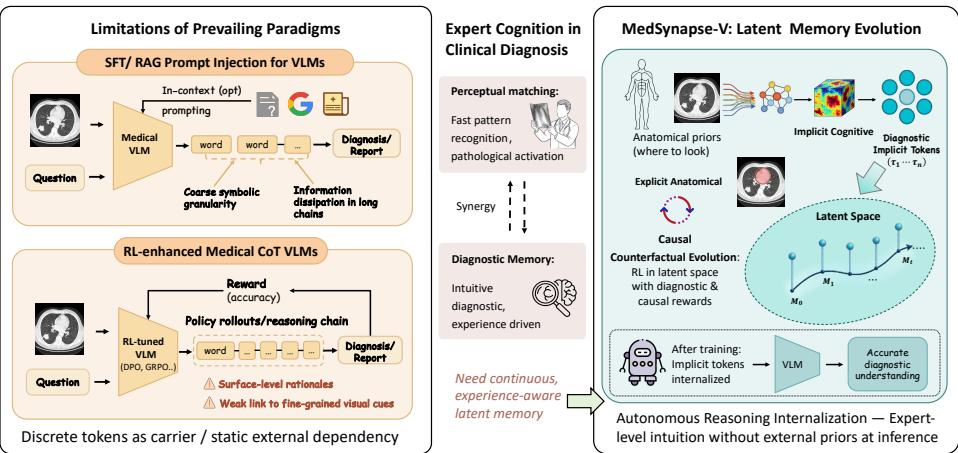
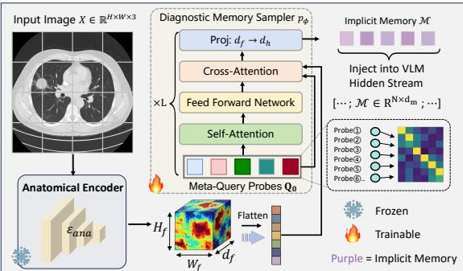
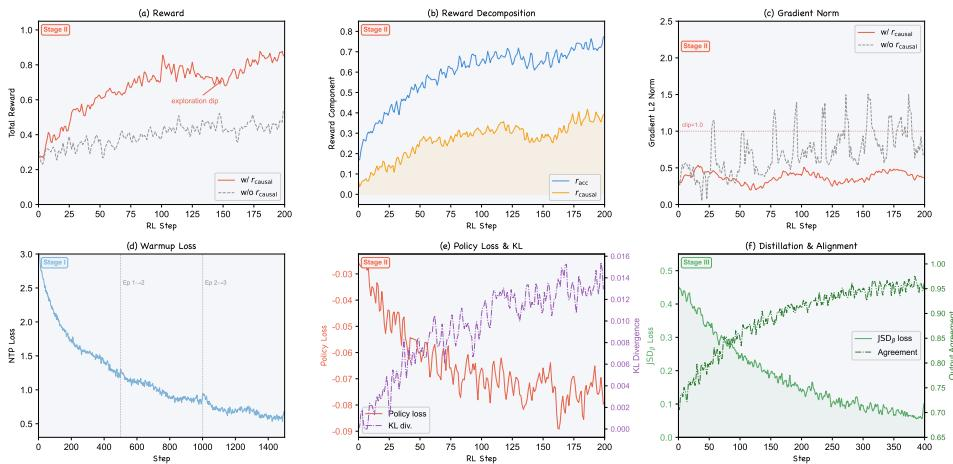
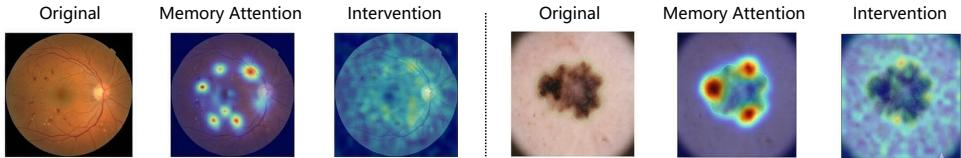
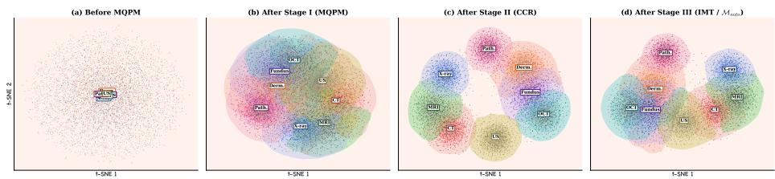
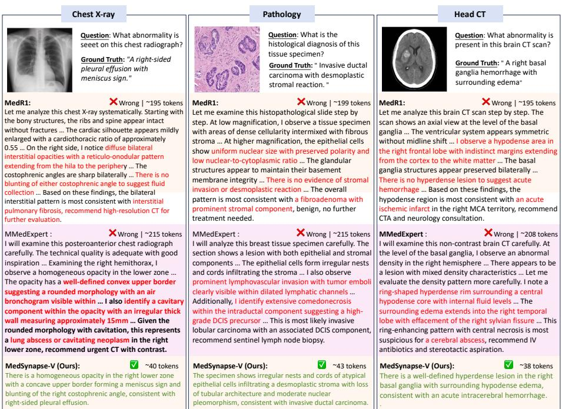
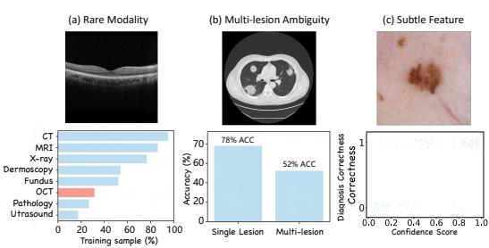
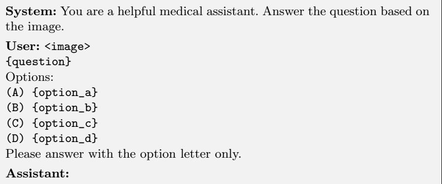

# MedSynapse-V: Bridging Visual Perception and Clinical Intuition via Latent Memory Evolution

Chunzheng Zhu $^ { 1 }$ , Jiaqi Zeng1, Junyu Jiang1, Jianxin Lin $\bot$ ⋆, and Yijun Wang1

Hunan University, Changsha, China {zhuchzh, zjqxxl, jiangjy, linjianxin, wyjun}@hnu.edu.cn

Abstract. High-precision medical diagnosis relies not only on static imaging features but also on the implicit diagnostic memory experts instantly invoke during image interpretation. We pinpoint a fundamental cognitive misalignment in medical VLMs caused by discrete tokenization, leading to quantization loss, long-range information dissipation, and missing case-adaptive expertise. To bridge this gap, we propose MedSynapse-V, a framework for latent diagnostic memory evolution that simulates the experiential invocation of clinicians by dynamically synthesizing implicit diagnostic memories within the model’s hidden stream. Specifically, it begins with a Meta Query for Prior Memorization mechanism, where learnable probes retrieve structured priors from an anatomical prior encoder to generate condensed implicit memories. To ensure clinical fidelity, we introduce Causal Counterfactual Refinement (CCR) which leverages reinforcement learning and counterfactual rewards derived from region-level feature masking to quantify the causal contribution of each memory, thereby pruning redundancies and aligning latent representations with diagnostic logic. This evolutionary process culminates in Intrinsic Memory Transition (IMT), a privilegedautonomous dual-branch paradigm that internalizes teacher-branch diagnostic patterns into the student-branch via full-vocabulary divergence alignment. Comprehensive empirical evaluations across multiple datasets demonstrate that MedSynapse-V, by transferring external expertise into endogenous parameters, significantly outperforms existing state-of-theart methods, particularly Chain-of-Thought (CoT) paradigms, in diagnostic accuracy and multi-dataset generalization without compromising the inference efficiency of standard VLMs.

Keywords: VLMs · Implicit Diagnostic Memory $\cdot$ Latent Space Memory · Causal Counterfactual · Memory Distillation

# 1 Introduction

Seasoned diagnostic experts do not rely on stepwise logical reasoning when making clinical diagnoses; instead, they activate Implicit Diagnostic Memory, that enables near-instantaneous pattern recognition against accumulated case knowledge [4, 35, 48]. Although medical vision-language models (VLMs) have made substantial progress in diagnostic assistance [6, 24, 31, 41, 51], with reinforcement learning from verifiable rewards [19, 37, 44, 45] and chain-of-thought (CoT) [7,12,21,49,50,52] further advancing reasoning capabilities. However, their intrinsic reliance on discrete tokens engenders a profound Cognitive Misalignment with the inherently continuous nature of clinical expertise. As illustrated in Fig. 1, the limited granularity of a fixed vocabulary is inadequate for representing continuous pathological features such as gradual transitions in lesion density or textural heterogeneity, and the autoregressive decoding mechanism is prone to progressive attenuation of visual evidence over extended reasoning chains. Moreover, discrete symbols tend to encode generic linguistic priors rather than dynamic anatomical context, readily giving rise to “pseudo-logical” hallucinations that lack grounding in physical evidence.

  
Fig. 1: Existing medical VLMs suffer from coarse symbolic granularity and long-range information dissipation in discrete reasoning. MedSynapse-V addresses this by evolving diagnostic implicit memory in latent space via anatomical prior condensation, causal counterfactual refinement, and autonomous latent memory internalization.

An intuitive remedy is to supplement models with external diagnostic knowledge. Retrieval-augmented generation (RAG) prepends retrieved text fragments or similar cases to the input context [1, 53, 61, 63, 66], while soft-prompt and prefix-tuning methods concatenate learnable vectors to the input sequence to inject domain-specific cues [14,22,47]. However, both strategies inject information that remains static and causally unverified: it has undergone neither validation of causal relevance to the current diagnostic decision nor evolution into an intrinsic model capability through gradient-based optimization, persisting as a brittle external dependency prone to context saturation and information redundancy as the differential diagnosis space expands.

Recent latent computation paradigms [15, 25, 43, 54] offer a principled alternative by performing reasoning in continuous hidden state spaces, circumventing the expressiveness bottleneck of discrete symbols. However, their direct application to medical scenarios encounters two domain-specific obstacles. First, without structured anatomical priors, latent representations degenerate into abstract vectors decoupled from clinical semantics: they capture statistical regularities of the training distribution but fail to encode the structured spatial relationships (organ topology, lesion morphology, tissue boundaries) essential for diagnostic grounding. Second, without causal calibration, the coupling between latent representations and diagnostically critical visual features remains weak, as the model may produce correct answers by exploiting spurious correlations (e.g., datasetspecific formatting cues) rather than attending to pathologically relevant regions, undermining reliability in clinical deployment.

These observations converge on a fundamental question: Can a VLM progressively evolve its latent memory to simulate clinical intuition, enabling the rapid synthesis of case-adaptive diagnostic patterns, while ensuring this autonomous internal reasoning stream and its continuous refinement effectively steer the model toward clinically reliable decisions?

This paper proposes MedSynapse-V, a framework for latent diagnostic memory evolution that addresses this question through three synergistic mechanisms operating in a progressive training paradigm. First, Meta Query for Prior Memorization (§2.2) deploys learnable meta-query probes to retrieve multi-scale spatially aware features from a frozen anatomical encoder pre-trained on large-scale segmentation tasks, condensing them into compact diagnostic implicit memory vectors that are injected into the VLM’s hidden stream. This mechanism bridges the representation gap between the encoder’s anatomical feature space and the VLM’s generation space. Second, Causal Counterfactual Refinement (CCR; §2.3) performs reinforcement learning-driven memory optimization, introducing a novel causal counterfactual reward that quantifies the causal diagnostic contribution of each memory element through region-level feature masking interventions. By contrasting model behavior under original versus intervened memory conditions, CCR systematically prunes causally irrelevant components while reinforcing those with genuine diagnostic utility. Third, Intrinsic Memory Transition (IMT; §2.4) employs a privileged-autonomous dual-branch paradigm to distill the refined diagnostic patterns from a teacher branch (with the anatomical encoder) into a lightweight student branch via full-vocabulary Jensen-Shannon divergence alignment. At inference, the anatomical encoder is entirely removed, and the model generates diagnostic memory autonomously with computational overhead nearly identical to a standard VLM.

Comprehensive evaluations across seven medical multimodal benchmarks demonstrate that MedSynapse-V consistently outperforms a broad spectrum of state-of-the-art approaches, spanning medical-specific VLMs, RL-enhanced CoT paradigms, and general-purpose latent reasoning methods, in both diagnostic accuracy and cross-domain generalization, while introducing negligible additional inference cost compared with standard VLMs. Our main contributions are:

(1) We propose MedSynapse-V, the first framework that evolves diagnostic implicit memory in latent space for medical diagnosis, shifting from static external knowledge injection to progressive, autonomous memory internalization.

(2) We design Meta Query–based Prior Memorization coupled with Causal Counterfactual Refinement (CCR), which distills anatomical priors into compact latent memory and calibrates it via counterfactual interventions to retain only causally grounded diagnostic components.

(3) We introduce Intrinsic Memory Transition (IMT), a privileged–autonomous dual-branch distillation paradigm that internalizes encoder-dependent memory into autonomously generated intrinsic memory via full-vocabulary divergence alignment, eliminating all auxiliary modules at inference.

(4) In multimodal benchmarks, MedSynapse-V consistently surpasses mainstream CoT paradigms in diagnostic accuracy while maintaining inference efficiency on par with standard VLMs, validating latent memory evolution as a principled alternative to discrete token reasoning.

# 2 Methodology

# 2.1 Problem Formulation and Architecture Overview

Problem Formulation. Given an image $X \in \mathbb { R } ^ { H \times W \times 3 }$ and a clinical query $q$ , the objective is to generate an output sequence $y$ containing diagnostic analysis and final conclusions. Let $\pi _ { \theta }$ denote the VLM policy, ${ \dot { \varepsilon } } _ { a n a }$ the frozen pretrained anatomical encoder, and $\mathcal { P } _ { \phi }$ the parameterized memory synthesis module. MedSynapse-V dynamically generates a set of diagnostic implicit memory $\mathcal { M } = \{ m _ { 1 } , . . . , m _ { N } \} \in \mathbb { R } ^ { N \times d _ { h } }$ for injection into the VLM hidden stream, where $d _ { h }$ is the hidden state dimensionality. The overall policy is formalized as:

$$
\pi _ { \boldsymbol { \theta } } ( y \mid X , q ) = \pi _ { \boldsymbol { \theta } } ( y \mid X , q , \mathcal { P } _ { \boldsymbol { \phi } } ( \mathcal { E } _ { a n a } ( X ) ) ) .
$$

Unlike explicit CoT, which concatenates reasoning tokens to the input sequence, MedSynapse-V constructs a diagnostic experience invocation mechanism based on implicit memory within the representation space.

Architecture Overview. As illustrated in Figure 2, MedSynapse-V follows a three-stage progressive memory evolution training paradigm. Stage I: Meta Query for Prior Memorization (§2.2) extracts priors from the frozen anatomical encoder, condenses them into diagnostic implicit memory $\mathcal { M }$ through a learnable memory synthesis module and injects them into the VLM hidden stream, while simultaneously completing semantic alignment warmup. Stage II: Causal Counterfactual Refinement (CCR; §2.3) freezes the synthesis module and performs policy optimization within the $\mathcal { M }$ conditioned latent space based on GRPO, incorporating causal counterfactual rewards for memory refinement. Stage III: Intrinsic Memory Transition (IMT; §2.4) writes the refined diagnostic memory into the model’s autonomous pathway through privileged autonomous dual branch full vocabulary divergence distillation, completely removing the anatomical encoder at inference. The entire process is represented as a progressive evolution chain of diagnostic memory: ${ \bf F } _ { a n a } \xrightarrow { \mathrm { M e t a ~ Q u e r y } } \mathcal { M } \xrightarrow { \mathrm { C C R } } \mathcal { M } ^ { \star } \xrightarrow { \mathrm { I M T } } \mathcal { M } _ { a u t o }$ where $\mathbf { F } _ { a n a }$ denotes the anatomical encoder output features, $\mathcal { M }$ is the initial memory after semantic alignment, $\mathcal { M } ^ { \star }$ is the causally refined memory, and $\mathcal { M } _ { a u t o }$ is the intrinsic memory generated by the autonomous module.

  
Fig. 2: Stages I and II of MedSynapse-V. The hook features from an encoder are condensed into diagnostic implicit memory via learnable meta-query probes and injected into the VLM hidden stream. The memory is then refined through RL with composite rewards, ensuring causal alignment between memory and clinical decision logic.

# 2.2 Meta Query for Prior Memorization

Clinical cognition research has shown that experienced physicians rapidly activate long accumulated anatomical knowledge during image interpretation, forming compressed contextualized expert memory to guide diagnosis [48]. Inspired by this finding, this stage models this process as a structured prior retrieval and memorization mechanism: the anatomical encoder extracts spatially aware features, which are then condensed into diagnostic implicit memory through a learnable synthesis module and injected into the VLM hidden states.

Structured Prior Elicitation. Given an input image $X$ , the frozen anatomical encoder $\xi _ { a n a }$ outputs spatial features from the final layer: ${ \bf F } = \mathcal { E } _ { a n a } ( X ) \in$ $\mathbb { R } ^ { H _ { f } \times W _ { f } \times d _ { f } }$ , where $H _ { f } \times W _ { f }$ is the spatial resolution and $d _ { f }$ is the feature dimensionality. This feature map encodes structured spatial priors learned by the anatomical encoder from large scale medical image segmentation tasks, encompassing multi-granularity information such as lesion boundaries, organ topology, and tissue textures. It is flattened into a sequence $\mathbf { S } = \mathbf { f l a t } ( \mathbf { F } ) \in \mathbb { R } ^ { M \times d _ { f } }$ , ${ \cal M } = { \cal H } _ { f } \times { \cal W } _ { f }$ , forming the feature pool for candidate memory.

Diagnostic Memory Synthesis. To condense the high-dimensional feature pool into compact memory compatible with the VLM hidden state space, we design a lightweight Diagnostic Memory Sampler $\mathcal { P } _ { \phi }$ that maintains $N$ learnable meta-query probes $\mathbf { Q } _ { 0 } \in \mathbb { R } ^ { N \times d _ { f } }$ , each of which learns to attend to specific pathological semantic patterns (e.g., boundary irregularity, density heterogeneity, or vascular-tissue spatial relationships). Using $\mathbf { Q } _ { 0 }$ as queries and $\mathbf { s }$ as key-value pairs, $\mathcal { P } _ { \phi }$ performs selective aggregation and dimensional alignment: $\mathcal { M } = \mathcal { P } _ { \phi } ( \mathbf { Q } _ { 0 } , \mathbf { S } ) \in \mathbb { R } ^ { N \times d _ { h } }$ , where $d _ { h }$ is the VLM hidden state dimensionality. The resulting $N$ diagnostic implicit memory elements $\mathcal { M } = \{ m _ { 1 } , . . . , m _ { N } \}$ collectively span the feature subspace required for diagnosis. $\mathcal { P } _ { \phi }$ extracts the most diagnostically relevant compact representations from the encoder’s high dimensional feature pool according to the task context, bridging them from the anatomical encoder’s representation space to the VLM’s hidden state space.

Diagnostic Memory Injection. The diagnostic implicit memory $\mathcal { M }$ is injected into the VLM generation sequence as continuous vectors, positioned after the question encoding and before the answer generation: $\mathbf { x } _ { f u l l } = \lfloor \mathtt { E n c } ( X )$ ; $\mathtt { E n c } ( q )$ ; $m _ { 1 }$ $\ldots ; m _ { N } ; y _ { 1 } ; \ldots ; y _ { T } ]$ , where $\mathtt { E n c ( \cdot ) }$ denotes the encoding operation and $\{ y _ { t } \} _ { t = 1 } ^ { T }$ are the answer tokens to be generated. Since $\mathcal { M }$ shares the $d _ { h }$ dimensional space with VLM hidden states, the self-attention mechanism enables the generation sequence to dynamically aggregate diagnostic evidence from $\mathcal { M }$ , allowing the VLM to modulate its predictive distribution based on latent priors without additional adaptation layers or architectural modifications.

Semantic Alignment Warmup. Directly injecting outputs from a randomly initialized synthesis module into the VLM would cause semantic mismatch. To address this, a warmup stage is established before formal refinement: the VLM backbone $\theta$ and the anatomical encoder $\mathcal { E } _ { a n a }$ are frozen, and only $\phi$ is optimized with the standard next token prediction loss:

$$
\mathcal { L } _ { w a r m } ( \phi ) = - \sum _ { t = 1 } ^ { T } \log \pi _ { \theta } ( y _ { t } ^ { \star } \mid X , q , \mathcal { M } , y _ { < t } ^ { \star } ) ,
$$

where $y ^ { \star }$ denotes the reference answer sequence. This stage establishes a wellconditioned initial semantic mapping between the anatomical encoder feature space and the VLM hidden state space, providing a semantically coherent and stable initialization upon which the subsequent RL stage can reliably build.

# 2.3 Causal Counterfactual Refinement

After warmup, $\mathcal { M }$ possesses basic semantic alignment capability, but directly applying standard SFT has two limitations [58]: binding to fixed reference trajectories restricts out-of-distribution generalization; the model may bypass $\mathcal { M }$ and directly map from $( X , q )$ to answers, causing memory to degenerate into redundant placeholders. In this stage, we perform policy optimization within the $\mathcal { M }$ -conditioned latent space, incorporating causal counterfactual intervention to guide memory refinement toward clinical alignment.

Conditioned Policy Modeling. First, we freeze $\mathcal { P } _ { \phi }$ and the VLM backbone, optimizing only lightweight LoRA adapters (collectively denoted $\theta$ below). Based on GRPO [42], for each sample $( X , q , y ^ { \star } )$ , $G$ candidate trajectories $\left\{ \mathbf { o } _ { 1 } , \ldots , \mathbf { o } _ { G } \right\}$ are sampled. $\mathcal { M }$ is explicitly incorporated into the conditioned context, and the policy gradient indirectly modulates the VLM’s utilization pattern of $\mathcal { M }$ through the attention pathway. The policy model optimization objective is:

$$
\mathcal { I } _ { C C R } ( \theta ) = \frac { 1 } { G } \sum _ { i = 1 } ^ { G } \frac { 1 } { | \mathbf { o } _ { i } | } \sum _ { t = 1 } ^ { | \mathbf { o } _ { i } | } \operatorname* { m i n } \Bigl ( \rho _ { i , t } \hat { A } _ { i } , ~ \mathrm { c } \mathrm { { 1 } } \mathbf { i p } \bigl ( \rho _ { i , t } , { 1 - \varepsilon } , { 1 + \varepsilon } \bigr ) \hat { A } _ { i } \Bigr ) ,
$$

where ρi,t = $\begin{array} { r } { \rho _ { i , t } = { \frac { \pi _ { \theta } ( \mathbf { o } _ { i , t } | X , q , \mathcal { M } , \mathbf { o } _ { i , < t } ) } { \pi _ { \theta _ { o l d } } ( \mathbf { o } _ { i , t } | X , q , \mathcal { M } , \mathbf { o } _ { i , < t } ) } } } \end{array}$ and $\begin{array} { r } { \hat { A } _ { i } = \frac { R ( \mathbf o _ { i } ) - \mu _ { G } } { \sigma _ { G } + \varepsilon _ { 0 } } } \end{array}$ , with $\mu _ { G }$ and $\sigma _ { G }$ denoting the group reward mean and standard deviation, and $\varepsilon _ { 0 }$ a stability constant. Note that both $\rho _ { i , t }$ and ${ \hat { A } } _ { i }$ are conditioned on $\mathcal { M }$ , allowing gradients to propagate through the attention pathway linking answer tokens with memory, thereby shaping how the VLM attends to the injected diagnostic cues during generation. Interventional Reward Design. The composite reward $R ( \mathbf { o } ) = \lambda _ { a c c } \cdot r _ { a c c } +$ $\lambda _ { c a u s a l } \cdot r _ { c a u s a l }$ consists of two components. The diagnostic accuracy reward is:

$$
r _ { a c c } ( \mathbf { o } ) = \mathbb { I } \big [ \mathbf { a n s w e r } ( \mathbf { o } ) = y ^ { \star } \big ] .
$$

The causal counterfactual reward quantifies the causal contribution of $\mathcal { M }$ through intervention. The frozen anatomical encoder $\mathcal { E } _ { a n a }$ additionally provides highestconfidence region masks for diagnostically relevant areas; zeroing out the corresponding features yields the interventional memory $\mathcal { M } ^ { \prime }$ : $M ^ { \prime } = \mathcal { P } _ { \phi } ( \mathcal { E } _ { a n a } ( X ) \odot \overline { { \mathbf { B } } } )$ , where $\overline { { \mathbf { B } } }$ is the inverted binary mask. The causal reward measures the performance discrepancy between the original and interventional conditions:

$$
r _ { c a u s a l } ( \mathbf { o } ) = \sum _ { t = 1 } ^ { | \mathbf { o } | } \log \frac { \pi _ { \theta } ( \mathbf { o } _ { t } \mid X , q , \mathcal { M } , \mathbf { o } _ { < t } ) } { \pi _ { \theta } ( \mathbf { o } _ { t } \mid X , q , \mathcal { M } ^ { \prime } , \mathbf { o } _ { < t } ) } .
$$

$r _ { c a u s a l } > 0$ indicates that the original memory encodes information with causal contribution to diagnosis; $r _ { c a u s a l } \le 0$ indicates that the corresponding prior is causally irrelevant to the current decision. This design follows the principle of interventional effect estimation in causal inference, ensuring that the memory retained after refinement is causally consistent with clinical decision logic.

# 2.4 Intrinsic Memory Transition

After the causal RL, the model can generate high quality diagnostic outputs under the guidance of externally derived $\mathcal { M }$ , but the persistent dependence on the encoder at inference introduces additional computational overhead. As shown in Fig. 3, IMT reformulates this problem as learning to autonomously generate equivalent latent space embeddings under the condition of removing the auxiliary encoder, employing a privileged autonomous dual-branch paradigm to accomplish memory transition from extrinsic to intrinsic.

  
Fig. 3: Intrinsic Memory Transition (IMT) is achieved via Jensen–Shannon divergence alignment between the teacher $\pi ^ { + }$ , conditioned on encoder-derived $\mathcal { M } _ { p r i }$ ) and student ( $\pi ^ { - }$ , conditioned on $\mathcal { M } _ { a u t o }$ ) branches. Gradients propagate solely to $\mathcal { A } _ { \psi }$ , enabling complete removal of the anatomical encoder at inference with negligible overhead.

Privileged Branch and Autonomous Branch. The teacher branch (privileged) retains the complete pipeline with the anatomical encoder, generating reference memory $\mathcal { M } _ { p r i } \ : = \ : \mathcal { P } _ { \phi } ( \mathcal { E } _ { a n a } ( X ) ) \ : \in \ : \mathbb { R } ^ { N \times d _ { h } }$ . The student branch (autonomous) removes the encoder and predicts equivalent memory solely through a lightweight Autonomous Memory Module $\mathcal { A } _ { \psi }$ mounted on the VLM, using the VLM’s own visual encoding features:

$$
\mathcal { M } _ { a u t o } = \mathcal { A } _ { \psi } \big ( \mathtt { E n c } _ { V L M } ( X , q ) \big ) \in \mathbb { R } ^ { N \times d _ { h } } .
$$

Both branches share the VLM backbone parameters $\theta$ , ensuring that alignment is completed within the same function space.

Training Objective: Unified Full Vocabulary Divergence. The core signal of IMT is the full vocabulary divergence objective covering all generation positions. Given a trajectory $\hat { y } \sim \pi ^ { - } ( \cdot \mid X , q , \mathcal { M } _ { a u t o } )$ sampled from the student branch, the trajectory averaged per position divergence is defined as:

$$
\mathcal { L } _ { I M T } ( \psi ) = \mathbb { E } _ { ( X , q , y ^ { \star } ) } \left[ \mathbb { E } _ { \hat { y } \sim \pi ^ { - } } \left[ \frac { 1 } { \vert \hat { y } \vert } \sum _ { n = 1 } ^ { \vert \hat { y } \vert } D \big ( \pi ^ { + } ( \cdot \vert \hat { y } _ { < n } ) \big \Vert \pi ^ { - } ( \cdot \vert \hat { y } _ { < n } ) \big ) \right] \right] ,
$$

where $\pi ^ { + } ( \cdot  { | \hat { y } _ { < n } } ) \triangleq \pi _ { \theta } ( \cdot  { | X , q , \mathcal { M } _ { p r i } , \hat { y } _ { < n } } )$ and $\pi ^ { - } ( \cdot  { | \hat { y } _ { < n } } ) \triangleq \pi _ { \theta } ( \cdot  { | \ X , q , \mathcal { M } _ { a u t o } , \hat { y } _ { < n } } )$ are the full vocabulary next-token distributions conditioned on privileged and autonomous memory, respectively. The divergence $D$ adopts the generalized Jensen–Shannon divergence JSD $\beta$ [27]:

$$
\mathrm { J S D } _ { \beta } \left( \pi ^ { + } \| \pi ^ { - } \right) = \beta D _ { K L } \left( \pi ^ { + } \| \bar { m } \right) + \left( 1 - \beta \right) D _ { K L } \left( \pi ^ { - } \| \bar { m } \right) ,
$$

where $\bar { m } = \beta \pi ^ { + } + \left( 1 { - } \beta \right) \pi ^ { - }$ . The teacher branch leverages privileged memory to expose the complete next token probability landscape to the student, driving $\mathcal { A } _ { \psi }$ to learn to generate latent space embeddings behaviorally equivalent to privileged memory. Gradients backpropagate only through the student branch to $\mathcal { A } _ { \psi }$ , while the teacher branch serves as a fixed distributional target.

At inference, $\mathcal { A } _ { \psi }$ directly generates $\mathcal { M } _ { a u t o }$ from VLM visual encoding features and injects them into the hidden stream. The entire Meta Query pipeline and the anatomical encoder are completely removed, rendering the computational overhead of MedSynapse-V nearly identical to that of a standard VLM.

# 3 Experiments

# 3.1 Experimental Setup

Datasets Training data: We conduct comprehensive experiments on seven medical multimodal benchmarks spanning diverse task types and difficulty levels. Stage I (MQPM warmup) uses 50K image–text pairs from PubMedVision [6] covering radiology and pathology. Stage II (CCR) constructs a mixed-modality RL set: 3K closed-ended VQA samples from OmniMedVQA [18] training split (8 modalities: CT, MRI, X-ray, dermoscopy, fundus, OCT, pathology, ultrasound) plus 1K open-ended samples from SLAKE [29] and PathVQA [16] training sets, totaling ∼4K samples. Region masks for $r _ { c a u s a l }$ are provided by Med-SAM3 [28]. Stage III (IMT) reuses the Stage II data. Evaluation benchmarks: (i) Closed-ended VQA: VQA-RAD [20], SLAKE [29], PathVQA [16], PMC-VQA [64]; (ii) Clinical reasoning: MMMU Health & Medicine [60] (denoted MMMU $^ *$ ); (iii) Expert-level reasoning: MedXpertQA-MM [69] (Total score); (iv) Multi-granularity: GMAI-MMBench [57].

Baselines We compare against four categories of methods: (1) General VLMs: Qwen3-VL-8B [2] (our base model), InternVL3-8B [67]; (2) Medical-specific VLMs: RadFM [51], LLaVA-Med [24], GMAI-VL [26], HuatuoGPT-Vision [6], BiMediX2- 8B [33], MedMO-8B [9]; (3) RL-enhanced medical reasoning: MedVLM-R1- 2B [37], Med-R1-3B [19], MediX-R1-8B [32], MMedExpert-R1-7B [11]; (4) Latentspace reasoning: Coconut $^ \dagger$ [15], MCOUT-Multi $\dagger$ [38], IVT-LR $^ { \dag }$ [5] ( $^ \dagger$ : adapted with identical Qwen3-VL-8B backbone and training data). We additionally report MedSynapse-V-4B on the Qwen3-VL-4B backbone to assess scalability.

Implementation Details Our framework builds upon Qwen3-VL-8B-Instruct [2]. The frozen anatomical encoder $\mathcal { E } _ { a n a }$ employs MedSAM3 [28] pre-trained on largescale multi-organ segmentation datasets. Stage I freezes both VLM and $\mathcal { E } _ { a n a }$ , training only the Diagnostic Memory Sampler $\mathcal { P } _ { \phi }$ with $\mathrm { l r } = 2 \times 1 0 ^ { - 4 }$ for 3 epochs. The diagnostic probe count is $N { = } 1 6$ ; $\mathcal { P } _ { \phi }$ is a 2-layer cross-attention Transformer with output dimension $d _ { m } { = } 4 0 9 6$ (matching Qwen3-VL-8B). Images are processed at native dynamic resolution following Qwen3-VL’s default configuration. Stage $\mathrm { I I }$ freezes $\mathcal { P } _ { \phi }$ and adapts VLM via LoRA [17] (rank=64, applied to all attention layers). GRPO generates $G { = } 4$ candidate trajectories per sample, with clipping coefficient $\varepsilon { = } 0 . 2$ , reward weights $\lambda _ { a c c }$ =1.0 and $\lambda _ { c a u s a l } { = } 0 . 5$ , training for 200 steps with a rollout batch size of 32. Max generation length is 1024 tokens. Stage III introduces the Autonomous Memory Module $\mathcal { A } _ { \psi }$ (2-layer MLP + LayerNorm, input from VLM’s visual encoder features), with JSD coefficient $\beta$ =0.5, $\mathrm { l r } = 1 \times 1 0 ^ { - 4 }$ , 3 epochs. For each sample we draw one on-policy trajectory $\hat { y } \sim \pi ^ { - }$ per gradient step; the Stage II data is reused with identical preprocessing. Closed-ended VQA tasks report overall accuracy ( $\%$ ). For GMAI-MMBench and MedXpertQA-MM, we follow their respective official evaluation protocols. Inference efficiency is measured quantitatively as ms/sample and peak GPU memory (GB). More details are provided in the supplementary material.

Table 1: Comprehensive comparison on seven medical benchmarks. Base model: Qwen3-VL-8B (unless otherwise noted). MMMU\* = Health & Medicine track. †: general latent-space methods adapted to medical VQA with identical backbone and training data. $\varDelta$ : absolute gap (pp) to MedSynapse-V (w/ ${ \dot { \varepsilon } } _ { a n a }$ ) average. All results are averaged over five independent runs. Bold: best; underline: second best.   

<table><tr><td>Method</td><td>Size</td><td></td><td>|VQA-RAD SLAKE PathVQA PMC-VQA MMMU*| MedXpert|</td><td></td><td></td><td></td><td></td><td>GMAI</td><td>Average</td><td>∆ (pp)</td></tr><tr><td colspan="9">General Vision-Language Models</td></tr><tr><td>Qwen3-VL-8B [2]</td><td>8B</td><td>58.6</td><td>66.2</td><td>55.4</td><td>42.5</td><td>48.3</td><td>22.1</td><td>47.2</td><td>48.6</td><td>-12.8</td></tr><tr><td>InternVL3-8B [67]</td><td>8B</td><td>57.3</td><td>64.8</td><td>50.6</td><td>41.2</td><td>50.1</td><td>21.5</td><td>49.6</td><td>47.9</td><td>-13.5</td></tr><tr><td colspan="9">Medical-Specific VLMs</td></tr><tr><td>RadFM [51]</td><td>14B</td><td>50.6</td><td>34.6</td><td>38.7</td><td>25.9</td><td>27.0</td><td>17.3</td><td>28.5</td><td>31.8</td><td>-29.6</td></tr><tr><td>LLaVA-Med [24]</td><td>7B</td><td>51.4</td><td>48.6</td><td>56.8</td><td>30.1</td><td>36.9</td><td>19.7</td><td>31.2</td><td>39.2</td><td>-22.2</td></tr><tr><td>GMAI-VL [26]</td><td>7B</td><td>64.6</td><td>71.9</td><td>47.2</td><td>52.3</td><td>51.2</td><td>23.8</td><td>45.2</td><td>50.9</td><td>-10.5</td></tr><tr><td>HuatuoGPT-V [6]</td><td>7B</td><td>63.8</td><td>74.5</td><td>59.9</td><td>53.4</td><td>49.1</td><td>22.7</td><td>51.3</td><td>53.5</td><td>-7.9</td></tr><tr><td>BiMed2 [33]</td><td>8B</td><td>62.4</td><td>68.3</td><td>52.7</td><td>42.8</td><td>48.6</td><td>22.2</td><td>34.6</td><td>47.4</td><td>-14.0</td></tr><tr><td>MedMO-8B [9]</td><td>8B</td><td>59.3</td><td>66.8</td><td>48.5</td><td>36.0</td><td>46.2</td><td>20.8</td><td>38.2</td><td>45.1</td><td>-16.3</td></tr><tr><td colspan="9">RL-Enhanced Medical CoT / Latent Reasoning</td></tr><tr><td>MedVLM-R1 [37]</td><td>2B</td><td></td><td></td><td></td><td>35.8</td><td>31.2</td><td>16.8</td><td>33.5</td><td>40.2</td><td>-21.2</td></tr><tr><td>Med-R1 [19]</td><td>3B</td><td>58.6 53.2</td><td>63.2</td><td>42.5 44.1</td><td>38.5</td><td>30.4</td><td>18.5</td><td>35.2</td><td>38.9</td><td>-22.5</td></tr><tr><td>MediX-R1 [32]</td><td>8B</td><td>56.4</td><td>52.8 65.8</td><td>44.2</td><td>56.2</td><td>53.5</td><td>24.9</td><td>48.2</td><td>49.9</td><td>-11.5</td></tr><tr><td>MMedExpert-R1 [11]</td><td>7B</td><td>65.2</td><td>72.8</td><td>58.1</td><td>56.8</td><td>57.3</td><td>27.5</td><td>52.1</td><td>55.7</td><td>-5.7</td></tr><tr><td>Coconut† [15]</td><td>8B</td><td>55.8</td><td>63.4</td><td>50.1</td><td>41.6</td><td>43.2</td><td>19.8</td><td>37.6</td><td>44.5</td><td>-16.9</td></tr><tr><td>MCOUT-Multit [38]</td><td>8B</td><td>59.2</td><td>67.4</td><td>53.8</td><td>44.8</td><td>47.5</td><td>22.0</td><td>40.9</td><td>47.9</td><td>-13.5</td></tr><tr><td>IVT-LR† [5]</td><td>8B</td><td>62.3</td><td>70.1</td><td>56.2</td><td>47.8</td><td>50.4</td><td>23.5</td><td>43.1</td><td>50.5</td><td>-10.9</td></tr><tr><td>MedSynapse-V-4B (w/εana)</td><td>4B</td><td>67.8</td><td>75.2</td><td>60.5</td><td>53.1</td><td>54.5</td><td>24.2</td><td>47.3</td><td>54.7</td><td>-6.7</td></tr><tr><td>MedSynapse-V-4B (IMT)</td><td>4B</td><td>66.0</td><td>73.1</td><td>58.6</td><td>51.2</td><td>52.4</td><td>22.6</td><td>45.0</td><td>52.7</td><td>-8.7</td></tr><tr><td>MedSynapse-V (w/ Eana</td><td>8B</td><td>75.6</td><td>81.4</td><td>66.2</td><td>59.8</td><td>62.7</td><td>29.4</td><td>54.8</td><td>61.4</td><td>-</td></tr><tr><td>MedSynapse-V (IMT)</td><td>8B</td><td>74.2</td><td>79.8</td><td>64.8</td><td>58.5</td><td>61.4</td><td>26.8</td><td>51.6</td><td>59.6</td><td>-1.8</td></tr></table>

# 3.2 Main Results

As shown in Table 1, MedSynapse-V (w/ $\mathcal { E } _ { a n a }$ ) achieves the highest average of ${ \bf 6 1 . 4 \% }$ , and the encoder-free MedSynapse-V (IMT) retains ${ \bf 5 9 . 6 \% }$ , surpassing all baselines. Compared to the strongest RL baseline MMedExpert-R1 $( 5 5 . 7 \%$ ), MedSynapse-V (IMT) leads by ${ \bf + 3 . 9 }$ pp without any auxiliary module at inference, with the largest margins on visual-grounding benchmarks (VQA-RAD ${ \bf + 9 . 0 }$ , SLAKE +7.0, PathVQA +6.7), where discrete CoT tokens are prone to attenuating early visual evidence across long reasoning chains. On GMAI-MMBench spanning 38 modalities, MedSynapse-V scores $5 4 . 8 \%$ , confirming that the anatomical priors generalize beyond the training distribution.

RL baselines reveal a specialization dilemma. MediX-R1 benefits from multilingual pretraining and leads on PMC-VQA (56.2%), yet this breadth dilutes radiology-specific precision (VQA-RAD: 56.4%); MMedExpert-R1 achieves the most balanced profile by leveraging guideline-based reward. Small-scale models (MedVLM-R1 2B, Med-R1 3B) collapse on out-of-domain tasks (MedXpert below $1 9 \%$ ), confirming that parameter capacity sets a hard ceiling RL alone cannot raise. n contrast, MedSynapse-V sidesteps this dilemma by injecting latent priors that benefit all task types uniformly, achieving the top performance on every benchmark without task-specific tuning.

Latent methods require domain priors. Among adapted latent baselines, the hierarchy Coconut (44.5%) $<$ < MCOUT-Multi (47.9%) $<$ < IVT-LR $( 5 0 . 5 \% )$ ) tracks optimization sophistication, yet even IVT-LR barely exceeds zero-shot Qwen3-VL-8B (48.6%). This inversion reveals that latent compression without clinical grounding encodes statistical shortcuts rather than diagnostic logic; the

  
Fig. 4: Effect of diagnostic probe count $N$ . Performance peaks around $N { = } 1 6$ across benchmarks; further increasing $N$ dilutes diagnostically relevant signals.

Table 2: Ablation study on the 8B backbone. All variants undergo the full threestage pipeline including IMT (§2.4); results reflect inference without the anatomical encoder unless stated otherwise. MQPM: Meta Query for Prior Memorization (§2.2); CCR: Causal Counterfactual Refinement (§2.3); $\mathcal { M }$ : diagnostic implicit memory. Best per group in bold.   

<table><tr><td>Confi guration</td><td colspan="7">|VQA-RAD SLAKE PathVQA PMC-VQA MMMU*|ms/token↓ Mem (GB)↓|</td><td>Avg.</td></tr><tr><td>Qwen3-VL-8B (zero-shot, no M)</td><td>58.6</td><td>66.2</td><td>55.4</td><td>42.5</td><td>48.3</td><td>126</td><td>16.2</td><td>54.2</td></tr><tr><td colspan="7">(a) Progressive Training Stages</td><td></td><td></td></tr><tr><td>MQPM → IMT (Stage I only, no RL)|</td><td>59.5</td><td>67.4</td><td>57.1</td><td>45.6</td><td>47.2</td><td>104</td><td>16.5</td><td>55.4</td></tr><tr><td>MQPM → SFT → IMT (no RL)</td><td>63.2</td><td>71.2</td><td>60.4</td><td>49.8</td><td>51.3</td><td>104</td><td>16.5</td><td>59.2</td></tr><tr><td>Direct RL → IMT (skip MQPM)</td><td>57.4</td><td>64.3</td><td>54.8</td><td>43.1</td><td>44.7</td><td>105</td><td>16.5</td><td>52.9</td></tr><tr><td>MQPM → CCR → IMT (full)</td><td>74.2</td><td>79.8</td><td>64.8</td><td>58.5</td><td>61.4</td><td>102</td><td>16.5</td><td>67.7</td></tr><tr><td colspan="7">(b) Reward Design</td><td></td><td></td></tr><tr><td>race only</td><td>70.1</td><td>75.8</td><td>61.2</td><td>54.3</td><td>56.6</td><td>102</td><td>16.5</td><td>63.6</td></tr><tr><td>racc + rcausal (full)</td><td>74.2</td><td>79.8</td><td>64.8</td><td>58.5</td><td>61.4</td><td>102</td><td>16.5</td><td>67.7</td></tr><tr><td colspan="7">(c) Encoder Retention vs. Removal</td><td></td><td></td></tr><tr><td>w/ εana (no privileged branch)</td><td>75.6</td><td>81.4</td><td>66.2</td><td>59.8</td><td>62.7</td><td>168</td><td>22.8</td><td>69.1</td></tr><tr><td>w/ εana (IMT, default)</td><td>74.2</td><td>79.8</td><td>64.8</td><td>58.5</td><td>61.4</td><td>102</td><td>16.5</td><td>67.7</td></tr><tr><td colspan="7">(d) Encoder Choice</td><td></td><td></td></tr><tr><td>SAM-Med2D [8]</td><td>69.0</td><td>75.4</td><td>60.8</td><td>54.1</td><td>57.0</td><td>102</td><td>16.5</td><td>63.3</td></tr><tr><td>MedSAM3 [28] (default)</td><td>74.2</td><td>79.8</td><td>64.8</td><td>58.5</td><td>61.4</td><td>102</td><td>16.5</td><td>67.7</td></tr><tr><td>Random init. → IMT</td><td>56.4</td><td>64.0</td><td>55.1</td><td>41.2</td><td>43.3</td><td>102</td><td>16.5</td><td>52.0</td></tr></table>

10.9 pp gap to MedSynapse-V confirms that prior injection and causal calibration are prerequisites for effective latent reasoning in medicine.

Scaling efficiency. MedSynapse-V-4B (w/ ${ \mathscr E } _ { a n a }$ ) reaches $5 4 . 7 \%$ with roughly half the parameters of 7B baselines; after encoder removal the IMT variant still achieves $5 2 . 7 \%$ at $8 5 \mathrm { m s }$ and 10.8 GB, surpassing MediX-R1-8B $( 4 9 . 9 \% )$ ). This efficiency stems from a structural advantage: diagnostic expertise is distilled into 16 compact memory vectors consumed in a single forward pass, rather than spread across $1 5 0 +$ verbose reasoning tokens.

# 3.3 Ablation Study

Table 2 reports comprehensive ablation study results. Specifically, (i) Progressive training stages. MQPM warmup is indispensable: skipping it collapses Avg to 52.9, barely above zero-shot (54.2), because randomly initialized memory destabilizes early RL training. Replacing CCR with SFT reaches 59.2 but lags by $8 . 5 \ \mathrm { p p }$ due to limited out-of-distribution generalization. The full pipeline (Avg 67.7) confirms non-redundant contributions: MQPM grounds semantics, CCR refines via exploration, IMT compresses into an autonomous pathway. (ii) Reward design. rcausal is the dominant reward component ( $^ +$ 4.1 pp, $6 3 . 6 \to 6 7 . 7$ ). Without causal pressure the model bypasses $\mathcal { M }$ via direct shortcuts, treating memory as inert padding; the counterfactual intervention penalizes trajectories insensitive to diagnostic regions. The effect concentrates on radiology benchmarks and persists after IMT, indicating stronger memory utilization transfers more faithfully through distillation. (iii) Encoder retention vs. removal. IMT achieves near-lossless removal: only $1 . 4 ~ \mathrm { p p }$ degradation $6 9 . 1  6 7 . 7 $ ) while latency drops 39% and memory decreases 6.3 GB. The gap is not uniform: core VQA metrics degrade minimally, whereas MedXpert and GMAI suffer more, suggesting complex reasoning depends more on encoder-derived priors than closed-ended recognition. (iv) Anatomical encoder choice. MedSAM3 outperforms SAM-Med2D by 4.4 pp (67.7 vs. 63.3), reflecting richer spatial representations from multi-organ segmentation pretraining. Random initialization yields only 52.0, confirming that gains originate from what the encoder knows, rather than how memory is aggregated. (v) Probe count $N$ . As shown in Fig. 4, $N { = } 1 6$ balances expressiveness against redundancy. The CCR to SFT gap widens with $N$ (3.5 pp at $N { = } 4$ vs. $7 . 2 \mathrm { \ p p }$ at $N { = } 1 6$ ), revealing that larger memory pools amplify bypass shortcuts and therefore benefit disproportionately from causal refinement.

  
Fig. 5: Qualitative comparison across CT, MRI, and Ultrasound cases. MedSynapse-V produces concise, correct diagnoses, while Med-R1 and MMedExpert-R1 generate verbose CoT with hallucinated findings (red) leading to misdiagnoses.

# 3.4 In-Depth Case Analysis

As illustrated in Fig. 5, we compare MedSynapse-V with Med-R1 [19] and MMedExpert-R1 [11] across three distinct imaging modalities. Both baselines produce verbose CoT reasoning ( $\sim$ 185–238 tokens) yet arrive at incorrect diagnoses due to hallucinated observations erroneously propagating through the chain. In the CT case, Med-R1 fabricates pleural thickening in the left upper lobe, while MMedExpert-R1 hallucinates a laminated calcification pattern and mischaracterizes the nodule as a benign granuloma. In the MRI case, Med-R1 misidentifies the extra-axial mass as intra-axial and concludes glioblastoma, whereas MMedExpert-R1 fabricates ring enhancement with central necrosis, both missing the classic meningioma presentation. In the ultrasound case, Med-R1 hallucinates gallbladder wall thickening to over-diagnose acute cholecystitis, while MMedExpert-R1 denies posterior acoustic shadowing and misdiagnoses a gallbladder polyp. In contrast, MedSynapse-V generates concise, correct answers ( $\sim$ 34–44 tokens) without explicit CoT, demonstrating that diagnostic implicit memory provides sufficient latent guidance while avoiding the hallucination cascades inherent in token-level CoT.

# 3.5 Efficiency, RL Dynamics, and Latent Space

Performance–efficiency trade-off. As shown in Fig. 6, MedSynapse-V (IMT) achieves $5 9 . 6 \%$ at 2.6 s/sample, comparable to zero-shot Qwen3-VL-8B $4 8 . 6 \%$ , 2.8 s) since both share the same backbone and the 16 memory vectors add negligible overhead. Full-scale 7–8B CoT methods (MediX-R1, MMedExpert-R1) require 5.8 s each due to 300–400 autoregressive reasoning tokens, while smaller CoT models (MedVLM-R1 2B, Med-R1 3B) offset verbosity with faster per-token speed yet remain 18–21 pp below MedSynapse-V. This confirms that compact latent memory provides diagnostic grounding without the token-generation overhead of full-scale CoT.

Training dynamics. Fig. 7 shows the full model $\textit { \textbf { ( w / } \textit { r } _ { c a u s a l } ) }$ improving steadily to ${ \sim } 0 . 8 8$ with a transient exploration dip near step 900, where the policy sacrifices reward to explore memory-reliant generation strategies, while the $w / o \ r _ { c a u s a l }$ ablation plateaus at ${ \sim } 0 . 4 8$ throughout the training. This confirms that accuracy-only reward cannot distinguish memory-dependent from shortcut trajectories; without causal pressure the model bypasses $\mathcal { M }$ entirely, treating injected memory as inert padding.

  
Fig. 6: Accuracy–latency trade-off across compared VLM categories.

  
Fig. 7: The RL training reward dynamics with and without $r _ { c a u s a l }$ .

  
Fig. 8: t-SNE visualization of implicit memory $\mathcal { M } _ { a u t o }$ after CCR. (a) Eight imaging modalities form well-separated clusters with clinically coherent proximity. $( \mathrm { b } , \mathrm { c } )$ Within CT and Pathology, disease subtypes further segregate into distinct regions.

Latent space structure. Fig. 8 visualizes the evolved memory $\mathcal { M } _ { a u t o }$ via t-SNE across three granularities. At the cross-modality level (a), eight imaging types form compact clusters with clinically coherent proximity (e.g., CT and MRI lie adjacent; dermoscopy and fundus form a nearby pair). Within individual modalities $\displaystyle ( \mathrm { b } , \mathrm { c } )$ , disease subtypes further segregate: CT memory separates lung nodules, liver lesions, kidney cysts, pneumonia, and aortic aneurysms, while pathology memory distinguishes adenocarcinoma, squamous cell carcinoma, normal tissue, lymphoma, and melanoma. This hierarchical organization confirms that $r _ { c a u s a l }$ reshapes the latent space into a diagnostically meaningful manifold rather than merely boosting task accuracy.

Why latent memory evolution works. Our ablations pinpoint two necessary conditions that general latent methods lack. First, structured priors are indispensable: replacing MedSAM3 with a random encoder collapses Avg from $6 7 . 7 \%$ to $5 2 . 0 \%$ (Table 2d). Second, causal calibration activates the priors: rcausal lifts accuracy by 4.1 pp (Table 2b) and reorganizes memory into the hierarchical diagnostic manifold shown in Fig. 8. Neither condition alone suffices, and their synergy is precisely what general latent methods lack.

# 4 Conclusion and Future Work

We propose MedSynapse-V, a medical vision-language model that performs clinical reasoning through compact latent tokens rather than explicit chain-ofthought generation. By combining causal counterfactual rewards with progressive memory evolution, our approach effectively internalizes diagnostic reasoning within a low-latency framework. Experiments across multiple medical benchmarks show that MedSynapse-V outperforms existing medical VLMs, generalpurpose VLMs, and RL-based CoT methods in both accuracy and efficiency, confirming that latent cognitive processes guided by well-designed rewards can effectively replace verbose explicit reasoning in the medical domain.

Table 3: Complete hyperparameter configuration for all three training stages.   

<table><tr><td>Hyperparameter</td><td>Value</td><td>|Hyperparameter</td><td>Value</td></tr><tr><td>Base Architecture</td><td></td><td colspan="2"> Stage II: CCR</td></tr><tr><td>VLM Backbone</td><td>Qwen3-VL-8B-Instruct</td><td>Trainable Module</td><td>LoRA adapters on VLM</td></tr><tr><td>Anatomical Encoder n</td><td>MedSAM3 (ViT-B, frozen)</td><td>LoRA Rank r / Alpha α 64 / 128</td><td></td></tr><tr><td>Hidden Dimension </td><td>4096</td><td>LoRA Dropout</td><td>0.05</td></tr><tr><td>Diagnostic Probe Count N 16</td><td></td><td>LoRA Parameters</td><td>∼83.9M</td></tr><tr><td colspan="2">Stage I: MQPM Warmup</td><td>||RL Algorithm</td><td>GRPO</td></tr><tr><td>Trainable Module</td><td>Pφ only</td><td>Group Size G</td><td>4</td></tr><tr><td>Pφ Attention Heads</td><td>8</td><td>Clipping Coefficient ε</td><td>0.2</td></tr><tr><td>Pφ FFN Dimension</td><td>4096</td><td>λacc / λcausal</td><td>1.0 / 0.5</td></tr><tr><td>Pφ Parameters</td><td>∼12.6M</td><td>Max Generation Length 1024 tokens</td><td></td></tr><tr><td>Learning Rate</td><td>2 × 10−4</td><td>Rollout Batch Size</td><td>32</td></tr><tr><td>Optimizer</td><td>AdamW (β1=0.9, β2=0.999)</td><td>Training Steps</td><td>200</td></tr><tr><td>Weight Decay</td><td>1 × 10−2</td><td>Learning Rate</td><td>1 × 10−5</td></tr><tr><td>Training Epochs</td><td>3</td><td>Temperature (sampling) 0.7</td><td></td></tr><tr><td>Batch Size</td><td>32</td><td></td><td></td></tr><tr><td>Warmup Ratio</td><td>0.03</td><td>Stage III IMT</td><td></td></tr><tr><td>LR Schedule</td><td>Cosine Annealing</td><td>Trainable Module</td><td>Aψ only</td></tr><tr><td colspan="2">Infrastructure</td><td>∥Aψ Architecture</td><td>2-layer MLP + LayerNorm</td></tr><tr><td>GPUs</td><td>4× A100 (80GB)</td><td>Aψφ Hidden Dim</td><td>4096</td></tr><tr><td>Gradient Accumulation</td><td>2 steps</td><td>Aψ Parameters</td><td>∼33.6M</td></tr><tr><td>Mixed Precision</td><td>bf16 + FlashAttention-2</td><td>JSD Coefficient β</td><td>0.5</td></tr><tr><td>Total Training Time</td><td>~38 hours</td><td>Learning Rate</td><td>1 × 10−4</td></tr><tr><td>Cross-validation</td><td>5-fold random seed</td><td>Training Epochs</td><td>3</td></tr></table>

Looking ahead, we aim to extend latent memory evolution to longitudinal analysis and multi-modal report generation by integrating heterogeneous clinical evidence sources. Our research will further investigate scaling implicit memory to accommodate broader differential diagnosis spaces with hundreds of competing hypotheses, validating the generalizability of latent cognitive architectures for complex clinical decision-making in high-stakes diagnostic environments.

# 5 Implementation Details

Training Configuration Table 3 provides the hyperparameter configuration across all three training stages for reproducibility. We employ standard data augmentation techniques to improve training robustness, including random rotation ( $\pm$ 15), horizontal flipping (probability 0.5), brightness/contrast adjustment $( \pm 1 0 \%$ ), and color jittering, while preserving critical diagnostic features and anatomical orientations. Images are processed at native dynamic resolution following Qwen3- VL’s default configuration (min pixels=256 $\times$ 28 $\times$ 28, max pixels=1280 $\times$ 28 $\times$ 28). All experiments are conducted five times and we report the mean.

Architectural Details The architecture comprises several integrated components: the Diagnostic Memory Sampler $\mathcal { P } _ { \phi }$ is implemented as a 2- layer (L=2) Transformer featuring 8 heads (head dimension 128) and 16 meta-query probes $\mathbf { Q } _ { 0 } \in \mathbb { R } ^ { 1 6 \times 1 0 2 4 }$ initialized via a truncated normal distribution ( $\sigma ~ = ~ 0 . 0 2$ ), followed by a final linear projection to the 4096-dimensional hidden space; concurrently, the Autonomous Memory Mod ule $\mathcal { A } _ { \psi }$ processes pooled visual features through two 4096-dimensional linear layers with GELU activation and LayerNorm to produce an $N \ \times \ d _ { h }$ representation. For anatomical encoding, we uti-

  
Fig. 9: Detailed architecture of the Diagnostic Memory Sampler $\mathcal { P } _ { \phi }$ . The frozen anatomical encoder $\mathcal { E } _ { a n a }$ extracts spatial features ${ \textbf { F } } \in$ $\mathbb { R } ^ { H _ { f } \times W _ { f } \times d _ { f } }$ , which are flattened into a token sequence and used as key–value pairs for the learnable meta-query probes $\mathbf { Q } _ { 0 }$ . Through $L$ layers of selfattention, feed-forward processing, cross-attention, and a final linear projection ( $d _ { f }  d _ { h }$ ), the module produces $N$ compact implicit memory $\mathcal { M } \in \mathbb { R } ^ { N \times d _ { h } }$ that are injected into the VLM hidden stream between the question encoding and answer positions.

lize the MedSAM3 ViT-B backbone pretrained on 11 imaging modalities, which extracts $6 4 \times 6 4 \times 1 0 ^ { . } 2 4$ spatial features (flattened to $M = 4 0 9 6$ tokens) and provides highest-confidence region masks $\mathbf { B }$ via its segmentation head (threshold 0.7) to guide the causal counterfactual reward. Finally, the model is optimized in Stage II using LoRA adapters ( $r = 6 4 , \alpha = 1 2 8 )$ applied to all attention projection matrices across the 32 layers of Qwen3-VL-8B, resulting in approximately 83.9M trainable parameters ${ \sim } 1 . 0 \%$ of the backbone) to ensure efficient RL-driven adaptation while preserving the integrity of the pretrained knowledge.

Evaluation Details For quantitative evaluation, VQA-RAD, PMC-VQA, MMMU $^ *$ MedXpertQA-MM, and GMAI-MMBench are evaluated exclusively with the closed-ended template (Fig. 15). SLAKE and PathVQA contain both closedended and open-ended subsets: the corresponding template is applied to each subset respectively, and overall accuracy is reported by aggregating both. For closed-ended VQA tasks, we extract the predicted answer by matching the first occurrence of option letters (A/B/C/D/E) in the generated response. If no explicit option is found, we perform fuzzy string matching against candidate answers. For GMAI-MMBench and MedXpertQA-MM, we follow their respective official evaluation scripts to ensure cross-study comparability. All evaluations use greedy decoding (temperature=0, top- $p$ =1.0) with a maximum generation length of 512 tokens. The 16 diagnostic memory vectors are injected at positions immediately following the question encoding, as described in §3.2 of the main paper.

  
Fig. 10: Training dynamics across three stages: (a-c) Stage II reward optimization and gradient stabilization via causal refinement; (d) Stage I NTP loss convergence; (e) Stage II policy-KL evolution; (f) Stage III distillation fidelity and output agreement.

# 6 Training Dynamics Analysis

Figure 10 extends the Stage II reward summary in Fig. 7 of the main text with additional monitoring metrics across all three stages.

Stage I (panel d): the NTP loss of $\mathcal { P } _ { \phi }$ drops sharply from ${ \sim } 2 . 6$ to ${ \sim } 0 . 4 5$ within the first epoch and converges smoothly across three epochs, with minor jumps at epoch boundaries due to learning-rate scheduling. This confirms that the semantic alignment warmup provides a well-conditioned initialization for subsequent RL. Stage II (panels a–c, e): the full model reward (panel a) climbs to ${ \sim } 0 . 8 8$ with a transient exploration dip near step 150, while the ablation (w/o rcausal) stalls at ${ \sim } 0 . 4 8$ . Panel (b) shows $r _ { c a u s a l }$ rising from near-zero to ${ \sim } 0 . 3 5$ , confirming progressive memory utilization. Panel (c) reveals that $r _ { c a u s a l }$ stabilizes gradient norms within [0.2, 0.6], whereas removing it produces frequent spikes exceeding the clip threshold, indicating an unstable optimization surface. Panel (e) shows monotonically decreasing policy loss with well-controlled KL divergence (<0.02). Stage III (panel f): the JSD between teacher and student branches drops from ${ \sim } 0 . 4 2$ to ${ \sim } 0 . 0 3 5$ , while output agreement rises from $7 2 \%$ to ${ \sim } 9 7 \%$ , consistent with the near-lossless encoder removal ( $\varDelta$ =1.4 pp) reported in Table 2c.

# 7 Benchmark Dataset Statistics

We evaluate our model across below medical benchmarks, using official test splits where available. Our evaluation suite covers both closed-ended (CE) and multichoice (MC) formats: (1) CE tasks include VQA-RAD [20] (451 radiology questions), SLAKE [29] (1,061 mixed-modality samples), and PathVQA [16] (6,719 pathology samples); (2) MC tasks comprise PMC-VQA [64] (10,000 samples), the Health & Medicine track of MMMU [60] (150 samples), and the expertlevel MedXpertQA-MM [69] (960 samples). Additionally, we evaluate on GMAI-MMBench [57], a multi-granularity benchmark spanning 38 distinct modalities with 2,847 questions. Accuracy is the primary metric across all benchmarks, except for MedXpertQA-MM which uses a Total Score.

Table 4: Per-modality accuracy ( $\%$ ) on OmniMedVQA. $\varDelta$ : improvement over Qwen3- VL-8B zero-shot baseline.   

<table><tr><td>Method</td><td>CT</td><td>MRI</td><td>X-ray</td><td>Derm.</td><td>Fundus</td><td>OCT</td><td>Patho.</td><td>US</td><td>Avg.</td></tr><tr><td>Qwen3-VL-8B (zero-shot)</td><td>52.4</td><td>48.6</td><td>55.1</td><td>61.3</td><td>46.8</td><td>44.2</td><td>50.7</td><td>47.5</td><td>50.8</td></tr><tr><td>MedExpert-R1 [11]</td><td>58.6</td><td>55.8</td><td>60.2</td><td>66.5</td><td>52.4</td><td>49.8</td><td>57.2</td><td>54.1</td><td>56.8</td></tr><tr><td>MedSynapse-V (IMT)</td><td>66.8</td><td>63.5</td><td>68.2</td><td>72.4</td><td>58.6</td><td>56.1</td><td>62.9</td><td>60.7</td><td>63.7</td></tr><tr><td>∆</td><td>+14.4</td><td>+14.9</td><td>+13.1</td><td>+11.1</td><td>+11.8</td><td>+11.9</td><td>+12.2</td><td>+13.2</td><td>+12.9</td></tr></table>

The training pipeline follows three progressive phases to enhance the medical grounding of the model. Stage I involves large scale pre training with 50K image text pairs from PubMedVision [6]. These samples were rigorously curated by medical experts to ensure accurate alignment across radiology modalities like CT, MRI, and X ray along with pathology. Stage II constructs a specialized mixed modality reinforcement learning set of 4K samples. These instances were also selected by clinical professionals to prioritize high diagnostic value, including 3K closed ended VQA samples from expert annotated OmniMedVQA [18] and 1K open ended samples from SLAKE and PathVQA. Stage III refines the model by reusing the Stage II data with identical preprocessing to ensure consistent optimization. Importantly, rigorous filtering was applied across all dataset splits to ensure that no evaluation test samples overlap with any training data, maintaining the absolute integrity of our zero shot assessment.

# 8 Additional Analysis

# 8.1 Per-Modality Breakdown on OmniMedVQA

Table 4 summarizes performance across the eight imaging modalities in OmniMedVQA. MedSynapse-V achieves consistent performance gains across all eight OmniMedVQA modalities, with the largest gains on radiology-centric modalities (CT: $+ 1 4 . 4$ , MRI: $+ 1 4 . 9$ , X-ray: +13.1) where structured anatomical priors are most informative. Notably, although MMedExpert-R1 improves over the Qwen3-VL-8B zero-shot baseline across all modalities through guideline-based RL rewards, the margin remains modest on challenging modalities such as OCT $\left( + 5 . 6 \right)$ and Fundus (+5.6), where explicit CoT reasoning struggles to capture subtle spatial patterns. In contrast, MedSynapse-V’s latent memory mechanism yields substantially larger gains on these same modalities ( $+ 1 1 . 9$ and +11.8), confirming that continuous diagnostic memory encodes fine-grained anatomical features more effectively than discrete token reasoning.

  
Fig. 11: Causal intervention visualization on fundus (left group) and dermoscopy (right group). Each group: original image, MedSAM3 region mask $\mathbf { B }$ , and post-CCR memory attention map. After refinement, memory attention concentrates on diagnostically critical structures while suppressing background.   
∼2.6 s. CoT baselines require 5.2–5.8 s due to 300–400 autoregressive reasoning

# 8.2 Visualization of Causal Counterfactual Intervention

Figure 11 illustrates how CCR reshapes the spatial distribution of memory attention through counterfactual intervention. In the fundus case, MedSAM3 identifies retinal lesions including microaneurysms and hard exudates; after CCR, the memory attention map aligns tightly with these foci while the optic disc and healthy vasculature receive minimal activation. In the dermoscopy case, post-CCR attention concentrates at the lesion periphery where asymmetry, border irregularity, and color heterogeneity are most pronounced, consistent with the ABCD criteria used in clinical dermoscopic assessment. The corresponding intervention map again demonstrates substantial attention redistribution upon masking, with activation scattering to non-diagnostic background regions. These visualizations provide direct evidence that $r _ { c a u s a l }$ successfully enforces a causal dependency between diagnostic memory and pathologically relevant image regions, complementing the quantitative mask robustness analysis in §8.6.

# 8.3 Inference Latency and Parameter Count

The prefill latency of MedSynapse-V (IMT) is 102 ms, identical to the vanilla baseline; $\mathcal { A } _ { \psi }$ contributes only 4 ms. Although prefill overhead is negligible, the 16 memory vectors injected during this stage play a pivotal role in overall efficiency: they become part of the KV cache built at prefill time, so every subsequent decoding step can attend to condensed diagnostic priors at no extra cost. This latent conditioning steers the model toward shorter, more decisive outputs ( $\sim$ 34–44 answer tokens vs. ${ \sim } 5 0 { - } 8 0$ for the zero-shot baseline), reducing endto-end sample latency from ${ \sim } 2 . 8 \mathrm { s }$ to

Table 5: Inference latency (single A100, batch $= 1$ ) and parameter count. Prefill: time to first token. End-to-end : full autoregressive decoding (max 128 tokens, greedy).   

<table><tr><td>Component</td><td colspan="2">|MedSynapse-V (IMT)|Qwen3-VL-8B</td></tr><tr><td>Visual Encoding</td><td>38 ms</td><td>38 ms</td></tr><tr><td>Memory Generation (Aψ)</td><td>4 ms</td><td></td></tr><tr><td>First Decoding Step Prefill (to first token)</td><td>60 ms 102 ms</td><td>64 ms</td></tr><tr><td>End-to-end / sample</td><td>~2.6s</td><td>102 ms ~2.8s</td></tr><tr><td></td><td></td><td></td></tr><tr><td>Module</td><td></td><td>|Parameters| Trainable Stage</td></tr><tr><td>Qwen3-VL-8B backbone</td><td>8.29B</td><td></td></tr><tr><td></td><td></td><td>Frozen</td></tr><tr><td>LoRA adapters</td><td>83.9M</td><td>Stage II</td></tr><tr><td>Pφ (Memory Sampler)</td><td>12.6M</td><td>Stage I</td></tr><tr><td>Aψ (Autonomous Module)</td><td>33.6M</td><td>Stage III</td></tr><tr><td>MedSAM3 encoder</td><td>93.7M</td><td>Frozen (removed)</td></tr><tr><td>Inference total</td><td>8.41B</td><td>−</td></tr></table>

  
Fig. 12: Memory evolution across training stages. Visualization of diagnostic memory vectors colored by modality. Contours denote kernel density estimates per modality to highlight the clustering density across different clinical domains.

tokens. The inference footprint is 8.41B parameters ( $1 . 4 \%$ over the bare backbone), as the $\mathcal { E } _ { a n a }$ is entirely removed.

Note on the “ms/token” column in Table 2 of the main text. The ms/token values in the main paper’s ablation table measure average per-token decoding latency (total decode wall time / number of generated tokens). The zeroshot Qwen3-VL-8B baseline shows a higher value (126 ms/token) than MedSynapse-V ( $\sim$ 102 ms/token) because, without compact memory conditioning in the KV cache, the model’s attention must scatter across the full visual token sequence at each decode step, yielding broader attention patterns and slower per-step computation. These per-token values should not be confused with the prefill latency (102 ms, Table 5) or the end-to-end sample latency (∼2.6 s, Fig. 5), which cover the complete inference pipeline.

# 8.4 Memory Evolution Across Training Stages

Figure 12 illustrates the progressive structuralization of the diagnostic memory space. Initially, the Before MQPM (panel a) snapshot reveals a chaotic distribution where raw VLM features lack modality-discriminative organization, intermixing all eight imaging types. Stage I (MQPM) (panel b) introduces a shared representational basis through semantic alignment; however, the persistent overlap between CT/MRI and the poor delineation of OCT suggest that warmup alone cannot achieve fine-grained discrimination. This bottleneck is resolved in Stage II (CCR) (panel c), where the causal counterfactual reward $r _ { c a u s a l }$ reshapes the manifold into compact, well-separated clusters with clinically coherent proximity—grouping radiological modalities and surface imaging into distinct neighborhoods. Finally, Stage III (IMT) (panel d) confirms that the autonomous memory $\mathcal { M } _ { a u t o }$ faithfully internalizes this refined structure; the near-identical topology to panel (c) corroborates the near-lossless distillation ( $\varDelta = 1 . 4$ pp) after removing the anatomical encoder. These visualizations provide a structural rationale for the performance gains observed in Table 2, specifically the $5 2 . 9 \%$ collapse without MQPM and the 4.1 pp improvement driven by $r _ { c a u s a l }$ .

Table 6: Memory synthesis design ablations. Left: meta-query sampling vs. simpler injection (full MQPM CCR IMT pipeline, encoder-free inference). Right: effect of including question tokens $\mathbf { q }$ in $\mathcal { A } _ { \psi }$ input. Default configurations are highlighted.   

<table><tr><td>Aggregation Strategy</td><td>VQA- RAD</td><td>SLAKE PathVQA PMC- MMMU*Avg.</td><td></td><td>VQA</td><td></td><td></td></tr><tr><td>No injection (zero-shot)</td><td>58.6</td><td>66.2</td><td>55.4</td><td>42.5</td><td>48.3</td><td>54.2</td></tr><tr><td>Avg-pool concat</td><td>63.4</td><td>70.8</td><td>58.2</td><td>48.1</td><td>51.6</td><td>58.4</td></tr><tr><td>Linear projector</td><td>65.1</td><td>72.3</td><td>59.8</td><td>50.4</td><td>53.2</td><td>60.2</td></tr><tr><td>Meta-query Pφ (ours)</td><td>74.2</td><td>79.8</td><td>64.8</td><td>58.5</td><td>61.4</td><td>67.7</td></tr></table>

<table><tr><td>Aψφ Input</td><td>VQA- RAD</td><td>SLAKE</td><td>Avg.</td></tr><tr><td>Visual only</td><td>72.8</td><td>78.1</td><td>67.0</td></tr><tr><td>Visual + q (default)</td><td>74.2</td><td>79.8</td><td>67.7</td></tr></table>

Table 7: Effect of mask confidence threshold $\tau$ . Full MQPM CCR IMT pipeline; encoder-free inference. $| \mathbf { B } | / H W$ : average masked fraction.   

<table><tr><td>Threshold τ</td><td>|B|/HW (%)</td><td>VQA- RAD</td><td>SLAKE</td><td>PathVQA</td><td>PMC- VQA</td><td>MMMU*|</td><td>Avg.</td></tr><tr><td>0.3</td><td>42.6</td><td>71.4</td><td>77.0</td><td>62.5</td><td>55.8</td><td>58.2</td><td>65.0</td></tr><tr><td>0.5</td><td>28.3</td><td>73.1</td><td>78.6</td><td>63.8</td><td>57.4</td><td>60.1</td><td>66.6</td></tr><tr><td>0.7 (default)</td><td>15.8</td><td>74.2</td><td>79.8</td><td>64.8</td><td>58.5</td><td>61.4</td><td>67.7</td></tr><tr><td>0.8</td><td>10.1</td><td>73.8</td><td>79.2</td><td>64.2</td><td>58.0</td><td>60.8</td><td>67.2</td></tr><tr><td>0.9</td><td>5.4</td><td>72.5</td><td>77.8</td><td>63.0</td><td>56.5</td><td>59.0</td><td>65.8</td></tr><tr><td>No mask (racc only)</td><td>−</td><td>70.1</td><td>75.8</td><td>61.2</td><td>54.3</td><td>56.6</td><td>63.6</td></tr></table>

# 8.5 Memory Synthesis Design Choices

We investigate two design dimensions of the memory synthesis module: (i) the aggregation strategy for converting anatomical encoder features into compact memory, and (ii) whether question tokens should condition the autonomous module $\mathcal { A } _ { \psi }$ .

Aggregation strategy (Table 6, left). Average-pooling MedSAM features into 16 tokens and concatenating them to the input provides +4.2 pp over zero-shot, confirming that the anatomical encoder supplies useful priors. A learnable linear projector (MedSAM $ d _ { h }$ ) further improves to $6 0 . 2 \%$ . The meta-query sampler $\mathcal { P } _ { \phi }$ outperforms both by a substantial margin ( $+ 7 . 5 \mathrm { p p }$ over linear projector, +13.5 pp over zero-shot), demonstrating that selective, input-conditioned aggregation of spatial features via cross-attention is critical: static compression discards fine-grained spatial cues that the learnable probes can selectively retain.

Query conditioning in $\mathcal { A } _ { \psi }$ (Table 6, right). Including question tokens as input to $\mathcal { A } _ { \psi }$ yields a consistent +0.7 pp improvement, as query context enables $\mathcal { A } _ { \psi }$ to generate task-relevant memory rather than generic anatomical summaries. The gain is modest because the VLM’s self-attention already conditions answer generation on $\mathbf { q }$ ; the additional query signal in $\mathcal { A } _ { \psi }$ primarily helps disambiguate cases where multiple diagnostic hypotheses compete for the same visual features.

# 8.6 Robustness of Causal Intervention to Mask Quality

The causal counterfactual reward $r _ { c a u s a l }$ relies on region masks $\mathbf { B }$ from Med-SAM3. We verify robustness via two ablations: (i) varying the binarization threshold $\tau$ , and (ii) replacing the top-1 mask with lower-ranked candidates.

Table 8: Effect of mask rank selection. Rank-1: highest confidence (default); Rank-2: second-highest; Random: uniformly sampled candidate.   

<table><tr><td>Mask Selection</td><td>VQA- RAD</td><td>SLAKE</td><td>PathVQA</td><td>PMC- VQA</td><td>MMMU*</td><td>Avg.</td><td>∆</td></tr><tr><td>Rank-1 (default)</td><td>74.2</td><td>79.8</td><td>64.8</td><td>58.5</td><td>61.4</td><td>67.7</td><td>−</td></tr><tr><td>Rank-2</td><td>73.0</td><td>78.6</td><td>63.6</td><td>57.2</td><td>60.0</td><td>66.5</td><td>-1.2</td></tr><tr><td>Random</td><td>71.8</td><td>77.2</td><td>62.4</td><td>56.0</td><td>58.4</td><td>65.2</td><td>-2.5</td></tr><tr><td>No mask (racc only)|</td><td>70.1</td><td>75.8</td><td>61.2</td><td>54.3</td><td>56.6</td><td>63.6</td><td>-4.1</td></tr></table>

(i) Confidence threshold $\tau$ . Table 7 reports accuracy under five thresholds (default $\tau { = } 0 . 7$ ). All thresholds outperform the no-mask baseline (Avg $6 3 . 6 \%$ ). Performance is stable across $\tau \in [ 0 . 5 , 0 . 8 ]$ (spread only $1 . 1 \mathrm { p p }$ ), confirming that $r _ { c a u s a l }$ does not require pixel-perfect boundaries. Extreme values degrade: $\tau { = } 0 . 3$ masks $4 2 . 6 \%$ of the image (intervention too destructive); $\tau { = } 0 . 9$ masks only $5 . 4 \%$ (intervention too weak). (ii) Mask rank selection. We replace MedSAM3’s top-1 mask with its second-highest confidence candidate (Rank-2) or a random candidate. Rank-2 retains most of the gain ( $- 1 . 2 \mathrm { p p }$ vs. Rank-1), and even random masks outperform the no-mask baseline by $1 . 6 \mathrm { p p }$ . The monotonic ordering Rank- $1 >$ Rank- $2 >$ Random $>$ None confirms that mask quality helps but is not critical: the causal reward exploits the relative contrast between masked and unmasked conditions rather than relying on pixel-precise delineation.

# 9 Additional Qualitative Results

# 9.1 Additional Representative Cases

Figure 13 illustrates comparative evaluations between MedSynapse-V and two competitive RL-CoT baselines across diverse modalities. While Med-R1 and MMedExpert-R1 generate extensive reasoning chains, they frequently yield erroneous diagnoses as a result of hallucinatory observations that propagate and amplify throughout the inference process. In the chest X-ray case, Med-R1 fabricates bilateral interstitial opacities and claims sharp costophrenic angles, missing the obvious pleural effusion; MMedExpert-R1 hallucinates a convex border with cavitation and misdiagnoses a lung abscess. In the pathology case, Med-R1 incorrectly describes preserved polarity and intact basement membranes to conclude fibroadenoma, while MMedExpert-R1 fabricates lymphovascular invasion and comedonecrosis to misclassify as invasive lobular carcinoma. In the head CT case, Med-R1 denies the presence of a hyperdense lesion and diagnoses ischemic infarct, whereas MMedExpert-R1 hallucinates ring enhancement with central necrosis and concludes cerebral abscess. In contrast, MedSynapse-V directly identifies the correct findings in 38–43 tokens without explicit CoT, demonstrating that latent diagnostic memory provides sufficient guidance while avoiding hallucination cascades.

  
Fig. 13: Qualitative comparison across Chest X-ray, Pathology, and Head CT cases. MedSynapse-V produces concise, correct diagnoses $\sim 3 8 – 4 3$ tokens), while other methods generate verbose CoT (∼195–215 tokens) with hallucinated findings (red).

# 9.2 Failure Case Analysis

Figure 14 illustrates three primary failure modes. (a) Rare modality under-representation: OCT, constituting the smallest training proportion $( \sim 2 5 \% )$ , exhibits the lowest per-modality accuracy, indicating that memory quality degrades when prior exposure is insufficient. (b) Multi-lesion ambiguity: accuracy drops from $7 8 \%$ on single-lesion images to $5 2 \%$ on multi-lesion cases, as the

  
Fig. 14: Three representative challenging modes.

fixed $N { = } 1 6$ memory pool becomes saturated when multiple co-occurring pathologies compete for representational capacity. (c) Subtle feature discrimination: each scatter point represents one evaluation sample from the dermoscopy subset, where the $x$ -axis is the model’s confidence defined as the mean token-level generation probability $\begin{array} { r } { \mathrm { c o n f } ( \mathbf { o } ) = \frac { 1 } { \left| \mathbf { o } \right| } \sum _ { t } \pi _ { \theta } ( \mathbf { o } _ { t } \ \mid \ X , q , \mathcal { M } , \mathbf { o } _ { < t } ) } \end{array}$ , and the $y$ -axis is binary diagnostic correctness (1=correct, 0=incorrect; vertical jitter applied for visibility). While high-confidence predictions are predominantly correct, a notable cluster at conf $< 0 . 3$ with correctness $= 0$ reveals that borderline cases (e.g., benign vs. dysplastic nevi) fall below the memory’s discriminative granularity. These modes point to future directions including balanced modality sampling, adaptive memory pool sizing, and calibrated uncertainty estimation.

  
Fig. 15: Prompt template for closed-ended multi-choice VQA (VQA-RAD, SLAKE, PathVQA, PMC-VQA, MMMU\*, MedXpertQA-MM, GMAI-MMBench). The number of options varies by dataset (2–5); the template adapts accordingly.

  
Fig. 16: Prompt template. Notably, $\mathcal { M } _ { a u t o }$ is autonomously generated and injected in the hidden stream without altering the text prompt.

# 10 Evaluation Prompt Templates

We adopt minimal, zero-shot prompt templates for all evaluations to avoid biasing the model through elaborate instructions and to ensure fair comparison across methods. Following prior medical VLM evaluation practices [6,19,32,37], we use a brief system instruction paired with the clinical query and image, without few-shot exemplars or chain-of-thought elicitation. This design isolates the effect of each model’s intrinsic capabilities (or, in our case, latent diagnostic memory) from prompt engineering.

The qualitative case analyses in the main paper and this supplement uniformly use the open-ended template to reveal each model’s complete diagnostic reasoning. Fig. 15 and 16 present the exact prompt templates used for closedended and open-ended evaluation, respectively. For MedSynapse-V, the Autonomous Memory Module $\mathcal { A } _ { \psi }$ generates diagnostic implicit memory $\mathcal { M } _ { a u t o } =$ $\{ m _ { 1 } , \hdots , m _ { 1 6 } \}$ directly from the VLM’s own visual encoding features and injects them into the hidden stream between the question encoding and the answer generation position (see §2.4 in the main text). The entire process is transparent to the surface-level prompt: no additional text tokens, special markers, or reasoning elicitation instructions are required, distinguishing MedSynapse-V from both explicit CoT methods (which append reasoning instructions such as “Let’s think step by step”) and other latent reasoning methods that require special delimiters (e.g., Coconut’s <bot>/<eot> markers [15] or Heima’s <CoT> tokens [43]).

Table 9: Left: effect of memory injection position on diagnostic accuracy ( $\%$ ), where $\mathbf { V }$ and q denote visual and question tokens. Right: effect of GRPO group size $G$ on accuracy ( $\%$ ) and training cost. All results use the full three-stage pipeline with IMT inference. Default configurations are highlighted.   

<table><tr><td>G</td><td>VQA- RAD</td><td>SLAKE PathVQA</td><td></td><td>PMC- VQA</td><td>Avg.</td><td>GPU-h</td></tr><tr><td>2</td><td>72.4</td><td>77.6</td><td>62.9</td><td>56.2</td><td>67.3</td><td>14</td></tr><tr><td>4</td><td>74.2</td><td>79.8</td><td>64.8</td><td>58.5</td><td>69.3</td><td>28</td></tr><tr><td>6</td><td>74.3</td><td>80.0</td><td>64.9</td><td>58.6</td><td>69.5</td><td>40</td></tr><tr><td>8</td><td>74.5</td><td>80.1</td><td>65.0</td><td>58.7</td><td>69.6</td><td>55</td></tr></table>

<table><tr><td>Injection Position</td><td>VQA- RAD</td><td></td><td>SLAKE PathVQA</td><td>PMC- VQA</td><td>Avg.</td></tr><tr><td>Before V</td><td>70.2</td><td>75.6</td><td>61.3</td><td>54.8</td><td>65.5</td></tr><tr><td>V →M→q</td><td>72.5</td><td>77.8</td><td>63.1</td><td>56.9</td><td>67.6</td></tr><tr><td>After q (default)</td><td>74.2</td><td>79.8</td><td>64.8</td><td>58.5</td><td>69.3</td></tr><tr><td>Interleaved w/q</td><td>73.1</td><td>78.4</td><td>63.8</td><td>57.6</td><td>68.2</td></tr></table>

Answer extraction. For closed-ended tasks, we extract the first valid option letter (A/B/C/D/E) from the generated output using regex matching. For CoT baselines that produce structured tags (e.g., <answer>B</answer>), we parse the content within the answer tags. If no valid option is detected, the response is marked as incorrect. For open-ended tasks, we follow prior work [16, 29] and perform exact string matching after lowercasing and stripping punctuation.

Decoding configuration. All models are evaluated with greedy decoding (temperature $= 0$ , top- $p = 1 . 0$ ) to ensure deterministic and reproducible outputs. The maximum generation length is set to 128 tokens for MedSynapse-V and other direct-answer models, and 1024 tokens for CoT baselines to accommodate their verbose reasoning traces. Note that the 16 diagnostic memory vectors ( $N$ =16) are injected into the hidden stream as continuous embeddings and do not count toward the generated token budget; the model’s actual text output for closedended tasks is typically 1–3 tokens and open-ended for 20-40 tokens.

# 11 Extended Ablation Studies

Table 9 and Table 10 present four complementary design analyses that further validate the key design choices of MedSynapse-V. All results use the full threestage pipeline with IMT inference; default configurations are highlighted.

(i) Memory injection position. Table 9 (left) examines the effect of injecting diagnostic memory $\mathcal { M }$ at different positions in the input sequence, where $\mathbf { V }$ denotes visual tokens and q denotes question tokens. Placing $\mathcal { M }$ after $\mathbf { q }$ and before answer generation (our default) yields the best average of ${ \bf 6 9 . 3 \% }$ , as answer tokens can attend to both visual features and diagnostic memory simultaneously. Injection before $\mathbf { V }$ degrades performance to $6 5 . 5 \%$ because self-attention cannot condition memory on the question context; interleaving with q $( 6 8 . 2 \% )$ partially recovers but still disrupts the natural query encoding flow.

Table 10: Left: comparison of divergence measures for IMT distillation ( $\beta$ controls JSD interpolation weight). Right: sensitivity analysis of causal reward weight $\lambda _ { c a u s a l }$ . Default configurations are highlighted.   

<table><tr><td>λcausal</td><td>VQA- RAD</td><td>SLAKE PathVQA PMC-</td><td></td><td>VQA</td><td>Avg.</td></tr><tr><td>0.0</td><td>70.1</td><td>75.8</td><td>61.2</td><td>54.3</td><td>65.4</td></tr><tr><td>0.3</td><td>73.4</td><td>79.0</td><td>64.1</td><td>57.8</td><td>68.6</td></tr><tr><td>0.5</td><td>74.2</td><td>79.8</td><td>64.8</td><td>58.5</td><td>69.3</td></tr><tr><td>0.7</td><td>73.8</td><td>79.4</td><td>64.5</td><td>58.1</td><td>69.0</td></tr><tr><td>1.0</td><td>72.6</td><td>78.1</td><td>63.2</td><td>56.8</td><td>67.7</td></tr></table>

<table><tr><td>Divergence</td><td>VQA- RAD</td><td>SLAKEPathVQA PMC-</td><td></td><td>VQA</td><td>Avg.</td></tr><tr><td>Forward KL</td><td>72.1</td><td>77.5</td><td>62.8</td><td>56.4</td><td>67.2</td></tr><tr><td>Reverse KL</td><td>71.8</td><td>77.1</td><td>62.3</td><td>55.9</td><td>66.8</td></tr><tr><td>JSD (β=0.3)</td><td>73.5</td><td>79.0</td><td>64.0</td><td>57.8</td><td>68.6</td></tr><tr><td>JSD (β=0.5)</td><td>74.2</td><td>79.8</td><td>64.8</td><td>58.5</td><td>69.3</td></tr><tr><td>JSD (β=0.7)</td><td>73.8</td><td>79.3</td><td>64.3</td><td>58.0</td><td>68.9</td></tr></table>

(ii) GRPO group size $G$ . Table 9 (right) shows that $G { = } 4$ achieves the optimal accuracy–cost balance: smaller groups ( $G { = } 2$ ) yield noisy advantage estimates $( 6 7 . 3 \% )$ , while $G { = } 6$ and $G { = } 8$ provide only marginal gains $( + 0 . 1 -$ $0 . 3 \mathrm { p p }$ ) at $1 . 4 \mathrm { - } 2 \times$ additional GPU hours. The diminishing returns beyond $G { = } 4$ confirm that four trajectories suffice for stable advantage estimation under our composite reward.

(iii) IMT divergence function. Table 10 (left) compares divergence measures for the IMT distillation objective. Jensen–Shannon divergence with $\beta$ =0.5 outperforms both forward KL $( 6 7 . 2 \% )$ and reverse KL (66.8%). Forward KL causes mode-covering behavior that dilutes diagnostic specificity; reverse KL leads to mode-seeking collapse. The symmetric JSD provides a balanced learning signal, and performance remains stable across $\beta \in [ 0 . 3 , 0 .$ 7].

(iv) Causal reward weight $\lambda _ { c a u s a l }$ . Table 10 (right) reveals that performance is robust within $\lambda _ { c a u s a l } \in \mathsf { \Omega } [ 0 . 3 , 0 . 7 ]$ , peaking at 0.5. Setting $\lambda _ { c a u s a l } { = } 0$ causes the model to bypass memory via direct shortcuts (65.4%); excessively high values $\geq 1 . 0 )$ over-penalize trajectories and destabilize training $( 6 7 . 7 \% )$ .

# 12 Related Works

Latent Computation. Our method is closely related to latent computation, a paradigm that leverages continuous latent states to intervene in or reshape the generation process of large language models [10, 13, 59, 62]. Existing works can be categorized into two paradigms: (I) achieving native latent reasoning at the architectural level, represented by Coconut [15], CODI [43], LatentR3 [65], and CoLaR [46], where the reasoning process is inherently completed in continuous space; (II) leveraging latent computation to regulate generation quality, represented by LaRS [56], LatentSeek [25], SoftCoT [54, 55], and Coprocessor [30], which modulate output accuracy through latent space representations. The diagnostic implicit memory proposed in this paper can be viewed as an instantiation of the latter paradigm: condensing structured domain priors into continuous memory vectors to supply the diagnostic agent with critical incremental context. Unlike the aforementioned general purpose methods, MedSynapse-V further introduces causal counterfactual refinement and intrinsic memory transition mechanisms, enabling implicit memory to undergo progressive evolution from external prior dependency to intrinsic model capability.

Medical Alignment and Hallucination. The stringent safety requirements of medical diagnosis have driven model alignment strategies from generic preference imitation toward clinically constrained causal logic alignment [3,19,19,37,42,58]. Med-R1 and MedVLM-R1 [19,37], based on Group Relative Policy Optimization (GRPO) [42], enhance the robustness of reasoning through structured diagnostic rewards and logic backtracking mechanisms [36,39,40]. MMedPO [68] introduces contrastive optimization based on lesion region perturbation and clinical significance scoring, compelling the model to prioritize learning feature mappings with causal contributions to critical anatomical details during the alignment process [3, 58]. Several additional works [7, 23, 34, 49] explore explicitly anchoring the reasoning process in visual space to strengthen the utilization of spatial evidence. The alignment signals of the aforementioned methods all operate on the model’s output layer (the generated text sequence), whereas MedSynapse-V proposes a complementary perspective: CCR directly injects causal alignment signals into the model’s latent memory representations, and IMT internalizes clinically aligned biases into the model’s internal memory weights, enabling autonomous diagnostic capability at inference without external priors.

# References

1. Arasteh, S.T., Lotfinia, M., Bressem, K., Siepmann, R., Adams, L., Ferber, D., Kuhl, C., Kather, J.N., Nebelung, S., Truhn, D.: Radiorag: factual large language models for enhanced diagnostics in radiology using online retrieval augmented generation 2024. arXiv preprint arXiv.2407.15621   
2. Bai, S., Cai, Y., Chen, R., Chen, K., Chen, X., Cheng, Z., Deng, L., Ding, W., Gao, C., Ge, C., et al.: Qwen3-vl technical report. arXiv preprint arXiv:2511.21631 (2025)   
3. Bose, S., Rajendran, R.K., Debnath, B., Karydis, K., Roy-Chowdhury, A.K., Chakradhar, S.: Visual alignment of medical vision-language models for grounded radiology report generation. arXiv preprint arXiv:2512.16201 (2025)   
4. Brunyé, T.T., Drew, T., Weaver, D.L., Elmore, J.G.: A review of eye tracking for understanding and improving diagnostic interpretation. Cognitive research: principles and implications 4(1), 7 (2019)   
5. Chen, C., Ma, Z., Li, Y., Hu, Y., Wei, Y., Li, W., Nie, L.: Reasoning in the dark: Interleaved vision-text reasoning in latent space. arXiv preprint arXiv:2510.12603 (2025)   
6. Chen, J., Gui, C., Ouyang, R., Gao, A., Chen, S., Chen, G.H., Wang, X., Cai, Z., Ji, K., Wan, X., et al.: Towards injecting medical visual knowledge into multimodal llms at scale. In: Proceedings of the 2024 conference on empirical methods in natural language processing. pp. 7346–7370 (2024)   
7. Chen, K., Rui, S., Jiang, Y., Wu, J., Zheng, Q., Song, C., Wang, X., Zhou, M., Liu, M.: Think twice to see more: Iterative visual reasoning in medical vlms. arXiv preprint arXiv:2510.10052 (2025)   
8. Cheng, J., Ye, J., Deng, Z., Chen, J., Li, T., Wang, H., Su, Y., Huang, Z., Chen, J., Jiang, L., et al.: Sam-med2d. arXiv preprint arXiv:2308.16184 (2023) 9. Chopra, S., Sanchez-Rodriguez, G., Mao, L., Feola, A.J., Li, J., Kira, Z.: Medmoe: modality-specialized mixture of experts for medical vision-language understanding. arXiv preprint arXiv:2506.08356 (2025)   
10. Deng, Y., Choi, Y., Shieber, S.: From explicit cot to implicit cot: Learning to internalize cot step by step. arXiv preprint arXiv:2405.14838 (2024)   
11. Ding, M., Zhang, J., Wang, W., Zhong, H., Luo, X., Chen, W., Shen, L.: Mmedexpert-r1: Strengthening multimodal medical reasoning via domain-specific adaptation and clinical guideline reinforcement. arXiv preprint arXiv:2601.10949 (2026)   
12. Gai, X., Zhou, C., Liu, J., Feng, Y., Wu, J., Liu, Z.: Medthink: Explaining medical visual question answering via multimodal decision-making rationale. arXiv preprint arXiv:2404.12372 (2024)   
13. Geiping, J., McLeish, S., Jain, N., Kirchenbauer, J., Singh, S., Bartoldson, B.R., Kailkhura, B., Bhatele, A., Goldstein, T.: Scaling up test-time compute with latent reasoning: A recurrent depth approach. arXiv preprint arXiv:2502.05171 (2025)   
14. Gu, T., Yang, K., Liu, D., Cai, W.: Lapa: Latent prompt assist model for medical visual question answering. In: Proceedings of the IEEE/CVF Conference on Computer Vision and Pattern Recognition. pp. 4971–4980 (2024)   
15. Hao, S., Sukhbaatar, S., Su, D., Li, X., Hu, Z., Weston, J., Tian, Y.: Training large language models to reason in a continuous latent space. arXiv preprint arXiv:2412.06769 (2024)   
16. He, X., Zhang, Y., Mou, L., Xing, E., Xie, P.: Pathvqa: 30000+ questions for medical visual question answering. arXiv preprint arXiv:2003.10286 (2020)   
17. Hu, E.J., Shen, Y., Wallis, P., Allen-Zhu, Z., Li, Y., Wang, S., Wang, L., Chen, W., et al.: Lora: Low-rank adaptation of large language models. Iclr 1(2), 3 (2022)   
18. Hu, Y., Li, T., Lu, Q., Shao, W., He, J., Qiao, Y., Luo, P.: Omnimedvqa: A new large-scale comprehensive evaluation benchmark for medical lvlm. In: Proceedings of the IEEE/CVF Conference on Computer Vision and Pattern Recognition. pp. 22170–22183 (2024)   
19. Lai, Y., Zhong, J., Li, M., Zhao, S., Li, Y., Psounis, K., Yang, X.: Med-r1: Reinforcement learning for generalizable medical reasoning in vision-language models. IEEE Transactions on Medical Imaging (2026)   
20. Lau, J.J., Gayen, S., Ben Abacha, A., Demner-Fushman, D.: A dataset of clinically generated visual questions and answers about radiology images. Scientific data 5(1), 1–10 (2018)   
21. Le-Duc, K., Nguyen, D.M., Trinh, P.T., Nguyen, T.P., Diep, N.T., Ngo, A., Vu, T., Vuong, T., Nguyen, A.T., Nguyen, M., et al.: S-chain: Structured visual chainof-thought for medicine. arXiv preprint arXiv:2510.22728 (2025)   
22. Lewis, P., Perez, E., Piktus, A., Petroni, F., Karpukhin, V., Goyal, N., Küttler, H., Lewis, M., Yih, W.t., Rocktäschel, T., et al.: Retrieval-augmented generation for knowledge-intensive nlp tasks. Advances in neural information processing systems 33, 9459–9474 (2020)   
23. Li, B., Yan, T., Pan, Y., Luo, J., Ji, R., Ding, J., Xu, Z., Liu, S., Dong, H., Lin, Z., et al.: Mmedagent: Learning to use medical tools with multi-modal agent. In: Findings of the Association for Computational Linguistics: EMNLP 2024. pp. 8745–8760 (2024)   
24. Li, C., Wong, C., Zhang, S., Usuyama, N., Liu, H., Yang, J., Naumann, T., Poon, H., Gao, J.: Llava-med: Training a large language-and-vision assistant for biomedicine in one day. Advances in Neural Information Processing Systems 36, 28541–28564 (2023)   
25. Li, H., Li, C., Wu, T., Zhu, X., Wang, Y., Yu, Z., Jiang, E.H., Zhu, S.C., Jia, Z., Wu, Y.N., et al.: Seek in the dark: Reasoning via test-time instance-level policy gradient in latent space. arXiv preprint arXiv:2505.13308 (2025)   
26. Li, T., Su, Y., Li, W., Fu, B., Chen, Z., Huang, Z., Wang, G., Ma, C., Chen, Y., Hu, M., et al.: Gmai-vl & gmai-vl-5.5 m: A large vision-language model and a comprehensive multimodal dataset towards general medical ai. arXiv preprint arXiv:2411.14522 (2024)   
27. Lin, J.: Divergence measures based on the shannon entropy. IEEE Transactions on Information theory 37(1), 145–151 (2002)   
28. Liu, A., Xue, R., Cao, X.R., Shen, Y., Lu, Y., Li, X., Chen, Q., Chen, J.: Medsam3: Delving into segment anything with medical concepts. arXiv preprint arXiv:2511.19046 (2025)   
29. Liu, B., Zhan, L.M., Xu, L., Ma, L., Yang, Y., Wu, X.M.: Slake: A semanticallylabeled knowledge-enhanced dataset for medical visual question answering. In: 2021 IEEE 18th international symposium on biomedical imaging (ISBI). pp. 1650–1654. IEEE (2021)   
30. Liu, L., Pfeiffer, J., Wu, J., Xie, J., Szlam, A.: Deliberation in latent space via differentiable cache augmentation. arXiv preprint arXiv:2412.17747 (2024)   
31. Moor, M., Huang, Q., Wu, S., Yasunaga, M., Dalmia, Y., Leskovec, J., Zakka, C., Reis, E.P., Rajpurkar, P.: Med-flamingo: a multimodal medical few-shot learner. In: Machine learning for health (ML4H). pp. 353–367. PMLR (2023)   
32. Mullappilly, S.S., Kurpath, M.I., Mohamed, O., Zidan, M., Khan, F., Khan, S., Anwer, R., Cholakkal, H.: Medix-r1: Open ended medical reinforcement learning. arXiv preprint arXiv:2602.23363 (2026)   
33. Mullappilly, S.S., Kurpath, M.I., Pieri, S., Alseiari, S.Y., Cholakkal, S., Aldahmani, K., Khan, F., Anwer, R., Khan, S., Baldwin, T., et al.: Bimedix2: Bio-medical expert lmm for diverse medical modalities. arXiv preprint arXiv:2412.07769 (2024)   
34. Nath, V., Li, W., Yang, D., Myronenko, A., Zheng, M., Lu, Y., Liu, Z., Yin, H., Law, Y.M., Tang, Y., et al.: Vila-m3: Enhancing vision-language models with medical expert knowledge. In: Proceedings of the Computer Vision and Pattern Recognition Conference. pp. 14788–14798 (2025)   
35. Norman, G.: Dual processing and diagnostic errors. Advances in Health Sciences Education 14(Suppl 1), 37–49 (2009)   
36. Ouyang, L., Wu, J., Jiang, X., Almeida, D., Wainwright, C., Mishkin, P., Zhang, C., Agarwal, S., Slama, K., Ray, A., et al.: Training language models to follow instructions with human feedback. Advances in neural information processing systems 35, 27730–27744 (2022)   
37. Pan, J., Liu, C., Wu, J., Liu, F., Zhu, J., Li, H.B., Chen, C., Ouyang, C., Rueckert, D.: Medvlm-r1: Incentivizing medical reasoning capability of vision-language models (vlms) via reinforcement learning. In: International Conference on Medical Image Computing and Computer-Assisted Intervention. pp. 337–347. Springer (2025)   
38. Pham, T.H., Ngo, C.: Multimodal chain of continuous thought for latent-space reasoning in vision-language models. arXiv preprint arXiv:2508.12587 (2025)   
39. Rafailov, R., Sharma, A., Mitchell, E., Manning, C.D., Ermon, S., Finn, C.: Direct preference optimization: Your language model is secretly a reward model. Advances in neural information processing systems 36, 53728–53741 (2023)   
40. Schulman, J., Wolski, F., Dhariwal, P., Radford, A., Klimov, O.: Proximal policy optimization algorithms. arXiv preprint arXiv:1707.06347 (2017)   
41. Sellergren, A., Kazemzadeh, S., Jaroensri, T., Kiraly, A., Traverse, M., Kohlberger, T., Xu, S., Jamil, F., Hughes, C., Lau, C., et al.: Medgemma technical report. arXiv preprint arXiv:2507.05201 (2025)   
42. Shao, Z., Wang, P., Zhu, Q., Xu, R., Song, J., Bi, X., Zhang, H., Zhang, M., Li, Y., Wu, Y., et al.: Deepseekmath: Pushing the limits of mathematical reasoning in open language models. arXiv preprint arXiv:2402.03300 (2024)   
43. Shen, Z., Yan, H., Zhang, L., Hu, Z., Du, Y., He, Y.: Codi: Compressing chainof-thought into continuous space via self-distillation. In: Proceedings of the 2025 Conference on Empirical Methods in Natural Language Processing. pp. 677–693 (2025)   
44. Su, Y., Li, T., Liu, J., Ma, C., Ning, J., Tang, C., Ju, S., Ye, J., Chen, P., Hu, M., et al.: Gmai-vl-r1: Harnessing reinforcement learning for multimodal medical reasoning. arXiv preprint arXiv:2504.01886 (2025)   
45. Sun, H., Jiang, Y., Lou, W., Zhang, Y., Li, W., Wang, L., Liu, M., Liu, L., Wang, X.: Chiron-o1: Igniting multimodal large language models towards generalizable medical reasoning via mentor-intern collaborative search. arXiv preprint arXiv:2506.16962 (2025)   
46. Tan, W., Li, J., Ju, J., Luo, Z., Song, R., Luan, J.: Think silently, think fast: Dynamic latent compression of llm reasoning chains. arXiv preprint arXiv:2505.16552 (2025)   
47. Van Sonsbeek, T., Derakhshani, M.M., Najdenkoska, I., Snoek, C.G., Worring, M.: Open-ended medical visual question answering through prefix tuning of language models. In: International Conference on Medical Image Computing and Computer-Assisted Intervention. pp. 726–736. Springer (2023)   
48. Waite, S., Scott, J., Gale, B., Fuchs, T., Kolla, S., Reede, D.: Interpretive error in radiology. American Journal of Roentgenology 208(4), 739–749 (2017)   
49. Wang, Y., Liu, J., Gao, S., Feng, B., Tang, Z., Gai, X., Wu, J., Liu, Z.: V2tcot: From vision to text chain-of-thought for medical reasoning and diagnosis. In: International Conference on Medical Image Computing and Computer-Assisted Intervention. pp. 658–668. Springer (2025)   
50. Wei, J., Wang, X., Schuurmans, D., Bosma, M., Xia, F., Chi, E., Le, Q.V., Zhou, D., et al.: Chain-of-thought prompting elicits reasoning in large language models. Advances in neural information processing systems 35, 24824–24837 (2022)   
51. Wu, C., Zhang, X., Zhang, Y., Hui, H., Wang, Y., Xie, W.: Towards generalist foundation model for radiology by leveraging web-scale 2d&3d medical data. Nature Communications 16(1), 7866 (2025)   
52. Wu, J., Deng, W., Li, X., Liu, S., Mi, T., Peng, Y., Xu, Z., Liu, Y., Cho, H., Choi, C.I., et al.: Medreason: Eliciting factual medical reasoning steps in llms via knowledge graphs. arXiv preprint arXiv:2504.00993 (2025)   
53. Wu, J., Zhu, J., Qi, Y., Chen, J., Xu, M., Menolascina, F., Grau, V.: Medical graph rag: Towards safe medical large language model via graph retrieval-augmented generation. arXiv preprint arXiv:2408.04187 (2024)   
54. Xu, Y., Guo, X., Zeng, Z., Miao, C.: Softcot: Soft chain-of-thought for efficient reasoning with llms. In: Proceedings of the 63rd Annual Meeting of the Association for Computational Linguistics (Volume 1: Long Papers). pp. 23336–23351 (2025)   
55. Xu, Y., Guo, X., Zeng, Z., Miao, C.: Softcot++: Test-time scaling with soft chainof-thought reasoning. arXiv preprint arXiv:2505.11484 (2025)   
56. Xu, Z., Wang, H., Bespalov, D., Wu, X., Stone, P., Qi, Y.: Lars: Latent reasoning skills for chain-of-thought reasoning. In: Findings of the Association for Computational Linguistics: EMNLP 2024. pp. 3624–3643 (2024)   
57. Ye, J., Wang, G., Li, Y., Deng, Z., Li, W., Li, T., Duan, H., Huang, Z., Su, Y., Wang, B., et al.: Gmai-mmbench: A comprehensive multimodal evaluation benchmark towards general medical ai. Advances in Neural Information Processing Systems 37, 94327–94427 (2024)   
58. Yu, H., Cheng, T., Cheng, Y., Feng, R.: Finemedlm-o1: Enhancing the medical reasoning ability of llm from supervised fine-tuning to test-time training. arXiv e-prints pp. arXiv–2501 (2025)   
59. Yu, X., Xu, C., Zhang, G., Chen, Z., Zhang, Y., He, Y., Jiang, P.T., Zhang, J., Hu, X., Yan, S.: Vismem: Latent vision memory unlocks potential of vision-language models. arXiv preprint arXiv:2511.11007 (2025)   
60. Yue, X., Ni, Y., Zhang, K., Zheng, T., Liu, R., Zhang, G., Stevens, S., Jiang, D., Ren, W., Sun, Y., et al.: Mmmu: A massive multi-discipline multimodal understanding and reasoning benchmark for expert agi. In: Proceedings of the IEEE/CVF conference on computer vision and pattern recognition. pp. 9556–9567 (2024)   
61. Zakka, C., Shad, R., Chaurasia, A., Dalal, A.R., Kim, J.L., Moor, M., Fong, R., Phillips, C., Alexander, K., Ashley, E., et al.: Almanac—retrieval-augmented language models for clinical medicine. Nejm ai 1(2), AIoa2300068 (2024)   
62. Zhang, G., Fu, M., Yan, S.: Memgen: Weaving generative latent memory for selfevolving agents. arXiv preprint arXiv:2509.24704 (2025)   
63. Zhang, W., Guo, J., Zhang, H., Zhang, P., Chen, J., Zhang, S., Zhang, Z., Yi, Y., Bu, H.: Patho-agenticrag: towards multimodal agentic retrievalaugmented generation for pathology vlms via reinforcement learning. arXiv preprint arXiv:2508.02258 (2025)   
64. Zhang, X., Wu, C., Zhao, Z., Lin, W., Zhang, Y., Wang, Y., Xie, W.: Pmc-vqa: Visual instruction tuning for medical visual question answering. arXiv preprint arXiv:2305.10415 (2023)   
65. Zhang, Y., Xu, W., Zhao, X., Wang, W., Feng, F., He, X., Chua, T.S.: Reinforced latent reasoning for llm-based recommendation. arXiv preprint arXiv:2505.19092 (2025)   
66. Zhao, X., Liu, S., Yang, S.Y., Miao, C.: Medrag: Enhancing retrieval-augmented generation with knowledge graph-elicited reasoning for healthcare copilot. In: Proceedings of the ACM on Web Conference 2025. pp. 4442–4457 (2025)   
67. Zhu, J., Wang, W., Chen, Z., Liu, Z., Ye, S., Gu, L., Tian, H., Duan, Y., Su, W., Shao, J., et al.: Internvl3: Exploring advanced training and test-time recipes for open-source multimodal models. arXiv preprint arXiv:2504.10479 (2025)   
68. Zhu, K., Xia, P., Li, Y., Zhu, H., Wang, S., Yao, H.: Mmedpo: Aligning medical vision-language models with clinical-aware multimodal preference optimization. arXiv preprint arXiv:2412.06141 (2024)   
69. Zuo, Y., Qu, S., Li, Y., Chen, Z., Zhu, X., Hua, E., Zhang, K., Ding, N., Zhou, B.: Medxpertqa: Benchmarking expert-level medical reasoning and understanding. arXiv preprint arXiv:2501.18362 (2025)