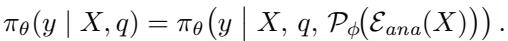
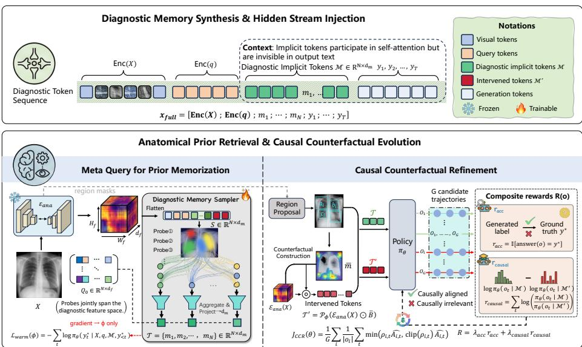
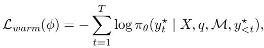
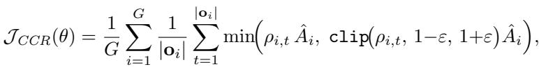
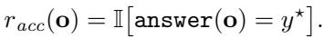
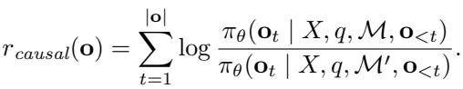
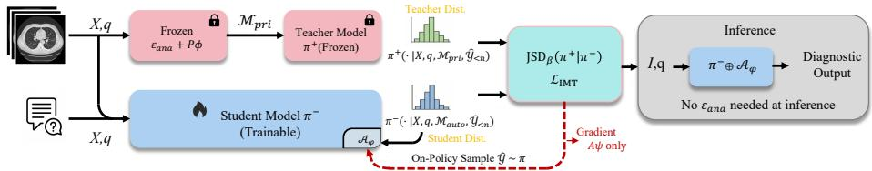
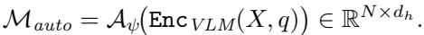
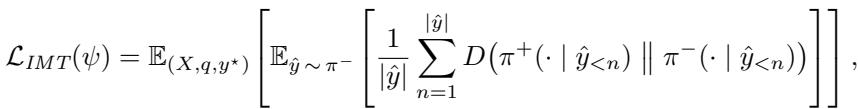
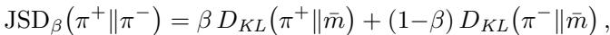

[← 返回 README](../README.md)

# 2 Methodology

## 📌 预览
本节是核心方法，重点看模块输入输出、训练目标、推理路径和与 baseline 的差异。

---

# 2.1 Problem Formulation and Architecture Overview

Problem Formulation. Given an image $X \in \mathbb { R } ^ { H \times W \times 3 }$ and a clinical query $q$ , the objective is to generate an output sequence $y$ containing diagnostic analysis and final conclusions. Let $\pi _ { \theta }$ denote the VLM policy, ${ \dot { \varepsilon } } _ { a n a }$ the frozen pretrained anatomical encoder, and $\mathcal { P } _ { \phi }$ the parameterized memory synthesis module. MedSynapse-V dynamically generates a set of diagnostic implicit memory $\mathcal { M } = \{ m _ { 1 } , . . . , m _ { N } \} \in \mathbb { R } ^ { N \times d _ { h } }$ for injection into the VLM hidden stream, where $d _ { h }$ is the hidden state dimensionality. The overall policy is formalized as:

> 💡 **批注**: 这段是 latent memory / medical VLM 主线：关注视觉证据如何进入 latent space、如何被记忆/更新/调用，以及是否能支撑可靠诊断。

*Equation 1: Equation extracted by MinerU.*

> 💡 **Equation 1 批读**: 公式通常定义过程、loss 或更新规则；建议把符号对应到输入、模型、记忆/控制变量与输出。

Unlike explicit CoT, which concatenates reasoning tokens to the input sequence, MedSynapse-V constructs a diagnostic experience invocation mechanism based on implicit memory within the representation space.

> 💡 **批注**: 这段是 latent memory / medical VLM 主线：关注视觉证据如何进入 latent space、如何被记忆/更新/调用，以及是否能支撑可靠诊断。

Architecture Overview. As illustrated in Figure 2, MedSynapse-V follows a three-stage progressive memory evolution training paradigm. Stage I: Meta Query for Prior Memorization (§2.2) extracts priors from the frozen anatomical encoder, condenses them into diagnostic implicit memory $\mathcal { M }$ through a learnable memory synthesis module and injects them into the VLM hidden stream, while simultaneously completing semantic alignment warmup. Stage II: Causal Counterfactual Refinement (CCR; §2.3) freezes the synthesis module and performs policy optimization within the $\mathcal { M }$ conditioned latent space based on GRPO, incorporating causal counterfactual rewards for memory refinement. Stage III: Intrinsic Memory Transition (IMT; §2.4) writes the refined diagnostic memory into the model’s autonomous pathway through privileged autonomous dual branch full vocabulary divergence distillation, completely removing the anatomical encoder at inference. The entire process is represented as a progressive evolution chain of diagnostic memory: ${ \bf F } _ { a n a } \xrightarrow { \mathrm { M e t a ~ Q u e r y } } \mathcal { M } \xrightarrow { \mathrm { C C R } } \mathcal { M } ^ { \star } \xrightarrow { \mathrm { I M T } } \mathcal { M } _ { a u t o }$ where $\mathbf { F } _ { a n a }$ denotes the anatomical encoder output features, $\mathcal { M }$ is the initial memory after semantic alignment, $\mathcal { M } ^ { \star }$ is the causally refined memory, and $\mathcal { M } _ { a u t o }$ is the intrinsic memory generated by the autonomous module.

> 💡 **批注**: 这段是 latent memory / medical VLM 主线：关注视觉证据如何进入 latent space、如何被记忆/更新/调用，以及是否能支撑可靠诊断。

*Figure 2: Fig. 2: Stages I and II of MedSynapse-V. The hook features from an encoder are condensed into diagnostic implicit memory via learnable meta-query probes and injected into the VLM hidden stream. The memory is then refined through RL with composite rewards, ensuring causal alignment between memory and clinical decision logic.*

> 💡 **Figure 2 批读**: 这张图通常承担方法框架、动机或视觉对比作用；重点看它支撑的是机制、效果还是局限。

# 2.2 Meta Query for Prior Memorization

Clinical cognition research has shown that experienced physicians rapidly activate long accumulated anatomical knowledge during image interpretation, forming compressed contextualized expert memory to guide diagnosis [48]. Inspired by this finding, this stage models this process as a structured prior retrieval and memorization mechanism: the anatomical encoder extracts spatially aware features, which are then condensed into diagnostic implicit memory through a learnable synthesis module and injected into the VLM hidden states.

> 💡 **批注**: 这段是 latent memory / medical VLM 主线：关注视觉证据如何进入 latent space、如何被记忆/更新/调用，以及是否能支撑可靠诊断。

Structured Prior Elicitation. Given an input image $X$ , the frozen anatomical encoder $\xi _ { a n a }$ outputs spatial features from the final layer: ${ \bf F } = \mathcal { E } _ { a n a } ( X ) \in$ $\mathbb { R } ^ { H _ { f } \times W _ { f } \times d _ { f } }$ , where $H _ { f } \times W _ { f }$ is the spatial resolution and $d _ { f }$ is the feature dimensionality. This feature map encodes structured spatial priors learned by the anatomical encoder from large scale medical image segmentation tasks, encompassing multi-granularity information such as lesion boundaries, organ topology, and tissue textures. It is flattened into a sequence $\mathbf { S } = \mathbf { f l a t } ( \mathbf { F } ) \in \mathbb { R } ^ { M \times d _ { f } }$ , ${ \cal M } = { \cal H } _ { f } \times { \cal W } _ { f }$ , forming the feature pool for candidate memory.

> 💡 **批注**: 这段是 latent memory / medical VLM 主线：关注视觉证据如何进入 latent space、如何被记忆/更新/调用，以及是否能支撑可靠诊断。

Diagnostic Memory Synthesis. To condense the high-dimensional feature pool into compact memory compatible with the VLM hidden state space, we design a lightweight Diagnostic Memory Sampler $\mathcal { P } _ { \phi }$ that maintains $N$ learnable meta-query probes $\mathbf { Q } _ { 0 } \in \mathbb { R } ^ { N \times d _ { f } }$ , each of which learns to attend to specific pathological semantic patterns (e.g., boundary irregularity, density heterogeneity, or vascular-tissue spatial relationships). Using $\mathbf { Q } _ { 0 }$ as queries and $\mathbf { s }$ as key-value pairs, $\mathcal { P } _ { \phi }$ performs selective aggregation and dimensional alignment: $\mathcal { M } = \mathcal { P } _ { \phi } ( \mathbf { Q } _ { 0 } , \mathbf { S } ) \in \mathbb { R } ^ { N \times d _ { h } }$ , where $d _ { h }$ is the VLM hidden state dimensionality. The resulting $N$ diagnostic implicit memory elements $\mathcal { M } = \{ m _ { 1 } , . . . , m _ { N } \}$ collectively span the feature subspace required for diagnosis. $\mathcal { P } _ { \phi }$ extracts the most diagnostically relevant compact representations from the encoder’s high dimensional feature pool according to the task context, bridging them from the anatomical encoder’s representation space to the VLM’s hidden state space.

> 💡 **批注**: 这段是 latent memory / medical VLM 主线：关注视觉证据如何进入 latent space、如何被记忆/更新/调用，以及是否能支撑可靠诊断。

Diagnostic Memory Injection. The diagnostic implicit memory $\mathcal { M }$ is injected into the VLM generation sequence as continuous vectors, positioned after the question encoding and before the answer generation: $\mathbf { x } _ { f u l l } = \lfloor \mathtt { E n c } ( X )$ ; $\mathtt { E n c } ( q )$ ; $m _ { 1 }$ $\ldots ; m _ { N } ; y _ { 1 } ; \ldots ; y _ { T } ]$ , where $\mathtt { E n c ( \cdot ) }$ denotes the encoding operation and $\{ y _ { t } \} _ { t = 1 } ^ { T }$ are the answer tokens to be generated. Since $\mathcal { M }$ shares the $d _ { h }$ dimensional space with VLM hidden states, the self-attention mechanism enables the generation sequence to dynamically aggregate diagnostic evidence from $\mathcal { M }$ , allowing the VLM to modulate its predictive distribution based on latent priors without additional adaptation layers or architectural modifications.

> 💡 **批注**: 这段是 latent memory / medical VLM 主线：关注视觉证据如何进入 latent space、如何被记忆/更新/调用，以及是否能支撑可靠诊断。

Semantic Alignment Warmup. Directly injecting outputs from a randomly initialized synthesis module into the VLM would cause semantic mismatch. To address this, a warmup stage is established before formal refinement: the VLM backbone $\theta$ and the anatomical encoder $\mathcal { E } _ { a n a }$ are frozen, and only $\phi$ is optimized with the standard next token prediction loss:

> 💡 **批注**: 这段是 one-step SR 主线：关注效率、保真-真实感权衡、扩散/flow 先验或单步生成路径。

*Equation 2: Equation extracted by MinerU.*

> 💡 **Equation 2 批读**: 公式通常定义过程、loss 或更新规则；建议把符号对应到输入、模型、记忆/控制变量与输出。

where $y ^ { \star }$ denotes the reference answer sequence. This stage establishes a wellconditioned initial semantic mapping between the anatomical encoder feature space and the VLM hidden state space, providing a semantically coherent and stable initialization upon which the subsequent RL stage can reliably build.

> 💡 **批注**: 这段是 one-step SR 主线：关注效率、保真-真实感权衡、扩散/flow 先验或单步生成路径。

# 2.3 Causal Counterfactual Refinement

After warmup, $\mathcal { M }$ possesses basic semantic alignment capability, but directly applying standard SFT has two limitations [58]: binding to fixed reference trajectories restricts out-of-distribution generalization; the model may bypass $\mathcal { M }$ and directly map from $( X , q )$ to answers, causing memory to degenerate into redundant placeholders. In this stage, we perform policy optimization within the $\mathcal { M }$ -conditioned latent space, incorporating causal counterfactual intervention to guide memory refinement toward clinical alignment.

> 💡 **批注**: 这段是 latent memory / medical VLM 主线：关注视觉证据如何进入 latent space、如何被记忆/更新/调用，以及是否能支撑可靠诊断。

Conditioned Policy Modeling. First, we freeze $\mathcal { P } _ { \phi }$ and the VLM backbone, optimizing only lightweight LoRA adapters (collectively denoted $\theta$ below). Based on GRPO [42], for each sample $( X , q , y ^ { \star } )$ , $G$ candidate trajectories $\left\{ \mathbf { o } _ { 1 } , \ldots , \mathbf { o } _ { G } \right\}$ are sampled. $\mathcal { M }$ is explicitly incorporated into the conditioned context, and the policy gradient indirectly modulates the VLM’s utilization pattern of $\mathcal { M }$ through the attention pathway. The policy model optimization objective is:

> 💡 **批注**: 这段是 one-step SR 主线：关注效率、保真-真实感权衡、扩散/flow 先验或单步生成路径。

*Equation 3: Equation extracted by MinerU.*

> 💡 **Equation 3 批读**: 公式通常定义过程、loss 或更新规则；建议把符号对应到输入、模型、记忆/控制变量与输出。

where ρi,t = $\begin{array} { r } { \rho _ { i , t } = { \frac { \pi _ { \theta } ( \mathbf { o } _ { i , t } | X , q , \mathcal { M } , \mathbf { o } _ { i , < t } ) } { \pi _ { \theta _ { o l d } } ( \mathbf { o } _ { i , t } | X , q , \mathcal { M } , \mathbf { o } _ { i , < t } ) } } } \end{array}$ and $\begin{array} { r } { \hat { A } _ { i } = \frac { R ( \mathbf o _ { i } ) - \mu _ { G } } { \sigma _ { G } + \varepsilon _ { 0 } } } \end{array}$ , with $\mu _ { G }$ and $\sigma _ { G }$ denoting the group reward mean and standard deviation, and $\varepsilon _ { 0 }$ a stability constant. Note that both $\rho _ { i , t }$ and ${ \hat { A } } _ { i }$ are conditioned on $\mathcal { M }$ , allowing gradients to propagate through the attention pathway linking answer tokens with memory, thereby shaping how the VLM attends to the injected diagnostic cues during generation. Interventional Reward Design. The composite reward $R ( \mathbf { o } ) = \lambda _ { a c c } \cdot r _ { a c c } +$ $\lambda _ { c a u s a l } \cdot r _ { c a u s a l }$ consists of two components. The diagnostic accuracy reward is:

> 💡 **批注**: 这段是 latent memory / medical VLM 主线：关注视觉证据如何进入 latent space、如何被记忆/更新/调用，以及是否能支撑可靠诊断。

*Equation 4: Equation extracted by MinerU.*

> 💡 **Equation 4 批读**: 公式通常定义过程、loss 或更新规则；建议把符号对应到输入、模型、记忆/控制变量与输出。

The causal counterfactual reward quantifies the causal contribution of $\mathcal { M }$ through intervention. The frozen anatomical encoder $\mathcal { E } _ { a n a }$ additionally provides highestconfidence region masks for diagnostically relevant areas; zeroing out the corresponding features yields the interventional memory $\mathcal { M } ^ { \prime }$ : $M ^ { \prime } = \mathcal { P } _ { \phi } ( \mathcal { E } _ { a n a } ( X ) \odot \overline { { \mathbf { B } } } )$ , where $\overline { { \mathbf { B } } }$ is the inverted binary mask. The causal reward measures the performance discrepancy between the original and interventional conditions:

> 💡 **批注**: 这段是 latent memory / medical VLM 主线：关注视觉证据如何进入 latent space、如何被记忆/更新/调用，以及是否能支撑可靠诊断。

*Equation 5: Equation extracted by MinerU.*

> 💡 **Equation 5 批读**: 公式通常定义过程、loss 或更新规则；建议把符号对应到输入、模型、记忆/控制变量与输出。

$r _ { c a u s a l } > 0$ indicates that the original memory encodes information with causal contribution to diagnosis; $r _ { c a u s a l } \le 0$ indicates that the corresponding prior is causally irrelevant to the current decision. This design follows the principle of interventional effect estimation in causal inference, ensuring that the memory retained after refinement is causally consistent with clinical decision logic.

> 💡 **批注**: 这段是 latent memory / medical VLM 主线：关注视觉证据如何进入 latent space、如何被记忆/更新/调用，以及是否能支撑可靠诊断。

# 2.4 Intrinsic Memory Transition

After the causal RL, the model can generate high quality diagnostic outputs under the guidance of externally derived $\mathcal { M }$ , but the persistent dependence on the encoder at inference introduces additional computational overhead. As shown in Fig. 3, IMT reformulates this problem as learning to autonomously generate equivalent latent space embeddings under the condition of removing the auxiliary encoder, employing a privileged autonomous dual-branch paradigm to accomplish memory transition from extrinsic to intrinsic.

> 💡 **批注**: 这段是 latent memory / medical VLM 主线：关注视觉证据如何进入 latent space、如何被记忆/更新/调用，以及是否能支撑可靠诊断。

*Figure 3: Fig. 3: Intrinsic Memory Transition (IMT) is achieved via Jensen–Shannon divergence alignment between the teacher $\pi ^ { + }$ , conditioned on encoder-derived $\mathcal { M } _ { p r i }$ ) and student ( $\pi ^ { - }$ , conditioned on $\mathcal { M } _ { a u t o }$ ) branches. Gradients propagate solely to $\mathcal { A } _ { \psi }$ , enabling complete removal of the anatomical encoder at inference with negligible overhead.*

> 💡 **Figure 3 批读**: 这张图通常承担方法框架、动机或视觉对比作用；重点看它支撑的是机制、效果还是局限。

Privileged Branch and Autonomous Branch. The teacher branch (privileged) retains the complete pipeline with the anatomical encoder, generating reference memory $\mathcal { M } _ { p r i } \ : = \ : \mathcal { P } _ { \phi } ( \mathcal { E } _ { a n a } ( X ) ) \ : \in \ : \mathbb { R } ^ { N \times d _ { h } }$ . The student branch (autonomous) removes the encoder and predicts equivalent memory solely through a lightweight Autonomous Memory Module $\mathcal { A } _ { \psi }$ mounted on the VLM, using the VLM’s own visual encoding features:

> 💡 **批注**: 这段是 latent memory / medical VLM 主线：关注视觉证据如何进入 latent space、如何被记忆/更新/调用，以及是否能支撑可靠诊断。

*Equation 6: Equation extracted by MinerU.*

> 💡 **Equation 6 批读**: 公式通常定义过程、loss 或更新规则；建议把符号对应到输入、模型、记忆/控制变量与输出。

Both branches share the VLM backbone parameters $\theta$ , ensuring that alignment is completed within the same function space.

> 💡 **批注**: 这是实验证据段：同时看主指标、消融、效率和案例，判断 claim 是否被支撑。

Training Objective: Unified Full Vocabulary Divergence. The core signal of IMT is the full vocabulary divergence objective covering all generation positions. Given a trajectory $\hat { y } \sim \pi ^ { - } ( \cdot \mid X , q , \mathcal { M } _ { a u t o } )$ sampled from the student branch, the trajectory averaged per position divergence is defined as:

> 💡 **批注**: 这段是 one-step SR 主线：关注效率、保真-真实感权衡、扩散/flow 先验或单步生成路径。

*Equation 7: Equation extracted by MinerU.*

> 💡 **Equation 7 批读**: 公式通常定义过程、loss 或更新规则；建议把符号对应到输入、模型、记忆/控制变量与输出。

where $\pi ^ { + } ( \cdot  { | \hat { y } _ { < n } } ) \triangleq \pi _ { \theta } ( \cdot  { | X , q , \mathcal { M } _ { p r i } , \hat { y } _ { < n } } )$ and $\pi ^ { - } ( \cdot  { | \hat { y } _ { < n } } ) \triangleq \pi _ { \theta } ( \cdot  { | \ X , q , \mathcal { M } _ { a u t o } , \hat { y } _ { < n } } )$ are the full vocabulary next-token distributions conditioned on privileged and autonomous memory, respectively. The divergence $D$ adopts the generalized Jensen–Shannon divergence JSD $\beta$ [27]:

> 💡 **批注**: 这段是 latent memory / medical VLM 主线：关注视觉证据如何进入 latent space、如何被记忆/更新/调用，以及是否能支撑可靠诊断。

*Equation 8: Equation extracted by MinerU.*

> 💡 **Equation 8 批读**: 公式通常定义过程、loss 或更新规则；建议把符号对应到输入、模型、记忆/控制变量与输出。

where $\bar { m } = \beta \pi ^ { + } + \left( 1 { - } \beta \right) \pi ^ { - }$ . The teacher branch leverages privileged memory to expose the complete next token probability landscape to the student, driving $\mathcal { A } _ { \psi }$ to learn to generate latent space embeddings behaviorally equivalent to privileged memory. Gradients backpropagate only through the student branch to $\mathcal { A } _ { \psi }$ , while the teacher branch serves as a fixed distributional target.

> 💡 **批注**: 这段是 latent memory / medical VLM 主线：关注视觉证据如何进入 latent space、如何被记忆/更新/调用，以及是否能支撑可靠诊断。

At inference, $\mathcal { A } _ { \psi }$ directly generates $\mathcal { M } _ { a u t o }$ from VLM visual encoding features and injects them into the hidden stream. The entire Meta Query pipeline and the anatomical encoder are completely removed, rendering the computational overhead of MedSynapse-V nearly identical to that of a standard VLM.

> 💡 **批注**: 这段是 one-step SR 主线：关注效率、保真-真实感权衡、扩散/flow 先验或单步生成路径。

---

## 🔖 Section 总结

### 核心洞察
1. 本节对应论文原始大分节，原文已完整保留。
2. 阅读重点是把本节的机制/证据映射到论文主 claim。
3. 后续如有疑问，可在本 section 继续补充更细批注。
