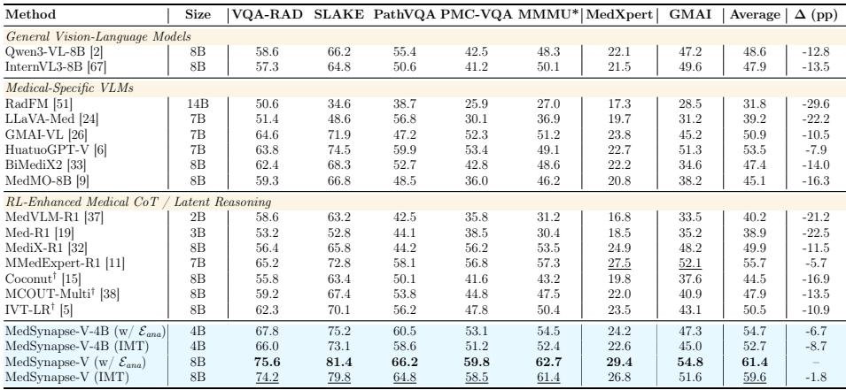
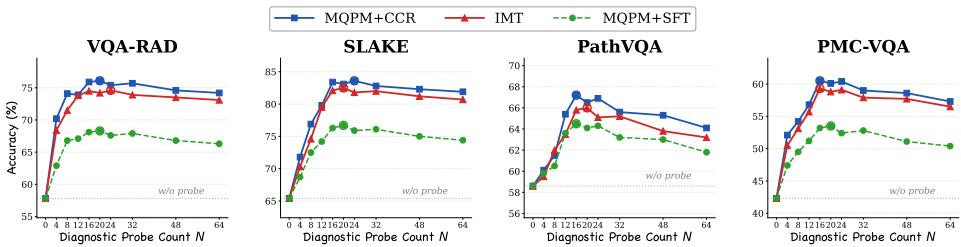
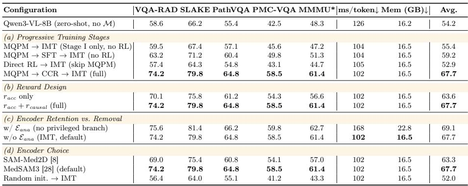
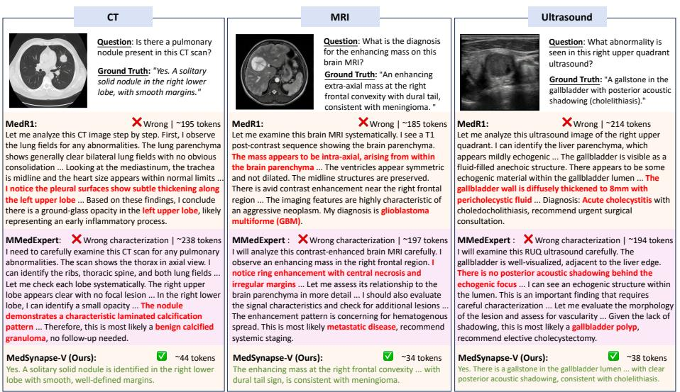
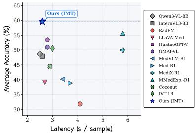
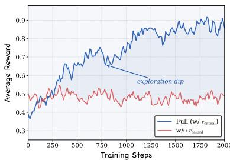
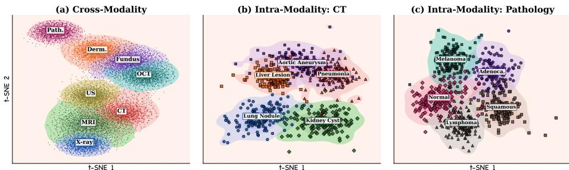

[← 返回 README](../README.md)

# 3 Experiments

## 📌 预览
本节验证方法是否成立，重点看主结果、消融、效率和视觉/病例案例。

---

# 3.1 Experimental Setup

Datasets Training data: We conduct comprehensive experiments on seven medical multimodal benchmarks spanning diverse task types and difficulty levels. Stage I (MQPM warmup) uses 50K image–text pairs from PubMedVision [6] covering radiology and pathology. Stage II (CCR) constructs a mixed-modality RL set: 3K closed-ended VQA samples from OmniMedVQA [18] training split (8 modalities: CT, MRI, X-ray, dermoscopy, fundus, OCT, pathology, ultrasound) plus 1K open-ended samples from SLAKE [29] and PathVQA [16] training sets, totaling ∼4K samples. Region masks for $r _ { c a u s a l }$ are provided by Med-SAM3 [28]. Stage III (IMT) reuses the Stage II data. Evaluation benchmarks: (i) Closed-ended VQA: VQA-RAD [20], SLAKE [29], PathVQA [16], PMC-VQA [64]; (ii) Clinical reasoning: MMMU Health & Medicine [60] (denoted MMMU $^ *$ ); (iii) Expert-level reasoning: MedXpertQA-MM [69] (Total score); (iv) Multi-granularity: GMAI-MMBench [57].

> 💡 **批注**: 这段是 latent memory / medical VLM 主线：关注视觉证据如何进入 latent space、如何被记忆/更新/调用，以及是否能支撑可靠诊断。

Baselines We compare against four categories of methods: (1) General VLMs: Qwen3-VL-8B [2] (our base model), InternVL3-8B [67]; (2) Medical-specific VLMs: RadFM [51], LLaVA-Med [24], GMAI-VL [26], HuatuoGPT-Vision [6], BiMediX2- 8B [33], MedMO-8B [9]; (3) RL-enhanced medical reasoning: MedVLM-R1- 2B [37], Med-R1-3B [19], MediX-R1-8B [32], MMedExpert-R1-7B [11]; (4) Latentspace reasoning: Coconut $^ \dagger$ [15], MCOUT-Multi $\dagger$ [38], IVT-LR $^ { \dag }$ [5] ( $^ \dagger$ : adapted with identical Qwen3-VL-8B backbone and training data). We additionally report MedSynapse-V-4B on the Qwen3-VL-4B backbone to assess scalability.

> 💡 **批注**: 这段是 latent memory / medical VLM 主线：关注视觉证据如何进入 latent space、如何被记忆/更新/调用，以及是否能支撑可靠诊断。

Implementation Details Our framework builds upon Qwen3-VL-8B-Instruct [2]. The frozen anatomical encoder $\mathcal { E } _ { a n a }$ employs MedSAM3 [28] pre-trained on largescale multi-organ segmentation datasets. Stage I freezes both VLM and $\mathcal { E } _ { a n a }$ , training only the Diagnostic Memory Sampler $\mathcal { P } _ { \phi }$ with $\mathrm { l r } = 2 \times 1 0 ^ { - 4 }$ for 3 epochs. The diagnostic probe count is $N { = } 1 6$ ; $\mathcal { P } _ { \phi }$ is a 2-layer cross-attention Transformer with output dimension $d _ { m } { = } 4 0 9 6$ (matching Qwen3-VL-8B). Images are processed at native dynamic resolution following Qwen3-VL’s default configuration. Stage $\mathrm { I I }$ freezes $\mathcal { P } _ { \phi }$ and adapts VLM via LoRA [17] (rank=64, applied to all attention layers). GRPO generates $G { = } 4$ candidate trajectories per sample, with clipping coefficient $\varepsilon { = } 0 . 2$ , reward weights $\lambda _ { a c c }$ =1.0 and $\lambda _ { c a u s a l } { = } 0 . 5$ , training for 200 steps with a rollout batch size of 32. Max generation length is 1024 tokens. Stage III introduces the Autonomous Memory Module $\mathcal { A } _ { \psi }$ (2-layer MLP + LayerNorm, input from VLM’s visual encoder features), with JSD coefficient $\beta$ =0.5, $\mathrm { l r } = 1 \times 1 0 ^ { - 4 }$ , 3 epochs. For each sample we draw one on-policy trajectory $\hat { y } \sim \pi ^ { - }$ per gradient step; the Stage II data is reused with identical preprocessing. Closed-ended VQA tasks report overall accuracy ( $\%$ ). For GMAI-MMBench and MedXpertQA-MM, we follow their respective official evaluation protocols. Inference efficiency is measured quantitatively as ms/sample and peak GPU memory (GB). More details are provided in the supplementary material.

> 💡 **批注**: 这段是 latent memory / medical VLM 主线：关注视觉证据如何进入 latent space、如何被记忆/更新/调用，以及是否能支撑可靠诊断。

Table 1: Comprehensive comparison on seven medical benchmarks. Base model: Qwen3-VL-8B (unless otherwise noted). MMMU\* = Health & Medicine track. †: general latent-space methods adapted to medical VQA with identical backbone and training data. $\varDelta$ : absolute gap (pp) to MedSynapse-V (w/ ${ \dot { \varepsilon } } _ { a n a }$ ) average. All results are averaged over five independent runs. Bold: best; underline: second best.

> 💡 **批注**: 这段是 latent memory / medical VLM 主线：关注视觉证据如何进入 latent space、如何被记忆/更新/调用，以及是否能支撑可靠诊断。

*Table 1: Table 1: Comprehensive comparison on seven medical benchmarks. Base model: Qwen3-VL-8B (unless otherwise noted). MMMU\* = Health & Medicine track. †: general latent-space methods adapted to medical VQA with identical backbone and training data. $\varDelta$ : absolute gap (pp) to MedSynapse-V (w/ ${ \dot { \varepsilon } } _ { a n a }$ ) average. All results are averaged over five independent runs. Bold: best; underline: second best.*

> 💡 **Table 1 批读**: 表格要看主指标、次指标与效率/鲁棒性是否一致支持论文 claim。

# 3.2 Main Results

As shown in Table 1, MedSynapse-V (w/ $\mathcal { E } _ { a n a }$ ) achieves the highest average of ${ \bf 6 1 . 4 \% }$ , and the encoder-free MedSynapse-V (IMT) retains ${ \bf 5 9 . 6 \% }$ , surpassing all baselines. Compared to the strongest RL baseline MMedExpert-R1 $( 5 5 . 7 \%$ ), MedSynapse-V (IMT) leads by ${ \bf + 3 . 9 }$ pp without any auxiliary module at inference, with the largest margins on visual-grounding benchmarks (VQA-RAD ${ \bf + 9 . 0 }$ , SLAKE +7.0, PathVQA +6.7), where discrete CoT tokens are prone to attenuating early visual evidence across long reasoning chains. On GMAI-MMBench spanning 38 modalities, MedSynapse-V scores $5 4 . 8 \%$ , confirming that the anatomical priors generalize beyond the training distribution.

> 💡 **批注**: 这段是 latent memory / medical VLM 主线：关注视觉证据如何进入 latent space、如何被记忆/更新/调用，以及是否能支撑可靠诊断。

RL baselines reveal a specialization dilemma. MediX-R1 benefits from multilingual pretraining and leads on PMC-VQA (56.2%), yet this breadth dilutes radiology-specific precision (VQA-RAD: 56.4%); MMedExpert-R1 achieves the most balanced profile by leveraging guideline-based reward. Small-scale models (MedVLM-R1 2B, Med-R1 3B) collapse on out-of-domain tasks (MedXpert below $1 9 \%$ ), confirming that parameter capacity sets a hard ceiling RL alone cannot raise. n contrast, MedSynapse-V sidesteps this dilemma by injecting latent priors that benefit all task types uniformly, achieving the top performance on every benchmark without task-specific tuning.

> 💡 **批注**: 这段是 latent memory / medical VLM 主线：关注视觉证据如何进入 latent space、如何被记忆/更新/调用，以及是否能支撑可靠诊断。

Latent methods require domain priors. Among adapted latent baselines, the hierarchy Coconut (44.5%) $<$ < MCOUT-Multi (47.9%) $<$ < IVT-LR $( 5 0 . 5 \% )$ ) tracks optimization sophistication, yet even IVT-LR barely exceeds zero-shot Qwen3-VL-8B (48.6%). This inversion reveals that latent compression without clinical grounding encodes statistical shortcuts rather than diagnostic logic; the

> 💡 **批注**: 这段是 latent memory / medical VLM 主线：关注视觉证据如何进入 latent space、如何被记忆/更新/调用，以及是否能支撑可靠诊断。

*Figure 4: Fig. 4: Effect of diagnostic probe count $N$ . Performance peaks around $N { = } 1 6$ across benchmarks; further increasing $N$ dilutes diagnostically relevant signals.*

> 💡 **Figure 4 批读**: 这张图通常承担方法框架、动机或视觉对比作用；重点看它支撑的是机制、效果还是局限。

Table 2: Ablation study on the 8B backbone. All variants undergo the full threestage pipeline including IMT (§2.4); results reflect inference without the anatomical encoder unless stated otherwise. MQPM: Meta Query for Prior Memorization (§2.2); CCR: Causal Counterfactual Refinement (§2.3); $\mathcal { M }$ : diagnostic implicit memory. Best per group in bold.

> 💡 **批注**: 这段是 latent memory / medical VLM 主线：关注视觉证据如何进入 latent space、如何被记忆/更新/调用，以及是否能支撑可靠诊断。

*Table 2: Table 2: Ablation study on the 8B backbone. All variants undergo the full threestage pipeline including IMT (§2.4); results reflect inference without the anatomical encoder unless stated otherwise. MQPM: Meta Query for Prior Memorization (§2.2); CCR: Causal Counterfactual Refinement (§2.3); $\mathcal { M }$ : diagnostic implicit memory. Best per group in bold.*

> 💡 **Table 2 批读**: 表格要看主指标、次指标与效率/鲁棒性是否一致支持论文 claim。

10.9 pp gap to MedSynapse-V confirms that prior injection and causal calibration are prerequisites for effective latent reasoning in medicine.

> 💡 **批注**: 这段是 latent memory / medical VLM 主线：关注视觉证据如何进入 latent space、如何被记忆/更新/调用，以及是否能支撑可靠诊断。

Scaling efficiency. MedSynapse-V-4B (w/ ${ \mathscr E } _ { a n a }$ ) reaches $5 4 . 7 \%$ with roughly half the parameters of 7B baselines; after encoder removal the IMT variant still achieves $5 2 . 7 \%$ at $8 5 \mathrm { m s }$ and 10.8 GB, surpassing MediX-R1-8B $( 4 9 . 9 \% )$ ). This efficiency stems from a structural advantage: diagnostic expertise is distilled into 16 compact memory vectors consumed in a single forward pass, rather than spread across $1 5 0 +$ verbose reasoning tokens.

> 💡 **批注**: 这段是 latent memory / medical VLM 主线：关注视觉证据如何进入 latent space、如何被记忆/更新/调用，以及是否能支撑可靠诊断。

# 3.3 Ablation Study

Table 2 reports comprehensive ablation study results. Specifically, (i) Progressive training stages. MQPM warmup is indispensable: skipping it collapses Avg to 52.9, barely above zero-shot (54.2), because randomly initialized memory destabilizes early RL training. Replacing CCR with SFT reaches 59.2 but lags by $8 . 5 \ \mathrm { p p }$ due to limited out-of-distribution generalization. The full pipeline (Avg 67.7) confirms non-redundant contributions: MQPM grounds semantics, CCR refines via exploration, IMT compresses into an autonomous pathway. (ii) Reward design. rcausal is the dominant reward component ( $^ +$ 4.1 pp, $6 3 . 6 \to 6 7 . 7$ ). Without causal pressure the model bypasses $\mathcal { M }$ via direct shortcuts, treating memory as inert padding; the counterfactual intervention penalizes trajectories insensitive to diagnostic regions. The effect concentrates on radiology benchmarks and persists after IMT, indicating stronger memory utilization transfers more faithfully through distillation. (iii) Encoder retention vs. removal. IMT achieves near-lossless removal: only $1 . 4 ~ \mathrm { p p }$ degradation $6 9 . 1  6 7 . 7 $ ) while latency drops 39% and memory decreases 6.3 GB. The gap is not uniform: core VQA metrics degrade minimally, whereas MedXpert and GMAI suffer more, suggesting complex reasoning depends more on encoder-derived priors than closed-ended recognition. (iv) Anatomical encoder choice. MedSAM3 outperforms SAM-Med2D by 4.4 pp (67.7 vs. 63.3), reflecting richer spatial representations from multi-organ segmentation pretraining. Random initialization yields only 52.0, confirming that gains originate from what the encoder knows, rather than how memory is aggregated. (v) Probe count $N$ . As shown in Fig. 4, $N { = } 1 6$ balances expressiveness against redundancy. The CCR to SFT gap widens with $N$ (3.5 pp at $N { = } 4$ vs. $7 . 2 \mathrm { \ p p }$ at $N { = } 1 6$ ), revealing that larger memory pools amplify bypass shortcuts and therefore benefit disproportionately from causal refinement.

> 💡 **批注**: 这段是 latent memory / medical VLM 主线：关注视觉证据如何进入 latent space、如何被记忆/更新/调用，以及是否能支撑可靠诊断。

*Figure 5: Fig. 5: Qualitative comparison across CT, MRI, and Ultrasound cases. MedSynapse-V produces concise, correct diagnoses, while Med-R1 and MMedExpert-R1 generate verbose CoT with hallucinated findings (red) leading to misdiagnoses.*

> 💡 **Figure 5 批读**: 这张图通常承担方法框架、动机或视觉对比作用；重点看它支撑的是机制、效果还是局限。

# 3.4 In-Depth Case Analysis

As illustrated in Fig. 5, we compare MedSynapse-V with Med-R1 [19] and MMedExpert-R1 [11] across three distinct imaging modalities. Both baselines produce verbose CoT reasoning ( $\sim$ 185–238 tokens) yet arrive at incorrect diagnoses due to hallucinated observations erroneously propagating through the chain. In the CT case, Med-R1 fabricates pleural thickening in the left upper lobe, while MMedExpert-R1 hallucinates a laminated calcification pattern and mischaracterizes the nodule as a benign granuloma. In the MRI case, Med-R1 misidentifies the extra-axial mass as intra-axial and concludes glioblastoma, whereas MMedExpert-R1 fabricates ring enhancement with central necrosis, both missing the classic meningioma presentation. In the ultrasound case, Med-R1 hallucinates gallbladder wall thickening to over-diagnose acute cholecystitis, while MMedExpert-R1 denies posterior acoustic shadowing and misdiagnoses a gallbladder polyp. In contrast, MedSynapse-V generates concise, correct answers ( $\sim$ 34–44 tokens) without explicit CoT, demonstrating that diagnostic implicit memory provides sufficient latent guidance while avoiding the hallucination cascades inherent in token-level CoT.

> 💡 **批注**: 这段是 latent memory / medical VLM 主线：关注视觉证据如何进入 latent space、如何被记忆/更新/调用，以及是否能支撑可靠诊断。

# 3.5 Efficiency, RL Dynamics, and Latent Space

Performance–efficiency trade-off. As shown in Fig. 6, MedSynapse-V (IMT) achieves $5 9 . 6 \%$ at 2.6 s/sample, comparable to zero-shot Qwen3-VL-8B $4 8 . 6 \%$ , 2.8 s) since both share the same backbone and the 16 memory vectors add negligible overhead. Full-scale 7–8B CoT methods (MediX-R1, MMedExpert-R1) require 5.8 s each due to 300–400 autoregressive reasoning tokens, while smaller CoT models (MedVLM-R1 2B, Med-R1 3B) offset verbosity with faster per-token speed yet remain 18–21 pp below MedSynapse-V. This confirms that compact latent memory provides diagnostic grounding without the token-generation overhead of full-scale CoT.

> 💡 **批注**: 这段是 latent memory / medical VLM 主线：关注视觉证据如何进入 latent space、如何被记忆/更新/调用，以及是否能支撑可靠诊断。

Training dynamics. Fig. 7 shows the full model $\textit { \textbf { ( w / } \textit { r } _ { c a u s a l } ) }$ improving steadily to ${ \sim } 0 . 8 8$ with a transient exploration dip near step 900, where the policy sacrifices reward to explore memory-reliant generation strategies, while the $w / o \ r _ { c a u s a l }$ ablation plateaus at ${ \sim } 0 . 4 8$ throughout the training. This confirms that accuracy-only reward cannot distinguish memory-dependent from shortcut trajectories; without causal pressure the model bypasses $\mathcal { M }$ entirely, treating injected memory as inert padding.

> 💡 **批注**: 这段是 latent memory / medical VLM 主线：关注视觉证据如何进入 latent space、如何被记忆/更新/调用，以及是否能支撑可靠诊断。

*Figure 6: Fig. 6: Accuracy–latency trade-off across compared VLM categories.*

> 💡 **Figure 6 批读**: 这张图通常承担方法框架、动机或视觉对比作用；重点看它支撑的是机制、效果还是局限。

*Figure 7: Fig. 7: The RL training reward dynamics with and without $r _ { c a u s a l }$ .*

> 💡 **Figure 7 批读**: 这张图通常承担方法框架、动机或视觉对比作用；重点看它支撑的是机制、效果还是局限。

*Figure 8: Fig. 8: t-SNE visualization of implicit memory $\mathcal { M } _ { a u t o }$ after CCR. (a) Eight imaging modalities form well-separated clusters with clinically coherent proximity. $( \mathrm { b } , \mathrm { c } )$ Within CT and Pathology, disease subtypes further segregate into distinct regions.*

> 💡 **Figure 8 批读**: 这张图通常承担方法框架、动机或视觉对比作用；重点看它支撑的是机制、效果还是局限。

Latent space structure. Fig. 8 visualizes the evolved memory $\mathcal { M } _ { a u t o }$ via t-SNE across three granularities. At the cross-modality level (a), eight imaging types form compact clusters with clinically coherent proximity (e.g., CT and MRI lie adjacent; dermoscopy and fundus form a nearby pair). Within individual modalities $\displaystyle ( \mathrm { b } , \mathrm { c } )$ , disease subtypes further segregate: CT memory separates lung nodules, liver lesions, kidney cysts, pneumonia, and aortic aneurysms, while pathology memory distinguishes adenocarcinoma, squamous cell carcinoma, normal tissue, lymphoma, and melanoma. This hierarchical organization confirms that $r _ { c a u s a l }$ reshapes the latent space into a diagnostically meaningful manifold rather than merely boosting task accuracy.

> 💡 **批注**: 这段是 latent memory / medical VLM 主线：关注视觉证据如何进入 latent space、如何被记忆/更新/调用，以及是否能支撑可靠诊断。

Why latent memory evolution works. Our ablations pinpoint two necessary conditions that general latent methods lack. First, structured priors are indispensable: replacing MedSAM3 with a random encoder collapses Avg from $6 7 . 7 \%$ to $5 2 . 0 \%$ (Table 2d). Second, causal calibration activates the priors: rcausal lifts accuracy by 4.1 pp (Table 2b) and reorganizes memory into the hierarchical diagnostic manifold shown in Fig. 8. Neither condition alone suffices, and their synergy is precisely what general latent methods lack.

> 💡 **批注**: 这段是 latent memory / medical VLM 主线：关注视觉证据如何进入 latent space、如何被记忆/更新/调用，以及是否能支撑可靠诊断。

---

## 🔖 Section 总结

### 核心洞察
1. 本节对应论文原始大分节，原文已完整保留。
2. 阅读重点是把本节的机制/证据映射到论文主 claim。
3. 后续如有疑问，可在本 section 继续补充更细批注。
