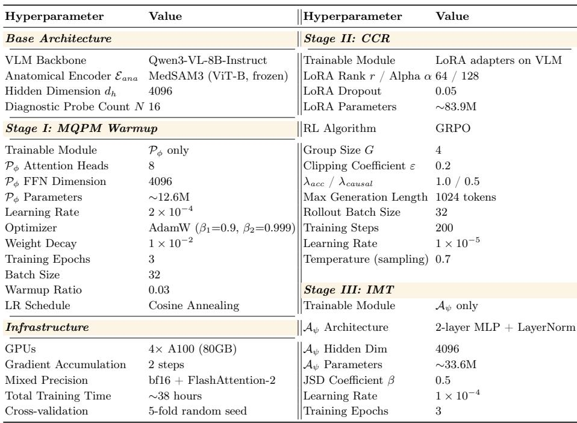

[← 返回 README](../README.md)

# 4 Conclusion and Future Work

## 📌 预览
本节很短，但能反向校验论文主张：MedSynapse-V 试图用 compact latent tokens 替代显式 CoT，并把未来工作指向纵向分析、多源证据和更大鉴别诊断空间。

---

We propose MedSynapse-V, a medical vision-language model that performs clinical reasoning through compact latent tokens rather than explicit chain-ofthought generation. By combining causal counterfactual rewards with progressive memory evolution, our approach effectively internalizes diagnostic reasoning within a low-latency framework. Experiments across multiple medical benchmarks show that MedSynapse-V outperforms existing medical VLMs, generalpurpose VLMs, and RL-based CoT methods in both accuracy and efficiency, confirming that latent cognitive processes guided by well-designed rewards can effectively replace verbose explicit reasoning in the medical domain.

> 💡 **结论批读**: 作者把贡献概括成“compact latent tokens rather than explicit chain-of-thought”。这不是否定推理，而是把推理过程从可见文本链转移到 hidden memory stream；临床风险在于解释性变弱，但实验显示能减少 CoT 幻觉和延迟。

Table 3: Complete hyperparameter configuration for all three training stages.

*Table 3: Table 3: Complete hyperparameter configuration for all three training stages.*

> 💡 **Table 3 批读**: Table 3 是复现入口：三阶段的学习率、epoch/step、LoRA、probe count、JSD 和 reward 权重都集中在这里。尤其要核对 Stage I 只训 $\mathcal P_\phi$、Stage II 只训 LoRA、Stage III 只训 $\mathcal A_\psi$ 这三个冻结策略。

Looking ahead, we aim to extend latent memory evolution to longitudinal analysis and multi-modal report generation by integrating heterogeneous clinical evidence sources. Our research will further investigate scaling implicit memory to accommodate broader differential diagnosis spaces with hundreds of competing hypotheses, validating the generalizability of latent cognitive architectures for complex clinical decision-making in high-stakes diagnostic environments.

> 💡 **未来工作批读**: 未来方向实际上对应当前局限：单图 VQA 还不足以覆盖真实诊疗；纵向影像、异构临床证据和上百种鉴别诊断会放大 memory 容量、证据冲突和不确定性校准问题。

---

## 🔖 Section 总结

### 核心洞察
1. 论文最终 claim 是用 causally guided latent memory 替代 verbose CoT，而不是简单添加医学知识。
2. Table 3 对复现最重要，冻结策略和阶段切换比单个超参更关键。
3. 后续最自然的扩展是 adaptive memory、更强不确定性校准和纵向/多源临床证据融合。
