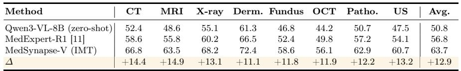
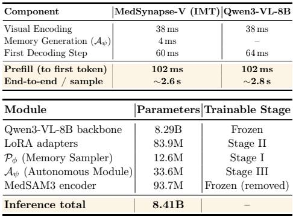
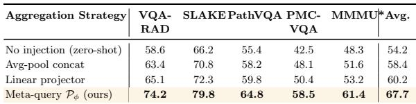
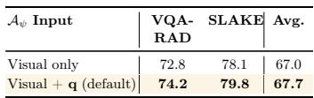
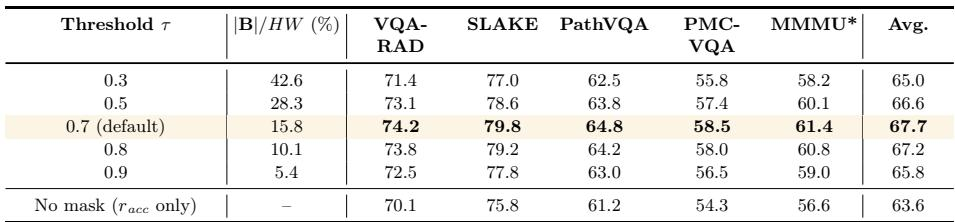
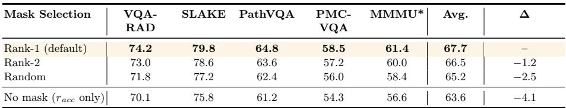
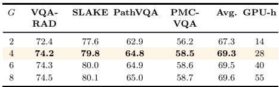

[← 返回 README](../README.md)

# Appendix

## 📌 预览
附录补足复现细节、训练动态、额外消融、mask 鲁棒性、失败案例、prompt 模板和相关工作。读附录时重点看主文 claim 是否经得起实现和边界条件检查。

---

# 5 Implementation Details

Training Configuration Table 3 provides the hyperparameter configuration across all three training stages for reproducibility. We employ standard data augmentation techniques to improve training robustness, including random rotation ( $\pm$ 15), horizontal flipping (probability 0.5), brightness/contrast adjustment $( \pm 1 0 \%$ ), and color jittering, while preserving critical diagnostic features and anatomical orientations. Images are processed at native dynamic resolution following Qwen3- VL’s default configuration (min pixels=256 $\times$ 28 $\times$ 28, max pixels=1280 $\times$ 28 $\times$ 28). All experiments are conducted five times and we report the mean.

> 💡 **训练配置批读**: 数据增强幅度较保守，强调不破坏诊断方向和解剖结构；native dynamic resolution 继承 Qwen3-VL 设置，避免把医学细节统一 resize 到过低分辨率。五次重复取均值也解释了主表为什么报告 mean。

Architectural Details The architecture comprises several integrated components: the Diagnostic Memory Sampler $\mathcal { P } _ { \phi }$ is implemented as a 2- layer (L=2) Transformer featuring 8 heads (head dimension 128) and 16 meta-query probes $\mathbf { Q } _ { 0 } \in \mathbb { R } ^ { 1 6 \times 1 0 2 4 }$ initialized via a truncated normal distribution ( $\sigma ~ = ~ 0 . 0 2$ ), followed by a final linear projection to the 4096-dimensional hidden space; concurrently, the Autonomous Memory Mod ule $\mathcal { A } _ { \psi }$ processes pooled visual features through two 4096-dimensional linear layers with GELU activation and LayerNorm to produce an $N \ \times \ d _ { h }$ representation. For anatomical encoding, we uti-

> 💡 **架构细节批读**: $\mathcal P_\phi$ 是 2-layer Transformer、8 heads、16 个 $1024$ 维 meta-query probes，最后投影到 $4096$ 维；$\mathcal A_\psi$ 是轻量 MLP + LayerNorm。这里能看出训练期 memory sampler 和推理期 autonomous module 的容量都被刻意压小，以保证部署开销。

*Figure 9: Fig. 9: Detailed architecture of the Diagnostic Memory Sampler $\mathcal { P } _ { \phi }$ . The frozen anatomical encoder $\mathcal { E } _ { a n a }$ extracts spatial features ${ \textbf { F } } \in$ $\mathbb { R } ^ { H _ { f } \times W _ { f } \times d _ { f } }$ , which are flattened into a token sequence and used as key–value pairs for the learnable meta-query probes $\mathbf { Q } _ { 0 }$ . Through $L$ layers of selfattention, feed-forward processing, cross-attention, and a final linear projection ( $d _ { f }  d _ { h }$ ), the module produces $N$ compact implicit memory $\mathcal { M } \in \mathbb { R } ^ { N \times d _ { h } }$ that are injected into the VLM hidden stream between the question encoding and answer positions.*

> 💡 **Figure 9 批读**: 图 9 展开了 MQPM 的内部结构：MedSAM3 feature map flatten 成 key/value，learnable probes 经过 self-attention、FFN、cross-attention 选择空间 prior，再线性投影为 $N\times d_h$ memory。复现时重点核对 cross-attention 的方向和输出维度。

lize the MedSAM3 ViT-B backbone pretrained on 11 imaging modalities, which extracts $6 4 \times 6 4 \times 1 0 ^ { . } 2 4$ spatial features (flattened to $M = 4 0 9 6$ tokens) and provides highest-confidence region masks $\mathbf { B }$ via its segmentation head (threshold 0.7) to guide the causal counterfactual reward. Finally, the model is optimized in Stage II using LoRA adapters ( $r = 6 4 , \alpha = 1 2 8 )$ applied to all attention projection matrices across the 32 layers of Qwen3-VL-8B, resulting in approximately 83.9M trainable parameters ${ \sim } 1 . 0 \%$ of the backbone) to ensure efficient RL-driven adaptation while preserving the integrity of the pretrained knowledge.

> 💡 **MedSAM3 与 LoRA 批读**: MedSAM3 ViT-B 提供 $64\times64\times1024$ 空间特征和阈值 0.7 的高置信 mask，分别服务 memory synthesis 和 causal reward。Stage II 的 LoRA 约 83.9M 参数、约 backbone 1%，说明 CCR 不是全量微调，而是轻量改变 VLM 对 memory 的使用方式。

Evaluation Details For quantitative evaluation, VQA-RAD, PMC-VQA, MMMU $^ *$ MedXpertQA-MM, and GMAI-MMBench are evaluated exclusively with the closed-ended template (Fig. 15). SLAKE and PathVQA contain both closedended and open-ended subsets: the corresponding template is applied to each subset respectively, and overall accuracy is reported by aggregating both. For closed-ended VQA tasks, we extract the predicted answer by matching the first occurrence of option letters (A/B/C/D/E) in the generated response. If no explicit option is found, we perform fuzzy string matching against candidate answers. For GMAI-MMBench and MedXpertQA-MM, we follow their respective official evaluation scripts to ensure cross-study comparability. All evaluations use greedy decoding (temperature=0, top- $p$ =1.0) with a maximum generation length of 512 tokens. The 16 diagnostic memory vectors are injected at positions immediately following the question encoding, as described in §3.2 of the main paper.

> 💡 **评估细节批读**: closed-ended 任务用选项解析，SLAKE/PathVQA 同时处理 closed/open 子集，GMAI/MedXpert 用官方脚本。统一 greedy decoding 降低随机性；16 个 memory vectors 只改变 hidden stream，不改变表层 prompt。

*Figure 10: Fig. 10: Training dynamics across three stages: (a-c) Stage II reward optimization and gradient stabilization via causal refinement; (d) Stage I NTP loss convergence; (e) Stage II policy-KL evolution; (f) Stage III distillation fidelity and output agreement.*

> 💡 **Figure 10 批读**: 图 10 把三阶段训练动态放在一起：Stage I 看 NTP loss 是否收敛，Stage II 看 reward、$r_{causal}$、gradient norm 和 KL 是否稳定，Stage III 看 JSD 和 output agreement。它是判断三阶段是否各自正常工作的监控面板。

# 6 Training Dynamics Analysis

Figure 10 extends the Stage II reward summary in Fig. 7 of the main text with additional monitoring metrics across all three stages.

> 💡 **训练动态入口**: 这一节回答“效果是不是靠偶然最终分数”。如果 reward 曲线、gradient norm、JSD 和 agreement 都按预期变化，说明 MQPM/CCR/IMT 的优化路径是可解释的。

Stage I (panel d): the NTP loss of $\mathcal { P } _ { \phi }$ drops sharply from ${ \sim } 2 . 6$ to ${ \sim } 0 . 4 5$ within the first epoch and converges smoothly across three epochs, with minor jumps at epoch boundaries due to learning-rate scheduling. This confirms that the semantic alignment warmup provides a well-conditioned initialization for subsequent RL. Stage II (panels a–c, e): the full model reward (panel a) climbs to ${ \sim } 0 . 8 8$ with a transient exploration dip near step 150, while the ablation (w/o rcausal) stalls at ${ \sim } 0 . 4 8$ . Panel (b) shows $r _ { c a u s a l }$ rising from near-zero to ${ \sim } 0 . 3 5$ , confirming progressive memory utilization. Panel (c) reveals that $r _ { c a u s a l }$ stabilizes gradient norms within [0.2, 0.6], whereas removing it produces frequent spikes exceeding the clip threshold, indicating an unstable optimization surface. Panel (e) shows monotonically decreasing policy loss with well-controlled KL divergence (<0.02). Stage III (panel f): the JSD between teacher and student branches drops from ${ \sim } 0 . 4 2$ to ${ \sim } 0 . 0 3 5$ , while output agreement rises from $7 2 \%$ to ${ \sim } 9 7 \%$ , consistent with the near-lossless encoder removal ( $\varDelta$ =1.4 pp) reported in Table 2c.

> 💡 **Figure 10 读数**: Stage I loss 从约 2.6 到 0.45，说明 memory sampler 能对齐 VLM 语言空间；Stage II with $r_{causal}$ reward 到约 0.88，无 causal 卡在 0.48；Stage III JSD 到约 0.035、agreement 到约 97%，解释了 IMT 仅损失 1.4 pp 的原因。

# 7 Benchmark Dataset Statistics

We evaluate our model across below medical benchmarks, using official test splits where available. Our evaluation suite covers both closed-ended (CE) and multichoice (MC) formats: (1) CE tasks include VQA-RAD [20] (451 radiology questions), SLAKE [29] (1,061 mixed-modality samples), and PathVQA [16] (6,719 pathology samples); (2) MC tasks comprise PMC-VQA [64] (10,000 samples), the Health & Medicine track of MMMU [60] (150 samples), and the expertlevel MedXpertQA-MM [69] (960 samples). Additionally, we evaluate on GMAI-MMBench [57], a multi-granularity benchmark spanning 38 distinct modalities with 2,847 questions. Accuracy is the primary metric across all benchmarks, except for MedXpertQA-MM which uses a Total Score.

> 💡 **Benchmark 统计批读**: 评估样本覆盖从 451 个 VQA-RAD 到 10K PMC-VQA，再到 2,847 个 GMAI-MMBench。MedXpertQA-MM 用 Total Score 而非纯 accuracy，读表时不要把不同 benchmark 的绝对分值直接等同。

Table 4: Per-modality accuracy ( $\%$ ) on OmniMedVQA. $\varDelta$ : improvement over Qwen3- VL-8B zero-shot baseline.

> 💡 **Table 4 说明**: Table 4 是 OmniMedVQA 的 per-modality breakdown，用来检查提升是否集中在某一模态。如果只在 CT 或 X-ray 提升，claim 会弱；作者强调 8 个模态都有增益。

*Table 4: Table 4: Per-modality accuracy ( $\%$ ) on OmniMedVQA. $\varDelta$ : improvement over Qwen3- VL-8B zero-shot baseline.*

> 💡 **Table 4 批读**: 最大提升在 CT +14.4、MRI +14.9、X-ray +13.1，说明解剖先验对 radiology-centric 模态很有效；OCT/Fundus 也比 CoT RL 有更大提升，支持连续 memory 对细微空间模式的优势。

The training pipeline follows three progressive phases to enhance the medical grounding of the model. Stage I involves large scale pre training with 50K image text pairs from PubMedVision [6]. These samples were rigorously curated by medical experts to ensure accurate alignment across radiology modalities like CT, MRI, and X ray along with pathology. Stage II constructs a specialized mixed modality reinforcement learning set of 4K samples. These instances were also selected by clinical professionals to prioritize high diagnostic value, including 3K closed ended VQA samples from expert annotated OmniMedVQA [18] and 1K open ended samples from SLAKE and PathVQA. Stage III refines the model by reusing the Stage II data with identical preprocessing to ensure consistent optimization. Importantly, rigorous filtering was applied across all dataset splits to ensure that no evaluation test samples overlap with any training data, maintaining the absolute integrity of our zero shot assessment.

> 💡 **训练集完整性**: 这里强调 expert-curated training samples 和 train/test 无重叠，是为了回应 zero-shot 评估可信度。若后续复查，需要重点确认 OmniMedVQA/SLAKE/PathVQA 与测试集的去重策略。

# 8 Additional Analysis

# 8.1 Per-Modality Breakdown on OmniMedVQA

Table 4 summarizes performance across the eight imaging modalities in OmniMedVQA. MedSynapse-V achieves consistent performance gains across all eight OmniMedVQA modalities, with the largest gains on radiology-centric modalities (CT: $+ 1 4 . 4$ , MRI: $+ 1 4 . 9$ , X-ray: +13.1) where structured anatomical priors are most informative. Notably, although MMedExpert-R1 improves over the Qwen3-VL-8B zero-shot baseline across all modalities through guideline-based RL rewards, the margin remains modest on challenging modalities such as OCT $\left( + 5 . 6 \right)$ and Fundus (+5.6), where explicit CoT reasoning struggles to capture subtle spatial patterns. In contrast, MedSynapse-V’s latent memory mechanism yields substantially larger gains on these same modalities ( $+ 1 1 . 9$ and +11.8), confirming that continuous diagnostic memory encodes fine-grained anatomical features more effectively than discrete token reasoning.

> 💡 **Per-modality 结论**: radiology 模态提升最大符合预期，因为 MedSAM3 的 organ/lesion topology prior 更直接；OCT/Fundus 的提升说明 latent memory 不只对大结构有效，也能捕捉部分细粒度眼科空间线索。

*Figure 11: Fig. 11: Causal intervention visualization on fundus (left group) and dermoscopy (right group). Each group: original image, MedSAM3 region mask $\mathbf { B }$ , and post-CCR memory attention map. After refinement, memory attention concentrates on diagnostically critical structures while suppressing background.*

> 💡 **Figure 11 批读**: 图 11 是 CCR 的可视化证据：fundus 中 attention 集中到 microaneurysms/hard exudates，dermoscopy 中集中到边界不规则和颜色异质区域。它说明 causal reward 会把 memory attention 从背景推向病理区域。

∼2.6 s. CoT baselines require 5.2–5.8 s due to 300–400 autoregressive reasoning

# 8.2 Visualization of Causal Counterfactual Intervention

Figure 11 illustrates how CCR reshapes the spatial distribution of memory attention through counterfactual intervention. In the fundus case, MedSAM3 identifies retinal lesions including microaneurysms and hard exudates; after CCR, the memory attention map aligns tightly with these foci while the optic disc and healthy vasculature receive minimal activation. In the dermoscopy case, post-CCR attention concentrates at the lesion periphery where asymmetry, border irregularity, and color heterogeneity are most pronounced, consistent with the ABCD criteria used in clinical dermoscopic assessment. The corresponding intervention map again demonstrates substantial attention redistribution upon masking, with activation scattering to non-diagnostic background regions. These visualizations provide direct evidence that $r _ { c a u s a l }$ successfully enforces a causal dependency between diagnostic memory and pathologically relevant image regions, complementing the quantitative mask robustness analysis in §8.6.

> 💡 **反事实可视化批读**: 这里把 $r_{causal}$ 的抽象定义落到图像区域：mask 关键区域后，memory attention 重新分散到非诊断背景，证明原始 memory 的判别力来自病灶相关结构。它补充 Table 7/8 的 mask 鲁棒性消融。

# 8.3 Inference Latency and Parameter Count

The prefill latency of MedSynapse-V (IMT) is 102 ms, identical to the vanilla baseline; $\mathcal { A } _ { \psi }$ contributes only 4 ms. Although prefill overhead is negligible, the 16 memory vectors injected during this stage play a pivotal role in overall efficiency: they become part of the KV cache built at prefill time, so every subsequent decoding step can attend to condensed diagnostic priors at no extra cost. This latent conditioning steers the model toward shorter, more decisive outputs ( $\sim$ 34–44 answer tokens vs. ${ \sim } 5 0 { - } 8 0$ for the zero-shot baseline), reducing endto-end sample latency from ${ \sim } 2 . 8 \mathrm { s }$ to

> 💡 **Latency 批读**: 102 ms prefill 与 vanilla 基本一致，$\mathcal A_\psi$ 只加 4 ms。真正节省来自两点：memory 进入 KV cache 后每步可被读取；模型输出更短、更确定，不需要 300-400 个 CoT token。

Table 5: Inference latency (single A100, batch $= 1$ ) and parameter count. Prefill: time to first token. End-to-end : full autoregressive decoding (max 128 tokens, greedy).

> 💡 **Table 5 说明**: Table 5 把 prefill、end-to-end latency 和参数量分开。读效率时要区分“每 token 解码时间”和“整条样本延迟”，否则容易误解主文表中的 ms/token。

*Table 5: Table 5: Inference latency (single A100, batch $= 1$ ) and parameter count. Prefill: time to first token. End-to-end : full autoregressive decoding (max 128 tokens, greedy).*

> 💡 **Table 5 批读**: IMT 推理 footprint 约 8.41B 参数，只比 bare backbone 多 1.4%，因为 MedSAM3 被移除。这个表支撑“训练时可借助外部专家，推理时不背负专家模块”的部署叙事。

*Figure 12: Fig. 12: Memory evolution across training stages. Visualization of diagnostic memory vectors colored by modality. Contours denote kernel density estimates per modality to highlight the clustering density across different clinical domains.*

> 💡 **Figure 12 批读**: 图 12 展示 memory space 从混乱到结构化的过程：Before MQPM 无清晰模态组织，MQPM 建立初步语义基底，CCR 形成紧凑模态簇，IMT 复制这个拓扑。它是三阶段“evolution”一词的可视化证据。

tokens. The inference footprint is 8.41B parameters ( $1 . 4 \%$ over the bare backbone), as the $\mathcal { E } _ { a n a }$ is entirely removed.

> 💡 **参数 footprint 批读**: 推理端只多 1.4% 参数，说明 $\mathcal A_\psi$ 很轻；但训练端仍需要 MedSAM3 和 RL 采样，训练成本不能按推理成本估算。

Note on the “ms/token” column in Table 2 of the main text. The ms/token values in the main paper’s ablation table measure average per-token decoding latency (total decode wall time / number of generated tokens). The zeroshot Qwen3-VL-8B baseline shows a higher value (126 ms/token) than MedSynapse-V ( $\sim$ 102 ms/token) because, without compact memory conditioning in the KV cache, the model’s attention must scatter across the full visual token sequence at each decode step, yielding broader attention patterns and slower per-step computation. These per-token values should not be confused with the prefill latency (102 ms, Table 5) or the end-to-end sample latency (∼2.6 s, Fig. 5), which cover the complete inference pipeline.

> 💡 **ms/token 澄清**: zero-shot 的 ms/token 更高是因为 attention 分散在完整视觉 token 序列，而 MedSynapse-V 有 compact memory conditioning。这里提醒读者不要把 prefill 102ms、ms/token 约 102ms 和 end-to-end 2.6s 混在一起。

# 8.4 Memory Evolution Across Training Stages

Figure 12 illustrates the progressive structuralization of the diagnostic memory space. Initially, the Before MQPM (panel a) snapshot reveals a chaotic distribution where raw VLM features lack modality-discriminative organization, intermixing all eight imaging types. Stage I (MQPM) (panel b) introduces a shared representational basis through semantic alignment; however, the persistent overlap between CT/MRI and the poor delineation of OCT suggest that warmup alone cannot achieve fine-grained discrimination. This bottleneck is resolved in Stage II (CCR) (panel c), where the causal counterfactual reward $r _ { c a u s a l }$ reshapes the manifold into compact, well-separated clusters with clinically coherent proximity—grouping radiological modalities and surface imaging into distinct neighborhoods. Finally, Stage III (IMT) (panel d) confirms that the autonomous memory $\mathcal { M } _ { a u t o }$ faithfully internalizes this refined structure; the near-identical topology to panel (c) corroborates the near-lossless distillation ( $\varDelta = 1 . 4$ pp) after removing the anatomical encoder. These visualizations provide a structural rationale for the performance gains observed in Table 2, specifically the $5 2 . 9 \%$ collapse without MQPM and the 4.1 pp improvement driven by $r _ { c a u s a l }$ .

> 💡 **Memory evolution 批读**: Stage I 只能做粗粒度对齐，CT/MRI 和 OCT 仍混；Stage II 的 causal reward 才把 manifold 拉成临床上更合理的簇；Stage III 拓扑接近 Stage II，说明 autonomous memory 继承了 refined structure。

Table 6: Memory synthesis design ablations. Left: meta-query sampling vs. simpler injection (full MQPM CCR IMT pipeline, encoder-free inference). Right: effect of including question tokens $\mathbf { q }$ in $\mathcal { A } _ { \psi }$ input. Default configurations are highlighted.

> 💡 **Table 6 说明**: Table 6 专门回答 memory synthesis 是否需要 meta-query。它把平均池化、线性投影、meta-query sampler 和 autonomous module 是否加 question context 放在一起比较。

*Table 6: Table 6: Memory synthesis design ablations. Left: meta-query sampling vs. simpler injection (full MQPM CCR IMT pipeline, encoder-free inference). Right: effect of including question tokens $\mathbf { q }$ in $\mathcal { A } _ { \psi }$ input. Default configurations are highlighted.*

> 💡 **Table 6 批读**: meta-query sampler 比线性投影高 +7.5 pp、比 zero-shot 高 +13.5 pp，说明选择性 cross-attention 聚合比静态压缩重要。右侧 visual+q 比 visual only 高 0.7 pp，证明 question context 能让 autonomous memory 更任务相关。

*Table extracted: Table extracted by MinerU. Aψφ Input VQA- RAD SLAKE Avg. Visual only 72.8 78.1 67.0 Visual + q (default) 74.2 79.8 67.7*

> 💡 **Table extracted 批读**: 右侧小表给出具体例子：Visual only 平均 67.0，Visual+q 到 67.7；增益不大但稳定，适合在实现中保留 query conditioning。

Table 7: Effect of mask confidence threshold $\tau$ . Full MQPM CCR IMT pipeline; encoder-free inference. $| \mathbf { B } | / H W$ : average masked fraction.

> 💡 **Table 7 说明**: 这是 mask threshold 鲁棒性消融。它检查 CCR 是否依赖精确分割边界：如果只有单个阈值有效，方法就很脆弱；如果 0.5-0.8 都稳定，说明 causal reward 用的是相对干预效果。

*Table 7: Table 7: Effect of mask confidence threshold $\tau$ . Full MQPM CCR IMT pipeline; encoder-free inference. $| \mathbf { B } | / H W$ : average masked fraction.*

> 💡 **Table 7 批读**: 默认 $\tau=0.7$，0.5-0.8 范围内波动仅 1.1 pp；$\tau=0.3$ mask 过大、$\tau=0.9$ mask 过小都会下降。实用结论：CCR 不要求像素级完美 mask，但需要干预强度适中。

# 8.5 Memory Synthesis Design Choices

We investigate two design dimensions of the memory synthesis module: (i) the aggregation strategy for converting anatomical encoder features into compact memory, and (ii) whether question tokens should condition the autonomous module $\mathcal { A } _ { \psi }$ .

> 💡 **设计消融入口**: 8.5 聚焦 memory synthesis 的两个可复用设计：如何从 dense anatomical features 压成 compact memory，以及 autonomous memory 是否应显式看 question tokens。

Aggregation strategy (Table 6, left). Average-pooling MedSAM features into 16 tokens and concatenating them to the input provides +4.2 pp over zero-shot, confirming that the anatomical encoder supplies useful priors. A learnable linear projector (MedSAM $ d _ { h }$ ) further improves to $6 0 . 2 \%$ . The meta-query sampler $\mathcal { P } _ { \phi }$ outperforms both by a substantial margin ( $+ 7 . 5 \mathrm { p p }$ over linear projector, +13.5 pp over zero-shot), demonstrating that selective, input-conditioned aggregation of spatial features via cross-attention is critical: static compression discards fine-grained spatial cues that the learnable probes can selectively retain.

> 💡 **Aggregation strategy 批读**: 平均池化已经说明 MedSAM prior 有用，但 meta-query 大幅更好，原因是医学诊断常依赖小区域或特定空间关系，静态压缩容易把病灶边界/异质纹理平均掉。

Query conditioning in $\mathcal { A } _ { \psi }$ (Table 6, right). Including question tokens as input to $\mathcal { A } _ { \psi }$ yields a consistent +0.7 pp improvement, as query context enables $\mathcal { A } _ { \psi }$ to generate task-relevant memory rather than generic anatomical summaries. The gain is modest because the VLM’s self-attention already conditions answer generation on $\mathbf { q }$ ; the additional query signal in $\mathcal { A } _ { \psi }$ primarily helps disambiguate cases where multiple diagnostic hypotheses compete for the same visual features.

> 💡 **Question conditioning 批读**: 同一图像面对不同问题可能需要不同 memory，例如“是否有出血”和“病灶位置”关注的特征不同。把 q 输入 $\mathcal A_\psi$ 让 memory 从 generic anatomy summary 变成 task-relevant diagnostic memory。

# 8.6 Robustness of Causal Intervention to Mask Quality

The causal counterfactual reward $r _ { c a u s a l }$ relies on region masks $\mathbf { B }$ from Med-SAM3. We verify robustness via two ablations: (i) varying the binarization threshold $\tau$ , and (ii) replacing the top-1 mask with lower-ranked candidates.

> 💡 **Mask 鲁棒性入口**: 8.6 是对 CCR 最大潜在弱点的检查：如果 causal reward 完全依赖 MedSAM3 mask，mask 质量差会毁掉训练。作者用阈值和 rank 两组消融评估敏感性。

Table 8: Effect of mask rank selection. Rank-1: highest confidence (default); Rank-2: second-highest; Random: uniformly sampled candidate.

> 💡 **Table 8 说明**: Table 8 换用 top-2 mask 或随机候选 mask，检查 mask 质量与最终收益的单调关系。它不是为了证明随机 mask 好，而是证明 rank 越高、诊断区域越准，CCR 越有效。

*Table 8: Table 8: Effect of mask rank selection. Rank-1: highest confidence (default); Rank-2: second-highest; Random: uniformly sampled candidate.*

> 💡 **Table 8 批读**: Rank-2 只比 Rank-1 低 1.2 pp，random 仍比 no-mask 高 1.6 pp，说明 CCR 利用的是 masked/unmasked 之间的相对扰动；但 Rank-1 > Rank-2 > Random > None 的顺序也说明 mask 质量仍有价值。

(i) Confidence threshold $\tau$ . Table 7 reports accuracy under five thresholds (default $\tau { = } 0 . 7$ ). All thresholds outperform the no-mask baseline (Avg $6 3 . 6 \%$ ). Performance is stable across $\tau \in [ 0 . 5 , 0 . 8 ]$ (spread only $1 . 1 \mathrm { p p }$ ), confirming that $r _ { c a u s a l }$ does not require pixel-perfect boundaries. Extreme values degrade: $\tau { = } 0 . 3$ masks $4 2 . 6 \%$ of the image (intervention too destructive); $\tau { = } 0 . 9$ masks only $5 . 4 \%$ (intervention too weak). (ii) Mask rank selection. We replace MedSAM3’s top-1 mask with its second-highest confidence candidate (Rank-2) or a random candidate. Rank-2 retains most of the gain ( $- 1 . 2 \mathrm { p p }$ vs. Rank-1), and even random masks outperform the no-mask baseline by $1 . 6 \mathrm { p p }$ . The monotonic ordering Rank- $1 >$ Rank- $2 >$ Random $>$ None confirms that mask quality helps but is not critical: the causal reward exploits the relative contrast between masked and unmasked conditions rather than relying on pixel-precise delineation.

> 💡 **Mask 消融总结**: threshold 与 rank 消融共同给出边界：CCR 不需要完美 mask，但需要一个大致相关、强度合适的干预区域。若迁移到没有可靠 segmentation prior 的领域，需要重新设计 intervention source。

# 9 Additional Qualitative Results

# 9.1 Additional Representative Cases

Figure 13 illustrates comparative evaluations between MedSynapse-V and two competitive RL-CoT baselines across diverse modalities. While Med-R1 and MMedExpert-R1 generate extensive reasoning chains, they frequently yield erroneous diagnoses as a result of hallucinatory observations that propagate and amplify throughout the inference process. In the chest X-ray case, Med-R1 fabricates bilateral interstitial opacities and claims sharp costophrenic angles, missing the obvious pleural effusion; MMedExpert-R1 hallucinates a convex border with cavitation and misdiagnoses a lung abscess. In the pathology case, Med-R1 incorrectly describes preserved polarity and intact basement membranes to conclude fibroadenoma, while MMedExpert-R1 fabricates lymphovascular invasion and comedonecrosis to misclassify as invasive lobular carcinoma. In the head CT case, Med-R1 denies the presence of a hyperdense lesion and diagnoses ischemic infarct, whereas MMedExpert-R1 hallucinates ring enhancement with central necrosis and concludes cerebral abscess. In contrast, MedSynapse-V directly identifies the correct findings in 38–43 tokens without explicit CoT, demonstrating that latent diagnostic memory provides sufficient guidance while avoiding hallucination cascades.

> 💡 **额外病例批读**: Fig. 13 延续主文 Fig. 5 的模式：CoT baseline 的错误常由 fabricated finding 触发，而不是最后一步推理计算错误。MedSynapse-V 的短答案说明 latent memory 可以减少“编造征象 → 逻辑链放大 → 错诊”的路径。

*Figure 13: Fig. 13: Qualitative comparison across Chest X-ray, Pathology, and Head CT cases. MedSynapse-V produces concise, correct diagnoses $\sim 3 8 – 4 3$ tokens), while other methods generate verbose CoT (∼195–215 tokens) with hallucinated findings (red).*

> 💡 **Figure 13 批读**: 胸片、病理、头颅 CT 三类 case 扩展了模态覆盖。红色 hallucination 是读图重点：baseline 说了很多，但关键影像事实错了；MedSynapse-V 38-43 tokens 直接给正确发现和诊断。

# 9.2 Failure Case Analysis

Figure 14 illustrates three primary failure modes. (a) Rare modality under-representation: OCT, constituting the smallest training proportion $( \sim 2 5 \% )$ , exhibits the lowest per-modality accuracy, indicating that memory quality degrades when prior exposure is insufficient. (b) Multi-lesion ambiguity: accuracy drops from $7 8 \%$ on single-lesion images to $5 2 \%$ on multi-lesion cases, as the

> 💡 **失败模式入口**: 这一节很重要，因为它把方法边界说清楚：稀有模态、多个病灶竞争同一 memory pool、细微特征鉴别，都会挑战固定大小的 latent memory。

*Figure 14: Fig. 14: Three representative challenging modes.*

> 💡 **Figure 14 批读**: 图 14 对应三个失败源：OCT 数据不足导致模态 prior 弱；多病灶使 $N=16$ memory 容量饱和；dermoscopy 中低置信样本显示 subtle feature discrimination 不足。它直接启发 adaptive memory 和 uncertainty calibration。

fixed $N { = } 1 6$ memory pool becomes saturated when multiple co-occurring pathologies compete for representational capacity. (c) Subtle feature discrimination: each scatter point represents one evaluation sample from the dermoscopy subset, where the $x$ -axis is the model’s confidence defined as the mean token-level generation probability $\begin{array} { r } { \mathrm { c o n f } ( \mathbf { o } ) = \frac { 1 } { \left| \mathbf { o } \right| } \sum _ { t } \pi _ { \theta } ( \mathbf { o } _ { t } \ \mid \ X , q , \mathcal { M } , \mathbf { o } _ { < t } ) } \end{array}$ , and the $y$ -axis is binary diagnostic correctness (1=correct, 0=incorrect; vertical jitter applied for visibility). While high-confidence predictions are predominantly correct, a notable cluster at conf $< 0 . 3$ with correctness $= 0$ reveals that borderline cases (e.g., benign vs. dysplastic nevi) fall below the memory’s discriminative granularity. These modes point to future directions including balanced modality sampling, adaptive memory pool sizing, and calibrated uncertainty estimation.

> 💡 **失败分析批读**: 单病灶 78% 到多病灶 52% 的下降说明 compact memory 不是无限容量；低 confidence 且错误的 dermoscopy 样本提示模型需要知道“自己不知道”。后续工作不应只扩大 benchmark 平均分，还要做动态容量和校准拒答。

*Figure 15: Fig. 15: Prompt template for closed-ended multi-choice VQA (VQA-RAD, SLAKE, PathVQA, PMC-VQA, MMMU\*, MedXpertQA-MM, GMAI-MMBench). The number of options varies by dataset (2–5); the template adapts accordingly.*

> 💡 **Figure 15 批读**: 闭集 VQA prompt 保持 minimal zero-shot，不加入 CoT 诱导语。这样比较更聚焦模型内部能力，而不是 prompt engineering。

*Figure 16: Fig. 16: Prompt template. Notably, $\mathcal { M } _ { a u t o }$ is autonomously generated and injected in the hidden stream without altering the text prompt.*

> 💡 **Figure 16 批读**: 开放问答 prompt 同样不暴露 memory 机制；$\mathcal M_{auto}$ 在 hidden stream 中注入，表层文本没有特殊 marker。这是 MedSynapse-V 与 Coconut 等需要显式 latent token 标记方法的差别。

# 10 Evaluation Prompt Templates

We adopt minimal, zero-shot prompt templates for all evaluations to avoid biasing the model through elaborate instructions and to ensure fair comparison across methods. Following prior medical VLM evaluation practices [6,19,32,37], we use a brief system instruction paired with the clinical query and image, without few-shot exemplars or chain-of-thought elicitation. This design isolates the effect of each model’s intrinsic capabilities (or, in our case, latent diagnostic memory) from prompt engineering.

> 💡 **Prompt 设计批读**: minimal prompt 避免通过“let's think step by step”等指令强化 CoT baseline，也避免让 MedSynapse-V 从额外文字提示获益。它让评估更像测模型内部 memory，而不是测提示工程。

The qualitative case analyses in the main paper and this supplement uniformly use the open-ended template to reveal each model’s complete diagnostic reasoning. Fig. 15 and 16 present the exact prompt templates used for closedended and open-ended evaluation, respectively. For MedSynapse-V, the Autonomous Memory Module $\mathcal { A } _ { \psi }$ generates diagnostic implicit memory $\mathcal { M } _ { a u t o } =$ $\{ m _ { 1 } , \hdots , m _ { 1 6 } \}$ directly from the VLM’s own visual encoding features and injects them into the hidden stream between the question encoding and the answer generation position (see §2.4 in the main text). The entire process is transparent to the surface-level prompt: no additional text tokens, special markers, or reasoning elicitation instructions are required, distinguishing MedSynapse-V from both explicit CoT methods (which append reasoning instructions such as “Let’s think step by step”) and other latent reasoning methods that require special delimiters (e.g., Coconut’s <bot>/<eot> markers [15] or Heima’s <CoT> tokens [43]).

> 💡 **隐藏注入批读**: 对用户/评测脚本而言，MedSynapse-V 的输入输出和普通 VLM 一样；差异只在 hidden sequence 中多了 $\mathcal M_{auto}$。这对替换式部署友好，但也意味着解释界面需要另做 memory attention 或证据可视化。

Table 9: Left: effect of memory injection position on diagnostic accuracy ( $\%$ ), where $\mathbf { V }$ and q denote visual and question tokens. Right: effect of GRPO group size $G$ on accuracy ( $\%$ ) and training cost. All results use the full three-stage pipeline with IMT inference. Default configurations are highlighted.

> 💡 **Table 9 说明**: Table 9 同时考察 memory 注入位置和 GRPO group size。前者影响答案 token 能否同时读取 question 和 memory；后者影响 advantage 估计稳定性和训练成本。

*Table 9: Table 9: Left: effect of memory injection position on diagnostic accuracy ( $\%$ ), where $\mathbf { V }$ and q denote visual and question tokens. Right: effect of GRPO group size $G$ on accuracy ( $\%$ ) and training cost. All results use the full three-stage pipeline with IMT inference. Default configurations are highlighted.*

> 💡 **Table 9 批读**: memory 放在 question 之后平均 69.3% 最好；放在 visual token 之前只有 65.5%，说明 memory 需要被问题上下文化。GRPO 的 $G=4$ 是精度/成本折中，继续增大 group 只带来很小收益。

*Table extracted: Table extracted by MinerU. Injection Position VQA- RAD SLAKE PathVQA PMC- VQA Avg. Before V 70.2 75.6 61.3 54.8 65.5 V →M→q 72.5 77.8 63.1 56.9 67.6 After q (default) 74.2 79.8 64.8 58.5 69.3 Interleaved w/q*

> 💡 **Table extracted 批读**: 小表列出 injection position 的具体差距：Before V、V→M→q、After q 逐步提升。它给实现一个清晰规则：不要把 memory 当视觉前缀随便塞，最好放在问题后、答案前。

Answer extraction. For closed-ended tasks, we extract the first valid option letter (A/B/C/D/E) from the generated output using regex matching. For CoT baselines that produce structured tags (e.g., <answer>B</answer>), we parse the content within the answer tags. If no valid option is detected, the response is marked as incorrect. For open-ended tasks, we follow prior work [16, 29] and perform exact string matching after lowercasing and stripping punctuation.

Decoding configuration. All models are evaluated with greedy decoding (temperature $= 0$ , top- $p = 1 . 0$ ) to ensure deterministic and reproducible outputs. The maximum generation length is set to 128 tokens for MedSynapse-V and other direct-answer models, and 1024 tokens for CoT baselines to accommodate their verbose reasoning traces. Note that the 16 diagnostic memory vectors ( $N$ =16) are injected into the hidden stream as continuous embeddings and do not count toward the generated token budget; the model’s actual text output for closedended tasks is typically 1–3 tokens and open-ended for 20-40 tokens.

> 💡 **解析与解码批读**: closed-ended 解析用 first valid option，CoT tags 也单独处理；open-ended 用标准字符串匹配。CoT baseline 最大长度 1024，而 MedSynapse-V/direct-answer 128，符合“显式推理更长”的评估设定。

# 11 Extended Ablation Studies

Table 9 and Table 10 present four complementary design analyses that further validate the key design choices of MedSynapse-V. All results use the full threestage pipeline with IMT inference; default configurations are highlighted.

> 💡 **扩展消融入口**: Table 9/10 是方法工程选择的二次验证：注入位置、GRPO group size、IMT divergence、causal reward 权重。这些决定复现稳定性，不能只看主文模块消融。

(i) Memory injection position. Table 9 (left) examines the effect of injecting diagnostic memory $\mathcal { M }$ at different positions in the input sequence, where $\mathbf { V }$ denotes visual tokens and q denotes question tokens. Placing $\mathcal { M }$ after $\mathbf { q }$ and before answer generation (our default) yields the best average of ${ \bf 6 9 . 3 \% }$ , as answer tokens can attend to both visual features and diagnostic memory simultaneously. Injection before $\mathbf { V }$ degrades performance to $6 5 . 5 \%$ because self-attention cannot condition memory on the question context; interleaving with q $( 6 8 . 2 \% )$ partially recovers but still disrupts the natural query encoding flow.

> 💡 **注入位置批读**: after-question 最好说明 memory 不是纯视觉 token 的补充，而是视觉证据与问题意图结合后的诊断 prior。interleaved with question 会打断自然 query encoding，效果不如简单放在 q 后。

Table 10: Left: comparison of divergence measures for IMT distillation ( $\beta$ controls JSD interpolation weight). Right: sensitivity analysis of causal reward weight $\lambda _ { c a u s a l }$ . Default configurations are highlighted.

> 💡 **Table 10 说明**: 左侧比较 IMT 的 divergence choice，右侧看 $\lambda_{causal}$。这是检验 IMT 和 CCR 两个关键训练信号是否对超参敏感的表。

*Table 10: Table 10: Left: comparison of divergence measures for IMT distillation ( $\beta$ controls JSD interpolation weight). Right: sensitivity analysis of causal reward weight $\lambda _ { c a u s a l }$ . Default configurations are highlighted.*

> 💡 **Table 10 批读**: JSD($\beta=0.5$) 优于 forward KL 和 reverse KL，符合“既不 mode-covering 稀释诊断特异性，也不 mode-seeking 坍缩”的直觉；$\lambda_{causal}$ 在 0.3-0.7 稳定，0 则 memory bypass，过高则训练不稳。

*Table extracted: Table extracted by MinerU. Divergence VQA- RAD SLAKEPathVQA PMC- VQA Avg. Forward KL 72.1 77.5 62.8 56.4 67.2 Reverse KL 71.8 77.1 62.3 55.9 66.8 JSD (β=0.3) 73.5 79.0 64.0 57.8 68.6 JSD (β=0.5) 74.2 79.8 64*

> 💡 **Table extracted 批读**: 提取表显示 forward KL 平均 67.2、reverse KL 66.8，JSD 明显更好。即使 MinerU 截断了部分数值，趋势足够清楚：对齐完整词表分布时，损失函数会影响诊断分布形状。

(ii) GRPO group size $G$ . Table 9 (right) shows that $G { = } 4$ achieves the optimal accuracy–cost balance: smaller groups ( $G { = } 2$ ) yield noisy advantage estimates $( 6 7 . 3 \% )$ , while $G { = } 6$ and $G { = } 8$ provide only marginal gains $( + 0 . 1 -$ $0 . 3 \mathrm { p p }$ ) at $1 . 4 \mathrm { - } 2 \times$ additional GPU hours. The diminishing returns beyond $G { = } 4$ confirm that four trajectories suffice for stable advantage estimation under our composite reward.

> 💡 **GRPO group size 批读**: $G=2$ advantage 估计噪声大，$G=6/8$ 训练成本增加但收益很小。医学 VQA 的 reward 比较稀疏，$G=4$ 是合理折中。

(iii) IMT divergence function. Table 10 (left) compares divergence measures for the IMT distillation objective. Jensen–Shannon divergence with $\beta$ =0.5 outperforms both forward KL $( 6 7 . 2 \% )$ and reverse KL (66.8%). Forward KL causes mode-covering behavior that dilutes diagnostic specificity; reverse KL leads to mode-seeking collapse. The symmetric JSD provides a balanced learning signal, and performance remains stable across $\beta \in [ 0 . 3 , 0 .$ 7].

> 💡 **IMT divergence 批读**: JSD 的优势来自对 teacher/student 分布的平衡约束。对于医学诊断，过度 mode-covering 可能输出泛化但不精确的结论，过度 mode-seeking 又可能忽略合理鉴别诊断。

(iv) Causal reward weight $\lambda _ { c a u s a l }$ . Table 10 (right) reveals that performance is robust within $\lambda _ { c a u s a l } \in \mathsf { \Omega } [ 0 . 3 , 0 . 7 ]$ , peaking at 0.5. Setting $\lambda _ { c a u s a l } { = } 0$ causes the model to bypass memory via direct shortcuts (65.4%); excessively high values $\geq 1 . 0 )$ over-penalize trajectories and destabilize training $( 6 7 . 7 \% )$ .

> 💡 **Causal weight 批读**: $\lambda_{causal}=0$ 时模型绕开 memory，过高时会过度惩罚轨迹、使训练不稳定。0.5 的默认值在准确率和因果约束之间取得平衡。

# 12 Related Works

Latent Computation. Our method is closely related to latent computation, a paradigm that leverages continuous latent states to intervene in or reshape the generation process of large language models [10, 13, 59, 62]. Existing works can be categorized into two paradigms: (I) achieving native latent reasoning at the architectural level, represented by Coconut [15], CODI [43], LatentR3 [65], and CoLaR [46], where the reasoning process is inherently completed in continuous space; (II) leveraging latent computation to regulate generation quality, represented by LaRS [56], LatentSeek [25], SoftCoT [54, 55], and Coprocessor [30], which modulate output accuracy through latent space representations. The diagnostic implicit memory proposed in this paper can be viewed as an instantiation of the latter paradigm: condensing structured domain priors into continuous memory vectors to supply the diagnostic agent with critical incremental context. Unlike the aforementioned general purpose methods, MedSynapse-V further introduces causal counterfactual refinement and intrinsic memory transition mechanisms, enabling implicit memory to undergo progressive evolution from external prior dependency to intrinsic model capability.

> 💡 **Latent computation 相关工作**: 作者把 MedSynapse-V 归到“用 latent representation 调节生成质量”的路线，而不是完全原生 latent reasoning 架构。差异在于加入医学结构 prior、CCR 和 IMT，使 latent memory 从外部依赖演化为内生能力。

Medical Alignment and Hallucination. The stringent safety requirements of medical diagnosis have driven model alignment strategies from generic preference imitation toward clinically constrained causal logic alignment [3,19,19,37,42,58]. Med-R1 and MedVLM-R1 [19,37], based on Group Relative Policy Optimization (GRPO) [42], enhance the robustness of reasoning through structured diagnostic rewards and logic backtracking mechanisms [36,39,40]. MMedPO [68] introduces contrastive optimization based on lesion region perturbation and clinical significance scoring, compelling the model to prioritize learning feature mappings with causal contributions to critical anatomical details during the alignment process [3, 58]. Several additional works [7, 23, 34, 49] explore explicitly anchoring the reasoning process in visual space to strengthen the utilization of spatial evidence. The alignment signals of the aforementioned methods all operate on the model’s output layer (the generated text sequence), whereas MedSynapse-V proposes a complementary perspective: CCR directly injects causal alignment signals into the model’s latent memory representations, and IMT internalizes clinically aligned biases into the model’s internal memory weights, enabling autonomous diagnostic capability at inference without external priors.

> 💡 **Medical alignment 相关工作**: 现有医学 RL/对齐多在输出文本层加奖励或偏好，MedSynapse-V 把因果信号注入 latent memory 层。它更像“先改变模型内部证据表示，再让输出自然变好”，而不是只惩罚最终文本。

# References

1. Arasteh, S.T., Lotfinia, M., Bressem, K., Siepmann, R., Adams, L., Ferber, D., Kuhl, C., Kather, J.N., Nebelung, S., Truhn, D.: Radiorag: factual large language models for enhanced diagnostics in radiology using online retrieval augmented generation 2024. arXiv preprint arXiv.2407.15621   
2. Bai, S., Cai, Y., Chen, R., Chen, K., Chen, X., Cheng, Z., Deng, L., Ding, W., Gao, C., Ge, C., et al.: Qwen3-vl technical report. arXiv preprint arXiv:2511.21631 (2025)   
3. Bose, S., Rajendran, R.K., Debnath, B., Karydis, K., Roy-Chowdhury, A.K., Chakradhar, S.: Visual alignment of medical vision-language models for grounded radiology report generation. arXiv preprint arXiv:2512.16201 (2025)   
4. Brunyé, T.T., Drew, T., Weaver, D.L., Elmore, J.G.: A review of eye tracking for understanding and improving diagnostic interpretation. Cognitive research: principles and implications 4(1), 7 (2019)   
5. Chen, C., Ma, Z., Li, Y., Hu, Y., Wei, Y., Li, W., Nie, L.: Reasoning in the dark: Interleaved vision-text reasoning in latent space. arXiv preprint arXiv:2510.12603 (2025)   
6. Chen, J., Gui, C., Ouyang, R., Gao, A., Chen, S., Chen, G.H., Wang, X., Cai, Z., Ji, K., Wan, X., et al.: Towards injecting medical visual knowledge into multimodal llms at scale. In: Proceedings of the 2024 conference on empirical methods in natural language processing. pp. 7346–7370 (2024)   
7. Chen, K., Rui, S., Jiang, Y., Wu, J., Zheng, Q., Song, C., Wang, X., Zhou, M., Liu, M.: Think twice to see more: Iterative visual reasoning in medical vlms. arXiv preprint arXiv:2510.10052 (2025)   
8. Cheng, J., Ye, J., Deng, Z., Chen, J., Li, T., Wang, H., Su, Y., Huang, Z., Chen, J., Jiang, L., et al.: Sam-med2d. arXiv preprint arXiv:2308.16184 (2023) 9. Chopra, S., Sanchez-Rodriguez, G., Mao, L., Feola, A.J., Li, J., Kira, Z.: Medmoe: modality-specialized mixture of experts for medical vision-language understanding. arXiv preprint arXiv:2506.08356 (2025)   
10. Deng, Y., Choi, Y., Shieber, S.: From explicit cot to implicit cot: Learning to internalize cot step by step. arXiv preprint arXiv:2405.14838 (2024)   
11. Ding, M., Zhang, J., Wang, W., Zhong, H., Luo, X., Chen, W., Shen, L.: Mmedexpert-r1: Strengthening multimodal medical reasoning via domain-specific adaptation and clinical guideline reinforcement. arXiv preprint arXiv:2601.10949 (2026)   
12. Gai, X., Zhou, C., Liu, J., Feng, Y., Wu, J., Liu, Z.: Medthink: Explaining medical visual question answering via multimodal decision-making rationale. arXiv preprint arXiv:2404.12372 (2024)   
13. Geiping, J., McLeish, S., Jain, N., Kirchenbauer, J., Singh, S., Bartoldson, B.R., Kailkhura, B., Bhatele, A., Goldstein, T.: Scaling up test-time compute with latent reasoning: A recurrent depth approach. arXiv preprint arXiv:2502.05171 (2025)   
14. Gu, T., Yang, K., Liu, D., Cai, W.: Lapa: Latent prompt assist model for medical visual question answering. In: Proceedings of the IEEE/CVF Conference on Computer Vision and Pattern Recognition. pp. 4971–4980 (2024)   
15. Hao, S., Sukhbaatar, S., Su, D., Li, X., Hu, Z., Weston, J., Tian, Y.: Training large language models to reason in a continuous latent space. arXiv preprint arXiv:2412.06769 (2024)   
16. He, X., Zhang, Y., Mou, L., Xing, E., Xie, P.: Pathvqa: 30000+ questions for medical visual question answering. arXiv preprint arXiv:2003.10286 (2020)   
17. Hu, E.J., Shen, Y., Wallis, P., Allen-Zhu, Z., Li, Y., Wang, S., Wang, L., Chen, W., et al.: Lora: Low-rank adaptation of large language models. Iclr 1(2), 3 (2022)   
18. Hu, Y., Li, T., Lu, Q., Shao, W., He, J., Qiao, Y., Luo, P.: Omnimedvqa: A new large-scale comprehensive evaluation benchmark for medical lvlm. In: Proceedings of the IEEE/CVF Conference on Computer Vision and Pattern Recognition. pp. 22170–22183 (2024)   
19. Lai, Y., Zhong, J., Li, M., Zhao, S., Li, Y., Psounis, K., Yang, X.: Med-r1: Reinforcement learning for generalizable medical reasoning in vision-language models. IEEE Transactions on Medical Imaging (2026)   
20. Lau, J.J., Gayen, S., Ben Abacha, A., Demner-Fushman, D.: A dataset of clinically generated visual questions and answers about radiology images. Scientific data 5(1), 1–10 (2018)   
21. Le-Duc, K., Nguyen, D.M., Trinh, P.T., Nguyen, T.P., Diep, N.T., Ngo, A., Vu, T., Vuong, T., Nguyen, A.T., Nguyen, M., et al.: S-chain: Structured visual chainof-thought for medicine. arXiv preprint arXiv:2510.22728 (2025)   
22. Lewis, P., Perez, E., Piktus, A., Petroni, F., Karpukhin, V., Goyal, N., Küttler, H., Lewis, M., Yih, W.t., Rocktäschel, T., et al.: Retrieval-augmented generation for knowledge-intensive nlp tasks. Advances in neural information processing systems 33, 9459–9474 (2020)   
23. Li, B., Yan, T., Pan, Y., Luo, J., Ji, R., Ding, J., Xu, Z., Liu, S., Dong, H., Lin, Z., et al.: Mmedagent: Learning to use medical tools with multi-modal agent. In: Findings of the Association for Computational Linguistics: EMNLP 2024. pp. 8745–8760 (2024)   
24. Li, C., Wong, C., Zhang, S., Usuyama, N., Liu, H., Yang, J., Naumann, T., Poon, H., Gao, J.: Llava-med: Training a large language-and-vision assistant for biomedicine in one day. Advances in Neural Information Processing Systems 36, 28541–28564 (2023)   
25. Li, H., Li, C., Wu, T., Zhu, X., Wang, Y., Yu, Z., Jiang, E.H., Zhu, S.C., Jia, Z., Wu, Y.N., et al.: Seek in the dark: Reasoning via test-time instance-level policy gradient in latent space. arXiv preprint arXiv:2505.13308 (2025)   
26. Li, T., Su, Y., Li, W., Fu, B., Chen, Z., Huang, Z., Wang, G., Ma, C., Chen, Y., Hu, M., et al.: Gmai-vl & gmai-vl-5.5 m: A large vision-language model and a comprehensive multimodal dataset towards general medical ai. arXiv preprint arXiv:2411.14522 (2024)   
27. Lin, J.: Divergence measures based on the shannon entropy. IEEE Transactions on Information theory 37(1), 145–151 (2002)   
28. Liu, A., Xue, R., Cao, X.R., Shen, Y., Lu, Y., Li, X., Chen, Q., Chen, J.: Medsam3: Delving into segment anything with medical concepts. arXiv preprint arXiv:2511.19046 (2025)   
29. Liu, B., Zhan, L.M., Xu, L., Ma, L., Yang, Y., Wu, X.M.: Slake: A semanticallylabeled knowledge-enhanced dataset for medical visual question answering. In: 2021 IEEE 18th international symposium on biomedical imaging (ISBI). pp. 1650–1654. IEEE (2021)   
30. Liu, L., Pfeiffer, J., Wu, J., Xie, J., Szlam, A.: Deliberation in latent space via differentiable cache augmentation. arXiv preprint arXiv:2412.17747 (2024)   
31. Moor, M., Huang, Q., Wu, S., Yasunaga, M., Dalmia, Y., Leskovec, J., Zakka, C., Reis, E.P., Rajpurkar, P.: Med-flamingo: a multimodal medical few-shot learner. In: Machine learning for health (ML4H). pp. 353–367. PMLR (2023)   
32. Mullappilly, S.S., Kurpath, M.I., Mohamed, O., Zidan, M., Khan, F., Khan, S., Anwer, R., Cholakkal, H.: Medix-r1: Open ended medical reinforcement learning. arXiv preprint arXiv:2602.23363 (2026)   
33. Mullappilly, S.S., Kurpath, M.I., Pieri, S., Alseiari, S.Y., Cholakkal, S., Aldahmani, K., Khan, F., Anwer, R., Khan, S., Baldwin, T., et al.: Bimedix2: Bio-medical expert lmm for diverse medical modalities. arXiv preprint arXiv:2412.07769 (2024)   
34. Nath, V., Li, W., Yang, D., Myronenko, A., Zheng, M., Lu, Y., Liu, Z., Yin, H., Law, Y.M., Tang, Y., et al.: Vila-m3: Enhancing vision-language models with medical expert knowledge. In: Proceedings of the Computer Vision and Pattern Recognition Conference. pp. 14788–14798 (2025)   
35. Norman, G.: Dual processing and diagnostic errors. Advances in Health Sciences Education 14(Suppl 1), 37–49 (2009)   
36. Ouyang, L., Wu, J., Jiang, X., Almeida, D., Wainwright, C., Mishkin, P., Zhang, C., Agarwal, S., Slama, K., Ray, A., et al.: Training language models to follow instructions with human feedback. Advances in neural information processing systems 35, 27730–27744 (2022)   
37. Pan, J., Liu, C., Wu, J., Liu, F., Zhu, J., Li, H.B., Chen, C., Ouyang, C., Rueckert, D.: Medvlm-r1: Incentivizing medical reasoning capability of vision-language models (vlms) via reinforcement learning. In: International Conference on Medical Image Computing and Computer-Assisted Intervention. pp. 337–347. Springer (2025)   
38. Pham, T.H., Ngo, C.: Multimodal chain of continuous thought for latent-space reasoning in vision-language models. arXiv preprint arXiv:2508.12587 (2025)   
39. Rafailov, R., Sharma, A., Mitchell, E., Manning, C.D., Ermon, S., Finn, C.: Direct preference optimization: Your language model is secretly a reward model. Advances in neural information processing systems 36, 53728–53741 (2023)   
40. Schulman, J., Wolski, F., Dhariwal, P., Radford, A., Klimov, O.: Proximal policy optimization algorithms. arXiv preprint arXiv:1707.06347 (2017)   
41. Sellergren, A., Kazemzadeh, S., Jaroensri, T., Kiraly, A., Traverse, M., Kohlberger, T., Xu, S., Jamil, F., Hughes, C., Lau, C., et al.: Medgemma technical report. arXiv preprint arXiv:2507.05201 (2025)   
42. Shao, Z., Wang, P., Zhu, Q., Xu, R., Song, J., Bi, X., Zhang, H., Zhang, M., Li, Y., Wu, Y., et al.: Deepseekmath: Pushing the limits of mathematical reasoning in open language models. arXiv preprint arXiv:2402.03300 (2024)   
43. Shen, Z., Yan, H., Zhang, L., Hu, Z., Du, Y., He, Y.: Codi: Compressing chainof-thought into continuous space via self-distillation. In: Proceedings of the 2025 Conference on Empirical Methods in Natural Language Processing. pp. 677–693 (2025)   
44. Su, Y., Li, T., Liu, J., Ma, C., Ning, J., Tang, C., Ju, S., Ye, J., Chen, P., Hu, M., et al.: Gmai-vl-r1: Harnessing reinforcement learning for multimodal medical reasoning. arXiv preprint arXiv:2504.01886 (2025)   
45. Sun, H., Jiang, Y., Lou, W., Zhang, Y., Li, W., Wang, L., Liu, M., Liu, L., Wang, X.: Chiron-o1: Igniting multimodal large language models towards generalizable medical reasoning via mentor-intern collaborative search. arXiv preprint arXiv:2506.16962 (2025)   
46. Tan, W., Li, J., Ju, J., Luo, Z., Song, R., Luan, J.: Think silently, think fast: Dynamic latent compression of llm reasoning chains. arXiv preprint arXiv:2505.16552 (2025)   
47. Van Sonsbeek, T., Derakhshani, M.M., Najdenkoska, I., Snoek, C.G., Worring, M.: Open-ended medical visual question answering through prefix tuning of language models. In: International Conference on Medical Image Computing and Computer-Assisted Intervention. pp. 726–736. Springer (2023)   
48. Waite, S., Scott, J., Gale, B., Fuchs, T., Kolla, S., Reede, D.: Interpretive error in radiology. American Journal of Roentgenology 208(4), 739–749 (2017)   
49. Wang, Y., Liu, J., Gao, S., Feng, B., Tang, Z., Gai, X., Wu, J., Liu, Z.: V2tcot: From vision to text chain-of-thought for medical reasoning and diagnosis. In: International Conference on Medical Image Computing and Computer-Assisted Intervention. pp. 658–668. Springer (2025)   
50. Wei, J., Wang, X., Schuurmans, D., Bosma, M., Xia, F., Chi, E., Le, Q.V., Zhou, D., et al.: Chain-of-thought prompting elicits reasoning in large language models. Advances in neural information processing systems 35, 24824–24837 (2022)   
51. Wu, C., Zhang, X., Zhang, Y., Hui, H., Wang, Y., Xie, W.: Towards generalist foundation model for radiology by leveraging web-scale 2d&3d medical data. Nature Communications 16(1), 7866 (2025)   
52. Wu, J., Deng, W., Li, X., Liu, S., Mi, T., Peng, Y., Xu, Z., Liu, Y., Cho, H., Choi, C.I., et al.: Medreason: Eliciting factual medical reasoning steps in llms via knowledge graphs. arXiv preprint arXiv:2504.00993 (2025)   
53. Wu, J., Zhu, J., Qi, Y., Chen, J., Xu, M., Menolascina, F., Grau, V.: Medical graph rag: Towards safe medical large language model via graph retrieval-augmented generation. arXiv preprint arXiv:2408.04187 (2024)   
54. Xu, Y., Guo, X., Zeng, Z., Miao, C.: Softcot: Soft chain-of-thought for efficient reasoning with llms. In: Proceedings of the 63rd Annual Meeting of the Association for Computational Linguistics (Volume 1: Long Papers). pp. 23336–23351 (2025)   
55. Xu, Y., Guo, X., Zeng, Z., Miao, C.: Softcot++: Test-time scaling with soft chainof-thought reasoning. arXiv preprint arXiv:2505.11484 (2025)   
56. Xu, Z., Wang, H., Bespalov, D., Wu, X., Stone, P., Qi, Y.: Lars: Latent reasoning skills for chain-of-thought reasoning. In: Findings of the Association for Computational Linguistics: EMNLP 2024. pp. 3624–3643 (2024)   
57. Ye, J., Wang, G., Li, Y., Deng, Z., Li, W., Li, T., Duan, H., Huang, Z., Su, Y., Wang, B., et al.: Gmai-mmbench: A comprehensive multimodal evaluation benchmark towards general medical ai. Advances in Neural Information Processing Systems 37, 94327–94427 (2024)   
58. Yu, H., Cheng, T., Cheng, Y., Feng, R.: Finemedlm-o1: Enhancing the medical reasoning ability of llm from supervised fine-tuning to test-time training. arXiv e-prints pp. arXiv–2501 (2025)   
59. Yu, X., Xu, C., Zhang, G., Chen, Z., Zhang, Y., He, Y., Jiang, P.T., Zhang, J., Hu, X., Yan, S.: Vismem: Latent vision memory unlocks potential of vision-language models. arXiv preprint arXiv:2511.11007 (2025)   
60. Yue, X., Ni, Y., Zhang, K., Zheng, T., Liu, R., Zhang, G., Stevens, S., Jiang, D., Ren, W., Sun, Y., et al.: Mmmu: A massive multi-discipline multimodal understanding and reasoning benchmark for expert agi. In: Proceedings of the IEEE/CVF conference on computer vision and pattern recognition. pp. 9556–9567 (2024)   
61. Zakka, C., Shad, R., Chaurasia, A., Dalal, A.R., Kim, J.L., Moor, M., Fong, R., Phillips, C., Alexander, K., Ashley, E., et al.: Almanac—retrieval-augmented language models for clinical medicine. Nejm ai 1(2), AIoa2300068 (2024)   
62. Zhang, G., Fu, M., Yan, S.: Memgen: Weaving generative latent memory for selfevolving agents. arXiv preprint arXiv:2509.24704 (2025)   
63. Zhang, W., Guo, J., Zhang, H., Zhang, P., Chen, J., Zhang, S., Zhang, Z., Yi, Y., Bu, H.: Patho-agenticrag: towards multimodal agentic retrievalaugmented generation for pathology vlms via reinforcement learning. arXiv preprint arXiv:2508.02258 (2025)   
64. Zhang, X., Wu, C., Zhao, Z., Lin, W., Zhang, Y., Wang, Y., Xie, W.: Pmc-vqa: Visual instruction tuning for medical visual question answering. arXiv preprint arXiv:2305.10415 (2023)   
65. Zhang, Y., Xu, W., Zhao, X., Wang, W., Feng, F., He, X., Chua, T.S.: Reinforced latent reasoning for llm-based recommendation. arXiv preprint arXiv:2505.19092 (2025)   
66. Zhao, X., Liu, S., Yang, S.Y., Miao, C.: Medrag: Enhancing retrieval-augmented generation with knowledge graph-elicited reasoning for healthcare copilot. In: Proceedings of the ACM on Web Conference 2025. pp. 4442–4457 (2025)   
67. Zhu, J., Wang, W., Chen, Z., Liu, Z., Ye, S., Gu, L., Tian, H., Duan, Y., Su, W., Shao, J., et al.: Internvl3: Exploring advanced training and test-time recipes for open-source multimodal models. arXiv preprint arXiv:2504.10479 (2025)   
68. Zhu, K., Xia, P., Li, Y., Zhu, H., Wang, S., Yao, H.: Mmedpo: Aligning medical vision-language models with clinical-aware multimodal preference optimization. arXiv preprint arXiv:2412.06141 (2024)   
69. Zuo, Y., Qu, S., Li, Y., Chen, Z., Zhu, X., Hua, E., Zhang, K., Ding, N., Zhou, B.: Medxpertqa: Benchmarking expert-level medical reasoning and understanding. arXiv preprint arXiv:2501.18362 (2025)

> 💡 **References 批读**: 参考文献组合显示论文站在三条线上：医学 VLM/RL-CoT、latent computation/VisMem、医学对齐与 hallucination。读同 topic 时可重点追 VisMem、Coconut、SoftCoT、MMedPO、Med-R1/MMedExpert-R1 这些近邻。

---

## 🔖 Section 总结

### 核心洞察
1. 附录把主文 claim 拆成可复现检查项：冻结策略、memory sampler 结构、MedSAM3 mask、GRPO/JSD 超参和 prompt 解析都需要对齐。
2. 额外消融显示 meta-query、after-question 注入、$G=4$、JSD($\beta=0.5$)、$\lambda_{causal}=0.5$ 都有明确经验依据。
3. 失败模式指出下一步最值得做的是 adaptive memory capacity、稀有模态重采样、多病灶处理和不确定性校准。
