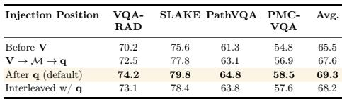
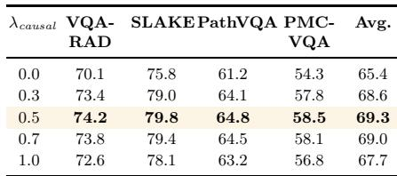
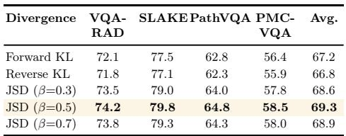

[← 返回 README](../README.md)

# Discussion

## 📌 预览
本文件合并 Discussion/Conclusion/Appendix/References，重点看局限、实现细节、失败案例和可追踪的相关工作。

---

# 4 Conclusion and Future Work

We propose MedSynapse-V, a medical vision-language model that performs clinical reasoning through compact latent tokens rather than explicit chain-ofthought generation. By combining causal counterfactual rewards with progressive memory evolution, our approach effectively internalizes diagnostic reasoning within a low-latency framework. Experiments across multiple medical benchmarks show that MedSynapse-V outperforms existing medical VLMs, generalpurpose VLMs, and RL-based CoT methods in both accuracy and efficiency, confirming that latent cognitive processes guided by well-designed rewards can effectively replace verbose explicit reasoning in the medical domain.

> 💡 **批注**: 这是记忆机制段落：重点区分“调用/读出 memory”和“形成/写入 memory”，以及 memory 是否动态变化。

Table 3: Complete hyperparameter configuration for all three training stages.

*Table extracted: Table extracted by MinerU. Injection Position VQA- RAD SLAKE PathVQA PMC- VQA Avg. Before V 70.2 75.6 61.3 54.8 65.5 V →M→q 72.5 77.8 63.1 56.9 67.6 After q (default) 74.2 79.8 64.8 58.5 69.3 Interleaved w/q*

> 💡 **Table extracted 批读**: 表格要看不同任务/模态/模型规模下是否一致提升；医学场景尤其关注 per-modality 和失败案例。

Looking ahead, we aim to extend latent memory evolution to longitudinal analysis and multi-modal report generation by integrating heterogeneous clinical evidence sources. Our research will further investigate scaling implicit memory to accommodate broader differential diagnosis spaces with hundreds of competing hypotheses, validating the generalizability of latent cognitive architectures for complex clinical decision-making in high-stakes diagnostic environments.

> 💡 **批注**: 这里的核心是 latent-space 计算：作者希望在连续表示中完成推理/记忆，而不是完全依赖显式文本链。

# 5 Implementation Details

Training Configuration Table 3 provides the hyperparameter configuration across all three training stages for reproducibility. We employ standard data augmentation techniques to improve training robustness, including random rotation ( $\pm$ 15), horizontal flipping (probability 0.5), brightness/contrast adjustment $( \pm 1 0 \%$ ), and color jittering, while preserving critical diagnostic features and anatomical orientations. Images are processed at native dynamic resolution following Qwen3- VL’s default configuration (min pixels=256 $\times$ 28 $\times$ 28, max pixels=1280 $\times$ 28 $\times$ 28). All experiments are conducted five times and we report the mean.

> 💡 **批注**: 这是医学影像相关段落：关注病灶证据、跨模态差异、临床先验和可解释风险。

Architectural Details The architecture comprises several integrated components: the Diagnostic Memory Sampler $\mathcal { P } _ { \phi }$ is implemented as a 2- layer (L=2) Transformer featuring 8 heads (head dimension 128) and 16 meta-query probes $\mathbf { Q } _ { 0 } \in \mathbb { R } ^ { 1 6 \times 1 0 2 4 }$ initialized via a truncated normal distribution ( $\sigma ~ = ~ 0 . 0 2$ ), followed by a final linear projection to the 4096-dimensional hidden space; concurrently, the Autonomous Memory Mod ule $\mathcal { A } _ { \psi }$ processes pooled visual features through two 4096-dimensional linear layers with GELU activation and LayerNorm to produce an $N \ \times \ d _ { h }$ representation. For anatomical encoding, we uti-

> 💡 **批注**: 这是记忆机制段落：重点区分“调用/读出 memory”和“形成/写入 memory”，以及 memory 是否动态变化。

*Figure 9: Fig. 9: Detailed architecture of the Diagnostic Memory Sampler $\mathcal { P } _ { \phi }$ . The frozen anatomical encoder $\mathcal { E } _ { a n a }$ extracts spatial features ${ \textbf { F } } \in$ $\mathbb { R } ^ { H _ { f } \times W _ { f } \times d _ { f } }$ , which are flattened into a token sequence and used as key–value pairs for the learnable meta-query probes $\mathbf { Q } _ { 0 }$ . Through $L$ layers of selfattention, feed-forward processing, cross-attention, and a final linear projection ( $d _ { f }  d _ { h }$ ), the module produces $N$ compact implicit memory $\mathcal { M } \in \mathbb { R } ^ { N \times d _ { h } }$ that are injected into the VLM hidden stream between the question encoding and answer positions.*

> 💡 **Figure 9 批读**: 这张图通常展示框架、视觉案例或 latent/memory 流程。重点看视觉证据如何进入、保留或更新 latent memory。

lize the MedSAM3 ViT-B backbone pretrained on 11 imaging modalities, which extracts $6 4 \times 6 4 \times 1 0 ^ { . } 2 4$ spatial features (flattened to $M = 4 0 9 6$ tokens) and provides highest-confidence region masks $\mathbf { B }$ via its segmentation head (threshold 0.7) to guide the causal counterfactual reward. Finally, the model is optimized in Stage II using LoRA adapters ( $r = 6 4 , \alpha = 1 2 8 )$ applied to all attention projection matrices across the 32 layers of Qwen3-VL-8B, resulting in approximately 83.9M trainable parameters ${ \sim } 1 . 0 \%$ of the backbone) to ensure efficient RL-driven adaptation while preserving the integrity of the pretrained knowledge.

> 💡 **批注**: 这里在讨论视觉证据是否被保留和利用；要问模型是否真的看图，而不是被语言先验带偏。

Evaluation Details For quantitative evaluation, VQA-RAD, PMC-VQA, MMMU $^ *$ MedXpertQA-MM, and GMAI-MMBench are evaluated exclusively with the closed-ended template (Fig. 15). SLAKE and PathVQA contain both closedended and open-ended subsets: the corresponding template is applied to each subset respectively, and overall accuracy is reported by aggregating both. For closed-ended VQA tasks, we extract the predicted answer by matching the first occurrence of option letters (A/B/C/D/E) in the generated response. If no explicit option is found, we perform fuzzy string matching against candidate answers. For GMAI-MMBench and MedXpertQA-MM, we follow their respective official evaluation scripts to ensure cross-study comparability. All evaluations use greedy decoding (temperature=0, top- $p$ =1.0) with a maximum generation length of 512 tokens. The 16 diagnostic memory vectors are injected at positions immediately following the question encoding, as described in §3.2 of the main paper.

> 💡 **批注**: 这是记忆机制段落：重点区分“调用/读出 memory”和“形成/写入 memory”，以及 memory 是否动态变化。

*Figure 10: Fig. 10: Training dynamics across three stages: (a-c) Stage II reward optimization and gradient stabilization via causal refinement; (d) Stage I NTP loss convergence; (e) Stage II policy-KL evolution; (f) Stage III distillation fidelity and output agreement.*

> 💡 **Figure 10 批读**: 这张图通常展示框架、视觉案例或 latent/memory 流程。重点看视觉证据如何进入、保留或更新 latent memory。

# 10 Evaluation Prompt Templates

We adopt minimal, zero-shot prompt templates for all evaluations to avoid biasing the model through elaborate instructions and to ensure fair comparison across methods. Following prior medical VLM evaluation practices [6,19,32,37], we use a brief system instruction paired with the clinical query and image, without few-shot exemplars or chain-of-thought elicitation. This design isolates the effect of each model’s intrinsic capabilities (or, in our case, latent diagnostic memory) from prompt engineering.

> 💡 **批注**: 这是记忆机制段落：重点区分“调用/读出 memory”和“形成/写入 memory”，以及 memory 是否动态变化。

The qualitative case analyses in the main paper and this supplement uniformly use the open-ended template to reveal each model’s complete diagnostic reasoning. Fig. 15 and 16 present the exact prompt templates used for closedended and open-ended evaluation, respectively. For MedSynapse-V, the Autonomous Memory Module $\mathcal { A } _ { \psi }$ generates diagnostic implicit memory $\mathcal { M } _ { a u t o } =$ $\{ m _ { 1 } , \hdots , m _ { 1 6 } \}$ directly from the VLM’s own visual encoding features and injects them into the hidden stream between the question encoding and the answer generation position (see §2.4 in the main text). The entire process is transparent to the surface-level prompt: no additional text tokens, special markers, or reasoning elicitation instructions are required, distinguishing MedSynapse-V from both explicit CoT methods (which append reasoning instructions such as “Let’s think step by step”) and other latent reasoning methods that require special delimiters (e.g., Coconut’s <bot>/<eot> markers [15] or Heima’s <CoT> tokens [43]).

> 💡 **批注**: 这里的核心是 latent-space 计算：作者希望在连续表示中完成推理/记忆，而不是完全依赖显式文本链。

Table 9: Left: effect of memory injection position on diagnostic accuracy ( $\%$ ), where $\mathbf { V }$ and q denote visual and question tokens. Right: effect of GRPO group size $G$ on accuracy ( $\%$ ) and training cost. All results use the full three-stage pipeline with IMT inference. Default configurations are highlighted.

> 💡 **批注**: 这是记忆机制段落：重点区分“调用/读出 memory”和“形成/写入 memory”，以及 memory 是否动态变化。

*Table 10: Table 10: Left: comparison of divergence measures for IMT distillation ( $\beta$ controls JSD interpolation weight). Right: sensitivity analysis of causal reward weight $\lambda _ { c a u s a l }$ . Default configurations are highlighted.*

> 💡 **Table 10 批读**: 表格要看不同任务/模态/模型规模下是否一致提升；医学场景尤其关注 per-modality 和失败案例。

*Table extracted: Table extracted by MinerU. Divergence VQA- RAD SLAKEPathVQA PMC- VQA Avg. Forward KL 72.1 77.5 62.8 56.4 67.2 Reverse KL 71.8 77.1 62.3 55.9 66.8 JSD (β=0.3) 73.5 79.0 64.0 57.8 68.6 JSD (β=0.5) 74.2 79.8 64*

> 💡 **Table extracted 批读**: 表格要看不同任务/模态/模型规模下是否一致提升；医学场景尤其关注 per-modality 和失败案例。

Answer extraction. For closed-ended tasks, we extract the first valid option letter (A/B/C/D/E) from the generated output using regex matching. For CoT baselines that produce structured tags (e.g., <answer>B</answer>), we parse the content within the answer tags. If no valid option is detected, the response is marked as incorrect. For open-ended tasks, we follow prior work [16, 29] and perform exact string matching after lowercasing and stripping punctuation.

Decoding configuration. All models are evaluated with greedy decoding (temperature $= 0$ , top- $p = 1 . 0$ ) to ensure deterministic and reproducible outputs. The maximum generation length is set to 128 tokens for MedSynapse-V and other direct-answer models, and 1024 tokens for CoT baselines to accommodate their verbose reasoning traces. Note that the 16 diagnostic memory vectors ( $N$ =16) are injected into the hidden stream as continuous embeddings and do not count toward the generated token budget; the model’s actual text output for closedended tasks is typically 1–3 tokens and open-ended for 20-40 tokens.

> 💡 **批注**: 这是记忆机制段落：重点区分“调用/读出 memory”和“形成/写入 memory”，以及 memory 是否动态变化。

# References

1. Arasteh, S.T., Lotfinia, M., Bressem, K., Siepmann, R., Adams, L., Ferber, D., Kuhl, C., Kather, J.N., Nebelung, S., Truhn, D.: Radiorag: factual large language models for enhanced diagnostics in radiology using online retrieval augmented generation 2024. arXiv preprint arXiv.2407.15621   
2. Bai, S., Cai, Y., Chen, R., Chen, K., Chen, X., Cheng, Z., Deng, L., Ding, W., Gao, C., Ge, C., et al.: Qwen3-vl technical report. arXiv preprint arXiv:2511.21631 (2025)   
3. Bose, S., Rajendran, R.K., Debnath, B., Karydis, K., Roy-Chowdhury, A.K., Chakradhar, S.: Visual alignment of medical vision-language models for grounded radiology report generation. arXiv preprint arXiv:2512.16201 (2025)   
4. Brunyé, T.T., Drew, T., Weaver, D.L., Elmore, J.G.: A review of eye tracking for understanding and improving diagnostic interpretation. Cognitive research: principles and implications 4(1), 7 (2019)   
5. Chen, C., Ma, Z., Li, Y., Hu, Y., Wei, Y., Li, W., Nie, L.: Reasoning in the dark: Interleaved vision-text reasoning in latent space. arXiv preprint arXiv:2510.12603 (2025)   
6. Chen, J., Gui, C., Ouyang, R., Gao, A., Chen, S., Chen, G.H., Wang, X., Cai, Z., Ji, K., Wan, X., et al.: Towards injecting medical visual knowledge into multimodal llms at scale. In: Proceedings of the 2024 conference on empirical methods in natural language processing. pp. 7346–7370 (2024)   
7. Chen, K., Rui, S., Jiang, Y., Wu, J., Zheng, Q., Song, C., Wang, X., Zhou, M., Liu, M.: Think twice to see more: Iterative visual reasoning in medical vlms. arXiv preprint arXiv:2510.10052 (2025)   
8. Cheng, J., Ye, J., Deng, Z., Chen, J., Li, T., Wang, H., Su, Y., Huang, Z., Chen, J., Jiang, L., et al.: Sam-med2d. arXiv preprint arXiv:2308.16184 (2023) 9. Chopra, S., Sanchez-Rodriguez, G., Mao, L., Feola, A.J., Li, J., Kira, Z.: Medmoe: modality-specialized mixture of experts for medical vision-language understanding. arXiv preprint arXiv:2506.08356 (2025)   
10. Deng, Y., Choi, Y., Shieber, S.: From explicit cot to implicit cot: Learning to internalize cot step by step. arXiv preprint arXiv:2405.14838 (2024)   
11. Ding, M., Zhang, J., Wang, W., Zhong, H., Luo, X., Chen, W., Shen, L.: Mmedexpert-r1: Strengthening multimodal medical reasoning via domain-specific adaptation and clinical guideline reinforcement. arXiv preprint arXiv:2601.10949 (2026)   
12. Gai, X., Zhou, C., Liu, J., Feng, Y., Wu, J., Liu, Z.: Medthink: Explaining medical visual question answering via multimodal decision-making rationale. arXiv preprint arXiv:2404.12372 (2024)   
13. Geiping, J., McLeish, S., Jain, N., Kirchenbauer, J., Singh, S., Bartoldson, B.R., Kailkhura, B., Bhatele, A., Goldstein, T.: Scaling up test-time compute with latent reasoning: A recurrent depth approach. arXiv preprint arXiv:2502.05171 (2025)   
14. Gu, T., Yang, K., Liu, D., Cai, W.: Lapa: Latent prompt assist model for medical visual question answering. In: Proceedings of the IEEE/CVF Conference on Computer Vision and Pattern Recognition. pp. 4971–4980 (2024)   
15. Hao, S., Sukhbaatar, S., Su, D., Li, X., Hu, Z., Weston, J., Tian, Y.: Training large language models to reason in a continuous latent space. arXiv preprint arXiv:2412.06769 (2024)   
16. He, X., Zhang, Y., Mou, L., Xing, E., Xie, P.: Pathvqa: 30000+ questions for medical visual question answering. arXiv preprint arXiv:2003.10286 (2020)   
17. Hu, E.J., Shen, Y., Wallis, P., Allen-Zhu, Z., Li, Y., Wang, S., Wang, L., Chen, W., et al.: Lora: Low-rank adaptation of large language models. Iclr 1(2), 3 (2022)   
18. Hu, Y., Li, T., Lu, Q., Shao, W., He, J., Qiao, Y., Luo, P.: Omnimedvqa: A new large-scale comprehensive evaluation benchmark for medical lvlm. In: Proceedings of the IEEE/CVF Conference on Computer Vision and Pattern Recognition. pp. 22170–22183 (2024)   
19. Lai, Y., Zhong, J., Li, M., Zhao, S., Li, Y., Psounis, K., Yang, X.: Med-r1: Reinforcement learning for generalizable medical reasoning in vision-language models. IEEE Transactions on Medical Imaging (2026)   
20. Lau, J.J., Gayen, S., Ben Abacha, A., Demner-Fushman, D.: A dataset of clinically generated visual questions and answers about radiology images. Scientific data 5(1), 1–10 (2018)   
21. Le-Duc, K., Nguyen, D.M., Trinh, P.T., Nguyen, T.P., Diep, N.T., Ngo, A., Vu, T., Vuong, T., Nguyen, A.T., Nguyen, M., et al.: S-chain: Structured visual chainof-thought for medicine. arXiv preprint arXiv:2510.22728 (2025)   
22. Lewis, P., Perez, E., Piktus, A., Petroni, F., Karpukhin, V., Goyal, N., Küttler, H., Lewis, M., Yih, W.t., Rocktäschel, T., et al.: Retrieval-augmented generation for knowledge-intensive nlp tasks. Advances in neural information processing systems 33, 9459–9474 (2020)   
23. Li, B., Yan, T., Pan, Y., Luo, J., Ji, R., Ding, J., Xu, Z., Liu, S., Dong, H., Lin, Z., et al.: Mmedagent: Learning to use medical tools with multi-modal agent. In: Findings of the Association for Computational Linguistics: EMNLP 2024. pp. 8745–8760 (2024)   
24. Li, C., Wong, C., Zhang, S., Usuyama, N., Liu, H., Yang, J., Naumann, T., Poon, H., Gao, J.: Llava-med: Training a large language-and-vision assistant for biomedicine in one day. Advances in Neural Information Processing Systems 36, 28541–28564 (2023)   
25. Li, H., Li, C., Wu, T., Zhu, X., Wang, Y., Yu, Z., Jiang, E.H., Zhu, S.C., Jia, Z., Wu, Y.N., et al.: Seek in the dark: Reasoning via test-time instance-level policy gradient in latent space. arXiv preprint arXiv:2505.13308 (2025)   
26. Li, T., Su, Y., Li, W., Fu, B., Chen, Z., Huang, Z., Wang, G., Ma, C., Chen, Y., Hu, M., et al.: Gmai-vl & gmai-vl-5.5 m: A large vision-language model and a comprehensive multimodal dataset towards general medical ai. arXiv preprint arXiv:2411.14522 (2024)   
27. Lin, J.: Divergence measures based on the shannon entropy. IEEE Transactions on Information theory 37(1), 145–151 (2002)   
28. Liu, A., Xue, R., Cao, X.R., Shen, Y., Lu, Y., Li, X., Chen, Q., Chen, J.: Medsam3: Delving into segment anything with medical concepts. arXiv preprint arXiv:2511.19046 (2025)   
29. Liu, B., Zhan, L.M., Xu, L., Ma, L., Yang, Y., Wu, X.M.: Slake: A semanticallylabeled knowledge-enhanced dataset for medical visual question answering. In: 2021 IEEE 18th international symposium on biomedical imaging (ISBI). pp. 1650–1654. IEEE (2021)   
30. Liu, L., Pfeiffer, J., Wu, J., Xie, J., Szlam, A.: Deliberation in latent space via differentiable cache augmentation. arXiv preprint arXiv:2412.17747 (2024)   
31. Moor, M., Huang, Q., Wu, S., Yasunaga, M., Dalmia, Y., Leskovec, J., Zakka, C., Reis, E.P., Rajpurkar, P.: Med-flamingo: a multimodal medical few-shot learner. In: Machine learning for health (ML4H). pp. 353–367. PMLR (2023)   
32. Mullappilly, S.S., Kurpath, M.I., Mohamed, O., Zidan, M., Khan, F., Khan, S., Anwer, R., Cholakkal, H.: Medix-r1: Open ended medical reinforcement learning. arXiv preprint arXiv:2602.23363 (2026)   
33. Mullappilly, S.S., Kurpath, M.I., Pieri, S., Alseiari, S.Y., Cholakkal, S., Aldahmani, K., Khan, F., Anwer, R., Khan, S., Baldwin, T., et al.: Bimedix2: Bio-medical expert lmm for diverse medical modalities. arXiv preprint arXiv:2412.07769 (2024)   
34. Nath, V., Li, W., Yang, D., Myronenko, A., Zheng, M., Lu, Y., Liu, Z., Yin, H., Law, Y.M., Tang, Y., et al.: Vila-m3: Enhancing vision-language models with medical expert knowledge. In: Proceedings of the Computer Vision and Pattern Recognition Conference. pp. 14788–14798 (2025)   
35. Norman, G.: Dual processing and diagnostic errors. Advances in Health Sciences Education 14(Suppl 1), 37–49 (2009)   
36. Ouyang, L., Wu, J., Jiang, X., Almeida, D., Wainwright, C., Mishkin, P., Zhang, C., Agarwal, S., Slama, K., Ray, A., et al.: Training language models to follow instructions with human feedback. Advances in neural information processing systems 35, 27730–27744 (2022)   
37. Pan, J., Liu, C., Wu, J., Liu, F., Zhu, J., Li, H.B., Chen, C., Ouyang, C., Rueckert, D.: Medvlm-r1: Incentivizing medical reasoning capability of vision-language models (vlms) via reinforcement learning. In: International Conference on Medical Image Computing and Computer-Assisted Intervention. pp. 337–347. Springer (2025)   
38. Pham, T.H., Ngo, C.: Multimodal chain of continuous thought for latent-space reasoning in vision-language models. arXiv preprint arXiv:2508.12587 (2025)   
39. Rafailov, R., Sharma, A., Mitchell, E., Manning, C.D., Ermon, S., Finn, C.: Direct preference optimization: Your language model is secretly a reward model. Advances in neural information processing systems 36, 53728–53741 (2023)   
40. Schulman, J., Wolski, F., Dhariwal, P., Radford, A., Klimov, O.: Proximal policy optimization algorithms. arXiv preprint arXiv:1707.06347 (2017)   
41. Sellergren, A., Kazemzadeh, S., Jaroensri, T., Kiraly, A., Traverse, M., Kohlberger, T., Xu, S., Jamil, F., Hughes, C., Lau, C., et al.: Medgemma technical report. arXiv preprint arXiv:2507.05201 (2025)   
42. Shao, Z., Wang, P., Zhu, Q., Xu, R., Song, J., Bi, X., Zhang, H., Zhang, M., Li, Y., Wu, Y., et al.: Deepseekmath: Pushing the limits of mathematical reasoning in open language models. arXiv preprint arXiv:2402.03300 (2024)   
43. Shen, Z., Yan, H., Zhang, L., Hu, Z., Du, Y., He, Y.: Codi: Compressing chainof-thought into continuous space via self-distillation. In: Proceedings of the 2025 Conference on Empirical Methods in Natural Language Processing. pp. 677–693 (2025)   
44. Su, Y., Li, T., Liu, J., Ma, C., Ning, J., Tang, C., Ju, S., Ye, J., Chen, P., Hu, M., et al.: Gmai-vl-r1: Harnessing reinforcement learning for multimodal medical reasoning. arXiv preprint arXiv:2504.01886 (2025)   
45. Sun, H., Jiang, Y., Lou, W., Zhang, Y., Li, W., Wang, L., Liu, M., Liu, L., Wang, X.: Chiron-o1: Igniting multimodal large language models towards generalizable medical reasoning via mentor-intern collaborative search. arXiv preprint arXiv:2506.16962 (2025)   
46. Tan, W., Li, J., Ju, J., Luo, Z., Song, R., Luan, J.: Think silently, think fast: Dynamic latent compression of llm reasoning chains. arXiv preprint arXiv:2505.16552 (2025)   
47. Van Sonsbeek, T., Derakhshani, M.M., Najdenkoska, I., Snoek, C.G., Worring, M.: Open-ended medical visual question answering through prefix tuning of language models. In: International Conference on Medical Image Computing and Computer-Assisted Intervention. pp. 726–736. Springer (2023)   
48. Waite, S., Scott, J., Gale, B., Fuchs, T., Kolla, S., Reede, D.: Interpretive error in radiology. American Journal of Roentgenology 208(4), 739–749 (2017)   
49. Wang, Y., Liu, J., Gao, S., Feng, B., Tang, Z., Gai, X., Wu, J., Liu, Z.: V2tcot: From vision to text chain-of-thought for medical reasoning and diagnosis. In: International Conference on Medical Image Computing and Computer-Assisted Intervention. pp. 658–668. Springer (2025)   
50. Wei, J., Wang, X., Schuurmans, D., Bosma, M., Xia, F., Chi, E., Le, Q.V., Zhou, D., et al.: Chain-of-thought prompting elicits reasoning in large language models. Advances in neural information processing systems 35, 24824–24837 (2022)   
51. Wu, C., Zhang, X., Zhang, Y., Hui, H., Wang, Y., Xie, W.: Towards generalist foundation model for radiology by leveraging web-scale 2d&3d medical data. Nature Communications 16(1), 7866 (2025)   
52. Wu, J., Deng, W., Li, X., Liu, S., Mi, T., Peng, Y., Xu, Z., Liu, Y., Cho, H., Choi, C.I., et al.: Medreason: Eliciting factual medical reasoning steps in llms via knowledge graphs. arXiv preprint arXiv:2504.00993 (2025)   
53. Wu, J., Zhu, J., Qi, Y., Chen, J., Xu, M., Menolascina, F., Grau, V.: Medical graph rag: Towards safe medical large language model via graph retrieval-augmented generation. arXiv preprint arXiv:2408.04187 (2024)   
54. Xu, Y., Guo, X., Zeng, Z., Miao, C.: Softcot: Soft chain-of-thought for efficient reasoning with llms. In: Proceedings of the 63rd Annual Meeting of the Association for Computational Linguistics (Volume 1: Long Papers). pp. 23336–23351 (2025)   
55. Xu, Y., Guo, X., Zeng, Z., Miao, C.: Softcot++: Test-time scaling with soft chainof-thought reasoning. arXiv preprint arXiv:2505.11484 (2025)   
56. Xu, Z., Wang, H., Bespalov, D., Wu, X., Stone, P., Qi, Y.: Lars: Latent reasoning skills for chain-of-thought reasoning. In: Findings of the Association for Computational Linguistics: EMNLP 2024. pp. 3624–3643 (2024)   
57. Ye, J., Wang, G., Li, Y., Deng, Z., Li, W., Li, T., Duan, H., Huang, Z., Su, Y., Wang, B., et al.: Gmai-mmbench: A comprehensive multimodal evaluation benchmark towards general medical ai. Advances in Neural Information Processing Systems 37, 94327–94427 (2024)   
58. Yu, H., Cheng, T., Cheng, Y., Feng, R.: Finemedlm-o1: Enhancing the medical reasoning ability of llm from supervised fine-tuning to test-time training. arXiv e-prints pp. arXiv–2501 (2025)   
59. Yu, X., Xu, C., Zhang, G., Chen, Z., Zhang, Y., He, Y., Jiang, P.T., Zhang, J., Hu, X., Yan, S.: Vismem: Latent vision memory unlocks potential of vision-language models. arXiv preprint arXiv:2511.11007 (2025)   
60. Yue, X., Ni, Y., Zhang, K., Zheng, T., Liu, R., Zhang, G., Stevens, S., Jiang, D., Ren, W., Sun, Y., et al.: Mmmu: A massive multi-discipline multimodal understanding and reasoning benchmark for expert agi. In: Proceedings of the IEEE/CVF conference on computer vision and pattern recognition. pp. 9556–9567 (2024)   
61. Zakka, C., Shad, R., Chaurasia, A., Dalal, A.R., Kim, J.L., Moor, M., Fong, R., Phillips, C., Alexander, K., Ashley, E., et al.: Almanac—retrieval-augmented language models for clinical medicine. Nejm ai 1(2), AIoa2300068 (2024)   
62. Zhang, G., Fu, M., Yan, S.: Memgen: Weaving generative latent memory for selfevolving agents. arXiv preprint arXiv:2509.24704 (2025)   
63. Zhang, W., Guo, J., Zhang, H., Zhang, P., Chen, J., Zhang, S., Zhang, Z., Yi, Y., Bu, H.: Patho-agenticrag: towards multimodal agentic retrievalaugmented generation for pathology vlms via reinforcement learning. arXiv preprint arXiv:2508.02258 (2025)   
64. Zhang, X., Wu, C., Zhao, Z., Lin, W., Zhang, Y., Wang, Y., Xie, W.: Pmc-vqa: Visual instruction tuning for medical visual question answering. arXiv preprint arXiv:2305.10415 (2023)   
65. Zhang, Y., Xu, W., Zhao, X., Wang, W., Feng, F., He, X., Chua, T.S.: Reinforced latent reasoning for llm-based recommendation. arXiv preprint arXiv:2505.19092 (2025)   
66. Zhao, X., Liu, S., Yang, S.Y., Miao, C.: Medrag: Enhancing retrieval-augmented generation with knowledge graph-elicited reasoning for healthcare copilot. In: Proceedings of the ACM on Web Conference 2025. pp. 4442–4457 (2025)   
67. Zhu, J., Wang, W., Chen, Z., Liu, Z., Ye, S., Gu, L., Tian, H., Duan, Y., Su, W., Shao, J., et al.: Internvl3: Exploring advanced training and test-time recipes for open-source multimodal models. arXiv preprint arXiv:2504.10479 (2025)   
68. Zhu, K., Xia, P., Li, Y., Zhu, H., Wang, S., Yao, H.: Mmedpo: Aligning medical vision-language models with clinical-aware multimodal preference optimization. arXiv preprint arXiv:2412.06141 (2024)   
69. Zuo, Y., Qu, S., Li, Y., Chen, Z., Zhu, X., Hua, E., Zhang, K., Ding, N., Zhou, B.: Medxpertqa: Benchmarking expert-level medical reasoning and understanding. arXiv preprint arXiv:2501.18362 (2025)

> 💡 **批注**: 这里的核心是 latent-space 计算：作者希望在连续表示中完成推理/记忆，而不是完全依赖显式文本链。

---

## 🔖 Section 总结

### 核心洞察
1. 总结可复用设计和局限。
2. References 可用于扩展本课题文献图谱。
