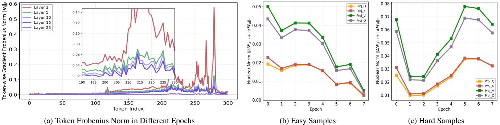

[← 返回 README](../README.md)

# Introduction

## 📌 预览
本文件合并 Introduction/Related Work，重点读动机链、研究 gap、贡献列表和本文在 VisMem/Med Image 课题中的定位。

---

# 1. Introduction

Over the past few years, large language models (LLMs) have achieved remarkable progress in complex reasoning, propelled by scaling laws in data volume and model capacity [26, 49]. Advanced techniques such as Chain-of-

> 💡 **批注**: 这里涉及动态计算或训练信号：重点看是否自适应分配推理深度。

Thought (CoT) prompting [46, 77] and reinforcement learning (RL) [9, 12, 70] for trajectory optimization have proven highly effective in text-only domains. Extending these capabilities to the multimodal realm has thus become a pivotal research direction. Current approaches primarily follow three paradigms. First, Text-based Reasoning [27, 40, 77] generates explicit multi-step textual chains before producing an answer. However, these methods typically rely on static visual inputs, and recent studies [68, 71] indicate that visual grounding deteriorates significantly over extended reasoning chains. Second, Tool-augmented Reasoning manipulates visual inputs through external operations (e.g., zooming or region enhancement) and injects intermediate visual hints into the reasoning trace. While powerful, these approaches are prone to redundant or invalid tool invocations, introducing noise that degrades performance and substantially increases inference latency. Recently, emerging researches position Latent Reasoning as a viable direction for optimizing multimodal reasoning. Unlike traditional methods that rely on explicit textual chains, latent reasoning encodes intermediate reasoning steps into compact continuous vectors. This paradigm offers compelling advantages, including higher inference efficiency, reduced annotation overhead, and the ability to learn dense, high-fidelity multimodal representations [51, 77].

> 💡 **批注**: 这里的核心是 latent-space 计算：作者希望在连续表示中完成推理/记忆，而不是完全依赖显式文本链。

To gain deeper insights into the optimization dynamics of latent reasoning, we conducted a systematic analysis of gradient flows and parametric evolution during training. This investigation reveals two meaningful observations: (1) Visual-Text Optimization Disparity: Recent studies [67, 74] have highlighted the phenomenon of visual attention attenuation in MLLMs as the explicit Chain-of-Thought (CoT) reasoning chain extends. We discover that a similar degradation existing in latent reasoning. As depicted in Fig. 1a, visual tokens consistently exhibit significantly higher gradient norms and pronounced volatility compared to textual tokens. We reckon that this disparity stems from a fundamental mismatch between continuous visual features and discrete text tokens. During joint training, textual modality dominates the optimization process, causing visual representations to undergo large and erratic updates as they struggle to establish the fine-grained visual-text alignment. (2) Fixed-Depth Optimization Dilemma: Beyond modality imbalance, we observe an architecture bottleneck in how models handle samples with different complexity. Partitioning the training data into easy (consistently correct) and hard (persistently incorrect) subsets based on early-stage validation accuracy, we tracked the gradient nuclear norms across the QKV and output projection matrices O (Fig. 1b and Fig. 1c). The trends reveal a stark divergence: easy samples exhibit smooth gradient decay, indicating stable convergence into favorable loss basins. In contrast, hard samples maintain persistently high gradient volatility even in late training epochs. This phenomenon underscores the necessity of iterative refinement for complex reasoning, which is crucial for parsing compositional patterns in complex contexts while mitigating inherent visual ambiguities in images. Fixed-depth architectures, however, lack the flexibility to adapt to varying token complexities, thereby trapping hard examples in oscillatory optimization trends.

> 💡 **批注**: 这里的核心是 latent-space 计算：作者希望在连续表示中完成推理/记忆，而不是完全依赖显式文本链。

*Figure 1.: Figure 1. Panel (a) depicts the token-wise Frobenius norm of gradients within different layer throughout the overall training process. Notably, visual tokens (i.e., those with indices within about [200, 280]) exhibit consistently larger gradient magnitudes accompanied by abrupt spikes, suggesting that they are more challenging to optimize compared to textual tokens (indices without [200, 280]). Panels (b) and (c) further reveal distinct evolution patterns of the Nuclear norm in the QKVO projection matrix across layers and training epochs: gradients for easy samples decay rapidly and converge smoothly, whereas hard samples maintain elevated gradient norms with persistent oscillations. Here, $\mathbf { W } _ { A }$ and $\mathbf { W } _ { B }$ denote the low-rank matrix in LoRA [19].*

> 💡 **Figure 1. 批读**: 这张图通常展示框架、视觉案例或 latent/memory 流程。重点看视觉证据如何进入、保留或更新 latent memory。

Motivated by these observations, we propose a unified framework that strengthens fine-grained visual engagement and achieves token-wise depth scaling strategy to enable more precise and comprehensive contextual reasoning. Firstly, to mitigate visual optimization instability, we design a visual replay module, which dynamically replays the focused visual clues interleaved with thinking latents. This mechanism iteratively exposes and propagates key visual context across reasoning steps, fostering step-wise alignment with the target answer. Complementing this, we apply self-distillation supervision to enforce spatial coherence and preserve fine-grained visual details within the visual latents. Secondly, to address the fixed-depth optimization bottleneck, we propose a per-layer token router that dynamically allocates additional reasoning steps based on token complexity or information density. This design enables highdifficulty tokens to engage in prolonged contextual reasoning by reusing layer-wise knowledge, facilitating iterative representation refinement and adaptive prioritization of salient contextual cues. Finally, in contrast to methods [18, 47] that rely on knowledge distillation for direct latent supervision, we employ a curriculum learning strategy that progressively introduces latent tokens into the training pipeline. Extensive experiments show that our method can be effortlessly combined with various widely-used MLLM backbones to further enhance reasoning performance while maintain the satisfactory inference latency. The main contributions can be summarized as follows:

> 💡 **批注**: 这是记忆机制段落：重点区分“调用/读出 memory”和“形成/写入 memory”，以及 memory 是否动态变化。

We present a unified curriculum-driven framework that progressively constructs interleaved latent representations. By integrating spatially-coherent visual constraints for fine-grained grounding and complexity-aware depth scaling, our approach enables robust and precise contextual reasoning.

> 💡 **批注**: 这里在讨论视觉证据是否被保留和利用；要问模型是否真的看图，而不是被语言先验带偏。

• We systematically analyze token-level gradient dynamics during latent reasoning training, revealing two critical optimization bottlenecks: visual-text optimization disparity and fixed-depth optimization dilemma.   
• Extensive experiments across twelve widely-used multimodal reasoning benchmarks demonstrate that our method achieves state-of-the-art performance while maintaining high inference efficiency.

> 💡 **列表批读**: 这组条目通常对应贡献、设置、发现或模块；建议逐条映射到 visual memory / latent reasoning / medical diagnosis 的主线。

# 2. Related Work

# 2.2. Latent Reasoning

Different from explicit reasoning in the discrete token space, latent reasoning refers to internal computation performed in a hidden space before answer generation. Hao et al. [18] pioneers continuous latent space reasoning by feeding the last hidden states as input embeddings for the next step without generating intermediate discrete tokens, substantially reducing reasoning latency. However, subsequent studies have indicated that such paradigm may suffer from feature homogenization without explicit supervision on intermediate latent states. To address this limitation, a series of works attempt to enhance the quality of intermediate representations using diverse strategies. Cheng and Van Durme [6] introduced variable-length contemplation tokens for latent reasoning, mitigating quality degradation caused by fixedlength constraints. Similarly, Shen et al. [48] leveraged distillation tactic to align student and teacher hidden activations along with explicit supervision, thereby constraining latent reasoning paths. Beyond these efforts, Wei et al. [64] adopted step-level supervision to further stabilize the reasoning space.

> 💡 **批注**: 这里的核心是 latent-space 计算：作者希望在连续表示中完成推理/记忆，而不是完全依赖显式文本链。

Recently, latent reasoning has been extended to Multimodal Large Language Models (MLLMs). Distinct from text-only LLMs, MLLMs necessitate the effective integration of visual features within the latent reasoning space. Several efforts [30, 34, 43, 62, 69] have been dedicated to injecting visual cues into the latent space to facilitate visualgrounded reasoning. For instance, Wang et al. [62] emphasize image details by constructing a structured cognitive hierarchy, albeit relying on annotation-intensive multimodal reasoning data. Similarly, Liu et al. [34] progressively select visual patches to inject into latent thinking tokens via confidence-guided policy gradient optimization. In this work, we systematically analyze gradient dynamics during latent reasoning training and reveal two critical bottlenecks towards token-wise optimization behavior.

> 💡 **批注**: 这里的核心是 latent-space 计算：作者希望在连续表示中完成推理/记忆，而不是完全依赖显式文本链。

---

## 🔖 Section 总结

### 核心洞察
1. 把本文 gap 和 VisMem for Med Image 主线对应起来。
2. 注意作者如何区分 visual grounding、latent memory、medical prior。
