[← 返回 README](../README.md)

# Experiments

## 📌 预览
本文件合并 Experiments/Results/Analysis/Ablation，重点看方法是否真的提升视觉 grounding、医学诊断、鲁棒性和效率。

---

# 4. Experiments

We first conducted extensive evaluations on twelve diverse benchmarks against state-of-the-art competitors to validate the superiority of our method. Then, we provide comprehensive analysis through multi-faceted ablation studies and in-depth investigations to elucidate the underlying mechanisms of our approach.

> 💡 **批注**: 这里涉及动态计算或训练信号：重点看是否自适应分配推理深度。

# 4.1. Experimental Setup

Evaluation Benchmark. We evaluate our method on three tasks across twelve benchmarks: (1) Mathematics Reasoning (MathVista [37], MathVision [56], MM-Math [50]); (2) Vision-centric Reasoning (Hallusion-Bench [14], MMVP [53], Seed-Bench-2-Plus [28], HR-Bench [59], GQA [1]); (3) Multimodal Composition Reasoning (MMStar [4], BLINK [11], ScienceQA [38], $\mathbf { M } ^ { 3 } \mathbf { C o T }$ [5]). Additional descriptive details can be found in the Appendix.

> 💡 **批注**: 这里在讨论视觉证据是否被保留和利用；要问模型是否真的看图，而不是被语言先验带偏。

Baselines. We evaluate our method against a comprehensive set of state-of-the-art baselines, which can be categorized into four paradigms: (1) Zero-shot VLMs (GPT-4o [42], LLaVA-OneVision [29], InternVL3.5-8B [60], Qwen2.5-VL-7B [2]), (2) Explicit CoT-based methods (SCAFFOLD [27], ICoT [13], Multimodal-CoT [77], CCoT [40], Chain-of-Focus [75]), (3) Visual Enhanced methods, including tool-augmented reasoning (Deep-Eyes [80]) and RL-enhanced VLM reasoning (Vision-R1 [25], PAPO [63], VL-Rethinker [55]), and (4) Multimodal Latent Reasoning approaches (Laser [62], LVR [31], Monet [58], DMRL [34]).

> 💡 **批注**: 这里的核心是 latent-space 计算：作者希望在连续表示中完成推理/记忆，而不是完全依赖显式文本链。

Table 1. Comparison of various multimodal reasoning baselines across three benchmarks. We selected three datasets featuring detailed reasoning chains for training and evaluate on their test split, respectively. Three metrics are reported: Accuracy $( \% )$ , Average number of Autoregressive Steps (# AR steps), and Average Generation Time (AVG. Time). Evaluations were conducted on the $\mathbf { M } ^ { 3 } \mathbf { C o T } .$ , ScienceQA, and GQA benchmarks using Qwen2-VL-7B and Chameleon-7B. † denotes the reimplementation for the methods with the same configuration with ours. No-CoT notes that directly predicts answers without generating intermediate steps.

> 💡 **批注**: 这是实验证据：要同时看任务指标、鲁棒性、效率和消融。

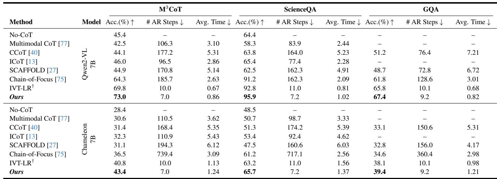
*Table 1.: Table 1. Comparison of various multimodal reasoning baselines across three benchmarks. We selected three datasets featuring detailed reasoning chains for training and evaluate on their test split, respectively. Three metrics are reported: Accuracy $( \% )$ , Average number of Autoregressive Steps (# AR steps), and Average Generation Time (AVG. Time). Evaluations were conducted on the $\mathbf { M } ^ { 3 } \mathbf { C o T } .$ , ScienceQA, and GQA benchmarks using Qwen2-VL-7B and Chameleon-7B. † denotes the reimplementation for the methods with the same configuration with ours. No-CoT notes that directly predicts answers without generating intermediate steps.*

> 💡 **Table 1. 批读**: 表格要看不同任务/模态/模型规模下是否一致提升；医学场景尤其关注 per-modality 和失败案例。

Table 2. Performance comparison of our method against baselines across four paradigms: Zero-Shot VLMs, Explicit CoT, Tool-Use & RL, and Latent Reasoning. Benchmarks are categorized into three domains: Visual Perception (MMVP, Seed-Bench-2-Plus, HallusionBench, HR-Bench), Compositional Reasoning (BLINK, MMStar), and Mathematical Reasoning (MathVista, MathVision, MM-Math). Among latent reasoning approaches, the best results are highlighted in bold, and the second-best are underlined. Our method is built upon the Qwen2.5-VL-7B backbone.

> 💡 **批注**: 这里的核心是 latent-space 计算：作者希望在连续表示中完成推理/记忆，而不是完全依赖显式文本链。

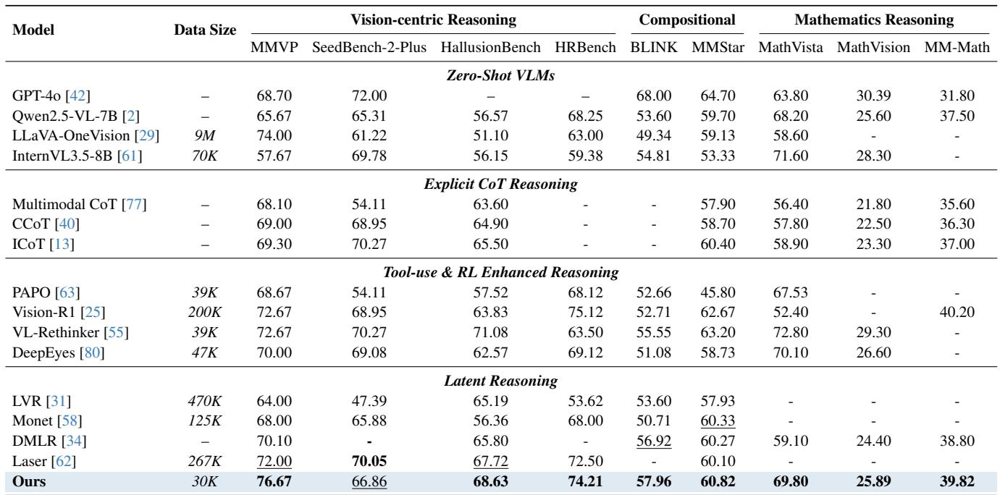
*Table 2.: Table 2. Performance comparison of our method against baselines across four paradigms: Zero-Shot VLMs, Explicit CoT, Tool-Use & RL, and Latent Reasoning. Benchmarks are categorized into three domains: Visual Perception (MMVP, Seed-Bench-2-Plus, HallusionBench, HR-Bench), Compositional Reasoning (BLINK, MMStar), and Mathematical Reasoning (MathVista, MathVision, MM-Math). Among latent reasoning approaches, the best results are highlighted in bold, and the second-best are underlined. Our method is built upon the Qwen2.5-VL-7B backbone.*

> 💡 **Table 2. 批读**: 表格要看不同任务/模态/模型规模下是否一致提升；医学场景尤其关注 per-modality 和失败案例。

Training Dataset. To facilitate reproducibility, we first detail the training data configuration. During the supervised fine-tuning (SFT) stage, we curate a subset of approximately 30K samples from OneThinker [10], selected for its diverse distribution of reasoning chain lengths. The statistical distributions of CoT length, reasoning steps, and topic categories within this subset are illustrated in Fig. 3.

Table 3. We perform comprehensive ablation studies to analyze the contribution of each design choice, including hyper-parameter configurations and architectural components. Experiments are conducted on three CoT benchmarks with multiple backbone models. To save the training overhead, all models are trained for 16 epochs with a balanced sampled subset.

> 💡 **批注**: 这是实验证据：要同时看任务指标、鲁棒性、效率和消融。

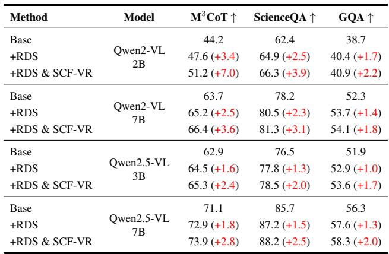
*Table 3.: Table 3. We perform comprehensive ablation studies to analyze the contribution of each design choice, including hyper-parameter configurations and architectural components. Experiments are conducted on three CoT benchmarks with multiple backbone models. To save the training overhead, all models are trained for 16 epochs with a balanced sampled subset.*

> 💡 **Table 3. 批读**: 表格要看不同任务/模态/模型规模下是否一致提升；医学场景尤其关注 per-modality 和失败案例。

Backbone Models. To comprehensively evaluate the effectiveness and scalability of our approach, we instantiate our method across a diverse set of backbone architectures, including Qwen2-VL-2B/7B [57], Qwen2.5-VL-3B/7B [2], and Chameleon-7B [52].

Implementation Details. All frameworks employ eager attention mode to enable explicit access to internal attention maps. We set the number of latent reasoning tokens to $T _ { r } = 4$ , with $\alpha = 3 2$ salient regions injected per refinement iteration. To balance computational efficiency and reasoning accuracy, we cap the maximum refinement depth at $D = 1$ For the cosine annealing schedule, the region injection count decays from $\alpha _ { s } = 6 4$ to $\alpha _ { e } = 1 6$ . Models are trained for 16 epochs by default.

> 💡 **批注**: 这里的核心是 latent-space 计算：作者希望在连续表示中完成推理/记忆，而不是完全依赖显式文本链。

We employ DeepSpeed ZeRO-2 optimization without CPU offloading, with a per-GPU batch size of 8. Training utilizes the Adam optimizer with a learning rate of $4 \times 1 0 ^ { - 5 }$ and $\beta _ { 1 } = 0 . 9$ . For the proposed self-distillation loss, we set the weighting coefficient to $\lambda = 1 . 0$ for 2B/3B-scale models and $\lambda = 0 . 2$ for 7B-scale models, respectively. Input images are resized to different resolutions according to training dataset, please refer to Appendix for detailed preprocessing protocols. All experiments are conducted on 16 NVIDIA H20 GPUs (96GB VRAM each).

> 💡 **批注**: 这里在讨论视觉证据是否被保留和利用；要问模型是否真的看图，而不是被语言先验带偏。

# 4.2. Overall Quantitative Results

Reasoning Accuracy. As summarized in Table 1, we train and evaluate our method on three datasets that provide finegrained CoT annotations. With the same training protocols, our approach achieves the best performance across both model backbones and all three datasets. Compared to traditional explicit CoT methods, our method yields clear-cut improvements, with an average accuracy gain of nearly $30 \%$ built upon the Qwen-2-VL architecture. Our approach further surpasses the second-best latent-based reasoning baseline (IVT-LR) by an average of $+ 2 . 6 3 \%$ across all benchmarks.

> 💡 **批注**: 这是实验证据：要同时看任务指标、鲁棒性、效率和消融。

As shown in Table 2, we further evaluate our method against widely-used mainstream benchmarks that diagnose multi-faceted reasoning capabilities. On most benchmarks, our approach achieves consistent improvements. Particularly on vision-centric benchmarks, our method attains remarkable gains in overall scores compared to previous state-of-the-art methods. Notably, we observe the most substantial improvement on MMVP $( + 4 . 6 7 \% )$ , which employs CLIP-blind patterns and emphasizes the requirement for finegrained visual discrimination. We attribute these gains to our designed RCF-VR. By maintaining a set of visual latents with fine-grained spatially-coherent constraints, our method effectively mitigates hallucination while capturing fine-grained visual details. Conversely, our approach exhibits modest performance on text-intensive benchmarks, notably SeedBench-2-Plus. This gap likely arises from the scarcity of domain-specific training data, underscoring the potential benefits of targeted fine-tuning for such tasks. Remarkably, our method achieves competitive performance against computationally intensive alternatives, including explicit Chainof-Thought (CoT) and tool-augmented frameworks. Despite operating purely within the latent space—without relying on external knowledge retrieval or reinforcement learningbased optimization—our framework effectively captures rich semantic representations through token-wise depth scaling.

> 💡 **批注**: 这里的核心是 latent-space 计算：作者希望在连续表示中完成推理/记忆，而不是完全依赖显式文本链。

Reasoning Efficiency. Beyond predictive accuracy, a critical advantage of our approach lies in its substantially improved inference efficiency, which we quantify through two similar metrics: autoregressive generation steps and wallclock inference latency. (1) Autoregressive Steps. Across all evaluated backbones, our method achieves at least a $1 0 \times$ reduction in autoregressive generation steps relative to conventional baselines. This efficiency gain arises from performing compact reasoning directly in the latent space, thereby obviating the need for verbose, explicitly generated textual rationales characteristic of standard Chain-of-Thought (CoT) approaches. (2) Inference Latency. Built upon the Qwen backbone, our method attains an average wall-clock inference time of approximately 0.9s, comparable to IVT-IR while delivering $3 { - } 6 \times$ faster rationale generation than explicit CoT-based competitors. Similar acceleration patterns are consistently observed on the Chameleon architecture. Although the No-CoT baseline achieves the lowest latency (0.35s), this efficiency comes at the cost of sophisticated multi-step reasoning capabilities. In contrast, our approach operates near this efficiency frontier: it delivers state-of-theart accuracy while incurring only marginal latency overhead relative to the fastest yet reasoning-limited No-CoT baseline. This favorable trade-off underscores a key advantage of our framework—enabling rapid inference without compromising the nuanced, multi-step understanding essential for complex multimodal reasoning tasks.

> 💡 **批注**: 这里的核心是 latent-space 计算：作者希望在连续表示中完成推理/记忆，而不是完全依赖显式文本链。

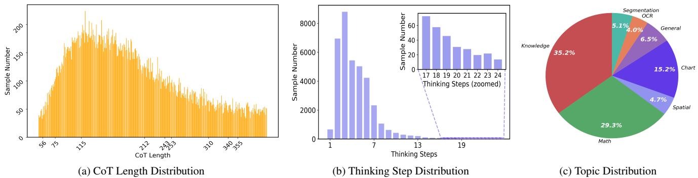
*Figure 3.: Figure 3. Details of sampled training distribution. Panel (a) depicts the sample distribution across different CoT lengths. The distribution exhibits a boundary at 125 tokens, with sample counts gradually decreasing toward both shorter and longer extremes. Panel (b) illustrates the distribution of reasoning steps in the original data. Specifically, we segment reasoning steps using $\backslash \mathrm { n } \backslash \mathrm { n }$ as delimiters; during training, we retain up to 4 delimiters to evenly partition sequence length, while samples containing fewer than 4 delimiters preserve their original segmentation. Panel (c) summarizes the topic-wise distribution of samples in the dataset.*

> 💡 **Figure 3. 批读**: 这张图通常展示框架、视觉案例或 latent/memory 流程。重点看视觉证据如何进入、保留或更新 latent memory。

# 4.3. Ablation Analysis

Effect of Designed SCF-VR and RDS. We introduce several model variants to validate the effectiveness of our proposed modules across four representative MLLM backbones. As summarized in Table 3, consistent performance improvements are observed across all architectures. Notably, when instantiated on Qwen2-VL-2B, our method achieves a substantial improvement of $+ 7 . 0 \%$ on $\mathbf { M } ^ { 3 } \mathbf { C o T } .$ . Furthermore, we observe that performance gains are less pronounced on the GQA benchmark. We hypothesize that this trend arises from the relatively straightforward nature of GQA, where both visual inputs and queries demand less complex reasoning. Consequently, baseline models can adequately address the task requirements, rendering the contributions of our designed modules less impactful in such scenarios.

> 💡 **批注**: 这是实验证据：要同时看任务指标、鲁棒性、效率和消融。

Effect of Curriculum Training. Curriculum training is critical to our method design. As evidenced in Table 5(a), incorporating the progressive training strategy yields a $0 . 9 \%$ performance improvement over the baseline. This paradigm facilitates the gradual integration of latent representations into the optimization process, enabling each latent to progressively ground relevant contextual cues.

> 💡 **批注**: 这是实验证据：要同时看任务指标、鲁棒性、效率和消融。

Table 4. Performance comparison with different mapping networks of $\mathcal { F } _ { \mathrm { S R } }$ on four kinds of backbones.

> 💡 **批注**: 这是实验证据：要同时看任务指标、鲁棒性、效率和消融。

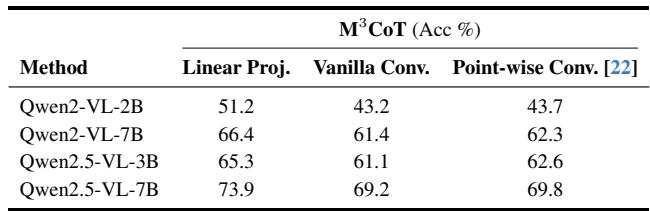
*Table 4.: Table 4. Performance comparison with different mapping networks of $\mathcal { F } _ { \mathrm { S R } }$ on four kinds of backbones.*

> 💡 **Table 4. 批读**: 表格要看不同任务/模态/模型规模下是否一致提升；医学场景尤其关注 per-modality 和失败案例。

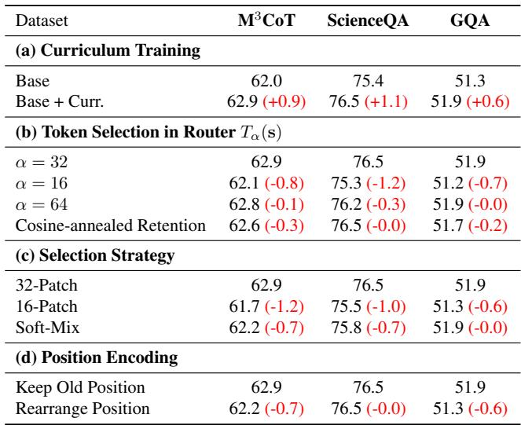
*Table extracted: Table extracted by MinerU. Dataset M3CoT ScienceQA GQA (a) Curriculum Training Base 62.0 75.4 51.3 Base + Curr. 62.9 (+0.9) 76.5 (+1.1) 51.9 (+0.6) (b) Token Selection in Router Tα(s) α = 32 62.9 76.5 51.9 α*

> 💡 **Table extracted 批读**: 表格要看不同任务/模态/模型规模下是否一致提升；医学场景尤其关注 per-modality 和失败案例。

Table 5. Ablation Experiments. We provide ablation analysis of key parameters and experimental settings on three benchmarks: $\mathbf { M } ^ { 3 } \mathbf { C o T }$ , ScienceQA, and GQA. All the variants adopt Qwen2.5- VL-3B as the base model. Base refers the model that adopts RDS module and SCF-VR module.

> 💡 **批注**: 这是实验证据：要同时看任务指标、鲁棒性、效率和消融。

Effect of Retention Parameter $\alpha$ . For the parameter $\alpha$ in $T _ { \alpha } ( \cdot )$ , we compare different retention strategies. As illustrated in Table 5, we evaluate fixed top- $\alpha$ settings with $\alpha \in \{ 1 6 , 3 2 , 6 4 \}$ and a cosine-annealed token retention schedule (CTR), which gradually reduces the token retention ratio layer by layer following a cosine schedule. Formally, for a model with $L$ layers, the retention ratio for the $l$ -th layer is,

> 💡 **批注**: 这是实验证据：要同时看任务指标、鲁棒性、效率和消融。

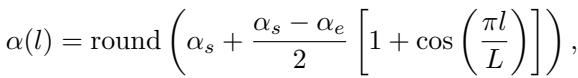
*Equation 15: Equation extracted by MinerU.*

> 💡 **Equation 15 批读**: 公式通常定义 latent update、memory transition、loss 或 routing；建议把符号对应到视觉证据、query、memory 和输出。

where $\alpha _ { s }$ and $\alpha _ { e }$ are two endpoints that enables flexible control over computational cost. As can be seen panel (b) in Table 5, results show that fixed top- $\alpha$ with $\alpha = 3 2$ achieves optimal performance, while cosine-annealed schedules yield consistently inferior results. We attribute this result to that: as visual tokens and latent hidden states are gradually appended to the token sequence, larger contextual scopes becomes essential for deeper token interaction. Consequently, strategies that progressively decrease the token retention ratio during depth scaling unavoidably limit these critical interactions, thereby hindering the model’s capacity to develop comprehensive contextual understanding.

> 💡 **批注**: 这里在讨论视觉证据是否被保留和利用；要问模型是否真的看图，而不是被语言先验带偏。

Visual Latents Formation. The Soft-Mix strategy aggregates 32 selected patches into a single visual latent token via weighted summation, guided by reweighted attention scores. In contrast, the 32-patch and 16-patch strategies directly utilize the top 32 and 16 patches with the highest attention scores as visual latents at each reasoning step, respectively. As summarized in Table 5, the 32-patch strategy yields superior performance. Notably, Soft-Mix achieves performance comparable to 16-patch while utilizing only a single compact representation. We attribute this performance to the expanded search scope provided by the 32-patch strategy, which offers the router a richer pool of visual tokens, thereby effectively raising the upper bound of depth scaling capabilities.

> 💡 **批注**: 这是记忆机制段落：重点区分“调用/读出 memory”和“形成/写入 memory”，以及 memory 是否动态变化。

# 4.4. In-depth Analysis

Impact of $\lambda$ . As shown in Figure 4, model performance exhibits high sensitivity to variations in the hyperparameter $\lambda$ Notably, larger models (e.g., 7B) achieve peak performance at $\lambda = 1 . 0$ , whereas the 2B model attains optimal results at a substantially lower value of $\lambda = 0 . 2$ . We attribute this divergence to distinct capacity across model scales: smaller models are primarily bottlenecked by visual perception capabilities, thus requiring larger degree of visual play to establish effective visual grounding for downstream reasoning. In contrast, larger models possess sufficient grounding capability, and they benefit from a more balanced allocation between visual and linguistic signals, avoiding over-reliance on visual features that could otherwise suppress the development of complex reasoning chains.

> 💡 **批注**: 这里在讨论视觉证据是否被保留和利用；要问模型是否真的看图，而不是被语言先验带偏。

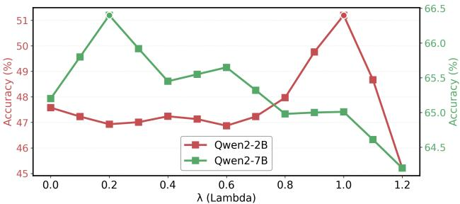
*Figure 4.: Figure 4. Sensitivity analysis of $\lambda$ .*

> 💡 **Figure 4. 批读**: 这张图通常展示框架、视觉案例或 latent/memory 流程。重点看视觉证据如何进入、保留或更新 latent memory。

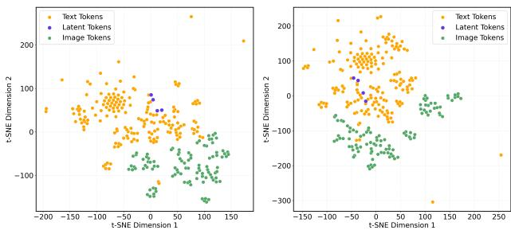
*Figure 5.: Figure 5. (a) and (b) illustrate the performance with different number of event prototypes and different ratio of filtered event prototypes, respectively.*

> 💡 **Figure 5. 批读**: 这张图通常展示框架、视觉案例或 latent/memory 流程。重点看视觉证据如何进入、保留或更新 latent memory。

Impact of different window size $W$ . As shown in Table 6, $W = 3$ achieves optimal performance. We reckon that smaller window sizes may fail to comprehensively cover salient visual regions, whereas larger window sizes, while providing broader contextual information, tend to introduce excessive visual noise.

> 💡 **批注**: 这是记忆机制段落：重点区分“调用/读出 memory”和“形成/写入 memory”，以及 memory 是否动态变化。

Latent Behavior Analysis. As depicted in Figure 5, we visualize the embedding space distribution of multimodal features for both the baseline and our method. The latent tokens learned by our approach form several distinct clusters, situated centrally within the text embedding manifold. Notably, compared to the baseline, our latents exhibit closer proximity to visual embeddings. This observation suggests that our latent tokens encapsulate richer reasoning semantics while facilitating deeper integration of visual information.

> 💡 **批注**: 这是记忆机制段落：重点区分“调用/读出 memory”和“形成/写入 memory”，以及 memory 是否动态变化。

Visualization of Crop Region. As illustrated in Figure 6, we visualize the attention-guided crops across successive reasoning steps. Taking the third case as a representative example, which queries the purpose of the train cart, the model initially localizes the region corresponding to the description “shape like a house” during the first reasoning step. In subsequent steps, the attention focus progressively shifts toward the “entrance door”. Remarkably, without any explicit fine-grained supervision, our curriculum training paradigm enables latent tokens to progressively capture logical dependencies and establish robust visual-semantic alignments.

> 💡 **批注**: 这里在讨论视觉证据是否被保留和利用；要问模型是否真的看图，而不是被语言先验带偏。

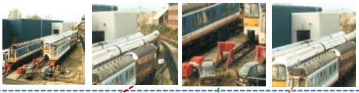
*Figure 0: Q: What can be inferred about the train cars in the picture?*

> 💡 **Figure 0 批读**: 这张图通常展示框架、视觉案例或 latent/memory 流程。重点看视觉证据如何进入、保留或更新 latent memory。

Q: What can be inferred about the train cars in the picture?

Step 1: First, we see the train tracks in the picture that lead to nowhere, implying that there is an obstruction or a diversion in the tracks. Step 2: Secondly, we see the train cars diverted off of the tracks, which suggests that they are no longer able to continue along their usual track route. Step 3: Yellow rust on the train suggests it hasn't been cleaned.

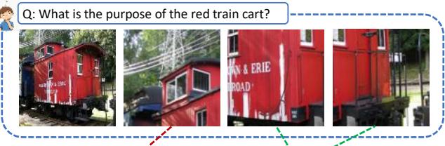
*Figure 0: Step 1: The red train cart shaped like a house suggests that it is providing living quarters. Step 2: The red door on the train suggests that it is an entrance door, further indicating that it is used for living quarters.*

> 💡 **Figure 0 批读**: 这张图通常展示框架、视觉案例或 latent/memory 流程。重点看视觉证据如何进入、保留或更新 latent memory。

Step 1: The red train cart shaped like a house suggests that it is providing living quarters. Step 2: The red door on the train suggests that it is an entrance door, further indicating that it is used for living quarters.

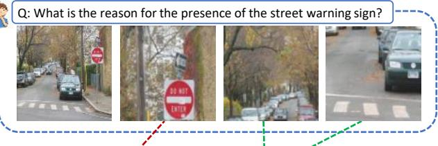
*Figure 6.: Step 1: The red and white sign that reads "do not enter" suggests that the street behind the sign is one way only. Step 2: The street warning sign indicates that cars are not allowed in but only exiting. Therefore, the most likely reason for the presence of the warning sign is that it is a oneway street. Figure 6. Visualization of cropped region in each latent reasoning step. Dotted line denotes the correspondence between reasoning rationales and cropped region.*

> 💡 **Figure 6. 批读**: 这张图通常展示框架、视觉案例或 latent/memory 流程。重点看视觉证据如何进入、保留或更新 latent memory。

Step 1: The red and white sign that reads "do not enter" suggests that the street behind the sign is one way only. Step 2: The street warning sign indicates that cars are not allowed in but only exiting. Therefore, the most likely reason for the presence of the warning sign is that it is a oneway street.   
Figure 6. Visualization of cropped region in each latent reasoning step. Dotted line denotes the correspondence between reasoning rationales and cropped region.

> 💡 **批注**: 这里的核心是 latent-space 计算：作者希望在连续表示中完成推理/记忆，而不是完全依赖显式文本链。

This empirically demonstrates the model’s capacity to jointly perform multi-step visual grounding and generate coherent reasoning chains.

> 💡 **批注**: 这里在讨论视觉证据是否被保留和利用；要问模型是否真的看图，而不是被语言先验带偏。

Impact of Position Encoding. Regarding positional encoding during depth scaling, we evaluate two strategies. The Keep Old Position variant preserves the original relative positional embeddings of the selected tokens. In contrast, the Rearrange Position variant sequentially re-indexes the selected tokens from 1 to $K$ according to the reduced sequence length. As demonstrated in Table 3, preserving the original positions yields superior performance. Although re-indexing may enhance local contextual modeling among salient tokens, it risks introducing positional inconsistencies with embeddings from preceding reasoning steps and discards inherent structural priors, ultimately leading to suboptimal results.

> 💡 **批注**: 这是跨模态 latent alignment：视觉特征必须进入 LLM 可用的语义空间。

Table 6. Performance comparison of different sub-grid window sizes on the $\mathbf { M } ^ { 3 } \mathbf { C o T }$ benchmark. We set $\lambda = 1 . 0$ for the 2B/3B models and $\lambda = 0 . 2$ for the 7B model. Here, $W$ denotes the subgrid window size, with $W = 1 0$ is the window size of extracted visual feature.

> 💡 **批注**: 这是实验证据：要同时看任务指标、鲁棒性、效率和消融。

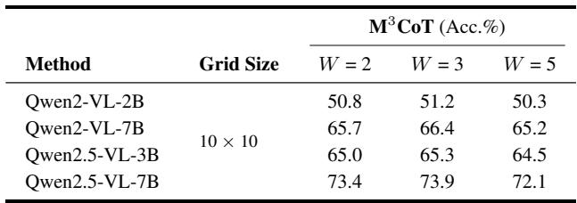
*Table 6.: Table 6. Performance comparison of different sub-grid window sizes on the $\mathbf { M } ^ { 3 } \mathbf { C o T }$ benchmark. We set $\lambda = 1 . 0$ for the 2B/3B models and $\lambda = 0 . 2$ for the 7B model. Here, $W$ denotes the subgrid window size, with $W = 1 0$ is the window size of extracted visual feature.*

> 💡 **Table 6. 批读**: 表格要看不同任务/模态/模型规模下是否一致提升；医学场景尤其关注 per-modality 和失败案例。

---

## 🔖 Section 总结

### 核心洞察
1. 检查 benchmark 是否覆盖医学/跨域/鲁棒性。
2. 关注消融、效率和失败案例。
