[← 返回 README](../README.md)

# 3. Method

## 📌 预览
本节是核心方法，重点看模块输入输出、训练目标、推理路径和与 baseline 的差异。

---

# 3.1. Preliminary: Implicit and Explicit Decoding

Given a multimodal input comprising a question $\mathcal { Q }$ and an image $\nu$ , we first tokenize them into a sequence of text embeddings $\mathbf { Q } = \{ \mathbf { q } _ { i } \} _ { i = 1 } ^ { N _ { q } }$ and visual features $\mathbf { V } = \{ \mathbf { v } _ { i } \} _ { i = 1 } ^ { N _ { v } }$ via a word embedding matrix $\mathbf { E } \in \mathbb { R } ^ { | \mathcal { W } | \times d }$ and a pretrained visual encoder, respectively, where $| \mathcal { W } |$ denotes the vocabulary size and $d$ is the hidden dimension. Subsequently, we employ an autoregressive MLLM $\mathcal { F } _ { \theta }$ to encode the concatenated input into an initial hidden state ${ \bf H } ^ { ( 0 ) } \in \mathbb { R } ^ { P \times d }$ , where $P = N _ { q } + N _ { v }$ represents the total number of tokens in the prefilling phase. During the decoding phase, we predetermine the number of implicit reasoning steps $T _ { r }$ and explicit answer tokens $T _ { a }$ . The generation process consists of two following distinct stages.

> 💡 **批注**: 这段是 one-step SR 主线：关注效率、保真-真实感权衡、扩散/flow 先验或单步生成路径。

Implicit Reasoning Phase. In the $t$ -th implicit reasoning step, the model generates a continuous latent representation $\mathbf { z } _ { t }$ conditioned on the original input sequence $\mathbf { X } = \left[ \mathbf { Q } \parallel \mathbf { V } \right]$ and all preceding latent states. This iterative process is formulated as:

> 💡 **批注**: 这段是 one-step SR 主线：关注效率、保真-真实感权衡、扩散/flow 先验或单步生成路径。

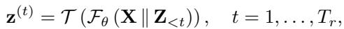
*Equation 1: Equation extracted by MinerU.*

> 💡 **Equation 1 批读**: 公式通常定义过程、loss 或更新规则；建议把符号对应到输入、模型、记忆/控制变量与输出。

where $\mathbf Z _ { < t } = \{ \mathbf z ^ { ( 1 ) } , \dots , \mathbf z ^ { ( t - 1 ) } \}$ denotes the sequence of latent tokens generated in previous steps, and $\tau ( \cdot )$ extracts the final vector representation from the model output (i.e., the hidden state corresponding to the last generated token). Unlike vanilla explicit reasoning, each step yields a informative continuous latent vector rather than a discrete token. The resulting latent sequence $\mathbf { Z } _ { 1 : T _ { r } } = \{ \mathbf { z } ^ { ( t ) } \} _ { t = 1 } ^ { T _ { r } }$ is concatenated to the context before transitioning to the explicit answer decoding phase.

> 💡 **批注**: 这段是 one-step SR 主线：关注效率、保真-真实感权衡、扩散/flow 先验或单步生成路径。

Explicit Answer Decoding. In the explicit phase, the model generates discrete answer tokens by sampling from the vocabulary distribution. The conditional probability of the $t$ -th answer token $a _ { t }$ is given by:

> 💡 **批注**: 这段是 one-step SR 主线：关注效率、保真-真实感权衡、扩散/flow 先验或单步生成路径。

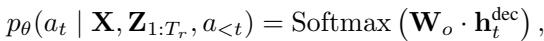
*Equation 2: Equation extracted by MinerU.*

> 💡 **Equation 2 批读**: 公式通常定义过程、loss 或更新规则；建议把符号对应到输入、模型、记忆/控制变量与输出。

where $\mathbf { h } _ { t } ^ { \mathrm { d e c } }$ is the decoder hidden state at step $t$ , and ${ \bf W } _ { o } \in $ $\mathbb { R } ^ { | \mathcal { W } | \times d }$ is the output projection matrix that maps hidden states to vocabulary logits.

> 💡 **批注**: 这段是 one-step SR 主线：关注效率、保真-真实感权衡、扩散/flow 先验或单步生成路径。

The likelihood of the complete answer sequence $\mathbf { a } _ { 1 : T _ { a } }$ is factorized as an autoregressive product:

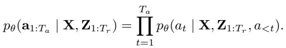
*Equation 3: Equation extracted by MinerU.*

> 💡 **Equation 3 批读**: 公式通常定义过程、loss 或更新规则；建议把符号对应到输入、模型、记忆/控制变量与输出。

Here, the full context input for the decoder is defined as $\mathbf { U } _ { t } = \left[ \mathbf { X } \parallel \mathbf { Z } _ { 1 : T _ { r } } \parallel \mathbf { a } _ { < t } \right]$ , where $\parallel$ denotes sequence concatenation along the token dimension.

> 💡 **批注**: 这段是 one-step SR 主线：关注效率、保真-真实感权衡、扩散/flow 先验或单步生成路径。

# 3.2. Spatially-Coherent Finer Visual Replay

As mentioned earlier, we empirically reveal the gradient disparities between visual and textual tokens throughout the learning dynamics. Specifically, visual tokens consistently exhibit substantially larger gradient norms and fluctuations compared to textual tokens, indicating that visual representations remain under-optimized despite their critical role in multimodal reasoning. Motivated by these insights, we introduce the visual replay module to reinforce the engagement of visual cues via salient region detection, while enhancing fine-grained spatially-coherent perception capabilities via self-distillation supervision at each reasoning step.

> 💡 **批注**: 这段是 latent memory / medical VLM 主线：关注视觉证据如何进入 latent space、如何被记忆/更新/调用，以及是否能支撑可靠诊断。

Attention-Guided Region Focus. Several works [33, 76] have demonstrated that LLMs exhibit fundamental visual grounding capabilities. To identify visually salient regions, we aggregate attention weights across all transformer layers and attention heads to obtain a consolidated spatial focus map. Specifically, given the $l$ -th layer and the $h$ -th attention head, we compute the mean attention map $\bar { \mathbf { A } } ^ { ( t ) }$ at reasoning step $t$ :

> 💡 **批注**: 这段是 latent memory / medical VLM 主线：关注视觉证据如何进入 latent space、如何被记忆/更新/调用，以及是否能支撑可靠诊断。

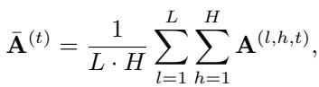
*Equation 4: Equation extracted by MinerU.*

> 💡 **Equation 4 批读**: 公式通常定义过程、loss 或更新规则；建议把符号对应到输入、模型、记忆/控制变量与输出。

where A(l,h,t) ∈ RP (t)×P (t) denotes the attention matrix for layer $l$ and head $h$ at iteration $t$ $\begin{array} { r } { 1 \leq t \leq T _ { r } } \end{array}$ ), with $P ^ { ( t ) }$ representing the number of input tokens at iteration $t$ . Here, $L$ and $H$ represent the total number of layers and heads, respectively. To obtain token-level attention scores, we extract the attention distribution from the most recently generated token to all preceding tokens via column-wise summation, i.e., a(t)all = colsum(A¯ (t)) ∈ RP (t) . Subsequently, we extract only the visual token attention scores from $\mathbf { a } _ { a l l } ^ { ( t ) }$ using the image mask, denoted as $\mathbf { a } ^ { ( t ) } \in \mathbb { R } ^ { N _ { v } }$ , where $N _ { v }$ is the number of visual tokens. This visual attention vector effectively captures which visual tokens are most relevant to the current reasoning context.

> 💡 **批注**: 这段是 latent memory / medical VLM 主线：关注视觉证据如何进入 latent space、如何被记忆/更新/调用，以及是否能支撑可靠诊断。

As visual focus evolves across reasoning steps, we iteratively select the top- $K$ attended visual tokens $\{ \mathbf { v } _ { i } ^ { ( t ) } \} _ { i = 1 } ^ { K }$ as visual latents, which are integrated with hidden states $\mathbf { z } _ { t }$ . To prevent redundant re-selection and promote diverse exploration, we maintain a visited token set V (t)visite d, ensuring comprehensive visual coverage:

> 💡 **批注**: 这段是 latent memory / medical VLM 主线：关注视觉证据如何进入 latent space、如何被记忆/更新/调用，以及是否能支撑可靠诊断。

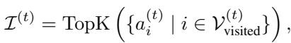
*Equation 5: Equation extracted by MinerU.*

> 💡 **Equation 5 批读**: 公式通常定义过程、loss 或更新规则；建议把符号对应到输入、模型、记忆/控制变量与输出。

where $\boldsymbol { \mathcal { T } ^ { ( t ) } }$ represents the indices of the $K$ visual tokens with the highest attention scores at step t, and V (t)visite d is updated after each selection. The original embeddings of the selected tokens $\mathbf { V } _ { \mathcal { T } ^ { ( t ) } } = \{ \mathbf { v } _ { i } \ | \ i \in \mathcal { T } ^ { ( t ) } \}$ are further weighted by normalized attention scores:

> 💡 **批注**: 这段是 latent memory / medical VLM 主线：关注视觉证据如何进入 latent space、如何被记忆/更新/调用，以及是否能支撑可靠诊断。

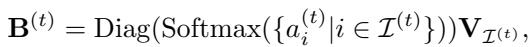
*Equation 6: Equation extracted by MinerU.*

> 💡 **Equation 6 批读**: 公式通常定义过程、loss 或更新规则；建议把符号对应到输入、模型、记忆/控制变量与输出。

where $\mathrm { D i a g ( \cdot ) }$ constructs a diagonal matrix from a vector.

Spatially-Coherent Regularization. Although leveraging learned attention within Transformers provides explainable visual locations, it often suffers from limited spatial continuity due to the scattered nature of selected tokens and introduces noise associated with the attention sink phenomenon [65]. To mitigate these issues and enhance finegrained perception without external annotations, we introduce self-distillation supervision. This mechanism involves cropping the visual regions exhibiting spatial coherence, reencoding them, and supervising the visual latents with these high-fidelity features.

> 💡 **批注**: 这段是 one-step SR 主线：关注效率、保真-真实感权衡、扩散/flow 先验或单步生成路径。

Specifically, we first search for a $W \times W$ sub-grid patch that maximizes the density of attended visual tokens. Formally, we find the optimal top-left corner $( r ^ { * } , c ^ { * } )$ within the valid grid bounds:

> 💡 **批注**: 这段是 latent memory / medical VLM 主线：关注视觉证据如何进入 latent space、如何被记忆/更新/调用，以及是否能支撑可靠诊断。

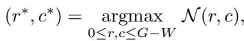
*Equation 7: Equation extracted by MinerU.*

> 💡 **Equation 7 批读**: 公式通常定义过程、loss 或更新规则；建议把符号对应到输入、模型、记忆/控制变量与输出。

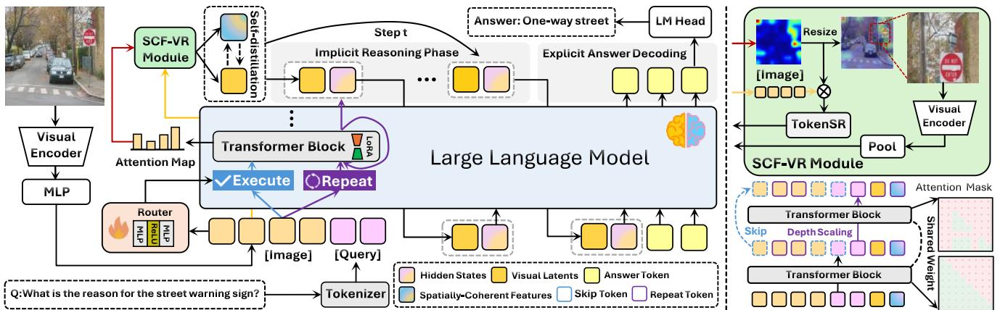
*Figure 2.: Figure 2. Left Panel: Schematic illustration of our framework. Input images are encoded into visual tokens by a pretrained visual encoder and projected into a text-centric semantic space aligned with the LLM, while questions are tokenized by the text tokenizer. Our method enhances a standard latent MLLM with two synergistic components during the implicit reasoning phase: (1) Spatially-Coherent Finer Visual Replay (SCF-VR): Attention-guided selection identifies salient visual regions at each implicit step, generating fine-grained visual latents enhanced by spatially-coherent constraints. (2) Routing Depth Scaling (RDS): A lightweight learnable router adaptively allocates additional reasoning steps for high-difficulty tokens or latents. Refined hidden states and visual latents are interleaved and propagated to subsequent reasoning steps. The overall objective is jointly optimized via standard cross-entropy loss and self-distillation loss. Right Panel: Detailed architecture of the SCF-VR module and token-wise depth scaling mechanism. TokenSR denotes the token super-resolution module, and Pool is the average pooling.*

> 💡 **Figure 2. 批读**: 这张图通常承担方法框架、动机或视觉对比作用；重点看它支撑的是机制、效果还是局限。

where the density function $\mathcal { N } ( r , c )$ counts the visited tokens falling within the window $\begin{array} { r } { \mathcal { N } ( r , c ) = \sum _ { i \in \mathcal { T } ^ { ( t ) } } \mathbb { I } \big [ r \leq r _ { i } < } \end{array}$ $r + W , c \leq c _ { i } < c + W \big ]$ . Here, $( r _ { i } , c _ { i } )$ denotes the rowcolumn position of token $i$ on the $G \times G$ grid, and $\mathbb { I } [ \cdot ]$ is the indicator function. This greedy selection ensures the cropped region captures a coherent visual context rather than scattered details. Then, the selected window is projected to pixel coordinates in the original image via mathematical transformation, cropped, and resized to the standard encoder input resolution using bilinear interpolation. We then reencode this refined patch through the same visual encoder to obtain fine-grained representations $\{ \mathbf { f } _ { i } \} _ { i = 1 } ^ { N _ { v } ^ { \prime } }$ . A global pooling operation $\operatorname { P o o l } ( { \mathord { \cdot } } )$ is applied to yield a robust reference token uref:

> 💡 **批注**: 这段是 one-step SR 主线：关注效率、保真-真实感权衡、扩散/flow 先验或单步生成路径。

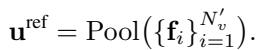
*Equation 8: Equation extracted by MinerU.*

> 💡 **Equation 8 批读**: 公式通常定义过程、loss 或更新规则；建议把符号对应到输入、模型、记忆/控制变量与输出。

Finally, we align the coarse-grained global token $\mathbf { b } ^ { ( t ) } =$ $\mathrm { P o o l } ( \mathbf { B } ^ { ( t ) } )$ with this high-fidelity reference using a lightweight token super-resolution module $\mathcal { F } _ { \mathrm { S R } } : \mathbb { R } ^ { D } \to \mathbb { R } ^ { D }$ We minimize the reconstruction error as follows:

> 💡 **批注**: 这段是 one-step SR 主线：关注效率、保真-真实感权衡、扩散/flow 先验或单步生成路径。

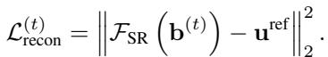
*Equation 9: Equation extracted by MinerU.*

> 💡 **Equation 9 批读**: 公式通常定义过程、loss 或更新规则；建议把符号对应到输入、模型、记忆/控制变量与输出。

This supervisory signal enables the model to prioritize spatially coherent and semantically intact visual contexts during latent generation through self-distillation.

> 💡 **批注**: 这段是 one-step SR 主线：关注效率、保真-真实感权衡、扩散/flow 先验或单步生成路径。

visual latents, existing methods typically allocate uniform computational budgets across all tokens during contextual refinement. Our empirical analysis reveals a fixed-depth optimization dilemma, demonstrating that token representations exhibit heterogeneous optimization complexities during latent training, which necessitates adaptive reasoning depths. To address this limitation without modifying the pretrained VLM architecture, while effectively leveraging its inherent knowledge, we introduce a lightweight router that dynamically allocates additional reasoning steps exclusively to critical tokens at each iteration. Router Network. Let the input token sequence at the $t { \cdot }$ -th reasoning step be denoted as ${ \bf U } ^ { ( t ) } = [ { \bf X } \| { \bf B } ^ { ( 1 ) } \| { \bf z } ^ { ( 1 ) } \| \cdot \cdot \cdot \| { \bf B } ^ { ( t ) } \| { \bf z } ^ { ( t ) } ] \in \mathbb { R } ^ { P ^ { ( t ) } \times d }$ , where $P ^ { ( t ) }$ represents the total sequence length and $d$ is the hidden dimension. To facilitate the illustration of our depth scaling mechanism, we decompose the forward pass into layer-wise computations. Specifically, within the $l$ -th transformer layer, we first compute the intermediate feature $\mathbf { H } ^ { ( l , t ) } = f ( \mathbf { U } ^ { ( t ) } ) \in \mathbb { R } ^ { P ^ { ( t ) } \times d }$ , where $f ( \cdot )$ denotes the transformation of the $l$ -th transformer layer in LLM. Subsequently, a lightweight router network computes a scalar importance score for each token based on its corresponding hidden representation:

> 💡 **批注**: 这段信息较密，建议拆成“问题/设定 → 方法/机制 → 结果/影响”三层读。

While the visual replay mechanism significantly enhances fine-grained grounding by introducing spatially-coherent

> 💡 **批注**: 这段是 latent memory / medical VLM 主线：关注视觉证据如何进入 latent space、如何被记忆/更新/调用，以及是否能支撑可靠诊断。

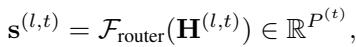
*Equation 10: Equation extracted by MinerU.*

> 💡 **Equation 10 批读**: 公式通常定义过程、loss 或更新规则；建议把符号对应到输入、模型、记忆/控制变量与输出。

# 3.3. Routing Depth Scaling

where the $i$ -th element $s _ { i } ^ { ( l , t ) }$ quantifies the importance of the i-th token in the l-th layer, and F (l)route $\mathcal { F } _ { \mathrm { r o u t e r } } ^ { ( l ) } ( \cdot )$ denotes the independent router network in the $l$ -th layer. We define $T _ { \alpha } ( \mathbf { s } ^ { ( l , t ) } )$

as the index set of the top- $\alpha$ tokens with the highest scores, where $\alpha$ serves as a predefined hyper-parameter. In practice, $\alpha$ can be formulated as a layer-dependent function $\alpha ( l )$ to enable adaptive resource allocation at different layers.

> 💡 **批注**: 这是实验证据段：同时看主指标、消融、效率和案例，判断 claim 是否被支撑。

Depth Scaling Computation. Obtaining the router weight, we select the top- $\alpha$ tokens for depth scaling, i.e., repeat iteration in one transformer block. For a given depth scaling step $d \in \{ 1 , \ldots , D \}$ , the token-wise representation update rule within a transformer layer can be generally formulated as follows:

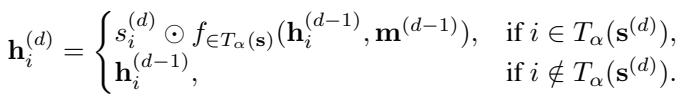
*Equation 11: Equation extracted by MinerU.*

> 💡 **Equation 11 批读**: 公式通常定义过程、loss 或更新规则；建议把符号对应到输入、模型、记忆/控制变量与输出。

For notational brevity, we omit the layer index $l$ and reasoning step $t$ in the following formulation, where $d$ denotes the refinement depth. For instance, the score vector $\mathbf { s } ^ { ( l , t ) }$ is simplified to $\mathbf { s } ^ { ( d ) }$ . The function $f _ { i \in T _ { \alpha } ( \mathbf { s } ^ { ( d ) } ) } ( \cdot )$ indicates that the attention operation is restricted to the token subset $T _ { \alpha } ( \mathbf { s } ^ { ( d ) } )$ Here, ${ \bf h } _ { i } ^ { ( 0 ) }$ represents the initial hidden state of the $i$ -th token after the first forward pass, and m(d) ∈ RP (t)×P (t) denotes the attention mask corresponding to refinement step $d$ . The condition $i \in T _ { \alpha } ( \mathbf { s } ^ { ( d ) } )$ functions as a binary gating mechanism, ensuring that only tokens with importance scores exceeding the threshold undergo additional computation.

> 💡 **批注**: 这段信息较密，建议拆成“问题/设定 → 方法/机制 → 结果/影响”三层读。

The router network dynamically determines whether to apply depth scaling based on the current contextual representations in a data-driven manner. Tokens identified as critical are iteratively processed through the transformation function for $d$ additional refinement steps, while non-critical tokens retain their prior representations to preserve computational efficiency. Finally, we aggregate the depth-wise refined representation with step-aware positional encoding to form the final hidden state incrementally:

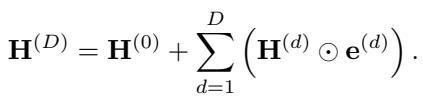
*Equation 12: Equation extracted by MinerU.*

> 💡 **Equation 12 批读**: 公式通常定义过程、loss 或更新规则；建议把符号对应到输入、模型、记忆/控制变量与输出。

This adaptive scaling strategy effectively allocates deeper reasoning pathways to critical tokens, enabling the model to capture complex visual contexts and facilitate more profound reasoning capabilities.

> 💡 **批注**: 这段是 one-step SR 主线：关注效率、保真-真实感权衡、扩散/flow 先验或单步生成路径。

# 3.4. Training Procedure

Curriculum Latent Training. To mitigate annotation overhead and avoid the risk of human priors constraining model learning, we depart from prior approaches that rely on intermediate supervision for latent representations. Instead, we design a curriculum that facilitates the contextual and logical dependencies between implicit latents and explicit reasoning chains. In the initial stage, the model is trained with standard Chain-of-Thought (CoT) supervision, generating all reasoning steps explicitly to establish foundational reasoning capabilities. Subsequently, as training progresses, latent tokens are incrementally introduced. Specifically, one explicit reasoning step is progressively encapsulated into an informative ⟨latent⟩ token. Through this curriculum, each latent token progressively learns to ground the relevant contextual cues, effectively internalizing explicit reasoning chains into compact latent representations.

> 💡 **批注**: 这段是 one-step SR 主线：关注效率、保真-真实感权衡、扩散/flow 先验或单步生成路径。

Training Objective. The overall training objective combines the standard language modeling loss with the self-distillation loss in the VR-SCF module,

> 💡 **批注**: 这段是 one-step SR 主线：关注效率、保真-真实感权衡、扩散/flow 先验或单步生成路径。

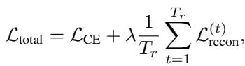
*Equation 13: Equation extracted by MinerU.*

> 💡 **Equation 13 批读**: 公式通常定义过程、loss 或更新规则；建议把符号对应到输入、模型、记忆/控制变量与输出。

where $\mathcal { L } _ { \mathrm { C E } }$ is the standard cross-entropy loss over the language modeling task,

> 💡 **批注**: 这段是 one-step SR 主线：关注效率、保真-真实感权衡、扩散/flow 先验或单步生成路径。

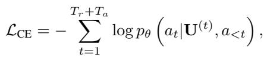
*Equation 14: Equation extracted by MinerU.*

> 💡 **Equation 14 批读**: 公式通常定义过程、loss 或更新规则；建议把符号对应到输入、模型、记忆/控制变量与输出。

where $\lambda$ is a hyperparameter balancing the primary task and the auxiliary reconstruction objective. During inference, only the LLM component is active, and the visual play module is disabled, ensuring no additional computational overhead at test time.

> 💡 **批注**: 这是实验证据段：同时看主指标、消融、效率和案例，判断 claim 是否被支撑。

---

## 🔖 Section 总结

### 核心洞察
1. 本节对应论文原始大分节，原文已完整保留。
2. 阅读重点是把本节的机制/证据映射到论文主 claim。
3. 后续如有疑问，可在本 section 继续补充更细批注。
