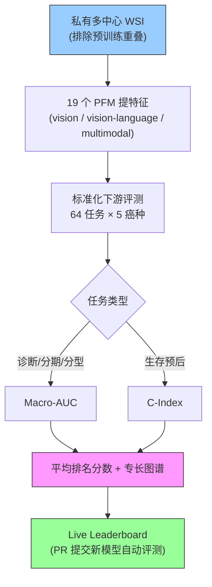

# PathBench: A Comprehensive Comparison Benchmark for Pathology Foundation Models towards Precision Oncology

**作者**: Jiabo Ma, Yingxue Xu, Fengtao Zhou, ..., Hao Chen（HKUST 等，与 LitePath 同组）
**会议/期刊**: arXiv 2025 (2505.20202) | **年份**: 2025
**链接**: [arXiv](https://arxiv.org/abs/2505.20202) · [Code/Leaderboard](https://github.com/birkhoffkiki/PathBench) · [Showcase](https://smartx.cse.ust.hk/showcase/PathBench/)

## 一句话总结

首个**防泄漏、全私有、全临床谱系**的病理基础模型（PFM）评测基准：19 个 PFM × 64 任务 × 5 癌种、15,888 WSI / 8,549 患者 / 10 医院，配自动 live leaderboard。核心结论——**Virchow2 与 H-Optimus-1 综合最优、视觉 FM 优于视觉-语言 FM、无单一模型通吃**（最优 FM 随任务/器官剧变）。

## 核心贡献

1. **防泄漏评测**：全私有多中心数据，严格排除任何被评 PFM 预训练用过的数据 → 杜绝数据污染致的虚高（现有公开 benchmark 常有隐蔽重叠）。
2. **全临床谱系覆盖**：64+ 任务跨诊断/分期/分子分型/biomarker/生存，5 癌种（肺/乳腺/胃/结直肠/脑），内部+外部+前瞻 cohort。
3. **活体 leaderboard**：自动化评测管线，社区可 PR 提交新模型/数据，持续更新排名。
4. **权威 FM 排名 + 专长图谱**：Virchow2 (5.0) / H-Optimus-1 (5.9) 综合最优；任务分层（组织学/分子/预后各有最优 FM）。

## 📖 批读导航

| Section | 内容 |
|---------|------|
| [00 - Abstract](sections/00-abstract.md) | 摘要 + 三顽疾 + 对 ReadySlide cross-FM 的价值 |
| [01 - Introduction](sections/01-introduction.md) | 三障碍→三对策、现有 benchmark 局限、生态定位 |
| [02 - Results & Discussion](sections/02-results.md) | 总排名 + 任务/器官分层、肺/乳腺细节、"无普适赢家"元结论、防泄漏 |

## 关键数字

| 指标 | 数值 |
|------|------|
| 规模 | 19 PFM × 64 任务 × 5 癌种；15,888 WSI / 8,549 患者 / 10 医院 |
| 癌种任务分布 | 肺 10 / 乳腺 12 / 胃 31 / 结直肠 8 / 脑 3 |
| 总排名 Top5 | Virchow2 (5.0) > H-Optimus-1 (5.9) > H-Optimus-0 (6.6) > UNI2 (7.1) > mSTAR (7.4) |
| 任务专长 | 组织学分型: Virchow2/H-Optimus-1；分子分型: H-Optimus 系；生存: UNI2/CONCH1.5 |
| 器官专长 | 肺/结直肠: H-Optimus-1；乳腺/脑/胃: Virchow2 |
| 难任务 | C-MET AUC 0.736、pTNM 0.614（vs TTF-1 0.996）——任务难度差异巨大 |
| 数据 | 全私有，严格排除预训练重叠（防泄漏） |

## 数据流：输入 → 中间表示 → 输出

## 优缺点与还能做什么

### 优点
- **防泄漏**：全私有数据 + 排除预训练重叠，FM 排名可信（相对公开 benchmark 的关键改进）。
- **覆盖全**：64 任务 × 5 癌种 × 全临床谱系（含常被忽略的预后/多模态）。
- **可持续**：live leaderboard + 自动评测，随新 FM 更新。
- **专长图谱**：不只给单一排名，而是"哪个 FM 在哪类任务/器官最优"。

### 局限 / 风险
- **是裁判非选手**：不提供方法创新。
- **私有数据不公开**：可复现性靠 leaderboard 提交而非开放数据。
- **未含去混杂评估**：主要分类/生存，未做 [Confounders](../%5BNat%20Biomed%20Eng%202026%5D%20Confounders-Biomarker-Prediction/) 式的分层去混杂（AUC 高≠学到生物学）。

### 还能做什么（对本课题 ReadySlide）
- **选 substrate 的依据**：Virchow2/H-Optimus-1 是当前最强通用 FM，UNI2 预后强——ReadySlide 该对标这些、并在互补 FM 间验证 cross-FM transfer。
- **防泄漏协议**：cross-FM/cross-center transfer 实验应采用 PathBench 的排除预训练重叠原则。
- **多任务 + 难度分层评估**：压缩方法应在 64 任务式的多样性上验证，重点看难任务（C-MET/分期/生存）——易任务对压缩不敏感。
- **补去混杂**：结合 Confounders 协议，把 PathBench 的 AUC 排名升级为"去混杂后的排名"。

## 阅读 Q&A 记录

- **Q: PathBench 相对现有 PFM benchmark 的关键改进？**
  A: 防泄漏——全私有多中心数据，严格排除任何被评 PFM 预训练用过的。现有 benchmark 多用公开数据、有隐蔽重叠致虚高。加上全临床谱系（含预后）+ live leaderboard。

- **Q: 哪个 PFM 最好？**
  A: 综合 Virchow2 (5.0) > H-Optimus-1 (5.9)。但**无普适赢家**——组织学分型 Virchow2/H-Optimus-1，分子分型 H-Optimus 系，生存 UNI2/CONCH1.5；器官间也变。选 FM 要看具体任务。

- **Q: 视觉-语言 FM 更强吗？**
  A: 否。临床任务上**视觉 FM（Virchow2/H-Optimus-1）仍优于视觉-语言 FM**——语言对齐在细粒度临床预测上没帮上忙（与 EAGLE 里 GPT-4o 惨败呼应）。

- **Q: 对 ReadySlide 最大用途？**
  A: (1) 权威 FM 排名与专长图谱 → 选 substrate（Virchow2/H-Optimus-1）与验证用的互补 FM；(2) 防泄漏协议 → cross-FM transfer 验证标准；(3) 64 任务 + 难度分层 → 压缩的多任务评估设计。

## 📊 Citation Landscape

> Semantic Scholar 采集限流，据论文自身与关联工作整理。

**被评测 / 相关 FM**
- Virchow2、H-Optimus-1/0、UNI/UNI2、CONCH/CONCH1.5、GPFM、mSTAR、MUSK、Phikon/Phikon2、CHIEF、Prov-GigaPath、Hibou-L、PLIP、CTransPath、ResNet50 等 19 个。

**同组 / 同主题**
- [LitePath](../%5BArxiv%202026%5D%20Deployment-Friendly-CPath/)（同组，基于 PathBench "小模型可行"选型 + 蒸馏 teacher）。
- [EAGLE](../%5BNat%20Commun%202026%5D%20DL-Efficient-Pathology/)（同类 benchmark 框架 + CHIEF/Virchow2）。
- [Confounders](../%5BNat%20Biomed%20Eng%202026%5D%20Confounders-Biomarker-Prediction/)（互补：PathBench 防泄漏、Confounders 防混杂）。

**方法背景**
- DINOv2 / iBOT / MIM——PFM 自监督预训练范式；vision-language 对比学习（CLIP 式）——多模态 FM 基础。
