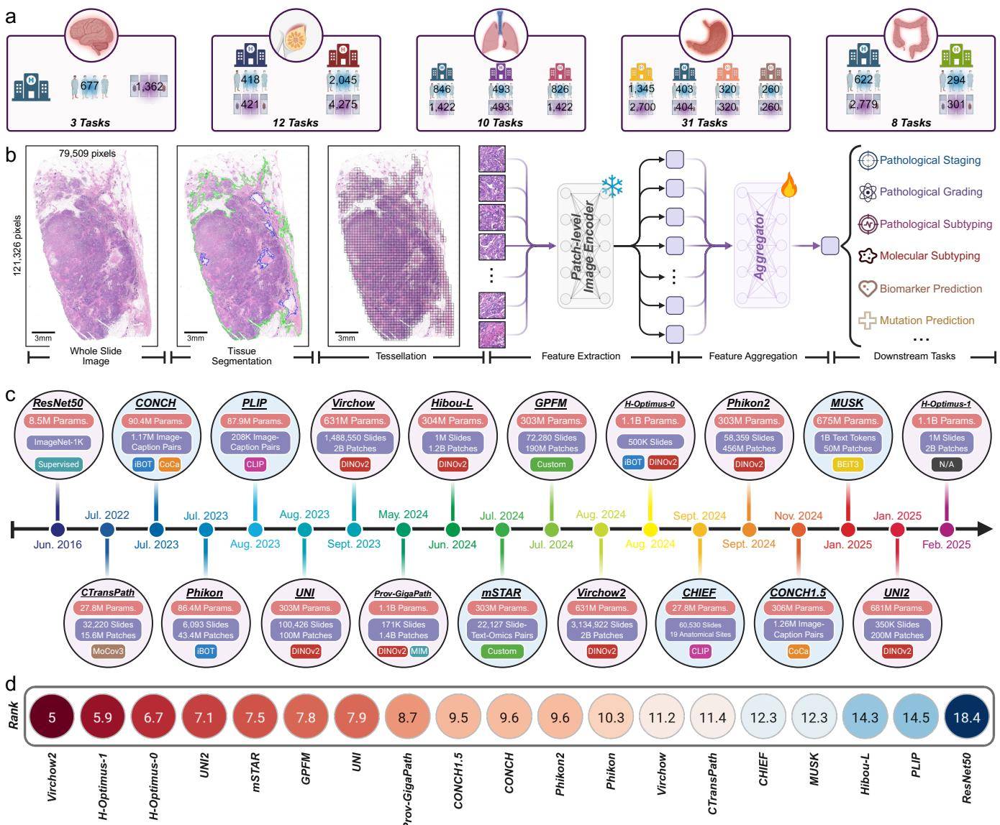
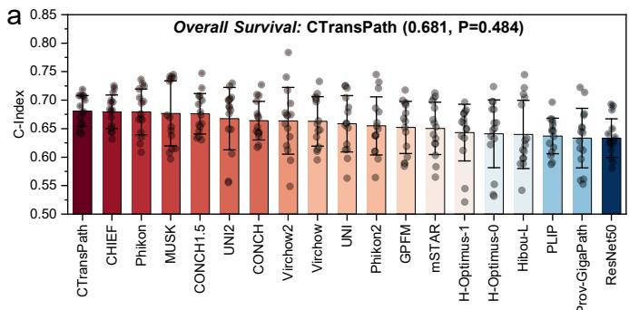

[← 返回 README](../README.md)

# Results & Discussion 结果与讨论

## 📌 预览

19 PFM × 64 任务 × 5 癌种（肺 10 / 乳腺 12 / 胃 31 / 结直肠 8 / 脑 3），含诊断/分期/分子分型/biomarker/生存。总排名：**Virchow2 (5.0) > H-Optimus-1 (5.9) > H-Optimus-0 (6.6) > UNI2 (7.1) > mSTAR (7.4)**。任务分层：Virchow2/H-Optimus-1 强于组织学分型；H-Optimus 系强于分子分型；UNI2/CONCH1.5 强于生存预后。器官分层：H-Optimus-1 强于肺/结直肠，Virchow2 强于乳腺/脑/胃。**视觉 FM > 视觉-语言 FM**（临床任务）；**无单一模型通吃**。

---

## Results

We evaluated 19 PFMs (vision-only, vision-language, multimodal-enhanced) on 64 tasks across five cancer types: lung (10), breast (12), gastric (31), colorectal (8), brain (3). For each cancer type, we conducted experiments on diagnosis, staging, molecular subtyping, biomarker prediction, and survival analysis, using both internal validation and external cohorts. Among 64 tasks, **Virchow2, H-optimus-1, H-optimus-0, UNI2, and mSTAR achieved Top-5** performance, with rank scores of 5.0, 5.9, 6.6, 7.1, and 7.4. Virchow2 and H-optimus-1 achieved Top-2 in histological subtyping; H-optimus-0 and H-optimus-1 excelled in molecular subtyping; UNI2 and CONCH1.5 best in survival prognosis. By organ: H-optimus-1 first in lung and colorectal, Virchow2 best in breast, brain, and gastric. **Overall, vision foundation models (Virchow2, H-Optimus-1) are still more effective than vision-language models for clinical-level tasks.**

*Figure 1: PathBench 工作流与总体结果。a. benchmark 数据；b. FM 评测流程；c. 被评测的 FM；d. 平均排名分数；e. 病理诊断/分子诊断/预后三类任务的平均性能。*

> 💡 **Figure 1 批读**（FM 排名地图 = ReadySlide 选 substrate 的依据）（Hao 批注）：核心排名 **Virchow2 (5.0) 居首、H-Optimus-1 (5.9) 次之**。但关键洞察是**任务分层的"专长图谱"**：
> - **组织学分型**：Virchow2 / H-Optimus-1；
> - **分子分型**：H-Optimus 系；
> - **生存预后**：UNI2 / CONCH1.5。
>
> 这解释了为什么 [LitePath](../%5BArxiv%202026%5D%20Deployment-Friendly-CPath/) 选 Virchow2 + H-Optimus-1 + UNI2 三个作蒸馏 teacher——**它们专长互补**（组织学/分子/预后）。对 ReadySlide cross-FM transfer：这张图告诉你"该在哪些 FM 之间验证迁移"（Virchow2 强 substrate、UNI2 预后强），且"任务类型决定最优 FM"——压缩方法的 FM-agnostic 声明需跨这些不同专长的 FM 验证。

## Lung Cancer

On 10 lung tasks (primary vs metastatic, primary site, molecular subtyping), H-optimus-1 achieved highest average ranking (2.5), followed by Virchow2 (4.2). For metastatic classification, all PFMs ~0.97 AUC (Virchow2 0.9865). H-optimus series best on 3/4 molecular subtyping (CK7, C-MET, NapsinA). C-MET was hardest (best AUC only 0.7362). TTF-1 easiest (UNI2 0.996).

## Breast Cancer

12 tasks (2,463 patients, 4,696 WSIs, molecular/subtype classification, survival). Virchow2 best overall (avg rank 5.9), UNI next (6.3). **No single method consistently outperformed** across five molecular subtyping tasks (AR/ER/PR/HER2/CK5 — best models GPFM/H-Optimus-1/MUSK/H-Optimus-0/UNI2 respectively). TNM staging remains challenging (pTNM best AUC only 0.6142). Survival: CTransPath (OS C-Index 0.6809), UNI2 (DFS 0.6697).

*Figure 3: 乳腺癌数据上各 FM 的结果。a. 总生存分析；b. 无病生存分析；c. 分子分型；d. TNM N 分期预测。*

> 💡 **结果批读**（"无单一模型通吃" = 最重要的元结论）（Hao 批注）：乳腺癌五个分子分型任务，**五个不同的模型各拿一个第一**（GPFM/H-Optimus-1/MUSK/H-Optimus-0/UNI2）——这是 PathBench 最有分量的发现：**PFM 没有普适赢家，最优模型随任务/器官剧烈变化**。含义：
> - **对临床**：选 FM 要看具体任务，不能盲信"最强 FM"。
> - **对 ReadySlide**：压缩方法若声称 FM-agnostic，必须在多个 FM 上验证（因为不同 FM 特征分布差异大）；且**任务难度差异巨大**（TTF-1 AUC 0.996 vs C-MET 0.736、pTNM 0.614）——压缩对易任务和难任务的影响可能完全不同（呼应 memory 里"importance→retention 任务分层"）。
> - **难任务**（分期、C-MET、生存）普遍 AUC 低 → 这些是压缩最可能伤害、也最该重点验证的任务。

## Discussion & Conclusion

PathBench provides the first comprehensive, leakage-free benchmark for PFMs, evaluating 19 models on 64 tasks across 5 cancer types with fully private multi-center data. Key findings: Virchow2 and H-Optimus-1 are most effective overall; vision FMs outperform vision-language FMs on clinical tasks; no single model dominates all tasks/organs. The live leaderboard supports continuous community contribution via automated evaluation.

> 💡 **元结论 + 局限 + 对本主题的价值**（Hao 批注）：
> - **三个可复用元结论**：(1) **Virchow2/H-Optimus-1 是当前最强通用 substrate**（ReadySlide 该对标）；(2) **视觉 FM > 视觉-语言 FM**（临床任务上语言对齐没帮上忙，甚至拖累——与 [EAGLE](../%5BNat%20Commun%202026%5D%20DL-Efficient-Pathology/) 里 GPT-4o 惨败呼应）；(3) **无普适赢家**（选 FM 看任务）。
> - **防泄漏方法论**是核心贡献——全私有数据、排除预训练重叠。这是评估任何 WSI 模型（含压缩方法）的黄金标准，与 [Confounders](../%5BNat%20Biomed%20Eng%202026%5D%20Confounders-Biomarker-Prediction/) 互补（一个防泄漏、一个防混杂）。
> - **局限**：benchmark 本身不提供方法创新，是"裁判"而非"选手"；私有数据不公开（可复现性靠 leaderboard 提交而非开放数据）；主要是分类/生存任务，未覆盖 [Confounders](../%5BNat%20Biomed%20Eng%202026%5D%20Confounders-Biomarker-Prediction/) 式的分层去混杂评估。
> - **对 ReadySlide 的直接用途**：(1) 选强 substrate（Virchow2/H-Optimus-1）与互补 FM（UNI2 预后）；(2) 借鉴防泄漏协议做 cross-FM transfer 验证；(3) 用 64 任务的多样性 + 任务难度分层来设计压缩的多任务评估。
