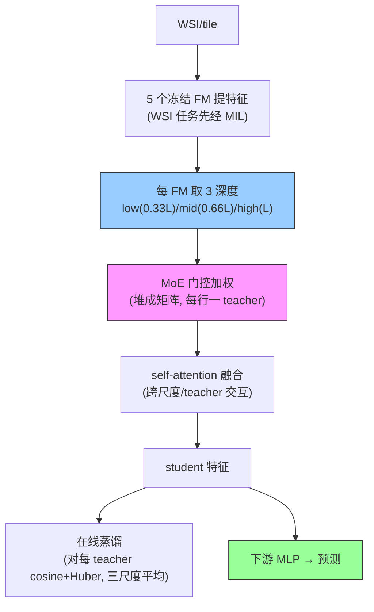

# Shazam: Unified Integration of Pathology Foundation Models for Scalable Histopathology Analysis

**作者**: Wenhui Lei, Yusheng Tan, Anqi Li, ..., Hanyu Chen, Xiaofan Zhang, Shaoting Zhang（上海交大 / WashU / 上海 AI Lab / SenseTime）
**会议/期刊**: arXiv 2025（2503.00736） | **年份**: 2025
**链接**: [arXiv](https://arxiv.org/abs/2503.00736) · [Code](https://github.com/Tuner12/Shazam)

## 一句话总结

**多个病理基础模型的在线自适应融合**：用轻量 MoE 在线、任务特定地融合 5 个冻结 FM（UNI2/Virchow2/H-optimus-1/Prov-GigaPath/Phikon-v2）的**多层（low/mid/high）特征** + 自适应专家加权 + 在线蒸馏，无需离线蒸馏或重训。30 benchmark 平均排名 1.17（次优 3.20）。**是 CKMIL "多层 FM 表示" 主线的最近竞争工作**——已占据"多层病理表示互补 + 任务自适应融合" novelty。

## 核心贡献

1. **在线 vs 离线**：相对 GPFM（离线蒸馏、需专用数据、加新 FM 重训），Shazam 在线任务特定融合，加新 FM 无需重训。
2. **多层多 teacher 融合**：5 FM × 3 深度（0.33L/0.66L/L）→ MoE 加权（堆成矩阵）→ self-attention 融合 → 多尺度多 teacher 在线蒸馏（cosine + Huber）。
3. **全面 SOTA**：4 类任务 30 benchmark，26/30 第一，超所有单 FM。

## 📖 批读导航

| Section | 内容 |
|---------|------|
| [00 - Abstract & Introduction](sections/00-abstract-intro.md) | 摘要+引言、online vs offline、对 CKMIL 的关键定位 |
| [01 - Method](sections/01-method.md) | 多尺度提取(0.33/0.66/1.0L)、MoE 加权、self-attention 融合、在线蒸馏 |
| [02 - Results & Discussion](sections/02-results-conclusion.md) | 30 benchmark、Fig.5 消融（多层 vs MoE 贡献）、CKMIL novelty 边界 |

## 关键数字

| 指标 | 数值 |
|------|------|
| FM | 5 个：UNI2/Virchow2/H-optimus-1/Prov-GigaPath/Phikon-v2 |
| 层 | 3 深度：$\lfloor 0.33L\rfloor$/$\lfloor 0.66L\rfloor$/$L$ |
| 任务 | 30 benchmark（空间转录组 8 + 生存 10 + tile 分类 11 + VQA） |
| 总体 | 平均排名 1.17（26/30 第一）；次优 Virchow2 3.20 |
| 空间转录组 | +0.08-0.17 PCC over 最强单 FM |
| **多层消融** | 单层 0.680-0.689 → 三层 0.710（+0.030） |
| MoE 消融 | +0.002~0.005（增益小、数据依赖） |

## 数据流：输入 → 中间表示 → 输出

## 优缺点与还能做什么

### 优点
- **在线可扩展**：加新 FM 无需重训，持续受益于 FM 进展。
- **多层多 FM 融合**：证明 low/mid/high 三层互补（+0.030），器官/任务自适应。
- **全面 SOTA**：30 任务 26 第一，跨分子/区域/slide 级。

### 局限 / 风险
- **需多个 FM**：5 FM 集成，算力/存储大；增益部分来自"多 FM"天然优势（消融未完全拆开多 FM vs 多层）。
- **固定三层**（0.33/0.66/1.0），非自适应选层——留给 CKMIL 的空间。
- **MoE 增益小**（+0.002~0.005）：自适应加权贡献有限，主要靠多层+多 teacher。
- **未做去混杂**：多层/多 FM 融合是否放大 shortcut 未验（与 Confounders 呼应）。

### 还能做什么（对本课题 CKMIL/ReadySlide）
- **⚠️ novelty 边界**：Shazam 已证明"多层病理表示互补"——CKMIL **不能把这个当核心 novelty**。差异化必须落在"**单 FM + 条件式 depth SELECTION**"（选层 vs 全融）。
- **单 FM 多层 vs 多 FM 多层**：CKMIL 单 FM 内的深度选择能否复现 Shazam 多 FM 多层的增益？这是可验证的关键问题。
- **自适应选层 vs 固定三层**：CKMIL 的 slide/task 条件选层能否超过 Shazam 固定 0.33/0.66/1.0 全取？
- **作扩展实验 baseline**：单独运行原生 multi-FM/multi-level setting，不强制与其他 8 个单 [N,D] 方法同协议。

## 阅读 Q&A 记录

- **Q: Shazam 和 CKMIL 目标方向本质区别？**
  A: Shazam = 多 FM（5 个）+ 固定三层全融合（dense）+ MoE 加权 + 在线蒸馏；CKMIL 目标 = 单 FM + 条件式 depth selection（sparse）+ MIL。关键差异："多 FM 全融" vs "单 FM 选层"。

- **Q: 为什么 CKMIL 不能把"多层有用"当 novelty？**
  A: Shazam 消融（Fig.5b）已证明 low/mid/high 三层融合 > 单层（+0.030）。CKMIL 需把"如何选层、为何选优于全取"当核心，而非"多层有用"本身。

- **Q: Shazam 能作标准单 [N,D] baseline 吗？**
  A: 不能。它需多 FM、多层、MoE 融合，输入协议不同。作"新颖性最近邻 + 扩展实验 baseline"，单独运行原生 setting。

- **Q: 多层增益里多少来自多 FM、多少来自多层？**
  A: 论文未完全拆开——Shazam 用 5 FM，增益含"多 FM 集成"天然优势。这正是 CKMIL 该验证的：单 FM 多层能否复现类似增益。

## 📊 Citation Landscape

> Semantic Scholar 采集限流，据论文自身引用整理。

**同主题最相关**
- GPFM（离线蒸馏融合 FM）——Shazam 的主要对照；[PathBench](../%5BArxiv%202025%5D%20PathBench/)——"无普适赢家"的动机来源。
- 融合的 5 FM：UNI2 / Virchow2 / H-optimus-1 / Prov-GigaPath / Phikon-v2。
- [MAMMOTH](../%5BICLR%202026%5D%20MAMMOTH/)/[PAMoE](../%5BCVPR%202025%5D%20PAMoE/)——同用 MoE，但 MAMMOTH 做单 FM 特征变换、PAMoE 做组织路由、Shazam 做多 FM 多层融合。

**方法来源**
- Mixture-of-Experts；知识蒸馏（cosine + Huber）；HEST-1k（空间转录组 benchmark）；ABMIL（WSI 任务的 MIL 模块）。
