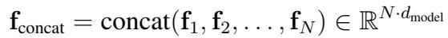
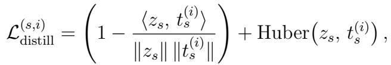
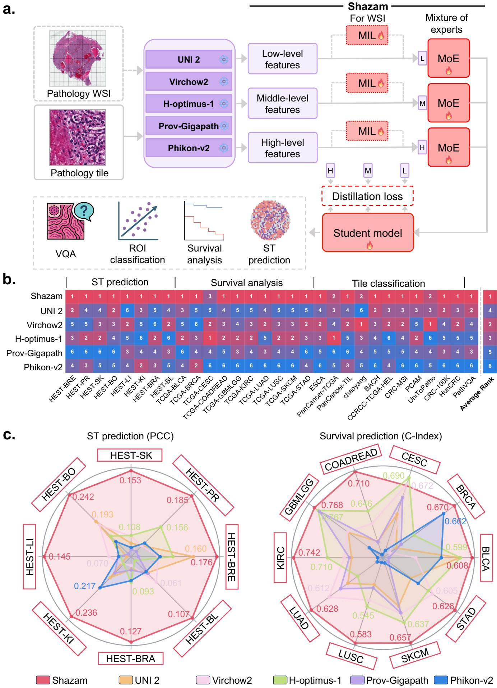

[← 返回 README](../README.md)

# Method 方法

## 📌 预览

Shazam 框架四步：**(1) 多 teacher 多尺度特征提取**——5 个冻结 FM（UNI2/Virchow2/H-optimus-1/Prov-GigaPath/Phikon-v2），每个在 low/mid/high 三个深度（block 索引 0.33L/0.66L/L）提特征；**(2) MoE 自适应加权**——门控给每个 teacher 打分 $g_i$，加权特征堆成矩阵（每行一个 teacher）；**(3) self-attention 融合**——跨尺度/teacher 信息交换；**(4) 多尺度多 teacher 在线蒸馏**——student 特征对每个 teacher 用 cosine + Huber 损失对齐，三尺度平均。

---

## 1 Shazam Framework

**Multi-teacher and multi-scale representation extraction**: For each foundation model, extract features at three depths — early, middle, final layers (low/mid/high-level). Extraction points determined mathematically: for L transformer blocks, place forward hooks at $l_{low}=\lfloor 0.33L\rfloor$, $l_{mid}=\lfloor 0.66L\rfloor$, $l_{high}=L$. All teachers frozen. Five FMs: UNI2, Virchow2, H-optimus-1, Prov-GigaPath, Phikon-v2.

> 💡 **机制拆解（多尺度提取 = depth 的显式利用）**（Hao 批注）：这是与 CKMIL depth-selection 最相关的部分——Shazam 从每个 FM 的**三个深度**（0.33L/0.66L/L）提特征，明确利用了"不同 transformer 层编码不同语义层次"（low=局部形态、mid=组织组织、high=全局上下文）。**关键区别于 CKMIL**：Shazam 是**固定取 3 层**（0.33/0.66/1.0）× **5 个 FM** 全都融合；CKMIL 目标是**单 FM + 学习式 depth selection**（按 slide/task 条件选层，而非固定 3 层全取）。所以 CKMIL 的差异化点应是：(1) 单 FM（不需多 FM）；(2) **自适应选层**（vs Shazam 固定三层全融）；(3) depth selection 作为可学习/条件化的决策。

**MoE adaptive weighting**: gating gives score $g_i$ for i-th teacher; weighted feature $g_i \mathbf{f}_i$. Rather than concatenating, MoE organizes them into a feature matrix (each row = one teacher's gated contribution):

*融合表示：门控加权特征堆成矩阵（每行一个 teacher 的贡献），而非拼接成单一向量。*

**Self-attention fusion**: apply a small stack of self-attention blocks to stacked weighted features → information exchange across features at different semantic scales.

**Distillation across scales and teachers**: for each scale $s\in\{low,mid,high\}$, $\ell_2$-normalize student feature $z_s$ and i-th teacher feature $t_s^{(i)}$, supervise student to match each teacher via cosine distance + element-wise Huber loss; average over all scales and N=5 teachers.

*多尺度多 teacher 蒸馏：student 特征对每个 teacher（cosine + Huber），三尺度 × 5 teacher 平均。*

*Figure 1: Shazam 框架。多个冻结 FM 提 WSI/tile 特征（WSI 任务先经 MIL 得 slide 表示）；Shazam 融合 low/mid/high 特征 + 自适应 MoE 加权；student 用在线蒸馏学任务对齐表示，无需离线蒸馏或重训。*

> 💡 **机制拆解 + 公式批读（四步如何协同）**（Hao 批注）：
> - **MoE 加权（组织成矩阵而非拼接）**：关键设计——不把加权特征拼成一个大向量，而是**堆成矩阵**（每行一个 teacher）。这样后续 self-attention 能建模 teacher 间/尺度间的交互，比拼接更灵活。
> - **self-attention 融合**：让不同 FM、不同尺度的特征相互交换信息——一个 teacher 的 high-level 可以和另一个的 low-level 交互。
> - **在线蒸馏（cosine + Huber）**：student 被监督去匹配每个 teacher 的每个尺度特征——保留各 FM 的互补优势。cosine 对齐方向、Huber 对齐幅度且抗离群。**关键：teacher 冻结、student 在线学** → 加新 FM 只需加一个 teacher 分支，无需重训整个系统。
> - **对 CKMIL/ReadySlide 的启示**：Shazam 的"多层特征 + MoE 加权 + self-attention 融合 + 蒸馏"是一套完整的多源特征融合范式。CKMIL 若做 depth selection，可借鉴其"多尺度提取（0.33/0.66/1.0 层）"，但要用**选择**（sparse/conditional）替代 Shazam 的**全融合**（dense fusion）来做出差异。
