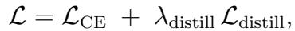

[← 返回 README](../README.md)

# Results, Ablation & Discussion 结果、消融与讨论

## 📌 预览

4 类任务 30 benchmark：空间转录组（8）、生存（10）、tile 分类（11）、VQA。Shazam 平均排名 1.17、26/30 第一（次优 Virchow2 3.20）。消融最关键：**多层特征互补**（单层 0.680-0.689 → 三层融合 0.710，+0.030）；teacher 监督（保留信息 teacher 最重要）；MoE 提供任务自适应但增益较小（+0.002~0.005）。讨论强调从"单体 FM"转向"模块化组合"范式。

---

## Results

Shazam built on 5 FMs (UNI2, Virchow2, H-optimus-1, Prov-GigaPath, Phikon-v2). 30 tasks: spatial transcriptomics (8), whole-slide survival (10), tile-level classification (11), VQA. **Average ranking 1.17, first on 26/30 tasks** (next-best Virchow2 3.20, leads 2 tasks).

**Spatial transcriptomics**: highest PCC on all 8 organs, +0.08-0.17 over strongest individual FM. Baseline FMs show organ-dependent variability (Virchow2 good in brain/skin, H-optimus-1 in prostate/bladder, UNI2 in bowel/kidney) — no single model uniformly strong. Shazam ranks 1.0 average across all 8.

**Survival**: pan-cancer 10 TCGA cohorts, KM analysis significant separation in 9/10 (except CESC).

> 💡 **结果批读（无普适赢家 → 融合的价值）**（Hao 批注）：Shazam 的核心论证是"**不同 FM 有器官/任务依赖的专长**（Virchow2 脑/皮肤、H-optimus-1 前列腺/膀胱、UNI2 肠/肾），融合它们能全面最优"。空间转录组上 +0.08-0.17 PCC、30 任务平均排名 1.17——融合确实一致超过任何单 FM。这印证了 [PathBench](../%5BArxiv%202025%5D%20PathBench/) 的"无普适赢家"，并给出解法（融合）。**但注意**：Shazam 用了 **5 个 FM**——增益部分来自"多 FM 集成"这个天然优势（更多参数/更多预训练知识），不完全是"多层"的功劳。消融（下）显示多层 vs MoE 的相对贡献。

## Ablation Study

*Figure 5: Shazam 消融。a) teacher 监督效果（HEST-Bowel）；b) 多层语义特征互补性（TCGA-COADREAD 生存）；c) MoE 模块贡献（CRC-100K/CCRCC 分类）。*

**Multi-level features (Fig.5b)**: single-level C-index 0.680-0.689; pairwise combos up to +0.022 (low+high = 0.702); **all three levels (low/mid/high) = 0.710** (+0.030 over best single, +0.008 over best pairwise). Local morphology + intermediate tissue organization + global context capture complementary prognostic info.

**MoE module (Fig.5c)**: CRC-100K balanced accuracy 0.955→0.960 (+0.005), F1 0.951→0.956; CCRCC smaller (+0.002). Adaptive expert routing gives measurable but dataset-dependent gains over uniform aggregation.

> 💡 **Fig.5 消融解读（对 CKMIL 最关键的证据）**（Hao 批注）：这组消融**直接关系 CKMIL 的 novelty 边界**：
> 1. **多层特征互补（Fig.5b）是最大增益来源**：单层 0.680-0.689 → 三层 0.710（+0.030）。**这正是 Shazam 已经证明并占据的 novelty**——"low/mid/high 三层病理表示互补"。CKMIL **不能再把这个当核心贡献**。
> 2. **MoE 自适应加权增益小**（+0.002~0.005）：说明"自适应融合"本身贡献有限，主要增益来自"用了多层 + 多 teacher"。
> 3. **teacher 监督（保留信息 teacher）最重要**：印证增益主要来自"retaining informative teachers and multi-level features"，MoE 只是 refine。
> - **对 CKMIL 的行动指令**：既然 Shazam 已证明"多层互补 + 全融合"，CKMIL 的差异化必须落在 **"单 FM + 学习式/条件式 depth SELECTION"**（选哪几层，而非固定三层全取）——即把 Shazam 的 dense fusion 换成 sparse/conditional selection，并论证"选择"相对"全融"的优势（省算力？抗噪？任务自适应？）。这是 CKMIL 能站住的空间。

## Discussion

Shazam consolidates multiple pretrained expert models without accessing their training data or large-scale distillation pretraining. vs GPFM (offline distillation, limited by distillation corpus): Shazam operates online and task-specific, combining FMs through multi-level feature fusion + adaptive expert-weighting, continuously benefiting from new FMs. 30 benchmarks, surpasses UNI2/Virchow2 in majority. Suggests shift from **isolated monolithic models toward modular compositional systems**.

> 💡 **总结 + 对 CKMIL/ReadySlide 的定位（务必内化）**（Hao 批注）：Shazam 在 baseline set 里是 **CKMIL "多层 FM 表示" 主线的最近竞争工作**。它已经占据的 novelty：
> - **多层病理表示互补**（Fig.5b 证明 low/mid/high 三层融合 > 单层）；
> - **任务自适应融合**（MoE 加权，虽增益小）；
> - **在线、可扩展地组合多 FM**（无需离线蒸馏）。
>
> **CKMIL 必须做出的区分**（引用 baseline set 文档）：
> | | Shazam | CKMIL 目标方向 |
> |---|--------|---------------|
> | FM 数量 | 多 FM（5 个） | 单 FM |
> | 层利用 | 固定三层全融合（dense） | depth-wise + **条件式 depth selection**（sparse） |
> | 决策 | MoE 加权所有 | slide/task 条件**选**层 |
> | 增益来源 | 多 FM + 多层 | 单 FM 内的深度选择 |
>
> **可追问点**：(1) Shazam 的多层增益（+0.030）里，多少来自"多 FM"、多少来自"多层"？（消融未完全拆开）——CKMIL 单 FM 多层能否复现类似增益？(2) 固定三层（0.33/0.66/1.0）是否最优？CKMIL 的自适应选层能否更好？(3) Shazam 未做 [Confounders](../%5BNat%20Biomed%20Eng%202026%5D%20Confounders-Biomarker-Prediction/) 式去混杂——多层/多 FM 融合是否放大 shortcut？

> 💡 **Q&A 批注记录**（Hao 批注）：
> - Q：Shazam 和 CKMIL 目标方向的本质区别？
> - A：Shazam = 多 FM + 固定三层全融合 + MoE 加权（online distillation）；CKMIL 目标 = 单 FM + 条件式 depth selection + MIL。关键差异是"多 FM 全融" vs "单 FM 选层"。CKMIL 不能把"多层有用"当 novelty（Shazam 已证明），要把"如何选层、为何选优于全取"当核心。
> - Q：Shazam 能作为标准单 [N,D] baseline 吗？
> - A：不能（baseline set 文档明确标注）。它需要多个 FM、多层特征、MoE 融合，输入协议与其他 8 个单 [N,D] 方法不同。应单独运行其原生 multi-FM/multi-level setting，作"新颖性最近邻 + 扩展实验 baseline"。
> - Q：多层特征提取点怎么定？
> - A：数学化——L 层 transformer 取 $\lfloor 0.33L\rfloor$/$\lfloor 0.66L\rfloor$/$L$ 三个 block 索引。固定比例，非学习。CKMIL 的自适应选层正可在此处做文章。
