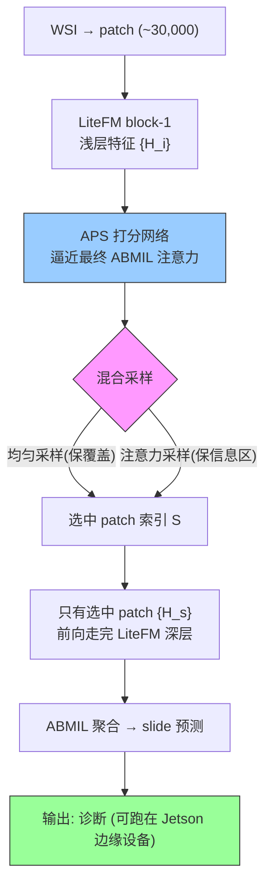

# LitePath: A Deployment-Friendly Foundational Framework for Efficient Computational Pathology

**作者**: Yu Cai, Cheng Jin, Jiabo Ma, ..., Hao Chen, Kwang-Ting Cheng（HKUST 等，与 PathBench 同组）
**会议/期刊**: arXiv 2026 (2602.14010) | **年份**: 2026
**链接**: [arXiv](https://arxiv.org/abs/2602.14010)

## 一句话总结

**LitePath = LiteFM（从 Virchow2+H-Optimus-1+UNI2 蒸馏的 22.5M 参数小 PFM）+ APS（自适应 patch 选择器，混合均匀+注意力采样）**，双轴削减（模型 38.8× × patch 10.4× = 403.5× FLOPs），能跑在 $249 的 Jetson 边缘设备（208 slide/h，快 104.5×，能耗低 171×），37 cohort 上排名 2/19、保留 99.71% AUC，D-Score 最高。

## 核心贡献

1. **双低效分解**：模型过参数化（→ LiteFM 蒸馏）+ patch 冗余（→ APS 选择），两维度独立可压、相乘得 403.5× FLOP 削减。
2. **LiteFM**：ViT-Small，从 3 个互补 teacher（组织学/分子/预后专长）蒸馏，190M patch / 72,280 WSI；28× 小于 Virchow2。
3. **APS**：plug-and-play，浅层特征（block-1）打分逼近最终 ABMIL 注意力，混合"均匀采样保覆盖 + 注意力采样保信息区"，只前向选中 patch。
4. **边缘部署 + D-Score**：Jetson 上 208 slide/h、0.36 kWh/3000 slide；提出 Deployability Score（归一化 AUC × FLOPs 加权几何均值）作精度-效率统一标尺。

## 📖 批读导航

| Section | 内容 |
|---------|------|
| [00 - Abstract](sections/00-abstract.md) | 摘要 + 双低效框架 + 与 EAGLE 对比 |
| [01 - Introduction](sections/01-introduction.md) | 落地障碍、两低效实证依据、Fig.1 框架（APS 早退 + 浅层预测深层注意力） |
| [02 - Results & Method](sections/02-results.md) | 整体(D-Score)、效率(403.5×)、精度(四癌种)、方法(蒸馏+APS)、对 ReadySlide 映射 |

## 关键数字

| 指标 | 数值 |
|------|------|
| 参数 | LitePath 22.5M（28× 小于 Virchow2 631M，50× 小于 H-Optimus-1 1135M） |
| FLOPs | LiteFM 4.25G（38.8× 低）× APS 10.4× = **403.5× 削减** |
| 数据集 | 37 cohort（26 内部+9 外部+2 前瞻）、26 任务、4 器官、15,672 slide / 9,808 患者 |
| 蒸馏 | 3 teacher（Virchow2/H-Optimus-1/UNI2），190M patch / 72,280 WSI |
| 排名 | 平均排名 5.6，2/19（Virchow2 5.3 第一） |
| AUC 保留 | 99.71%（17 cohort 超 Virchow2，25 cohort >99%） |
| D-Score | 86.31%（最高，Virchow2 75.67%） |
| 边缘部署 | Jetson Orin Nano（$249, 25W）：208 slide/h（快 104.5×），0.36 kWh/3000 slide（低 171×） |
| 强项/弱项 | 胃/乳腺领先、冰冻切片 D-Score 95%第一；肺癌第六（略弱） |

## 数据流：输入 → 中间表示 → 输出

## 优缺点与还能做什么

### 优点
- **双轴压缩相乘**：模型 + patch 两维度独立可压，403.5× FLOP 削减，几乎不掉精度（保留 99.71%）。
- **真·边缘部署**：$249 Jetson 上跑常规临床负载，大模型直接 OOM——质变而非量变。
- **APS 覆盖+重要性双采样**：修正纯注意力选择的覆盖盲区。
- **D-Score**：精度-效率统一标尺，评估范式值得推广。

### 局限 / 风险
- **精度有天花板**：肺癌等任务第六，排名仍略输 Virchow2（定位"省 400× 换几乎不掉精度"，非 SOTA 精度）。
- **蒸馏依赖 teacher**：LiteFM 的上限受三个 teacher 约束。
- **未做去混杂**：APS 选的 patch 是否 shortcut 未验（与 Confounders 呼应）。

### 还能做什么（对本课题 ReadySlide）
- **D-Score 作评估范式**：CR/FLOPs 与 AUC 的复合 Pareto 标量，避免单指标偏置——直接可用于 ReadySlide 压缩评估。
- **APS 的"覆盖+重要性"双采样**：修正纯 importance retention 的覆盖盲区，allocator 应含覆盖保底分量。
- **浅层预测深层价值**：用便宜浅层特征预测昂贵 patch 价值，可用于 allocator 的低成本打分。
- **LiteFM = FM-agnostic substrate 实现**：多 FM 蒸成小 substrate，呼应 ReadySlide 的"压一次、任意 FM 分析"。

## 阅读 Q&A 记录

- **Q: LitePath 和 EAGLE 都做效率 CPath，区别？**
  A: EAGLE 只压 patch（用现成 CHIEF 选 25 tile + Virchow2 精提）；LitePath 双轴压——LiteFM 蒸馏小模型（压模型）+ APS 选 patch（压数据），相乘 403.5×。LitePath 还能跑边缘设备。

- **Q: APS 为何要"均匀采样 + 注意力采样"混合，而非纯注意力？**
  A: 纯注意力采样可能漏掉空间分散的信号（EAGLE 承认此风险）。均匀采样保证广覆盖、注意力采样保信息区——模仿病理学家"先广筛后聚焦"。

- **Q: D-Score 是什么，为何重要？**
  A: 归一化 AUC 与归一化 FLOPs 的加权几何均值（精度垫底记 0、算力过高罚分）。它把"精度-效率"二维 Pareto 压成可比标量，避免只看 AUC（偏向大模型）或只看效率（偏向差模型）。

- **Q: 对 ReadySlide 最大启示？**
  A: (1) D-Score 式复合指标应作压缩评估范式；(2) retention 应含"覆盖保底 + 重要性"双分量（APS）；(3) 用浅层特征廉价预测 patch 价值可用于 allocator；(4) LiteFM 是"多 FM 蒸成小 substrate"的 FM-agnostic 实现。

## 📊 Citation Landscape

> Semantic Scholar 采集限流，据论文自身引用整理。

**核心组件 / 最相关**
- Virchow2、H-Optimus-1、UNI2——LiteFM 的三个蒸馏 teacher。
- [PathBench](../%5BArxiv%202025%5D%20PathBench/)（Ma et al., 2025，同组）——"小模型未必输大模型"的实证依据，LitePath 的选型基础。
- [EAGLE](../%5BNat%20Commun%202026%5D%20DL-Efficient-Pathology/)（Nat Commun 2026）——同主题"效率 CPath"，只压 patch 的对照。
- CHIEF、GPFM、mSTAR、Prov-GigaPath、CONCH1.5、Phikon2 等——19 个被评测 PFM。
- ABMIL（Ilse et al., ICML 2018）——APS 逼近的注意力聚合器；DINOv2/iBOT/MIM——PFM 预训练范式；知识蒸馏。

**与本主题的关系**
- 与 [EAGLE](../%5BNat%20Commun%202026%5D%20DL-Efficient-Pathology/) 构成"效率 CPath"一对（双轴压 vs 只压 patch）。
- 与 [PathBench](../%5BArxiv%202025%5D%20PathBench/) 同组、共享"紧凑模型可行"的前提。
- 与 [Confounders](../%5BNat%20Biomed%20Eng%202026%5D%20Confounders-Biomarker-Prediction/) 呼应：效率之外仍需去混杂验证。
