# A Deployment-Friendly Foundational Framework for Efficient Computational Pathology

Yu Cai1, Cheng Jin2, Jiabo Ma2, Fengtao Zhou2, Yingxue Xu2, Zhengrui Guo2, Yihui Wang2, Zhengyu Zhang3,4,5, Ling Liang2, Yonghao Tan1, Pingcheng Dong1, Du Cai6,7,8, On Ki Tang9, Chenglong Zhao3,11, Xi Wang2, Can Yang12, Yali Xu13, Jing Cui11, Zhenhui Li14, Ronald Cheong Kin Chan9,10, Yueping Liu15, Feng Gao6,7,8, Xiuming Zhang16, Li Liang3,4,5, Hao Chen2,17,18,19,20,B, and Kwang-Ting Cheng1,2

1Department of Electronic and Computer Engineering, The Hong Kong University of Science and Technology, Hong Kong SAR, China

2Department of Computer Science and Engineering, The Hong Kong University of Science and Technology, Hong Kong SAR, China

3Department of Pathology, Nanfang Hospital, School of Basic Medical Sciences, Southern Medical University, Guangzhou, China

4Guangdong Province Key Laboratory of Molecular Tumor Pathology, Guangzhou, China

5Jinfeng Laboratory, Chongqing, China

6Department of General Surgery (Colorectal Surgery), The Sixth Affiliated Hospital, Sun Yat-sen University, Guangzhou, China

7Guangdong Provincial Key Laboratory of Colorectal and Pelvic Floor Diseases, The Sixth Affiliated Hospital, Sun Yat-sen University, Guangzhou, China

8Biomedical Innovation Center, The Sixth Affiliated Hospital, Sun Yat-sen University, Guangzhou, China

9Department of Anatomical and Cellular Pathology, The Chinese University of Hong Kong, Hong Kong SAR, China 10Pathology Artificial Intelligence Development and Assessment Laboratory, State Key Laboratory of Translational Oncology, The Chinese University of Hong Kong, Hong Kong SAR, China

11Department of Pathology, The First Affiliated Hospital of Shandong First Medical University & Shandong Provincial Qianfoshan Hospital, Ji’nan, China

12Department of Mathematics, The Hong Kong University of Science and Technology, Hong Kong SAR, China 13Department of Pathology, Shandong Provincial Hospital affiliated to Shandong First Medical University, Ji’nan, China

14Department of Radiology, The Third Affiliated Hospital of Kunming Medical University, Yunnan Cancer Hospital, Kunming, China.

15Department of Pathology, the Fourth Hospital of Hebei Medical University, Shijiazhuang, China 16Department of Pathology, The First Affiliated Hospital, School of Medicine, Zhejiang University, Hangzhou, China 17Department of Chemical and Biological Engineering, The Hong Kong University of Science and Technology, Hong Kong SAR, China

18Division of Life Science, The Hong Kong University of Science and Technology, Hong Kong SAR, China

19State Key Laboratory of Nervous System Disorders, Hong Kong SAR, China

20HKUST Shenzhen-Hong Kong Collaborative Innovation Research Institute, Futian, Shenzhen, China

BCorresponding author: jhc@ust.hk

## ABSTRACT

Pathology foundation models (PFMs) have enabled robust generalization in computational pathology through large-scale datasets and expansive architectures. However, the substantial computational cost of these models, particularly when analyzing gigapixel whole slide images, limits clinical accessibility and scalability. Here, we present LitePath, a deployment-friendly foundational framework designed to mitigate model over-parameterization and patch-level redundancy. LitePath integrates LiteFM, a compact model distilled from three large PFMs (Virchow2, H-Optimus-1 and UNI2) using 190 million patches, and the Adaptive Patch Selector (APS), a lightweight modular component for task-specific patch selection. The framework reduces model parameters by 28× and lowers FLOPs by 403.5× relative to Virchow2, enabling deployment on low-power edge hardware such as the NVIDIA Jetson Orin Nano Super. On this device, LitePath achieves a processing speed of 208 slides per hour, 104.5× faster than Virchow2, and consumes 0.36 kWh per 3,000 slides, 171× lower than Virchow2 on a standard RTX3090 GPU. We validated accuracy using 37 cohorts across four organs and 26 tasks (26 internal, 9 external, and 2 prospective cohorts), comprising 15,672 slides from 9,808 patients that are disjoint from the pretraining data. LitePath ranks second among 19 evaluated models in average ranking scores, outperforming larger models including H-Optimus-1, mSTAR, UNI2 and GPFM. Compared to the top-performing model (Virchow2), LitePath retains 99.71% of the AUC on average. To quantify the balance between accuracy and efficiency, we propose the Deployability Score (D-Score), defined as the weighted geometric mean of normalized AUC and normalized FLOPs scores, where LitePath achieves the highest value, surpassing Virchow2 by 10.64%. These results demonstrate that LitePath enables rapid, cost-effective and energy-efficient pathology image analysis on accessible hardware while maintaining accuracy comparable to state-of-the-art PFMs, facilitating accessible precision oncology and reducing the carbon footprint of AI deployment.

## Introduction

Computational pathology (CPath) is a critical component of precision oncology, where deep learning approaches have improved diagnostic accuracy and clinical workflow efficiency. The confluence of whole slide image (WSI) digitization and developments in foundation models has driven the evolution of pathology foundation models (PFMs)1–3. These models employ self-supervised learning strategies, such as DINOv24, iBOT5, and masked image modeling (MIM)6, to train on massive histopathology datasets. Recent extensions further enhance these models through multi-modal alignment with diagnostic reports and genomic data7. Consequently, PFMs have achieved robust performance across various oncology applications ranging from tumor diagnosis to treatment planning and prognosis assessment.

However, these technological advances impose significant practical constraints. Modern PFMs demand substantial computational resources for deployment, including high-performance GPUs, specialized cooling infrastructure, and sustained power, rendering them difficult to implement in routine clinical environments. The inherent gigapixel resolution of WSIs further compounds these challenges, creating barriers to scalability. Recent efforts to improve inference efficiency of PFM still have critical shortcomings: some approaches rely on smaller yet suboptimal PFMs for pre-screening8, while others sacrifice generalizability across resolutions9. These limitations underscore the need for a deployment-friendly framework that preserves diagnostic generalizability while mitigating the heavy deployment burdens of conventional PFMs, a prerequisite for broad clinical adoption of AI-driven pathology.

To this end, we identified two principal inefficiencies in current PFMs: (1) model overparameterization and (2) patch-level redundancy. The results in PathBench10 reveal that several billion-parameter models (e.g., H-Optimus-0 and Prov-GigaPath11) fail to outperform more compact architectures like Virchow21, indicating that smaller models can be effective. Moreover, both clinical workflows and attention mechanisms in multiple instance learning (MIL)12 demonstrate that diagnostic decisions typically depend on limited regions of interest, yet current methods process all WSI patches indiscriminately. This approach expends substantial computational resources on diagnostically irrelevant areas.

To address these issues, we developed LitePath (Fig. 1a), a PFM framework comprising LiteFM and the Adaptive Patch Selector (APS), which address model overparameterization and patch-level redundancy, respectively. LiteFM is a compact PFM obtained via knowledge distillation13 (Fig. 1b) and built on the ViT-Small backbone14, 15. Drawing upon findings from PathBench10, we selected three PFMs (Virchow21, H-Optimus-1 and UNI23) as teachers, as they achieve high AUCs on diverse downstream tasks and exhibit complementary expertise in histological diagnosis, molecular diagnosis, and survival prognosis. To facilitate effective knowledge transfer, the distillation pretraining is performed on a large dataset of 190 million patches extracted from 72,280 publicly available WSIs. APS is a lightweight, plug-and-play, and task-specific module that reduces patch redundancy through adaptive selection (Fig. 1c). At inference, it uses a hybrid strategy that combines uniform sampling to ensure broad coverage with attention-based sampling to prioritize informative regions. This selection strategy mimics the pathologist’s workflow of initial broad screening followed by focused examination of suspicious areas, thereby minimizing computational redundancy. Through the synergy of LiteFM and APS, LitePath achieves high efficiency while maintaining competitive performance (Fig. 2e,f). With 22.5M parameters (28× smaller than Virchow2 and 50× smaller than

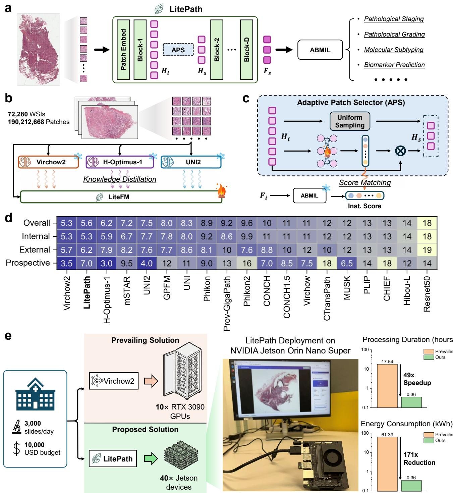  
Figure 1. Overview of the LitePath framework. LitePath is a deployment-friendly PFM framework designed to balance efficiency and diagnostic accuracy, consisting of LiteFM and APS. a, The inference pipeline of LitePath. LiteFM extracts features, while APS selects patches based on indices and shallow features $\{ \mathbf { H } _ { i } \} _ { i = 1 } ^ { N }$ from block-1. Only the selected features $\{ \mathbf { H } _ { s } \} _ { s \in \mathcal { S } }$ are propagated through the network for final prediction. b, LiteFM is distilled from Virchow2, H-Optimus-1 and UNI2 using approximately 190 million patches sourced from 72,280 WSIs. c, APS combines uniform sampling and attention-based sampling for patch selection. The scoring network is trained on the shallow features to approximate the attention score distribution of the final ABMIL. d, Average ranking scores based on Macro-AUC for 19 PFMs across all cohorts, internal cohorts, external cohorts, and prospective cohorts, respectively. e, Comparison of the prevailing deployment (Virchow2 on RTX 3090 GPUs) and the proposed solution (LitePath on Jetson Orin Nano Super devices) under an equivalent daily load and GPU budget.

H-Optimus-1) (Fig. 3a) and efficient computation (Fig. 3b–d), LitePath enables deployment on the NVIDIA Jetson Orin Nano Super (Fig. 1e), a user-friendly edge device with a 25W power rating and a price of USD \$24916. Running on this device, LitePath achieves a processing speed of 208 WSIs (each containing 30,000 patches) per hour (104.5× faster than Virchow2; Fig. 3d), while consuming 0.36 kWh per 3,000 WSIs (comparable to the daily load of a tertiary hospital in China; 171× lower energy consumption than Virchow2 on the RTX 3090; Fig. 1e). Across 26 internal, 9 external, and 2 prospective cohorts, LitePath ranks second among 19 PFMs by average ranking score on Macro-AUC (Fig. 1d) and retains 99.71% of Virchow2’s AUC on average (Fig. 2h). To quantitatively evaluate the balance of accuracy and computational efficiency in deployment, we propose the Deployability Score (D-Score) (Section Evaluation Metrics), defined as the weighted geometric mean of normalized AUC and normalized FLOPs scores. LitePath achieves the highest average D-Score across the benchmark (86.31%, Fig. 2g), exceeding the second-best model (Virchow2, 75.67%). These results demonstrate the potential of LitePath for widespread clinical adoption in CPath, delivering fast, cost-effective, and energy-efficient performance.

## Results

The LitePath framework was evaluated for its ability to balance efficiency and diagnostic accuracy. To assess the performance of LitePath in clinical settings, we benchmark 19 PFMs based on their overall trade-off between efficiency and accuracy (Fig. 2), as well as on efficiency (Fig. 3) and accuracy (Fig. 4) individually.

## Overall Assessment

To evaluate LitePath, this study leverages diverse pathology datasets and tasks alongside real-world deployment metrics. Specifically, we assessed 19 PFMs using 26 distinct tasks covering lung, breast, gastric, and colorectal cancers, incorporating 26 internal held-out test cohorts, 9 external cohorts, and 2 prospective cohorts (Fig. 2a–d). The evaluated PFMs include LitePath, H-Optimus-1, UNI23, MUSK17, CONCH1.518, Phikon219, CHIEF20, Virchow21, GPFM2, mSTAR7, Hibou-L21, Prov-GigaPath11, Virchow22, UNI3, PLIP23, Phikon24, CONCH18, CTransPath25, and Resnet5026. The multi-center benchmark contains 15,672 slides from 9,808 patients across nine hospitals and is disjoint from public pretraining data, ensuring an impartial evaluation. Macro-AUC average ranking scores across the 37 cohorts are computed as an overall metric for accuracy. To emphasize practical relevance, PFMs were further deployed on the affordable and accessible NVIDIA Jetson device to measure throughput. We assess deployability by analyzing the trade-offs between average ranking scores and model parameters (Fig. 2e), as well as between average ranking scores and throughput (Fig. 2f). With 22.5M parameters (28× smaller than Virchow2 and 50× smaller than H-Optimus-1) and a throughput of 208 slides per hour on a Jetson device (104.5× faster than Virchow2), LitePath achieves an average ranking score of 5.6 across the 37 cohorts (Fig. 1d), placed second among the 19 evaluated PFMs (with Virchow2 in first place, scoring 5.3). Additionally, we propose a new metric called D-Score to evaluate deployability by balancing accuracy and computational efficiency (Section Evaluation Metrics, Extended Data Table A8). The D-Score is a weighted geometric mean of normalized accuracy and normalized FLOPs score, where a score of zero is assigned if the accuracy ranks last and penalties are applied for excessive computational overhead. For comparison, the average D-Score across all cohorts is computed for LitePath and 10 other top-performing or most efficient PFMs (Fig. 2g). LitePath achieved the highest average D-Score (86.31%), exceeding the second-ranked PFM, Virchow2 (75.67%). Given the importance of accuracy in clinical scenarios, we calculate the AUC retention of LitePath relative to the top-performing PFM, Virchow2, across the 37 cohorts (Fig. 2h). LitePath outperforms Virchow2 on 17 cohorts and achieves over 99% AUC retention on 25 cohorts, with an overall average retention of 99.71%. These findings demonstrate that LitePath provides a deployable solution for PFM adoption, delivering efficiency gains with negligible loss in accuracy.

## Efficiency

While numerous PFMs have been developed to facilitate AI-assisted precision oncology and have achieved impressive generalizability in diverse relevant tasks, the practical intractability of deploying such large models to analyze gigapixel WSIs has been largely overlooked. Take the case of Virchow2, a SOTA PFM with moderate computational demands among the evaluated PFMs: it processes 17.1 slides per hour on an RTX 3090 GPU (Fig. 3d), which translates to more than 175 GPU hours to handle a tertiary hospital’s daily load of 3,000 slides. Consequently, investigating the computational efficiency of PFMs is essential for determining their clinical relevance. To this end, we analyze each PFM’s parameter count (Fig. 3a) and the required FLOPs for processing a single input pathology patch (Fig. 3b). To illustrate the properties of the proposed APS, we present the relative FLOPs of LitePath (equipped with APS) compared to LiteFM (using all patches) as a function of the number of patches per case (Fig. 3c). Moreover, PFMs are deployed on RTX 3090 and Jetson Orin Nano Super devices to assess real-world performance. For consistency, we measure their throughput (slides processed per hour) on CPU-generated dummy slides containing 30,000 patches each, with computations performed in half-precision (FP16) (Fig. 3d). The detailed analysis is as follows.

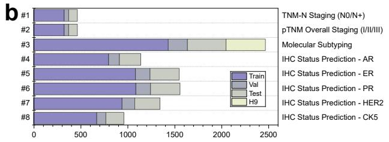

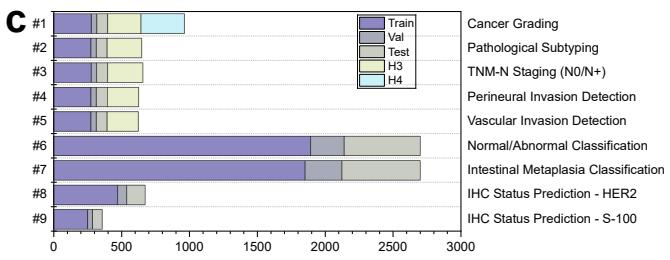

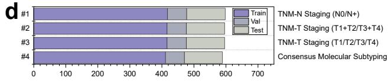

e  
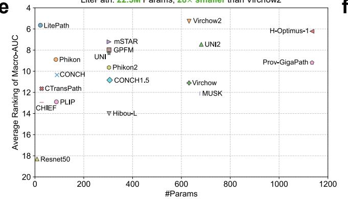  
f

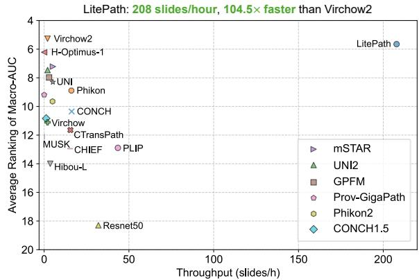

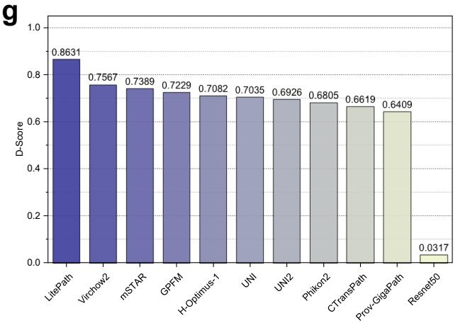  
h

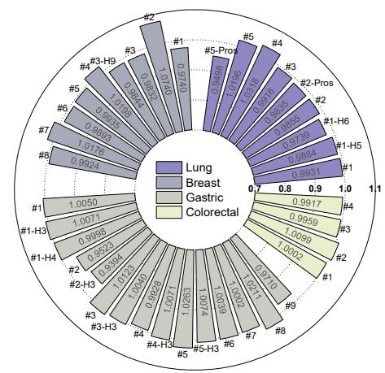  
Figure 2. Overall assessment of PFMs. a–d, Composition of the multi-center evaluation dataset for lung, breast, gastric, and colorectal cancers, respectively (H: Hospital). e, Trade-off between the average ranking score of Macro-AUC and model parameters. f, Trade-off between the average ranking score of Macro-AUC and throughput. g, Average D-Score of the PFMs. h, AUC retention of LitePath relative to Virchow2 across 37 cohorts. (#[No.]: task identifiers in the corresponding organ, with detailed mappings provided in panels a–d. Pros: prospective. Hospital identifiers are omitted for internal held-out test cohorts.)

LitePath reduces theoretical overhead by two orders of magnitude compared to Virchow2. The model size and computational complexity represent key factors that determine the practical cost and speed of PFMs. To illustrate these characteristics, we report the number of parameters for the 19 PFMs (Fig. 3a) and the theoretical FLOPs for the nine top-ranking PFMs as well as ResNet50 (Fig. 3b). LitePath contains 22.5M parameters, making it 28 times smaller than Virchow2 (631M params) and 50 times smaller than H-Optimus-1 (1135M params). In terms of computational complexity, LiteFM (without APS) requires 4.25G FLOPs per input image, which is 38.8 times lower than Virchow2 (165G FLOPs) and 69.6 times lower than H-Optimus-1 (296G FLOPs). APS further minimizes computational overhead through hybrid sampling strategies: uniform sampling, which yields a linear reduction in FLOPs, and attention-based sampling, where the relative FLOPs decrease inversely with the total number of patches per case (Fig. 3c). For sufficiently large patch counts, the relative FLOPs of attention-based sampling in APS converge to 0.096, representing a 10.4-fold reduction. Consequently, by leveraging attention-based sampling in APS, LitePath can theoretically deliver up to a 403.5-fold (38.8 × 10.4) reduction in computational cost compared to Virchow2. Notably, in some cases, uniform sampling alone is sufficient to preserve accuracy, allowing the relative FLOPs to decrease linearly and approach smaller values.

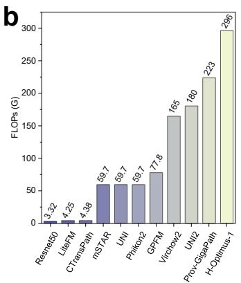

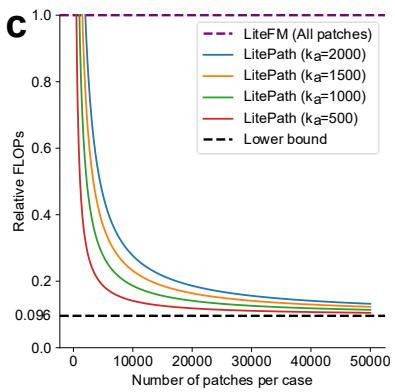

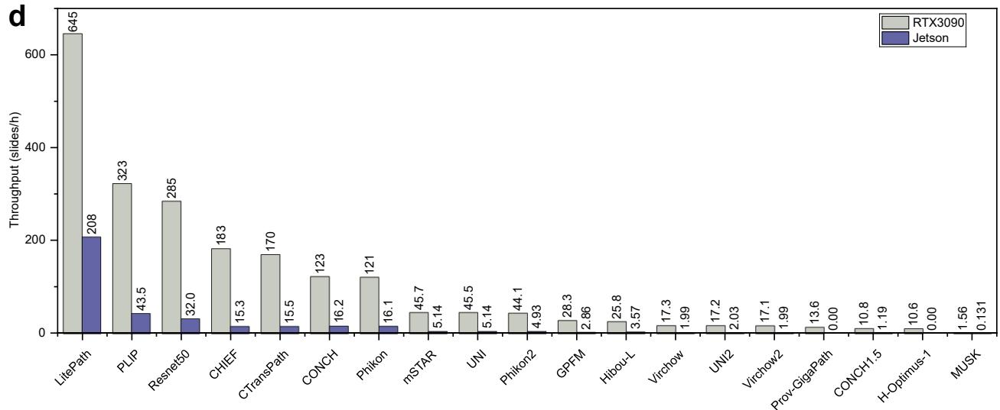  
Figure 3. Efficiency comparison of PFMs. a, Number of parameters for each PFM. LitePath (including LiteFM and APS modules) contains 28× fewer parameters than Virchow2. b, Floating-point operations (FLOPs) required by each PFM to process a single input pathology patch. LitePath requires 38.8× fewer FLOPs than Virchow2. c, Relative FLOPs of LitePath compared to LiteFM as a function of the number of patches per case. Only results for attention-based sampling are presented, as uniform-based sampling scales FLOPs in a straightforward linear fashion. For a sufficiently large number of patches, LitePath achieves a relative FLOPs convergence to 0.096, representing a 10.4× reduction. Therefore, LitePath can theoretically deliver up to a 403.5-fold (38.8 × 10.4) reduction in computational cost compared to Virchow2. d, Throughput of PFMs on RTX 3090 and Jetson Orin Nano Super GPUs, evaluated using dummy slides containing 30,000 patches with half-precision computation. “0.00” indicates out-of-memory. For these experiments, APS selected 1,000 patches using attention-based strategy, with no uniform selection performed.

LitePath enables efficient deployment on resource-constrained edge devices. To quantify practical efficiency, PFMs were deployed on an NVIDIA RTX 3090 and an Nvidia Jetson Orin Nano Super to evaluate performance under constrained hardware conditions. The Jetson device functions as a representative low-power edge platform (25W rated power, 8GB unified memory). Evaluating model performance on such a device provides a direct measure of deployability for widespread adoption in real-world settings. For this evaluation, we generate dummy slides containing 30,000 patches each and apply half-precision (FP16) computation to measure PFM throughput (Fig. 3d). LitePath achieves a throughput of 645 slides per hour on the RTX 3090 and 208 slides per hour on the Jetson device. On the Jetson device, LitePath (208 slides/h) is 104.5 times faster than Virchow2 (1.99 slides/h). Moreover, LitePath’s throughput on the Jetson device is 12.2 times higher than Virchow2’s throughput on the RTX 3090 (17.1 slides/hour). Given the thousands of slides generated daily in tertiary hospitals, LitePath was the only evaluated model capable of reliably supporting routine clinical workloads on edge hardware. In contrast, the significantly lower throughput of other PFMs imposes limitations on their real-world deployment.

LitePath deployed on edge devices presents a scalable solution for high-speed, economical, and energy-efficient utilization of PFMs in clinical settings. Ensuring the real-world scalability of PFMs requires evaluation along three metrics: processing speed, cost-effectiveness, and energy efficiency. High processing speed is necessary for timely analysis of routinely generated slides; cost-effectiveness enables broader adoption in remote and economically disadvantaged regions; and enhanced energy efficiency reduces carbon emissions and supports global environmental sustainability, particularly as adoption scales. To emulate a hospital deployment under a constrained GPU budget, we compare these metrics using an equivalent-cost scenario (Fig. 1e). A budget sufficient to procure 10 RTX 3090 GPUs could instead be allocated to approximately 40 Jetson devices. Under this budget, LitePath deployed on 40 Jetson devices completes the analysis of 3,000 slides in 0.36 hours, which is 49 times faster than Virchow2 running on 10 RTX 3090 GPUs (17.54 hours). In terms of energy consumption, LitePath deployed on the Jetson devices consumes 0.36 kWh to process 3,000 slides, representing a 171 times reduction compared with the 61.39 kWh required by Virchow2 on the RTX 3090 GPUs.

## Accuracy

To validate accuracy, we conduct experiments on 26 distinct tasks, incorporating 26 internal held-out test cohorts, 9 external cohorts, and 2 prospective cohorts (Fig. 2a–d). The datasets cover four organs: lung, breast, gastric, and colorectal cancers. Lung cancer is the most common cancer worldwide in terms of both incidence and mortality27. Breast cancer is the second most commonly diagnosed cancer worldwide and remains a leading cause of cancer-related mortality among women28. Gastric cancer is particularly prevalent in East Asia and is the fifth most commonly diagnosed cancer worldwide29. Colorectal cancer (CRC) is the third most commonly diagnosed cancer worldwide and a leading cause of cancer deaths30, predominantly affecting individuals over 50. Macro-AUC is used as the performance metric. To assess overall PFM accuracy, we report the average Macro-AUC value, the average Macro-AUC ranking score, and the distribution of ranking scores across all cohorts (Fig. 2). The detailed Macro-AUC values with 95% confidence intervals (CIs) for PFMs on each cohort are presented in Extended Data Figs. A1,A2 and Tables A9–A24.

LitePath demonstrates comparable performance to state-of-the-art PFMs across four cancer types. Across all cohorts, LitePath achieves an average ranking score of 5.6, placing second among 19 PFMs (Fig. 1d), behind only Virchow2 (5.3), while outperforming other strong models such as H-Optimus-1 (6.2), mSTAR (7.2), UNI2 (7.5), and GPFM (8.0). In organ-specific evaluations, LitePath excels in gastric cancer tasks (Fig. 4c), achieving an average Macro-AUC of 80.59% and an average ranking score of 5.2, ranking second and first, respectively, among 19 PFMs. This performance is highly competitive with Virchow2 (average Macro-AUC: 80.87%, average ranking score: 5.8). On breast cancer tasks (Fig. 4b), LitePath achieves an 81.09% average Macro-AUC (ranked first, tied with Virchow2) and an average ranking score of 5.0 (ranked second, slightly behind Virchow2’s 4.9), showcasing strong competitive performance. For colorectal cancer tasks (Fig. 4d), LitePath attains an average Macro-AUC of 86.67% and an average ranking score of 3.8, ranking third, closely following the top two models: Virchow2 (87.24%, 3.5) and H-Optimus-1 (86.69%, 3.5). On lung cancer tasks (Fig. 4a), LitePath’s performance is relatively moderate, ranking sixth with an average Macro-AUC of 87.04% and an average ranking score of 7.9. The top-performing models for lung cancer are H-Optimus-1 (88.29%, 4.7) and Virchow2 (87.96%, 5.6). In summary, LitePath demonstrates performance comparable to state-of-the-art models such as Virchow2 and H-Optimus-1. It excels particularly in gastric and breast cancer tasks, while showing a slightly suboptimal performance in lung cancer analysis.

LitePath demonstrates strong potential for intraoperative analysis using frozen slides. Accurate and rapid diagnosis of frozen sections is essential for guiding real-time surgical decision-making, making intraoperative pathology one of the most critical and demanding application scenarios. LitePath’s highly efficient design is particularly suited for this environment, where time constraints and limited computational resources present significant challenges. To evaluate its performance in this context, we included a task focused on frozen sections: lymph node metastasis prediction in lung cancer (Fig. 2a, Section Lung Cancer). On this task, LitePath achieves an AUC of 77.29% (95% CI: 64.42%–88.48%), outperforming Virchow2 (74.90%, 95% CI: 59.07%–88.11%) and UNI2 (74.49%, 95% CI: 59.60%–87.26%) (Extended Table A11). Balancing both accuracy and efficiency, LitePath attains a D-Score of 95.05%, ranking first on this task. These results underscore LitePath’s capability to deliver reliable AI-assisted intraoperative diagnoses.

LitePath demonstrates strong capability in pre-cancer diagnosis. Differentiating normal from abnormal tissue is crucial for early detection and prevention of malignant transformation, a process that requires large-scale screening of non-cancer cases. To assess LitePath’s capabilities in this scenario, we conducted a normal/abnormal classification task on gastric tissue, using non-cancer slides that include diverse precancerous lesions such as Helicobacter pylori-associated chronic gastriti (HPACG),

a  

b  
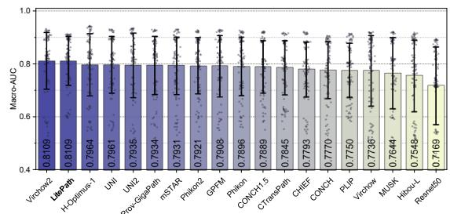

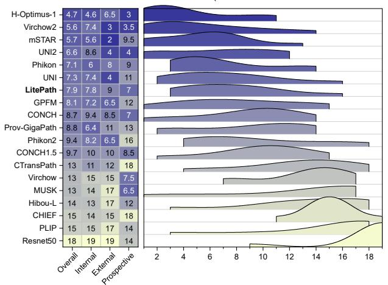

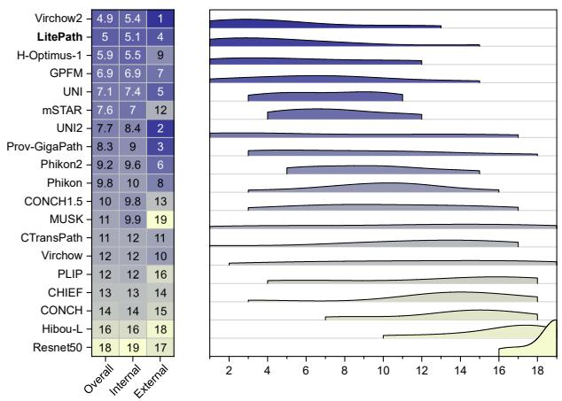

c  

d  
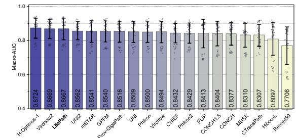

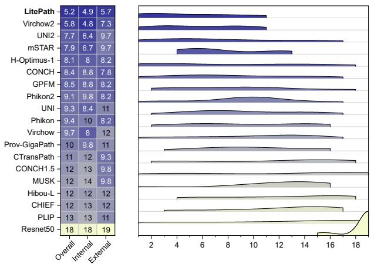

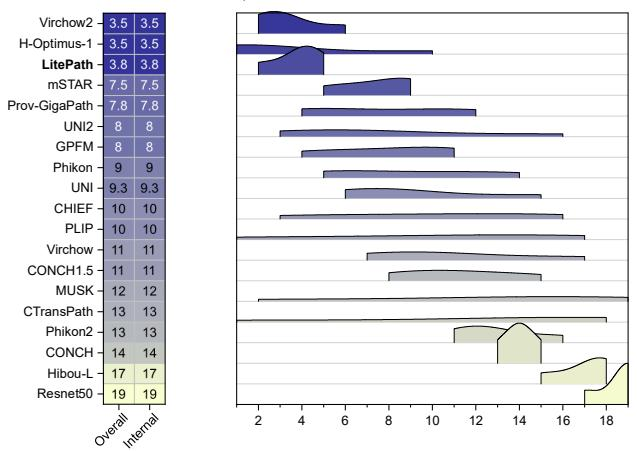  
Figure 4. Overall accuracy of PFMs across four organs. a–d, Performance of PFMs on lung, breast, gastric, and colorectal cancers, respectively. Each panel includes three visualizations: the average Macro-AUC across cohorts for the corresponding organ; the average ranking scores for all cohorts, internal cohorts, external cohorts (if applicable), and prospective cohorts (if applicable); and the distribution of ranking scores for each PFM.

Autoimmune chronic gastritis with Helicobacter pylori (ACGHP), polyps, and ulcers (Fig. 2c, Section Gastric Cancer). LitePath achieves an AUC of 92.68% (95% CI: 90.13%–94.94%), ranking second among 19 PFMs, with the best-performing model being H-Optimus-1 (93.19%, 95% CI: 90.17%–95.59%) (Extended Table A22). However, with comparable accuracy and significantly better efficiency, LitePath outperforms H-Optimus-1 on real deployability (D-Score: 91.86% vs 83.65%). These results highlight LitePath’s strength as a practical and effective tool for pre-cancer screening and early intervention.

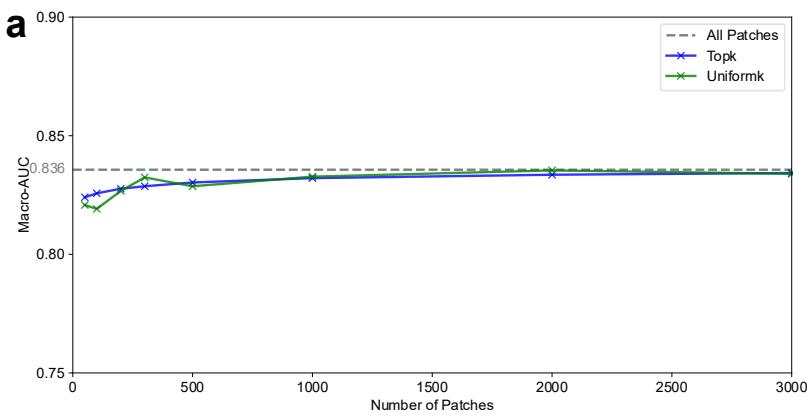  
b

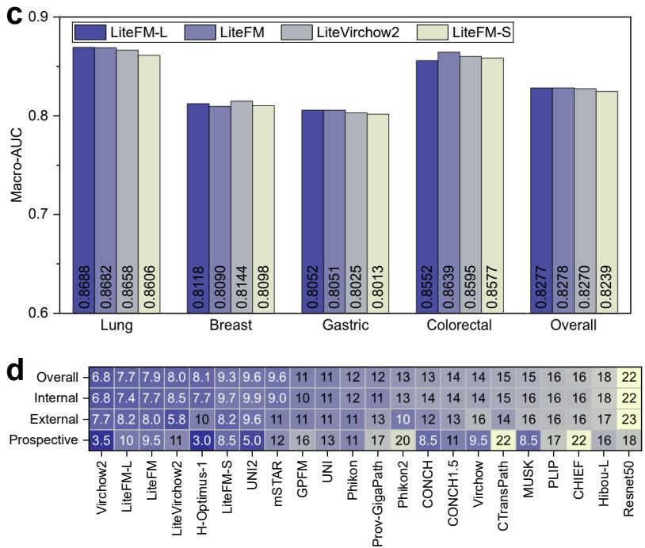

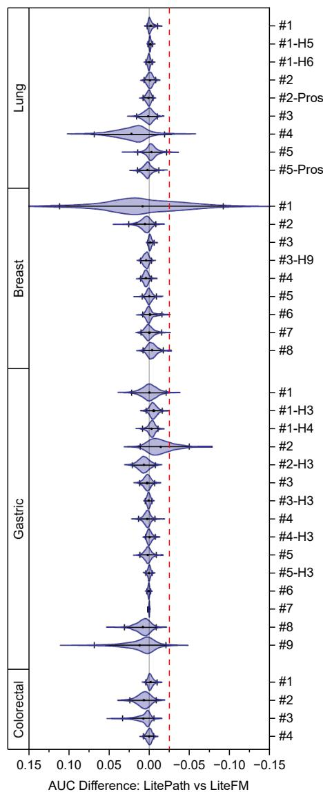  
Figure 5. Ablation study. a, Comparison of using all patches, using top-k patches with highest final attention scores from ABMIL, and using uniform-k patches. The average Macro-AUC across internal held-out test cohorts is presented. Detailed comparison on each task is provided in Extended Data Fig. A3. b, Non-inferiority test of the Adaptive Patch Selector (APS). The violin plots illustrate the distribution of AUC differences between LitePath (equipped with APS) and LiteFM (using all patches). For each plot, the mean value and 95% confidence interval (CI) of the AUC difference are displayed. The zero line and the non-inferiority margin (-2.5%) are indicated by gray and red dashed lines, respectively. Task identifier mappings are provided in Fig. 2a–d. c and d, Comparison of LiteFM family models based on average Macro-AUC and average ranking scores.

## Ablation Study

To clarify the motivation and effectiveness of our method, we conducted ablation studies to assess the impact of partial input patches (Fig. 5a), APS (Fig. 5b), and distillation configurations (Fig. 5c) on model performance.

WSIs contain substantial patch redundancy. WSIs typically comprise tens of thousands of patches, of which pathologists routinely examine only a subset for diagnosis. To evaluate how well MIL frameworks operate when given partial inputs, we performed inference with well-trained ABMIL models using a limited number of patches per slide, selected either by top attention scores or by uniform spatial sampling (Fig. 5a). Across 26 distinct tasks, we consistently observed that using thousands of patches per slide often yields performance comparable to using the full set of patches. This finding shows that computational cost can be reduced by roughly an order of magnitude via patch selection without sacrificing PFM accuracy. Notably, uniformly sampled patches outperform top-score patches on several tasks (for example, Consensus Molecular Subtyping of colorectal cancer, Extended Data Fig. A3d). This counterintuitive result highlights a limitation of ABMIL: attention weights can be biased and may fail to identify diagnostically informative regions in WSIs that lack obvious focal lesions. Collectively, these results motivate combining uniform and attention-based sampling strategies to enable efficient, unbiased patch selection that substantially lowers computation while preserving predictive performance.

APS can discard redundant patches while remaining non-inferior to the baseline in terms of AUC. To evaluate whether APS preserves accuracy after aggressive patch reduction, we performed non-inferiority tests on the distribution of AUC differences between LitePath (with APS) and LiteFM (without APS) (Fig. 5b). We pre-specified the non-inferiority margin at -2.5% to ensure that any performance degradation remains clinically negligible. This threshold is more stringent than the 4% diagnostic discordance rate typically accepted in digital pathology validation protocols as having no impact on patient management31, 32. The results show that APS successfully passes the non-inferiority test on 35 of 37 cohorts, indicating that accuracy loss introduced by patch reduction is generally acceptable, even in extreme cases. APS fails the test on two cohorts, where the lower bound of the CI falls below the non-inferiority margin: TNM-N staging (N0/N+) of breast cancer on Internal-H2 (Breast #1), and Pathological Subtyping of gastric cancer on Internal-H1 (Gastric #2). For the breast cohort, although the lower bound of the confidence interval falls below the non-inferiority margin, the mean AUC difference is positive, suggesting that the point estimate of AUC does not decrease; the test failure likely reflects the high sensitivity of this task and the resulting variability. For the gastric subtyping task, APS fails on Internal-H1 but passes and increases AUC on External-H3 (Gastric #2-H3), indicating that the observed failures are not systematic across cohorts. At the cohort level, the overall mean AUC difference across the 37 cohorts is 0.16% (95% CI: -0.63% to 1.29%), with positive mean differences in 23 cohorts and negative mean differences in 14 cohorts. Together, these results indicate that APS generalizes well across tasks and cohorts: it substantially reduces the number of inference patches while preserving overall AUC performance.

The configuration for distillation pretraining of LiteFM is appropriate for both high accuracy and low computational overhead. Selection of student architectures and teacher models is critical in knowledge distillation. To validate our LiteFM configuration, we evaluate four variants that differ in teacher choices and student backbones (Fig. 5c,d). LiteFM-L, LiteFM and LiteFM-S are distilled from the three PFMs described above and use ViT-B, ViT-S, and ViT-Ti backbones, respectively; LiteVirchow2 uses a ViT-B backbone but is distilled solely from Virchow2 (Extended Data Table A7). Considering both mean AUC (Fig. 5c) and ranking scores across cohorts (Fig. 5d), LiteFM (22.06M parameters) is sufficient to capture the capabilities of teachers. It outperforms LiteFM-S (ViT-Ti, 5.72M) in mean AUC (82.78% vs 82.39%) and average ranking scores (7.9 vs 9.3). Increasing model size to 86.59M (LiteFM-L) yields similar mean AUC and a marginal ranking improvement (7.9 to 7.7). These findings indicate that the primary bottleneck is likely the training data rather than model capacity. Additionally, although Virchow2 achieves the best standalone performance, LiteVirchow2 (distilled only from Virchow2) performs worse than LiteFM distilled from three PFMs despite using the same architecture, demonstrating the advantage of integrating multiple strong PFMs for distillation.

## Discussion

The clinical translation of computational pathology is currently hindered by the immense resource requirements of state-of-the art foundation models. In this work, we present LitePath, a scalable framework designed to decouple high diagnostic accuracy from high computational cost. LitePath integrates LiteFM and APS to mitigate model overparameterization and patch-level redundancy, respectively. These architectural optimizations enable deployment on low-cost edge hardware, such as the NVIDIA Jetson Orin Nano Super, without the infrastructure dependencies of traditional GPU clusters. Validation across 37 cohorts (comprising 26 internal, 9 external, and 2 prospective cohorta) demonstrates that LitePath attains accuracy competitive with billion-parameter models while offering orders-of-magnitude reductions in computational cost. These results suggest that LitePath is a viable solution for democratizing access to precision oncology in resource-constrained settings.

The performance of LitePath provides two key insights into the design of pathology AI systems. First, whole slide images exhibit significant morphological redundancy. Our finding that sampling a fraction of the total patches is sufficient to maintain predictive performance challenges the prevailing assumption that exhaustive, brute-force processing is necessary for accuracy. This points to a biological sparsity in WSIs that can be exploited: future research should focus on intelligent, context-aware patch selection mechanisms that mimic human attention rather than improving raw throughput alone. Second, knowledge distillation proves effective for condensing the semantic information of large-scale PFMs into compact architectures. By directly learning from the feature distribution of teacher ensembles, LiteFM achieves generalization comparable to models trained on significantly larger datasets. This suggests that the semantic density of current PFMs is low and that optimizing the information efficiency of parameters is a more sustainable path than indefinitely scaling model size.

A primary limitation of this study lies in the performance upper bound imposed by the scale of the pretraining data. Our results indicate a saturation in student performance: increasing the student model size yielded no meaningful improvement (LiteFM-L vs LiteFM, Fig. 5c,d). Notably, the two PFMs ranked closest to LitePath (Virchow2 and H-Optimus-1) were pretrained on approximately 3.1 million and over 1 million WSIs, respectively, whereas LitePath was pretrained on 72,280 WSIs. These findings imply that the generalization capabilities of distilled models are currently constrained by the quantity and diversity of the pretraining corpus rather than model capacity. Consequently, future improvements will likely require scaling the pretraining data by integrating cohorts from multiple institutions and regions to capture a broader spectrum of histological variance and further close the gap with billion-parameter teacher models.

Beyond these data constraints, the architectural efficiency of LitePath reveals a fundamental shift in the computational dynamics of PFM inference. While traditional large-scale PFMs operate in a compute-bound regime dominated by GPU execution, LitePath effectively eliminates this bottleneck, shifting the workflow toward an I/O-bound regime where speed is determined by data retrieval rates. This transition highlights that future optimizations should prioritize system-level data logistics rather than solely on model compression. Ultimately, by demonstrating that state-of-the-art performance is achievable without massive computational expenditure, LitePath lowers the hardware and energy barriers to deployment, thereby promoting the sustainable and widespread adoption of AI-driven precision pathology.

## Methods

## Inference Pipeline of LitePath

In conventional PFM-based frameworks, WSIs are partitioned into numerous non-overlapping pathology patches. A PFM processes these patches to produce patch-level embeddings, and a multiple-instance learning (MIL) model (e.g., ABMIL12) aggregates those embeddings into a slide-level prediction. This paradigm, however, ignores the substantial redundancy among WSI patches and is therefore inefficient in practice. To enable efficient and reliable inference, we propose an alternative inference pipeline in LitePath (Fig. 1a). LitePath consists of a compact PFM, LiteFM, built on the ViT-S architecture14, 15, and a lightweight, plug-and-play module, APS, which incorporates uniform-based and attention-based strategies for patch selection. Rather than computing full embeddings for every patch, we first obtain shallow features by running each patch only through the Patch Embedding layer and the first transformer block of LiteFM. APS then adaptively selects a small set of representative patches using their indices and these shallow features. Only the hidden features of the selected patches are forwarded through the remaining LiteFM layers to produce the final prediction.

Specifically, given a slide consisting of N patches $\{ \mathbf { x } _ { i } \} _ { i = 1 } ^ { N } .$ , each patch is processed by the Patch Embedding layer and the first attention block, resulting in shallow hidden features $\{ \dot { \mathbf { H } } _ { i } \} _ { i = 1 } ^ { N }$ . To efficiently identify representative patches, APS employs uniform-based and attention-based selection strategies. In the uniform-based strategy, $k _ { u }$ patch indices are selected via uniform sampling, yielding the set $\begin{array} { r } { \mathcal { U } = \left\{ i _ { m } \vert i _ { m } = \left\lfloor \frac { ( m - 1 ) \bar { N } } { k _ { u } } \right\rfloor + 1 , m = 1 , \dots , k _ { u } \right\} } \end{array}$ . In the attention-based strategy, the hidden features are fed into a lightweight scoring network to estimate attention scores $\hat { \bf A } _ { i } .$ . The top $k _ { a }$ patches with the highest scores (excluding those already selected by $\boldsymbol { \mathcal { U } } )$ are chosen, forming the set $\begin{array} { r } { \mathcal { A } = \left\{ i _ { n } | i _ { n } \in \arg \operatorname* { m a x } _ { i \notin \mathcal { U } } ^ { ( k _ { a } ) } \hat { \mathbf { A } } _ { i } \right\} } \end{array}$ . The final set of selected patch indices is given by ${ \mathcal { S } } = { \mathcal { U } } \cup { \mathcal { A } }$ . The corresponding features of these selected patches, $\{ \mathbf { F } _ { s } \} _ { s \in \mathcal { S } } ,$ , are subsequently extracted and fed into the MIL model for downstream task prediction. A comparison of this process with the conventional PFM pipeline is outlined in Extended Data Algorithms 1 and 2. The selection numbers $k _ { u }$ and $k _ { a }$ are determined through a grid search on the held-out validation set for each task (Extended Data Table A3).

## Model Training

To enable the efficient inference pipeline of LitePath, three components require training: the feature extractor LiteFM, the APS scoring network, and the ABMIL. We adopt a three-stage training scheme, dedicating one stage to each component. In the first stage, LiteFM is pretrained through knowledge distillation from three large, SOTA PFMs using a curated database. In the second stage, patch features extracted by LiteFM are used to train an ABMIL model for the target downstream task. In the third stage, with the LiteFM and ABMIL fixed, the APS scoring network is trained to predict ABMIL’s final attention scores from LiteFM’s shallow features, enabling identification of important patches using partial inference. Note that both the ABMIL and the APS scoring network are task-specific. This staged procedure ensures each component is optimized for the proposed efficient inference pipeline.

## Stage 1 - Distillation Pretraining

Several benchmark studies have demonstrated that no single PFM consistently outperforms all others across downstream tasks2, 10. This observation motivates the integration of multiple powerful models into a single generalizable framework via knowledge distillation. To enhance the performance of our lightweight PFM, we select three expert models–Virchow2, H-Optimus-1, and UNI2–that exhibit competitive results across diverse tasks, and distill their knowledge into LiteFM, as illustrated in Fig. 1b. Leveraging the training data from $\mathrm { G P F M } ^ { 2 }$ , we process 33 public datasets containing 72,280 WSIs, resulting in a total of 190,212,668 pathology images (Extended Data Table A1). Using this extensive database, knowledge distillation is performed by enforcing $\ell _ { 1 }$ consistency between the embeddings extracted by LiteFM and those from the teacher models. Specifically, given an input image, we obtain the embeddings of the three teachers, $\mathbf { F } ^ { [ \mathrm { V i r c h o w 2 } ] } , \mathbf { F } ^ { [ \mathrm { H - O p t i m u s - } 1 ] }$ , and $\mathbf { F } ^ { [ \mathrm { U N I } 2 ] }$ , as well as the student embedding, $\mathbf { \bar { F } } ^ { [ \mathrm { L i t e F M } ] }$ . Three projection heads, $\varphi _ { 1 } , \varphi _ { 2 }$ , and $\varphi _ { 3 } ,$ , are adopted to project the student embedding to the same dimensionality as each teacher, respectively. The optimization objective is to minimize the loss function $L _ { K D } = \alpha \cdot \tilde { \varepsilon } _ { \parallel } ( \varphi _ { \parallel } ( \mathbf { F } ^ { \mathrm { [ L i e F M ] } } ) , \mathbf { F } ^ { \mathrm { [ V i r c h o w \tilde { 2 } ] } } ) + \beta \cdot \ell _ { 1 } ( \varphi _ { 2 } ( \mathbf { F } ^ { \mathrm { [ L i e F M ] } } ) , \mathbf { F } ^ { \mathrm { [ \tilde { H } \mathrm { - O p i m u s - \tilde { 1 } } ] } } ) + \gamma \cdot \ell _ { 1 } ( \varphi _ { 3 } \mathbf { \tilde { ( F } ^ { \mathrm { [ L i e F M ] } } ) } , \mathbf { F } ^ { \mathrm { [ U N ] 2 } } ) )$ , where $\alpha , \beta , \gamma$ are the weights assigned to each of the three teacher models. Details of distillation pretraining are presented in Extended Data Table A4.

## Stage 2 - ABMIL Training

In CPath, multiple instance learning (MIL) serves as the standard framework for downstream task analysis using PFM embeddings. Although several MIL methods are available12, 33–36, ABMIL12 stands out for its simplicity and consistently competitive performance with PFM embeddings2, 3, 22. Consequently, following previous studies, we adopt ABMIL for PFM performance evaluation. Given the patch features $\mathbf { F } \in \mathbb { R } ^ { N \times D }$ of a slide, ABMIL first projects the feature dimension to 512, resulting in $\mathbf { F } ^ { \prime } \in \mathbb { R } ^ { N \times 5 1 2 }$ . Subsequently, two fully connected layers map $\mathbf { F ^ { \prime } } \mathbf { t o } \mathbf { A } \in \mathbb { R } ^ { \tilde { N } }$ , which represents the attention score for each patch feature. The attention scores A are then used to aggregate the projected features $\mathbf { F ^ { \prime } }$ , producing a slide-level representation Z. Finally, a projection head generates the final prediction based on Z. The training objective is to minimize the cross-entropy loss between the prediction Z and the label Y. The architecture and training details of ABMIL are presented in Extended Data Table A5.

## Stage 3 - Score Matching

The well-trained LiteFM and ABMIL together support the conventional inference pipeline of PFM for pathology analysis, which incorporates all patches in the computation. To enable our APS to identify representative patches with minimal computational cost, we propose training a scoring network $\phi$ to estimate the final attention scores using shallow features, thereby allowing patch selection to be performed via partial inference. Specifically, given a slide consisting of N patches $\begin{array} { r } { \{ \mathbf { x } _ { i } \} _ { i = 1 } ^ { N } , } \end{array}$ we compute the hidden features after the first block $\{ \mathbf { H } _ { i } \} _ { i = 1 } ^ { N }$ and the corresponding attention scores $\{ \mathbf { A } _ { i } \} _ { i = 1 } ^ { N }$ . Then we process the hidden features by ${ \bf H } _ { i } ^ { [ \mathrm { C o n c a t } ] } = \mathrm { C o n c a t } \left[ { \bf H } _ { i } ^ { [ \mathrm { C L S } ] } ; \mathrm { M e a n } ( { \bf H } _ { i } ^ { [ \mathrm { P a t c h } ] } ) \right]$ . The training objective is to enforce consistency between the estimated scores $\hat { \mathbf { A } } _ { i } = \phi ( \mathbf { H } _ { i } ^ { [ \mathrm { C o n c a t } ] } ) , i = \bar { 1 } , . . . N$ , and the true attention scores $\{ \mathbf { A } _ { i } \} _ { i = 1 } ^ { N }$ . We measure this consistency using a soft cross-entropy loss $L _ { \mathrm { s c o r e } } = - \sum _ { i = 1 } ^ { N } p _ { i } \log \hat { p } _ { i }$ , where $\begin{array} { r } { p _ { i } = \operatorname { s o f t m a x } \left( \frac { \mathbf { A } } { \tau } \right) } \end{array}$ and $\begin{array} { r } { \hat { p } _ { i } = \mathrm { s o f t m a x } \left( \frac { \hat { \mathbf { A } } } { \tau } \right) } \end{array}$ , with τ denoting the temperature parameter. Details of the APS scoring network are presented in Extended Data Table A6

## Pretraining Data Preparation

To facilitate the distillation training of LiteFM, large-scale and diverse datasets are desirable. GPFM2 processed a comprehensive set of public datasets and demonstrated their sufficiency for distillation training. Consequently, we follow its configuration to curate 33 public datasets. For slide processing, we employ the CLAM toolkit37 to perform tissue segmentation and extract non-overlapping $5 1 2 \times 5 1 2$ patches at level 0. Consistent with GPFM, we preserve the original resolution of each WSI, thereby introducing greater scale diversity for robust training. In total, we obtain 190,212,668 patches from 72,280 slides for training. Details of the pretraining data are provided in Extended Data Table A1.

## Deployment

To facilitate real-world application, achieving fast inference of PFMs on devices with limited computational resources poses significant challenges. To evaluate the efficiency of LitePath, we compare it with 18 other PFMs, namely H-Optimus-1, UNI23, MUSK17, CONCH1.518, Phikon219, CHIEF20, Virchow21, GPFM2, mSTAR7, Hibou-L21, Prov-GigaPath11, Virchow22, UNI3, $\mathrm { P L I P } ^ { 2 3 }$ , Phikon24, CONCH18, CTransPath25, and Resnet5026. We deploy each PFM on both an NVIDIA Jetson Orin Nano Super and an RTX 3090. The Jetson Orin Nano Super supports three power modes; we set its power to 25W for all experiments. For each PFM, we generate a dummy input slide containing 30,000 patches, with each patch resized to the target resolution required by the respective PFM. For LitePath, which incorporates patch selection during inference, we assume a selection of 1,000 patches based on estimated attention scores. We measure the latency of feature extraction and MIL prediction for the entire slide using half-precision computation, as it offers faster processing without empirically compromising accuracy. Importantly, the dummy input is generated directly on the CPU to exclude disk I/O, ensuring a fair comparison across devices. Based on the measured latency, we calculate the throughput of each PFM, defined as the number of slides processed per hour. Additionally, we investigate the number of parameters in each PFM to provide further insight into their computational demands.

## Evaluation Metrics

The downstream tasks in this study are classification; therefore, we use Macro Area Under the Receiver Operating Curve (Macro-AUC) and its 95% confidence interval (CI) as the performance metric. This measure is threshold-independent and fair for tasks with imbalanced category distributions. Additionally, FLOPs and throughput during inference are used as efficiency metrics.

To balance accuracy and efficiency for deployment, we introduce a new metric called the Deployability Score (D-Score). The metric for assessing the deployability of PFMs in clinical practice is designed to adhere to the following principles: 1. Accuracy, as the top priority for clinicians, should take precedence over efficiency.

2. Models with unacceptably low accuracy should receive the minimum score, regardless of their efficiency.

3. Models with high computational costs should be penalized in the score to reflect their impact on practical usability.

Based on these principles, we define D-Score as a weighted geometric mean of the normalized AUC and normalized FLOPs scores. The FLOPs are measured at the slide-level and averaged across each cohort. Given a set of PFMs denoted by $\{ m _ { i } \} _ { i = 1 } ^ { M }$ , the D-score for the i-th model is computed as: $d _ { i } = \overline { { a } } _ { i } ^ { \alpha } \cdot \overline { { f } } _ { i } ^ { ( 1 - \alpha ) }$ , where $\overline { { a } } _ { i }$ and ${ \overline { { f } } } _ { i }$ are the normalized AUC score and the normalized FLOPs score, respectively, and α is the weighting factor for the AUC score. To align with the first principle, we set $\alpha = 0 . 9$ to prioritize accuracy. The normalized AUC score, $\overline { { a } } _ { i } .$ is derived using min-max normalization across evaluated PFMs, ensuring that the lowest-performing model receives a score of zero, which results in a zero D-Score and satisfies the second principle.

To account for the exponentially growing nature of FLOPs, we first transform FLOPs into a logarithmic scale, which compresses the broad range of values while maintaining their relative differences. Next, we normalize these log-FLOPs to the [0, 1] range using a Sigmoid function centered at the median log-scale FLOPs of the evaluated models. The normalized FLOPs are calculated as: $\begin{array} { r } { \overline { { f } } _ { i } = 1 - \frac { 1 } { 1 + e ^ { - ( \log f _ { i } - \log T ) } } } \end{array}$ . Here $f _ { i }$ represents the raw FLOPs value, and T denotes the median FLOPs value among the evaluated models. The use of $^ { \bullet } 1 - ^ { \bullet }$ ensures that larger scores correspond to better efficiency. The subtraction of logT in the Sigmoid function aligns the normalized scores with the moderate baseline, where models with median FLOPs scores serve as the baseline for relative efficiency evaluation. This design emphasizes small or moderate-efficiency models while assigning diminishing scores to models with excessively high FLOPs, reflecting practical constraints in deployment and satisfying the third principle

## Downstream Tasks

To comprehensively evaluate the accuracy of LitePath, we performed experiments across a diverse array of cancers involving four organs, encompassing 26 distinct tasks and 37 cohorts (26 internal, 9 external, and 2 prospective cohorts). (Extended Data Table A2). The dataset includes 15,672 slides from 9,808 patients across nine hospitals, designated H1 through H9. Notably, the prospective dataset contains 1,471 slides from 525 patients at H1, collected between April and August 2025. Slide preprocessing for downstream analyses followed the standardized PathBench pipeline10: only foreground tissue patches were analyzed; all WSIs were processed at the base level (level 0), with patch dimensions adjusted according to magnification: 256×256 pixels for 20× WSIs, 512×512 pixels for 40× WSIs, ensuring a consistent tissue coverage of 0.25 µm2/pixel across all samples. Internal cohorts were stratified by label into training, validation, and test sets at a ratio of 7:1:2.

## Lung Cancer

Primary and Metastatic Cancer Classification. Accurate distinction between primary and metastatic lung tumors is a key diagnostic challenge in precision oncology, as it directly informs patient management and prognosis. To evaluate the performance of PFMs in clinically relevant scenarios, we built an internal cohort that contains 389 primary cases (686 slides) and 457 metastatic cases (736 slides) from Hospital H1. We built two external cohorts: The Hospital H5 cohort contains 237 primary cases (237 slides) and 256 metastatic cases (256 slides); The Hospital H6 cohort contains 465 primary cases (744 slides) and 361 metastatic cases (678 slides).

Cancer Subtyping. Precise subtyping of lung cancer represents a foundational aspect of pathological diagnosis. In this study, we performed classification among six lung cancer subtypes: Lung Neuroendocrine Tumor (LNET), Minimally Invasive Adenocarcinoma (MIA), Lung Adenosquamous Carcinoma (ASC), Invasive Adenocarcinoma (IAC), Lung Squamous Cell Carcinoma (LUSC), and Lung Adenocarcinoma In Situ (AIS). Specifically, we constructed an internal cohort from Hospital H1 that contains 131 LNET cases (170 slides), 121 MIA cases (167 slides), 19 ASC cases (34 slides), 150 IAC cases (181 slides), 123 LUSC cases (255 slides), and 150 AIS cases (271 slides). Additionally, we constructed a prospective cohort from Hospital H1 that contains 5 LNET cases (31 slides), 150 MIA cases (596 slides), 7 ASC cases (65 slides), 150 IAC cases (1,074 slides), 70 LUSC cases (713 slides), and 127 AIS cases (627 slides).

NSCLC Subtyping. Accurate discrimination between lung adenocarcinoma (LUAD) and lung squamous cell carcinoma (LUSC) among non-small cell lung cancer (NSCLC) subtypes is of paramount importance in pathology, given its direct impact on clinical management and tailored treatment strategies. For this task, we constructed an internal cohort from Hospital H1 that contains 300 LUAD cases (300 slides) and 300 LUSC cases (300 slides).

Lymph Node Metastasis Prediction. Reliable prediction of lymph node metastasis is critical in the pathological evaluation of lung cancer, informing disease staging and guiding surgical and adjuvant treatment decisions. For this task, we constructed an internal cohort from Hospital H1 that contains 71 lymph node metastasis-positive cases (231 slides) and 250 lymph node metastasis-negative cases (828 slides).

IHC Status Prediction. Assessment of immunohistochemistry (IHC) status plays an essential role in lung cancer pathology, facilitating biomarker-driven stratification and the implementation of targeted therapeutic interventions. In this task, we focused on the prediction of P63. We constructed an internal cohort from Hospital H1 that contains 197 P63-negative cases (249 slides) and 90 P63-positive cases (105 slides). Additionally, we constructed a prospective validation cohort from Hospital H1 that contains 24 P63-negative cases (218 slides) and 34 P63-positive cases (293 slides).

## Breast Cancer

TNM-N Staging (N0/N+). Accurate staging of axillary lymph node involvement, defined by the TNM-N staging, is fundamental for prognostication and treatment planning in breast cancer. For this task, we constructed an internal cohort from Hospital H2 that contains 343 N0 cases (916 slides) and 125 N+ cases (381 slides). For external validation, we built one cohort from H9 that contains 62 N0 cases (62 slides) and 23 N+ cases (23 slides).

pTNM Overall Staging (I/II/III). The pTNM overall stage, synthesized from postoperative pathological examination of the primary tumor and regional lymph nodes, represents the definitive prognostic benchmark and is the principal determinant for adjuvant therapy recommendations in breast cancer. For this task, we constructed an internal cohort from Hospital H2 that contains 192 stage I cases (451 slides), 232 stage II cases (727 slides), and 43 stage III cases (116 slides).

Molecular Subtyping. Identification of molecular subtypes is critical for personalized cancer therapy, as it enables the selection of targeted treatments and improves prognostic accuracy. We constructed an internal cohort from Hospital H2 that contains 307 Luminal A cases (310 slides), 614 Luminal B1 cases (618 slides), 243 Luminal B2 cases (268 slides), 589 TNBC cases (1,932 slides), and 292 HER-2 cases (323 slides). We built an external cohort from H9 that includes 102 Luminal A cases, 89 Luminal B1 cases, 24 Luminal B2 cases, 101 TNBC cases, and 102 HER-2 cases, where each case contains only one slide.

IHC Status Prediction. Assessing immunohistochemical marker status directly impacts clinical management and patient prognosis. To evaluate the performance of foundation models on biomarker prediction, we constructed cohorts from Hospital H2 to perform the prediction of 5 biomarkers: AR, ER, PR, HER2, and CK5, respectively. For the prediction of AR, the cohort contains 463 AR negative cases (731 slides) and 677 AR positive cases (841 slides). For ER, it contains 767 ER negative cases (1,264 slides) and 781 ER positive cases (786 slides). For PR, it contains 623 PR negative cases (1,108 slides) and 933 PR positive cases (950 slides). For HER2, it contains 511 HER2 negative cases (743 slides) and 833 HER2 positive cases (975 slides). For CK5, it contains 753 CK5 negative cases (859 slides) and 208 CK5 positive cases (379 slides).

## Gastric Cancer

Cancer Grading. Histological grading in gastric cancer provides vital insights into tumor differentiation and is a key factor in prognosis and treatment selection. For this task, we constructed an internal cohort from H1 that contains 81 well/moderately differentiated (G1+G2) cases (82 slides) and 318 poorly differentiated (G3) cases (319 slides). For external validation, we constructed two cohorts. The Hospital H3 cohort contains 55 G1+G2 cases and 190 G3 cases, while the Hospital H4 cohort provides 62 G1+G2 cases and 258 G3 cases, with each case containing one slide.

Pathological Subtyping. Classifying gastric tumors by pathological subtype enables tailored therapeutic approaches and supports more precise outcome prediction. We constructed an internal cohort from Hospital H1 that contains 163 Signet Ring Cell Carcinoma (SRCC) cases (163 slides), 166 Tubular Adenocarcinoma (TAC) cases (167 slides), and 66 non-specified Stomach Adenocarcinoma (NOS) cases (67 slides). Two external cohorts were constructed for external validation. The H3 cohort contains 82 SRCC cases and 233 NOS cases, while the H4 cohort contains 59 SRCC cases and 195 NOS cases, with each case containing only one slide.

TNM-N Staging (N0/N+). Assessment of lymph node involvement (N stage) informs both disease staging and the likelihood of recurrence, directly impacting surgical and adjuvant therapy planning. We constructed an internal cohort from Hospital H1 that contains 186 N0 cases (188 slides) and 212 N+ cases (212 slides). We built an external cohort from H3 that contains 85 N0 cases and 175 N+ cases, with each case containing only one slide.

Perineural Invasion Detection. Detection of perineural invasion serves as an indicator of aggressive disease behavior and is associated with poorer prognosis in gastric cancer. For this task, we built an internal cohort from H1 that contains 255 PNI-positive cases (256 slides) and 141 PNI-negative cases (142 slides). We built an external cohort from H3 that contains 156 PNI-positive cases and 76 PNI-negative case, with each case containing only one slide.

Vascular Invasion Detection. Identifying vascular invasion is crucial for estimating the risk of metastasis and guiding postoperative management strategies. We built an internal cohort from Hospital H1 that contains 197 VI-positive cases (198 slides) and 198 VI-negative cases (199 slides). We built an external cohort from H3 that contains 140 VI-positive and 90 VI-negative cases, with each case containing only one slide.

Normal/Abnormal Classification. Differentiating between normal and abnormal gastric tissue aids in early detection and prevention of malignant transformation. For this task, we constructed an internal cohort from H7 that contains 733 normal slides and 1,967 abnormal slides.

Intestinal Metaplasia Classification. Recognizing intestinal metaplasia (IM) is important for surveillance and risk assessment, as it represents a precancerous change in gastric mucosa. We constructed an internal cohort from H7 comprising 270 IM slide and 2,430 non-IM slides

IHC Status Prediction of HER2 and S-100. Predicting immunohistochemical marker status supports targeted therapy selection and refines diagnostic accuracy. We focused on HER2 and S-100, which are especially crucial for gastric cancer. To evaluate the prediction of HER2, we constructed an internal cohort from H1, H3, and H4 that contains 549 low-HER2 cases (IHC 0/1+) and 126 high-HER2 cases (IHC 2+/3+). For S-100, we constructed an internal cohort from H1, H3, and H4 that contains 90 IHC 0 slides and 270 IHC 1+ slides.

## Colorectal Cancer

TNM-N Staging (N0/N+) Accurate evaluation of lymph node involvement is crucial for determining disease progression and guiding postoperative treatment in colorectal cancer. We constructed an internal cohort from Hospital H8 that contains 367 N0 cases (1,848 slides) and 230 N+ cases (871 slides).

TNM-T Staging (T1+T2/T3+T4) Assessing the depth of tumor invasion helps stratify patients into risk groups and informs decisions regarding surgical and adjuvant therapies. For this task, we constructed an internal cohort from H8 that contains 76 T1+T2 cases (319 slides) and 519 T3+T4 cases (2,391 slides).

TNM-T Staging (T1/T2/T3/T4) To further elucidate the TNM-T staging, we expanded the task to a more fine-grained four-class classification. For this purpose, the internal cohort from H8 includes 20 T1 cases (75 slides), 56 T2 cases (244 slides), 440 T3 cases (2,130 slides), and 79 T4 cases (261 slides).

Consensus Molecular Subtyping Identifying consensus molecular subtypes enables a more refined understanding of tumor biology, supporting individualized management and prognostication. We constructed an internal cohort that contains 76 CMS1 (372 slides), 239 CMS2 (1061 slides), 86 CMS3 (393 slides), and 187 CMS4 (857 slides).

## Computing software and Hardware

In this project, we used Python (v3.10.15) and PyTorch38(v.2.5.1, CUDA 11.8) for model training and evaluation. Openslide (v3.4.1) and ASlide (https://github.com/MrPeterJin/ASlide) were utilized to process WSIs. For the distillation training of LitePath, we utilized three PFMs as teachers, Virchow2, H-Optimus-1, and UNI2. The pretrained weights of Virchow2 and H-Optimus-1 are available at Huggingface (https://huggingface.co/paige-ai/Virchow2, https://huggingface.co/biopt imus/H-optimus-1). The pretrained weights of UNI2 are available at GitHub (https://github.com/mahmoodlab/UNI). The distillation training was performed on 4 × 80 GB NVIDIA H800 GPUs with the distributed data-parallel (DDP) technique. The downstream tasks were performed on a single NVIDIA RTX 3090 GPU. Additionally, the deployment was performed on NVIDIA Jetson Orin Nano Super, a low-cost edge device with 8 GB unified memory and 25W rated power. We used OriginPro (2024), matplotlib (v.3.9.3), and seaborn (v0.13.2) for visualization.

## Data availability

This study incorporates 33 public datasets for pretraining, including TCGA39 (https://portal.gdc.cancer.gov/), CPTAC40 (https: //proteomic.datacommons.cancer.gov/pdc/), PANDA41 (https://www.kaggle.com/c/prostate-cancer-grade-assessment/data), NADT-Prostate42 (https://www.cancerimagingarchive.net/collection/nadt-prostate/), BCNB43 (https://bcnb.grand-challenge.o rg/), CAMELYON1644 (https://camelyon16.grand-challenge.org/Data/), CAMELYON1745 (https://camelyon17.grand-cha llenge.org/Data/), BRACS46 (https://www.bracs.icar.cnr.it/download/), TIGER202147 (https://tiger.grand-challenge.org/),

MIDOG202248 (https://midog.deepmicroscopy.org/download-dataset/), AGGC202249 (https://aggc22.grand-challenge.org/), O.B.R50, 51 (https://www.cancerimagingarchive.net/collection/ovarian-bevacizumab-response/), ACROBAT202352 (https://acro bat.grand-challenge.org/), AML-C-LMU53 (https://www.cancerimagingarchive.net/collection/aml-cytomorphology\_lmu/), ARCH54 (https://warwick.ac.uk/fac/cross\_fac/tia/data/arch), BACH55 (https://zenodo.org/records/3632035), CAMEL56 (https://drive.google.com/open?id=1brr8CnU6ddzAYT157wkdXjbSzoiIDF9y), DiagSet57 (https://ai-econsilio.diag.pl/), DLBCL58 (https://github.com/stanfordmlgroup/DLBCL-Morph), GTEx59 (https://gtexportal.org/home/histologyPage), HunCRC60 (https://www.cancerimagingarchive.net/collection/hungarian-colorectal-screening/), Janowczyk61 (https: //andrewjanowczyk.com/use-case-1-nuclei-segmentation/), LC2500062 (https://academictorrents.com/details/7a638ed18 7a6180fd6e464b3666a6ea0499af4af), MIDOG202148 (https://imig.science/midog2021/download-dataset/), OCELOT63 (https://zenodo.org/record/7844149), Oste. Tumor64 (https://www.cancerimagingarchive.net/collection/osteosarcoma-tumor-ass essment/), PAIP201965 (https://paip2019.grand-challenge.org/), PAIP202066 (https://paip2020.grand-challenge.org/), PAIP2021 (https://paip2021.grand-challenge.org/), Post-NAT-BRCA67 (https://www.cancerimagingarchive.net/collection/post-nat-brca/), SICAPv268 (https://data.mendeley.com/datasets/9xxm58dvs3/1), SLN-Breast69 (https://www.cancerimagingarchive.net/c ollection/sln-breast/), SPIE201970 (https://breastpathq.grand-challenge.org/). For the downstream tasks, we utilized data from PathBench10. Due to patient privacy protections, institutional review board requirements, and data use agreements, these datasets are not publicly available. However, researchers interested in evaluating on those tasks may submit a formal request to the PathBench team, contingent upon obtaining the necessary ethical approvals and adhering to relevant institutional policies.

## References

1. Zimmermann, E. et al. Virchow2: Scaling self-supervised mixed magnification models in pathology. arXiv preprint arXiv:2408.00738 (2024).

2. Ma, J. et al. A generalizable pathology foundation model using a unified knowledge distillation pretraining framework. Nat. Biomed. Eng. 1–20 (2025).

3. Chen, R. J. et al. Towards a general-purpose foundation model for computational pathology. Nat. medicine 30, 850–862 (2024).

4. Oquab, M. et al. Dinov2: Learning robust visual features without supervision. arXiv preprint arXiv:2304.07193 (2023).

5. Zhou, J. et al. ibot: Image bert pre-training with online tokenizer. arXiv preprint arXiv:2111.07832 (2021).

6. He, K. et al. Masked autoencoders are scalable vision learners. In Proceedings of the IEEE/CVF conference on computer vision and pattern recognition, 16000–16009 (2022).

7. Xu, Y. et al. A multimodal knowledge-enhanced whole-slide pathology foundation model. Nat. Commun. 16, 11406 (2025).

8. Neidlinger, P. et al. A deep learning framework for efficient pathology image analysis. arXiv preprint arXiv:2502.13027 (2025).

9. Han, C. et al. Towards computation-and communication-efficient computational pathology. arXiv preprint arXiv:2504.02628 (2025).

10. Ma, J. et al. Pathbench: A comprehensive comparison benchmark for pathology foundation models towards precision oncology. arXiv preprint arXiv:2505.20202 (2025).

11. Xu, H. et al. A whole-slide foundation model for digital pathology from real-world data. Nature 630, 181–188 (2024).

12. Ilse, M., Tomczak, J. & Welling, M. Attention-based deep multiple instance learning. In International conference on machine learning, 2127–2136 (PMLR, 2018).

13. Hinton, G., Vinyals, O. & Dean, J. Distilling the knowledge in a neural network. arXiv preprint arXiv:1503.02531 (2015).

14. Dosovitskiy, A. et al. An image is worth 16x16 words: Transformers for image recognition at scale. In International Conference on Learning Representations (2021).

15. Touvron, H. et al. Training data-efficient image transformers & distillation through attention. In International conference on machine learning, 10347–10357 (PMLR, 2021).

16. NVIDIA. Buy the latest jetson products. https://developer.nvidia.com/buy-jetson. Accessed: 2026-01-06.

17. Xiang, J. et al. A vision–language foundation model for precision oncology. Nature 638, 769–778 (2025).

18. Lu, M. Y. et al. A visual-language foundation model for computational pathology. Nat. medicine 30, 863–874 (2024).

19. Filiot, A., Jacob, P., Mac Kain, A. & Saillard, C. Phikon-v2, a large and public feature extractor for biomarker prediction. arXiv preprint arXiv:2409.09173 (2024).

20. Wang, X. et al. A pathology foundation model for cancer diagnosis and prognosis prediction. Nature 634, 970–978 (2024).

21. Nechaev, D., Pchelnikov, A. & Ivanova, E. Hibou: A family of foundational vision transformers for pathology. arXiv preprint arXiv:2406.05074 (2024).

22. Vorontsov, E. et al. A foundation model for clinical-grade computational pathology and rare cancers detection. Nat. medicine 30, 2924–2935 (2024).

23. Huang, Z., Bianchi, F., Yuksekgonul, M., Montine, T. J. & Zou, J. A visual–language foundation model for pathology image analysis using medical twitter. Nat. medicine 29, 2307–2316 (2023).

24. Filiot, A. et al. Scaling self-supervised learning for histopathology with masked image modeling. MedRxiv 2023–07 (2023).

25. Wang, X. et al. Transformer-based unsupervised contrastive learning for histopathological image classification. Med. image analysis 81, 102559 (2022).

26. He, K., Zhang, X., Ren, S. & Sun, J. Deep residual learning for image recognition. In Proceedings of the IEEE conference on computer vision and pattern recognition, 770–778 (2016)

27. Cao, W., Qin, K., Li, F. & Chen, W. Comparative study of cancer profiles between 2020 and 2022 using global cancer statistics (globocan). J. Natl. Cancer Cent. 4, 128–134 (2024).

28. Harbeck, N. et al. Breast cancer. Nat. reviews Dis. primers 5, 66 (2019).

29. Smyth, E. C., Nilsson, M., Grabsch, H. I., van Grieken, N. C. & Lordick, F. Gastric cancer. The Lancet 396, 635–648 (2020).

30. Mármol, I., Sánchez-de Diego, C., Pradilla Dieste, A., Cerrada, E. & Rodriguez Yoldi, M. J. Colorectal carcinoma: a general overview and future perspectives in colorectal cancer. Int. journal molecular sciences 18, 197 (2017).

31. Mukhopadhyay, S. et al. Whole slide imaging versus microscopy for primary diagnosis in surgical pathology: a multicenter blinded randomized noninferiority study of 1992 cases (pivotal study). The Am. journal surgical pathology 42, 39–52 (2018).

32. Bauer, T. W. et al. Validation of whole slide imaging for primary diagnosis in surgical pathology. Arch. pathology & laboratory medicine 137, 518–524 (2013).

33. Shao, Z. et al. Transmil: Transformer based correlated multiple instance learning for whole slide image classification. Adv. neural information processing systems 34, 2136–2147 (2021).

34. Zhang, H. et al. Dtfd-mil: Double-tier feature distillation multiple instance learning for histopathology whole slide image classification. In Proceedings ofthe IEEE/CVF conference on computer vision and pattern recognition, 18802–18812 (2022).

35. Lin, T., Yu, Z., Hu, H., Xu, Y. & Chen, C.-W. Interventional bag multi-instance learning on whole-slide pathological images. In Proceedings ofthe IEEE/CVF Conference on Computer Vision and Pattern Recognition, 19830–19839 (2023).

36. Zhang, Y. et al. Attention-challenging multiple instance learning for whole slide image classification. In European conference on computer vision, 125–143 (Springer, 2024).

37. Lu, M. Y. et al. Data-efficient and weakly supervised computational pathology on whole-slide images. Nat. biomedical engineering 5, 555–570 (2021).

38. Paszke, A. et al. Pytorch: An imperative style, high-performance deep learning library. Adv. neural information processing systems 32 (2019).

39. Weinstein, J. N. et al. The cancer genome atlas pan-cancer analysis project. Nat. genetics 45, 1113–1120 (2013).

40. Edwards, N. J. et al. The cptac data portal: a resource for cancer proteomics research. J. proteome research 14, 2707–2713 (2015).

41. Bulten, W. et al. Artificial intelligence for diagnosis and gleason grading of prostate cancer: the panda challenge. Nat. medicine 28, 154–163 (2022).

42. Wilkinson, S. et al. Nascent prostate cancer heterogeneity drives evolution and resistance to intense hormonal therapy. Eur. urology 80, 746–757 (2021).

43. Xu, F. et al. Predicting axillary lymph node metastasis in early breast cancer using deep learning on primary tumor biopsy slides. Front. oncology 11, 759007 (2021).

44. Bejnordi, B. E. et al. Diagnostic assessment of deep learning algorithms for detection of lymph node metastases in women with breast cancer. Jama 318, 2199–2210 (2017).

45. Bandi, P. et al. From detection of individual metastases to classification of lymph node status at the patient level: the camelyon17 challenge. IEEE transactions on medical imaging 38, 550–560 (2018).

46. Brancati, N. et al. Bracs: A dataset for breast carcinoma subtyping in h&e histology images. Database 2022, baac093 (2022).

47. Shephard, A. et al. Tiager: Tumor-infiltrating lymphocyte scoring in breast cancer for the tiger challenge. arXiv preprint arXiv:2206.11943 (2022).

48. Aubreville, M. et al. Domain generalization across tumor types, laboratories, and species—insights from the 2022 edition of the mitosis domain generalization challenge. Med. Image Analysis 94, 103155 (2024).

49. Huo, X. et al. A comprehensive ai model development framework for consistent gleason grading. Commun. Medicine 4, 84 (2024).

50. Wang, C.-W. et al. Weakly supervised deep learning for prediction of treatment effectiveness on ovarian cancer from histopathology images. Comput. Med. Imaging Graph. 99, 102093 (2022).

51. Wang, C.-W. et al. Histopathological whole slide image dataset for classification of treatment effectiveness to ovarian cancer. Sci. Data 9, 25 (2022).

52. Weitz, P. et al. A multi-stain breast cancer histological whole-slide-image data set from routine diagnostics. Sci. Data 10, 562 (2023).

53. Matek, C., Schwarz, S., Marr, C. & Spiekermann, K. A single-cell morphological dataset of leukocytes from aml patients and non-malignant controls (aml-cytomorphology\_lmu). The Cancer Imaging Arch. (TCIA)[Internet] (2019).

54. Gamper, J. & Rajpoot, N. Multiple instance captioning: Learning representations from histopathology textbooks and articles. In Proceedings ofthe IEEE/CVF conference on computer vision and pattern recognition, 16549–16559 (2021).

55. Aresta, G. et al. Bach: Grand challenge on breast cancer histology images. Med. image analysis 56, 122–139 (2019).

56. Xu, G. et al. Camel: A weakly supervised learning framework for histopathology image segmentation. In Proceedings of the IEEE/CVF International Conference on computer vision, 10682–10691 (2019).

57. Koziarski, M. et al. Diagset: a dataset for prostate cancer histopathological image classification. Sci. Reports 14, 6780 (2024).

58. Vrabac, D. et al. Dlbcl-morph: Morphological features computed using deep learning for an annotated digital dlbcl image set. Sci. Data 8, 135 (2021).

59. Carithers, L. J. et al. A novel approach to high-quality postmortem tissue procurement: the gtex project. Biopreservation biobanking 13, 311–319 (2015).

60. Pataki, B. Á. et al. Huncrc: annotated pathological slides to enhance deep learning applications in colorectal cancer screening. Sci. Data 9, 370 (2022).

61. Janowczyk, A. & Madabhushi, A. Deep learning for digital pathology image analysis: A comprehensive tutorial with selected use cases. J. pathology informatics 7, 29 (2016).

62. Borkowski, A. A. et al. Lung and colon cancer histopathological image dataset (lc25000). arXiv preprint arXiv:1912.12142 (2019).

63. Ryu, J. et al. Ocelot: Overlapped cell on tissue dataset for histopathology. In Proceedings of the IEEE/CVF Conference on Computer Vision and Pattern Recognition, 23902–23912 (2023).

64. Arunachalam, H. B. et al. Viable and necrotic tumor assessment from whole slide images of osteosarcoma using machine-learning and deep-learning models. PloS one 14, e0210706 (2019).

65. Kim, Y. J. et al. Paip 2019: Liver cancer segmentation challenge. Med. image analysis 67, 101854 (2021).

66. Kim, K. et al. Paip 2020: Microsatellite instability prediction in colorectal cancer. Med. Image Analysis 89, 102886 (2023).

67. Tafavvoghi, M., Bongo, L. A., Shvetsov, N., Busund, L.-T. R. & Møllersen, K. Publicly available datasets of breast histopathology h&e whole-slide images: a scoping review. J. Pathol. Informatics 15, 100363 (2024).

68. Silva-Rodríguez, J., Colomer, A., Sales, M. A., Molina, R. & Naranjo, V. Going deeper through the gleason scoring scale: An automatic end-to-end system for histology prostate grading and cribriform pattern detection. Comput. methods programs biomedicine 195, 105637 (2020).

69. Gupta, D., Kose, U., Le Nguyen, B. & Bhattacharyya, S. Artificial intelligence for data-driven medical diagnosis, vol. 3 (Walter de Gruyter GmbH & Co KG, 2021).

70. Petrick, N. et al. Spie-aapm-nci breastpathq challenge: an image analysis challenge for quantitative tumor cellularity assessment in breast cancer histology images following neoadjuvant treatment. J. Med. Imaging 8, 034501–034501 (2021).

## Acknowledgements

This work was supported by the National Natural Science Foundation of China (Project No. 62202403), Research Grants Council of the Hong Kong Special Administrative Region, China (Project No. T45-401/22-N and AoE/E-601/24-N), National Key R&D Program of China (Project No. 2023YFE0204000), and HKSAR RGC General Research Fund (GRF) (Project No. 16208823).

## Ethics declaration

This project has been reviewed and approved by the Human and Artefacts Research Ethics Committee (HAREC) of The Hong Kong University of Science and Technology (Protocol No. HREP-2025-0322) and the Ethics Committee of Nanfang Hospital (Protocol No. NFEC-2024-535, NFEC-2025-403, and NFEC-2025-419). The study was conducted in accordance with the Declaration of Helsinki.

## Author contributions statement

Y.C., J.M. and H.C. conceived the study. Y.C. designed and implemented the method, pretrained the model, conducted evaluations, implemented deployment on the Jetson device, wrote the original draft including visualization, revised the deployment software and produced the demo video. C.J. developed the deployment software and GUI, enhanced visualizations and contributed to the Discussion writing and manuscript refinement. J.M. curated pretraining data, contributed to the pretraining design, and provided writing suggestions. Yingxue X., Y.W., Z.G., J.M., Z.Z. and Ling L. processed data for downstream tasks. F.Z. and Yingxue X. provided benchmark results for comparison; F.Z. also assisted with visualization design. Z.G. processed prospective data and provided code for external validation. Y.T. and P.D. contributed to the deployment discussion. Li L., X.Z., F.G., Y.L., R.C.K.C., Z.L., J.C., Yali X., C.Y., X.W., D.C., O.K.T. and C.Z. collected pathology data. All authors reviewed the manuscript draft. H.C. and K.-T.C. supervised the research.

## Extended Data

<table><tr><td colspan="2">Algorithm 1 Inference pipeline of LitePath</td></tr><tr><td>Require:  $E _ { p r e }$  and  $E _ { p o s t }$ </td><td>LiteFM backbone is divided into  $E _ { p r e }$  and  $E _ { p o s t }$ </td></tr><tr><td>Require:  $\phi , g , h$  D</td><td> $\mathsf { A P S }$  scoring network, aggregator, and output head</td></tr><tr><td>Require:  $k _ { u } , k _ { a }$ </td><td>Number of patches selected by uniform and attention-based</td></tr><tr><td>Require:  $\mathbf { X } = \{ \mathbf { x } _ { i } \} _ { i = 1 } ^ { N }$ </td><td>strategies Input WSI containing N patches</td></tr><tr><td>1:  $\mathbf { H } _ { i } = E _ { p r e } ( \mathbf { x } _ { i } )$  , for  $i = 1 , . . . , N .$ </td><td>Shallow features of all patches</td></tr><tr><td>2:  $\mathcal { S } = \mathrm { A P S } ( \mathbf { H } , \phi , k _ { u } , k _ { a } )$ </td><td>Selected indices  $( k _ { u }$  uniform and  $k _ { a }$  atten-</td></tr><tr><td>3:  $\mathbf { F } _ { s } = E _ { p o s t } ( \mathbf { H } _ { s } ) .$  for  $s \in { \mathcal { S } } .$ </td><td>tion) Features of  $( k _ { u } + k _ { a } )$  se-</td></tr><tr><td>4:  $\mathbf { Z } = g ( \mathbf { F } _ { s \in \mathcal { S } } )$ </td><td>lected patches Feature aggregation</td></tr><tr><td>5:  $\mathbf { Y } = h ( \mathbf { Z } )$ </td><td>▶ Prediction</td></tr></table>

<table><tr><td colspan="2">Algorithm 2 Inference pipeline of conventional PFMs</td></tr><tr><td>Require: E</td><td> PFM backbone</td></tr><tr><td>Require:  $g , h$ </td><td>Aggregator and output head</td></tr><tr><td>Require:  $\mathbf { X } = \{ \mathbf { x } _ { i } \} _ { i = 1 } ^ { N }$ </td><td>Input WSI containing N patches</td></tr><tr><td rowspan="3">1:  $\mathbf { F } _ { i } = E ( \mathbf { x } _ { i } )$  , for  $i = 1 , . . . , N .$  2:  $\mathbf { Z } = g ( \mathbf { F } )$ </td><td></td></tr><tr><td> Features of all patches (N)</td></tr><tr><td>Feature aggregation ▶ Prediction</td></tr></table>

Table A1. Number of slides and processed patches from the 33 datasets used for distillation pretraining. "-" indicates datasets that provide only ROIs. Dataset selection and processing follow GPFM2.
<table><tr><td>Dataset Name</td><td>Number of Slides</td><td>Total Patches</td></tr><tr><td> $\mathrm { T C G A } ^ { 3 9 }$ </td><td>26,285</td><td>120,496,200</td></tr><tr><td> $\mathrm { G T E x P o r t a l } ^ { 5 9 }$ </td><td>24,467</td><td>31,892,017</td></tr><tr><td> $\mathrm { C P T A C ^ { 4 0 } }$ </td><td>7,164</td><td>11,768,225</td></tr><tr><td> $\mathrm { C A M E L Y O N 1 7 ^ { 4 5 } }$ </td><td>841</td><td>4,612,382</td></tr><tr><td> $\mathrm { H u n C R C ^ { 6 0 } }$ </td><td>200</td><td>3,369,925</td></tr><tr><td> $\mathrm { B R A C S } ^ { 4 6 }$ </td><td>381</td><td>2,992,229</td></tr><tr><td> $\mathrm { D i a g S e t } ^ { 5 7 }$ </td><td>825</td><td>2,500,385</td></tr><tr><td> $\mathbf { A G G C 2 0 2 2 ^ { 4 9 } }$ </td><td>286</td><td>2,130,584</td></tr><tr><td> $\mathrm { C A M E L Y O N 1 6 ^ { 4 4 } }$ </td><td>288</td><td>1,706,890</td></tr><tr><td> $\mathrm { D L B C L } ^ { 5 8 }$ </td><td>203</td><td>1,524,388</td></tr><tr><td> $\mathrm { P A I P 2 0 2 0 ^ { 6 6 } }$ </td><td>118</td><td>1,362,725</td></tr><tr><td> ${ \bf O . B . R ^ { 5 0 , 5 1 } }$ </td><td>283</td><td>1,159,516</td></tr><tr><td> $\mathrm { P A I P } 2 0 2 1$ </td><td>220</td><td>1,048,840</td></tr><tr><td> $\mathrm { N A D T - P r o s t a t e } ^ { 4 2 }$ </td><td>1,303</td><td>919,847</td></tr><tr><td> $\mathrm { P A N D A } ^ { 4 1 }$ </td><td>7,114</td><td>905,206</td></tr><tr><td>PAIP2019</td><td>96</td><td>505,356</td></tr><tr><td>TIGER2021</td><td>174</td><td>312,835</td></tr><tr><td> $\mathrm { B C N B } ^ { 4 3 }$ </td><td>1,036</td><td>263,734</td></tr><tr><td> $\mathrm { P o s t - N A T - B R C A } ^ { 6 7 }$ </td><td>96</td><td>241,547</td></tr><tr><td> $\mathrm { S L N - B r e a s t } ^ { 6 9 }$ </td><td>129</td><td>139,166</td></tr><tr><td> $\mathrm { B A C H } ^ { 5 5 }$ </td><td>30</td><td>108,256</td></tr><tr><td>ACROBAT2023</td><td>153</td><td>76,128</td></tr><tr><td>MIDOG2022</td><td>395</td><td>43,342</td></tr><tr><td> $\mathrm { \ A R C H ^ { 5 4 } }$ </td><td></td><td>25,919</td></tr><tr><td>MIDOG2021</td><td>193</td><td>24,025</td></tr><tr><td>LC25000</td><td>1</td><td>19,678</td></tr><tr><td>SICAPv2</td><td>一</td><td>18,783</td></tr><tr><td>AML-C-LMU</td><td></td><td>18,365</td></tr><tr><td> $\mathrm { C A M E L } ^ { 5 6 }$ </td><td>一</td><td>16,744</td></tr><tr><td> $\mathrm { O C E L O T ^ { 6 3 } }$ </td><td></td><td>3,201</td></tr><tr><td> $\mathrm { S P I E 2 0 1 9 }$ </td><td>一</td><td>2,579</td></tr><tr><td> $\mathbf { J a n o w c z y k } ^ { 6 1 }$ </td><td>一</td><td>2,260</td></tr><tr><td> ${ \mathrm { O s t e . ~ T u m o r } } ^ { 6 4 }$ </td><td></td><td>1,391</td></tr><tr><td>Total</td><td>72,280</td><td>190,212,668</td></tr></table>

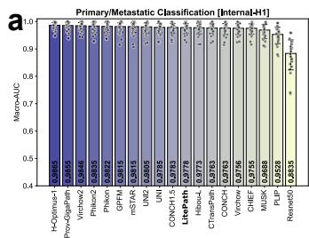

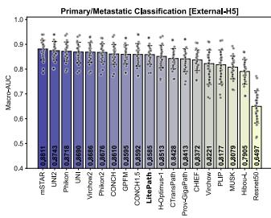

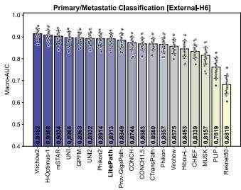

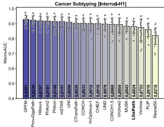

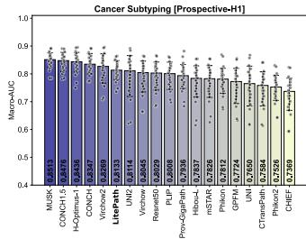

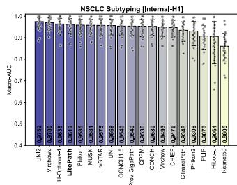

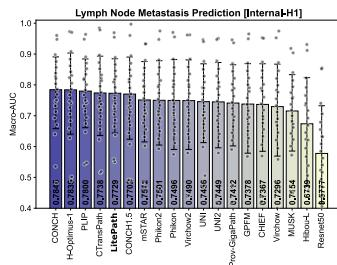

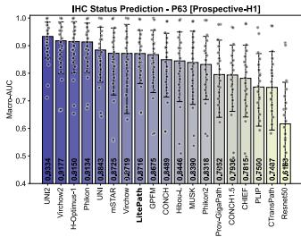

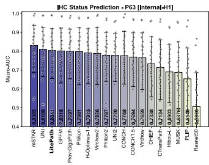

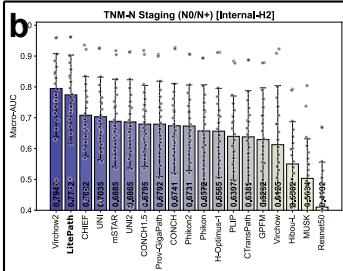

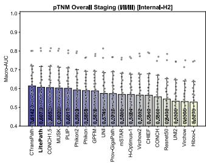

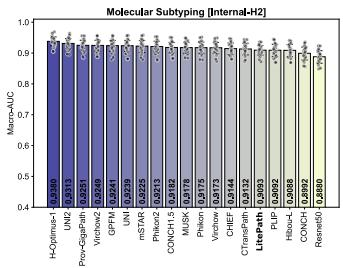

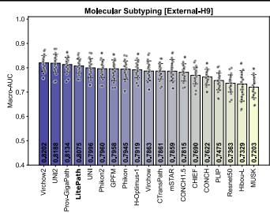

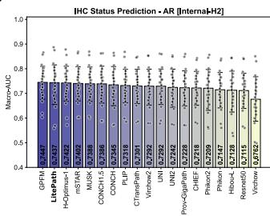

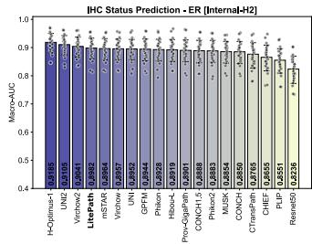

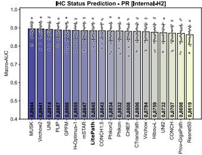

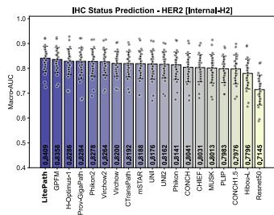

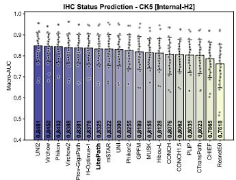  
Figure A1. Comparison of PFMs in terms of Macro-AUC (Part I). a, Results on lung cancer tasks. b, Results on breast cancer tasks.

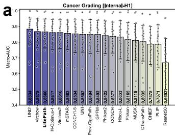

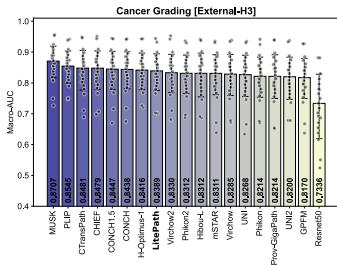

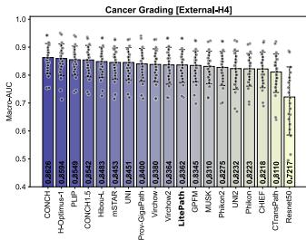

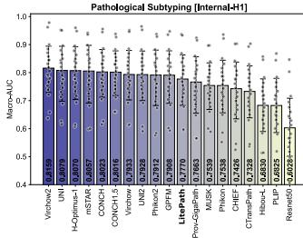

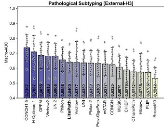

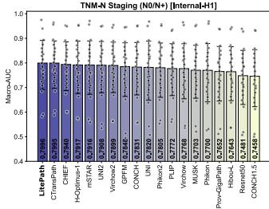

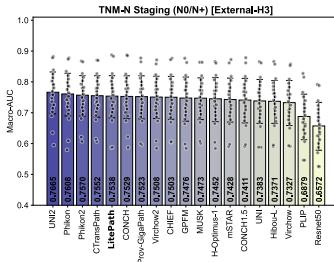

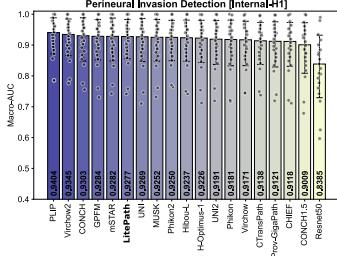

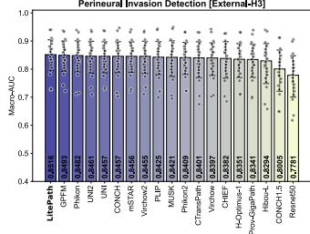

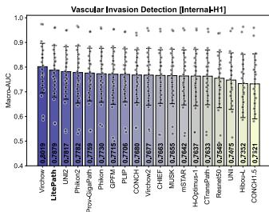

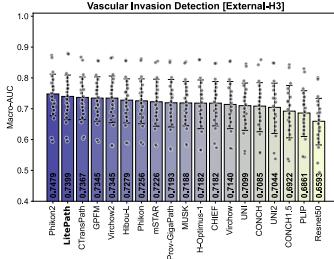

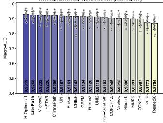

  
Figure A2. Comparison of PFMs in terms of Macro-AUC (Part II). a, Results on gastric cancer tasks. b, Results on colorectal cancer tasks.

  
Figure A3. Performance of inference with partial patches. a–d, Results on lung, breast, gastric, and colorectal cancer tasks, respectively. Each panel shows mean AUC with 95% confidence intervals for three inference strategies evaluated across varying k: baseline (inference using all patches), top-k (inference using k patches with the highest final attention scores from ABMIL), and uniform-k (inference using k patches selected uniformly by index).

Table A2. Summary of the used evaluation tasks. H1–H9 indicates 9 collaborative hospitals. For each cohort, numbers correspond to the respective label set order, representing as “case\_num(slide\_num)”. Parentheses are omitted when each case has only one slide or the task is slide-level.
<table><tr><td>Organ</td><td>Task</td><td>Label Set</td><td>Internal Cohort</td><td>External Cohort</td></tr><tr><td rowspan="6">Lung</td><td>Primary/Metastatic Classification</td><td>Primary, Metastatic</td><td>H1: 389(686), 457(736)</td><td>H5: 237, 256 H6: 465(744), 361(678)</td></tr><tr><td>Cancer Subtyping</td><td>LNET, MIA, ASC, IAC, LUSC, AIS</td><td>H1: 131(170), 121(167), 19(34), 150(181), 123(255), 150(271)</td><td>H1 [Pros.]: 5(31), 150(596), 7(65), 150(1074), 70(713), 127(627)</td></tr><tr><td>NSCLC Subtyping</td><td>LUAD, LUSC</td><td>H1:300,300</td><td></td></tr><tr><td>Lymph Node Metastasis Prediction</td><td>metastasis-positive, metastasis-negative</td><td>H1: 71(231), 250(828)</td><td></td></tr><tr><td>IHC Status Prediction - P63</td><td>P63-negative, P63-positive</td><td>H1: 197(249), 90(105)</td><td>H1 [Pros.]: 24(218), 34(293)</td></tr><tr><td>TNM-N Staging (N0/N+)</td><td>N0, N+</td><td>H2: 343(916), 125(381)</td><td></td></tr><tr><td rowspan="8">Breast</td><td></td><td>I, II, III</td><td>H2: 192(451), 232(727), 43(116)</td><td>H9: 62,23</td></tr><tr><td>pTNM Overall Staging (I/II/III) Molecular Subtyping</td><td>Luminal A, Luminal B1, Luminal B2, TNBC, HER-2</td><td>H2:; 307(310),614(618), 243(268), 589(1932),292(323)</td><td>H9; 102, 89, 24, 101, 102</td></tr><tr><td>IHC Status Prediction - AR</td><td>AR-negative, AR-positive</td><td>H2: 463(731), 677(841)</td><td></td></tr><tr><td>IHC Status Prediction - ER</td><td>ER-negative, ER-positive</td><td>H2: 767(1264), 781(786)</td><td></td></tr><tr><td>IHC Status Prediction - PR</td><td>PR-negative, PR-positive</td><td>H2: 623(1108), 933(950)</td><td></td></tr><tr><td>IHC Status Prediction - HER2</td><td>HER2-negative, HER2-positive</td><td>H2: 511(743), 833(975)</td><td></td></tr><tr><td>IHC Status Prediction - CK5</td><td>CK5-negative, CK5-positive</td><td>H2: 753(859), 208(379)</td><td></td></tr><tr><td>Cancer Grading</td><td></td><td></td><td></td></tr><tr><td rowspan="10">Gastric</td><td></td><td>G1+G2, G3</td><td>H1: 81(82), 318(319)</td><td>H3: 55, 190 H4: 62, 258</td></tr><tr><td>Pathological Subtyping</td><td>SRCC, TAC, NOS</td><td>H1: 163, 166(167), 66(67)</td><td>H3: 59, 0, 195</td></tr><tr><td>TNM-N Staging (N0/N+)</td><td>N0, N+</td><td>H1: 186(188), 212</td><td></td></tr><tr><td>Perineural Invasion Detection</td><td>PNI-positive, PNI-negative</td><td>H1: 255(256), 141(142)</td><td>H3: 85, 175</td></tr><tr><td>Vascular Invasion Detection</td><td></td><td>H1: 197(198), 198(199)</td><td>H3: 156,76</td></tr><tr><td>Normal/Abnormal Classification</td><td>VI-positive, VI-negative Normal, Abnormal</td><td>H7: 733, 1967</td><td>H3:140,90</td></tr><tr><td>Intestinal Metaplasia Classification</td><td>IM, Not IM</td><td>H7: 270, 2430</td><td></td></tr><tr><td>IHC Status Prediction - HER2</td><td>0/1+,2+/3+</td><td>H1+H3+H4: 549, 126</td><td></td></tr><tr><td>IHC Status Prediction - S-100</td><td>0,1+</td><td>H1+H3+H4: 90, 270</td><td></td></tr><tr><td>TNM-N Staging (N0/N+)</td><td>N0, N+</td><td>H8: 367(1848), 230(871)</td><td></td></tr><tr><td rowspan="3">Colon</td><td>TNM-T Staging (T1+T2/T3+T4)</td><td>T1+T2, T3+T4</td><td>H8: 76(319), 519(2391)</td><td></td></tr><tr><td>TNM-T Staging (T1/T2/T3/T4)</td><td>T1, T2, T3, T4</td><td>H8: 20(75), 56(244), 440(2130), 79(261)</td><td></td></tr><tr><td>Consensus Molecular Subtyping</td><td>CMS1, CMS2, CMS3, CMS4</td><td>H8: 76(372), 239(1061), 86(393), 187(857)</td><td></td></tr></table>

Table A3. APS configuration and slide information of each cohort. H1–H9 indicates 9 collaborative hospitals.
<table><tr><td>Organ</td><td>Task</td><td> $\mathrm { A P S } \ ( k _ { u } + k _ { a } )$ </td><td>Cohort</td><td>#patches/case (95% CI)</td></tr><tr><td rowspan="6">Lung</td><td>Primary/Metastatic Classification</td><td>2,000 + 0</td><td>Internal-H1 External-H5 External-H6</td><td>13,495 (507–61,437) 5,007 (109–14,074) 19,817 (469–79,069)</td></tr><tr><td>Cancer Subtyping</td><td>1,000 + 0</td><td>Internal-H1</td><td>20,278 (1,191–94,745)</td></tr><tr><td>NSCLC Subtyping</td><td>1,900 + 100</td><td>Prospective-H1 Internal-H1</td><td>76,646 (2,625–534,209) 13,349 (1,745–44,128)</td></tr><tr><td>Lymph Node Metastasis Prediction</td><td> $1 { , } 9 0 0 + 1 0 0$ </td><td>Internal-H1</td><td>32,229 (5,206–80,441)</td></tr><tr><td>IHC Status Prediction - P63</td><td>4,000 + 0</td><td>Internal-H1 Prospective-H1</td><td>15,619 (1,413–60,663) 154,241 (4,678–790,420)</td></tr><tr><td>TNM-N Staging (N0/N+) pTNM Overall Staging (I/II/II</td><td>950 + 50</td><td>Internal-H2</td><td>38,150 (4,103–115,333)</td></tr><tr><td rowspan="8">Breast</td><td></td><td>4,000 + 0</td><td>External-H9</td><td>9,276 (3,903–16,645)</td></tr><tr><td></td><td></td><td>Internal-H2 Internal-H2</td><td>29,152 (4,087–88,189) 19,223 (3,058–86,073)</td></tr><tr><td>Molecular Subtyping</td><td>0 + 1,000</td><td>External-H9</td><td>9,648 (2,835–18,782)</td></tr><tr><td>IHC Status Prediction - AR</td><td>3,900 + 100</td><td>Internal-H2</td><td>12,288 (2,687–51,146)</td></tr><tr><td>IHC Status Prediction - ER</td><td>1,000 + 0</td><td>Internal-H2</td><td>13,061 (3,269–61,267)</td></tr><tr><td>IHC Status Prediction - PR</td><td>1,950 + 50</td><td>Internal-H2</td><td>13,196 (3,234–57,931)</td></tr><tr><td>IHC Status Prediction - HER2</td><td>2,000 + 0</td><td>Internal-H2</td><td>13,639 (2,591–59,794)</td></tr><tr><td>IHC Status Prediction - CK5</td><td>1,000 + 0</td><td>Internal-H2 Internal-H1</td><td>13,292 (3,767–53,556) 18,489 (8,265–32,935)</td></tr><tr><td rowspan="8">Gastric</td><td>Cancer Grading</td><td>2,900 + 100</td><td>External-H3 External-H4</td><td>9,374 (3,770–15,836) 6,704 (3,250–10,395)</td></tr><tr><td>Pathological Subtyping</td><td>3,000 + 0</td><td>Internal-H1 External-H3</td><td>18,132 (8,486–32,862) 9,364 (3,807–15,774)</td></tr><tr><td>TNM-N Staging (N0/N+)</td><td>1,000 + 0</td><td>Internal-H1 External-H3</td><td>19,424 (6,432–32,850) 9,382 (3,831–15,814)</td></tr><tr><td>Perineural Invasion Detection</td><td>1,000 + 0</td><td>Internal-H1 External-H3</td><td>18,306 (7,118–32,648) 9,419 (3,880–15,863)</td></tr><tr><td>Vascular Invasion Detection</td><td>2,000 + 0</td><td>Internal-H1 External-H3</td><td>19,576 (7,984–34,222) 9,361 (3,745–15,868)</td></tr><tr><td>Normal/Abnormal Classification Intestinal Metaplasia Classification</td><td>1,000 + 0</td><td>Internal-H7</td><td>814 (197–1,891)</td></tr><tr><td></td><td>1,000 + 0</td><td>Internal-H7</td><td>886 (184–2,119)</td></tr><tr><td>IHC Status Prediction - HER2 IHC Status Prediction - S-100</td><td> $3 , 9 5 0 + 5 0$ </td><td>Internal-H1+H3+H4 Internal-H1+H3+H4</td><td>10,610 (3,369–27,183) 16,763 (5,367–32,945)</td></tr><tr><td rowspan="4">Colon</td><td></td><td>2,000 + 0</td><td></td><td></td></tr><tr><td>TNM-N Staging (N0/N+)</td><td>1,000 + 0</td><td>Internal-H8</td><td>53,607 (7,330–158,081)</td></tr><tr><td>TNM-T Staging (T1+T2/T3+T4)</td><td>2,000 + 0</td><td>Internal-H8</td><td>56,659 (6,830–193,282)</td></tr><tr><td>TNM-T Staging (T1/T2/T3/T4)</td><td>1,000 + 0</td><td>Internal-H8</td><td>53,930 (8,944–166,856)</td></tr><tr><td>Consensus Molecular Subtyping</td><td>2,000 + 0</td><td>Internal-H8</td><td></td><td>54,944 (10,250–184,986)</td></tr></table>

Table A4. Hyperparameters for distillation pretraining of LiteFM. Pretraining was conducted on 4×80 GB H800 GPUs.
<table><tr><td></td><td>Hyperparamerter</td><td>Value</td></tr><tr><td rowspan="7">Model</td><td>Input size</td><td>224</td></tr><tr><td>Patch size</td><td>16</td></tr><tr><td>Embedding dim Attention blocks</td><td>384</td></tr><tr><td></td><td>12 6</td></tr><tr><td>Heads</td><td></td></tr><tr><td>MLP ratio</td><td>4</td></tr><tr><td>Output dim Proj. dim for teachers</td><td>1024 2560, 1536, 1536</td></tr><tr><td>Optimization  $\alpha , \beta , \gamma$ </td><td>Iterations Optimizer Total batch size Weight decay Gradient clip Learning rate Scheduler Warmup steps Warmup lr init. Minimum lr</td><td>22.06M 100,000 AdamW 2,048 0.05 1.0 3e-3 CosineLRScheduler 5000 1e-6</td></tr></table>

Table A5. Hyperparameters for training ABMIL.
<table><tr><td>Hyperparameter</td><td>Value</td></tr><tr><td>Hidden dim</td><td>512</td></tr><tr><td>Dropout</td><td>0.25</td></tr><tr><td>Batch size</td><td>1</td></tr><tr><td>Epochs</td><td>50</td></tr><tr><td>Optimizer</td><td>Adam</td></tr><tr><td>Learning rate</td><td>2e-4</td></tr><tr><td>Scheduler</td><td>Cosine</td></tr><tr><td>Weight decay</td><td>1e-5</td></tr><tr><td>Loss</td><td>Cross-entropy</td></tr><tr><td>Early Stopping</td><td>Yes</td></tr></table>

Table A6. Hyperparameters for training APS scoring network.
<table><tr><td>Hyperparameter</td><td>Value</td></tr><tr><td>Hidden dim</td><td>512</td></tr><tr><td>Dropout</td><td>0.25</td></tr><tr><td>Batch size</td><td>1</td></tr><tr><td>Epochs</td><td>100</td></tr><tr><td>Optimizer</td><td>Adam</td></tr><tr><td>Learning rate</td><td>2e-4</td></tr><tr><td>Scheduler</td><td>Cosine</td></tr><tr><td>Weight decay</td><td>1e-5</td></tr><tr><td>Loss</td><td>Soft cross-entropy</td></tr><tr><td>Temperature</td><td>0.7</td></tr><tr><td>#Params.</td><td>0.46M</td></tr><tr><td></td><td></td></tr></table>

Table A7. Overview of four models in LiteFM family.
<table><tr><td>Model Name</td><td>Backbone</td><td>#Params.</td><td>Teachers</td></tr><tr><td>LiteFM-L</td><td>ViT-B</td><td>86.59M</td><td>Virchow2, H-Optimus-1, UNI2</td></tr><tr><td>LiteFM</td><td>ViT-S</td><td>22.06M</td><td>Virchow2, H-Optimus-1, UNI2</td></tr><tr><td>LiteVirchow2</td><td>ViT-S</td><td>22.06M</td><td>Virchow2</td></tr><tr><td>LiteFM-S</td><td>ViT-Ti</td><td>5.72M</td><td>Virchow2, H-Optimus-1, UNI2</td></tr></table>

Table A8. D-Score comparison of models on 37 cohorts.
<table><tr><td>Organ</td><td>Cohort</td><td>LitePath</td><td>Virchow2</td><td>mSTAR</td><td>GPFM</td><td>H-Optimus-1</td><td>UNI</td><td>UNI2</td><td>Phikon2</td><td>CTransPath</td><td>Prov-GigaPath</td><td>Resnet50</td></tr><tr><td rowspan="9">Lung</td><td>Primary/Metastatic Classification [Internal-H1] Primary/Metastatic Classification [External-H5]</td><td>0.9231 0.9099</td><td>0.8619 0.8333</td><td>0.8919 0.9330</td><td>0.8800 0.8424</td><td>0.8365 0.7389</td><td>0.8680 0.8891</td><td>0.8246 0.8470</td><td>0.9089 0.8838</td><td>0.9039 0.8437</td><td>0.8481 0.7223</td><td>0.0000 0.0000</td></tr><tr><td></td><td></td><td></td><td></td><td></td><td></td><td></td><td></td><td>0.8470</td><td></td><td>0.7553</td><td></td></tr><tr><td>Primary/Metastatic Classification [External-H6]</td><td>0.9067</td><td>0.8760</td><td>0.8906</td><td>0.8525</td><td>0.8159</td><td>0.8665</td><td>0.7958</td><td></td><td>0.8101</td><td></td><td>0.0000</td></tr><tr><td>Cancer Subtyping [Internal-H1]</td><td>0.5977</td><td>0.6239</td><td>0.8143</td><td>0.9199</td><td>0.6381</td><td>0.7813</td><td>0.6387</td><td>0.8464</td><td>0.7770</td><td>0.8161</td><td>0.0000</td></tr><tr><td>Cancer Subtyping [Prospective-H1]</td><td>0.6946</td><td>0.7303</td><td>0.3437</td><td>0.2334</td><td>0.8365</td><td>0.1559</td><td>0.5871</td><td>0.0000</td><td>0.0832</td><td>0.4174</td><td>0.5833</td></tr><tr><td>NSCLC Subtyping [Internal-H1]</td><td>0.8934</td><td>0.8400</td><td>0.8021</td><td>0.7625</td><td>0.7612</td><td>0.7967</td><td>0.8701</td><td>0.6004</td><td>0.6715</td><td>0.7122</td><td>0.0000</td></tr><tr><td>Lymph Node Metastasis Prediction [Internal-H1]</td><td>0.9505</td><td>0.7414</td><td>0.7987</td><td>0.7324</td><td>0.8365</td><td>0.7755</td><td>0.7202</td><td>0.7938</td><td>0.9490</td><td>0.6942</td><td>0.0000</td></tr><tr><td>IHC Status Prediction - P63 [Internal-H1]</td><td>0.9248</td><td>0.7734</td><td>0.9330</td><td>0.8462</td><td>0.7455</td><td>0.8818</td><td>0.7420</td><td>0.7974</td><td>0.6631</td><td>0.7823</td><td>0.0000</td></tr><tr><td>IHC Status Prediction - P63 [Prospective-H1]</td><td>0.8227</td><td>0.8370</td><td>0.7701</td><td>0.7460</td><td>0.7928</td><td>0.8021</td><td>0.8701</td><td>0.6592</td><td>0.4524</td><td>0.5113</td><td>0.0000</td></tr><tr><td rowspan="9"></td><td>TNM-N Staging (N0/N+) [Internal-H2]</td><td>0.9506</td><td>0.8760</td><td>0.6971</td><td>0.5539</td><td>0.5600</td><td>0.7308</td><td>0.6459</td><td>0.6623</td><td>0.6197</td><td>0.6202</td><td>0.0000</td></tr><tr><td>pTNM Overall Staging (I/II/III) [Internal-H2]</td><td>0.9198</td><td>0.3838</td><td>0.4464</td><td>0.6451</td><td>0.3984</td><td>0.5094</td><td>0.0000</td><td>0.7041</td><td>0.9929</td><td>0.4567</td><td>0.1665</td></tr><tr><td>Molecular Subtyping [Internal-H2]</td><td>0.4637</td><td>0.6663</td><td>0.6670</td><td>0.6861</td><td>0.8365</td><td>0.6921</td><td>0.7639</td><td>0.6473</td><td>0.5360</td><td>0.6548</td><td>0.0000</td></tr><tr><td>Molecular Subtyping [External-H9]</td><td>0.8610</td><td>0.8760</td><td>0.5809</td><td>0.6749</td><td>0.5778</td><td>0.7237</td><td>0.8571</td><td>0.6873</td><td>0.6208</td><td>0.7933</td><td>0.0000</td></tr><tr><td>IHC Status Prediction - AR [Internal-H2]</td><td>0.9699</td><td>0.4982</td><td>0.8195</td><td>0.9199</td><td>0.7808</td><td>0.5290</td><td>0.3676</td><td>0.3002</td><td>0.5885</td><td>0.3252</td><td>0.0000</td></tr><tr><td>IHC Status Prediction - ER [Internal-H2]</td><td>0.8053</td><td>0.7554</td><td>0.7350</td><td>0.7063</td><td>0.8365</td><td>0.7236</td><td>0.8037</td><td>0.6609</td><td>0.5870</td><td>0.6211</td><td>0.0000</td></tr><tr><td>IHC Status Prediction - PR [Internal-H2]</td><td>0.7255</td><td>0.8760</td><td>0.6842</td><td>0.7256</td><td>0.6338</td><td>0.8627</td><td>0.3390</td><td>0.6486</td><td>0.6091</td><td>0.2410</td><td>0.0000</td></tr><tr><td>IHC Status Prediction - HER2 [Internal-H2]</td><td>0.9990</td><td>0.7849</td><td>0.7847 0.7765</td><td>0.8863</td><td>0.7632</td><td>0.7764</td><td>0.7155</td><td>0.8454</td><td>0.8378</td><td>0.7795</td><td>0.0000</td></tr><tr><td>IHC Status Prediction - CK5 [Internal-H2]</td><td>0.8351</td><td>0.7910</td><td>0.8259</td><td>0.6348</td><td>0.7448</td><td>0.7549</td><td>0.8701 0.8701</td><td>0.7101 0.7698</td><td>0.5024 0.6521</td><td>0.7661</td><td>0.0000</td></tr><tr><td rowspan="10"></td><td>Cancer Grading [Internal-H1] Cancer Grading [External-H3]</td><td>0.9249 0.9252</td><td>0.7955 0.7714</td><td>0.8073</td><td>0.7868 0.6920</td><td>0.7598 0.7938</td><td>0.8019 0.7753</td><td>0.6751</td><td>0.8083</td><td>0.9929</td><td>0.7326 0.6738</td><td>0.0000 0.0000</td></tr><tr><td>Cancer Grading [External-H4]</td><td>0.8443</td><td>0.7432</td><td>0.8464</td><td>0.7690</td><td></td><td>0.8454</td><td>0.6614</td><td>0.7360</td><td>0.6721</td><td>0.7466</td><td>0.0000</td></tr><tr><td>Pathological Subtyping [Internal-H1]</td><td>0.8332</td><td>0.8760</td><td>0.8925</td><td></td><td>0.8365</td><td>0.9016</td><td>0.7847</td><td>0.8351</td><td>0.6364</td><td>0.6741</td><td>0.0000</td></tr><tr><td>Pathological Subtyping [External-H3]</td><td>0.6426</td><td>0.7536</td><td>0.5391</td><td>0.8218 0.8112</td><td>0.8050</td><td>0.5757</td><td>0.7462</td><td>0.5692</td><td>0.2831</td><td>0.5096</td><td>0.0000</td></tr><tr><td>TNM-N Staging (N0/N+) [Internal-H1]</td><td>0.9996</td><td>0.7258</td><td>0.8015</td><td>0.6784</td><td>0.8365</td><td>0.6401</td><td>0.7355</td><td>0.6157</td><td>0.9922</td><td>0.3168</td><td>0.0000</td></tr><tr><td></td><td>0.8944</td><td>0.7624</td><td>0.7495</td><td>0.7761</td><td>0.7202</td><td>0.7134</td><td>0.8701</td><td>0.8597</td><td>0.9002</td><td>0.7551</td><td>0.0000</td></tr><tr><td>TNM-N Staging (N0/N+) [External-H3] Perineural Invasion Detection [Internal-H1]</td><td>0.9361</td><td>0.8760</td><td>0.8783</td><td>0.8673</td><td>0.6885</td><td>0.8664</td><td>0.7440</td><td>0.8502</td><td>0.7985</td><td>0.6742</td><td>0.0000</td></tr><tr><td>Perineural Invasion Detection [External-H3]</td><td>0.9992</td><td>0.8110</td><td>0.8649</td><td>0.8941</td><td>0.7427</td><td>0.8660</td><td>0.8112</td><td>0.8103</td><td>0.8527</td><td>0.6703</td><td>0.0000</td></tr><tr><td>Vascular Invasion Detection [Internal-H1]</td><td>0.9993</td><td>0.4698</td><td>0.4213</td><td>0.5760</td><td>0.6652 0.3675</td><td>0.0000</td><td>0.7491</td><td>0.7296</td><td>0.4260</td><td>0.6241</td><td>0.2160</td></tr><tr><td>Vascular Invasion Detection [External-H3]</td><td>0.9171</td><td>0.7554</td><td>0.6890</td><td>0.7939</td><td>0.5791</td><td>0.5633</td><td>0.4734</td><td>0.9330</td><td>0.8796</td><td>0.6028</td><td>0.0000</td></tr><tr><td>Normal/Abnormal Classification [Internal-H7]</td><td>0.9186</td><td>0.7633</td><td>0.8052</td><td>0.6664</td><td>0.8365</td><td>0.7500</td><td>0.6090</td><td>0.6643</td><td>0.8267</td><td>0.5798</td><td>0.0000</td></tr><tr><td>Intestinal Metaplasia Classification [Internal-H7]</td><td>0.9533</td><td>0.8358</td><td>0.4812</td><td>0.0000</td><td>0.8365</td><td>0.3565</td><td>0.6804</td><td>0.6722</td><td>0.3814</td><td>0.5710</td><td>0.1618</td></tr><tr><td>IHC Status Prediction - HER2 [Internal-H1+H3+H4]</td><td>0.6546</td><td>0.4819</td><td>0.6664</td><td>0.9199</td><td>0.2213</td><td>0.7523</td><td>0.6070</td><td>0.6368</td><td>0.3144</td><td>0.8439</td><td>0.0000</td></tr><tr><td>IHC Status Prediction - S-100 [Internal-H1+H3+H4]</td><td>0.7785</td><td>0.8760</td><td>0.7940</td><td>0.6150</td><td>0.3021</td><td>0.7256</td><td>0.7496</td><td>0.0779</td><td>0.7061</td><td>0.6709</td><td>0.0000</td></tr><tr><td>TNM-N Staging (N0/N+) [Internal-H8]</td><td>0.7669</td><td>0.6692</td><td>0.7010</td><td>0.5870</td><td>0.5702</td><td>0.6877</td><td>0.4351</td><td>0.5134 0.4975</td><td>0.9929</td><td>0.6707</td><td>0.0000</td></tr><tr><td>Colorectal TNM-T Staging (T1/T2/T3/T4) [Internal-H8] Consensus Molecular Subtyping [Internal-H8]</td><td>TNM-T Staging (T1+T2/T3+T4) [Internal-H8]</td><td>0.9505 0.7381 0.9008 0.8158</td><td>0.7010 0.6907</td><td>0.7670 0.6654</td><td>0.8365</td><td>0.6639</td><td>0.6297 0.6034 0.6985</td></table>

Table A9. Mean AUC (95% CI) of models on Primary/Metastatic Classification of lung cancer. One internal cohort (H1) and two external cohorts (H5, H6) are used for evaluation.
<table><tr><td>Model</td><td>Internal (H1)</td><td>External (H5)</td><td>External (H6)</td></tr><tr><td>Resnet50</td><td>0.8835 (0.8236–0.9329)</td><td>0.6497 (0.5824–0.7129)</td><td>0.6819 (0.6393–0.7225)</td></tr><tr><td>CTransPath</td><td>0.9763 (0.9560–0.9913)</td><td>0.8428 (0.8010–0.8825)</td><td>0.8680 (0.8415–0.8922)</td></tr><tr><td>CONCH</td><td>0.9763 (0.9524–0.9922)</td><td>0.8610 (0.8190–0.8990)</td><td>0.8744 (0.8434–0.9000)</td></tr><tr><td>Phikon</td><td>0.9822 (0.9595–0.9968)</td><td>0.8718 (0.8326–0.9093)</td><td>0.8657 (0.8321–0.8951)</td></tr><tr><td>PLIP</td><td>0.9528 (0.9189–0.9799)</td><td>0.8177 (0.7403–0.8772)</td><td>0.7619 (0.7108–0.8038)</td></tr><tr><td>UNI</td><td>0.9785 (0.9579–0.9932)</td><td>0.8690 (0.8253–0.9082)</td><td>0.8968 (0.8601–0.9235)</td></tr><tr><td>Virchow</td><td>0.9756 (0.9524–0.9921)</td><td>0.8221 (0.7385–0.8771)</td><td>0.8575 (0.8239–0.8880)</td></tr><tr><td>Prov-GigaPath</td><td>0.9855 (0.9658–0.9974)</td><td>0.8413 (0.7904–0.8824)</td><td>0.8849 (0.8531–0.9143)</td></tr><tr><td>Hibou-L</td><td>0.9773 (0.9546–0.9938)</td><td>0.7905 (0.7395–0.8391)</td><td>0.8453 (0.8106–0.8814)</td></tr><tr><td>mSTAR</td><td>0.9815 (0.9599–0.9951)</td><td>0.8811 (0.8371–0.9166)</td><td>0.9034 (0.8674–0.9277)</td></tr><tr><td>GPFM</td><td>0.9815 (0.9614–0.9949)</td><td>0.8595 (0.8209–0.8974)</td><td>0.8963 (0.8705–0.9204)</td></tr><tr><td>Virchow2</td><td>0.9846 (0.9676–0.9960)</td><td>0.8686 (0.8278–0.9070)</td><td>0.9152 (0.8902–0.9371)</td></tr><tr><td>CHIEF</td><td>0.9755 (0.9541–0.9914)</td><td>0.8372 (0.7942–0.8772)</td><td>0.8339 (0.8030–0.8630)</td></tr><tr><td>Phikon2</td><td>0.9835 (0.9602–0.9972)</td><td>0.8676 (0.8297–0.9018)</td><td>0.8914 (0.8596–0.9175)</td></tr><tr><td>CONCH1.5</td><td>0.9783 (0.9579–0.9929)</td><td>0.8592 (0.8125–0.9030)</td><td>0.8683 (0.8401–0.8937)</td></tr><tr><td>MUSK</td><td>0.9688 (0.9380–0.9896)</td><td>0.8079 (0.7606–0.8529)</td><td>0.8157 (0.7768–0.8502)</td></tr><tr><td>UNI2</td><td>0.9805 (0.9579–0.9948)</td><td>0.8743 (0.8359–0.9116)</td><td>0.8932 (0.8635–0.9189)</td></tr><tr><td>H-Optimus-1</td><td>0.9865 (0.9717–0.9962)</td><td>0.8513 (0.8051–0.8965)</td><td>0.9088 (0.8845–0.9307)</td></tr><tr><td>LitePath</td><td>0.9778 (0.9565–0.9925)</td><td>0.8585 (0.8194–0.8946)</td><td>0.8913 (0.8633–0.9147)</td></tr><tr><td>LiteFM-S</td><td>0.9787 (0.9566–0.9936)</td><td>0.8479 (0.8032–0.8875)</td><td>0.8922 (0.8625–0.9160)</td></tr><tr><td>LiteVirchow2</td><td>0.9808 (0.9588–0.9953)</td><td>0.8632 (0.8157–0.9058)</td><td>0.8976 (0.8701–0.9217)</td></tr><tr><td>LiteFM</td><td>0.9796 (0.9601–0.9932)</td><td>0.8598 (0.8217–0.8955)</td><td>0.8913 (0.8625–0.9154)</td></tr><tr><td>LiteFM-L</td><td>0.9815 (0.9627–0.9950)</td><td>0.8653 (0.8216–0.9085)</td><td>0.9053 (0.8825–0.9265)</td></tr><tr><td></td><td></td><td></td><td></td></tr></table>

Table A10. Mean AUC (95% CI) of models on Cancer Subtyping of lung cancer. One internal cohort (H1) and one prospective cohort (H1) are used for evaluation.
<table><tr><td>Model</td><td>Internal (H1)</td><td>Prospective (H1)</td></tr><tr><td>Resnet50</td><td>0.8218 (0.7623–0.8689)</td><td>0.8029 (0.7418–0.8425)</td></tr><tr><td>CTransPath</td><td>0.9035 (0.8698–0.9331)</td><td>0.7584 (0.6846–0.8074)</td></tr><tr><td>CONCH</td><td>0.9033 (0.8610–0.9364)</td><td>0.8347 (0.7998–0.8732)</td></tr><tr><td>Phikon</td><td>0.9148 (0.8757–0.9472)</td><td>0.7812 (0.7302–0.8201)</td></tr><tr><td>PLIP</td><td>0.8616 (0.8138–0.9011)</td><td>0.8008 (0.7439–0.8423)</td></tr><tr><td>UNI</td><td>0.9099 (0.8691–0.9415)</td><td>0.7650 (0.6846–0.8278)</td></tr><tr><td>Virchow</td><td>0.8753 (0.7836–0.9313)</td><td>0.8045 (0.7350–0.8460)</td></tr><tr><td>Prov-GigaPath</td><td>0.9236 (0.8902–0.9525)</td><td>0.7936 (0.7475–0.8336)</td></tr><tr><td>Hibou-L</td><td>0.9197 (0.8816–0.9496)</td><td>0.7837 (0.7166–0.8289)</td></tr><tr><td>mSTAR</td><td>0.9141 (0.8775–0.9441)</td><td>0.7826 (0.7153–0.8299)</td></tr><tr><td>GPFM</td><td>0.9291 (0.9012–0.9546)</td><td>0.7724 (0.6934–0.8199)</td></tr><tr><td>Virchow2</td><td>0.8954 (0.8374–0.9377)</td><td>0.8269 (0.7664–0.8721)</td></tr><tr><td>CHIEF</td><td>0.9010 (0.8672–0.9316)</td><td>0.7369 (0.6687–0.7847)</td></tr><tr><td>Phikon2</td><td>0.9181 (0.8863–0.9459)</td><td>0.7526 (0.7045–0.7948)</td></tr><tr><td>CONCH1.5</td><td>0.8960 (0.8453–0.9371)</td><td>0.8476 (0.8082–0.8771)</td></tr><tr><td>MUSK</td><td>0.8843 (0.8466–0.9169)</td><td>0.8513 (0.8232–0.8755)</td></tr><tr><td>UNI2</td><td>0.8979 (0.8590–0.9312)</td><td>0.8114 (0.7191–0.8658)</td></tr><tr><td>H-Optimus-1</td><td>0.9012 (0.8538–0.9386)</td><td>0.8436 (0.8069–0.8770)</td></tr><tr><td>LitePath</td><td>0.8824 (0.8374–0.9172)</td><td>0.8133 (0.7794–0.8476)</td></tr><tr><td>LiteFM-S</td><td>0.8838 (0.8303–0.9208)</td><td>0.8034 (0.7722–0.8333)</td></tr><tr><td>LiteVirchow2</td><td>0.8884 (0.8541–0.9189)</td><td>0.7997 (0.7528–0.8350)</td></tr><tr><td>LiteFM</td><td>0.8829 (0.8384–0.9168)</td><td>0.8122 (0.7760–0.8484)</td></tr><tr><td>LiteFM-L</td><td>0.8847 (0.8430–0.9182)</td><td>0.8207 (0.7933–0.8479)</td></tr></table>

Table A11. Mean AUC (95% CI) of models on NSCLC Subtyping and Lymph Node Metastasis Prediction of lung cancer. One internal cohort (H1) is used for evaluation.
<table><tr><td>Model</td><td>NSCLC Subtyping</td><td>Lymph Node Metastasis</td></tr><tr><td>Resnet50</td><td>0.8605 (0.7910–0.9202)</td><td>0.5777 (0.4158–0.7325)</td></tr><tr><td>CTransPath</td><td>0.9348 (0.8831–0.9742)</td><td>0.7738 (0.6361–0.8932)</td></tr><tr><td>CONCH</td><td>0.9530 (0.9116–0.9841)</td><td>0.7845 (0.6582–0.8908)</td></tr><tr><td>Phikon</td><td>0.9585 (0.9197–0.9856)</td><td>0.7496 (0.5907–0.8822)</td></tr><tr><td>PLIP</td><td>0.9078 (0.8465–0.9568)</td><td>0.7800 (0.6613–0.8842)</td></tr><tr><td>UNI</td><td>0.9568 (0.9131–0.9852)</td><td>0.7456 (0.6128–0.8684)</td></tr><tr><td>Virchow</td><td>0.9493 (0.9055–0.9825)</td><td>0.7296 (0.5691–0.8673)</td></tr><tr><td>Prov-GigaPath</td><td>0.9540 (0.9112–0.9839)</td><td>0.7412 (0.6021–0.8653)</td></tr><tr><td>Hibou-L</td><td>0.9064 (0.7811–0.9756)</td><td>0.6739 (0.4719–0.8236)</td></tr><tr><td>mSTAR</td><td>0.9575 (0.9107–0.9875)</td><td>0.7512 (0.6152–0.8756)</td></tr><tr><td>GPFM</td><td>0.9536 (0.9050–0.9852)</td><td>0.7378 (0.5786–0.8689)</td></tr><tr><td>Virchow2</td><td>0.9700 (0.9371–0.9927)</td><td>0.7490 (0.5907–0.8811)</td></tr><tr><td>CHIEF</td><td>0.9476 (0.9038–0.9809)</td><td>0.7367 (0.5847–0.8686)</td></tr><tr><td>Phikon2</td><td>0.9308 (0.8632–0.9757)</td><td>0.7501 (0.6050–0.8784)</td></tr><tr><td>CONCH1.5</td><td>0.9540 (0.9127–0.9830)</td><td>0.7702 (0.6238–0.8902)</td></tr><tr><td>MUSK</td><td>0.9581 (0.9196–0.9852)</td><td>0.7154 (0.5855–0.8333)</td></tr><tr><td>UNI2</td><td>0.9752 (0.9464–0.9940)</td><td>0.7449 (0.5960–0.8726)</td></tr><tr><td>H-Optimus-1</td><td>0.9638 (0.9265–0.9901)</td><td>0.7839 (0.6403–0.9034)</td></tr><tr><td>LitePath</td><td>0.9619 (0.9209–0.9887)</td><td>0.7729 (0.6442–0.8848)</td></tr><tr><td>LiteFM-S</td><td>0.9578 (0.9162–0.9856)</td><td>0.7385 (0.6050–0.8541)</td></tr><tr><td>LiteVirchow2</td><td>0.9646 (0.9298–0.9894)</td><td>0.7463 (0.6132–0.8640)</td></tr><tr><td>LiteFM</td><td>0.9603 (0.9195–0.9870)</td><td>0.7509 (0.6211–0.8658)</td></tr><tr><td>LiteFM-L</td><td>0.9597 (0.9179–0.9899)</td><td>0.7596 (0.6261–0.8773)</td></tr></table>

Table A12. Mean AUC (95% CI) of models on IHC Status Prediction - P63 of lung cancer. One internal cohort (H1) and one prospective cohort (H1) are used for evaluation.
<table><tr><td>Model</td><td>Internal (H1)</td><td>Prospective (H1)</td></tr><tr><td>Resnet50</td><td>0.5066 (0.3278–0.6867)</td><td>0.6163 (0.4639–0.7674)</td></tr><tr><td>CTransPath</td><td>0.7134 (0.5446–0.8607)</td><td>0.7487 (0.5940–0.8787)</td></tr><tr><td>CONCH</td><td>0.7768 (0.6255–0.9053)</td><td>0.8489 (0.7139–0.9449)</td></tr><tr><td>Phikon</td><td>0.7981 (0.6220–0.9256)</td><td>0.9134 (0.8026–0.9820)</td></tr><tr><td>PLIP</td><td>0.6540 (0.4778–0.8172)</td><td>0.7500 (0.6083–0.8713)</td></tr><tr><td>UNI</td><td>0.8108 (0.6655–0.9268)</td><td>0.8843 (0.7677–0.9667)</td></tr><tr><td>Virchow</td><td>0.7659 (0.5965–0.8974)</td><td>0.8719 (0.6540–0.9770)</td></tr><tr><td>Prov-GigaPath</td><td>0.7997 (0.6542–0.9163)</td><td>0.7952 (0.6402–0.9200)</td></tr><tr><td>Hibou-L</td><td>0.6903 (0.5276–0.8347)</td><td>0.8446 (0.6972–0.9498)</td></tr><tr><td>mSTAR</td><td>0.8305 (0.6882–0.9375)</td><td>0.8725 (0.7212–0.9640)</td></tr><tr><td>GPFM</td><td>0.8018 (0.6316–0.9231)</td><td>0.8675 (0.7301–0.9555)</td></tr><tr><td>Virchow2</td><td>0.7886 (0.6227–0.9255)</td><td>0.9177 (0.7988–0.9863)</td></tr><tr><td>CHIEF</td><td>0.7338 (0.5574–0.8772)</td><td>0.7815 (0.6414–0.9018)</td></tr><tr><td>Phikon2</td><td>0.7787 (0.6403–0.8996)</td><td>0.8318 (0.7047–0.9338)</td></tr><tr><td>CONCH1.5</td><td>0.7694 (0.6127–0.8977)</td><td>0.7936 (0.6618–0.9022)</td></tr><tr><td>MUSK</td><td>0.6876 (0.4968–0.8494)</td><td>0.8390 (0.6870–0.9526)</td></tr><tr><td>UNI2</td><td>0.7780 (0.6397–0.8947)</td><td>0.9334 (0.8547–0.9855)</td></tr><tr><td>H-Optimus-1</td><td>0.7916 (0.6276–0.9194)</td><td>0.9150 (0.8012–0.9869)</td></tr><tr><td>LitePath</td><td>0.8041 (0.6553–0.9202)</td><td>0.8716 (0.7627–0.9554)</td></tr><tr><td>LiteFM-S</td><td>0.7630 (0.6080–0.8914)</td><td>0.8800 (0.7757–0.9583)</td></tr><tr><td>LiteVirchow2</td><td>0.7794 (0.6151–0.9093)</td><td>0.8723 (0.7649–0.9548)</td></tr><tr><td>LiteFM</td><td>0.8072 (0.6578–0.9223)</td><td>0.8696 (0.7621–0.9534)</td></tr><tr><td>LiteFM-L</td><td>0.7959 (0.6451–0.9188)</td><td>0.8465 (0.7302–0.9370)</td></tr></table>

Table A13. Mean AUC (95% CI) of models on TNM-N Staging (N0/N+) of breast cancer. One internal cohort (H2) and one external cohort (H9) are used for evaluation.
<table><tr><td>Model</td><td>Internal (H2)</td><td>External (H9)</td></tr><tr><td>Resnet50</td><td>0.4102 (0.2721–0.5560)</td><td>0.4696 (0.3390–0.6026)</td></tr><tr><td>CTransPath</td><td>0.6381 (0.4829–0.7879)</td><td>0.6178 (0.4637–0.7656)</td></tr><tr><td>CONCH</td><td>0.6741 (0.5209–0.8107)</td><td>0.6884 (0.5491–0.8155)</td></tr><tr><td>Phikon</td><td>0.6572 (0.4568–0.8069)</td><td>0.6561 (0.5108–0.7953)</td></tr><tr><td>PLIP</td><td>0.6397 (0.4982–0.7705)</td><td>0.6199 (0.4686–0.7633)</td></tr><tr><td>UNI</td><td>0.7035 (0.5637–0.8317)</td><td>0.7191 (0.5766–0.8453)</td></tr><tr><td>Virchow</td><td>0.6125 (0.4388–0.8043)</td><td>0.6414 (0.4893–0.7820)</td></tr><tr><td>Prov-GigaPath</td><td>0.6792 (0.5091–0.8185)</td><td>0.6703 (0.5191–0.8086)</td></tr><tr><td>Hibou-L</td><td>0.5502 (0.4112–0.6870)</td><td>0.5464 (0.3765–0.7189)</td></tr><tr><td>mSTAR</td><td>0.6885 (0.5410–0.8249)</td><td>0.7008 (0.5630–0.8259)</td></tr><tr><td>GPFM</td><td>0.6292 (0.4225–0.7969)</td><td>0.6804 (0.5390–0.8134)</td></tr><tr><td>Virchow2</td><td>0.7949 (0.6375–0.9077)</td><td>0.6748 (0.5287–0.8080)</td></tr><tr><td>CHIEF</td><td>0.7082 (0.5751–0.8333)</td><td>0.6349 (0.4821–0.7769)</td></tr><tr><td>Phikon2</td><td>0.6731 (0.5285–0.8060)</td><td>0.6651 (0.5142–0.8015)</td></tr><tr><td>CONCH1.5</td><td>0.6795 (0.5420–0.8047)</td><td>0.6627 (0.5138–0.7982)</td></tr><tr><td>MUSK</td><td>0.5034 (0.3744–0.6316)</td><td>0.5795 (0.4287–0.7262)</td></tr><tr><td>UNI2</td><td>0.6865 (0.5372–0.8232)</td><td>0.6889 (0.5437–0.8275)</td></tr><tr><td>H-Optimus-1</td><td>0.6565 (0.5068–0.7952)</td><td>0.6795 (0.5224–0.8206)</td></tr><tr><td>LitePath</td><td>0.7742 (0.6178–0.9034)</td><td>0.6434 (0.4880–0.7984)</td></tr><tr><td>LiteFM-S</td><td>0.7665 (0.6247–0.8832)</td><td>0.6496 (0.4982–0.7879)</td></tr><tr><td>LiteVirchow2</td><td>0.8129 (0.7004–0.9041)</td><td>0.6724 (0.5133–0.8033)</td></tr><tr><td>LiteFM</td><td>0.7657 (0.6262–0.8839)</td><td>0.6397 (0.4850–0.7846)</td></tr><tr><td>LiteFM-L</td><td>0.7607 (0.6263–0.8751)</td><td>0.6287 (0.4731–0.7650)</td></tr></table>

Table A14. Mean AUC (95% CI) of models on pTNM Overall Staging (I/II/III) of breast cancer. One internal cohort (H2) is used for evaluation.
<table><tr><td>Model</td><td>Internal (H2)</td></tr><tr><td>Resnet50</td><td>0.5438 (0.4330–0.6525)</td></tr><tr><td>CTransPath</td><td>0.6142 (0.5027–0.7206)</td></tr><tr><td>CONCH</td><td>0.5560 (0.4489–0.6708)</td></tr><tr><td>Phikon</td><td>0.5890 (0.4820–0.6917)</td></tr><tr><td>PLIP</td><td>0.6015 (0.4906–0.7098)</td></tr><tr><td>UNI</td><td>0.5743 (0.4631–0.6843)</td></tr><tr><td>Virchow</td><td>0.5306 (0.4281–0.6407)</td></tr><tr><td>Prov-GigaPath</td><td>0.5732 (0.4510–0.6897)</td></tr><tr><td>Hibou-L</td><td>0.5279 (0.4234–0.6372)</td></tr><tr><td>mSTAR</td><td>0.5686 (0.4559–0.6818)</td></tr><tr><td>GPFM</td><td>0.5876 (0.4790–0.6923)</td></tr><tr><td>Virchow2</td><td>0.5652 (0.4518–0.6765)</td></tr><tr><td>CHIEF</td><td>0.5642 (0.4502–0.6787)</td></tr><tr><td>Phikon2</td><td>0.5923 (0.4828–0.7004)</td></tr><tr><td>CONCH1.5</td><td>0.6053 (0.4945–0.7185)</td></tr><tr><td>MUSK</td><td>0.6026 (0.4946–0.7137)</td></tr><tr><td>UNI2</td><td>0.5326 (0.4210–0.6467)</td></tr><tr><td>H-Optimus-1</td><td>0.5684 (0.4626–0.6763)</td></tr><tr><td>LitePath</td><td>0.6070 (0.4923–0.7170)</td></tr><tr><td>LiteFM-S</td><td>0.6083 (0.4954–0.7162)</td></tr><tr><td>LiteVirchow2</td><td>0.6004 (0.5011–0.7007)</td></tr><tr><td>LiteFM</td><td>0.6013 (0.4909–0.7110)</td></tr><tr><td>LiteFM-L</td><td></td></tr><tr><td></td><td>0.5991 (0.4746–0.7143)</td></tr></table>

Table A15. Mean AUC (95% CI) of models on Molecular Subtyping of breast cancer. One internal cohort (H2) and one external cohort (H9) are used for evaluation.
<table><tr><td>Model</td><td>Internal (H2)</td><td>External (H9)</td></tr><tr><td>Resnet50</td><td>0.8880 (0.8670–0.9077)</td><td>0.7363 (0.7001–0.7706)</td></tr><tr><td>CTransPath</td><td>0.9132 (0.8939–0.9316)</td><td>0.7861 (0.7532–0.8171)</td></tr><tr><td>CONCH</td><td>0.8992 (0.8775–0.9196)</td><td>0.7622 (0.7292–0.7935)</td></tr><tr><td>Phikon</td><td>0.9175 (0.8982–0.9356)</td><td>0.7945 (0.7532–0.8277)</td></tr><tr><td>PLIP</td><td>0.9092 (0.8881–0.9285)</td><td>0.7475 (0.7092–0.7786)</td></tr><tr><td>UNI</td><td>0.9239 (0.9049–0.9411)</td><td>0.7996 (0.7592–0.8377)</td></tr><tr><td>Virchow</td><td>0.9173 (0.8990–0.9343)</td><td>0.7863 (0.7464–0.8281)</td></tr><tr><td>Prov-GigaPath</td><td>0.9251 (0.9077–0.9416)</td><td>0.8134 (0.7817–0.8433)</td></tr><tr><td>Hibou-L</td><td>0.9088 (0.8881–0.9277)</td><td>0.7329 (0.6631–0.7885)</td></tr><tr><td>mSTAR</td><td>0.9225 (0.9017–0.9408)</td><td>0.7859 (0.7453–0.8340)</td></tr><tr><td>GPFM</td><td>0.9241 (0.9055–0.9410)</td><td>0.7958 (0.7469–0.8323)</td></tr><tr><td>Virchow2</td><td>0.9249 (0.9065–0.9414)</td><td>0.8202 (0.7850–0.8503)</td></tr><tr><td>CHIEF</td><td>0.9144 (0.8949–0.9327)</td><td>0.7690 (0.7342–0.8022)</td></tr><tr><td>Phikon2</td><td>0.9213 (0.9032–0.9383)</td><td>0.7960 (0.7594–0.8322)</td></tr><tr><td>CONCH1.5</td><td>0.9182 (0.9006–0.9346)</td><td>0.7815 (0.7455–0.8164)</td></tr><tr><td>MUSK</td><td>0.9178 (0.8993–0.9351)</td><td>0.7203 (0.6763–0.7720)</td></tr><tr><td>UNI2</td><td>0.9313 (0.9148–0.9465)</td><td>0.8188 (0.7816–0.8554)</td></tr><tr><td>H-Optimus-1</td><td>0.9380 (0.9232–0.9523)</td><td>0.7919 (0.7588–0.8315)</td></tr><tr><td>LitePath</td><td>0.9093 (0.8932–0.9242)</td><td>0.8075 (0.7778–0.8363)</td></tr><tr><td>LiteFM-S</td><td>0.9055 (0.8881–0.9221)</td><td>0.7961 (0.7668–0.8228)</td></tr><tr><td>LiteVirchow2</td><td>0.9112 (0.8957–0.9262)</td><td>0.8112 (0.7830–0.8364)</td></tr><tr><td>LiteFM</td><td>0.9106 (0.8947–0.9256)</td><td>0.8037 (0.7733–0.8333)</td></tr><tr><td>LiteFM-L</td><td>0.9137 (0.8971–0.9296)</td><td>0.8214 (0.7926–0.8466)</td></tr></table>

Table A16. Mean AUC (95% CI) of models on IHC status prediction tasks (AR, ER, PR, HER2, CK5) of breast cancer. One internal cohort (H2) is used for evaluation.
<table><tr><td>Model</td><td>AR</td><td>ER</td><td>PR</td><td>HER2</td><td>CK5</td></tr><tr><td>Resnet50</td><td>0.7115 (0.6389–0.7812)</td><td>0.8236 (0.7728–0.8697)</td><td>0.8619 (0.8095–0.9078)</td><td>0.7145 (0.6520–0.7732)</td><td>0.7618 (0.6479–0.8552)</td></tr><tr><td>CTransPath</td><td>0.7301 (0.6585–0.7978)</td><td>0.8765 (0.8276–0.9174)</td><td>0.8806 (0.8311–0.9213)</td><td>0.8192 (0.7653–0.8678)</td><td>0.8023 (0.7168–0.8761)</td></tr><tr><td>CONCH</td><td>0.7345 (0.6501–0.8089)</td><td>0.8850 (0.8432–0.9216)</td><td>0.8707 (0.8272–0.9096)</td><td>0.8041 (0.7453–0.8596)</td><td>0.8076 (0.7120–0.8888)</td></tr><tr><td>Phikon</td><td>0.7147 (0.6412–0.7847)</td><td>0.8928 (0.8527–0.9293)</td><td>0.8832 (0.8380–0.9233)</td><td>0.8141 (0.7552–0.8660)</td><td>0.8432 (0.7690–0.9069)</td></tr><tr><td>PLIP</td><td>0.7318 (0.6621–0.7975)</td><td>0.8551 (0.8093–0.8960)</td><td>0.8887 (0.8483–0.9248)</td><td>0.7983 (0.7427–0.8491)</td><td>0.8035 (0.7208–0.8762)</td></tr><tr><td>UNI</td><td>0.7292 (0.6549–0.7987)</td><td>0.8952 (0.8571–0.9289)</td><td>0.8914 (0.8497–0.9288)</td><td>0.8176 (0.7563–0.8714)</td><td>0.8300 (0.7521–0.8986)</td></tr><tr><td>Virchow</td><td>0.6762 (0.5873–0.7676)</td><td>0.8957 (0.8571–0.9304)</td><td>0.8784 (0.8313–0.9202)</td><td>0.8200 (0.7673–0.8681)</td><td>0.8450 (0.7724–0.9085)</td></tr><tr><td>Prov-GigaPath</td><td>0.7228 (0.6492–0.7912)</td><td>0.8901 (0.8500–0.9271)</td><td>0.8698 (0.8227–0.9125)</td><td>0.8284 (0.7572–0.8817)</td><td>0.8381 (0.7648–0.9024)</td></tr><tr><td>Hibou-L</td><td>0.7128 (0.6243–0.7901)</td><td>0.8919 (0.8506–0.9286)</td><td>0.8759 (0.8272–0.9183)</td><td>0.7796 (0.7169–0.8378)</td><td>0.8128 (0.7325–0.8817)</td></tr><tr><td>mSTAR</td><td>0.7402 (0.6696–0.8077)</td><td>0.8964 (0.8561–0.9318)</td><td>0.8847 (0.8378–0.9257)</td><td>0.8188 (0.7584–0.8716)</td><td>0.8322 (0.7526–0.9018)</td></tr><tr><td>GPFM</td><td>0.7447 (0.6764–0.8097)</td><td>0.8944 (0.8533–0.9306)</td><td>0.8866 (0.8393–0.9265)</td><td>0.8358 (0.7826–0.8841)</td><td>0.8189 (0.7368–0.8915)</td></tr><tr><td>Virchow2</td><td>0.7292 (0.6526–0.7982)</td><td>0.9041 (0.8660–0.9370)</td><td>0.8941 (0.8540–0.9307)</td><td>0.8264 (0.7712–0.8775)</td><td>0.8388 (0.7644–0.9034)</td></tr><tr><td>CHIEF</td><td>0.7218 (0.6518–0.7892)</td><td>0.8655 (0.8174–0.9089)</td><td>0.8808 (0.8375–0.9201)</td><td>0.8031 (0.7458–0.8554)</td><td>0.7865 (0.6968–0.8646)</td></tr><tr><td>Phikon2</td><td>0.7209 (0.6312–0.7970)</td><td>0.8883 (0.8479–0.9254)</td><td>0.8834 (0.8295–0.9248)</td><td>0.8278 (0.7679–0.8792)</td><td>0.8255 (0.7382–0.9006)</td></tr><tr><td>CONCH1.5</td><td>0.7386 (0.6608–0.8100)</td><td>0.8888 (0.8459–0.9256)</td><td>0.8843 (0.8450–0.9196)</td><td>0.7976 (0.7378–0.8542)</td><td>0.8062 (0.7238–0.8785)</td></tr><tr><td>MUSK</td><td>0.7388 (0.6672–0.8067)</td><td>0.8854 (0.8451–0.9216)</td><td>0.8944 (0.8544–0.9293)</td><td>0.8013 (0.7409–0.8559)</td><td>0.8155 (0.7414–0.8812)</td></tr><tr><td>UNI2</td><td>0.7242 (0.6438–0.7982)</td><td>0.9105 (0.8740–0.9426)</td><td>0.8732 (0.8248–0.9182)</td><td>0.8162 (0.7612–0.8675)</td><td>0.8481 (0.7718–0.9124)</td></tr><tr><td>H-Optimus-1</td><td>0.7422 (0.6689–0.8101)</td><td>0.9185 (0.8818–0.9501)</td><td>0.8855 (0.8421–0.9246)</td><td>0.8286 (0.7753–0.8789)</td><td>0.8376 (0.7612–0.9039)</td></tr><tr><td>LitePath</td><td>0.7437 (0.6550–0.8155)</td><td>0.8982 (0.8599–0.9334)</td><td>0.8845 (0.8368–0.9235)</td><td>0.8409 (0.7866–0.8892)</td><td>0.8325 (0.7575–0.8997)</td></tr><tr><td>LiteFM-S</td><td>0.7480 (0.6795–0.8122)</td><td>0.8980 (0.8589–0.9327)</td><td>0.8882 (0.8388–0.9273)</td><td>0.8336 (0.7762–0.8862)</td><td>0.8442 (0.7743–0.9053)</td></tr><tr><td>LiteVirchow2</td><td>0.7326 (0.6581–0.8017)</td><td>0.8988 (0.8599–0.9342)</td><td>0.8934 (0.8457–0.9329)</td><td>0.8332 (0.7816–0.8777)</td><td>0.8355 (0.7626–0.8995)</td></tr><tr><td>LiteFM</td><td>0.7393 (0.6498–0.8101)</td><td>0.8985 (0.8593–0.9327) 0.9033 (0.8634–0.9390)</td><td>0.8855 (0.8396–0.9243)</td><td>0.8412 (0.7895–0.8875)</td><td>0.8356 (0.7621–0.9007)</td></tr><tr><td>LiteFM-L</td><td>0.7358 (0.6539–0.8060)</td><td></td><td>0.8896 (0.8447–0.9290)</td><td>0.8362 (0.7811–0.8839)</td><td>0.8463 (0.7678–0.9116)</td></tr></table>

Table A17. Mean AUC (95% CI) of models on Cancer Grading of gastric cancer. One internal cohort (H1) and two external cohorts (H3, H4) are used for evaluation.
<table><tr><td>Model</td><td>Internal (H1)</td><td>External (H3)</td><td>External (H4)</td></tr><tr><td>Resnet50</td><td>0.6693 (0.4992–0.8235)</td><td>0.7336 (0.6193–0.8283)</td><td>0.7217 (0.5854–0.8292)</td></tr><tr><td>CTransPath</td><td>0.8035 (0.6799–0.9075)</td><td>0.8481 (0.7767–0.9053)</td><td>0.8110 (0.7378–0.8754)</td></tr><tr><td>CONCH</td><td>0.8377 (0.7312–0.9283)</td><td>0.8438 (0.7809–0.9009)</td><td>0.8626 (0.8053–0.9130)</td></tr><tr><td>Phikon</td><td>0.8165 (0.6850–0.9254)</td><td>0.8214 (0.7534–0.8836)</td><td>0.8223 (0.7602–0.8771)</td></tr><tr><td>PLIP</td><td>0.7871 (0.6367–0.9106)</td><td>0.8545 (0.7988–0.9037)</td><td>0.8549 (0.7995–0.9040)</td></tr><tr><td>UNI</td><td>0.8502 (0.7371–0.9405)</td><td>0.8268 (0.7559–0.8897)</td><td>0.8451 (0.7827–0.8986)</td></tr><tr><td>Virchow</td><td>0.8678 (0.7686–0.9486)</td><td>0.8285 (0.7593–0.8926)</td><td>0.8380 (0.7759–0.8939)</td></tr><tr><td>Prov-GigaPath</td><td>0.8494 (0.7292–0.9444)</td><td>0.8214 (0.7496–0.8914)</td><td>0.8400 (0.7775–0.8952)</td></tr><tr><td>Hibou-L</td><td>0.8333 (0.6937–0.9367)</td><td>0.8312 (0.7549–0.8963)</td><td>0.8483 (0.7914–0.9000)</td></tr><tr><td>mSTAR</td><td>0.8562 (0.7538–0.9412)</td><td>0.8311 (0.7619–0.8914)</td><td>0.8453 (0.7855–0.8974)</td></tr><tr><td>GPFM</td><td>0.8492 (0.7413–0.9397)</td><td>0.8170 (0.7496–0.8797)</td><td>0.8345 (0.7756–0.8867)</td></tr><tr><td>Virchow2</td><td>0.8616 (0.7589–0.9429)</td><td>0.8330 (0.7684–0.8926)</td><td>0.8364 (0.7676–0.8996)</td></tr><tr><td>CHIEF</td><td>0.7878 (0.6579–0.9007)</td><td>0.8479 (0.7790–0.9037)</td><td>0.8218 (0.7549–0.8819)</td></tr><tr><td>Phikon2</td><td>0.8422 (0.7274–0.9355)</td><td>0.8312 (0.7659–0.8902)</td><td>0.8275 (0.7628–0.8847)</td></tr><tr><td>CONCH1.5</td><td>0.8534 (0.7333–0.9471)</td><td>0.8447 (0.7785–0.9024)</td><td>0.8542 (0.7938–0.9062)</td></tr><tr><td>MUSK</td><td>0.8115 (0.6863–0.9183)</td><td>0.8707 (0.8174–0.9189)</td><td>0.8310 (0.7689–0.8860)</td></tr><tr><td>UNI2</td><td>0.8834 (0.7894–0.9543)</td><td>0.8200 (0.7468–0.8834)</td><td>0.8232 (0.7490–0.8866)</td></tr><tr><td>H-Optimus-1</td><td>0.8617 (0.7550–0.9453)</td><td>0.8416 (0.7781–0.8966)</td><td>0.8594 (0.7984–0.9116)</td></tr><tr><td>LitePath</td><td>0.8660 (0.7641–0.9479)</td><td>0.8389 (0.7755–0.8942)</td><td>0.8362 (0.7732–0.8914)</td></tr><tr><td>LiteFM-S</td><td>0.8409 (0.7256–0.9310)</td><td>0.8448 (0.7782–0.9030)</td><td>0.8400 (0.7785–0.8940)</td></tr><tr><td>LiteVirchow2</td><td>0.8442 (0.7199–0.9346)</td><td>0.8504 (0.7827–0.9076)</td><td>0.8455 (0.7791–0.8990)</td></tr><tr><td>LiteFM</td><td>0.8668 (0.7657–0.9493)</td><td>0.8446 (0.7812–0.9005)</td><td>0.8391 (0.7776–0.8929)</td></tr><tr><td>LiteFM-L</td><td>0.8720 (0.7579–0.9533)</td><td>0.8365 (0.7762–0.8924)</td><td>0.8352 (0.7712–0.8915)</td></tr></table>

Table A18. Mean AUC (95% CI) of models on Pathological Subtyping of gastric cancer. One internal cohort (H1) and one external cohort (H3) are used for evaluation.
<table><tr><td>Model</td><td>Internal (H1)</td><td>External (H3)</td></tr><tr><td>Resnet50</td><td>0.6028 (0.5014–0.7084)</td><td>0.5312 (0.4525–0.6028)</td></tr><tr><td>CTransPath</td><td>0.7328 (0.6386–0.8238)</td><td>0.5752 (0.5004–0.6507)</td></tr><tr><td>CONCH</td><td>0.8023 (0.7120–0.8823)</td><td>0.6225 (0.5476–0.7384)</td></tr><tr><td>Phikon</td><td>0.7538 (0.6563–0.8441)</td><td>0.6558 (0.5774–0.7359)</td></tr><tr><td>PLIP</td><td>0.6825 (0.5859–0.7794)</td><td>0.5706 (0.4985–0.6492)</td></tr><tr><td>UNI</td><td>0.8079 (0.6975–0.8939)</td><td>0.6350 (0.5569–0.7168)</td></tr><tr><td>Virchow</td><td>0.7933 (0.7023–0.8789)</td><td>0.6377 (0.5425–0.7786)</td></tr><tr><td>Prov-GigaPath</td><td>0.7663 (0.6551–0.8567)</td><td>0.6309 (0.5467–0.7185)</td></tr><tr><td>Hibou-L</td><td>0.6830 (0.5897–0.7776)</td><td>0.5735 (0.4807–0.6977)</td></tr><tr><td>mSTAR</td><td>0.8057 (0.6913–0.8972)</td><td>0.6277 (0.5501–0.7108)</td></tr><tr><td>GPFM</td><td>0.7908 (0.6904–0.8777)</td><td>0.6855 (0.5964–0.7704)</td></tr><tr><td>Virchow2</td><td>0.8159 (0.7290–0.8943)</td><td>0.6813 (0.5946–0.7719)</td></tr><tr><td>CHIEF</td><td>0.7426 (0.6348–0.8375)</td><td>0.5879 (0.5011–0.6706)</td></tr><tr><td>Phikon2</td><td>0.7912 (0.6823–0.8802)</td><td>0.6337 (0.5551–0.7170)</td></tr><tr><td>CONCH1.5</td><td>0.8016 (0.7179–0.8775)</td><td>0.7367 (0.6520–0.8228)</td></tr><tr><td>MUSK</td><td>0.7539 (0.6685–0.8349)</td><td>0.6071 (0.5317–0.6866)</td></tr><tr><td>UNI2</td><td>0.7928 (0.7000–0.8770)</td><td>0.6808 (0.5956–0.7640)</td></tr><tr><td>H-Optimus-1</td><td>0.8070 (0.7042–0.8925)</td><td>0.7087 (0.5870–0.8172)</td></tr><tr><td>LitePath</td><td>0.7770 (0.6831–0.8633)</td><td>0.6400 (0.5683–0.7055)</td></tr><tr><td>LiteFM-S</td><td>0.7882 (0.6854–0.8806)</td><td>0.6267 (0.5518–0.7053)</td></tr><tr><td>LiteVirchow2</td><td>0.7974 (0.7092–0.8824)</td><td>0.6457 (0.5832–0.7051)</td></tr><tr><td>LiteFM</td><td>0.7921 (0.6995–0.8762)</td><td>0.6339 (0.5650–0.6996)</td></tr><tr><td>LiteFM-L</td><td>0.7979 (0.7156–0.8806)</td><td>0.6286 (0.5591–0.6992)</td></tr></table>

Table A19. Mean AUC (95% CI) of models on TNM-N Staging (N0/N+) of gastric cancer. One internal cohort (H1) and one external cohorts (H3) are used for evaluation.
<table><tr><td>Model</td><td>Internal (H1)</td><td>External (H3)</td></tr><tr><td>Resnet50</td><td>0.7481 (0.6312–0.8510)</td><td>0.6572 (0.5784–0.7336)</td></tr><tr><td>CTransPath</td><td>0.7995 (0.6966–0.8894)</td><td>0.7552 (0.6857–0.8201)</td></tr><tr><td>CONCH</td><td>0.7831 (0.6701–0.8831)</td><td>0.7529 (0.6809–0.8198)</td></tr><tr><td>Phikon</td><td>0.7700 (0.6419–0.8788)</td><td>0.7608 (0.6899–0.8278)</td></tr><tr><td>PLIP</td><td>0.7772 (0.6673–0.8782)</td><td>0.6879 (0.6125–0.7602)</td></tr><tr><td>UNI</td><td>0.7820 (0.6485–0.8887)</td><td>0.7383 (0.6656–0.8080)</td></tr><tr><td>Virchow</td><td>0.7768 (0.6543–0.8781)</td><td>0.7327 (0.6584–0.8046)</td></tr><tr><td>Prov-GigaPath</td><td>0.7652 (0.6454–0.8670)</td><td>0.7523 (0.6801–0.8198)</td></tr><tr><td>Hibou-L</td><td>0.7643 (0.6468–0.8659)</td><td>0.7371 (0.6655–0.8046)</td></tr><tr><td>mSTAR</td><td>0.7916 (0.6726–0.8894)</td><td>0.7428 (0.6696–0.8122)</td></tr><tr><td>GPFM</td><td>0.7848 (0.6637–0.8819)</td><td>0.7476 (0.6726–0.8157)</td></tr><tr><td>Virchow2</td><td>0.7899 (0.6794–0.8846)</td><td>0.7508 (0.6813–0.8183)</td></tr><tr><td>CHIEF</td><td>0.7940 (0.6879–0.8856)</td><td>0.7503 (0.6790–0.8177)</td></tr><tr><td>Phikon2</td><td>0.7805 (0.6604–0.8810)</td><td>0.7570 (0.6890–0.8204)</td></tr><tr><td>CONCH1.5</td><td>0.7458 (0.6223–0.8540)</td><td>0.7411 (0.6670–0.8115)</td></tr><tr><td>MUSK</td><td>0.7703 (0.6567–0.8718)</td><td>0.7473 (0.6778–0.8130)</td></tr><tr><td>UNI2</td><td>0.7908 (0.6786–0.8870)</td><td>0.7665 (0.6964–0.8322)</td></tr><tr><td>H-Optimus-1</td><td>0.7917 (0.6758–0.8888)</td><td>0.7452 (0.6711–0.8139)</td></tr><tr><td>LitePath</td><td>0.7996 (0.6917–0.8916)</td><td>0.7538 (0.6837–0.8201)</td></tr><tr><td>LiteFM-S</td><td>0.7811 (0.6697–0.8794)</td><td>0.7618 (0.6933–0.8249)</td></tr><tr><td>LiteVirchow2</td><td>0.7990 (0.6909–0.8953)</td><td>0.7503 (0.6807–0.8157)</td></tr><tr><td>LiteFM</td><td>0.7965 (0.6903–0.8907)</td><td>0.7534 (0.6809–0.8210)</td></tr><tr><td>LiteFM-L</td><td>0.8025 (0.6970–0.8971)</td><td>0.7576 (0.6897–0.8210)</td></tr></table>

Table A20. Mean AUC (95% CI) of models on Perineural Invasion Detection of gastric cancer. One internal cohort (H1) and one external cohorts (H3) are used for evaluation.
<table><tr><td>Model</td><td>Internal (H1)</td><td>External (H3)</td></tr><tr><td>Resnet50</td><td>0.8385 (0.7293–0.9320)</td><td>0.7781 (0.7003–0.8477)</td></tr><tr><td>CTransPath</td><td>0.9138 (0.8370–0.9732)</td><td>0.8401 (0.7694–0.8974)</td></tr><tr><td>CONCH</td><td>0.9303 (0.8482–0.9886)</td><td>0.8457 (0.7870–0.8974)</td></tr><tr><td>Phikon</td><td>0.9181 (0.8330–0.9808)</td><td>0.8482 (0.7901–0.9007)</td></tr><tr><td>PLIP</td><td>0.9404 (0.8713–0.9884)</td><td>0.8425 (0.7799–0.8981)</td></tr><tr><td>UNI</td><td>0.9269 (0.8467–0.9863)</td><td>0.8457 (0.7863–0.8974)</td></tr><tr><td>Virchow</td><td>0.9171 (0.8333–0.9772)</td><td>0.8397 (0.7772–0.8937)</td></tr><tr><td>Prov-GigaPath</td><td>0.9121 (0.8290–0.9756)</td><td>0.8341 (0.7703–0.8893)</td></tr><tr><td>Hibou-L</td><td>0.9237 (0.8473–0.9808)</td><td>0.8294 (0.7485–0.8907)</td></tr><tr><td>mSTAR</td><td>0.9282 (0.8487–0.9876)</td><td>0.8456 (0.7885–0.8972)</td></tr><tr><td>GPFM</td><td>0.9284 (0.8519–0.9825)</td><td>0.8493 (0.7921–0.9007)</td></tr><tr><td>Virchow2</td><td>0.9345 (0.8657–0.9844)</td><td>0.8455 (0.7844–0.8992)</td></tr><tr><td>CHIEF</td><td>0.9118 (0.8310–0.9733)</td><td>0.8382 (0.7676–0.8975)</td></tr><tr><td>Phikon2</td><td>0.9250 (0.8495–0.9802)</td><td>0.8409 (0.7814–0.8950)</td></tr><tr><td>CONCH1.5</td><td>0.9009 (0.8087–0.9725)</td><td>0.8005 (0.7213–0.8679)</td></tr><tr><td>MUSK</td><td>0.9252 (0.8479–0.9830)</td><td>0.8421 (0.7733–0.9005)</td></tr><tr><td>UNI2</td><td>0.9191 (0.8372–0.9800)</td><td>0.8461 (0.7853–0.8993)</td></tr><tr><td>H-Optimus-1</td><td>0.9226 (0.8433–0.9803)</td><td>0.8351 (0.7698–0.8906)</td></tr><tr><td>LitePath</td><td>0.9277 (0.8557–0.9828)</td><td>0.8516 (0.7946–0.9041)</td></tr><tr><td>LiteFM-S</td><td>0.9259 (0.8527–0.9811)</td><td>0.8520 (0.7931–0.9035)</td></tr><tr><td>LiteVirchow2</td><td>0.9277 (0.8573–0.9843)</td><td>0.8485 (0.7931–0.8991)</td></tr><tr><td>LiteFM</td><td>0.9249 (0.8505–0.9811)</td><td>0.8518 (0.7941–0.9033)</td></tr><tr><td>LiteFM-L</td><td>0.9226 (0.8381–0.9879)</td><td>0.8405 (0.7834–0.8940)</td></tr></table>

Table A21. Mean AUC (95% CI) of models on Vascular Invasion Detection of gastric cancer. One internal cohort (H1) and one external cohorts (H3) are used for evaluation.
<table><tr><td>Model</td><td>Internal (H1)</td><td>External (H3)</td></tr><tr><td>Resnet50</td><td>0.7549 (0.6353–0.8619)</td><td>0.6593 (0.5826–0.7337)</td></tr><tr><td>CTransPath</td><td>0.7633 (0.6476–0.8693)</td><td>0.7367 (0.6649–0.8030)</td></tr><tr><td>CONCH</td><td>0.7680 (0.6551–0.8705)</td><td>0.7085 (0.6254–0.7845)</td></tr><tr><td>Phikon</td><td>0.7730 (0.6577–0.8764)</td><td>0.7256 (0.6517–0.7968)</td></tr><tr><td>PLIP</td><td>0.7706 (0.6592–0.8744)</td><td>0.6861 (0.6100–0.7584)</td></tr><tr><td>UNI</td><td>0.7475 (0.6287–0.8578)</td><td>0.7099 (0.6299–0.7833)</td></tr><tr><td>Virchow</td><td>0.8019 (0.6956–0.8964)</td><td>0.7140 (0.6354–0.7883)</td></tr><tr><td>Prov-GigaPath</td><td>0.7759 (0.6630–0.8770)</td><td>0.7193 (0.6409–0.7949)</td></tr><tr><td>Hibou-L</td><td>0.7332 (0.5957–0.8517)</td><td>0.7279 (0.6540–0.7968)</td></tr><tr><td>mSTAR</td><td>0.7642 (0.6468–0.8697)</td><td>0.7226 (0.6435–0.7959)</td></tr><tr><td>GPFM</td><td>0.7715 (0.6492–0.8786)</td><td>0.7345 (0.6596–0.8035)</td></tr><tr><td>Virchow2</td><td>0.7677 (0.6456–0.8756)</td><td>0.7345 (0.6559–0.8061)</td></tr><tr><td>CHIEF</td><td>0.7663 (0.6528–0.8703)</td><td>0.7182 (0.6443–0.7883)</td></tr><tr><td>Phikon2</td><td>0.7782 (0.6545–0.8858)</td><td>0.7479 (0.6774–0.8121)</td></tr><tr><td>CONCH1.5</td><td>0.7321 (0.5901–0.8538)</td><td>0.6922 (0.6057–0.7752)</td></tr><tr><td>MUSK</td><td>0.7655 (0.6519–0.8726)</td><td>0.7188 (0.6449–0.7885)</td></tr><tr><td>UNI2</td><td>0.7817 (0.6701–0.8825)</td><td>0.7044 (0.6199–0.7831)</td></tr><tr><td>H-Optimus-1</td><td>0.7637 (0.6435–0.8717)</td><td>0.7182 (0.6355–0.7934)</td></tr><tr><td>LitePath</td><td>0.7879 (0.6772–0.8875)</td><td>0.7399 (0.6646–0.8092)</td></tr><tr><td>LiteFM-S</td><td>0.7846 (0.6609–0.8870)</td><td>0.7387 (0.6484–0.8096)</td></tr><tr><td>LiteVirchow2</td><td>0.7960 (0.6903–0.8918)</td><td>0.7497 (0.6808–0.8144)</td></tr><tr><td>LiteFM</td><td>0.7853 (0.6750–0.8854)</td><td>0.7401 (0.6658–0.8086)</td></tr><tr><td>LiteFM-L</td><td>0.7904 (0.6831–0.8851)</td><td>0.7418 (0.6690–0.8095)</td></tr></table>

Table A22. Mean AUC (95% CI) of models on two gastric cancer tasks (Normal/Abnormal Classification and Intestinal Metaplasia). One internal cohort (H7) is used for evaluation for both tasks.
<table><tr><td>Model</td><td>Normal/Abnormal</td><td>Intestinal Metaplasia</td></tr><tr><td>Resnet50</td><td>0.8704 (0.8319–0.9052)</td><td>0.9354 (0.8899–0.9686)</td></tr><tr><td>CTransPath</td><td>0.9206 (0.8925–0.9450)</td><td>0.9422 (0.8909–0.9720)</td></tr><tr><td>CONCH</td><td>0.8987 (0.8576–0.9299)</td><td>0.9535 (0.9196–0.9755)</td></tr><tr><td>Phikon</td><td>0.9161 (0.8848–0.9438)</td><td>0.9495 (0.9135–0.9733)</td></tr><tr><td>PLIP</td><td>0.8773 (0.8364–0.9135)</td><td>0.9225 (0.8544–0.9629)</td></tr><tr><td>UNI</td><td>0.9187 (0.8820–0.9454)</td><td>0.9421 (0.8940–0.9713)</td></tr><tr><td>Virchow</td><td>0.9012 (0.8628–0.9337)</td><td>0.9554 (0.9208–0.9766)</td></tr><tr><td>Prov-GigaPath</td><td>0.9103 (0.8751–0.9402)</td><td>0.9515 (0.9220–0.9726)</td></tr><tr><td>Hibou-L</td><td>0.9006 (0.8668–0.9306)</td><td>0.9569 (0.9216–0.9758)</td></tr><tr><td>mSTAR</td><td>0.9226 (0.8897–0.9480)</td><td>0.9465 (0.8869–0.9736)</td></tr><tr><td>GPFM</td><td>0.9134 (0.8798–0.9414)</td><td>0.9311 (0.8470–0.9734)</td></tr><tr><td>Virchow2</td><td>0.9232 (0.8908–0.9484)</td><td>0.9615 (0.9337–0.9792)</td></tr><tr><td>CHIEF</td><td>0.9143 (0.8480–0.9449)</td><td>0.9364 (0.8817–0.9673)</td></tr><tr><td>Phikon2</td><td>0.9126 (0.8834–0.9391)</td><td>0.9534 (0.9238–0.9761)</td></tr><tr><td>CONCH1.5</td><td>0.9045 (0.8700–0.9345)</td><td>0.9277 (0.8715–0.9678)</td></tr><tr><td>MUSK</td><td>0.8991 (0.8685–0.9264)</td><td>0.9322 (0.8896–0.9630)</td></tr><tr><td>UNI2</td><td>0.9118 (0.8763–0.9437)</td><td>0.9555 (0.9245–0.9775)</td></tr><tr><td>H-Optimus-1</td><td>0.9319 (0.9017–0.9559)</td><td>0.9631 (0.9426–0.9780)</td></tr><tr><td>LitePath</td><td>0.9268 (0.9013–0.9494)</td><td>0.9617 (0.9406–0.9779)</td></tr><tr><td>LiteFM-S</td><td>0.9214 (0.8921–0.9456)</td><td>0.9643 (0.9450–0.9797)</td></tr><tr><td>LiteVirchow2</td><td>0.9231 (0.8919–0.9488)</td><td>0.9627 (0.9390–0.9788)</td></tr><tr><td>LiteFM</td><td>0.9261 (0.9011–0.9484)</td><td>0.9609 (0.9388–0.9774)</td></tr><tr><td>LiteFM-L</td><td>0.9273 (0.8980–0.9523)</td><td>0.9579 (0.9294–0.9777)</td></tr></table>

Table A23. Mean AUC (95% CI) of models on IHC Status Prediction — HER2 and S-100 of gastric cancer. One internal cohort (H1+H3+H4) is used for evaluation.
<table><tr><td>Model</td><td>HER2</td><td>S-100</td></tr><tr><td>Resnet50</td><td>0.4919 (0.3634–0.6189)</td><td>0.7483 (0.6007–0.8776)</td></tr><tr><td>CTransPath</td><td>0.5205 (0.3963–0.6440)</td><td>0.8181 (0.6728–0.9333)</td></tr><tr><td>CONCH</td><td>0.5317 (0.3975–0.6660)</td><td>0.8477 (0.7216–0.9449)</td></tr><tr><td>Phikon</td><td>0.5899 (0.4587–0.7151)</td><td>0.8219 (0.6687–0.9400)</td></tr><tr><td>PLIP</td><td>0.5362 (0.4018–0.6657)</td><td>0.8046 (0.6634–0.9197)</td></tr><tr><td>UNI</td><td>0.5727 (0.4242–0.7178)</td><td>0.8254 (0.6687–0.9433)</td></tr><tr><td>Virchow</td><td>0.5429 (0.4190–0.6659)</td><td>0.8374 (0.6745–0.9487)</td></tr><tr><td>Prov-GigaPath</td><td>0.5929 (0.4683–0.7116)</td><td>0.8261 (0.6605–0.9404)</td></tr><tr><td>Hibou-L</td><td>0.5671 (0.4440–0.6871)</td><td>0.8172 (0.6745–0.9356)</td></tr><tr><td>mSTAR</td><td>0.5625 (0.3878–0.7089)</td><td>0.8335 (0.6988–0.9422)</td></tr><tr><td>GPFM</td><td>0.5945 (0.4617–0.7213)</td><td>0.8135 (0.6667–0.9347)</td></tr><tr><td>Virchow2</td><td>0.5447 (0.4212–0.6663)</td><td>0.8502 (0.7096–0.9568)</td></tr><tr><td>CHIEF</td><td>0.5357 (0.4105–0.6574)</td><td>0.7976 (0.6375–0.9231)</td></tr><tr><td>Phikon2</td><td>0.5590 (0.4262–0.6803)</td><td>0.7548 (0.5979–0.8918)</td></tr><tr><td>CONCH1.5</td><td>0.6179 (0.5011–0.7342)</td><td>0.7542 (0.5798–0.8987)</td></tr><tr><td>MUSK</td><td>0.5291 (0.4102–0.6493)</td><td>0.8096 (0.6643–0.9305)</td></tr><tr><td>UNI2</td><td>0.5607 (0.4309–0.6869)</td><td>0.8347 (0.6177–0.9618)</td></tr><tr><td>H-Optimus-1</td><td>0.5153 (0.3844–0.6425)</td><td>0.7812 (0.6121–0.9194)</td></tr><tr><td>LitePath</td><td>0.5562 (0.4257–0.6779)</td><td>0.8256 (0.6825–0.9351)</td></tr><tr><td>LiteFM-S</td><td>0.5272 (0.3906–0.6547)</td><td>0.8215 (0.6750–0.9370)</td></tr><tr><td>LiteVirchow2</td><td>0.5205 (0.3285–0.6838)</td><td>0.7774 (0.5854–0.9264)</td></tr><tr><td>LiteFM</td><td>0.5482 (0.4133–0.6731)</td><td>0.8135 (0.6669–0.9329)</td></tr><tr><td>LiteFM-L</td><td>0.5456 (0.4016–0.6827)</td><td>0.8211 (0.6667–0.9421)</td></tr></table>

Table A24. Mean AUC (95% CI) of models on four colon cancer tasks (TNM-N Staging N0/N+, TNM-T Staging T1+T2/T3+T4, TNM-T Staging T1/T2/T3/T4, and Consensus Molecular Subtyping). One internal cohort (H8) is used for evaluation for all tasks.
<table><tr><td>Model</td><td>TNM-N (N0/N+)</td><td>TNM-T (T1+T2/T3+T4)</td><td>TNM-T (T1/T2/T3/T4)</td><td>CMS</td></tr><tr><td>Resnet50</td><td>0.8553 (0.7826–0.9166)</td><td>0.8556 (0.7330–0.9519)</td><td>0.7797 (0.6815–0.8637)</td><td>0.5919 (0.5120–0.6726)</td></tr><tr><td>CTransPath</td><td>0.9126 (0.8566–0.9586)</td><td>0.8531 (0.7064–0.9626)</td><td>0.8072 (0.6977–0.8932)</td><td>0.7498 (0.6725–0.8223)</td></tr><tr><td>CONCH</td><td>0.8832 (0.8113–0.9420)</td><td>0.8868 (0.7624–0.9751)</td><td>0.8466 (0.7575–0.9155)</td><td>0.7344 (0.6607–0.8042)</td></tr><tr><td>Phikon</td><td>0.8834 (0.8190–0.9390)</td><td>0.9067 (0.8046–0.9782)</td><td>0.8528 (0.7767–0.9129)</td><td>0.7572 (0.6824–0.8269)</td></tr><tr><td>PLIP</td><td>0.8929 (0.8311–0.9448)</td><td>0.8828 (0.7437–0.9817)</td><td>0.8881 (0.8154–0.9440)</td><td>0.7015 (0.6186–0.7814)</td></tr><tr><td>UNI</td><td>0.8961 (0.8310–0.9500)</td><td>0.9052 (0.8028–0.9798)</td><td>0.8455 (0.7650–0.9091)</td><td>0.7567 (0.6788–0.8307)</td></tr><tr><td>Virchow</td><td>0.8794 (0.8036–0.9375)</td><td>0.9049 (0.8038–0.9789)</td><td>0.8615 (0.7937–0.9207)</td><td>0.7517 (0.6773–0.8201)</td></tr><tr><td>Prov-GigaPath</td><td>0.8990 (0.8356–0.9515)</td><td>0.8895 (0.7615–0.9790)</td><td>0.8644 (0.7952–0.9230)</td><td>0.7536 (0.6801–0.8234)</td></tr><tr><td>Hibou-L</td><td>0.8748 (0.7900–0.9363)</td><td>0.8704 (0.7227–0.9717)</td><td>0.8403 (0.7523–0.9105)</td><td>0.6532 (0.5657–0.7410)</td></tr><tr><td>mSTAR</td><td>0.8970 (0.8342–0.9497)</td><td>0.9084 (0.8080–0.9801)</td><td>0.8561 (0.7897–0.9155)</td><td>0.7547 (0.6767–0.8311)</td></tr><tr><td>GPFM</td><td>0.8901 (0.8260–0.9448)</td><td>0.9152 (0.8247–0.9789)</td><td>0.8542 (0.7786–0.9189)</td><td>0.7565 (0.6847–0.8251)</td></tr><tr><td>Virchow2</td><td>0.8978 (0.8362–0.9494)</td><td>0.9160 (0.8271–0.9838)</td><td>0.8783 (0.8115–0.9319)</td><td>0.7756 (0.7087–0.8380)</td></tr><tr><td>CHIEF</td><td>0.9006 (0.8386–0.9511)</td><td>0.8681 (0.7453–0.9621)</td><td>0.8481 (0.7729–0.9113)</td><td>0.7559 (0.6627–0.8300)</td></tr><tr><td>Phikon2</td><td>0.8848 (0.8196–0.9403)</td><td>0.8909 (0.7789–0.9752)</td><td>0.8450 (0.7666–0.9118)</td><td>0.7509 (0.6782–0.8211)</td></tr><tr><td>CONCH1.5</td><td>0.8868 (0.8211–0.9422)</td><td>0.8956 (0.7939–0.9766)</td><td>0.8576 (0.7856–0.9187)</td><td>0.7217 (0.6440–0.7942)</td></tr><tr><td>MUSK</td><td>0.9047 (0.8450–0.9544)</td><td>0.8487 (0.6983–0.9642)</td><td>0.8511 (0.7728–0.9150)</td><td>0.7196 (0.6486–0.7873)</td></tr><tr><td>UNI2</td><td>0.8818 (0.8145–0.9391)</td><td>0.9062 (0.8026–0.9832)</td><td>0.8633 (0.7913–0.9215)</td><td>0.7735 (0.7004–0.8419)</td></tr><tr><td>H-Optimus-1</td><td>0.8927 (0.8293–0.9466)</td><td>0.9291 (0.8360–0.9918)</td><td>0.8864 (0.8295–0.9358)</td><td>0.7814 (0.7051–0.8499)</td></tr><tr><td>LitePath</td><td>0.8980 (0.8395–0.9473)</td><td>0.9250 (0.8308–0.9878)</td><td>0.8748 (0.8125–0.9279)</td><td>0.7692 (0.6993–0.8340)</td></tr><tr><td>LiteFM-S</td><td>0.9065 (0.8487–0.9539)</td><td>0.9014 (0.7878–0.9811)</td><td>0.8579 (0.7968–0.9130)</td><td>0.7651 (0.6920–0.8291)</td></tr><tr><td>LiteVirchow2</td><td>0.9019 (0.8434–0.9511)</td><td>0.8996 (0.7950–0.9790)</td><td>0.8740 (0.8251–0.9203)</td><td>0.7627 (0.6944–0.8303)</td></tr><tr><td>LiteFM</td><td>0.9000 (0.8404–0.9489)</td><td>0.9182 (0.8186–0.9864)</td><td>0.8684 (0.8083–0.9215)</td><td>0.7690 (0.6981–0.8340)</td></tr><tr><td>LiteFM-L</td><td>0.8994 (0.8382–0.9515)</td><td>0.8810 (0.7580–0.9782)</td><td>0.8655 (0.8027–0.9186)</td><td>0.7749 (0.7099–0.8377)</td></tr></table>