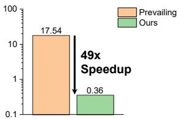

[← 返回 README](../README.md)

# Introduction 引言

## 📌 预览

引言诊断现代 PFM 的落地障碍（需高性能 GPU、冷却、持续供电，gigapixel WSI 更放大问题），指出现有提效方案的缺陷（用次优小 PFM 预筛、或牺牲跨分辨率泛化）。提炼两个核心低效：模型过参数化 + patch 级冗余。LitePath = LiteFM（蒸馏）+ APS（自适应选 patch）分别对症。

---

## Introduction

Computational pathology (CPath) is a critical component of precision oncology. The confluence of WSI digitization and developments in foundation models has driven the evolution of pathology foundation models (PFMs). These models employ self-supervised learning strategies (DINOv2, iBOT, MIM) to train on massive histopathology datasets.

However, these technological advances impose significant practical constraints. Modern PFMs demand substantial computational resources for deployment, including high-performance GPUs, specialized cooling infrastructure, and sustained power, rendering them difficult to implement in routine clinical environments. The inherent gigapixel resolution of WSIs further compounds these challenges. Recent efforts to improve inference efficiency of PFM still have critical shortcomings: some approaches rely on smaller yet suboptimal PFMs for pre-screening, while others sacrifice generalizability across resolutions.

To this end, we identified two principal inefficiencies in current PFMs: (1) model overparameterization and (2) patch-level redundancy. The results in PathBench reveal that several billion-parameter models (e.g., H-Optimus-0 and Prov-GigaPath) fail to outperform more compact architectures like Virchow2, indicating that smaller models can be effective. Moreover, both clinical workflows and attention mechanisms in MIL demonstrate that diagnostic decisions typically depend on limited regions of interest, yet current methods process all WSI patches indiscriminately.

> 💡 **机制拆解**（两个低效 = 两个可压缩维度）（Hao 批注）：作者把 PFM 的浪费拆成两个正交维度，各有实证依据：
> - **模型维度过参数化**：证据来自 [PathBench](../../%5BArxiv%202025%5D%20PathBench/)——十亿参数模型未必赢紧凑模型。所以蒸馏一个小 FM 不牺牲精度是可行的。
> - **数据维度 patch 冗余**：证据来自临床工作流 + MIL 注意力——诊断只依赖少数 ROI。所以选 patch 不牺牲精度是可行的。
> **两个维度独立可压 → 相乘得两个数量级削减**。这个"横向压模型 + 纵向压数据"的双轴分解，是 LitePath 相对只压一个维度的方法（如 EAGLE 只压 patch）的框架优势。

To address these issues, we developed LitePath, comprising LiteFM and the Adaptive Patch Selector (APS). LiteFM is a compact PFM obtained via knowledge distillation, built on the ViT-Small backbone. Drawing upon findings from PathBench, we selected three PFMs (Virchow2, H-Optimus-1 and UNI2) as teachers, as they achieve high AUCs and exhibit complementary expertise in histological diagnosis, molecular diagnosis, and survival prognosis. The distillation pretraining is performed on 190 million patches from 72,280 publicly available WSIs. APS is a lightweight, plug-and-play, task-specific module that reduces patch redundancy through adaptive selection. At inference, it uses a hybrid strategy combining uniform sampling to ensure broad coverage with attention-based sampling to prioritize informative regions. This mimics the pathologist's workflow of initial broad screening followed by focused examination of suspicious areas.

*Figure 1: LitePath 框架。(a) 推理管线——LiteFM 提特征，APS 基于 block-1 的浅层特征选 patch，只有选中的 patch 前向到最终预测；(b) LiteFM 从 Virchow2+H-Optimus-1+UNI2 蒸馏（190M patch / 72,280 WSI）；(c) APS 结合均匀采样 + 注意力采样，打分网络在浅层特征上训练以逼近最终 ABMIL 的注意力分布；(d) 19 个 PFM 的平均排名；(e) 主流部署（Virchow2 on RTX3090）vs LitePath（on Jetson）在等价日负载/GPU 预算下的对比。*

> 💡 **Figure 1 批读**（框架 + 两个巧思）（Hao 批注）：
> - **(a) APS 的"早退"设计**：APS 用 **block-1 的浅层特征** 选 patch，只让选中的 patch 走完整个网络——即"浅层快速筛、深层只算选中的"。这比 EAGLE（用独立的 CHIEF 全图跑一遍再选）更省，因为选择发生在同一网络的浅层。
> - **(c) APS 打分网络逼近最终 ABMIL 注意力**：用浅层特征训一个打分网络去**预测最终 ABMIL 会给的注意力分布**——即"用便宜的浅层预测昂贵的深层注意力"，这是知识蒸馏思想在 patch 选择上的应用。
> - **(b) 三 teacher 蒸馏**：选 Virchow2（综合）+ H-Optimus-1（强）+ UNI2 互补专长（组织学/分子/预后）→ LiteFM 是"多 FM 知识的压缩包"。对 ReadySlide "FM-agnostic substrate"：LiteFM 是"把多个 FM 蒸成一个小 substrate"的实现。
