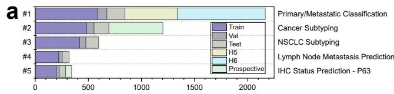
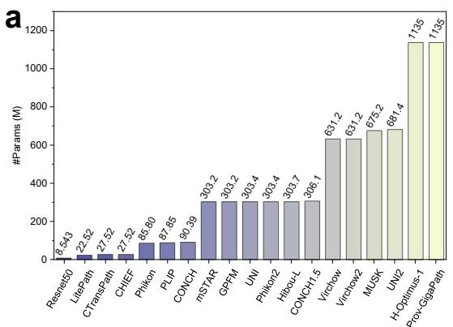
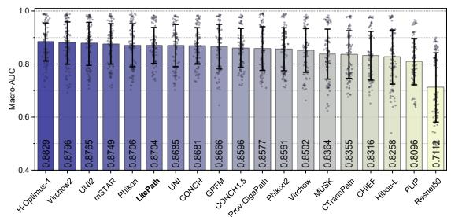

[← 返回 README](../README.md)

# Results & Method 结果与方法

## 📌 预览

结果三块：**整体**——LitePath 37 cohort 平均排名 5.6（2/19，仅次 Virchow2 5.3），D-Score 86.31%（最高，超 Virchow2 75.67%），保留 99.71% AUC；**效率**——22.5M 参数（28× 小）、4.25G FLOPs（38.8× 低）、APS 再降 10.4× → 共 403.5×，Jetson 上 208 slide/h（快 104.5×）、0.36 kWh/3000 slide（低 171×）；**精度**——胃/乳腺癌任务领先，肺癌略弱，术中冰冻切片/癌前诊断表现强。方法：LiteFM 三 teacher 蒸馏 + APS 混合采样。

---

## Overall Assessment

We assessed 19 PFMs using 26 tasks (lung, breast, gastric, colorectal), 26 internal + 9 external + 2 prospective cohorts — 15,672 slides from 9,808 patients, disjoint from public pretraining data. With 22.5M parameters (28× smaller than Virchow2, 50× smaller than H-Optimus-1) and throughput 208 slides/h on Jetson (104.5× faster than Virchow2), LitePath achieves average ranking score 5.6 across 37 cohorts, second among 19 PFMs (Virchow2 first, 5.3). LitePath achieved the highest average D-Score (86.31%), exceeding Virchow2 (75.67%). LitePath outperforms Virchow2 on 17 cohorts and achieves >99% AUC retention on 25 cohorts, overall average retention 99.71%.

*Figure 2: 19 PFM 的整体评估。(e) 平均排名 vs 参数量；(f) 平均排名 vs 吞吐量；(g) 平均 D-Score；(h) LitePath 相对 Virchow2 的 AUC 保留（37 cohort）。*

> 💡 **Figure 2 批读**（D-Score = 精度-效率的统一标尺）（Hao 批注）：(e)(f) 的散点图是全文最有说服力的——LitePath 位于"高排名 + 小参数/高吞吐"的黄金角落，大模型（H-Optimus-1、UNI2）在"高参数低吞吐"区。**D-Score（归一化 AUC 与 FLOPs 的加权几何均值）** 把二维 Pareto 压成一个可比标量，LitePath 86.31% 居首。**对 ReadySlide 的直接启示**：评估压缩方法不能只报 AUC（会偏向不压缩）或只报 CR（会偏向过压），需要 D-Score 式的复合指标——这正是 memory 里 CR-AUC Pareto 评估思路的一个成熟范例。注意 LitePath 排名仍略输 Virchow2（5.6 vs 5.3）——它是"几乎不掉精度换巨大效率"，而非"更准"。

## Efficiency

LitePath contains 22.5M parameters (28× smaller than Virchow2's 631M, 50× smaller than H-Optimus-1's 1135M). LiteFM (without APS) requires 4.25G FLOPs per image (38.8× lower than Virchow2's 165G). APS's attention-based sampling converges to relative FLOPs 0.096 (10.4× reduction) for large patch counts. Combined: up to **403.5× (38.8 × 10.4) FLOP reduction** vs Virchow2. On Jetson Orin Nano Super (25W, $249): 208 slides/h (104.5× faster than Virchow2's 1.99). Under equal GPU budget (10 RTX3090 ≈ 40 Jetson): LitePath on 40 Jetson processes 3,000 slides in 0.36 h (49× faster than Virchow2 on 10 RTX3090's 17.54 h), consuming 0.36 kWh (171× less than 61.39 kWh).

*Figure 3: 效率对比。(a) 参数量；(b) 单 patch FLOPs；(c) LitePath 相对 LiteFM 的 FLOPs 随 patch 数变化（注意力采样收敛到 0.096）；(d) RTX3090/Jetson 吞吐（"0.00"=显存溢出）。*

> 💡 **Figure 3 批读**（两个维度的削减如何相乘）（Hao 批注）：这张图清晰展示"横向 × 纵向"：**模型维度** LiteFM 38.8× FLOP 削减（蒸馏 ViT-Small）；**数据维度** APS 10.4× 削减（注意力采样收敛到 9.6% patch）。相乘 403.5×。**关键细节 (c)**：APS 注意力采样的相对 FLOPs 随 patch 数增加而下降、收敛到 0.096——因为固定选 ~1000 个 patch，patch 越多相对比例越小。(d) 显示大模型在 Jetson 上直接 OOM（"0.00"），只有 LitePath 能在边缘设备跑常规临床负载。这是"能不能部署"的质变，不只是快慢。

## Accuracy

Across all cohorts, LitePath ranks second (5.6) behind Virchow2 (5.3), outperforming H-Optimus-1 (6.2), mSTAR (7.2), UNI2 (7.5), GPFM (8.0). Organ-specific: **gastric** (Macro-AUC 80.59%, ranking 5.2, first in ranking), **breast** (81.09%, tied first AUC), **colorectal** (86.67%, third), **lung** (87.04%, sixth — relatively moderate). LitePath shows strong potential for **intraoperative frozen sections** (lung LN metastasis AUC 77.29% > Virchow2 74.90%, D-Score 95.05% first) and **pre-cancer diagnosis** (gastric normal/abnormal with precancerous lesions).

*Figure 4: 四癌种（肺/乳腺/胃/结直肠）各 PFM 的 Macro-AUC 与排名。*

> 💡 **Figure 4 批读**（精度画像 + 一个诚实短板）（Hao 批注）：LitePath 在胃/乳腺任务领先、结直肠第三、**肺癌仅第六**（87.04%，H-Optimus-1 88.29% 领先）。作者诚实标注肺癌"略次优"——蒸馏小模型在某些需要更强表征的任务上有精度天花板。**亮点**：术中冰冻切片（时间/算力双约束的场景）LitePath D-Score 95.05% 第一——这正是"部署友好"的价值场景（大模型在手术室根本跑不动）。对 ReadySlide：**效率方法的价值应在"资源受限的真实场景"里衡量**（冰冻切片、基层医院、边缘设备），而非只看数据中心里的 AUC。

## Method（核心，来自 Methods 节）

**LiteFM 蒸馏**：ViT-Small backbone，从三个 teacher（Virchow2 综合 / H-Optimus-1 强 / UNI2 互补，覆盖组织学/分子/预后专长）蒸馏，190M patch / 72,280 公开 WSI。**APS（Adaptive Patch Selector）**：plug-and-play，推理时混合 (i) 均匀采样保覆盖 + (ii) 注意力采样保信息区；打分网络在 block-1 浅层特征上训练、逼近最终 ABMIL 的注意力分布，只让选中 patch 前向。**D-Score**：归一化 AUC 与归一化 FLOPs 的加权几何均值，精度垫底则记 0、算力过高则罚分。

> 💡 **机制拆解 + 局限**（Hao 批注）：
> - **APS 的两段式采样**是对 EAGLE 纯注意力选择的改进——**加均匀采样保覆盖**，防止漏掉分散的信号（EAGLE Discussion 承认稀疏采样有漏罕见/分散线索的风险，APS 用均匀分量部分缓解）。对 ReadySlide：**retention 应含"覆盖保底 + 重要性加权"两分量**，纯 importance 有覆盖盲区。
> - **浅层预测深层注意力**：APS 打分网络用 block-1 特征逼近最终 ABMIL 注意力——一种"廉价代理昂贵信号"的蒸馏，值得借鉴到 allocator（用便宜特征预测昂贵的 patch 价值）。
> - **局限**：(1) 肺癌等任务精度有天花板（蒸馏小模型的固有代价）；(2) 排名仍略输最强大模型（5.6 vs 5.3），定位是"几乎不掉精度换 400× 效率"，非 SOTA 精度；(3) 与 [Confounders](../%5BNat%20Biomed%20Eng%202026%5D%20Confounders-Biomarker-Prediction/) 一样，未见分层去混杂——APS 选的 patch 是否 shortcut？未验。

## 与本主题 / ReadySlide 的关系

- **与 [EAGLE](../%5BNat%20Commun%202026%5D%20DL-Efficient-Pathology/) 是"效率 CPath"的一对**：EAGLE 只压 patch（选 25 tile + 现成 FM），LitePath 双轴压（蒸馏小 FM + APS 选 patch）。合读：**patch retention 是两者共同的核心杠杆**，且都验证"少 patch 不掉精度"。
- **D-Score 是 ReadySlide 该采用的评估范式**：CR/FLOPs 与 AUC 的复合 Pareto 标量，避免单指标偏置。
- **APS 的"覆盖 + 重要性"双采样**修正了纯 importance 保留的覆盖盲区——对 ReadySlide allocator 有直接借鉴。
- **LiteFM 多 teacher 蒸馏**是"FM-agnostic substrate"的一种实现（把多 FM 知识压进一个小 substrate）。
