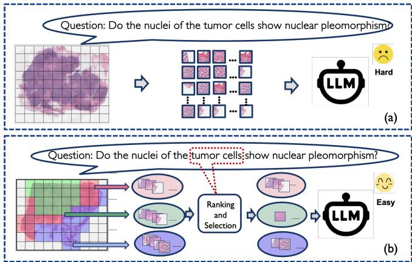
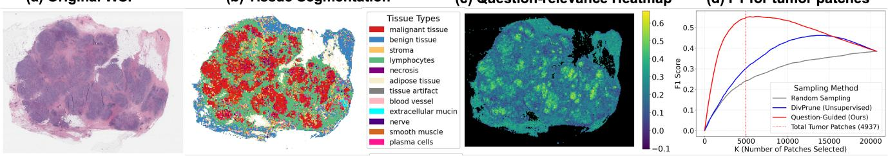
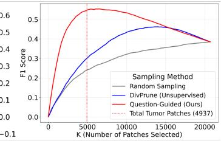

[← 返回 README](../README.md)

# 1. Introduction

## 📌 Preview

The introduction establishes the motivation through a pre-analysis demonstrating that (1) question-guided sampling dramatically outperforms random/diversity-based sampling in retrieving tumor patches, and (2) existing MLLM-based VQA methods suffer from lack of explainability and patch redundancy. These observations motivate HistoSelect's hierarchical, question-guided selection framework grounded in Information Bottleneck theory.

---

Histopathology image analysis plays a critical role in cancer diagnosis and treatment planning [4, 24, 29]. A key data source in this domain is the Whole Slide Image (WSI), a giga-pixel digital scan that captures rich cellular and tissue morphology. The rapid development of computational pathology has enabled success in fundamental tasks, such as subtype classification [14, 17, 19, 31, 33, 39, 48, 50], segmentation [45, 46] and survival analysis [8, 35, 47, 51, 52]. With the emergence of multi-modal learning, more challenging tasks have been introduced. In Visual Question Answering (VQA) [7, 9, 16, 22, 38], models are required not only to predict a correct answer, but also to produce clinically trustworthy and interpretable answers.

*Figure 1. Illustration of our HistoSelect framework. (a) The baseline method feeds a large number of patches indiscriminately into the VLM, leading to high redundancy and question-irrelevance. (b) Our question-guided tissue-aware selection method. The question guides the model to select a relevant and sparse subset of informative patches, which are then fed to the VLM for reasoning.*

> 💡 **Figure 1 批读**: 这张图清晰地展示了 HistoSelect 的核心思想和 baseline 的问题。(a) 中 baseline 方法不加区分地将大量补丁送入 VLM，这些补丁包含大量的冗余和与问题无关的信息（空白区域、良性组织等）。(b) 中 HistoSelect 通过问题引导，仅选择稀疏的、与问题高度相关的补丁子集。这种"少即是多"的理念贯穿整篇论文。

To address the Pathology VQA task, the classic Multiple Instance Learning (MIL) approaches [7, 17, 19, 25] are insufficient due to their lack of language understanding power. Recent Multimodal Large Language Model (MLLM) based approaches [9, 22, 32] convert WSI patches into visual tokens, which are then concatenated with the textual question tokens and fed into large language models (LLMs) for multi-modal reasoning. While these approaches have demonstrated competitive performance, they still suffer from two major limitations stemming from the nature of WSIs. The first challenge is the lack of attributable explainability. Although VQA models can generate textual answers, most existing MLLM methods do not reveal which patches or regions in the WSI support the prediction. This absence of localized, patch-level attribution results in a "black-box" behavior that undermines clinical trustworthiness, since pathologists cannot verify the model's reasoning by inspecting the corresponding image evidence. The second challenge is the redundancy and question-irrelevance of patches. A single WSI can have tens of thousands of patches, many of which are irrelevant to the question, e.g., depicting background tissue, benign structures, or regions unrelated to the clinical decision. Meanwhile, patches from the same tissue type are often redundant; we do not need all of them to make the decision. Furthermore, the strict token limits of current LLMs force existing methods to adopt question-agnostic strategies such as non-selective sampling [9] or pooling [22]. This results in treating all patch tokens equally, which unnecessarily overwhelms the downstream LLM with question-irrelevant visual information and risks degrading the model's performance.

> 💡 **问题动机 - 两大核心挑战**:
> 1. **可解释性缺失**（Lack of attributable explainability）：现有 MLLM 方法虽然能生成文本答案，但不揭示哪些 WSI 区域支持了预测 → "黑箱"行为削弱了临床可信度
> 2. **补丁冗余与问题不相关**（Redundancy and question-irrelevance）：一张 WSI 有数万补丁，大多数与特定问题无关。仅因 LLM 的 token 限制，现有方法被迫采用问题无关的策略（非选择性采样或池化），导致不相关信息淹没 LLM

*(a) Original WSI &emsp; (b) Tissue Segmentation &emsp; (c) Question-relevance Heatmap*

*(d) F1 for tumor patches*

*Figure 2. Visualization and quantitative pre-analysis of patch relevance for a VQA sample (from TCGA-BRCA). (a) Reference WSI. (b) Tissue segmentation, with tumor region shown in red. (c) Patch-level relevance heatmap based on question-patch similarity. High-relevance regions (light region) align with the tumor region from (b). (d) F1 score comparison for retrieving tumor patches using different sampling methods. The question-guided (red) sampling strategy vastly outperforms question-agnostic methods like diversity sampling [3] (blue) and random sampling (gray), demonstrating the limited efficacy of non-guided selection.*

> 💡 **Figure 2 批读**: 这是一个关键的前置分析实验，为整个方法的动机提供了定量证据。
> - (a) 原始 WSI，(b) 组织分割（红色为肿瘤区域）
> - (c) 基于问题-补丁余弦相似度的相关性热力图，亮区（高相关）与 (b) 中的肿瘤区域高度对应——验证了问题引导可以定位到有意义的组织区域
> - (d) F1 对比：问题引导采样（红色）在检索肿瘤补丁上远超多样性采样（蓝色）和随机采样（灰色），F1 差距在低采样率时尤为显著。这为"问题引导选择"的必要性提供了强有力的实证。

To address the aforementioned limitations, we take inspiration from how pathologists reason over WSIs. Rather than examining every region exhaustively, pathologists work in a tissue-aware manner: they first identify the tissue regions relevant to the clinical question and then zoom into a small set of critical patches for verification. Following this principle, we first establish a coarse-grained tissue context. In collaboration with expert pathologists, we define a set of K prompts describing fundamental tissue types, enabling a CLIP-like tissue segmentation that automatically assigns each WSI patch to a semantic category (Figure 2b). This step mirrors the initial stage of locating diagnostically meaningful regions. We further quantitatively validate fine-grained tissue region selection is guided by the question. By calculating the cosine similarity between each patch embedding and the question embedding, we generate a patch-level relevance heatmap (Figure 2c), where lighter regions indicate high relevance to the tumor features specified by the question. A quantitative comparison (Figure 2d) shows that question-guided sampling dramatically outperforms question-agnostic strategies (such as diversity sampling or random sampling) in retrieving relevant tumor patches. This validates our second key observation: the necessity of a question-guided selection mechanism to efficiently identify high-value information within gigapixel WSIs and lead to more accurate answers.

> 💡 **机制拆解 - 病理学家工作流的三个层次**:
> 1. **组织感知**（Tissue-aware）：病理学家不会逐区域检查，而是先定位与临床问题相关的组织区域
> 2. **由粗到细**（Coarse-to-fine）：先粗粒度定位（哪个组织区域），再细粒度放大（该区域内哪些关键补丁）
> 3. **问题引导**（Question-guided）：选择不是静态的——不同的临床问题会导致关注不同的组织和补丁

Motivated by these observations, we introduce HistoSelect, a hierarchical, question-guided, and tissue-aware patch selection framework for the pathology VQA task, designed to mirror the coarse-to-fine diagnostic process of pathologists. As shown in Figure 1, we leverage the pathologist-defined prompts for fundamental tissue types and a pretrained patch-level vision-language model [26] to partition the WSI into semantically coherent tissue groups. This provides the coarse-grained structure upon which our method operates. Building on this, HistoSelect implements a two-stage selection mechanism grounded in the Information Bottleneck (IB) principle [41]. The first stage, the group sampler, evaluates how relevant each tissue type region (group) is to the input question and determines the patch sampling rate from each group. The second stage, the patch selector, ranks the patches within each active group by relevance to the question and selects the most informative ones according to the allocated token budget. Together, these modules emulate the pathologist's workflow: first identify the meaningful regions, then zoom in on the key evidence.

To ensure that the selected patches are both sparse and sufficient for answering the question, we formulate the training objective using a dual-level compression loss enforcing sparsity and relevance at both group- and patch-level. At both levels, we encourage the model to keep only what is necessary by penalizing the divergence between the learned selection probabilities and a dynamic prior derived from question-image similarity. This guides the selectors toward semantically aligned evidence while preventing over-selection. By integrating this IB-driven objective with the VQA loss, HistoSelect produces a compact, question-aligned set of visual tokens that retains critical information and enhances interpretability.

> 💡 **公式批读 - IB 在层级选择中的作用**: Information Bottleneck 理论在这里起到了"正则化压缩"的作用。它不只是一个损失项，而是一种指导选择的原则：在保留与答案 Y 相关的信息的前提下，尽可能压缩输入的 X。关键设计是层级分解——将压缩项分解为组级别和补丁级别，并使用问题-图像相似度作为动态先验（dynamic prior），引导选择器向语义对齐的证据靠拢。

In summary, our contributions are:

- We collaborate with pathologists to design a series of basic tissue type prompts, enabling us to partition the WSIs into distinct tissue regions.

- We introduce HistoSelect, a hierarchical, question-guided, and tissue-aware selection framework based on the IB theory, which effectively prunes question-irrelevant tokens to increase the proportion of question-relevant tokens fed into the LLM for reasoning, thereby enhancing the model's interpretability.

- We conduct a detailed pathologist evaluation to ensure that both our tissue segmentation and model selection results align with the expectations of clinical pathologists.

- We achieve state-of-the-art performance on two public datasets and one in-house dataset.

## 🔖 Summary

The introduction motivates HistoSelect through a pre-analysis showing question-guided sampling dramatically outperforms question-agnostic methods for tumor patch retrieval. Two key limitations of existing methods are identified: lack of explainability (black-box predictions) and patch redundancy (overwhelming LLMs with irrelevant tokens). HistoSelect addresses both via a hierarchical, IB-grounded selection mechanism that mimics the pathologist's coarse-to-fine diagnostic workflow.
