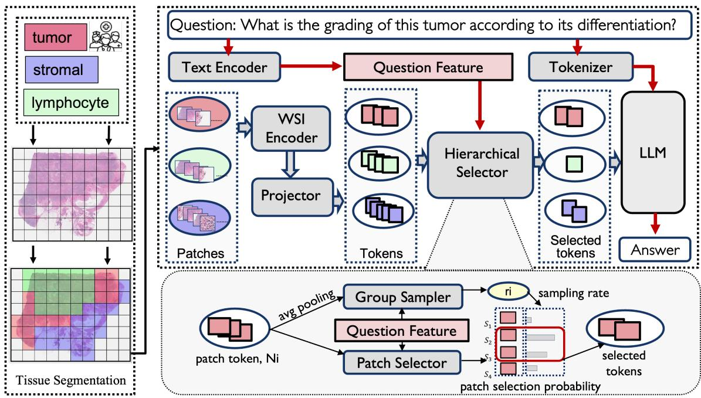

[← 返回 README](../README.md)

# 3. Methods

## 📌 Preview

HistoSelect consists of three stages: (1) **Tissue Segmentation** using pathologist-designed prompts and zero-shot CLIP-style matching to partition the WSI into M tissue groups, (2) **Group Sampler** that predicts question-conditioned sampling rates for each tissue group, and (3) **Patch Selector** that ranks and selects top-k informative patches within each group. Training is guided by a **Hierarchical Information Bottleneck (HIB)** objective with dual-level KL regularization, and the discrete selection is made differentiable via the Straight-Through Estimator (STE).

---

Our HistoSelect framework is shown in Figure 3. It mainly consists of two core components designed to select question-related patches for downstream multimodal reasoning. The first part is tissue segmentation, where the WSI is partitioned into distinct spatial regions corresponding to M different tissue types (e.g., tumor, stromal, lymphocyte, as illustrated) using pathologist-designed prompts. The second part is the hierarchical selector, which enhances model explainability and token efficiency by selecting patch tokens most relevant to the question. This hierarchical selector includes a group sampler and a patch selector, both taking the question embedding as input. The group sampler predicts the sampling rate for each tissue group, while the patch selector calculates a selection probability for every patch within the group. By ranking these probabilities, the selector extracts the top K most relevant patch tokens. Subsequently, the selected patch tokens and the question tokens are passed to the LLM decoder for answer generation. We detail each component in the following sections.

*Figure 3. Overview of HistoSelect. The framework operates in two stages: Tissue Segmentation partitions the WSI into M tissue types (e.g., tumor, stromal, lymphocyte) using pathologist-designed prompts. The Hierarchical Selector then uses the question feature to dynamically select the top K most relevant patch tokens, which are subsequently passed to the LLM for multi-modal answer generation.*

> 💡 **Figure 3 批读**: 这是全文最核心的架构图。注意流程是单向且高效的：
> 1. 左侧 WSI → 组织分割（M 种组织类型）→ 每个补丁获得组织标签
> 2. 问题经过 text encoder → question embedding
> 3. Group Sampler 接收 group prototypes + question → 输出每个组的采样率 rⱼ
> 4. Patch Selector 接收 patch features + question → 输出每个补丁的选择概率 sᵢ
> 5. 按 rⱼ×Nⱼ 确定每个组的 token 预算，选 top-kⱼ → 送入 LLM 生成答案
> 6. 左下角的 HIB 表示整个选择过程受层级 IB 损失的正则化约束

**Preliminaries.** Given a WSI and a question Q, the WSI is initially divided into a collection of N non-overlapping patches. Each patch is encoded by a pretrained vision encoder to produce a set of features **X** = {**x**₁, **x**₂, ..., **x**\_N} where **x**\_i ∈ ℝᵈ is the d-dimensional feature vector for the i-th patch. The question is encoded by a text encoder into a question feature **q** ∈ ℝᵈ. Furthermore, each patch i is associated with a distinct tissue label l\_i, obtained from the tissue segmentation stage. The collection of all tissue labels is denoted as L = {l₁, l₂, ..., l\_N}, where l\_i ∈ {1, ..., M} represents one of the M defined tissue types.

### 3.1. Tissue Segmentation

To identify the tissue regions relevant to the clinical question, we consult with expert pathologists. We design M general prompts, denoted as **P** = {p₁, p₂, ..., p\_M}, where each prompt pⱼ is designed to generally represent a key histological component within the WSI. Specifically, we utilize the visual encoder from CONCH [26] to obtain the patch features **X** = {**x**₁, **x**₂, ..., **x**\_N}, and its text encoder to embed the M prompts into a feature space, yielding the tissue prompt features **T** = {**t**₁, **t**₂, ..., **t**\_M}, where **t**ⱼ is the feature for prompt pⱼ. The tissue label l\_i for patch i is determined by the highest cosine similarity between the patch feature **x**\_i and all prompt features **t**ⱼ:

$$l_i = \underset{j \in \{1, \dots, M\}}{\operatorname{argmax}} \left( \frac{\mathbf{x}_i \cdot \mathbf{t}_j}{\|\mathbf{x}_i\| \cdot \|\mathbf{t}_j\|} \right) \tag{1}$$

The resulting set of labels L = {l₁, l₂, ..., l\_N} effectively partitions the WSI into M distinct tissue regions, which form the basis for the hierarchical selection process.

> 💡 **公式批读 - 公式 (1) 组织分割**: 这是一个零样本（zero-shot）CLIP 风格的分类，核心思路是用视觉-语言模型的共享嵌入空间来匹配补丁和组织描述文本。与传统的训练一个组织分类器不同，这里的优势是：(1) 不需要组织标签的标注数据，(2) 可以通过设计新的 prompt 灵活扩展组织类型，(3) 与下游的选择模块共享同一个编码器（CONCH）。注意这个阶段**不是**问题引导的——组织分割对所有问题都使用相同的 prompt，它只提供粗粒度的结构基础。

### 3.2. Group Sampler

The hierarchical selection process begins with the group sampler, which determines the importance of each tissue region relative to the input question. For each of the M tissue groups, we first compute a group prototype feature **g**ⱼ by applying average pooling over all patch features **x**\_i belonging to that group j. Let **T**ⱼ be the set of indices for patches belonging to tissue group j. The group prototype **g**ⱼ is defined as:

$$\mathbf{g}_j = \frac{1}{N_j} \sum_{i \in \mathcal{T}_j} \mathbf{x}_i \tag{2}$$

where Nⱼ is the total number of patches in group j. The group sampler **F**\_group then predicts a sampling rate rⱼ for group j, indicating the importance of this group. This prediction is based on the concatenation of the group prototype **g**ⱼ and the question feature **q**, ensuring the sampling is context-aware. The sampling rate rⱼ is constrained to (0, 1) using the sigmoid function σ(·):

$$r_j = \sigma\left( \mathcal{F}_{\mathrm{group}} ( [\mathbf{g}_j; \mathbf{q}] ) \right) \tag{3}$$

where the group sampler **F**\_group is implemented with two linear layers, and rⱼ dictates the proportion of patches to be sampled from group j.

> 💡 **公式批读 - 公式 (2)(3) Group Sampler 的设计**:
> - 公式 (2): Group prototype 通过平均池化获得，这是一种简单但有效的粗粒度表示。一个潜在的问题是：如果组内补丁差异很大（如肿瘤区域的异质性），平均值可能丢失信息。但在这个设计里，group sampler 只需要决定"这个组有多重要"，不需要捕获组内的细粒度差异——那是 patch selector 的任务。
> - 公式 (3): 输入是 [**g**ⱼ; **q**] 的拼接，这意味着采样率是**组特征和问题的联合函数**。同一个肿瘤组，面对"肿瘤分级"和"基质浸润"两个不同问题时，会产生不同的 rⱼ。这是问题引导的核心体现。

### 3.3. Patch Selector

The patch selector performs the final, fine-grained selection of relevant patches within each tissue group. Similar to the group sampler, the selection mechanism is driven by the question context. For every patch i, the patch selector **F**\_patch predicts a selection probability s\_i. This prediction is based on the concatenation of the individual patch feature **x**\_i and the question feature **q**:

$$s_i = \sigma( \mathcal{F}_{\mathrm{patch}} ( [\mathbf{x}_i; \mathbf{q}] ) ) \tag{4}$$

where s\_i ∈ (0, 1) is the predicted probability that patch i is relevant to question Q, and **F**\_patch is implemented with two linear layers. For each tissue group j, the number of patches to be selected kⱼ is determined by multiplying the group's predicted sampling rate rⱼ by its total size Nⱼ, followed by rounding up:

$$k_j = \lceil r_j \cdot N_j \rceil \tag{5}$$

Finally, we select the top kⱼ features, denoted as **Z**ⱼ, from group j by ranking all features **x**\_i belonging to **T**ⱼ based on their selection probability s\_i. The complete set of selected patch features Z is the union of all selected features across the M groups:

$$\mathbf{Z} = \bigcup_{j=1}^{M} \mathbf{Z}_j$$

> 💡 **公式批读 - 公式 (4)(5) Patch Selector 的层级协同**:
> - 公式 (4): Patch selector 和 group sampler 结构对称——都是两层的线性层 + sigmoid，输入都是 [特征; 问题] 的拼接。区别在于粒度：group sampler 处理组原型，patch selector 处理单个补丁。
> - 公式 (5): 这里体现了层级选择的协同机制——组级别的采样率 rⱼ 决定了补丁级别的选择数量 kⱼ。一个被判定为低相关性的组织组（rⱼ 小），即使组内有单个补丁的 sᵢ 很高，也只能选出很少的补丁。这种"先组后补丁"的级联设计是关键创新。

### 3.4. Hierarchical IB for Patch Selection

Our learning objective is based on the IB theory [41], which seeks to learn an optimal compressed representation Z of the input features X that retains maximal information about the ground truth answer Y. Given the question feature **q**, this objective is formally written as:

$$\mathcal{L}_{\mathrm{IB}} = I(\mathbf{Z}; \mathbf{Y} \mid \mathbf{q}) - \beta I(\mathbf{Z}; \mathbf{X} \mid \mathbf{q}) \tag{6}$$

where I(·;·) denotes the mutual information, and β is a Lagrangian multiplier balancing the trade-off between relevance and compression. To accommodate the hierarchical structure of WSIs, we model the selection process via a joint latent variable **Z** = (Z\_g, Z\_p), where Z\_g and Z\_p denote the group-level and patch-level selection variables, respectively. By applying the chain rule, the complexity term I(**Z**, **X** | **q**) is decomposed into a marginal group-level term and a conditional patch-level term:

$$I(\mathbf{Z}_g, \mathbf{Z}_p; \mathbf{X} \mid \mathbf{q}) = I(\mathbf{Z}_g; \mathbf{X} \mid \mathbf{q}) + I(\mathbf{Z}_p; \mathbf{X} \mid \mathbf{Z}_g, \mathbf{q}) \tag{7}$$

Since mutual information is computationally intractable, we adopt the Variational Information Bottleneck (VIB) framework [41] to derive a tractable bound. Inspired by recent hierarchical IB frameworks [11, 34] designed for multi-scale WSIs, we introduce the hierarchical variational posteriors p\_{φ\_g}(Z\_g | X, **q**) and p\_{φ\_p}(Z\_p | X, Z\_g, **q**) to model the group-level sampling and patch-level selection, respectively. Furthermore, we utilize the LLM as the variational decoder p\_θ(Y | Z, **q**) to generate the final answer. By approximating the complexity terms in Equation (7) with their corresponding KL divergence upper bounds, the resulting hierarchical IB objective function is formulated as:

$$\begin{array}{rl}
\mathcal{I}_{\mathrm{HIB}} = \mathbb{E}_{\mathcal{D}} \Big[ \mathbb{E}_{Z \sim p_{\phi}} [\log p_{\theta}(Y \mid Z, \mathbf{q}) ] &
\\
- \beta_g D_{\mathrm{KL}} ( p_{\phi_g}(Z_g \mid X, \mathbf{q}) \parallel p_g ) &
\\
- \beta_p D_{\mathrm{KL}} ( p_{\phi_p}(Z_p \mid X, Z_g, \mathbf{q}) \parallel p_p ) \Big] &
\end{array} \tag{8}$$

where p\_g and p\_p are the prior distributions. The hyperparameters β\_g and β\_p independently regulate the information flow at the group-level and patch-level granularities, respectively. The complete derivation of this hierarchical decomposition is provided in the supplementary material.

> 💡 **公式批读 - 公式 (6)(7)(8) 层级 IB 目标**:
> 这是整篇论文理论深度最高的部分，值得仔细拆解：
>
> **公式 (6)**: 标准 IB 目标。第一项 I(Z;Y|q) 鼓励 Z 保留关于答案的预测信息（相关性），第二项 -β·I(Z;X|q) 惩罚 Z 中保留的关于输入的冗余信息（压缩）。注意这里条件是问题 q——压缩和相关性都是问题引导的。
>
> **公式 (7)**: 层级分解是关键创新。将总的压缩项分解为：
> - I(Z\_g; X | q): 组级别——Z\_g 包含多少关于 X 的信息（给定 q）
> - I(Z\_p; X | Z\_g, q): 补丁级别——在已知 Z\_g 和 q 的条件下，Z\_p 还包含多少关于 X 的信息
> 这个分解使得可以在不同粒度独立控制压缩程度。
>
> **公式 (8)**: 变分下界的实际训练目标。三项分别是：
> 1. VQA 的对数似然（使用 LLM 作为变分解码器）
> 2. 组级别的 KL 散度正则化（β\_g 权重）
> 3. 补丁级别的 KL 散度正则化（β\_p 权重）
> β\_g 和 β\_p 的独立调节是设计的巧妙之处——不同粒度的信息压缩需求不同。

### 3.5. Loss Function and Implementation

We define the loss function to be minimized as **L**\_final = -**I**\_HIB. Following the hierarchical decomposition in Equation (8), the total loss is formulated as a weighted sum of the task-specific VQA loss and the hierarchical compression terms:

$$\mathcal{L}_{\mathrm{final}} = \mathcal{L}_{\mathrm{VQA}} + \beta_g \mathcal{L}_{\mathrm{group}} + \beta_p \mathcal{L}_{\mathrm{patch}} \tag{9}$$

where **L**\_group and **L**\_patch are the compression loss terms derived from the group sampler and patch selector, respectively. The β\_g and β\_p control the trade-off between task-relevant information and redundancy at each stage.

**VQA Loss.** The VQA loss is the negative log-likelihood over the answer sequence:

$$\mathcal{L}_{\mathrm{VQA}} = - \sum_{t=1}^{T} \log p_{\boldsymbol{\theta}} ( y_t \mid y_{<t}, \mathbf{Z}, \mathbf{q} )$$

where Y = {y₁, ..., y\_T} is the ground truth answer sequence, and the total loss is averaged over the dataset D.

**Group-Level Compression Loss.** Weighted by β\_g, this term regularizes the group sampler by minimizing the deviation of the predicted group sampling rate rⱼ from a pseudo-prior parameter pⱼᵍ. In this context, rⱼ and pⱼᵍ are interpreted as the parameters of two Bernoulli distributions. The loss is averaged over the M tissue groups:

$$\mathcal{L}_{\mathrm{group}} = \frac{1}{M} \sum_{j=1}^{M} \mathbf{D}_{\mathrm{KL}} ( \mathbf{B}(r_j) \parallel \mathbf{B}(p_j^g) ) \tag{10}$$

In practice, the pseudo-prior parameter pⱼᵍ is implemented as the cosine similarity between the group prototype **g**ⱼ and the question feature **q**.

**Patch-Level Compression Loss.** Weighted by β\_p, this term regularizes the patch selector by minimizing the deviation of the patch selection probability s\_i from a pseudo-prior parameter p\_iᵖ. In this context, s\_i and p\_iᵖ are interpreted as the parameters of two Bernoulli distributions. The loss is averaged over the N patches:

$$\mathcal{L}_{\mathrm{patch}} = \frac{1}{N} \sum_{i=1}^{N} \mathbf{D}_{\mathrm{KL}} \big( \mathbf{B}(s_i) \parallel \mathbf{B}(p_i^p) \big) \tag{11}$$

Similarly, the pseudo-prior parameter p\_iᵖ is the cosine similarity between the patch feature **x**\_i and the question feature **q**. The KL divergence between two Bernoulli distributions with parameters π and p is defined as:

$$\mathbf{D}_{\mathrm{KL}} ( \mathbf{B}(\pi) \parallel \mathbf{B}(p) ) = \pi \log{\frac{\pi}{p}} + (1 - \pi) \log{\frac{1 - \pi}{1 - p}} \tag{12}$$

> 💡 **公式批读 - 公式 (9)(10)(11)(12) 完整的训练损失**:
>
> **总损失结构**: L\_final = L\_VQA + β\_g·L\_group + β\_p·L\_patch。这是一个多任务学习的形式，VQA 损失确保回答准确性，两个压缩损失确保选择稀疏性。
>
> **Pseudo-prior 的设计** (公式 10-11 中 pⱼᵍ 和 p\_iᵖ): 这是一个非常精妙的设计。先验不是固定的均匀分布或手工设定的常数，而是**数据驱动**的——使用组/补丁特征与问题特征的余弦相似度。这意味着：
> - 如果一个补丁与问题语义高度相似（如肿瘤补丁 + "tumor grade"问题），它的 pseudo-prior 高 → KL 散度惩罚模型不选它
> - 如果一个补丁与问题无关（如背景补丁 + "tumor grade"问题），它的 pseudo-prior 低 → KL 散度惩罚模型选它
> 这样，先验提供了有意义的引导信号，而 IB 的学习部分可以在此基础上进一步优化。
>
> **Bernoulli KL 散度** (公式 12): 选择概率 s_i 和 pseudo-prior p_i^p 都被建模为伯努利分布的参数（选/不选）。KL(B(π)||B(p)) 衡量的是模型预测的选择分布与先验选择分布之间的差异。当 π=p 时 KL=0，当 π 偏离 p 时 KL>0。作为正则化项，它鼓励模型的选择分布不要偏离先验太远。

### 3.6. Differentiable Hard Selection

During training, the model must sample discrete patches to compute L\_VQA, yet this sampling operation is non-differentiable. To overcome this, we adopt the Straight-Through Estimator (STE) [5]. Specifically, a hard binary mask is applied during the forward pass to select the top-kⱼ features for each group j. During the backward pass, gradients are propagated directly through the soft probabilities (rⱼ and s\_i), bypassing the discrete sampling step. This technique enables the entire pipeline, including both the group sampler and the patch selector, to be optimized end-to-end under the guidance of the VQA loss.

> 💡 **机制拆解 - STE 的工作原理**:
> - **前向传播**: 使用硬二值掩码（hard binary mask），根据 sᵢ 排名选择 top-kⱼ 补丁 → 实际送入 LLM
> - **反向传播**: 梯度直接通过软概率 rⱼ 和 sᵢ 回传，绕过离散的 top-k 选择操作
> - **为什么需要 STE**: 因为 top-k 选择是不可微的（离散排序操作），没有 STE，梯度无法从 LLM 的 VQA 损失回传到选择器。STE 的本质是"反向传播时假装选择是软性的"。

## 🔖 Summary

The methodology introduces HistoSelect's three-stage pipeline: (1) zero-shot tissue segmentation via CLIP-style matching with pathologist-designed prompts, (2) a group sampler predicting question-conditioned sampling rates per tissue type, and (3) a patch selector ranking individual patches by question relevance. Training is guided by a Hierarchical IB objective that decomposes compression into group-level and patch-level KL regularization terms with data-driven pseudo-priors (cosine similarity). The discrete selection is made differentiable via STE, enabling end-to-end training of the entire pipeline.
