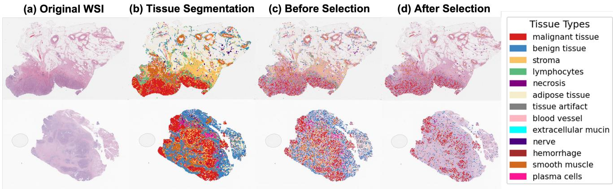
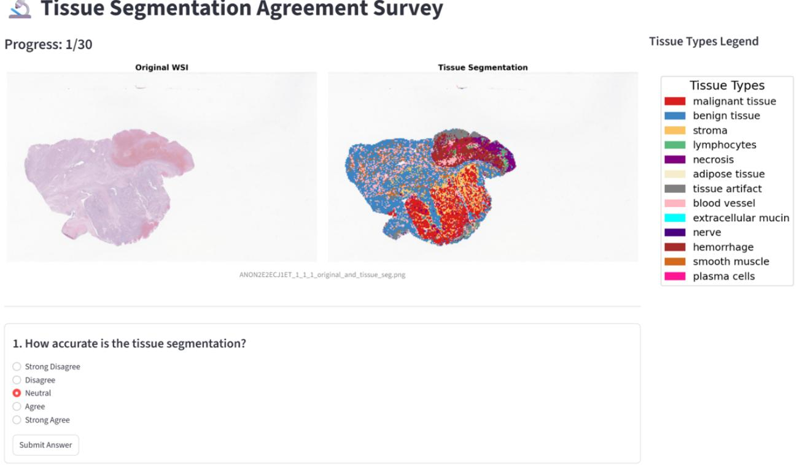
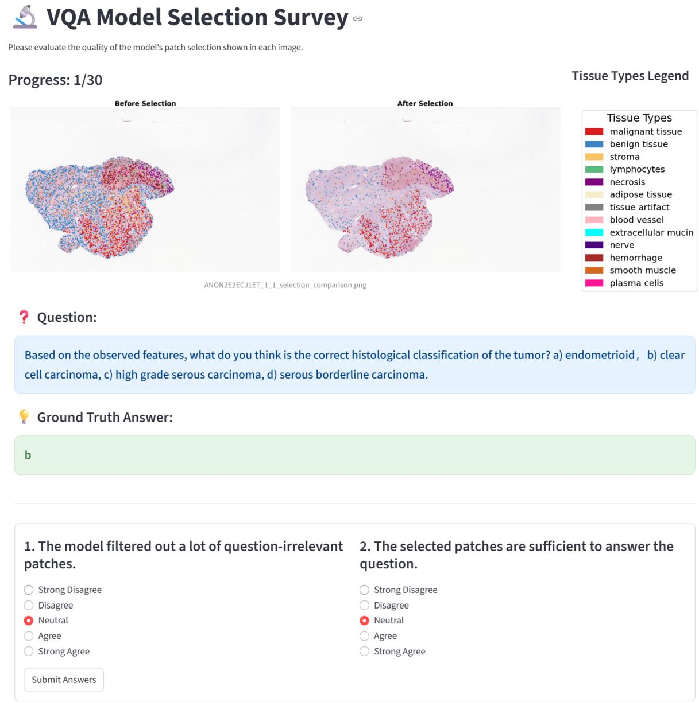
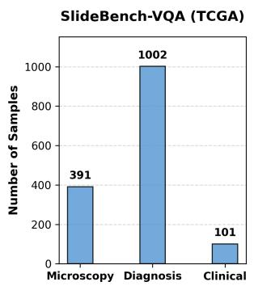
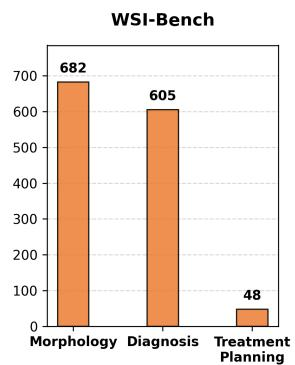
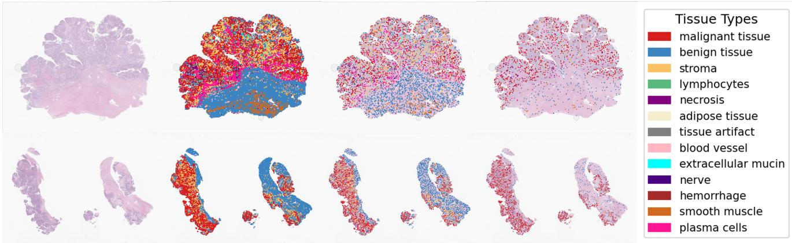
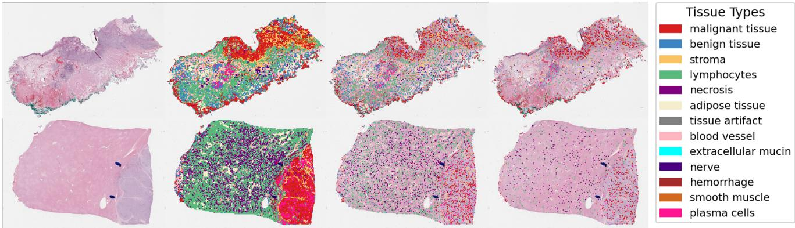
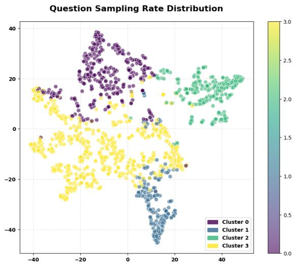
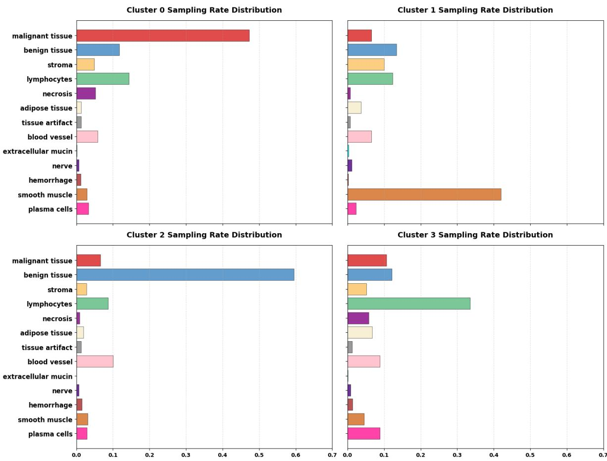

[← 返回 README](../README.md)

# 4. Experiments and Results

## 📌 Preview

Comprehensive evaluation across three benchmarks (SlideBench-VQA, WSI-Bench, In-house Ovarian) spanning 356K QA pairs. HistoSelect achieves SOTA on both close-ended (83.80% avg accuracy) and open-ended tasks (best on 5/6 domain-specific metrics). Ablation studies validate each component, confirm the 70% token reduction, and demonstrate question-aware adaptive sampling patterns via clustering analysis.

---

**Datasets and Preprocessing.** We conduct experiments on three slide-level VQA datasets, including two public benchmarks and one private dataset. The public datasets include 1) SlideBench-VQA [9] comprises 4,560 WSIs and 176K VQA pairs, spanning 10 different cancer types and covering three different scenarios: Microscopy, Diagnosis, and Clinical. 2) WSI-Bench [22] contains 9,850 WSIs and 180K VQA pairs, with scenarios focusing on Morphological analysis, Diagnosis, and Treatment Planning. Finally, to assess the model's generalizability and clinical robustness, we curate a 3) Private Ovarian Dataset. This dataset consists of 375 WSIs and 375 corresponding VQA pairs annotated by pathologists, focusing on key diagnostic features of ovarian cancer, and is used as an independent test set. We followed the CLAM [25] methodology for patch-cutting and feature extraction, processing all patches to a size of 224 x 224.

**Baselines.** We compare our method with several state-of-the-art WSI-based MLLMs. These baselines include models specifically designed for pathological and medical VQA tasks, such as Quilt-LLaVA [32], WSI-VQA [7], LLaVA-Med [20], and SlideChat [9], as well as models specialized for WSI report generation, including MI-Gen [6] and Hist-Gen [13]. We also include the general-purpose MLLM GPT-4o as a non-specialized baseline.

**Evaluation Metrics.** For the closed-ended tasks, we group the questions based on various clinical categories. Performance is evaluated using accuracy. For the open-ended answer generation tasks, we adopt text-generation metrics, including BLEU and ROUGE-L to measure semantic similarity between generated and reference answers. Following WSI-LLaVA [22], we additionally employ two LLM-as-a-judge metrics: WSI-Precision (WSI-P), which evaluates the factual correctness of model responses, and WSI-Relevance (WSI-R), which assesses how well each response aligns with the reference answer in a clinical context.

**Implementation Details.** Following SlideChat [9], we employ the CONCH encoder [26] to extract patch-level features and LongNet [10, 44] for slide-level features, utilizing Qwen2.5-7B-Instruct [40] as our LLM framework. We use the text encoder from CONCH to obtain question embeddings. For all experiments, we adhere to the official data splits of SlideBench-VQA [9] and WSI-Bench [22]. Our training is conducted in two stages: consistent with SlideChat [9], the first stage focuses on projector training for modality alignment. Subsequently, the second stage jointly fine-tunes the projector, the LLM (using LoRA), and our HistoSelect module. Detailed hyperparameter settings are provided in the supplementary material.

> 💡 **Q&A 批注记录**:
>
> **Q**: 为什么选择 CONCH 作为视觉编码器而不是其他 foundation model？
>
> **A**: CONCH 是目前病理图像领域最广泛使用的视觉-语言基础模型之一，它的视觉和文本编码器共享嵌入空间，这对组织分割阶段（CLIP 风格匹配）和 IB 先验中的余弦相似度计算都是必需的。而且，SlideChat 也使用 CONCH，这使得比较更加公平。

### 4.1. Quantitative Results

**Close-ended Selection Performance.** Table 1 presents the close-ended VQA performance of our model against several state-of-the-art baselines across three benchmarks: SlideBench-VQA (TCGA), WSI-Bench (Close), and our In-house Ovarian dataset. We compare our WSI-based method against both thumbnail-based models (such as GPT-4o, Quilt-LLaVA) and other WSI-based models (such as SlideChat). The results clearly demonstrate that our model achieves the best performance across all tested categories, attaining an average score of 83.80% and significantly outperforming all other baseline methods.

*Table 1. Close-ended VQA accuracy (%) across three benchmarks: SlideBench-VQA, WSI-Bench, and our In-house Ovarian dataset. Our method consistently achieves the highest accuracy across all task categories and obtains the best overall average performance.*

<table>
<tr><td rowspan="2">Method</td><td rowspan="2">Input</td><td colspan="3">SlideBench-VQA (TCGA)</td><td colspan="3">WSI-Bench (Close)</td><td>In-house Ovarian</td><td rowspan="2">Average</td></tr>
<tr><td>Microscopy</td><td>Diagnosis</td><td>Clinical</td><td>Morphology</td><td>Diagnosis</td><td>Treatment</td><td>Diagnosis</td></tr>
<tr><td>GPT-4o</td><td>Thumbnail</td><td>39.24</td><td>24.12</td><td>44.67</td><td>47.07</td><td>53.06</td><td>87.50</td><td>-</td><td>49.28</td></tr>
<tr><td>Quilt-LLaVA [32]</td><td>Thumbnail</td><td>52.39</td><td>30.19</td><td>49.33</td><td>94.13</td><td>84.13</td><td>97.92</td><td>70.67</td><td>68.39</td></tr>
<tr><td>LLaVA-Med [20]</td><td>Thumbnail</td><td>52.15</td><td>29.97</td><td>47.33</td><td>91.04</td><td>81.32</td><td>95.83</td><td>70.67</td><td>66.90</td></tr>
<tr><td>SlideChat [9]</td><td>WSI</td><td>83.15</td><td>71.36</td><td>75.33</td><td>91.34</td><td>82.15</td><td>93.75</td><td>69.33</td><td>80.88</td></tr>
<tr><td><b>HistoSelect</b></td><td><b>WSI</b></td><td><b>84.62</b></td><td><b>73.09</b></td><td><b>77.30</b></td><td><b>94.57</b></td><td><b>85.79</b></td><td><b>97.92</b></td><td><b>73.33</b></td><td><b>83.80</b></td></tr>
</table>

> 💡 **Table 1 批读**: 几个值得注意的数据点：
> - **Thumbnail vs WSI**：GPT-4o 用缩略图输入在 SlideBench-VQA 上表现极差（平均 39-45%），验证了 WSI 级别的分析对病理 VQA 的必要性
> - **SlideChat vs HistoSelect**：同为 WSI 输入，HistoSelect 在所有 7 个类别上均优于 SlideChat，平均提升 +2.92%。最大的提升在 Diagnosis（SlideBench 上 +1.73%，WSI-Bench 上 +3.64%），这恰好是需要最精细推理的类别
> - **Treatment 类别天花板**：WSI-Bench 的 Treatment 类别是一个二分类任务，多个模型（Quilt-LLaVA, HistoSelect）都达到了 97.92%，说明该任务可能接近性能上限
> - **In-house Ovarian**：HistoSelect 73.33% vs SlideChat 69.33%，+4.0% 的提升说明选择机制在域外数据上也有效

**Open-ended Generation Performance.** To evaluate the model's open-ended text generation capabilities, we conducted tests on the WSI-Bench benchmark, with results detailed in Table 2. We use BLEU (1-4) and ROUGE-L metrics to assess the quality of Report Generation and WSI metrics to evaluate the domain-specific VQA performance. The experimental results demonstrate the significant advantages of our model. For Report Generation, our model achieves the highest scores across all five metrics, with its BLEU-4 (0.221) and ROUGE-L (0.463) scores notably surpassing other advanced models like Quilt-LLaVA and SlideChat. In the domain-specific VQA tasks, our model obtains the best results in 5 out of 6 metrics, proving its superior and well-balanced open-ended VQA capabilities.

*Table 2. Open-ended VQA performance on the WSI-Bench dataset. We evaluate two tasks: Report Generation and domain-specific VQA. Our method achieves the highest performance across all report-generation metrics and the best results on 5 of 6 domain-specific metrics.*

<table>
<tr><td rowspan="2">Method</td><td colspan="5">Report Generation</td><td colspan="2">Morphology</td><td colspan="2">Diagnosis</td><td colspan="2">Treatment</td></tr>
<tr><td>BLEU-1</td><td>BLEU-2</td><td>BLEU-3</td><td>BLEU-4</td><td>ROUGE-L</td><td>WSI-P</td><td>WSI-R</td><td>WSI-P</td><td>WSI-R</td><td>WSI-P</td><td>WSI-R</td></tr>
<tr><td>GPT-4o</td><td>0.202</td><td>0.069</td><td>0.030</td><td>0.016</td><td>0.132</td><td>0.220</td><td>0.204</td><td>0.472</td><td>0.457</td><td>0.513</td><td>0.704</td></tr>
<tr><td>WSI-VQA [7]</td><td>0.301</td><td>0.225</td><td>0.181</td><td>0.155</td><td>0.343</td><td>0.395</td><td>0.462</td><td>0.436</td><td>0.525</td><td>0.591</td><td>0.595</td></tr>
<tr><td>MI-Gen [6]</td><td>0.403</td><td>0.306</td><td>0.248</td><td>0.209</td><td>0.446</td><td>-</td><td>-</td><td>-</td><td>-</td><td>-</td><td>-</td></tr>
<tr><td>Histo-Gen [13]</td><td>0.406</td><td>0.307</td><td>0.248</td><td>0.208</td><td>0.448</td><td>-</td><td>-</td><td>-</td><td>-</td><td>-</td><td>-</td></tr>
<tr><td>Quilt-LLaVA [32]</td><td>0.421</td><td>0.316</td><td>0.257</td><td>0.216</td><td>0.455</td><td>0.453</td><td>0.484</td><td>0.521</td><td>0.552</td><td>0.751</td><td>0.807</td></tr>
<tr><td>SlideChat [9]</td><td>0.413</td><td>0.312</td><td>0.254</td><td>0.215</td><td>0.450</td><td>0.512</td><td>0.541</td><td>0.501</td><td>0.522</td><td>0.745</td><td>0.712</td></tr>
<tr><td><b>HistoSelect</b></td><td><b>0.431</b></td><td><b>0.324</b></td><td><b>0.262</b></td><td><b>0.221</b></td><td><b>0.463</b></td><td><b>0.538</b></td><td><b>0.589</b></td><td><b>0.542</b></td><td><b>0.587</b></td><td><b>0.766</b></td><td><b>0.801</b></td></tr>
</table>

> 💡 **Table 2 批读**: 开放域生成的结果有几个有趣的观察：
> - **Report Generation**: HistoSelect 全面领先，但提升幅度不大（BLEU-4: 0.221 vs Quilt-LLaVA 0.216）。报告生成的主要挑战可能来自语言生成本身，而不仅仅是补丁选择
> - **WSI-P vs WSI-R**: WSI-Precision（事实正确性）和 WSI-Relevance（临床相关性）在 Morphology 和 Diagnosis 上都有显著提升（如 Morphology WSI-P: 0.538 vs SlideChat 0.512, +2.6%），说明选择更相关的补丁对回答的事实准确性有直接帮助
> - **Treatment 的 WSI-R**: HistoSelect 的 WSI-R (0.801) 略低于 Quilt-LLaVA (0.807)，这是唯一一个 HistoSelect 不是最优的指标，但差距很小
> - **GPT-4o 的异常**: GPT-4o 在 Treatment 的 WSI-R 达到 0.704，比很多专用模型还好，可能是因为 treatment planning 是一个更多依赖通用医学知识而非图像细节的任务

### 4.2. Qualitative Result

**Visualization.** To intuitively demonstrate the effectiveness of our question-aware selection mechanism, we provide qualitative visualizations in Figure 4. The figure illustrates the model's workflow, proceeding from (a) WSI to (b) the tissue segmentation mask, (c) a subset of candidate patches extracted from the tissue regions, and (d) the sparse set of question-relevant patches after our model's selection. As shown, our method successfully filters out a large number of background and diagnostically irrelevant patches, allowing the model to focus its computation and attention on the most salient regions to answer the VQA query.

*Figure 4. Visualization of tissue segmentation and selection process. (a) Original WSI. (b) Tissue segmentation mask. (c) Visualization before selection (a randomly selected subset is shown for clarity). (d) Visualization after selection. Compared to (c), the patches selected by our model in (d) significantly remove non-tumor patches, demonstrating an improved focus on informative tumor-related regions.*

> 💡 **Figure 4 批读**: 对比 (c) 和 (d) 可以直观看到选择效果——(d) 中非肿瘤区域的补丁被大幅移除，模型聚焦在肿瘤相关的信息区域。这是可解释性的最直接体现：病理学家可以逐补丁检查模型"看"了什么来做决策。

**Pathologist's Evaluation.** To validate the practical utility and interpretability of our model from a clinical perspective, we conducted a human evaluation survey with two independent pathologists. We mainly evaluate the model interpretability and performance from two aspects, with a detailed survey in the supplementary material:

1. Tissue segmentation, we presented the pathologists with the original slide and our generated tissue mask. They were asked to rate the following on a 5-point Likert scale (1 = Strongly Disagree, 5 = Strongly Agree):
   - Q1: "How accurate is the tissue segmentation?"

2. Patch selection, we showed the pathologists the visualizations of patches before and after selection for a given question. They were asked to rate:
   - Q2.1: "Does the model filter out a lot of question-irrelevant patches?"
   - Q2.2: "Are the selected patches sufficient to answer the question?"

The detailed average scores are presented in Table 3. We are encouraged to find that the average rating for all four questions exceeded 3.5. This strongly indicates that (1) pathologists find our tissue segmentation accurate, and (2) they confirm that our selection model effectively filters out irrelevant regions while preserving the necessary diagnostic information to answer the clinical question.

*Table 3. Average scores from the pathologist evaluation survey.*

<table>
<tr><td>Category</td><td>Question ID</td><td>Avg. Score (P1)</td><td>Avg. Score (P2)</td></tr>
<tr><td>Tissue Seg.</td><td>Q1 Accuracy</td><td>4.17</td><td>3.67</td></tr>
<tr><td rowspan="2">Patch Selection</td><td>Q2.1 Question-relevant</td><td>4.80</td><td>3.87</td></tr>
<tr><td>Q2.2 Answer-relevant</td><td>4.67</td><td>3.73</td></tr>
</table>

> 💡 **Table 3 批读**: 病理学家评估显示：
> - 两位病理学家对组织分割的评分分别是 4.17 和 3.67（满分 5），表明分割质量基本令人满意但仍有改进空间
> - Q2.1（是否过滤了问题不相关的补丁）平均 4.80（P1）和 3.87（P2）——P1 给出了极高评价
> - Q2.2（所选补丁是否足以回答问题）平均 4.67（P1）和 3.73（P2）——两位病理学家的评分一致性较高，都认为选择结果保留了必要的诊断信息
> - 注意 P1 的系统性高于 P2（所有 3 项），这反映了病理学家之间评估风格的自然差异

### 4.3. Ablation Studies

To validate the effectiveness of HistoSelect, we conduct a series of ablation studies. We analyze three key aspects of our model: (1) the superiority of our learned selection mechanism against alternative strategies, (2) the contribution of each component in our hierarchical framework, and (3) the impact of the token budget on model performance.

**Selection Mechanism.** In Table 4, we first compare our full model against alternative selection baselines, all constrained to the same token budget. The poor performance of random sampling serves as a lower bound, confirming that intelligent selection is critical. While the diversity-based method DivPrune [3] performs better, it still falls short of our model, indicating that selecting question-relevant patches is more important than simply selecting diverse ones. Most importantly, we evaluate a simple similarity baseline that replaces our learnable selectors (F\_group and F\_patch) with the non-learnable pseudo-prior parameters pⱼᵍ and p\_iᵖ (derived from cosine similarity) directly. Its inferior performance strongly validates our core hypothesis: an end-to-end learned policy, regularized by the IB objective, is essential for identifying the most salient visual evidence and significantly outperforms static, similarity-based heuristics.

*Table 4. Selection Mechanism Ablation.*

<table>
<tr><td>Accuracy</td><td>Morphology</td><td>Diagnosis</td><td>Treatment</td></tr>
<tr><td>Random Sampling</td><td>88.84</td><td>78.02</td><td>91.67</td></tr>
<tr><td>DivPrune</td><td>90.01</td><td>80.99</td><td>93.75</td></tr>
<tr><td>Simple Similarity</td><td>92.22</td><td>81.98</td><td>93.75</td></tr>
<tr><td><b>Ours</b></td><td><b>94.57</b></td><td><b>85.79</b></td><td><b>97.92</b></td></tr>
</table>

> 💡 **消融解读 - Table 4**: 选择机制的消融实验揭示了几个关键发现：
> - **Random vs DivPrune**: +1.17% (Morphology), +2.97% (Diagnosis) —— 多样性采样优于随机，说明选择"有代表性的"补丁比完全随机好
> - **DivPrune vs Simple Similarity**: +2.21% (Morphology), +0.99% (Diagnosis) —— 问题相关的相似度优于纯粹的多样性，说明"与问题相关"比"彼此多样"更重要
> - **Simple Similarity vs Ours (learned)**: +2.35% (Morphology), +3.81% (Diagnosis), +4.17% (Treatment) —— 学习的选择策略显著优于静态相似度。这是论文核心论点的强有力证据：**端到端学习的选择策略，在 IB 目标的正则化下，能比简单的余弦相似度启发式方法找到更优的视觉证据**

**Model Components.** In Table 5, we dissect our hierarchical architecture to understand each component. The baseline model, which defaults to Random Sampling, yields the poorest results. Removing only the patch selector (F\_patch) forces the model to rely on coarse group selection, and the subsequent performance drop highlights the necessity of fine-grained selection for critical patches. Conversely, removing the group sampler (F\_group) degrades the model to a "flat" selection mechanism, forcing the patch selector to search globally across all N patches. Its poor performance relative to our full model confirms the benefit of our coarse-to-fine approach, as the group sampler effectively narrows the search space. The superior performance of our full model demonstrates that the group sampler and the patch selector work synergistically.

*Table 5. Model Component Ablation Study.*

<table>
<tr><td>Accuracy</td><td>Morphology</td><td>Diagnosis</td><td>Treatment</td></tr>
<tr><td>Random Sampling</td><td>88.84</td><td>78.02</td><td>91.67</td></tr>
<tr><td>w/o Group Sampler</td><td>91.78</td><td>81.82</td><td>95.83</td></tr>
<tr><td>w/o Patch Selector</td><td>92.07</td><td>81.32</td><td>93.75</td></tr>
<tr><td><b>Ours</b></td><td><b>94.57</b></td><td><b>85.79</b></td><td><b>97.92</b></td></tr>
</table>

> 💡 **消融解读 - Table 5**: 组件消融揭示层级协同效应：
> - **w/o Group Sampler** (只有 Patch Selector)：在全局 N 个补丁中搜索 → Morphology 降至 91.78（-2.79），Diagnosis 降至 81.82（-3.97）。说明在数万补丁的搜索空间中，"平坦"选择很容易被噪声淹没
> - **w/o Patch Selector** (只有 Group Sampler)：只能做粗粒度的组级别选择 → Morphology 降至 92.07（-2.50），Diagnosis 降至 81.32（-4.47）。说明组内也有大量冗余，需要细粒度选择
> - **协同效果**：完整模型的 Diagnosis (85.79) 比两个单组件的平均值 (~81.57) 高出 4.22 点，说明 group sampler 和 patch selector 的协同不是简单的叠加

**Impact of Token Budget.** In Table 6, we analyze the performance of HistoSelect under different token budget limits. We observe that performance improves as the token count limit increases from 1k to 5k, indicating the benefit of more visual context. However, the model achieves its peak performance at 5k tokens. Notably, increasing the limit further to 10k tokens provides no additional performance gain and even shows a slight degradation, likely due to the introduction of redundant information. This result is significant: HistoSelect validates that a large portion of a WSI is redundant for a specific question, as it achieves its optimal accuracy by selecting a compact, sufficient subset of only 30% of the total patches. This translates to a 70% reduction in token computation while maximizing diagnostic accuracy.

*Table 6. Ablation Study on # of Tokens.*

<table>
<tr><td>Accuracy</td><td>Morphology</td><td>Diagnosis</td><td>Treatment</td></tr>
<tr><td>10k Tokens</td><td>94.12</td><td>85.12</td><td>97.92</td></tr>
<tr><td><b>5k Tokens</b></td><td><b>94.57</b></td><td><b>85.79</b></td><td><b>97.92</b></td></tr>
<tr><td>2k Tokens</td><td>93.83</td><td>83.80</td><td>95.83</td></tr>
<tr><td>1k Tokens</td><td>91.19</td><td>82.15</td><td>95.83</td></tr>
</table>

> 💡 **消融解读 - Table 6**: Token 预算的影响验证了论文的核心主张：
> - **1k → 5k**: 单调提升，说明更多的视觉上下文确实有帮助
> - **5k → 10k**: Morphology 微降 (94.57→94.12)，Diagnosis 微降 (85.79→85.12) —— 更多 token 反而有害！这是反直觉但符合 IB 理论的结果：更多的输入信息如果与任务无关，会增加冗余、稀释有效信号
> - **70% 减少**：5k token 约占总补丁的 30%，意味着使用 HistoSelect 可以在保持甚至提升性能的同时，将 LLM 的计算量减少 70%

---

## Supplementary Experiments

*The following content is from the supplementary material of the paper, providing additional quantitative results, qualitative visualizations, implementation details, and extended ablation studies.*

*Figure 5. The user interface for the Tissue Segmentation Survey. The central area shows a side-by-side comparison of the original WSI and the tissue segmentation result. The right legend clarifies the tissue classes, and the bottom section collects the pathologists' rating.*

*Figure 6. The user interface for the Patch Selection Survey. The view visualizes the "Before" and "After" states of patch selection. Note that the input question and ground truth answer are displayed below the images to provide necessary context for the pathologists' evaluation.*

> 💡 **Figure 5-6 批读**: 这是评估工具的 UI 截图。两个界面分别对应组织分割评估和补丁选择评估。值得注意的是，补丁选择评估中同时展示了"Before"和"After"的补丁分布，并明确显示了问题和正确答案，确保病理学家在充分了解临床上下文的情况下进行评估。

### In-house Ovarian Dataset

To demonstrate the generalizability of our proposed model, we curated a small-scale, in-house ovarian dataset. This dataset is compiled from WSIs of ovarian tissues and formatted into question-answer pairs, focusing on distinct histological phenotypes visible within the WSIs. The dataset includes four primary diagnostic categories, based on the observed tumor morphology. In total, the dataset comprises 375 question-answer pairs. The distribution of samples across the four categories is as follows: endometrioid (n = 81), clear cell carcinoma (n = 82), high grade serous carcinoma (n = 123), and serous borderline carcinoma (n = 89).

A typical question within the dataset is structured as a multiple-choice classification task based on visual features observed in the WSI. An example is provided below:

*Example Question-Answer Pair: Based on the observed features, what do you think is the correct histological classification of the tumor?*

*(a) endometrioid*

*(b) clear cell carcinoma*

*(c) high grade serous carcinoma*

*(d) serous borderline carcinoma*

### Implementation Details (Supplementary)

In the first stage, following SlideChat [9], the projector and slide encoder are set to be trainable while the remaining components are frozen. This stage utilizes the WSI-caption data for initial alignment, employing a learning rate of 1e-3 for 3 epochs. In the second stage, we train the entire model for 2 epochs with a learning rate of 1e-4 and a batch size of 1. Specifically, we apply LoRA to the LLM to ensure efficient parameter updates. For the hyperparameters for our group sampler and patch selector, we employ a linear warmup schedule for the first 5000 iterations. During this warmup, the β\_g weight increases from 0 to 0.1, and the β\_p weight increases from 0 to 0.2, then they are held constant.

> 💡 **Q&A 批注记录**:
>
> **Q**: 为什么使用 warmup schedule 来设置 β 值？
>
> **A**: 直接使用最终 β 值可能导致训练初期选择器过于激进地压缩信息，而此时选择器尚未学会良好的选择策略。Warmup 让选择器先"看到"足够多的信息（β=0 时没有压缩损失），在 VQA 损失的引导下逐渐学会如何选择后，再逐步引入压缩压力。这是训练 IB 模型时的常见实践。

### Additional Quantitative Results

*Figure 7. The sample distribution for the test set.*

Figure 7 illustrates the sample distribution across different task categories in SlideBench-VQA and WSI-Bench. To further validate the reliability of HistoSelect, we report detailed macro-averaged metrics (Macro-Precision, Macro-Recall, and Macro-F1) across these two major benchmarks. As shown in Table 7 and Table 8, our method consistently achieves superior performance in these balanced metrics on both SlideBench-VQA and WSI-Bench. These improvements demonstrate that our approach effectively identifies task-relevant patches and generalizes well across various categories.

*Table 7. Quantitative results on SlideBench-VQA (TCGA). Performance is evaluated using accuracy and macro-averaged metrics.*

<table>
<tr><td></td><td colspan="4">Microscopy</td><td colspan="4">Diagnosis</td><td colspan="4">Clinical</td></tr>
<tr><td>Method</td><td>Acc.</td><td>Macro-P</td><td>Macro-R</td><td>Macro-F1</td><td>Acc.</td><td>Macro-P</td><td>Macro-R</td><td>Macro-F1</td><td>Acc.</td><td>Macro-P</td><td>Macro-R</td><td>Macro-F1</td></tr>
<tr><td>GPT-4o</td><td>39.24</td><td>36.12</td><td>39.45</td><td>35.54</td><td>24.12</td><td>22.83</td><td>24.34</td><td>21.72</td><td>44.67</td><td>42.93</td><td>44.95</td><td>43.58</td></tr>
<tr><td>Quilt-LLaVA [32]</td><td>52.39</td><td>46.75</td><td>50.09</td><td>46.84</td><td>30.19</td><td>27.94</td><td>30.34</td><td>27.15</td><td>49.33</td><td>47.01</td><td>48.91</td><td>47.54</td></tr>
<tr><td>LLaVA-Med [20]</td><td>52.15</td><td>46.30</td><td>49.80</td><td>46.51</td><td>29.97</td><td>27.84</td><td>29.93</td><td>26.86</td><td>47.33</td><td>45.12</td><td>47.19</td><td>45.58</td></tr>
<tr><td>SlideChat [9]</td><td>83.15</td><td>81.77</td><td>78.50</td><td>79.70</td><td>71.36</td><td>71.80</td><td>65.22</td><td>67.52</td><td>75.33</td><td>73.84</td><td>72.74</td><td>72.98</td></tr>
<tr><td><b>Ours</b></td><td><b>84.62</b></td><td><b>80.79</b></td><td><b>80.47</b></td><td><b>80.33</b></td><td><b>73.09</b></td><td><b>72.10</b></td><td><b>68.08</b></td><td><b>69.22</b></td><td><b>77.30</b></td><td><b>73.97</b></td><td><b>74.24</b></td><td><b>73.94</b></td></tr>
</table>

*Table 8. Quantitative results on WSI-Bench (Close-ended). Performance is evaluated using accuracy and macro-averaged metrics.*

<table>
<tr><td></td><td colspan="4">Morphology</td><td colspan="4">Diagnosis</td><td colspan="4">Treatment (Binary)</td></tr>
<tr><td>Method</td><td>Acc.</td><td>Macro-P</td><td>Macro-R</td><td>Macro-F1</td><td>Acc.</td><td>Macro-P</td><td>Macro-R</td><td>Macro-F1</td><td>Acc.</td><td>Macro-P</td><td>Macro-R</td><td>Macro-F1</td></tr>
<tr><td>GPT-4o</td><td>47.07</td><td>42.89</td><td>47.29</td><td>43.19</td><td>53.06</td><td>49.02</td><td>53.37</td><td>49.27</td><td>87.50</td><td>79.12</td><td>83.76</td><td>81.05</td></tr>
<tr><td>Quilt-LLaVA [32]</td><td>94.13</td><td>91.74</td><td>91.19</td><td>91.42</td><td>84.13</td><td>81.35</td><td>78.68</td><td>79.63</td><td>97.92</td><td>98.75</td><td>94.44</td><td>96.42</td></tr>
<tr><td>LLaVA-Med [20]</td><td>91.04</td><td>86.21</td><td>87.59</td><td>86.83</td><td>81.32</td><td>77.80</td><td>74.81</td><td>76.02</td><td>95.83</td><td>93.16</td><td>93.16</td><td>93.16</td></tr>
<tr><td>SlideChat [9]</td><td>91.34</td><td>86.11</td><td>87.92</td><td>86.97</td><td>82.15</td><td>79.15</td><td>75.58</td><td>77.02</td><td>93.75</td><td>88.68</td><td>91.88</td><td>90.16</td></tr>
<tr><td><b>Ours</b></td><td><b>94.57</b></td><td><b>92.66</b></td><td><b>91.34</b></td><td><b>91.85</b></td><td><b>85.79</b></td><td><b>85.03</b></td><td><b>79.45</b></td><td><b>81.70</b></td><td><b>97.92</b></td><td><b>95.00</b></td><td><b>98.72</b></td><td><b>96.72</b></td></tr>
</table>

> 💡 **Table 7-8 批读**: Macro-averaged 指标的关键发现：
> - Morphology 上的 Quilt-LLaVA vs SlideChat: Quilt-LLaVA 的 Macro-F1 (91.42) 实际上超过 SlideChat (86.97)，说明 Quilt-LLaVA 在缩略图级别上对形态学分析有优势。但 HistoSelect (91.85) 仍超越两者
> - Diagnosis 上，HistoSelect 的 Macro-P (85.03) 显著高于 SlideChat (79.15)，说明选择机制不仅提升了整体准确率，还改善了对少数类别的识别能力
> - Macro-R 的提升 (79.45 vs 75.58) 在 Diagnosis 上尤为突出，说明 HistoSelect 选择的补丁有助于减少漏诊

### Additional Qualitative Results

**Results on Public Dataset.** Figure 8 showcases the visualization results on the public TCGA dataset from WSI-Bench [22]. Consistent with the findings in the main text, our model demonstrates strong generalization capabilities. It successfully identifies and retains key histological features required to answer the question while discarding a significant portion of irrelevant and redundant patches, thereby ensuring that the downstream reasoning is primarily driven by the most informative patches.

*Figure 8. Additional visualization of the selection process on the public WSI-Bench dataset. (a) Original WSI. (b) The tissue segmentation mask. (c) A visualization of candidate patches extracted from tissue regions prior to selection. (d) The sparse set of patches retained by our model. As observed in (d), the model effectively suppresses irrelevant regions, focusing the attention solely on the informative patches required for the VQA task.*

**Results on Private Dataset.** To assess the robustness of our model in a real-world clinical setting, Figure 9 illustrates the selection process on our private ovarian dataset. Despite potential domain shifts such as variations in staining protocols and scanner properties compared to the public dataset, our question-aware selector maintains high precision. It effectively selects informative regions relevant to the query, verifying the method's applicability to proprietary clinical workflows.

*Figure 9. Visualization of the selection process on the private Ovarian dataset. The figure follows the same pipeline as the main manuscript and Figure 8: (a) Original WSI. (b) Tissue segmentation mask. (c) Patches before selection. (d) Patches after selection. These results demonstrate the robustness of our method against domain shifts common in private clinical data. The model successfully filters out non-informative tissue, preserving only the regions essential for accurate question answering.*

**Sampling Rate Distribution Analysis.** To investigate the sampling rate distribution across different questions, we conducted a quantitative analysis on the Diagnosis and Morphology subset of the WSI-Bench dataset [22]. Specifically, we represented the tissue group sampling rate for each question as a 13-dimensional vector, where each dimension corresponds to the normalized sampling rate of a specific tissue component. We then applied K-means clustering to these vectors and visualized the resulting groupings using t-SNE, as shown in Figure 11. The emergence of four distinct clusters (K = 4) demonstrates that our model generates diverse and structured sampling patterns in the feature space. This grouping behavior confirms that the selection mechanism effectively navigates the complex composition of WSIs by adaptively prioritizing different histological tissue types based on the semantic focus of the question, rather than collapsing into a fixed, question-agnostic distribution.

*Figure 11. Visualization of question-aware sampling distributions. We visualize the 13-dimensional sampling rate vectors from the WSI-Bench Diagnosis and Morphology test set using t-SNE.*

*Figure 10. Mean sampling rate distribution bar charts for identified clusters. We report the average 13-dimensional sampling vectors for the four clusters discovered in Fig. 11. Each cluster exhibits a unique sampling rate pattern.*

> 💡 **Figure 10-11 批读 - 采样分布分析**: 这是论文最有趣的实验之一，展示了 HistoSelect 的**问题感知能力**：
> - 使用 13 维组织类型采样率向量 + K-means (K=4) + t-SNE，发现采样模式形成 4 个清晰的聚类
> - 四个聚类对应四种临床问题类型，每种有不同的组织采样偏好：
>   - **Cluster 0 (肿瘤分类)**：优先采样恶性组织
>   - **Cluster 1 (细胞形态学)**：偏好平滑肌和基质成分
>   - **Cluster 2 (组织结构)**：偏好良性组织和周围结构
>   - **Cluster 3 (肿瘤浸润)**：集中在淋巴细胞和细胞外成分
> - 这意味着模型**不是**使用一个固定的显著性图，而是**根据问题的语义意图动态调整**不同组织类型的采样优先级

The cluster-specific sampling distributions, as visualized in Figure 10, illustrate that our model develops distinct, task-driven sampling patterns. Each cluster corresponds to a specific clinical focus in the questions:

- **Cluster 0 (Tumor Classification)**: Prioritizes malignant tissue, aligning with questions focused on histological tumor grading and classification.
  - Example: *Based on the observed features, what do you think is the correct histological classification of the tumor? A) Adenocarcinoma B) Small cell carcinoma C) Squamous cell carcinoma D) Large cell carcinoma*

- **Cluster 1 (Cellular Morphology)**: Shifts focus toward smooth muscle and stromal components, providing the necessary context for evaluating cellular variability and mitotic activity.
  - Example: *What are the notable features of the cellular morphology in this slide? A) Nuclei are uniform in appearance, showing no signs of active division. B) There is minimal variability in nuclear size, with a low rate of cell division. C) Nuclei appear extremely pleomorphic, with a very high rate of mitotic activity. D) There is moderate variability in nuclear size and shape, with a moderate rate of cell division and presence of single cells.*

- **Cluster 2 (Tissue Architecture)**: Shows a strong preference for benign tissue and surrounding structures, which is essential for assessing the overall microanatomy and glandular patterns.
  - Example: *What observations can you make about the tissue architecture on this slide? A) The tumor forms well-organized acinar structures with a clear glandular pattern. B) The tumor is characterized by prominent chicken-wire vasculature providing stroma. C) Tumor cells create extensive solid sheets, with a completely homogeneous pattern. D) The tissue maintains normal microanatomy with minimal deviation.*

- **Cluster 3 (Tumor Infiltration)**: Concentrates on lymphocytes and extracellular components, capturing the critical interface where tumor cells infiltrate the stroma and adipose layers.
  - Example: *What is the observed pattern of tumor infiltration in this specimen? A) Tumor cells are limited to the submucosal layer without muscularis propria involvement. B) Tumor cells infiltrate the stroma, extending into the muscularis propria and adipose tissue. C) Tumor cells remain within glandular structures without stromal invasion. D) There is only infiltration into the adipose tissue, sparing the submucosal layer.*

This clear divergence confirms that our selection mechanism is question-aware. Instead of relying on a static saliency map, the model dynamically re-prioritizes different histological tissue types based on the semantic intent of the question, ensuring that the most relevant patches are selected for each specific question.

### Extended Ablation Studies

In this section, we conduct extensive ablation studies to evaluate the effectiveness of the proposed components in HistoSelect. We first analyze the impact of hyperparameters β\_g and β\_p in our loss function, which control the information bottleneck at the group sampler and patch selector levels, respectively. Subsequently, we investigate the influence of different training strategies and assess the model-agnostic generalization of our selector modules across various base models. Finally, a group selection analysis is performed to demonstrate the critical role of group-level selection in handling complex multi-tissue reasoning tasks.

**Impact of β\_g for the Group Sampler.** Table 9 reports the model performance under different values of β\_g ∈ {0, 0.1, 0.2, 0.3} while keeping β\_p fixed. We observe that when β\_g = 0, the group sampler lacks the necessary regularization to filter out irrelevant tissue groups, leading to a lower signal-to-noise ratio and suboptimal performance. As β\_g increases to 0.2, the model effectively suppresses background noise at the group level, achieving the best overall accuracy across all tasks. However, further increasing β\_g to 0.3 results in a performance drop. This suggests that an overly aggressive penalty causes the sampler to excessively reduce the sampling rate of tissue groups that contain necessary contextual information.

*Table 9. Ablation Study on the weight β\_g for the group sampler.*

<table>
<tr><td>β_g</td><td>Morphology</td><td>Diagnosis</td><td>Treatment</td></tr>
<tr><td>0</td><td>91.78</td><td>81.82</td><td>95.83</td></tr>
<tr><td>0.1</td><td>93.39</td><td>84.13</td><td>95.83</td></tr>
<tr><td><b>0.2</b></td><td><b>94.57</b></td><td><b>85.79</b></td><td><b>97.92</b></td></tr>
<tr><td>0.3</td><td>93.10</td><td>83.25</td><td>93.75</td></tr>
</table>

> 💡 **消融解读 - Table 9 β\_g**:
> - β\_g=0 → β\_g=0.2: Diagnosis 从 81.82 提升至 85.79 (+3.97)，说明组级别压缩至关重要——不让模型在所有组织组上均等采样
> - β\_g=0.2 → β\_g=0.3: 性能下降（Diagnosis -2.54），说明过度压缩会丢失必要的上下文信息，如某些"背景"组织在特定问题下可能是关键证据

**Impact of β\_p for the Patch Selector.** Table 10 examines the effect of the patch-level weight β\_p ∈ {0, 0.05, 0.10, 0.15}. Similar to the group level, setting β\_p = 0 tends to retain a large number of redundant patches, which introduces potential interference for the answer predictor. We find that setting β\_p = 0.10 yields the optimal balance, allowing the model to identify the most distinct and discriminative patches without losing critical information. Conversely, setting β\_p too high (e.g., 0.15) leads to over-pruning, where the model is penalized for retaining informative patches, causing a loss of fine-grained details essential for accurate diagnosis and treatment prediction.

*Table 10. Ablation study on the weight β\_p for the patch selector.*

<table>
<tr><td>β_p</td><td>Morphology</td><td>Diagnosis</td><td>Treatment</td></tr>
<tr><td>0</td><td>92.07</td><td>81.32</td><td>93.75</td></tr>
<tr><td>0.05</td><td>93.25</td><td>84.23</td><td>95.83</td></tr>
<tr><td><b>0.10</b></td><td><b>94.57</b></td><td><b>85.79</b></td><td><b>97.92</b></td></tr>
<tr><td>0.15</td><td>93.83</td><td>83.74</td><td>95.83</td></tr>
</table>

> 💡 **消融解读 - Table 9 vs Table 10**: 对比两个 β 的最佳值有启发意义：
> - β\_g 最佳值为 0.2，β\_p 最佳值为 0.1
> - β\_g > β\_p: 组级别需要更强的压缩，因为你要大幅减少不相关组织组的注意力
> - β\_p 较小：在已选择的组织组内，应该保留更多的补丁多样性以捕获细粒度信息

**Impact of Training Strategies.** Beyond hyperparameter tuning, we investigate whether extending the training procedure further impacts performance. As shown in Table 11, while the initial joint training yields strong results, conducting an additional epoch of training specifically for the sampler or selector modules proves beneficial. In particular, performing one extra epoch for the group sampler achieves the highest performance across most tasks. This suggests that after the joint training stage has established a solid foundation, the group sampler can further benefit from a dedicated optimization phase.

*Table 11. Ablation on training strategies.*

<table>
<tr><td>Training Strategy</td><td>Morphology</td><td>Diagnosis</td><td>Treatment</td><td>Avg.</td></tr>
<tr><td>Joint Training</td><td>94.57</td><td>85.79</td><td>97.92</td><td>92.76</td></tr>
<tr><td>Joint + Patch Selector</td><td>94.71</td><td>85.95</td><td>97.92</td><td>92.86</td></tr>
<tr><td><b>Joint + Group Sampler</b></td><td><b>95.15</b></td><td><b>86.11</b></td><td><b>97.92</b></td><td><b>93.06</b></td></tr>
</table>

**Ablation with Different Base Models.** To verify the model-agnostic effectiveness of HistoSelect, we conduct an experiment using Gemini 3 Flash as a frozen reasoning engine. Specifically, we randomly sample 200 cases from WSI-Bench and compare two input strategies: (1) a baseline using 100 randomly sampled patches with the question, and (2) using the top-100 patches selected by HistoSelect with the same question. As shown in Table 12, our method yields a consistent performance boost even for a stronger foundation model. This demonstrates our model's ability to filter redundant noise and identify task-relevant tokens independently of the base model's reasoning capacity.

*Table 12. Performance comparison on WSI-Bench (200 samples).*

<table>
<tr><td>Method</td><td>ACC</td><td>Macro-P</td><td>Macro-R</td><td>Macro-F1</td></tr>
<tr><td>Gemini 3 Flash</td><td>59.5</td><td>57.0</td><td>60.0</td><td>57.0</td></tr>
<tr><td><b>Gemini 3 Flash + HistoSelect</b></td><td><b>62.5</b></td><td><b>58.0</b></td><td><b>64.0</b></td><td><b>59.0</b></td></tr>
</table>

> 💡 **消融解读 - Table 12**: 这是一个重要的泛化性实验。HistoSelect 的选择模块即使搭配不同的基础模型（Gemini 3 Flash vs Qwen2.5-7B），仍然能够带来一致的性能提升（+3.0% ACC）。这证明选择模块的价值独立于下游推理引擎，是一种即插即用的前置过滤模块。

**Impact of Group Selection.** We further conduct an analysis by comparing our base model with a version using "Ideal Group Selection" (i.e., perfect identification of relevant tissue regions). As reported in Table 13, better group selection consistently leads to higher performance. Notably, the gain is more significant for multi-tissue questions (e.g., tumor infiltration patterns) compared to single-tissue ones (e.g., tumor detection). This highlights that the group sampler is particularly essential for handling complex clinical reasoning that requires cross-tissue contextual integration.

*Table 13. Ablation on group selection.*

<table>
<tr><td>Question Type</td><td>Base</td><td>Base + Ideal Group</td><td>Gain (∆)</td></tr>
<tr><td>Single-tissue (Easy)</td><td>85.0</td><td>87.0</td><td>+2.0</td></tr>
<tr><td>Multi-tissue (Hard)</td><td>73.0</td><td>79.0</td><td>+6.0</td></tr>
</table>

> 💡 **消融解读 - Table 13**: 理想组选择的上界分析有两个关键发现：
> - **单组织问题** (如肿瘤检测)：从理想组选择获益有限 (+2.0%)，因为答案主要依赖一个组织类型
> - **多组织问题** (如肿瘤浸润模式)：理想组选择带来巨大提升 (+6.0%)，因为答案需要整合跨组织类型的上下文信息
> - 这说明组采样器的改进空间主要集中在复杂的多组织推理任务上，也为未来工作指明了方向——改进组采样器（使其更接近"理想"水平）可能带来更大的性能提升

## 🔖 Summary

HistoSelect achieves SOTA across three benchmarks (356K QA pairs): 83.80% avg close-ended accuracy and best on 5/6 open-ended metrics. Key findings include: (1) learned selection significantly outperforms static similarity heuristics (+3.81% Diagnosis), (2) group and patch selectors work synergistically (full model > either alone by >4 points), (3) peak performance at 5k tokens (70% reduction; 10k degrades performance), (4) question-aware sampling confirmed by clustering analysis showing 4 distinct sampling patterns aligned with clinical question types, (5) pathologist evaluation validates both segmentation (avg >3.5/5) and selection quality, and (6) model-agnostic effectiveness demonstrated with Gemini 3 Flash (+3% ACC). Extended ablation confirms optimal β\_g=0.2, β\_p=0.1, and the group sampler is especially critical for complex multi-tissue questions.
